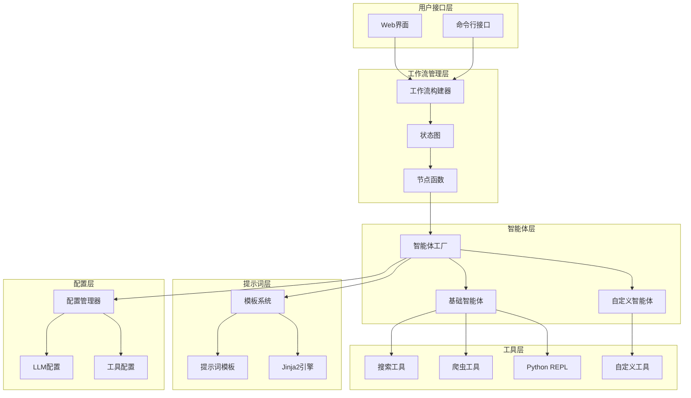
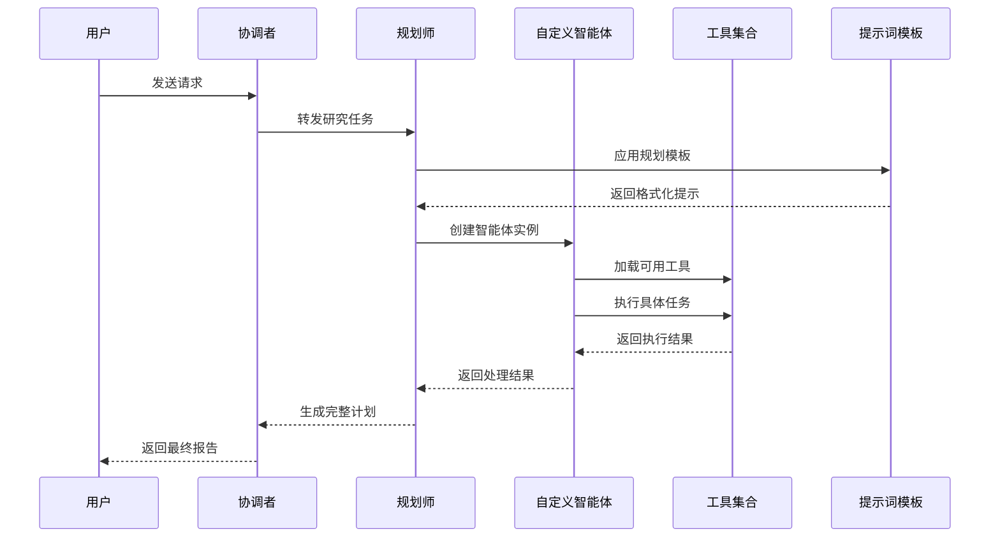
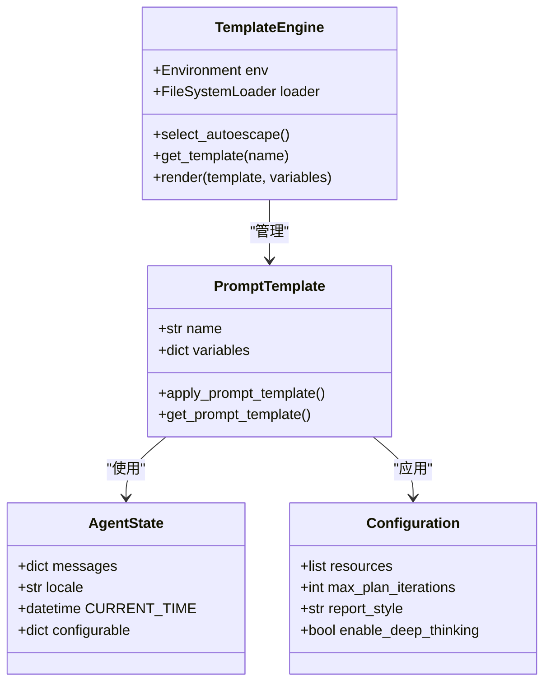
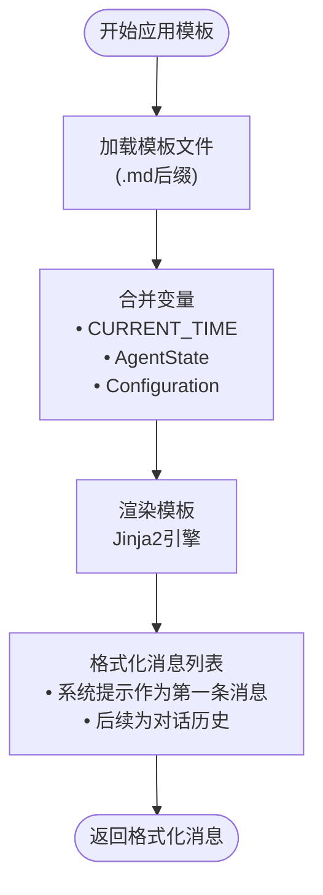
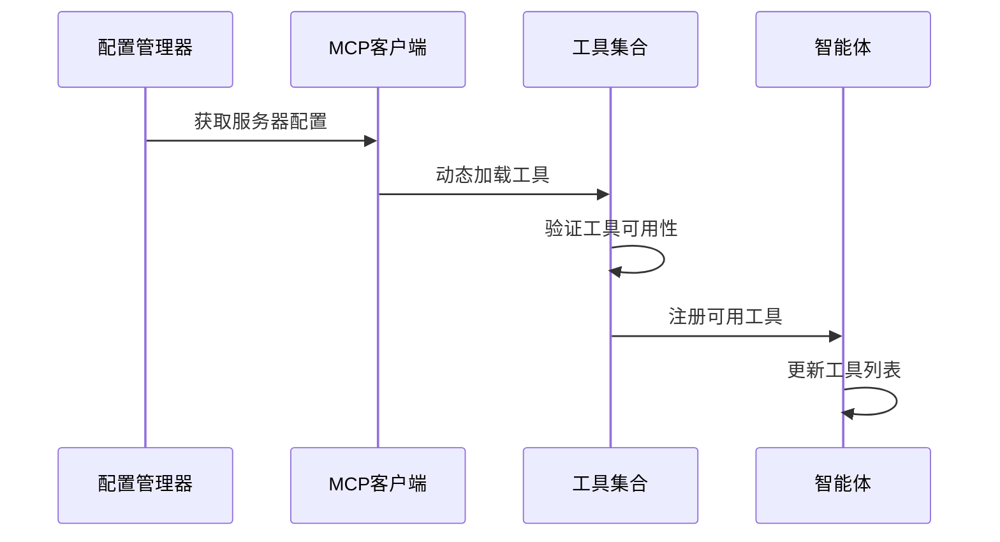
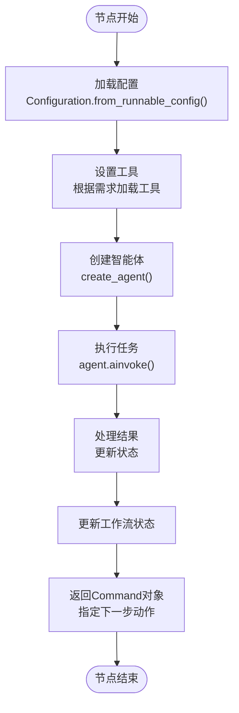
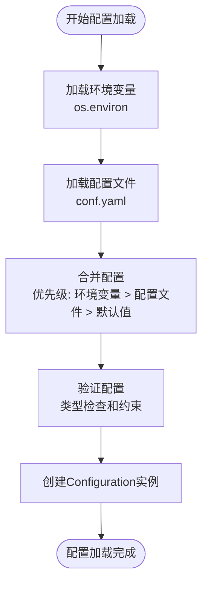

# 智能体扩展指南

<cite>
**本文档引用的文件**
- [agents.py](file://src/agents/agents.py)
- [template.py](file://src/prompts/template.py)
- [agents.py](file://src/config/agents.py)
- [nodes.py](file://src/graph/nodes.py)
- [builder.py](file://src/graph/builder.py)
- [coordinator.md](file://src/prompts/coordinator.md)
- [researcher.md](file://src/prompts/researcher.md)
- [search.py](file://src/tools/search.py)
- [configuration.py](file://src/config/configuration.py)
- [__init__.py](file://src/tools/__init__.py)
</cite>

## 目录
1. [简介](#简介)
2. [项目架构概览](#项目架构概览)
3. [智能体基础架构](#智能体基础架构)
4. [智能体工厂模式详解](#智能体工厂模式详解)
5. [提示词模板系统](#提示词模板系统)
6. [工具集成机制](#工具集成机制)
7. [创建工作流节点](#创建工作流节点)
8. [创建数据分析智能体示例](#创建数据分析智能体示例)
9. [智能体配置管理](#智能体配置管理)
10. [最佳实践指南](#最佳实践指南)
11. [故障排除](#故障排除)
12. [总结](#总结)

## 简介

deer-flow 是一个基于 LangGraph 的智能体协作平台，支持多种类型的智能体协同完成复杂的任务。本指南将详细介绍如何为 deer-flow 系统创建新的智能体类型，包括智能体的设计原理、工厂模式实现、提示词模板系统以及与工作流图的集成方式。

系统采用模块化设计，通过工厂模式统一管理不同类型的智能体，支持动态加载工具和配置，提供了强大的扩展能力。

## 项目架构概览

deer-flow 系统采用分层架构设计，主要包含以下核心组件：



**图表来源**
- [builder.py](file://src/graph/builder.py#L46-L86)
- [nodes.py](file://src/graph/nodes.py#L0-L511)
- [agents.py](file://src/agents/agents.py#L0-L18)

## 智能体基础架构

deer-flow 的智能体系统基于 LangGraph 的 `create_react_agent` 构建，提供了统一的智能体创建和管理接口。

### 核心设计理念

1. **工厂模式**: 统一管理智能体创建过程
2. **配置驱动**: 通过配置文件控制智能体行为
3. **工具集成**: 支持动态加载各种工具
4. **提示词模板**: 基于 Jinja2 的灵活模板系统

### 智能体生命周期



**图表来源**
- [nodes.py](file://src/graph/nodes.py#L150-L200)
- [agents.py](file://src/agents/agents.py#L10-L18)

**章节来源**
- [agents.py](file://src/agents/agents.py#L0-L18)
- [nodes.py](file://src/graph/nodes.py#L0-L511)

## 智能体工厂模式详解

### 工厂函数设计

deer-flow 使用工厂函数 `create_agent` 来统一管理智能体的创建过程：

```python
def create_agent(agent_name: str, agent_type: str, tools: list, prompt_template: str):
    """工厂函数，用于创建具有统一配置的智能体。"""
    return create_react_agent(
        name=agent_name,
        model=get_llm_by_type(AGENT_LLM_MAP[agent_type]),
        tools=tools,
        prompt=lambda state: apply_prompt_template(prompt_template, state),
    )
```

### 工厂模式的优势

1. **统一配置**: 所有智能体都使用相同的 LLM 配置
2. **模板应用**: 自动应用提示词模板
3. **工具管理**: 统一的工具加载机制
4. **可扩展性**: 易于添加新的智能体类型

### LLM 类型映射

系统预定义了不同智能体类型的 LLM 配置映射：

```python
AGENT_LLM_MAP: dict[str, LLMType] = {
    "coordinator": "basic",
    "planner": "basic",
    "researcher": "basic",
    "coder": "basic",
    "reporter": "basic",
    "podcast_script_writer": "basic",
    "ppt_composer": "basic",
    "prose_writer": "basic",
    "prompt_enhancer": "basic",
}
```

**章节来源**
- [agents.py](file://src/agents/agents.py#L10-L18)
- [agents.py](file://src/config/agents.py#L0-L20)

## 提示词模板系统

### 模板引擎架构

deer-flow 使用 Jinja2 模板引擎来管理智能体的提示词：



**图表来源**
- [template.py](file://src/prompts/template.py#L10-L25)
- [template.py](file://src/prompts/template.py#L30-L67)

### 模板变量系统

模板系统支持多种变量类型：

1. **时间变量**: `CURRENT_TIME` - 当前系统时间
2. **状态变量**: 从 `AgentState` 中提取的状态信息
3. **配置变量**: 从 `Configuration` 中加载的配置参数

### 模板应用流程



**图表来源**
- [template.py](file://src/prompts/template.py#L30-L67)

**章节来源**
- [template.py](file://src/prompts/template.py#L0-L67)

## 工具集成机制

### 工具分类体系

deer-flow 将工具分为两大类：

1. **内置工具**: 始终可用的基础工具
2. **动态工具**: 根据配置动态加载的高级工具

### 内置工具列表

```python
# 内置工具集合
builtin_tools = [
    "crawl_tool",           # 网页内容爬取
    "python_repl_tool",     # Python代码执行
    "get_web_search_tool",  # 网络搜索
    "get_retriever_tool"    # 知识库检索
]
```

### 工具加载机制



**图表来源**
- [nodes.py](file://src/graph/nodes.py#L400-L450)

### 搜索工具集成

系统支持多种搜索引擎：

```python
# 可选的搜索引擎
SEARCH_ENGINES = {
    "tavily": "TavilySearchWithImages",
    "duckduckgo": "DuckDuckGoSearchResults",
    "brave_search": "BraveSearch",
    "arxiv": "ArxivQueryRun",
    "wikipedia": "WikipediaQueryRun",
    "custom_search": "CustomSearch"
}
```

**章节来源**
- [__init__.py](file://src/tools/__init__.py#L0-L16)
- [search.py](file://src/tools/search.py#L0-L113)

## 工作流节点开发

### 节点函数设计模式

每个智能体都有对应的节点函数，负责在工作流中执行特定的任务：

```python
async def custom_agent_node(state: State, config: RunnableConfig) -> Command[Literal["next_node"]]:
    """自定义智能体节点函数"""
    configurable = Configuration.from_runnable_config(config)
    
    # 1. 配置智能体
    tools = [get_web_search_tool(...), crawl_tool]
    
    # 2. 创建智能体实例
    agent = create_agent(
        agent_name="custom_agent",
        agent_type="custom",
        tools=tools,
        prompt_template="custom_agent"
    )
    
    # 3. 执行任务
    result = await agent.ainvoke(input=state, config=config)
    
    # 4. 更新状态并返回下一步
    return Command(
        update={
            "messages": result["messages"],
            "observations": state.get("observations", []) + [result["content"]]
        },
        goto="next_node"
    )
```

### 节点函数通用模式



**图表来源**
- [nodes.py](file://src/graph/nodes.py#L400-L500)

### 节点注册到工作流

所有节点都需要在 `builder.py` 中注册：

```python
def _build_base_graph():
    """构建基础状态图"""
    builder = StateGraph(State)
    
    # 添加节点
    builder.add_node("custom_agent", custom_agent_node)
    
    # 添加边和条件边
    builder.add_conditional_edges(
        "current_node",
        continue_to_running_research_team,
        ["planner", "custom_agent", "next_node"]
    )
    
    return builder
```

**章节来源**
- [nodes.py](file://src/graph/nodes.py#L400-L511)
- [builder.py](file://src/graph/builder.py#L46-L86)

## 创建数据分析智能体示例

### 需求分析

我们将创建一个专门用于处理和解释从爬虫或搜索工具获取的原始数据的数据分析智能体。

### 步骤 1: 设计智能体提示词

首先，在 `src/prompts/` 目录下创建 `data_analyst.md` 文件：

```markdown
---
CURRENT_TIME: {{ CURRENT_TIME }}
---

你是一个专业的数据分析智能体，专门处理和解释从网络爬取或搜索工具获取的原始数据。

# 任务职责

1. **数据清洗**: 清理和标准化原始数据
2. **统计分析**: 计算关键统计数据
3. **趋势识别**: 分析数据中的模式和趋势
4. **可视化建议**: 提供数据可视化的建议
5. **结论总结**: 基于分析得出结论

# 数据处理流程

1. **理解数据源**: 分析数据的来源和质量
2. **数据验证**: 检查数据的完整性和准确性
3. **格式转换**: 将数据转换为适合分析的格式
4. **统计计算**: 计算必要的统计指标
5. **模式识别**: 寻找数据中的重要模式
6. **报告生成**: 生成清晰的分析报告

# 输出格式

- 使用 Markdown 格式输出
- 包含以下部分：
  - **数据概览**: 数据的基本统计信息
  - **质量评估**: 数据质量分析
  - **主要发现**: 关键分析结果
  - **可视化建议**: 推荐的图表类型
  - **结论**: 基于分析的总结

# 注意事项

- 始终验证数据的准确性和完整性
- 使用适当的统计方法
- 提供清晰的解释和建议
- 保持客观和专业
```

### 步骤 2: 实现节点函数

在 `src/graph/nodes.py` 中添加数据分析智能体节点：

```python
async def data_analyst_node(
    state: State, config: RunnableConfig
) -> Command[Literal["research_team"]]:
    """数据分析智能体节点"""
    logger.info("Data analyst is analyzing data.")
    
    # 获取配置
    configurable = Configuration.from_runnable_config(config)
    
    # 准备输入数据
    raw_data = state.get("raw_data", "")
    data_source = state.get("data_source", "unknown")
    
    # 创建输入
    agent_input = {
        "messages": [
            HumanMessage(
                content=f"# 数据分析任务\n\n## 数据源\n\n{data_source}\n\n## 原始数据\n\n{raw_data}\n\n## 分析要求\n\n请对上述数据进行分析，包括数据清洗、统计分析和趋势识别。"
            )
        ]
    }
    
    # 设置工具
    tools = [
        python_repl_tool,  # 用于数据分析
        get_web_search_tool(configurable.max_search_results, configurable.search_engine, configurable.custom_search_repository)
    ]
    
    # 创建智能体
    agent = create_agent(
        agent_name="data_analyst",
        agent_type="data_analyst",
        tools=tools,
        prompt_template="data_analyst"
    )
    
    # 执行分析
    result = await agent.ainvoke(input=agent_input, config=config)
    
    # 处理结果
    response_content = result["messages"][-1].content
    
    return Command(
        update={
            "messages": [HumanMessage(content=response_content, name="data_analyst")],
            "analysis_result": response_content,
            "data_quality": assess_data_quality(raw_data)
        },
        goto="research_team"
    )

def assess_data_quality(raw_data: str) -> dict:
    """评估数据质量"""
    # 实现数据质量评估逻辑
    return {
        "completeness": "high",
        "accuracy": "medium",
        "consistency": "high"
    }
```

### 步骤 3: 注册智能体到配置

在 `src/config/agents.py` 中添加智能体配置：

```python
# 定义智能体-LLM映射
AGENT_LLM_MAP: dict[str, LLMType] = {
    "coordinator": "basic",
    "planner": "basic",
    "researcher": "basic",
    "coder": "basic",
    "reporter": "basic",
    "podcast_script_writer": "basic",
    "ppt_composer": "basic",
    "prose_writer": "basic",
    "prompt_enhancer": "basic",
    "data_analyst": "basic",  # 新增数据分析智能体
}
```

### 步骤 4: 注册到工作流

在 `src/graph/builder.py` 中添加节点：

```python
def _build_base_graph():
    """构建基础状态图"""
    builder = StateGraph(State)
    
    # 添加现有节点
    builder.add_node("coordinator", coordinator_node)
    builder.add_node("planner", planner_node)
    builder.add_node("researcher", researcher_node)
    builder.add_node("coder", coder_node)
    
    # 添加新节点
    builder.add_node("data_analyst", data_analyst_node)
    
    # 添加条件边
    builder.add_conditional_edges(
        "research_team",
        continue_to_running_research_team,
        ["planner", "researcher", "coder", "data_analyst"]
    )
    
    return builder
```

### 步骤 5: 更新步骤类型枚举

在 `src/prompts/planner_model.py` 中添加新的步骤类型：

```python
from enum import Enum

class StepType(str, Enum):
    RESEARCH = "research"
    PROCESSING = "processing"
    ANALYSIS = "analysis"  # 新增分析步骤类型
    VISUALIZATION = "visualization"
```

### 步骤 6: 测试智能体功能

创建测试用例验证智能体功能：

```python
@pytest.mark.asyncio
async def test_data_analyst_node():
    """测试数据分析智能体节点"""
    from src.graph.nodes import data_analyst_node
    
    # 准备测试数据
    state = {
        "raw_data": "Sample data for analysis...",
        "data_source": "Web scraping results",
        "messages": []
    }
    
    config = MagicMock()
    
    # 执行节点
    result = await data_analyst_node(state, config)
    
    # 验证结果
    assert isinstance(result, Command)
    assert "analysis_result" in result.update
    assert result.goto == "research_team"
```

**章节来源**
- [nodes.py](file://src/graph/nodes.py#L400-L511)
- [agents.py](file://src/config/agents.py#L0-L20)

## 智能体配置管理

### 配置类设计

deer-flow 使用数据类来管理智能体配置：

```python
@dataclass(kw_only=True)
class Configuration:
    """可配置字段"""
    
    resources: list[Resource] = field(default_factory=list)
    max_plan_iterations: int = 1
    max_step_num: int = 3
    max_search_results: int = 3
    search_engine: str = "custom_search"
    custom_search_repository: Optional[str] = None
    mcp_settings: dict = None
    report_style: str = ReportStyle.ACADEMIC.value
    enable_deep_thinking: bool = False
```

### 配置加载机制



**图表来源**
- [configuration.py](file://src/config/configuration.py#L50-L70)

### 环境变量配置

系统支持通过环境变量进行配置：

```bash
# 智能体递归限制
export AGENT_RECURSION_LIMIT=25

# 搜索引擎配置
export SEARCH_ENGINE=tavily
export TAVILY_API_KEY=your_api_key

# MCP服务器配置
export MCP_SERVERS=server1,server2
```

**章节来源**
- [configuration.py](file://src/config/configuration.py#L0-L70)

## 最佳实践指南

### 智能体设计原则

1. **单一职责**: 每个智能体专注于特定领域
2. **明确边界**: 清晰定义智能体的能力范围
3. **工具选择**: 根据任务需求选择合适的工具
4. **错误处理**: 实现健壮的错误处理机制
5. **性能优化**: 合理设置递归限制和超时

### 提示词设计最佳实践

```markdown
# 提示词设计模板

## 智能体角色定位
你是一个专门处理XXX的专业智能体。

## 主要职责
- 负责XXX
- 执行YYY
- 回答ZZZ

## 工具使用指南
- 可用工具: web_search, crawl_tool, python_repl
- 优先使用: web_search进行信息收集
- 辅助工具: python_repl进行数据分析

## 输出格式要求
- 使用Markdown格式
- 包含: 问题分析、解决方案、参考资料
- 避免: 冗长的解释、不相关的信息

## 注意事项
- 始终验证信息来源
- 保持客观和专业
- 遵循安全指南
```

### 错误处理策略

```python
async def robust_agent_node(state: State, config: RunnableConfig) -> Command[Literal["next_node"]]:
    """带错误处理的智能体节点"""
    try:
        # 主要逻辑
        result = await agent.ainvoke(input=state, config=config)
        
        return Command(
            update={
                "messages": result["messages"],
                "status": "success"
            },
            goto="next_node"
        )
        
    except TimeoutError:
        logger.warning("Agent timeout, retrying...")
        return Command(
            update={"retry_count": state.get("retry_count", 0) + 1},
            goto="self"
        )
        
    except Exception as e:
        logger.error(f"Agent error: {e}")
        return Command(
            update={
                "error": str(e),
                "status": "failed"
            },
            goto="fallback_node"
        )
```

### 性能优化建议

1. **递归限制**: 合理设置 `AGENT_RECURSION_LIMIT`
2. **缓存机制**: 缓存常用查询结果
3. **并发控制**: 控制同时运行的智能体数量
4. **资源监控**: 监控内存和CPU使用情况

## 故障排除

### 常见问题及解决方案

#### 1. 智能体创建失败

**问题**: `create_agent` 抛出异常
**原因**: LLM 配置错误或工具加载失败
**解决方案**:
```python
# 检查 LLM 配置
try:
    llm = get_llm_by_type(AGENT_LLM_MAP["custom_agent"])
except KeyError:
    logger.error("LLM类型配置缺失")
    
# 检查工具可用性
for tool in tools:
    if not hasattr(tool, 'name'):
        logger.error(f"工具 {tool} 缺少必要属性")
```

#### 2. 提示词模板加载失败

**问题**: Jinja2 模板渲染错误
**原因**: 模板语法错误或变量缺失
**解决方案**:
```python
# 添加模板验证
def validate_template(template_name: str):
    try:
        template = env.get_template(f"{template_name}.md")
        # 测试基本渲染
        template.render(CURRENT_TIME=datetime.now().strftime("%Y-%m-%d"))
        return True
    except Exception as e:
        logger.error(f"模板验证失败: {e}")
        return False
```

#### 3. 工具执行超时

**问题**: 工具执行时间过长
**原因**: 网络延迟或工具本身性能问题
**解决方案**:
```python
# 设置工具超时
import asyncio

async def safe_tool_execution(tool_func, *args, timeout=30):
    try:
        return await asyncio.wait_for(tool_func(*args), timeout=timeout)
    except asyncio.TimeoutError:
        logger.warning(f"工具执行超时: {tool_func.__name__}")
        return None
```

#### 4. 工作流节点循环

**问题**: 节点之间形成循环依赖
**原因**: 条件边设置错误
**解决方案**:
```python
# 添加循环检测
visited_nodes = set()

def detect_cycle(node: str, visited: set):
    if node in visited:
        raise ValueError(f"检测到循环依赖: {node}")
    visited.add(node)
    # 递归检查后续节点
```

### 调试技巧

1. **日志记录**: 充分利用 logger 记录调试信息
2. **状态检查**: 定期打印状态变量
3. **单元测试**: 为每个节点编写单元测试
4. **集成测试**: 测试整个工作流的正确性

**章节来源**
- [nodes.py](file://src/graph/nodes.py#L400-L511)

## 总结

deer-flow 智能体扩展系统提供了强大而灵活的框架，支持开发者轻松创建和集成新的智能体类型。通过工厂模式、模板系统和工具集成机制，系统实现了高度的模块化和可扩展性。

### 关键要点回顾

1. **工厂模式**: 统一管理智能体创建过程
2. **模板系统**: 基于 Jinja2 的灵活提示词管理
3. **工具集成**: 支持动态加载和配置工具
4. **工作流集成**: 无缝集成到 LangGraph 工作流
5. **配置管理**: 灵活的配置系统支持环境变量和文件配置

### 扩展建议

1. **新智能体类型**: 可以基于现有模式快速创建新的智能体类型
2. **工具扩展**: 支持第三方工具和服务的集成
3. **提示词优化**: 不断改进和优化提示词模板
4. **性能监控**: 建立完善的性能监控和优化机制

通过遵循本指南的最佳实践，开发者可以高效地扩展 deer-flow 系统，创建满足特定业务需求的智能体，提升系统的整体能力和灵活性。