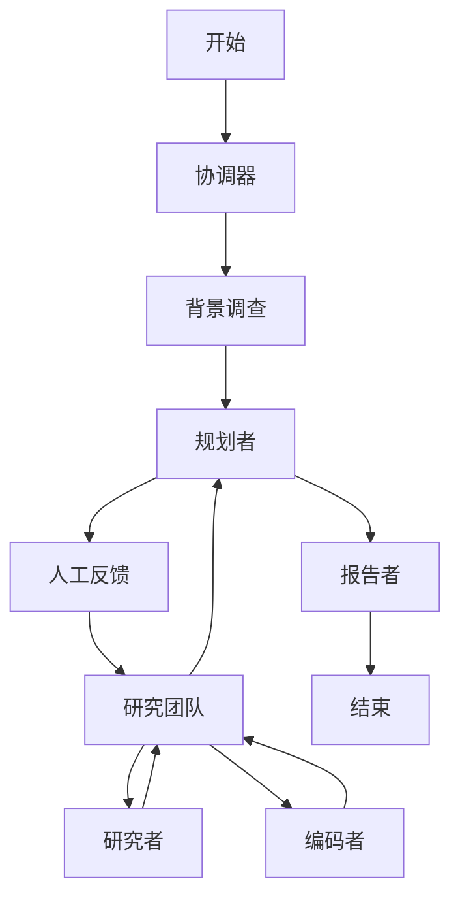
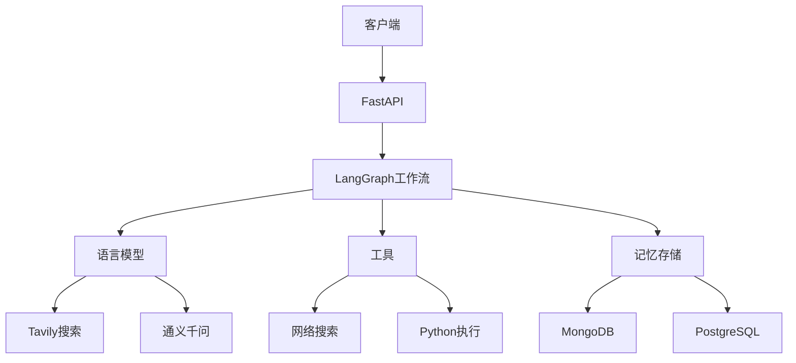
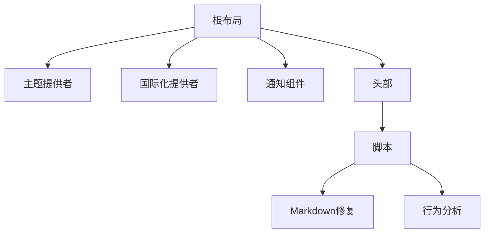
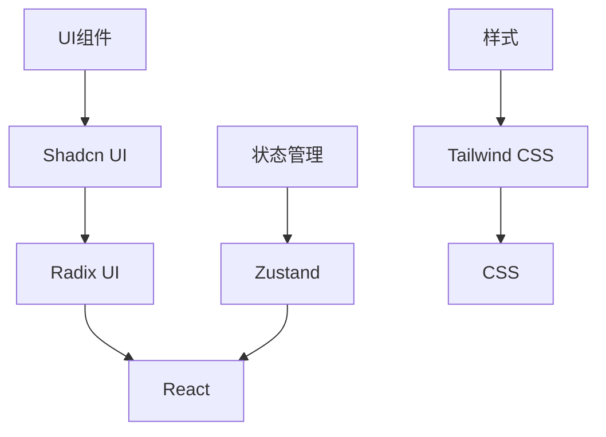
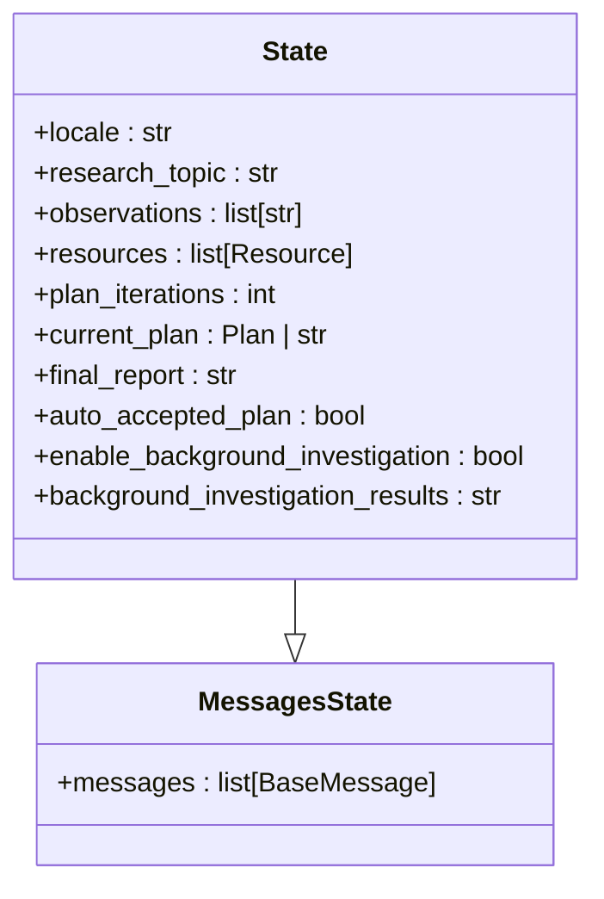
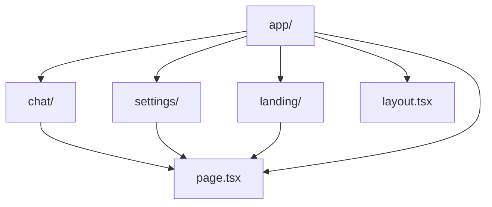
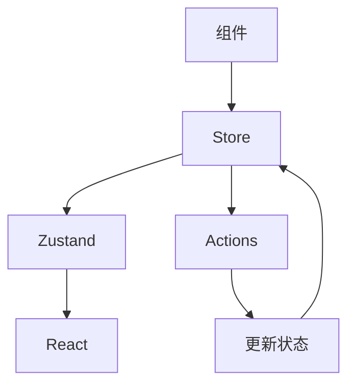

# 技术栈

<cite>
**本文档中引用的文件**  
- [main.py](file://main.py)
- [pyproject.toml](file://pyproject.toml)
- [workflow.py](file://src/workflow.py)
- [builder.py](file://src/graph/builder.py)
- [nodes.py](file://src/graph/nodes.py)
- [types.py](file://src/graph/types.py)
- [app.py](file://src/server/app.py)
- [package.json](file://web/package.json)
- [layout.tsx](file://web/src/app/layout.tsx)
- [button.tsx](file://web/src/components/ui/button.tsx)
- [theme-provider-wrapper.tsx](file://web/src/components/deer-flow/theme-provider-wrapper.tsx)
</cite>

## 目录
1. [项目概述](#项目概述)
2. [后端技术栈](#后端技术栈)
3. [前端技术栈](#前端技术栈)
4. [第三方服务集成](#第三方服务集成)
5. [关键技术实现](#关键技术实现)
6. [最佳实践与版本兼容性](#最佳实践与版本兼容性)

## 项目概述

DeerFlow 是一个结合语言模型与专用工具的AI研究工具，旨在实现深度探索和高效研究。该项目采用前后端分离的架构，后端基于Python生态构建，使用LangChain和LangGraph框架实现多智能体工作流编排；前端采用现代JavaScript技术栈，使用Next.js框架构建用户界面。系统通过FastAPI提供RESTful API服务，实现了从用户请求到智能体协作再到结果生成的完整工作流。

**Section sources**
- [main.py](file://main.py)
- [pyproject.toml](file://pyproject.toml)
- [package.json](file://web/package.json)

## 后端技术栈

### LangChain与LangGraph框架

DeerFlow后端的核心是LangChain和LangGraph框架，用于实现多智能体工作流编排。LangGraph作为LangChain的扩展，提供了基于状态机的可视化工作流编排能力，使得复杂的AI代理协作流程得以清晰定义和执行。

在DeerFlow中，`src/graph/builder.py`文件定义了工作流图的构建逻辑。系统通过`StateGraph`创建了一个状态图，其中包含了多个节点，如协调器(coordinator)、规划者(planner)、研究者(researcher)、编码者(coder)和报告者(reporter)等。这些节点通过条件边(conditional edges)连接，实现了智能体之间的协作和任务流转。

**Diagram sources**
- [builder.py](file://src/graph/builder.py#L46-L86)
- [nodes.py](file://src/graph/nodes.py)

**Section sources**
- [builder.py](file://src/graph/builder.py)
- [nodes.py](file://src/graph/nodes.py)
- [types.py](file://src/graph/types.py)

### FastAPI与Uvicorn

DeerFlow使用FastAPI框架提供RESTful API服务，通过Uvicorn作为ASGI服务器运行。FastAPI是一个现代、快速（高性能）的Web框架，基于Python类型提示，提供了自动生成API文档、数据验证和序列化等特性。

在`src/server/app.py`文件中，系统定义了多个API端点，包括`/api/chat/stream`用于流式聊天、`/api/tts`用于文本转语音、`/api/podcast/generate`用于生成播客等。这些端点通过StreamingResponse支持服务器发送事件(SSE)，实现了实时的流式响应。

**Diagram sources**
- [app.py](file://src/server/app.py)
- [workflow.py](file://src/workflow.py)

**Section sources**
- [app.py](file://src/server/app.py)
- [workflow.py](file://src/workflow.py)

## 前端技术栈

### Next.js框架

DeerFlow前端采用Next.js框架构建，这是一个基于React的现代Web应用框架，提供了服务器端渲染(SSR)、静态站点生成(SSG)和API路由等特性。Next.js的App Router架构使得路由管理更加直观和灵活。

在`web/src/app/layout.tsx`文件中，系统定义了应用的根布局，包括全局样式、字体加载、国际化支持和主题提供者。Next.js的布局系统允许在不同层级定义共享的UI组件，提高了代码的复用性和可维护性。

**Diagram sources**
- [layout.tsx](file://web/src/app/layout.tsx)
- [theme-provider-wrapper.tsx](file://web/src/components/deer-flow/theme-provider-wrapper.tsx)

**Section sources**
- [layout.tsx](file://web/src/app/layout.tsx)
- [theme-provider-wrapper.tsx](file://web/src/components/deer-flow/theme-provider-wrapper.tsx)

### React组件库与状态管理

前端使用React作为UI库，结合Zustand进行状态管理。Zustand是一个轻量级的状态管理库，提供了简单的API来管理应用状态，避免了Redux的复杂性。

Shadcn UI组件库被用作基础UI组件，提供了可访问、可定制的React组件。这些组件基于Radix UI构建，确保了良好的可访问性和用户体验。在`web/src/components/ui/button.tsx`文件中，可以看到按钮组件的实现，使用了class-variance-authority来管理不同的样式变体。

**Diagram sources**
- [button.tsx](file://web/src/components/ui/button.tsx)
- [package.json](file://web/package.json)

**Section sources**
- [button.tsx](file://web/src/components/ui/button.tsx)
- [package.json](file://web/package.json)

## 第三方服务集成

### Tavily Search集成

DeerFlow集成了Tavily Search服务，用于增强AI代理的网络搜索能力。在`src/tools/tavily_search`目录中，系统实现了Tavily搜索API的封装，包括`tavily_search_api_wrapper.py`和`tavily_search_results_with_images.py`两个文件。

Tavily Search被用作背景调查节点的工具，在规划阶段前自动搜索相关信息，为后续的决策提供上下文。这种集成方式使得AI代理能够获取最新的网络信息，提高了回答的准确性和时效性。

**Section sources**
- [tavily_search_api_wrapper.py](file://src/tools/tavily_search/tavily_search_api_wrapper.py)
- [tavily_search_results_with_images.py](file://src/tools/tavily_search/tavily_search_results_with_images.py)

### DashScope集成

系统通过`src/llms/providers/dashscope.py`文件集成了通义千问(DashScope)大模型服务。DashScope作为AI代理的推理引擎，提供了强大的语言理解和生成能力。

在配置文件中，系统支持多种LLM提供商，包括OpenAI、DeepSeek和Google等，但DashScope被作为主要的推理服务。这种多提供商支持的设计提高了系统的灵活性和可扩展性，允许根据需求和成本选择最合适的模型服务。

**Section sources**
- [dashscope.py](file://src/llms/providers/dashscope.py)
- [llm.py](file://src/llms/llm.py)

## 关键技术实现

### LangGraph状态机定义

DeerFlow使用LangGraph的状态机来定义和管理AI代理的工作流。在`src/graph/types.py`文件中，系统定义了`State`类，继承自`MessagesState`，并扩展了多个属性，如`locale`、`research_topic`、`observations`等。

**Diagram sources**
- [types.py](file://src/graph/types.py)
- [planner_model.py](file://src/prompts/planner_model.py)

**Section sources**
- [types.py](file://src/graph/types.py)
- [planner_model.py](file://src/prompts/planner_model.py)

### Next.js路由配置

前端使用Next.js的App Router进行路由配置，通过文件系统实现路由。在`web/src/app`目录下，`chat`、`settings`和`landing`等子目录对应不同的路由路径。

**Diagram sources**
- [layout.tsx](file://web/src/app/layout.tsx)

**Section sources**
- [layout.tsx](file://web/src/app/layout.tsx)

### 组件状态管理

前端使用Zustand进行状态管理，通过创建store来管理应用状态。虽然具体的store文件未在项目结构中显示，但从`package.json`的依赖中可以看出Zustand被作为状态管理库使用。

**Diagram sources**
- [package.json](file://web/package.json)

**Section sources**
- [package.json](file://web/package.json)

## 最佳实践与版本兼容性

### 版本兼容性

DeerFlow的后端依赖在`pyproject.toml`文件中明确定义，确保了版本的兼容性。系统要求Python 3.12或更高版本，并指定了各个依赖库的版本范围。例如，LangGraph要求>=0.3.5，FastAPI要求>=0.110.0，Uvicorn要求>=0.27.1。

前端依赖在`web/package.json`中定义，使用pnpm作为包管理器。Next.js版本为^15.4.7，React版本为^19.0.0，确保了与最新Web标准的兼容性。

### 依赖关系

后端主要依赖包括：
- **LangChain生态**: langchain-community, langchain-experimental, langgraph
- **Web框架**: fastapi, uvicorn, sse-starlette
- **数据处理**: pandas, numpy
- **LLM提供商**: langchain-openai, langchain-deepseek, langchain-google-genai
- **数据库**: pymilvus, langgraph-checkpoint-postgres

前端主要依赖包括：
- **框架**: next, react, react-dom
- **UI组件**: @radix-ui/react-*系列组件, lucide-react
- **状态管理**: zustand
- **样式**: tailwindcss, class-variance-authority
- **工具**: zod, sonner, framer-motion

### 最佳实践

1. **模块化设计**: 系统采用清晰的模块化设计，将不同功能分离到独立的目录中，如`agents`、`graph`、`llms`、`tools`等。
2. **类型安全**: 使用Python类型提示和Zod进行数据验证，提高了代码的可靠性和可维护性。
3. **异步处理**: 使用async/await模式处理异步操作，提高了系统的响应性和性能。
4. **流式响应**: 通过SSE实现流式响应，提供了更好的用户体验。
5. **可扩展性**: 设计支持多LLM提供商和多工具集成，便于未来扩展。

**Section sources**
- [pyproject.toml](file://pyproject.toml)
- [package.json](file://web/package.json)