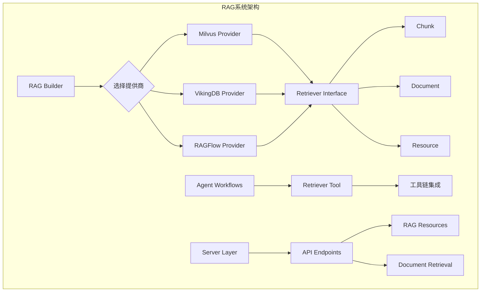
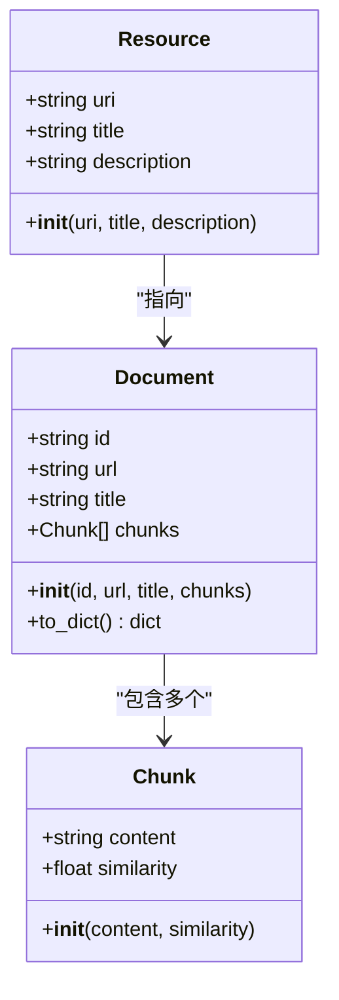
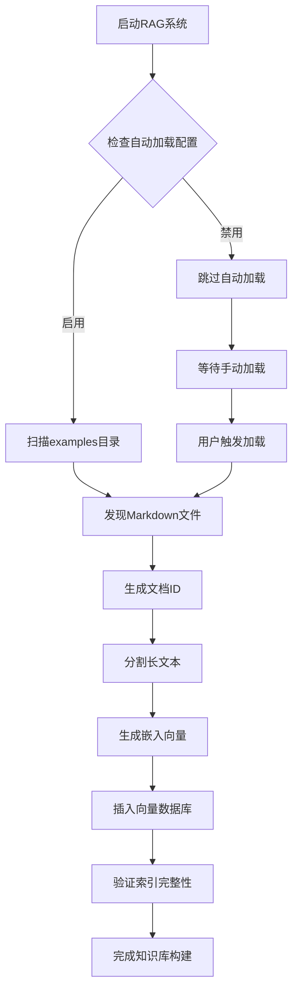
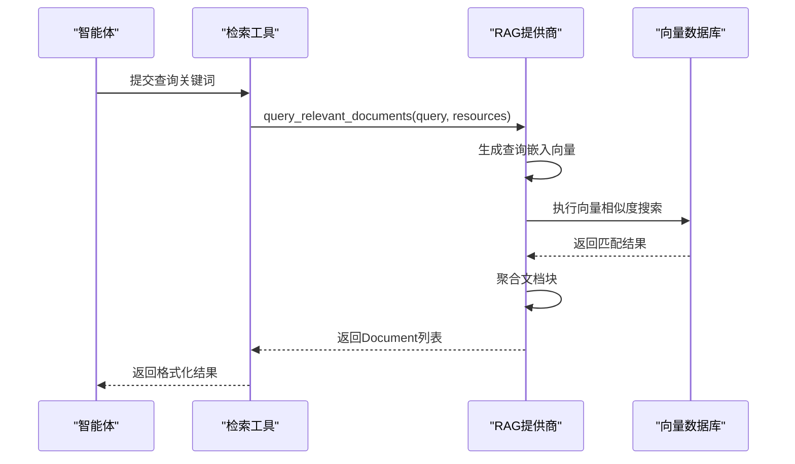
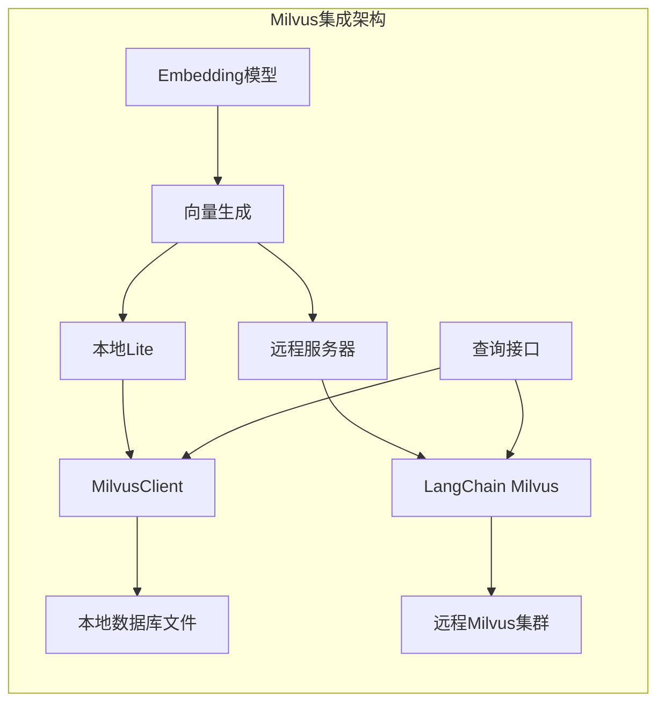
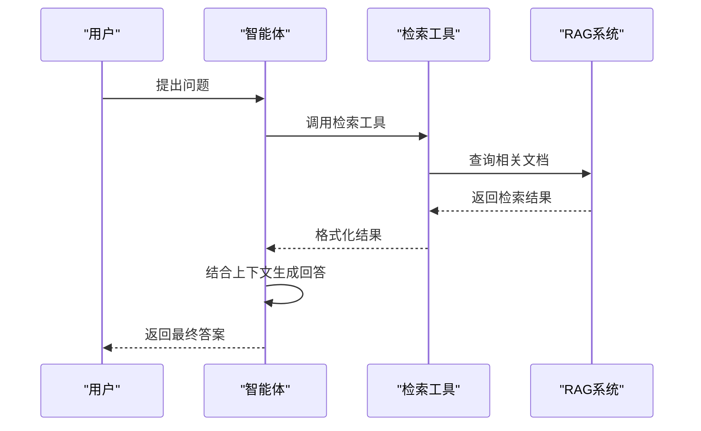

# RAG系统

<cite>
**本文档引用的文件**
- [src/rag/__init__.py](file://src/rag/__init__.py)
- [src/rag/builder.py](file://src/rag/builder.py)
- [src/rag/retriever.py](file://src/rag/retriever.py)
- [src/rag/milvus.py](file://src/rag/milvus.py)
- [src/rag/vikingdb_knowledge_base.py](file://src/rag/vikingdb_knowledge_base.py)
- [src/rag/ragflow.py](file://src/rag/ragflow.py)
- [src/config/tools.py](file://src/config/tools.py)
- [src/tools/retriever.py](file://src/tools/retriever.py)
- [src/server/rag_request.py](file://src/server/rag_request.py)
- [tests/unit/rag/test_milvus.py](file://tests/unit/rag/test_milvus.py)
- [tests/unit/rag/test_ragflow.py](file://tests/unit/rag/test_ragflow.py)
- [examples/openai_sora_report.md](file://examples/openai_sora_report.md)
</cite>

## 目录
1. [简介](#简介)
2. [系统架构](#系统架构)
3. [核心组件分析](#核心组件分析)
4. [知识库构建流程](#知识库构建流程)
5. [检索器实现机制](#检索器实现机制)
6. [向量数据库集成](#向量数据库集成)
7. [多智能体工作流集成](#多智能体工作流集成)
8. [配置选项](#配置选项)
9. [性能优化建议](#性能优化建议)
10. [故障排除指南](#故障排除指南)
11. [总结](#总结)

## 简介

deer-flow的RAG（检索增强生成）系统是一个强大的知识检索框架，旨在为多智能体工作流提供高质量的上下文信息。该系统支持多种向量数据库后端，包括Milvus、VikingDB和RAGFlow，并提供了灵活的知识库构建、管理和检索功能。

RAG系统的核心目标是通过语义搜索技术，从大规模文档集合中提取相关信息，为智能体提供准确、相关的上下文信息，从而显著提升生成内容的质量和准确性。

## 系统架构

RAG系统采用模块化设计，通过统一的接口抽象不同的向量数据库提供商，实现了高度的可扩展性和灵活性。



**图表来源**
- [src/rag/builder.py](file://src/rag/builder.py#L1-L21)
- [src/rag/retriever.py](file://src/rag/retriever.py#L1-L82)

**章节来源**
- [src/rag/__init__.py](file://src/rag/__init__.py#L1-L18)
- [src/rag/builder.py](file://src/rag/builder.py#L1-L21)

## 核心组件分析

### Retriever基础类

Retriever是所有RAG提供商的基础抽象类，定义了统一的接口规范：

```python
class Retriever(abc.ABC):
    """
    定义RAG提供商，可用于查询文档和资源。
    """
    
    @abc.abstractmethod
    def list_resources(self, query: str | None = None) -> list[Resource]:
        """
        从RAG提供商列出资源。
        """
        pass

    @abc.abstractmethod
    def query_relevant_documents(
        self, query: str, resources: list[Resource] = []
    ) -> list[Document]:
        """
        从资源中查询相关文档。
        """
        pass
```

### 数据模型结构

系统定义了三个核心数据模型来表示检索结果：



**图表来源**
- [src/rag/retriever.py](file://src/rag/retriever.py#L8-L82)

**章节来源**
- [src/rag/retriever.py](file://src/rag/retriever.py#L1-L82)

## 知识库构建流程

### 构建器模式

RAG系统使用工厂模式根据配置动态选择合适的提供商：

```python
def build_retriever() -> Retriever | None:
    if SELECTED_RAG_PROVIDER == RAGProvider.RAGFLOW.value:
        return RAGFlowProvider()
    elif SELECTED_RAG_PROVIDER == RAGProvider.VIKINGDB_KNOWLEDGE_BASE.value:
        return VikingDBKnowledgeBaseProvider()
    elif SELECTED_RAG_PROVIDER == RAGProvider.MILVUS.value:
        return MilvusProvider()
    elif SELECTED_RAG_PROVIDER:
        raise ValueError(f"Unsupported RAG provider: {SELECTED_RAG_PROVIDER}")
    return None
```

### Milvus提供商的自动知识库构建

Milvus提供商具有强大的自动知识库构建能力，能够自动加载本地Markdown文件并建立索引：



**图表来源**
- [src/rag/milvus.py](file://src/rag/milvus.py#L300-L400)

**章节来源**
- [src/rag/builder.py](file://src/rag/builder.py#L1-L21)
- [src/rag/milvus.py](file://src/rag/milvus.py#L300-L400)

## 检索器实现机制

### 向量相似度搜索

每个提供商都实现了基于向量相似度的高级检索算法：



**图表来源**
- [src/rag/retriever.py](file://src/rag/retriever.py#L60-L82)
- [src/tools/retriever.py](file://src/tools/retriever.py#L28-L60)

### 检索结果聚合

系统采用智能聚合策略，将相似的文档块合并到同一个Document对象中：

```python
# 检索结果聚合逻辑
documents = {}
for result in search_results:
    doc_id = result.get("doc_id", "")
    content = result.get("content", "")
    similarity = result.get("similarity", 0.0)
    
    if doc_id not in documents:
        documents[doc_id] = Document(id=doc_id, chunks=[])
    
    chunk = Chunk(content=content, similarity=similarity)
    documents[doc_id].chunks.append(chunk)
```

**章节来源**
- [src/rag/retriever.py](file://src/rag/retriever.py#L60-L82)
- [src/tools/retriever.py](file://src/tools/retriever.py#L28-L60)

## 向量数据库集成

### Milvus集成

Milvus提供商支持两种部署模式：本地Lite版本和远程服务器版本。

#### 本地Lite模式
- 使用SQLite兼容的本地数据库文件
- 自动管理集合创建和索引
- 支持完整的向量操作

#### 远程服务器模式
- 集成LangChain Milvus客户端
- 支持分布式部署
- 提供更强大的查询功能



**图表来源**
- [src/rag/milvus.py](file://src/rag/milvus.py#L100-L200)

### VikingDB集成

VikingDB提供商专为阿里云服务设计，提供企业级知识库管理：

```python
class VikingDBKnowledgeBaseProvider(Retriever):
    """
    使用VikingDB知识库API检索文档的提供商。
    """
    
    def __init__(self):
        self.api_url = os.getenv("VIKINGDB_KNOWLEDGE_BASE_API_URL")
        self.api_ak = os.getenv("VIKINGDB_KNOWLEDGE_BASE_API_AK")
        self.api_sk = os.getenv("VIKINGDB_KNOWLEDGE_BASE_API_SK")
        self.retrieval_size = int(os.getenv("VIKINGDB_KNOWLEDGE_BASE_RETRIEVAL_SIZE", "10"))
```

### RAGFlow集成

RAGFlow提供商提供云端托管的知识检索服务：

```python
class RAGFlowProvider(Retriever):
    """
    使用RAGFlow检索文档的提供商。
    """
    
    def __init__(self):
        self.api_url = os.getenv("RAGFLOW_API_URL")
        self.api_key = os.getenv("RAGFLOW_API_KEY")
        self.page_size = int(os.getenv("RAGFLOW_PAGE_SIZE", "10"))
        self.cross_languages = os.getenv("RAGFLOW_CROSS_LANGUAGES")
```

**章节来源**
- [src/rag/milvus.py](file://src/rag/milvus.py#L1-L786)
- [src/rag/vikingdb_knowledge_base.py](file://src/rag/vikingdb_knowledge_base.py#L1-L300)
- [src/rag/ragflow.py](file://src/rag/ragflow.py#L1-L137)

## 多智能体工作流集成

### 工具链集成

RAG系统通过专门的工具类与智能体工作流无缝集成：

```python
def get_retriever_tool(resources: List[Resource]) -> RetrieverTool | None:
    if not resources:
        return None
    logger.info(f"create retriever tool: {SELECTED_RAG_PROVIDER}")
    retriever = build_retriever()
    
    if not retriever:
        return None
    return RetrieverTool(retriever=retriever, resources=resources)
```

### 智能体调用示例



**图表来源**
- [src/tools/retriever.py](file://src/tools/retriever.py#L50-L60)

**章节来源**
- [src/tools/retriever.py](file://src/tools/retriever.py#L1-L60)

## 配置选项

### 环境变量配置

RAG系统支持丰富的环境变量配置，允许灵活定制各个提供商的行为：

#### Milvus配置
```bash
# 连接配置
MILVUS_URI=http://localhost:19530
MILVUS_USER=admin
MILVUS_PASSWORD=password

# 集合配置
MILVUS_COLLECTION=documents
MILVUS_TOP_K=10

# 嵌入配置
MILVUS_EMBEDDING_PROVIDER=openai
MILVUS_EMBEDDING_MODEL=text-embedding-ada-002
MILVUS_EMBEDDING_DIM=1536

# 示例配置
MILVUS_AUTO_LOAD_EXAMPLES=true
MILVUS_EXAMPLES_DIR=examples
MILVUS_CHUNK_SIZE=4000
```

#### RAGFlow配置
```bash
# API配置
RAGFLOW_API_URL=https://api.ragflow.com
RAGFLOW_API_KEY=your-api-key

# 检索配置
RAGFLOW_PAGE_SIZE=10
RAGFLOW_CROSS_LANGUAGES=en,zh,ja
```

#### VikingDB配置
```bash
# API配置
VIKINGDB_KNOWLEDGE_BASE_API_URL=api.example.com
VIKINGDB_KNOWLEDGE_BASE_API_AK=access-key
VIKINGDB_KNOWLEDGE_BASE_API_SK=secret-key

# 检索配置
VIKINGDB_KNOWLEDGE_BASE_RETRIEVAL_SIZE=10
VIKINGDB_KNOWLEDGE_BASE_REGION=cn-north-1
```

### 提供商选择

```python
class RAGProvider(enum.Enum):
    RAGFLOW = "ragflow"
    VIKINGDB_KNOWLEDGE_BASE = "vikingdb_knowledge_base"
    MILVUS = "milvus"

SELECTED_RAG_PROVIDER = os.getenv("RAG_PROVIDER")
```

**章节来源**
- [src/config/tools.py](file://src/config/tools.py#L1-L30)
- [src/rag/milvus.py](file://src/rag/milvus.py#L50-L150)
- [src/rag/ragflow.py](file://src/rag/ragflow.py#L20-L50)

## 性能优化建议

### 向量索引优化

1. **索引类型选择**
   - IVF_FLAT：适用于中小规模数据集
   - HNSW：适用于大规模高维向量
   - ANNOY：适用于快速近似最近邻搜索

2. **参数调优**
   ```python
   # Milvus索引参数示例
   index_params = {
       "field_name": "embedding",
       "index_type": "IVF_FLAT",
       "metric_type": "IP",
       "params": {"nlist": 1024}
   }
   ```

3. **批处理优化**
   - 批量插入文档以提高吞吐量
   - 使用异步查询减少延迟

### 缓存策略

1. **嵌入向量缓存**
   - 缓存常用查询的嵌入向量
   - 减少重复计算开销

2. **检索结果缓存**
   - 缓存高频查询结果
   - 实现LRU缓存机制

### 内存管理

1. **分页检索**
   ```python
   # 控制返回结果数量
   top_k = min(top_k, MAX_RESULTS_PER_QUERY)
   ```

2. **连接池管理**
   - 复用数据库连接
   - 及时释放资源

## 故障排除指南

### 常见问题及解决方案

#### 1. 连接失败
**症状**：无法连接到向量数据库
**解决方案**：
- 检查网络连接和防火墙设置
- 验证API密钥和认证信息
- 确认数据库服务状态

#### 2. 检索性能差
**症状**：查询响应时间过长
**解决方案**：
- 优化索引参数
- 减少top_k值
- 使用更高效的嵌入模型

#### 3. 内存不足
**症状**：系统内存使用过高
**解决方案**：
- 启用分页检索
- 减少批量大小
- 清理不必要的缓存

#### 4. 文档加载失败
**症状**：无法正确加载本地文档
**解决方案**：
```python
# 检查文件权限
try:
    content = md_file.read_text(encoding="utf-8")
except PermissionError:
    logger.error(f"Permission denied for file: {md_file}")
except UnicodeDecodeError:
    logger.error(f"Encoding error for file: {md_file}")
```

### 调试工具

1. **日志记录**
   ```python
   import logging
   logging.basicConfig(level=logging.INFO)
   logger = logging.getLogger(__name__)
   ```

2. **性能监控**
   ```python
   import time
   
   start_time = time.time()
   results = retriever.query_relevant_documents(query)
   elapsed_time = time.time() - start_time
   logger.info(f"Query took {elapsed_time:.2f} seconds")
   ```

**章节来源**
- [tests/unit/rag/test_milvus.py](file://tests/unit/rag/test_milvus.py#L1-L100)
- [src/rag/milvus.py](file://src/rag/milvus.py#L700-L786)

## 总结

deer-flow的RAG系统是一个功能强大、设计精良的知识检索框架，具有以下核心优势：

1. **模块化设计**：通过统一接口支持多种向量数据库提供商
2. **自动化构建**：Milvus提供商支持自动知识库构建和维护
3. **高性能检索**：基于向量相似度的高效检索算法
4. **智能聚合**：自动聚合相似文档块，提供连贯的检索结果
5. **多智能体集成**：无缝集成到智能体工作流中
6. **丰富配置**：支持详细的环境变量配置选项

该系统为开发者提供了构建高质量RAG应用的强大工具，能够显著提升智能体的决策能力和生成质量。通过合理的配置和优化，可以在各种应用场景中发挥出色的性能表现。