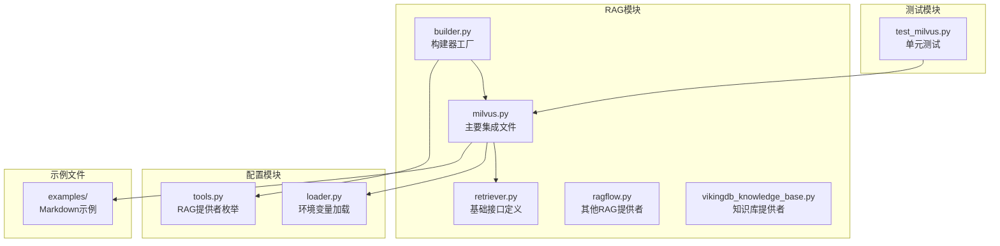
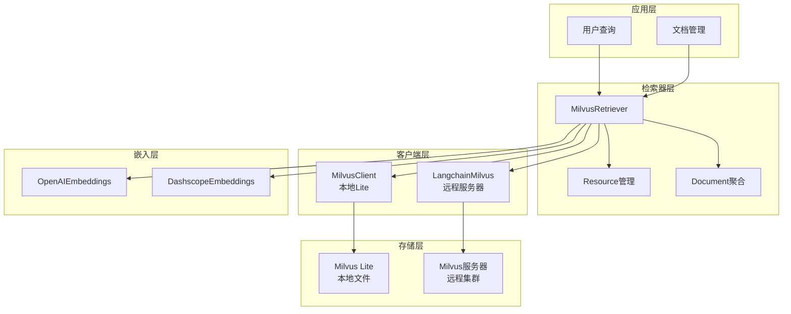
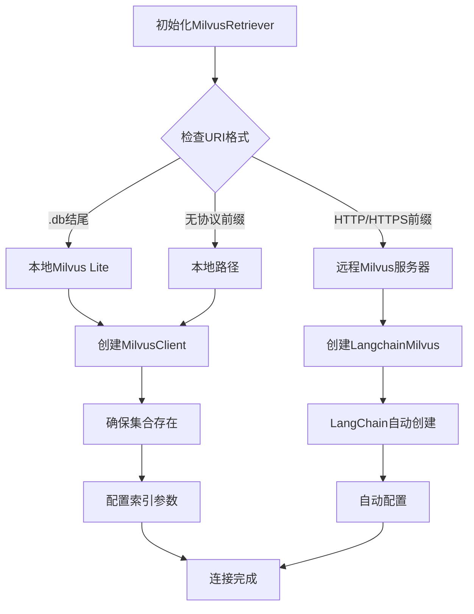
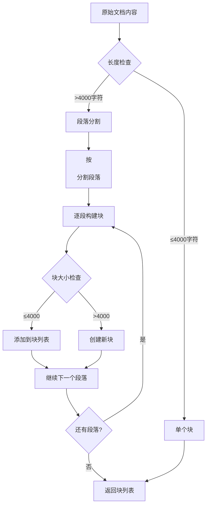
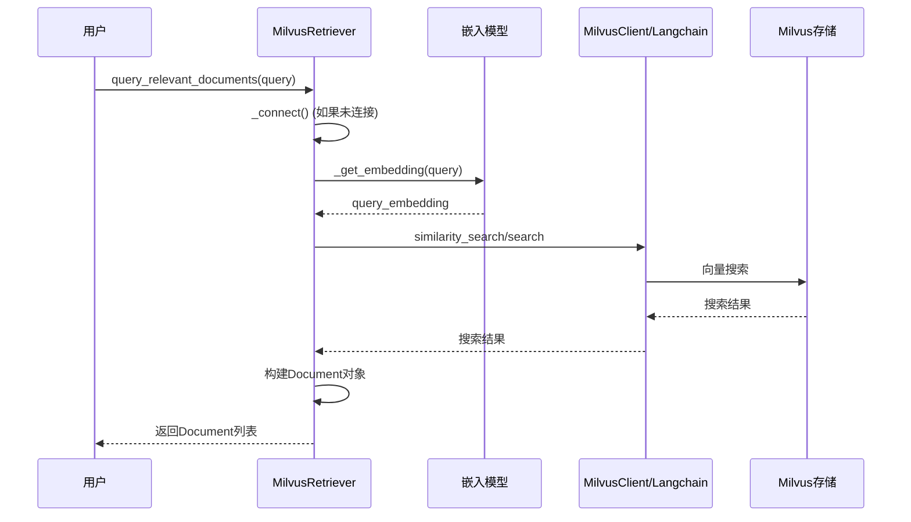
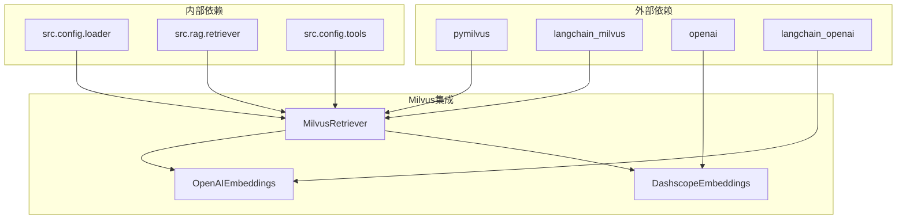

# Milvus 向量数据库集成

<cite>
**本文档引用的文件**
- [milvus.py](file://src/rag/milvus.py)
- [test_milvus.py](file://tests/unit/rag/test_milvus.py)
- [retriever.py](file://src/rag/retriever.py)
- [builder.py](file://src/rag/builder.py)
- [tools.py](file://src/config/tools.py)
- [AI_adoption_in_healthcare.md](file://examples/AI_adoption_in_healthcare.md)
- [bitcoin_price_fluctuation.md](file://examples/bitcoin_price_fluctuation.md)
</cite>

## 目录
1. [简介](#简介)
2. [项目结构](#项目结构)
3. [核心组件](#核心组件)
4. [架构概览](#架构概览)
5. [详细组件分析](#详细组件分析)
6. [依赖关系分析](#依赖关系分析)
7. [性能考虑](#性能考虑)
8. [故障排除指南](#故障排除指南)
9. [结论](#结论)

## 简介

deer-flow项目中的Milvus向量数据库集成是一个强大的RAG（检索增强生成）系统的核心组件。该集成提供了高效的向量相似性检索能力，支持本地Milvus Lite和远程Milvus服务器两种部署模式。通过智能的文档分块、嵌入生成和向量搜索，系统能够快速准确地找到与用户查询最相关的文档内容。

该集成设计为可插拔的检索器，支持多种嵌入模型提供商（OpenAI和DashScope），并提供了完整的文档生命周期管理功能，包括自动示例加载、文档去重和资源发现。

## 项目结构

Milvus集成在deer-flow项目中的组织结构如下：



**图表来源**
- [milvus.py](file://src/rag/milvus.py#L1-L50)
- [retriever.py](file://src/rag/retriever.py#L1-L30)
- [builder.py](file://src/rag/builder.py#L1-L21)

**章节来源**
- [milvus.py](file://src/rag/milvus.py#L1-L786)
- [builder.py](file://src/rag/builder.py#L1-L21)

## 核心组件

### MilvusRetriever类

`MilvusRetriever`是Milvus集成的核心类，继承自抽象基类`Retriever`，实现了完整的向量检索功能：

```python
class MilvusRetriever(Retriever):
    """基于Milvus向量存储的检索器实现。
    
    职责：
    * 初始化/延迟连接到Milvus（本地Lite或远程服务器）
    * 提供内容块插入和相似性查询方法
    * 可选地显示项目中找到的示例markdown资源
    """
```

### 嵌入模型包装器

系统支持两种嵌入模型提供商：

1. **OpenAI兼容嵌入**：通过`OpenAIEmbeddings`实现
2. **DashScope嵌入**：通过自定义`DashscopeEmbeddings`类实现

```python
class DashscopeEmbeddings:
    """OpenAI兼容的嵌入模型包装器。"""
    
    def __init__(self, **kwargs: Any) -> None:
        self._client: OpenAI = OpenAI(
            api_key=kwargs.get("api_key", ""), 
            base_url=kwargs.get("base_url", "")
        )
        self._model: str = kwargs.get("model", "")
        self._encoding_format: str = kwargs.get("encoding_format", "float")
```

**章节来源**
- [milvus.py](file://src/rag/milvus.py#L25-L50)
- [milvus.py](file://src/rag/milvus.py#L124-L150)

## 架构概览

Milvus集成采用多层架构设计，支持灵活的部署选项和配置：



**图表来源**
- [milvus.py](file://src/rag/milvus.py#L67-L122)
- [milvus.py](file://src/rag/milvus.py#L400-L450)

## 详细组件分析

### 连接管理

Milvus集成支持两种连接模式，通过URI自动检测：



**图表来源**
- [milvus.py](file://src/rag/milvus.py#L380-L420)
- [milvus.py](file://src/rag/milvus.py#L422-L450)

#### 连接参数配置

系统通过环境变量提供灵活的连接配置：

```python
# 连接配置
self.uri: str = get_str_env("MILVUS_URI", "http://localhost:19530")
self.user: str = get_str_env("MILVUS_USER")
self.password: str = get_str_env("MILVUS_PASSWORD")
self.collection_name: str = get_str_env("MILVUS_COLLECTION", "documents")
```

#### 自动连接建立

```python
def _connect(self) -> None:
    """创建底层Milvus客户端（幂等操作）。"""
    try:
        if self._is_milvus_lite():
            # 使用MilvusClient处理本地Lite实例
            self.client = MilvusClient(self.uri)
            self._ensure_collection_exists()
        else:
            # 使用LangChain Milvus处理远程服务器
            connection_args = {"uri": self.uri}
            if self.user:
                connection_args["user"] = self.user
            if self.password:
                connection_args["password"] = self.password
                
            self.client = LangchainMilvus(
                embedding_function=self.embedding_model,
                collection_name=self.collection_name,
                connection_args=connection_args,
                drop_old=False,
            )
    except Exception as e:
        raise ConnectionError(f"Failed to connect to Milvus: {str(e)}")
```

**章节来源**
- [milvus.py](file://src/rag/milvus.py#L67-L91)
- [milvus.py](file://src/rag/milvus.py#L380-L420)

### 集合创建与管理

#### 集合模式定义

系统根据配置动态创建集合模式：

```python
def _create_collection_schema(self) -> CollectionSchema:
    """构建并返回带有元数据字段的Milvus CollectionSchema对象。"""
    fields = [
        FieldSchema(
            name=self.id_field,
            dtype=DataType.VARCHAR,
            max_length=512,
            is_primary=True,
            auto_id=False,
        ),
        FieldSchema(
            name=self.vector_field,
            dtype=DataType.FLOAT_VECTOR,
            dim=self.embedding_dim,
        ),
        FieldSchema(
            name=self.content_field, 
            dtype=DataType.VARCHAR, 
            max_length=65535
        ),
        FieldSchema(
            name=self.title_field, 
            dtype=DataType.VARCHAR, 
            max_length=512
        ),
        FieldSchema(
            name=self.url_field, 
            dtype=DataType.VARCHAR, 
            max_length=1024
        ),
    ]
    
    schema = CollectionSchema(
        fields=fields,
        description=f"Collection for DeerFlow RAG documents: {self.collection_name}",
        enable_dynamic_field=True,  # 允许额外的动态元数据字段
    )
    return schema
```

#### 索引配置

对于本地Milvus Lite，系统自动配置IVF_FLAT索引：

```python
index_params={
    "field_name": self.vector_field,
    "index_type": "IVF_FLAT",
    "metric_type": "IP",
    "params": {"nlist": 1024},
}
```

#### 集合存在性检查

```python
def _ensure_collection_exists(self) -> None:
    """确保配置的集合存在（如果缺失则创建）。"""
    if self._is_milvus_lite():
        try:
            collections = self.client.list_collections()
            if self.collection_name not in collections:
                schema = self._create_collection_schema()
                self.client.create_collection(
                    collection_name=self.collection_name,
                    schema=schema,
                    index_params=index_params,
                )
        except Exception as e:
            logger.warning("Could not ensure collection exists: %s", e)
```

**章节来源**
- [milvus.py](file://src/rag/milvus.py#L200-L230)
- [milvus.py](file://src/rag/milvus.py#L232-L260)

### 数据插入流程

#### 文档分块处理

系统自动将长文档分割为适合处理的块：



**图表来源**
- [milvus.py](file://src/rag/milvus.py#L300-L330)

#### 嵌入生成

```python
def _get_embedding(self, text: str) -> List[float]:
    """为给定文本返回嵌入向量。"""
    try:
        # 输入验证
        if not isinstance(text, str):
            raise ValueError(f"Text must be a string, got {type(text)}")
            
        if not text.strip():
            raise ValueError("Text cannot be empty or only whitespace")
            
        # 统一嵌入接口
        embeddings = self.embedding_model.embed_query(text=text.strip())
        
        # 输出验证
        if not isinstance(embeddings, list) or not embeddings:
            raise ValueError(f"Invalid embedding format: {type(embeddings)}")
            
        return embeddings
    except Exception as e:
        raise RuntimeError(f"Failed to generate embedding: {str(e)}")
```

#### 批量插入

```python
def _insert_document_chunk(
    self, doc_id: str, content: str, title: str, url: str, metadata: Dict[str, Any]
) -> None:
    """将单个内容块插入Milvus。"""
    try:
        # 生成嵌入
        embedding = self._get_embedding(content)
        
        if self._is_milvus_lite():
            # 对于Milvus Lite，使用MilvusClient
            data = [{
                self.id_field: doc_id,
                self.vector_field: embedding,
                self.content_field: content,
                self.title_field: title,
                self.url_field: url,
                **metadata,
            }]
            self.client.insert(collection_name=self.collection_name, data=data)
        else:
            # 对于LangChain Milvus，使用add_texts
            self.client.add_texts(
                texts=[content],
                metadatas=[{
                    self.id_field: doc_id,
                    self.title_field: title,
                    self.url_field: url,
                    **metadata,
                }],
            )
    except Exception as e:
        raise RuntimeError(f"Failed to insert document chunk: {str(e)}")
```

**章节来源**
- [milvus.py](file://src/rag/milvus.py#L290-L330)
- [milvus.py](file://src/rag/milvus.py#L332-L370)

### 向量搜索功能

#### 查询处理流程



**图表来源**
- [milvus.py](file://src/rag/milvus.py#L600-L650)

#### 搜索参数配置

```python
# 搜索参数
search_results = self.client.search(
    collection_name=self.collection_name,
    data=[query_embedding],
    anns_field=self.vector_field,
    param={"metric_type": "IP", "params": {"nprobe": 10}},
    limit=self.top_k,
    output_fields=[self.id_field, self.content_field, self.title_field, self.url_field],
)
```

#### 结果聚合

系统将搜索结果聚合为Document对象：

```python
def query_relevant_documents(
    self, query: str, resources: Optional[List[Resource]] = None
) -> List[Document]:
    """执行向量相似性搜索并返回丰富的Document对象列表。"""
    
    # 获取查询嵌入
    query_embedding = self._get_embedding(query)
    
    # 处理搜索结果
    documents = {}
    
    for result_list in search_results:
        for result in result_list:
            entity = result.get("entity", {})
            doc_id = entity.get(self.id_field, "")
            content = entity.get(self.content_field, "")
            title = entity.get(self.title_field, "")
            url = entity.get(self.url_field, "")
            score = result.get("distance", 0.0)
            
            # 创建或更新文档
            if doc_id not in documents:
                documents[doc_id] = Document(
                    id=doc_id, url=url, title=title, chunks=[]
                )
                
            # 添加块到文档
            chunk = Chunk(content=content, similarity=score)
            documents[doc_id].chunks.append(chunk)
    
    return list(documents.values())
```

**章节来源**
- [milvus.py](file://src/rag/milvus.py#L600-L680)

### 示例文档管理

#### 自动示例加载

系统支持自动加载项目中的示例Markdown文件：

```python
def _load_example_files(self) -> None:
    """加载示例markdown文件到集合中（幂等操作）。"""
    try:
        # 获取项目根目录
        current_file = Path(__file__)
        project_root = current_file.parent.parent.parent
        examples_path = project_root / self.examples_dir
        
        if not examples_path.exists():
            logger.info("Examples directory not found: %s", examples_path)
            return
            
        # 查找所有markdown文件
        md_files = list(examples_path.glob("*.md"))
        if not md_files:
            logger.info("No markdown files found in examples directory")
            return
            
        # 检查是否已加载
        existing_docs = self._get_existing_document_ids()
        loaded_count = 0
        
        for md_file in md_files:
            doc_id = self._generate_doc_id(md_file)
            
            # 跳过已加载的文件
            if doc_id in existing_docs:
                continue
                
            try:
                # 读取并处理文件
                content = md_file.read_text(encoding="utf-8")
                title = self._extract_title_from_markdown(content, md_file.name)
                chunks = self._split_content(content)
                
                # 插入每个块
                for i, chunk in enumerate(chunks):
                    chunk_id = f"{doc_id}_chunk_{i}" if len(chunks) > 1 else doc_id
                    self._insert_document_chunk(
                        doc_id=chunk_id,
                        content=chunk,
                        title=title,
                        url=f"milvus://{self.collection_name}/{md_file.name}",
                        metadata={"source": "examples", "file": md_file.name},
                    )
                    
                loaded_count += 1
                
            except Exception as e:
                logger.warning("Error loading %s: %s", md_file.name, e)
                
        logger.info("Successfully loaded %d example files into Milvus", loaded_count)
        
    except Exception as e:
        logger.error("Error loading example files: %s", e)
```

#### 文档标识符生成

```python
def _generate_doc_id(self, file_path: Path) -> str:
    """返回从名称、大小和修改时间哈希派生的稳定标识符。"""
    file_stat = file_path.stat()
    content_hash = hashlib.md5(
        f"{file_path.name}_{file_stat.st_size}_{file_stat.st_mtime}".encode()
    ).hexdigest()[:8]
    return f"example_{file_path.stem}_{content_hash}"
```

**章节来源**
- [milvus.py](file://src/rag/milvus.py#L262-L300)
- [milvus.py](file://src/rag/milvus.py#L302-L320)

### 错误处理与重试策略

#### 连接错误处理

```python
def _connect(self) -> None:
    """创建底层Milvus客户端（幂等操作）。"""
    try:
        # 连接逻辑...
    except Exception as e:
        raise ConnectionError(f"Failed to connect to Milvus: {str(e)}")
```

#### 嵌入生成错误处理

```python
def _get_embedding(self, text: str) -> List[float]:
    """为给定文本返回嵌入向量。"""
    try:
        # 输入验证...
        embeddings = self.embedding_model.embed_query(text=text.strip())
        # 输出验证...
        return embeddings
    except Exception as e:
        raise RuntimeError(f"Failed to generate embedding: {str(e)}")
```

#### 资源查询回退机制

```python
def list_resources(self, query: Optional[str] = None) -> List[Resource]:
    """列出可用的资源摘要。
    
    如果连接失败，会回退到仅本地示例。
    """
    try:
        # 主要逻辑...
    except Exception:
        logger.warning("Failed to query Milvus for resources, "
                      "falling back to local examples.")
        return self._list_local_markdown_resources()
```

**章节来源**
- [milvus.py](file://src/rag/milvus.py#L380-L420)
- [milvus.py](file://src/rag/milvus.py#L422-L450)

## 依赖关系分析

Milvus集成的依赖关系图展示了各组件之间的交互：



**图表来源**
- [milvus.py](file://src/rag/milvus.py#L1-L20)

**章节来源**
- [milvus.py](file://src/rag/milvus.py#L1-L20)

## 性能考虑

### 批量插入优化

1. **文档分块策略**：默认4000字符块大小，平衡内存使用和搜索精度
2. **索引配置**：IVF_FLAT索引适用于小规模数据集，支持IP距离度量
3. **连接池**：支持远程Milvus服务器的连接复用

### 查询性能优化

1. **nprobe参数调整**：控制搜索精度和速度的权衡
2. **结果限制**：默认top_k=10，可根据需求调整
3. **过滤优化**：支持基于元数据的条件过滤

### 内存管理

1. **惰性连接**：仅在需要时建立连接
2. **资源清理**：提供显式和隐式的资源释放
3. **批处理**：支持批量文档插入和查询

## 故障排除指南

### 常见问题及解决方案

#### 连接超时问题

**症状**：无法连接到Milvus服务器
**原因**：网络配置或服务不可用
**解决方案**：
```bash
# 检查Milvus服务状态
curl http://localhost:19530

# 验证环境变量
echo $MILVUS_URI
echo $MILVUS_USER
echo $MILVUS_PASSWORD
```

#### 数据写入失败

**症状**：文档插入失败
**原因**：集合不存在或权限不足
**解决方案**：
```python
# 手动创建集合
provider = MilvusProvider()
provider.create_collection()

# 检查集合状态
print(provider.client.describe_collection(provider.collection_name))
```

#### 嵌入生成错误

**症状**：无法生成向量嵌入
**原因**：API密钥无效或模型不支持
**解决方案**：
```python
# 验证嵌入配置
print(f"Provider: {provider.embedding_provider}")
print(f"Model: {provider.embedding_model}")
print(f"API Key: {'Set' if provider.embedding_api_key else 'Not set'}")
```

#### 查询结果为空

**症状**：搜索返回空结果
**原因**：文档不足或查询向量生成失败
**解决方案**：
```python
# 检查现有文档
examples = provider.get_loaded_examples()
print(f"Loaded examples: {len(examples)}")

# 测试嵌入生成
test_embedding = provider._get_embedding("test query")
print(f"Test embedding shape: {len(test_embedding)}")
```

### 调试技巧

1. **启用详细日志**：
```python
import logging
logging.getLogger('src.rag.milvus').setLevel(logging.DEBUG)
```

2. **检查集合状态**：
```python
# 对于Milvus Lite
collections = provider.client.list_collections()
print(f"Collections: {collections}")

# 查询文档数量
results = provider.client.query(
    collection_name=provider.collection_name,
    filter="",
    output_fields=["id"],
    limit=10
)
print(f"Documents: {len(results)}")
```

3. **验证嵌入维度**：
```python
# 检查嵌入维度配置
print(f"Expected dimension: {provider.embedding_dim}")
# 测试生成的嵌入
test_embed = provider._get_embedding("test")
print(f"Actual dimension: {len(test_embed)}")
```

**章节来源**
- [milvus.py](file://src/rag/milvus.py#L380-L420)
- [milvus.py](file://src/rag/milvus.py#L422-L450)

## 结论

deer-flow项目的Milvus向量数据库集成提供了一个功能完整、高度可配置的RAG解决方案。通过支持本地Lite和远程服务器部署、多种嵌入模型提供商以及智能的文档管理功能，该集成能够满足不同规模和需求的应用场景。

关键特性包括：

1. **灵活的部署选项**：支持本地开发和生产环境的不同需求
2. **智能文档处理**：自动分块、标题提取和重复检测
3. **高性能搜索**：基于IVF_FLAT索引的向量相似性检索
4. **robust错误处理**：完善的异常捕获和回退机制
5. **易于扩展**：模块化设计便于添加新的功能和优化

该集成的设计充分考虑了实际应用中的各种挑战，提供了可靠的向量数据库解决方案，为deer-flow的RAG功能奠定了坚实的基础。