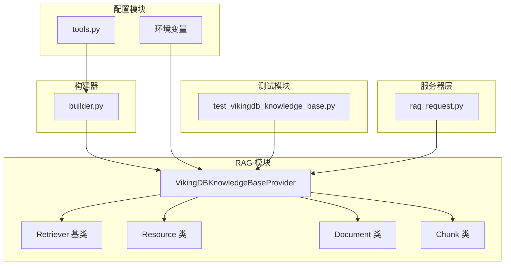
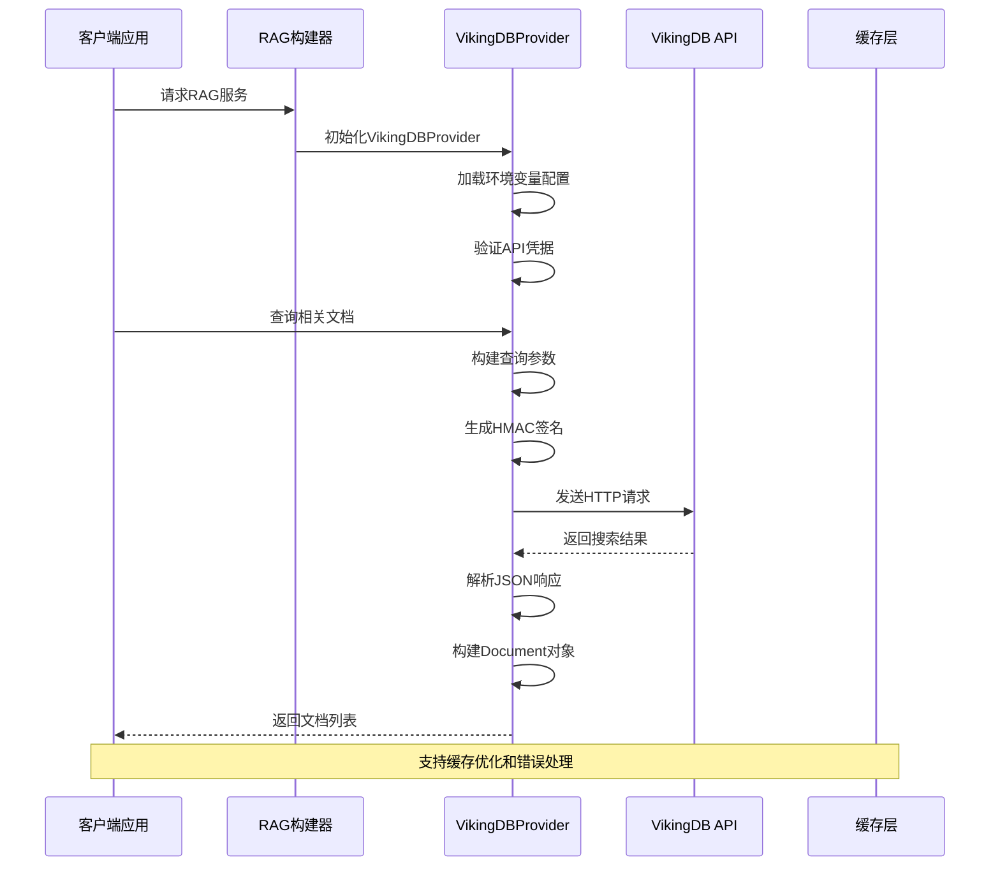
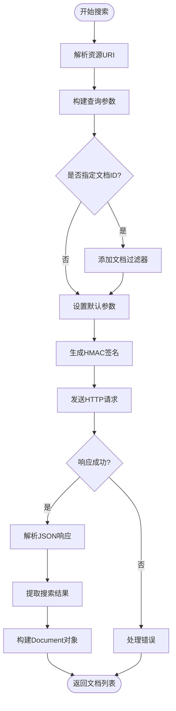
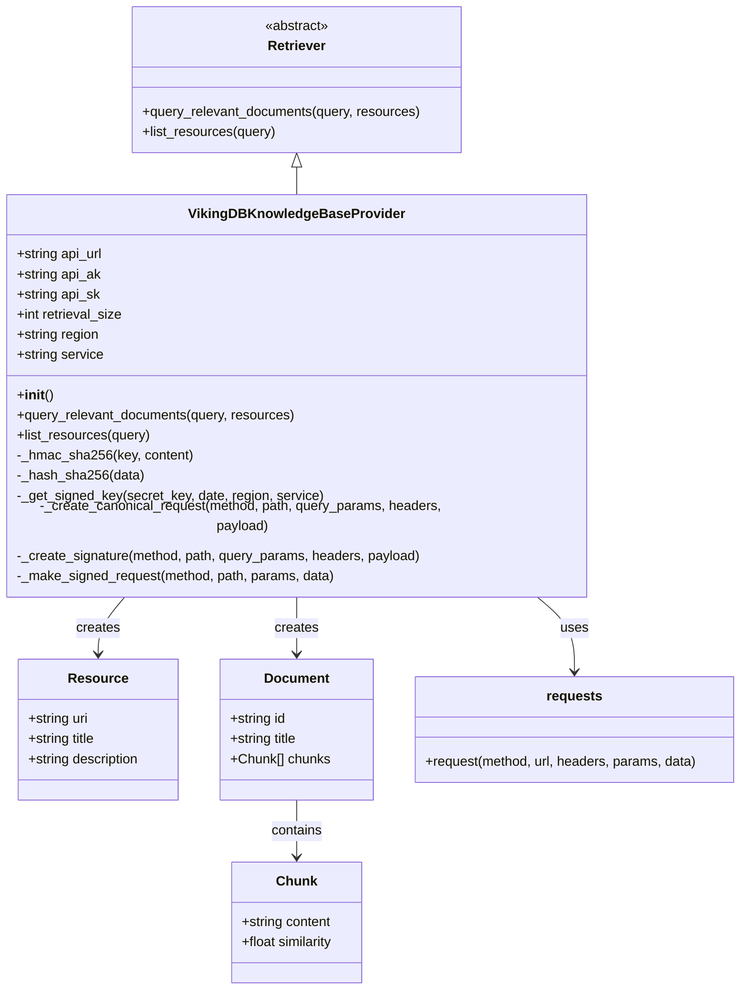

# VikingDB 知识库集成

<cite>
**本文档引用的文件**
- [vikingdb_knowledge_base.py](file://src/rag/vikingdb_knowledge_base.py)
- [test_vikingdb_knowledge_base.py](file://tests/unit/rag/test_vikingdb_knowledge_base.py)
- [builder.py](file://src/rag/builder.py)
- [tools.py](file://src/config/tools.py)
- [milvus.py](file://src/rag/milvus.py)
- [rag_request.py](file://src/server/rag_request.py)
- [what_is_llm.md](file://examples/what_is_llm.md)
</cite>

## 目录
1. [简介](#简介)
2. [项目结构](#项目结构)
3. [核心组件](#核心组件)
4. [架构概览](#架构概览)
5. [详细组件分析](#详细组件分析)
6. [依赖关系分析](#依赖关系分析)
7. [性能考虑](#性能考虑)
8. [故障排除指南](#故障排除指南)
9. [结论](#结论)

## 简介

VikingDB 是字节跳动推出的一款企业级知识库服务，deer-flow 项目通过 `vikingdb_knowledge_base.py` 文件实现了对 VikingDB 的深度集成。该集成提供了完整的知识库管理功能，包括文档上传、语义搜索、资源管理和检索器接口。

VikingDB 知识库集成的主要特点：
- 基于 HTTP API 的安全认证机制
- 支持语义搜索和向量检索
- 提供完整的 CRUD 操作支持
- 与 RAG（检索增强生成）系统无缝集成
- 支持多租户和权限控制

## 项目结构

VikingDB 集成在 deer-flow 项目中的组织结构如下：



**图表来源**
- [vikingdb_knowledge_base.py](file://src/rag/vikingdb_knowledge_base.py#L1-L300)
- [builder.py](file://src/rag/builder.py#L1-L21)
- [tools.py](file://src/config/tools.py#L1-L32)

**章节来源**
- [vikingdb_knowledge_base.py](file://src/rag/vikingdb_knowledge_base.py#L1-L300)
- [builder.py](file://src/rag/builder.py#L1-L21)

## 核心组件

### VikingDBKnowledgeBaseProvider 类

这是 VikingDB 集成的核心类，继承自 `Retriever` 基类，负责处理所有与 VikingDB 知识库相关的操作。

主要功能包括：
- **初始化配置**：从环境变量加载 API 凭证和配置参数
- **认证机制**：实现 HMAC-SHA256 签名算法
- **API 调用**：封装 HTTP 请求并处理响应
- **语义搜索**：执行向量相似度搜索
- **资源管理**：列出和管理知识库资源

### 认证系统

VikingDB 使用基于 HMAC-SHA256 的签名认证机制：

```python
def _create_signature(self, method: str, path: str, query_params: dict, headers: dict, payload: bytes) -> str:
    # 1. 生成时间戳和日期范围
    now = datetime.utcnow()
    date_stamp = now.strftime("%Y%m%dT%H%M%SZ")
    auth_date = date_stamp[:8]
    
    # 2. 创建规范请求
    canonical_request, signed_headers = self._create_canonical_request(
        method, path, query_params, headers, payload
    )
    
    # 3. 生成字符串签名
    algorithm = "HMAC-SHA256"
    credential_scope = f"{auth_date}/{self.region}/{self.service}/request"
    canonical_request_hash = self._hash_sha256(
        canonical_request.encode("utf-8")
    ).hex()
    
    string_to_sign = "\n".join([
        algorithm, date_stamp, credential_scope, canonical_request_hash
    ])
    
    # 4. 计算最终签名
    signing_key = self._get_signed_key(
        self.api_sk, auth_date, self.region, self.service
    )
    signature = hmac.new(
        signing_key, string_to_sign.encode("utf-8"), hashlib.sha256
    ).hexdigest()
    
    return signature
```

**章节来源**
- [vikingdb_knowledge_base.py](file://src/rag/vikingdb_knowledge_base.py#L40-L120)

## 架构概览

VikingDB 集成采用分层架构设计，确保了系统的可扩展性和维护性：



**图表来源**
- [vikingdb_knowledge_base.py](file://src/rag/vikingdb_knowledge_base.py#L120-L200)
- [builder.py](file://src/rag/builder.py#L10-L21)

## 详细组件分析

### 初始化和配置

VikingDBProvider 的初始化过程严格验证所有必需的环境变量：

```python
def __init__(self):
    # 必需的API配置
    api_url = os.getenv("VIKINGDB_KNOWLEDGE_BASE_API_URL")
    if not api_url:
        raise ValueError("VIKINGDB_KNOWLEDGE_BASE_API_URL is not set")
    self.api_url = api_url

    api_ak = os.getenv("VIKINGDB_KNOWLEDGE_BASE_API_AK")
    if not api_ak:
        raise ValueError("VIKINGDB_KNOWLEDGE_BASE_API_AK is not set")
    self.api_ak = api_ak

    api_sk = os.getenv("VIKINGDB_KNOWLEDGE_BASE_API_SK")
    if not api_sk:
        raise ValueError("VIKINGDB_KNOWLEDGE_BASE_API_SK is not set")
    self.api_sk = api_sk

    # 可选的配置参数
    retrieval_size = os.getenv("VIKINGDB_KNOWLEDGE_BASE_RETRIEVAL_SIZE")
    if retrieval_size:
        self.retrieval_size = int(retrieval_size)

    region = os.getenv("VIKINGDB_KNOWLEDGE_BASE_REGION", "cn-north-1")
    self.region = region
```

### 语义搜索实现

VikingDB 的语义搜索功能是其核心特性之一：



**图表来源**
- [vikingdb_knowledge_base.py](file://src/rag/vikingdb_knowledge_base.py#L120-L200)

### 资源管理

VikingDB 提供了完整的资源管理功能：

```python
def list_resources(self, query: str | None = None) -> list[Resource]:
    """
    列出知识库服务中的资源（知识库）
    """
    path = "/api/knowledge/collection/list"
    
    response = self._make_signed_request(method="POST", path=path)
    
    try:
        response_data = response.json()
    except json.JSONDecodeError as e:
        raise ValueError(f"Failed to parse JSON response: {e}")
    
    if response_data["code"] != 0:
        raise Exception(f"Failed to list resources: {response_data['message']}")
    
    resources = []
    rsp_data = response_data.get("data", {})
    collection_list = rsp_data.get("collection_list", [])
    
    for item in collection_list:
        collection_name = item.get("collection_name", "")
        description = item.get("description", "")
        
        if query and query.lower() not in collection_name.lower():
            continue
        
        resource_id = item.get("resource_id", "")
        resource = Resource(
            uri=f"rag://dataset/{resource_id}",
            title=collection_name,
            description=description,
        )
        resources.append(resource)
    
    return resources
```

**章节来源**
- [vikingdb_knowledge_base.py](file://src/rag/vikingdb_knowledge_base.py#L200-L250)

### URI 解析机制

VikingDB 使用特殊的 URI 格式来标识资源：

```python
def parse_uri(uri: str) -> tuple[str, str]:
    """
    解析VikingDB资源URI
    格式: rag://dataset/{resource_id}#{document_id}
    """
    parsed = urlparse(uri)
    if parsed.scheme != "rag":
        raise ValueError(f"Invalid URI: {uri}")
    return parsed.path.split("/")[1], parsed.fragment
```

这种设计允许：
- **资源标识**：通过 resource_id 标识知识库
- **文档过滤**：通过 document_id 过滤特定文档
- **灵活查询**：支持按知识库或特定文档进行搜索

**章节来源**
- [vikingdb_knowledge_base.py](file://src/rag/vikingdb_knowledge_base.py#L290-L300)

## 依赖关系分析

VikingDB 集成的依赖关系展现了清晰的分层架构：



**图表来源**
- [vikingdb_knowledge_base.py](file://src/rag/vikingdb_knowledge_base.py#L15-L30)
- [vikingdb_knowledge_base.py](file://src/rag/vikingdb_knowledge_base.py#L290-L300)

**章节来源**
- [vikingdb_knowledge_base.py](file://src/rag/vikingdb_knowledge_base.py#L1-L300)

## 性能考虑

### 并发处理

VikingDB 集成支持并发查询多个资源：

```python
def query_relevant_documents(self, query: str, resources: list[Resource] = []) -> list[Document]:
    """
    从知识库查询相关文档
    支持同时查询多个资源并合并结果
    """
    if not resources:
        return []

    all_documents = {}
    for resource in resources:
        resource_id, document_id = parse_uri(resource.uri)
        # 构建查询参数...
        
        # 对每个资源单独发起请求
        response = self._make_signed_request(
            method="POST", path=path, data=request_params
        )
        
        # 处理响应并合并结果
        # ...
    
    return list(all_documents.values())
```

### 缓存策略

虽然当前实现没有内置缓存，但可以通过以下方式优化性能：

1. **结果缓存**：缓存常用查询的结果
2. **连接池**：复用 HTTP 连接
3. **批量操作**：支持批量文档上传和查询

### 错误处理

VikingDB 集成实现了完善的错误处理机制：

```python
try:
    response = requests.request(
        method=method,
        url=url,
        headers=signed_headers,
        params=params,
        data=payload if payload else None,
        timeout=30,
    )
    return response
except Exception as e:
    raise ValueError(f"Request failed: {e}")
```

## 故障排除指南

### 常见问题及解决方案

#### 1. 认证失败

**症状**：收到 "Failed to query documents from resource" 错误
**原因**：API 凭证配置错误或过期
**解决方案**：
```bash
# 检查环境变量
echo $VIKINGDB_KNOWLEDGE_BASE_API_URL
echo $VIKINGDB_KNOWLEDGE_BASE_API_AK
echo $VIKINGDB_KNOWLEDGE_BASE_API_SK

# 验证网络连通性
curl -I https://$VIKINGDB_KNOWLEDGE_BASE_API_URL
```

#### 2. 网络超时

**症状**：请求超时或连接失败
**原因**：网络延迟或防火墙限制
**解决方案**：
- 检查网络连接
- 配置适当的超时时间
- 使用代理服务器

#### 3. JSON 解析错误

**症状**：无法解析 API 响应
**原因**：API 返回格式异常
**解决方案**：
```python
try:
    response_data = response.json()
except json.JSONDecodeError as e:
    print(f"Response content: {response.text}")
    raise ValueError(f"Failed to parse JSON response: {e}")
```

#### 4. 资源不存在

**症状**：查询特定资源时返回空结果
**原因**：资源 ID 错误或资源已被删除
**解决方案**：
```python
# 检查可用资源
resources = provider.list_resources()
print(f"Available resources: {[r.uri for r in resources]}")

# 验证URI格式
try:
    resource_id, document_id = parse_uri("rag://dataset/your_resource_id#doc_id")
    print(f"Parsed resource_id: {resource_id}, document_id: {document_id}")
except ValueError as e:
    print(f"Invalid URI format: {e}")
```

### 监控建议

1. **日志记录**：启用详细的 API 调用日志
2. **性能监控**：跟踪查询响应时间和成功率
3. **错误监控**：监控认证失败和网络错误
4. **资源监控**：定期检查可用资源状态

**章节来源**
- [vikingdb_knowledge_base.py](file://src/rag/vikingdb_knowledge_base.py#L100-L120)
- [test_vikingdb_knowledge_base.py](file://tests/unit/rag/test_vikingdb_knowledge_base.py#L1-L200)

## 与其他 RAG 提供商的对比

### 与 Milvus 的对比

| 特性 | VikingDB | Milvus |
|------|----------|---------|
| **部署复杂度** | 云服务，无需本地部署 | 需要本地或远程部署 |
| **配置难度** | 简单，仅需 API 凭证 | 复杂，需要配置向量字段、索引等 |
| **学习曲线** | 低，开箱即用 | 中等，需要了解向量数据库概念 |
| **成本** | 按使用量付费 | 免费开源，但运维成本高 |
| **功能完整性** | 内置语义搜索和向量存储 | 需要额外配置 |
| **易用性** | 高，API 设计简洁 | 中等，需要更多配置 |

### 适用场景建议

#### 推荐使用 VikingDB 的场景：
- **快速原型开发**：需要快速搭建 RAG 系统
- **企业级应用**：需要可靠的服务 SLA
- **团队协作**：多人共享知识库
- **多语言支持**：需要高质量的多语言检索

#### 推荐使用 Milvus 的场景：
- **定制化需求**：需要高度定制的向量存储
- **大规模部署**：需要自托管解决方案
- **特殊向量模型**：需要支持非标准向量模型
- **预算敏感**：需要开源解决方案

## 结论

VikingDB 知识库集成为 deer-flow 项目提供了强大而易用的知识管理能力。通过精心设计的架构和完善的错误处理机制，它能够满足现代 RAG 应用的各种需求。

### 主要优势

1. **简单易用**：只需配置几个环境变量即可使用
2. **安全可靠**：基于 HMAC-SHA256 的强认证机制
3. **功能完整**：支持语义搜索、资源管理和文档操作
4. **易于集成**：与现有 RAG 架构无缝对接

### 最佳实践建议

1. **环境变量管理**：使用 `.env` 文件管理敏感信息
2. **错误处理**：实现完善的异常处理和重试机制
3. **性能优化**：合理设置检索大小和超时时间
4. **监控告警**：建立完善的监控和告警体系

通过遵循这些最佳实践，可以充分发挥 VikingDB 知识库集成的优势，构建稳定高效的 RAG 应用系统。