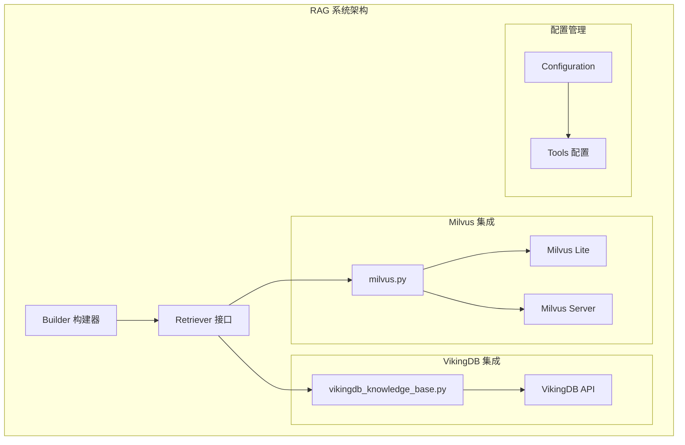
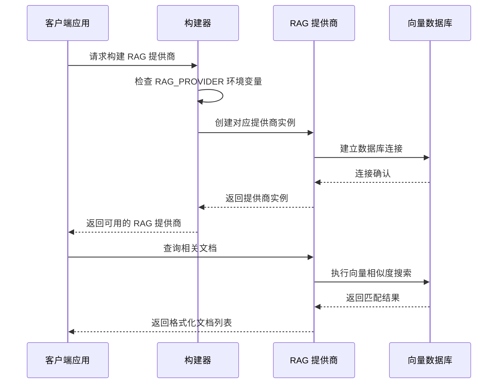
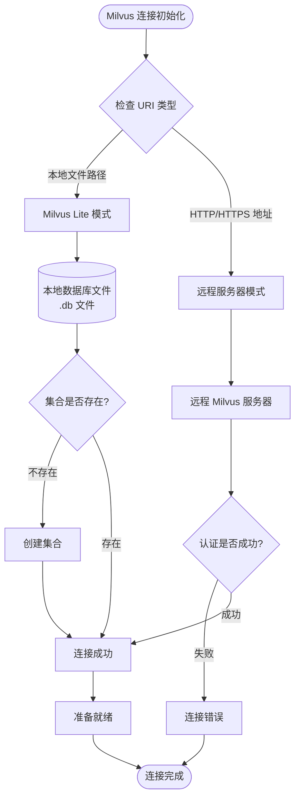
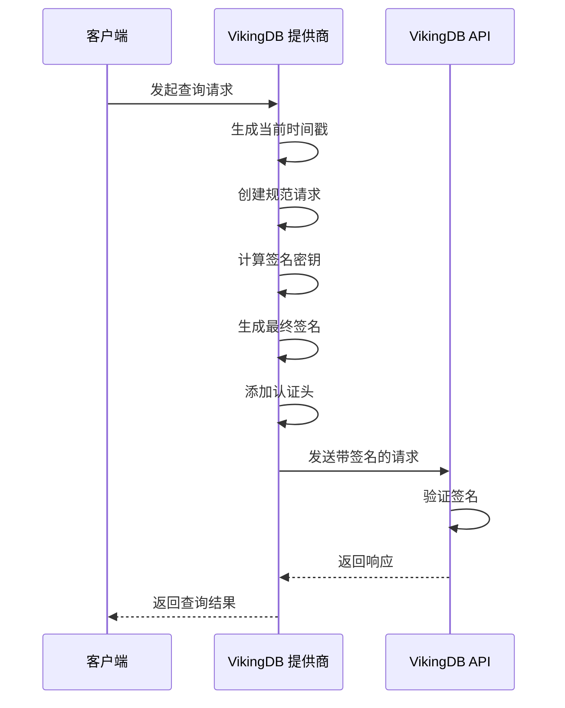
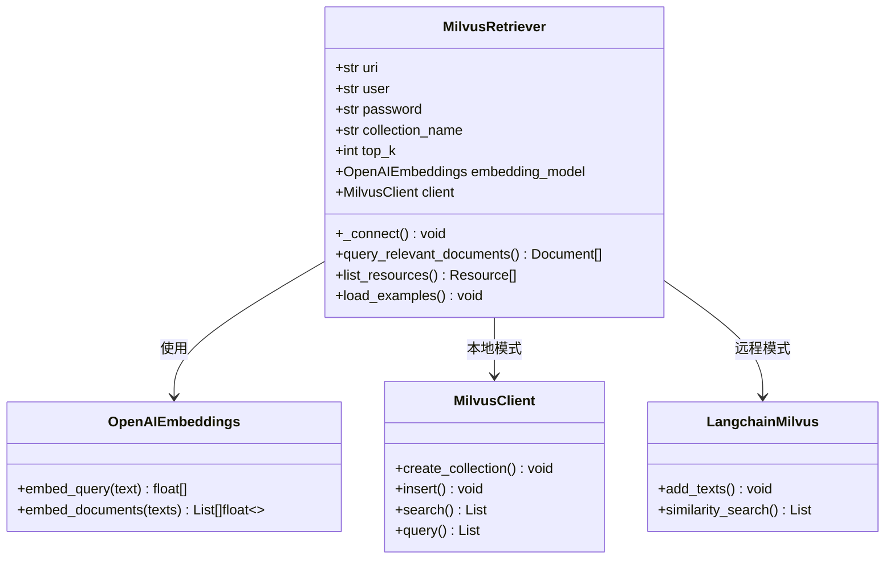
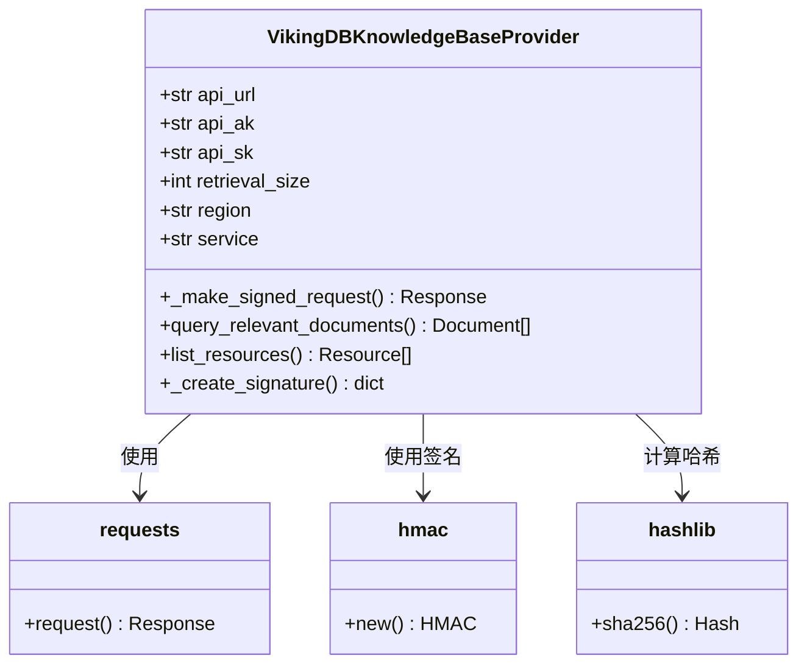

# 数据库集成

<cite>
**本文档中引用的文件**
- [milvus.py](file://src/rag/milvus.py)
- [vikingdb_knowledge_base.py](file://src/rag/vikingdb_knowledge_base.py)
- [builder.py](file://src/rag/builder.py)
- [ragflow.py](file://src/rag/ragflow.py)
- [retriever.py](file://src/rag/retriever.py)
- [tools.py](file://src/config/tools.py)
- [configuration.py](file://src/config/configuration.py)
- [test_milvus.py](file://tests/unit/rag/test_milvus.py)
- [test_vikingdb_knowledge_base.py](file://tests/unit/rag/test_vikingdb_knowledge_base.py)
</cite>

## 目录
1. [简介](#简介)
2. [项目结构](#项目结构)
3. [核心组件](#核心组件)
4. [架构概览](#架构概览)
5. [详细组件分析](#详细组件分析)
6. [依赖关系分析](#依赖关系分析)
7. [性能考虑](#性能考虑)
8. [故障排除指南](#故障排除指南)
9. [结论](#结论)

## 简介

deer-flow 是一个基于 RAG（检索增强生成）技术的智能问答系统，支持多种向量数据库集成方案。本文档详细介绍了 deer-flow 中与 Milvus 和 VikingDB 向量数据库的集成实现，包括连接配置、数据操作接口、查询优化方法以及故障排除指南。

该系统提供了灵活的 RAG 提供商选择机制，支持 Milvus（本地或远程部署）、VikingDB（云端知识库服务）等多种数据库解决方案，满足不同场景下的性能和可用性需求。

## 项目结构

deer-flow 的 RAG 系统采用模块化设计，将不同的向量数据库提供商抽象为统一的接口层：



**图表来源**
- [builder.py](file://src/rag/builder.py#L1-L19)
- [retriever.py](file://src/rag/retriever.py)

**章节来源**
- [builder.py](file://src/rag/builder.py#L1-L19)
- [tools.py](file://src/config/tools.py#L1-L32)

## 核心组件

### RAG 提供商枚举

系统通过 `RAGProvider` 枚举定义了支持的 RAG 提供商：

```python
class RAGProvider(enum.Enum):
    RAGFLOW = "ragflow"
    VIKINGDB_KNOWLEDGE_BASE = "vikingdb_knowledge_base"
    MILVUS = "milvus"
```

### 统一检索器接口

所有 RAG 提供商都实现了统一的 `Retriever` 接口，确保一致的使用体验：

```python
class Retriever:
    def query_relevant_documents(self, query: str, resources: List[Resource]) -> List[Document]:
        """查询相关文档的核心方法"""
        pass
    
    def list_resources(self, query: Optional[str] = None) -> List[Resource]:
        """列出可用资源的方法"""
        pass
```

**章节来源**
- [tools.py](file://src/config/tools.py#L20-L25)
- [retriever.py](file://src/rag/retriever.py)

## 架构概览

deer-flow 的 RAG 系统采用分层架构设计，实现了高度的可扩展性和灵活性：



**图表来源**
- [builder.py](file://src/rag/builder.py#L10-L19)
- [milvus.py](file://src/rag/milvus.py#L70-L120)

## 详细组件分析

### Milvus 集成

Milvus 是一个高性能的向量数据库，支持本地 Lite 版本和远程服务器版本。

#### Milvus 连接配置

```python
class MilvusRetriever(Retriever):
    def __init__(self) -> None:
        # 连接配置
        self.uri: str = get_str_env("MILVUS_URI", "http://localhost:19530")
        self.user: str = get_str_env("MILVUS_USER")
        self.password: str = get_str_env("MILVUS_PASSWORD")
        self.collection_name: str = get_str_env("MILVUS_COLLECTION", "documents")
        
        # 搜索配置
        self.top_k: int = int(get_str_env("MILVUS_TOP_K", "10"))
        
        # 向量字段配置
        self.vector_field: str = get_str_env("MILVUS_VECTOR_FIELD", "embedding")
        self.id_field: str = get_str_env("MILVUS_ID_FIELD", "id")
```

#### Milvus 支持的部署模式



**图表来源**
- [milvus.py](file://src/rag/milvus.py#L400-L450)
- [milvus.py](file://src/rag/milvus.py#L500-L550)

#### Milvus 示例数据加载

Milvus 提供商支持自动加载示例 Markdown 文件：

```python
def _load_example_files(self) -> None:
    """加载示例 Markdown 文件到集合中（幂等操作）"""
    # 获取项目根目录
    current_file = Path(__file__)
    project_root = current_file.parent.parent.parent
    examples_path = project_root / self.examples_dir
    
    # 查找所有 Markdown 文件
    md_files = list(examples_path.glob("*.md"))
    
    # 检查已加载的文档
    existing_docs = self._get_existing_document_ids()
    
    for md_file in md_files:
        doc_id = self._generate_doc_id(md_file)
        
        # 跳过已加载的文件
        if doc_id in existing_docs:
            continue
            
        # 读取并处理文件内容
        content = md_file.read_text(encoding="utf-8")
        title = self._extract_title_from_markdown(content, md_file.name)
        
        # 将长内容分割为块
        chunks = self._split_content(content)
        
        # 插入每个块
        for i, chunk in enumerate(chunks):
            chunk_id = f"{doc_id}_chunk_{i}" if len(chunks) > 1 else doc_id
            self._insert_document_chunk(
                doc_id=chunk_id,
                content=chunk,
                title=title,
                url=f"milvus://{self.collection_name}/{md_file.name}",
                metadata={"source": "examples", "file": md_file.name}
            )
```

**章节来源**
- [milvus.py](file://src/rag/milvus.py#L200-L300)
- [milvus.py](file://src/rag/milvus.py#L400-L500)

### VikingDB 集成

VikingDB 是字节跳动提供的云端知识库服务，通过 API 方式访问。

#### VikingDB 认证机制

VikingDB 使用基于 HMAC-SHA256 的签名认证：

```python
class VikingDBKnowledgeBaseProvider(Retriever):
    def __init__(self):
        # API 认证配置
        self.api_url: str = os.getenv("VIKINGDB_KNOWLEDGE_BASE_API_URL")
        self.api_ak: str = os.getenv("VIKINGDB_KNOWLEDGE_BASE_API_AK")
        self.api_sk: str = os.getenv("VIKINGDB_KNOWLEDGE_BASE_API_SK")
        self.retrieval_size: int = int(os.getenv("VIKINGDB_KNOWLEDGE_BASE_RETRIEVAL_SIZE", "10"))
        self.region: str = os.getenv("VIKINGDB_KNOWLEDGE_BASE_REGION", "cn-north-1")
        self.service: str = "air"
```

#### 签名生成流程



**图表来源**
- [vikingdb_knowledge_base.py](file://src/rag/vikingdb_knowledge_base.py#L100-L200)

#### VikingDB 查询优化

VikingDB 提供了丰富的查询参数和后处理选项：

```python
def query_relevant_documents(self, query: str, resources: list[Resource] = []) -> list[Document]:
    """查询相关文档，支持文档过滤和重排序"""
    all_documents = {}
    
    for resource in resources:
        resource_id, document_id = parse_uri(resource.uri)
        
        request_params = {
            "resource_id": resource_id,
            "query": query,
            "limit": self.retrieval_size,
            "dense_weight": 0.5,  # 密集向量权重
            "pre_processing": {
                "need_instruction": True,  # 是否需要指令处理
                "rewrite": False,          # 是否重写查询
                "return_token_usage": True # 返回令牌使用情况
            },
            "post_processing": {
                "rerank_switch": True,           # 是否启用重排序
                "chunk_diffusion_count": 0,      # 块扩散次数
                "chunk_group": True,             # 是否分组块
                "get_attachment_link": True      # 获取附件链接
            }
        }
        
        # 如果指定了文档ID，则添加过滤条件
        if document_id:
            doc_filter = {"op": "must", "field": "doc_id", "conds": [document_id]}
            query_param = {"doc_filter": doc_filter}
            request_params["query_param"] = query_param
            
        # 发送请求并处理响应
        response = self._make_signed_request("POST", path, data=request_params)
        # 处理响应...
```

**章节来源**
- [vikingdb_knowledge_base.py](file://src/rag/vikingdb_knowledge_base.py#L150-L250)

## 依赖关系分析

### Milvus 依赖关系



**图表来源**
- [milvus.py](file://src/rag/milvus.py#L70-L150)

### VikingDB 依赖关系



**图表来源**
- [vikingdb_knowledge_base.py](file://src/rag/vikingdb_knowledge_base.py#L20-L50)

**章节来源**
- [milvus.py](file://src/rag/milvus.py#L1-L50)
- [vikingdb_knowledge_base.py](file://src/rag/vikingdb_knowledge_base.py#L1-L50)

## 性能考虑

### Milvus 性能优化

1. **索引类型选择**：
   - IVF_FLAT：适合中小规模数据集，查询速度快
   - IVF_SQ8：压缩存储，节省空间但可能影响精度
   - HNSW：适合大规模数据集，平衡速度和精度

2. **批处理优化**：
   ```python
   # 批量插入文档块
   def _batch_insert_chunks(self, chunks: List[dict]):
       """批量插入文档块以提高性能"""
       if len(chunks) > 100:
           # 分批处理大量数据
           for i in range(0, len(chunks), 100):
               batch = chunks[i:i+100]
               self.client.insert(collection_name=self.collection_name, data=batch)
       else:
           self.client.insert(collection_name=self.collection_name, data=chunks)
   ```

3. **内存管理**：
   - 对于大型集合，使用流式查询避免内存溢出
   - 定期清理无用的临时索引

### VikingDB 性能优化

1. **查询参数调优**：
   - `dense_weight`：根据业务需求调整密集向量和稀疏向量的权重
   - `limit`：控制返回结果数量，平衡准确性和性能
   - `rerank_switch`：在需要时启用重排序功能

2. **网络优化**：
   - 使用 CDN 加速 API 请求
   - 启用 HTTP/2 协议减少连接开销
   - 实现请求缓存机制

## 故障排除指南

### Milvus 常见问题

#### 连接问题

**问题**：无法连接到 Milvus 服务器
```bash
# 检查环境变量配置
echo $MILVUS_URI
echo $MILVUS_USER
echo $MILVUS_PASSWORD

# 测试网络连通性
telnet localhost 19530
```

**解决方案**：
1. 确认 Milvus 服务正在运行
2. 检查防火墙设置
3. 验证认证凭据
4. 检查网络代理配置

#### 数据一致性问题

**问题**：查询结果不一致或丢失
```python
# 检查集合状态
def diagnose_collection_status():
    retriever = MilvusProvider()
    retriever._connect()
    
    # 检查集合信息
    if retriever._is_milvus_lite():
        collections = retriever.client.list_collections()
        print(f"可用集合: {collections}")
        
        # 检查集合统计信息
        stats = retriever.client.get_collection_stats(
            collection_name=retriever.collection_name
        )
        print(f"集合统计: {stats}")
```

#### 性能问题诊断

**问题**：查询响应缓慢
```python
# 启用查询日志
import logging
logging.getLogger('pymilvus').setLevel(logging.DEBUG)

# 优化查询参数
def optimize_query_performance():
    # 调整 nprobe 参数
    search_params = {
        "metric_type": "IP",
        "params": {"nprobe": 10}  # 根据数据规模调整
    }
    
    # 使用更精确的索引类型
    index_params = {
        "field_name": "embedding",
        "index_type": "IVF_SQ8",  # 或 HNSW
        "metric_type": "IP",
        "params": {"nlist": 1024}
    }
```

### VikingDB 常见问题

#### 认证失败

**问题**：API 请求返回认证错误
```bash
# 检查 API 凭据
echo $VIKINGDB_KNOWLEDGE_BASE_API_AK
echo $VIKINGDB_KNOWLEDGE_BASE_API_SK

# 验证区域配置
echo $VIKINGDB_KNOWLEDGE_BASE_REGION
```

**解决方案**：
1. 确认 API 密钥有效且未过期
2. 检查区域配置是否正确
3. 验证请求时间戳是否在允许范围内（±15分钟）

#### 网络超时

**问题**：API 请求超时
```python
# 增加超时时间
def increase_timeout():
    # 修改请求超时设置
    response = self._make_signed_request(
        method="POST",
        path="/api/knowledge/collection/search_knowledge",
        data=request_params,
        timeout=60  # 增加到60秒
    )
```

#### 数据格式错误

**问题**：API 返回 JSON 解析错误
```python
# 添加数据验证
def validate_request_data(data):
    required_fields = ["resource_id", "query", "limit"]
    for field in required_fields:
        if field not in data:
            raise ValueError(f"缺少必需字段: {field}")
    
    # 验证资源ID格式
    if not isinstance(data["resource_id"], str) or not data["resource_id"]:
        raise ValueError("无效的 resource_id")
```

### 监控和维护建议

#### 日志记录

```python
import logging

# 配置 RAG 系统日志
logging.basicConfig(
    level=logging.INFO,
    format='%(asctime)s - %(name)s - %(levelname)s - %(message)s',
    handlers=[
        logging.FileHandler('rag_system.log'),
        logging.StreamHandler()
    ]
)

logger = logging.getLogger('rag_system')

# 在关键操作中添加日志
def monitored_operation(operation_name, operation_func):
    logger.info(f"开始执行操作: {operation_name}")
    try:
        result = operation_func()
        logger.info(f"操作成功完成: {operation_name}")
        return result
    except Exception as e:
        logger.error(f"操作失败: {operation_name}, 错误: {str(e)}")
        raise
```

#### 健康检查

```python
def health_check():
    """执行系统健康检查"""
    checks = []
    
    # 检查 Milvus 连接
    try:
        milvus_retriever = MilvusProvider()
        milvus_retriever._connect()
        collections = milvus_retriever.client.list_collections()
        checks.append({"service": "milvus", "status": "healthy", "collections": len(collections)})
    except Exception as e:
        checks.append({"service": "milvus", "status": "unhealthy", "error": str(e)})
    
    # 检查 VikingDB 连接
    try:
        vikingdb_provider = VikingDBKnowledgeBaseProvider()
        resources = vikingdb_provider.list_resources()
        checks.append({"service": "vikingdb", "status": "healthy", "resources": len(resources)})
    except Exception as e:
        checks.append({"service": "vikingdb", "status": "unhealthy", "error": str(e)})
    
    return checks
```

**章节来源**
- [test_milvus.py](file://tests/unit/rag/test_milvus.py#L1-L100)
- [test_vikingdb_knowledge_base.py](file://tests/unit/rag/test_vikingdb_knowledge_base.py#L1-L100)

## 结论

deer-flow 的 RAG 系统通过模块化的架构设计，成功实现了对 Milvus 和 VikingDB 两种主流向量数据库的无缝集成。系统具有以下优势：

1. **灵活性**：支持多种 RAG 提供商，可根据具体需求选择最适合的数据库方案
2. **可扩展性**：统一的接口设计使得添加新的 RAG 提供商变得简单
3. **高性能**：针对不同数据库特性进行了专门的性能优化
4. **易维护**：完善的错误处理和监控机制确保系统的稳定运行

通过本文档的详细说明，开发者可以更好地理解和使用 deer-flow 的 RAG 功能，根据实际需求选择合适的数据库配置，并在遇到问题时快速定位和解决。