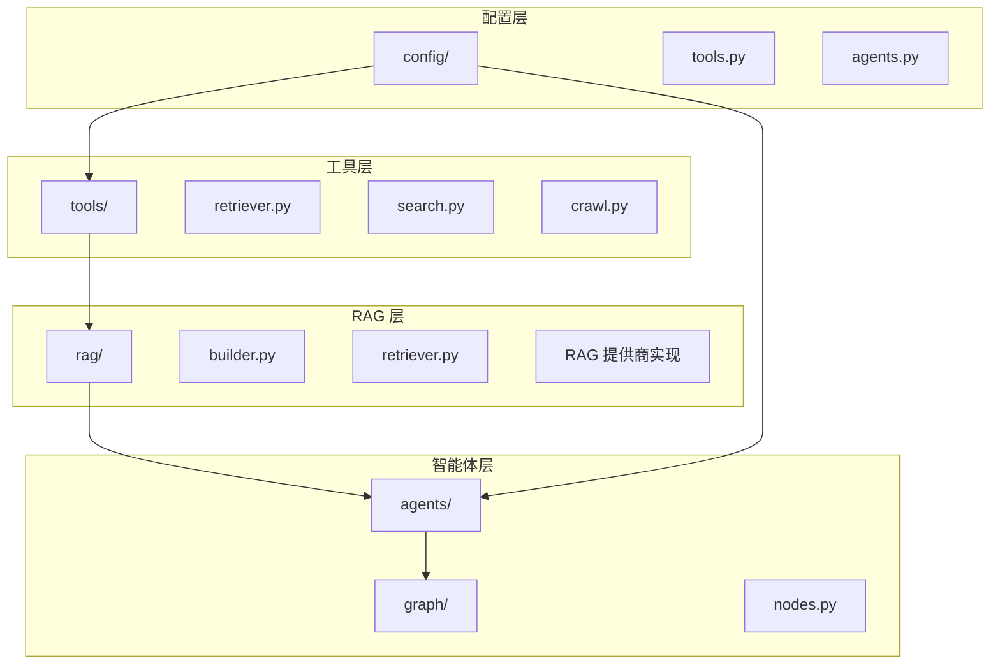
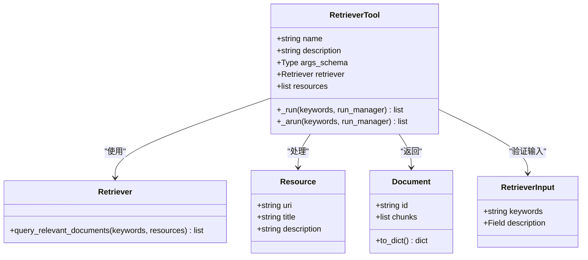
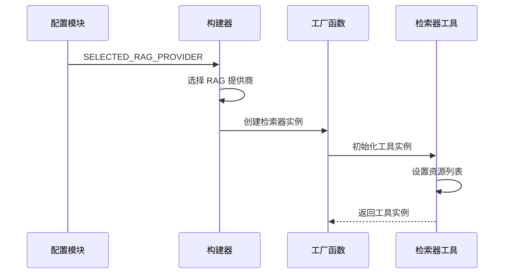
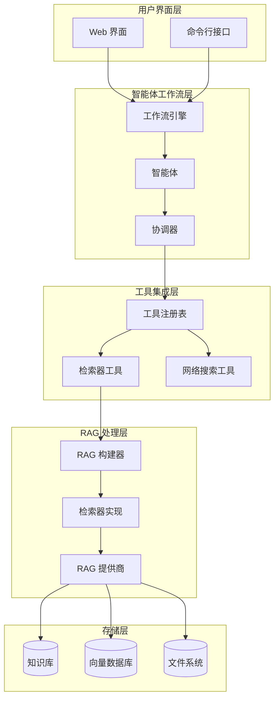
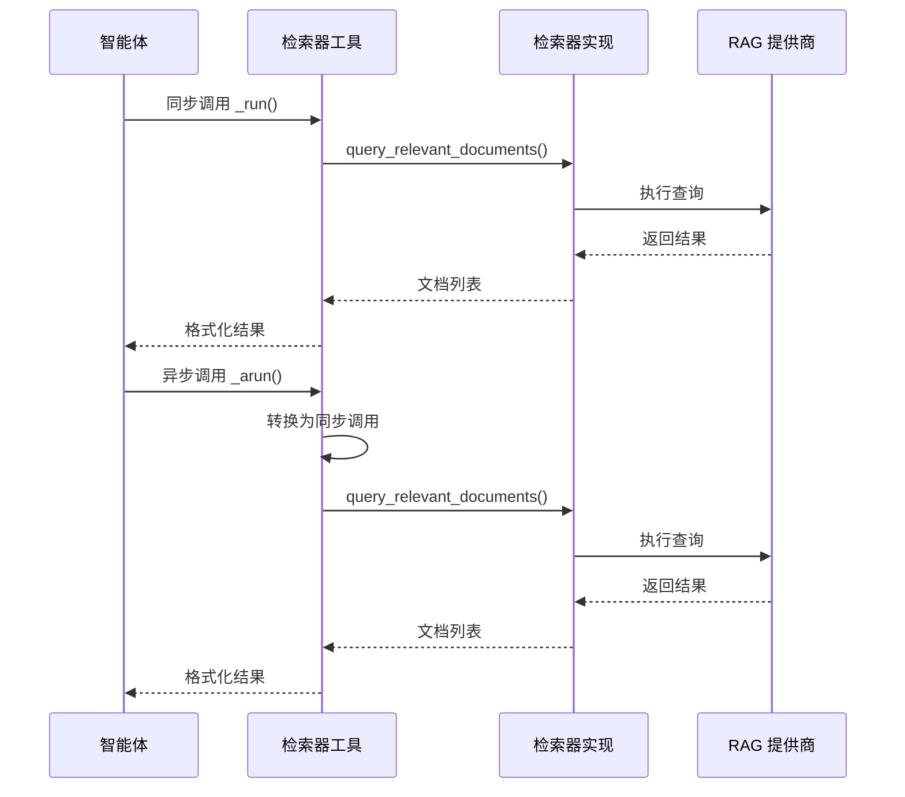
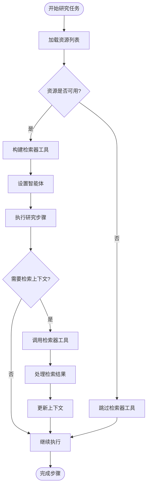
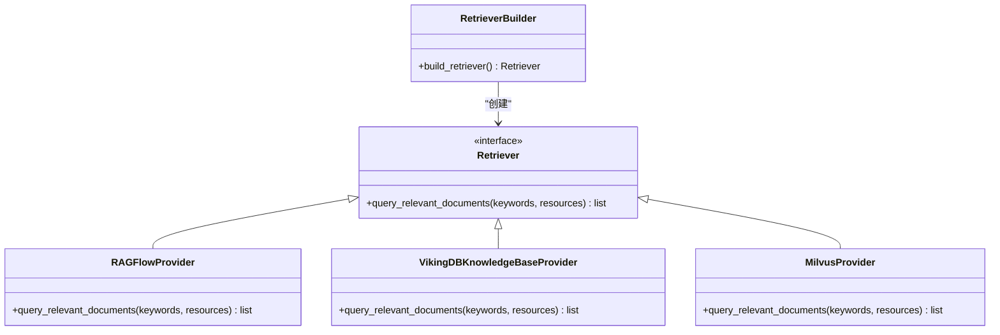
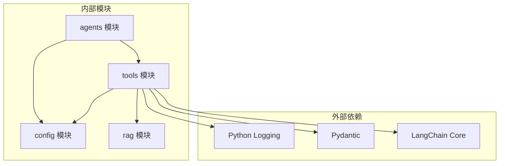

# 工具集成接口

<cite>
**本文档引用的文件**
- [src/tools/retriever.py](file://src/tools/retriever.py)
- [src/config/tools.py](file://src/config/tools.py)
- [src/rag/__init__.py](file://src/rag/__init__.py)
- [src/rag/builder.py](file://src/rag/builder.py)
- [tests/unit/tools/test_tools_retriever.py](file://tests/unit/tools/test_tools_retriever.py)
- [src/agents/agents.py](file://src/agents/agents.py)
- [src/config/agents.py](file://src/config/agents.py)
- [src/workflow.py](file://src/workflow.py)
- [src/graph/builder.py](file://src/graph/builder.py)
- [src/graph/nodes.py](file://src/graph/nodes.py)
</cite>

## 目录
1. [简介](#简介)
2. [项目结构概览](#项目结构概览)
3. [核心组件分析](#核心组件分析)
4. [架构概览](#架构概览)
5. [详细组件分析](#详细组件分析)
6. [依赖关系分析](#依赖关系分析)
7. [性能考虑](#性能考虑)
8. [故障排除指南](#故障排除指南)
9. [结论](#结论)

## 简介

deer-flow 是一个基于多智能体系统的高级研究和报告生成平台。其中 RAG（检索增强生成）检索器工具是系统的核心组件之一，负责从本地知识库中检索相关信息，为智能体提供高质量的上下文信息。本文档详细阐述了 `src/tools/retriever.py` 中定义的检索工具如何被多智能体系统调用，包括工具注册机制、输入输出格式规范以及错误处理策略。

该工具封装了底层的检索逻辑，提供了统一的接口供智能体使用，并支持多种 RAG 提供商（如 RAGFlow、VikingDB 和 Milvus）。通过精心设计的架构，该工具能够无缝集成到整个工作流中，为研究任务提供强大的信息检索能力。

## 项目结构概览

deer-flow 项目采用模块化设计，将不同功能分离到独立的模块中：



**图表来源**
- [src/tools/retriever.py](file://src/tools/retriever.py#L1-L62)
- [src/rag/builder.py](file://src/rag/builder.py#L1-L21)
- [src/graph/nodes.py](file://src/graph/nodes.py#L1-L50)

**章节来源**
- [src/tools/retriever.py](file://src/tools/retriever.py#L1-L62)
- [src/rag/__init__.py](file://src/rag/__init__.py#L1-L18)

## 核心组件分析

### 检索器工具类结构

检索器工具基于 LangChain 的 `BaseTool` 类构建，具有以下核心特性：



**图表来源**
- [src/tools/retriever.py](file://src/tools/retriever.py#L15-L62)

### 工具配置与初始化

工具的配置通过环境变量和工厂函数实现：



**图表来源**
- [src/rag/builder.py](file://src/rag/builder.py#L10-L21)
- [src/tools/retriever.py](file://src/tools/retriever.py#L58-L62)

**章节来源**
- [src/tools/retriever.py](file://src/tools/retriever.py#L15-L62)
- [src/rag/builder.py](file://src/rag/builder.py#L1-L21)

## 架构概览

deer-flow 的 RAG 检索器工具集成采用了分层架构设计：



**图表来源**
- [src/workflow.py](file://src/workflow.py#L1-L104)
- [src/graph/builder.py](file://src/graph/builder.py#L1-L88)
- [src/graph/nodes.py](file://src/graph/nodes.py#L1-L50)

## 详细组件分析

### 检索器工具实现

#### 输入输出格式规范

检索器工具遵循严格的输入输出格式规范：

```python
# 输入模型定义
class RetrieverInput(BaseModel):
    keywords: str = Field(description="search keywords to look up")

# 输出格式：文档对象的字典列表或错误消息
def _run(self, keywords: str, run_manager=None) -> list[Document] | str:
    documents = self.retriever.query_relevant_documents(keywords, self.resources)
    if not documents:
        return "No results found from the local knowledge base."
    return [doc.to_dict() for doc in documents]
```

#### 异步支持

工具同时支持同步和异步执行模式：



**图表来源**
- [src/tools/retriever.py](file://src/tools/retriever.py#L35-L50)

#### 错误处理策略

工具实现了多层次的错误处理机制：

1. **空资源检查**：当资源列表为空时返回 `None`
2. **检索器初始化失败**：当 RAG 提供商不可用时返回 `None`
3. **查询无结果**：当没有匹配文档时返回明确的错误消息
4. **异常传播**：底层异常会向上层传播以便调试

### 多智能体系统集成

#### 工具注册机制

在智能体节点中，检索器工具通过工厂函数动态注册：

```python
async def researcher_node(state: State, config: RunnableConfig):
    # 获取网络搜索工具
    tools = [get_web_search_tool(...), crawl_tool]
    
    # 动态获取检索器工具
    retriever_tool = get_retriever_tool(state.get("resources", []))
    if retriever_tool:
        tools.insert(0, retriever_tool)
    
    # 使用工具创建智能体
    agent = create_agent("researcher", "researcher", tools, "researcher")
    return await _execute_agent_step(state, agent, "researcher")
```

#### 数据传递和上下文管理



**图表来源**
- [src/graph/nodes.py](file://src/graph/nodes.py#L470-L512)

**章节来源**
- [src/tools/retriever.py](file://src/tools/retriever.py#L1-L62)
- [src/graph/nodes.py](file://src/graph/nodes.py#L470-L512)

### 配置方式和扩展性设计

#### 环境变量配置

系统通过环境变量控制 RAG 提供商的选择：

```python
# 支持的 RAG 提供商枚举
class RAGProvider(enum.Enum):
    RAGFLOW = "ragflow"
    VIKINGDB_KNOWLEDGE_BASE = "vikingdb_knowledge_base"
    MILVUS = "milvus"

# 从环境变量读取配置
SELECTED_RAG_PROVIDER = os.getenv("RAG_PROVIDER")
```

#### 扩展性设计

工具架构支持轻松添加新的 RAG 提供商：



**图表来源**
- [src/config/tools.py](file://src/config/tools.py#L18-L25)
- [src/rag/builder.py](file://src/rag/builder.py#L10-L21)

**章节来源**
- [src/config/tools.py](file://src/config/tools.py#L1-L32)
- [src/rag/builder.py](file://src/rag/builder.py#L1-L21)

## 依赖关系分析

### 组件耦合度分析



**图表来源**
- [src/tools/retriever.py](file://src/tools/retriever.py#L1-L15)

### 循环依赖避免

系统通过清晰的模块边界避免循环依赖：

1. **工具层**：专注于工具实现和接口定义
2. **RAG 层**：处理具体的检索逻辑和提供商实现
3. **配置层**：管理全局配置和环境变量
4. **智能体层**：协调工具使用和工作流执行

**章节来源**
- [src/tools/retriever.py](file://src/tools/retriever.py#L1-L15)
- [src/rag/__init__.py](file://src/rag/__init__.py#L1-L18)

## 性能考虑

### 查询优化策略

1. **缓存机制**：虽然当前实现未包含显式缓存，但可以通过扩展添加
2. **批量查询**：支持一次性检索多个关键词
3. **相似度过滤**：通过相似度阈值减少无效结果
4. **并发处理**：异步接口支持并发查询

### 内存管理

工具设计考虑了内存效率：
- 延迟加载：只在需要时创建检索器实例
- 资源清理：及时释放不再使用的资源
- 对象池：可选的对象复用机制

## 故障排除指南

### 常见问题及解决方案

#### 1. 检索器工具无法初始化

**症状**：`get_retriever_tool()` 返回 `None`

**可能原因**：
- 环境变量 `RAG_PROVIDER` 未设置
- 指定的 RAG 提供商不支持
- 资源列表为空

**解决方案**：
```python
# 检查环境变量
import os
print(f"RAG_PROVIDER: {os.getenv('RAG_PROVIDER')}")

# 验证资源配置
resources = state.get("resources", [])
if not resources:
    logger.warning("No resources available for retrieval")
```

#### 2. 检索结果为空

**症状**：工具返回 "No results found from the local knowledge base"

**可能原因**：
- 关键词与知识库内容不匹配
- 知识库索引不完整
- 检索参数设置不当

**解决方案**：
- 检查关键词的准确性和相关性
- 验证知识库内容的完整性
- 调整相似度阈值参数

#### 3. 性能问题

**症状**：检索响应时间过长

**可能原因**：
- 知识库规模过大
- 网络延迟（对于远程 RAG 提供商）
- 并发查询过多

**解决方案**：
- 实施查询结果缓存
- 优化知识库索引
- 添加超时机制

**章节来源**
- [tests/unit/tools/test_tools_retriever.py](file://tests/unit/tools/test_tools_retriever.py#L1-L125)

## 结论

deer-flow 的 RAG 检索器工具集成展现了现代多智能体系统的设计精髓。通过精心设计的架构，该工具成功地将复杂的检索逻辑抽象为简洁易用的接口，为整个系统提供了强大的信息检索能力。

### 主要优势

1. **模块化设计**：清晰的职责分离使得系统易于维护和扩展
2. **灵活配置**：支持多种 RAG 提供商，适应不同的部署需求
3. **异步支持**：完整的同步和异步接口满足不同场景需求
4. **错误处理**：完善的错误处理机制确保系统稳定性
5. **测试覆盖**：全面的单元测试保证代码质量

### 未来改进方向

1. **缓存机制**：添加查询结果缓存以提高性能
2. **监控指标**：增加详细的性能监控和日志记录
3. **负载均衡**：支持多个 RAG 提供商的负载均衡
4. **安全增强**：添加访问控制和数据加密功能
5. **扩展接口**：提供更丰富的插件接口支持

该工具的成功实现为其他类似系统提供了宝贵的参考经验，展示了如何在复杂的多智能体环境中有效地集成和管理检索功能。