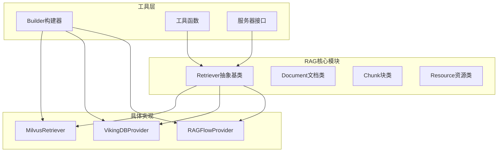
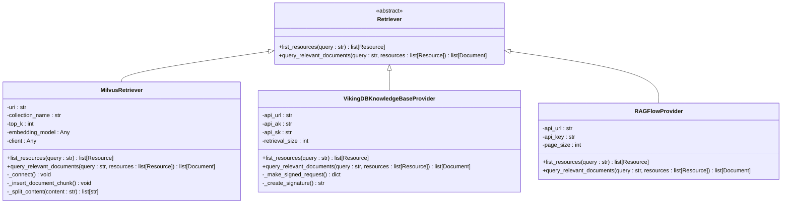
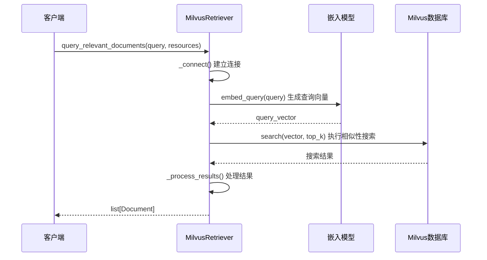
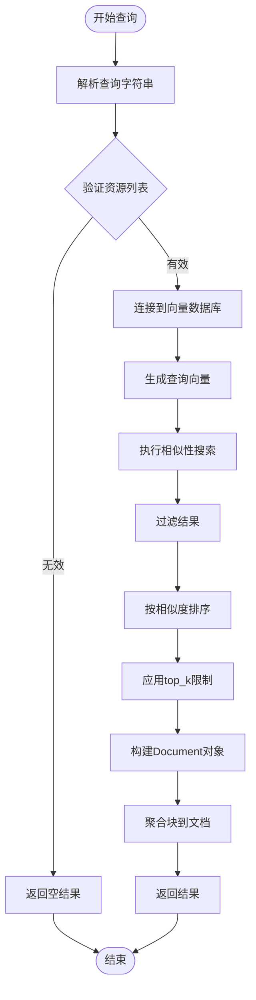

# deer-flow RAG核心检索逻辑详细文档

<cite>
**本文档引用的文件**
- [retriever.py](file://src/rag/retriever.py)
- [milvus.py](file://src/rag/milvus.py)
- [vikingdb_knowledge_base.py](file://src/rag/vikingdb_knowledge_base.py)
- [ragflow.py](file://src/rag/ragflow.py)
- [builder.py](file://src/rag/builder.py)
- [tools.py](file://src/config/tools.py)
- [test_retriever.py](file://tests/unit/rag/test_retriever.py)
- [retriever.py](file://src/tools/retriever.py)
- [rag_request.py](file://src/server/rag_request.py)
</cite>

## 目录
1. [简介](#简介)
2. [项目结构概览](#项目结构概览)
3. [核心数据结构](#核心数据结构)
4. [检索器架构](#检索器架构)
5. [详细组件分析](#详细组件分析)
6. [检索流程详解](#检索流程详解)
7. [性能优化策略](#性能优化策略)
8. [故障排除指南](#故障排除指南)
9. [总结](#总结)

## 简介

deer-flow是一个基于Python的RAG（检索增强生成）系统，提供了完整的知识检索和文档管理功能。该系统支持多种向量数据库后端，包括Milvus、VikingDB和RAGFlow，为用户提供灵活的语义搜索能力。

本文档深入解析了deer-flow中RAG核心检索逻辑的实现细节，包括查询处理流程、向量化机制、相似性计算和结果排序算法等关键组件。

## 项目结构概览

deer-flow的RAG系统采用模块化设计，主要包含以下核心模块：



**图表来源**
- [retriever.py](file://src/rag/retriever.py#L1-L82)
- [milvus.py](file://src/rag/milvus.py#L1-L50)
- [vikingdb_knowledge_base.py](file://src/rag/vikingdb_knowledge_base.py#L1-L50)
- [ragflow.py](file://src/rag/ragflow.py#L1-L50)

## 核心数据结构

### Chunk类 - 文档块

Chunk类是RAG系统中最基础的数据结构，表示文档中的一个语义块：

```python
class Chunk:
    content: str
    similarity: float

    def __init__(self, content: str, similarity: float):
        self.content = content
        self.similarity = similarity
```

每个Chunk包含两个核心属性：
- **content**: 块的文本内容
- **similarity**: 与查询的相似度分数（0-1之间）

### Document类 - 文档对象

Document类封装了一个完整的文档信息：

```python
class Document:
    id: str
    url: str | None = None
    title: str | None = None
    chunks: list[Chunk] = []

    def __init__(
        self,
        id: str,
        url: str | None = None,
        title: str | None = None,
        chunks: list[Chunk] = [],
    ):
        self.id = id
        self.url = url
        self.title = title
        self.chunks = chunks

    def to_dict(self) -> dict:
        d = {
            "id": self.id,
            "content": "\n\n".join([chunk.content for chunk in self.chunks]),
        }
        if self.url:
            d["url"] = self.url
        if self.title:
            d["title"] = self.title
        return d
```

### Resource类 - 资源标识

Resource类用于标识和定位特定的知识库资源：

```python
class Resource(BaseModel):
    uri: str = Field(..., description="The URI of the resource")
    title: str = Field(..., description="The title of the resource")
    description: str | None = Field("", description="The description of the resource")
```

**章节来源**
- [retriever.py](file://src/rag/retriever.py#L8-L82)

## 检索器架构

### 抽象基类设计

Retriever抽象基类定义了所有RAG提供者必须实现的核心接口：



**图表来源**
- [retriever.py](file://src/rag/retriever.py#L45-L82)
- [milvus.py](file://src/rag/milvus.py#L50-L150)
- [vikingdb_knowledge_base.py](file://src/rag/vikingdb_knowledge_base.py#L15-L80)
- [ragflow.py](file://src/rag/ragflow.py#L15-L50)

### 构建器模式

系统使用工厂模式通过Builder模块创建具体的检索器实例：

```python
def build_retriever() -> Retriever | None:
    if SELECTED_RAG_PROVIDER == RAGProvider.RAGFLOW.value:
        return RAGFlowProvider()
    elif SELECTED_RAG_PROVIDER == RAGProvider.VIKINGDB_KNOWLEDGE_BASE.value:
        return VikingDBKnowledgeBaseProvider()
    elif SELECTED_RAG_PROVIDER == RAGProvider.MILVUS.value:
        return MilvusProvider()
    elif SELECTED_RAG_PROVIDER:
        raise ValueError(f"Unsupported RAG provider: {SELECTED_RAG_PROVIDER}")
    return None
```

**章节来源**
- [builder.py](file://src/rag/builder.py#L1-L21)

## 详细组件分析

### Milvus检索器实现

MilvusRetriever是最复杂的实现，支持本地和远程Milvus部署：

#### 初始化配置

```python
def __init__(self) -> None:
    # 连接配置
    self.uri: str = get_str_env("MILVUS_URI", "http://localhost:19530")
    self.user: str = get_str_env("MILVUS_USER")
    self.password: str = get_str_env("MILVUS_PASSWORD")
    self.collection_name: str = get_str_env("MILVUS_COLLECTION", "documents")
    
    # 搜索配置
    top_k_raw = get_str_env("MILVUS_TOP_K", "10")
    self.top_k: int = int(top_k_raw) if top_k_raw.isdigit() else 10
    
    # 向量字段配置
    self.vector_field: str = get_str_env("MILVUS_VECTOR_FIELD", "embedding")
    self.id_field: str = get_str_env("MILVUS_ID_FIELD", "id")
    self.content_field: str = get_str_env("MILVUS_CONTENT_FIELD", "content")
```

#### 查询处理流程



**图表来源**
- [milvus.py](file://src/rag/milvus.py#L50-L200)

#### 文档分割策略

MilvusRetriever实现了智能的文档分割机制：

```python
def _split_content(self, content: str) -> List[str]:
    """按段落分割长文本为块"""
    if len(content) <= self.chunk_size:
        return [content]

    chunks = []
    paragraphs = content.split("\n\n")
    current_chunk = ""

    for paragraph in paragraphs:
        if len(current_chunk) + len(paragraph) <= self.chunk_size:
            current_chunk += paragraph + "\n\n"
        else:
            if current_chunk:
                chunks.append(current_chunk.strip())
            current_chunk = paragraph + "\n\n"

    if current_chunk:
        chunks.append(current_chunk.strip())

    return chunks
```

### VikingDB知识库提供者

VikingDBProvider专门用于与ByteDance的VikingDB服务集成：

#### 签名认证机制

```python
def _create_signature(
    self, method: str, path: str, query_params: dict, headers: dict, payload: bytes
) -> str:
    now = datetime.utcnow()
    date_stamp = now.strftime("%Y%m%dT%H%M%SZ")
    auth_date = date_stamp[:8]

    headers["X-Date"] = date_stamp
    headers["Host"] = self.api_url.replace("https://", "").replace("http://", "")
    headers["X-Content-Sha256"] = self._hash_sha256(payload).hex()
    headers["Content-Type"] = "application/json"

    canonical_request, signed_headers = self._create_canonical_request(
        method, path, query_params, headers, payload
    )

    algorithm = "HMAC-SHA256"
    credential_scope = f"{auth_date}/{self.region}/{self.service}/request"
    canonical_request_hash = self._hash_sha256(
        canonical_request.encode("utf-8")
    ).hex()

    string_to_sign = "\n".join(
        [algorithm, date_stamp, credential_scope, canonical_request_hash]
    )

    signing_key = self._get_signed_key(
        self.api_sk, auth_date, self.region, self.service
    )
    signature = hmac.new(
        signing_key, string_to_sign.encode("utf-8"), hashlib.sha256
    ).hexdigest()

    return signature
```

### RAGFlow提供者

RAGFlowProvider集成了RAGFlow平台的服务：

```python
def query_relevant_documents(
    self, query: str, resources: list[Resource] = []
) -> list[Document]:
    headers = {
        "Authorization": f"Bearer {self.api_key}",
        "Content-Type": "application/json",
    }

    dataset_ids: list[str] = []
    document_ids: list[str] = []

    for resource in resources:
        dataset_id, document_id = parse_uri(resource.uri)
        dataset_ids.append(dataset_id)
        if document_id:
            document_ids.append(document_id)

    payload = {
        "question": query,
        "dataset_ids": dataset_ids,
        "document_ids": document_ids,
        "page_size": self.page_size,
    }

    if self.cross_languages:
        payload["cross_languages"] = self.cross_languages

    response = requests.post(
        f"{self.api_url}/api/v1/retrieval", headers=headers, json=payload
    )

    # 处理响应并构建Document对象
    result = response.json()
    data = result.get("data", {})
    doc_aggs = data.get("doc_aggs", [])
    docs: dict[str, Document] = {
        doc.get("doc_id"): Document(
            id=doc.get("doc_id"),
            title=doc.get("doc_name"),
            chunks=[],
        )
        for doc in doc_aggs
    }

    for chunk in data.get("chunks", []):
        doc = docs.get(chunk.get("document_id"))
        if doc:
            doc.chunks.append(
                Chunk(
                    content=chunk.get("content"),
                    similarity=chunk.get("similarity"),
                )
            )

    return list(docs.values())
```

**章节来源**
- [milvus.py](file://src/rag/milvus.py#L50-L400)
- [vikingdb_knowledge_base.py](file://src/rag/vikingdb_knowledge_base.py#L15-L200)
- [ragflow.py](file://src/rag/ragflow.py#L30-L100)

## 检索流程详解

### 查询处理管道



**图表来源**
- [milvus.py](file://src/rag/milvus.py#L200-L400)
- [ragflow.py](file://src/rag/ragflow.py#L30-L80)

### 分页机制

不同提供者实现了各自的分页机制：

#### Milvus分页
```python
# 在Milvus中，分页通过offset和limit参数控制
results = self.client.search(
    collection_name=self.collection_name,
    data=[query_vector],
    anns_field=self.vector_field,
    param=search_param,
    limit=self.top_k,
    offset=page_offset,
    output_fields=["*"]
)
```

#### RAGFlow分页
```python
payload = {
    "question": query,
    "dataset_ids": dataset_ids,
    "document_ids": document_ids,
    "page_size": self.page_size,  # 控制每页大小
    "page": page_number      # 当前页码
}
```

### 过滤条件应用

系统支持多种过滤条件：

1. **相似度阈值过滤**
```python
filtered_chunks = [chunk for chunk in chunks if chunk.similarity >= score_threshold]
```

2. **资源类型过滤**
```python
filtered_resources = [
    resource for resource in resources 
    if resource.uri.startswith("rag://")
]
```

3. **元数据过滤**
```python
# 在Milvus中可以通过filter参数实现
filter_expr = f"{self.title_field} LIKE '%{title_filter}%'"
results = self.client.query(
    collection_name=self.collection_name,
    filter=filter_expr,
    output_fields=["*"]
)
```

## 性能优化策略

### 索引优化

#### Milvus索引配置
```python
index_params = {
    "field_name": self.vector_field,
    "index_type": "IVF_FLAT",  # 或 "IVF_SQ8", "IVF_PQ"
    "metric_type": "IP",       # 内积相似度
    "params": {"nlist": 1024}  # 聚类中心数量
}
```

#### 索引类型选择
- **IVF_FLAT**: 精度高但速度慢
- **IVF_SQ8**: 8位量化，平衡精度和速度
- **IVF_PQ**: 高效压缩，适合大规模数据

### 查询缓存

```python
class RetrievalCache:
    def __init__(self, ttl: int = 3600):
        self.cache = {}
        self.ttl = ttl
    
    def get(self, query_hash: str) -> list[Document] | None:
        if query_hash in self.cache:
            result, timestamp = self.cache[query_hash]
            if time.time() - timestamp < self.ttl:
                return result
            del self.cache[query_hash]
        return None
    
    def set(self, query_hash: str, documents: list[Document]):
        self.cache[query_hash] = (documents, time.time())
```

### 批量处理优化

```python
def batch_query_relevant_documents(
    self, queries: list[str], resources: list[Resource] = []
) -> list[list[Document]]:
    """批量处理多个查询"""
    # 并行生成嵌入向量
    query_vectors = self.embedding_model.embed_documents(queries)
    
    # 批量搜索
    results = self.client.search_batch(
        collection_name=self.collection_name,
        data=query_vectors,
        anns_field=self.vector_field,
        param=search_param,
        limit=self.top_k
    )
    
    # 处理批量结果
    return [self._process_single_result(r) for r in results]
```

### 内存管理

```python
class MemoryEfficientRetriever:
    def __init__(self, chunk_size: int = 1000):
        self.chunk_size = chunk_size
        self._clear_cache()
    
    def _clear_cache(self):
        gc.collect()  # 强制垃圾回收
        self.current_memory_usage = 0
    
    def _process_large_dataset(self, documents: list[Document]):
        """分批处理大型文档集合"""
        for i in range(0, len(documents), self.chunk_size):
            batch = documents[i:i + self.chunk_size]
            yield self._process_batch(batch)
```

## 故障排除指南

### 常见问题诊断

#### 1. 连接失败
```python
def diagnose_connection_issues(self):
    """诊断连接问题"""
    try:
        # 测试基本连接
        self.client.describe_collection(self.collection_name)
        print("✓ 连接正常")
    except Exception as e:
        print(f"✗ 连接失败: {e}")
        
        # 检查网络连通性
        import socket
        host, port = self.uri.split(':')
        try:
            socket.create_connection((host, int(port)), timeout=5)
            print("✓ 网络可达")
        except socket.error:
            print("✗ 网络不可达")
```

#### 2. 向量维度不匹配
```python
def validate_embedding_dimensions(self):
    """验证嵌入维度"""
    test_text = "测试文本"
    test_embedding = self.embedding_model.embed_query(test_text)
    
    if len(test_embedding) != self.embedding_dim:
        print(f"⚠ 维度不匹配: 配置 {self.embedding_dim}, 实际 {len(test_embedding)}")
        return False
    return True
```

#### 3. 性能监控
```python
import time
from functools import wraps

def monitor_performance(func):
    @wraps(func)
    def wrapper(*args, **kwargs):
        start_time = time.time()
        try:
            result = func(*args, **kwargs)
            duration = time.time() - start_time
            print(f"✓ {func.__name__} 成功 ({duration:.2f}s)")
            return result
        except Exception as e:
            duration = time.time() - start_time
            print(f"✗ {func.__name__} 失败 ({duration:.2f}s): {e}")
            raise
    return wrapper
```

### 日志记录最佳实践

```python
import logging

logger = logging.getLogger(__name__)

class RAGLogger:
    @staticmethod
    def log_retrieval_attempt(query: str, resources: list[Resource]):
        logger.info("检索尝试", extra={
            "query": query,
            "resource_count": len(resources),
            "timestamp": time.time()
        })
    
    @staticmethod
    def log_retrieval_result(documents: list[Document], duration: float):
        logger.info("检索完成", extra={
            "document_count": len(documents),
            "total_duration": duration,
            "average_similarity": sum(d.chunks[0].similarity for d in documents) / len(documents) if documents else 0
        })
```

**章节来源**
- [milvus.py](file://src/rag/milvus.py#L300-L400)
- [test_retriever.py](file://tests/unit/rag/test_retriever.py#L1-L74)

## 总结

deer-flow的RAG核心检索逻辑展现了现代检索系统的最佳实践：

### 主要特点

1. **模块化架构**: 通过抽象基类和工厂模式实现高度可扩展的设计
2. **多后端支持**: 支持Milvus、VikingDB和RAGFlow三种不同的向量数据库
3. **智能文档处理**: 自动文档分割和块聚合机制
4. **性能优化**: 包括索引优化、查询缓存和内存管理
5. **错误处理**: 完善的异常处理和诊断功能

### 最佳实践建议

1. **选择合适的后端**: 根据数据规模和性能需求选择Milvus或云端服务
2. **优化索引配置**: 根据应用场景调整索引类型和参数
3. **实施缓存策略**: 对高频查询结果实施适当的缓存
4. **监控系统性能**: 建立完善的日志和监控体系
5. **定期维护**: 定期重建索引和清理过期数据

### 未来发展方向

1. **多模态支持**: 扩展到图像和音频等多模态数据
2. **分布式部署**: 支持更大规模的数据集和更高的并发
3. **实时更新**: 实现更高效的增量索引更新机制
4. **智能路由**: 基于查询特征自动选择最优检索路径

通过深入理解这些核心概念和实现细节，开发者可以更好地利用deer-flow构建高性能的RAG应用，为用户提供准确、快速的知识检索服务。