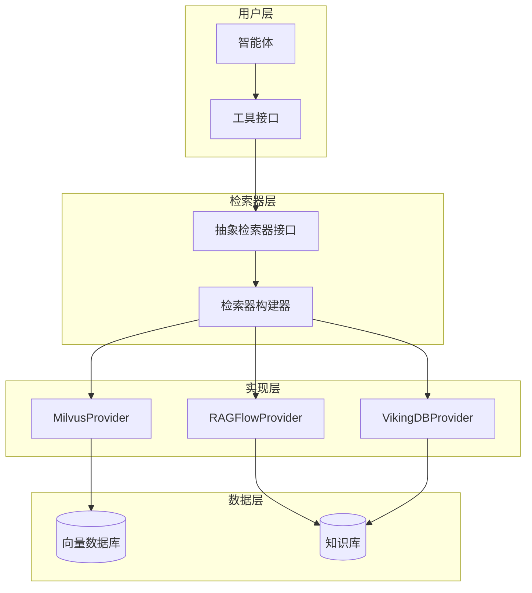
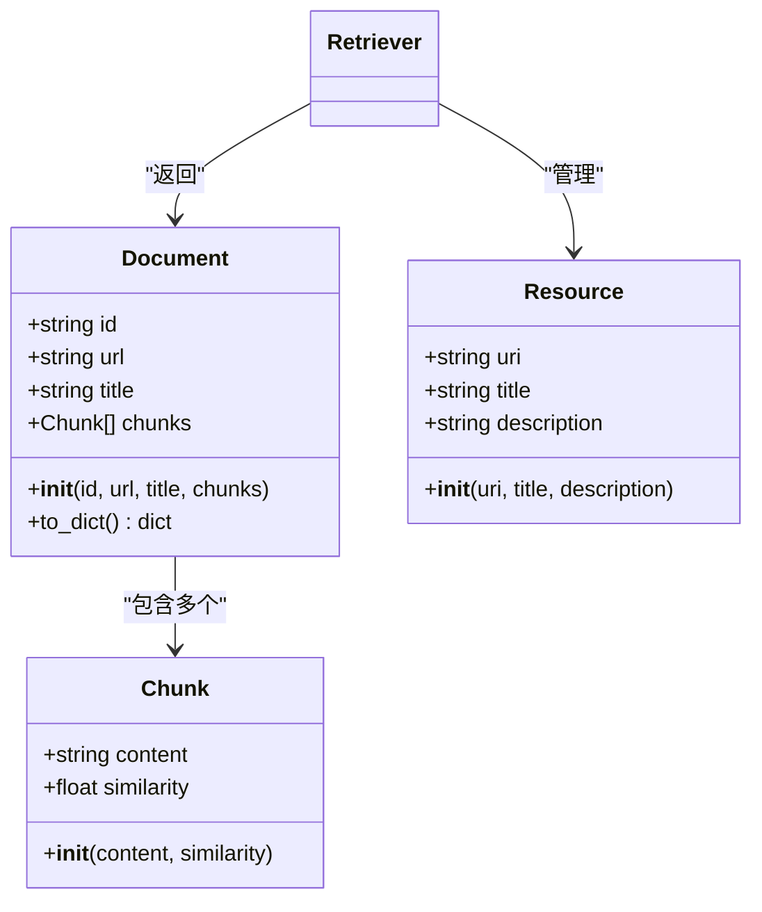
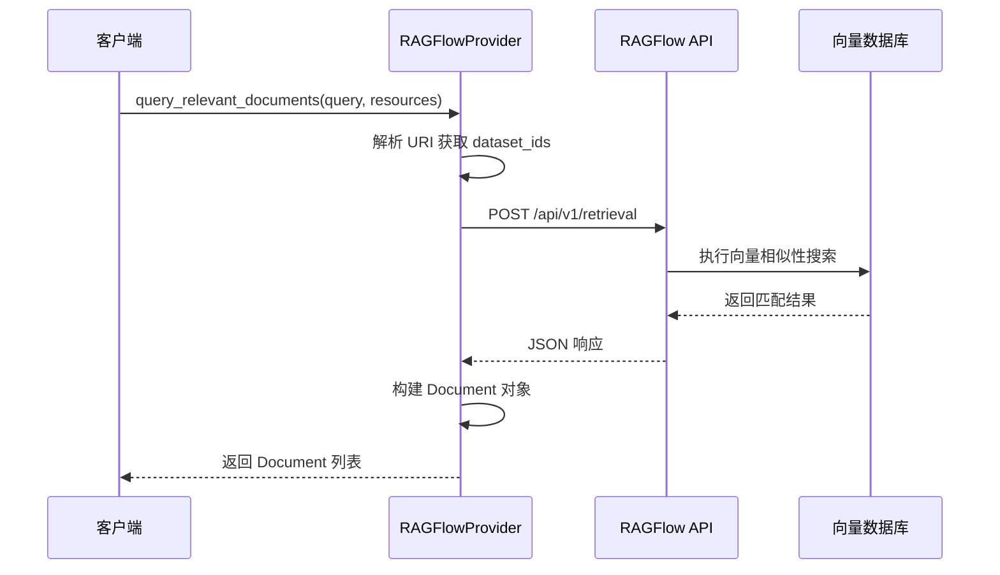
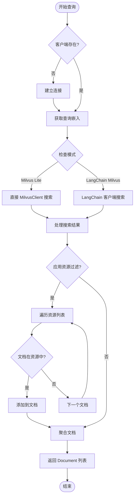
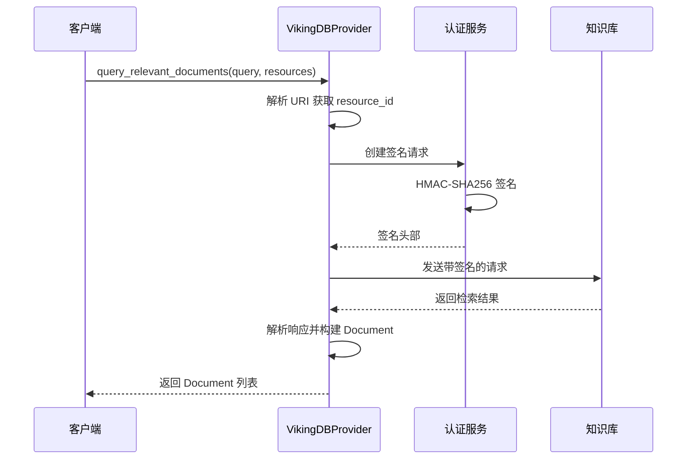
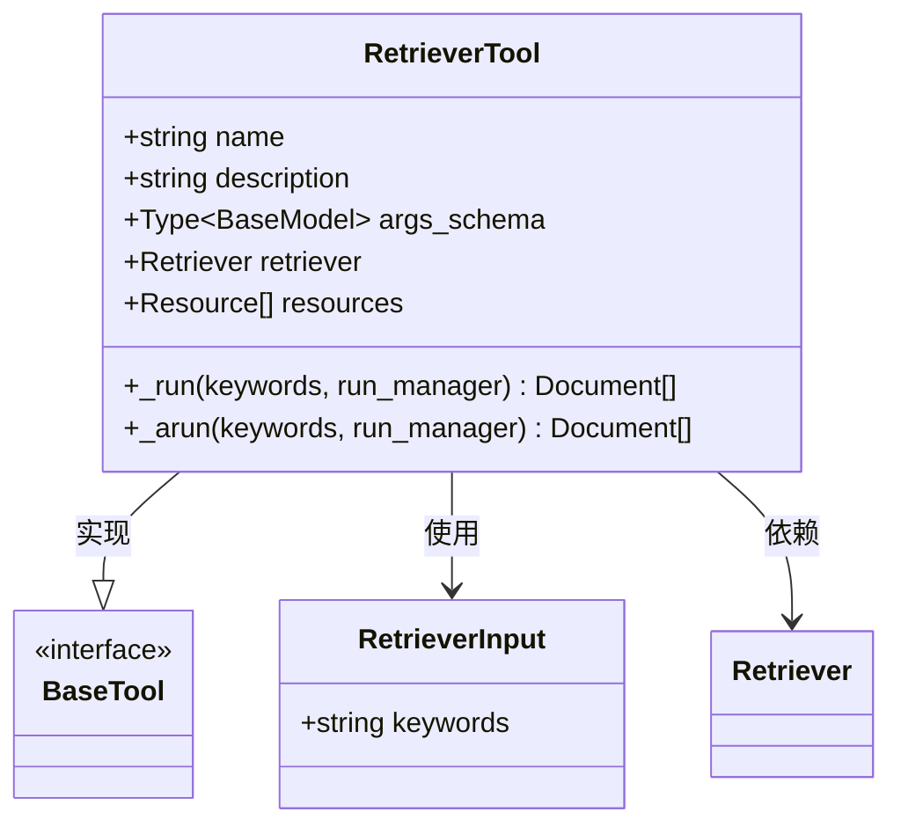
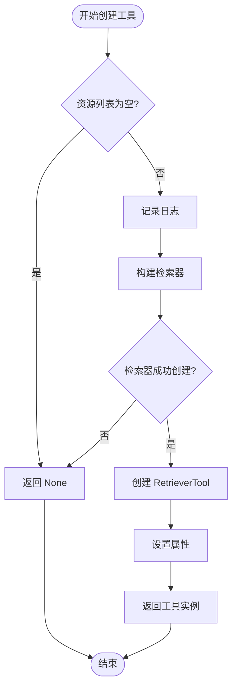

# 检索器实现

<cite>
**本文档引用的文件**
- [src/rag/retriever.py](file://src/rag/retriever.py)
- [src/tools/retriever.py](file://src/tools/retriever.py)
- [src/config/tools.py](file://src/config/tools.py)
- [src/rag/builder.py](file://src/rag/builder.py)
- [src/rag/ragflow.py](file://src/rag/ragflow.py)
- [src/rag/milvus.py](file://src/rag/milvus.py)
- [src/rag/vikingdb_knowledge_base.py](file://src/rag/vikingdb_knowledge_base.py)
- [src/server/rag_request.py](file://src/server/rag_request.py)
- [tests/unit/rag/test_retriever.py](file://tests/unit/rag/test_retriever.py)
- [tests/unit/tools/test_tools_retriever.py](file://tests/unit/tools/test_tools_retriever.py)
</cite>

## 目录
1. [简介](#简介)
2. [架构概览](#架构概览)
3. [核心组件分析](#核心组件分析)
4. [检索器实现详解](#检索器实现详解)
5. [工具接口集成](#工具接口集成)
6. [配置管理](#配置管理)
7. [性能优化](#性能优化)
8. [实际用例](#实际用例)
9. [故障排除指南](#故障排除指南)
10. [总结](#总结)

## 简介

deer-flow 项目中的 RAG（检索增强生成）检索器是一个高度模块化和可扩展的系统，旨在为智能体提供高效的文档检索能力。该系统通过抽象的 `Retriever` 接口支持多种后端实现，包括 RAGFlow、Milvus 和 VikingDB 等知识库服务。

检索器的核心功能包括：
- 查询处理和相似性搜索
- 多种向量数据库的统一接口
- 资源管理和过滤
- 结果排序和聚合
- 异步查询支持
- 缓存策略和性能优化

## 架构概览



**图表来源**
- [src/rag/retriever.py](file://src/rag/retriever.py#L48-L82)
- [src/rag/builder.py](file://src/rag/builder.py#L10-L19)

## 核心组件分析

### 抽象检索器接口

`Retriever` 类是整个检索器系统的核心抽象，定义了所有检索器必须实现的基本接口：

```python
class Retriever(abc.ABC):
    @abc.abstractmethod
    def list_resources(self, query: str | None = None) -> list[Resource]:
        """列出资源从 RAG 提供商"""
        pass

    @abc.abstractmethod
    def query_relevant_documents(
        self, query: str, resources: list[Resource] = []
    ) -> list[Document]:
        """从资源中查询相关文档"""
        pass
```

### 数据模型设计

系统定义了三个核心数据模型来表示检索过程中的各个实体：



**图表来源**
- [src/rag/retriever.py](file://src/rag/retriever.py#L8-L47)

**章节来源**
- [src/rag/retriever.py](file://src/rag/retriever.py#L1-L82)

## 检索器实现详解

### RAGFlowProvider 实现

RAGFlowProvider 是一个基于 HTTP API 的远程检索器实现，专门用于与 RAGFlow 知识库服务交互：



**图表来源**
- [src/rag/ragflow.py](file://src/rag/ragflow.py#L42-L100)

关键特性：
- 支持跨语言查询（通过 `cross_languages` 参数）
- 可配置的分页大小（`page_size`）
- 资源过滤和 URI 解析
- 错误处理和状态码检查

### MilvusProvider 实现

MilvusProvider 是一个本地向量数据库实现，支持 Milvus Lite 和远程服务器两种模式：



**图表来源**
- [src/rag/milvus.py](file://src/rag/milvus.py#L540-L650)

主要功能：
- 自动集合创建和索引配置
- 支持本地和远程 Milvus 部署
- 可配置的 top_k 结果数量
- 示例文档自动加载
- 资源过滤和文档聚合

### VikingDBProvider 实现

VikingDBProvider 是一个企业级知识库提供商，具有完整的身份验证和签名机制：



**图表来源**
- [src/rag/vikingdb_knowledge_base.py](file://src/rag/vikingdb_knowledge_base.py#L180-L250)

特色功能：
- 完整的 AWS 签名认证机制
- 支持密集和稀疏检索的加权组合
- 可配置的检索参数
- 异常处理和重试机制

**章节来源**
- [src/rag/ragflow.py](file://src/rag/ragflow.py#L1-L137)
- [src/rag/milvus.py](file://src/rag/milvus.py#L540-L739)
- [src/rag/vikingdb_knowledge_base.py](file://src/rag/vikingdb_knowledge_base.py#L1-L199)

## 工具接口集成

### RetrieverTool 设计

`RetrieverTool` 是 LangChain 工具接口的实现，允许智能体直接调用检索功能：



**图表来源**
- [src/tools/retriever.py](file://src/tools/retriever.py#L18-L62)

### 工具创建流程



**图表来源**
- [src/tools/retriever.py](file://src/tools/retriever.py#L54-L62)

**章节来源**
- [src/tools/retriever.py](file://src/tools/retriever.py#L1-L62)

## 配置管理

### RAG 提供商配置

系统支持三种主要的 RAG 提供商，通过环境变量进行配置：

```python
class RAGProvider(enum.Enum):
    RAGFLOW = "ragflow"
    VIKINGDB_KNOWLEDGE_BASE = "vikingdb_knowledge_base"
    MILVUS = "milvus"

SELECTED_RAG_PROVIDER = os.getenv("RAG_PROVIDER")
```

### 检索参数配置

每个提供商都有自己的配置参数：

#### RAGFlow 配置
- `RAGFLOW_API_URL`: API 服务地址
- `RAGFLOW_API_KEY`: 访问密钥
- `RAGFLOW_PAGE_SIZE`: 分页大小，默认 10
- `RAGFLOW_CROSS_LANGUAGES`: 跨语言支持

#### Milvus 配置
- `MILVUS_URI`: 连接 URI 或本地路径
- `MILVUS_COLLECTION`: 集合名称，默认 "documents"
- `MILVUS_TOP_K`: 结果数量，默认 10
- `MILVUS_EMBEDDING_PROVIDER`: 嵌入模型提供商
- `MILVUS_AUTO_LOAD_EXAMPLES`: 是否自动加载示例

#### VikingDB 配置
- `VIKINGDB_KNOWLEDGE_BASE_API_URL`: API 地址
- `VIKINGDB_KNOWLEDGE_BASE_API_AK`: 访问密钥
- `VIKINGDB_KNOWLEDGE_BASE_API_SK`: 秘钥
- `VIKINGDB_KNOWLEDGE_BASE_RETRIEVAL_SIZE`: 检索大小

**章节来源**
- [src/config/tools.py](file://src/config/tools.py#L1-L32)
- [src/rag/builder.py](file://src/rag/builder.py#L1-L19)

## 性能优化

### 缓存策略

虽然当前实现没有显式的缓存机制，但可以通过以下方式进行优化：

1. **嵌入缓存**: 缓存常用的查询嵌入向量
2. **结果缓存**: 缓存相似查询的结果
3. **连接池**: 复用数据库连接

### 异步查询支持

系统提供了完整的异步查询支持：

```python
async def _arun(
    self,
    keywords: str,
    run_manager: Optional[AsyncCallbackManagerForToolRun] = None,
) -> list[Document]:
    return self._run(keywords, run_manager.get_sync())
```

### 并行处理

对于多个资源的查询，可以考虑并行处理：

```python
async def query_multiple_resources(self, queries: list[str], resources: list[Resource]):
    tasks = [
        self.query_relevant_documents(query, resources)
        for query in queries
    ]
    results = await asyncio.gather(*tasks)
    return results
```

## 实际用例

### 基本检索调用

```python
# 创建资源
resources = [
    Resource(uri="rag://dataset/123", title="技术文档"),
    Resource(uri="rag://dataset/456", title="产品手册")
]

# 获取检索器工具
retriever_tool = get_retriever_tool(resources)

# 执行检索
results = retriever_tool._run("如何配置网络设置？")
```

### 高级配置用例

```python
# 自定义检索参数
class AdvancedRetrieverTool(RetrieverTool):
    def __init__(self, retriever, resources, top_k=20, similarity_threshold=0.7):
        super().__init__(retriever=retriever, resources=resources)
        self.top_k = top_k
        self.similarity_threshold = similarity_threshold
    
    def _run(self, keywords, run_manager=None):
        documents = self.retriever.query_relevant_documents(keywords, self.resources)
        
        # 应用相似度阈值过滤
        filtered_docs = []
        for doc in documents:
            # 过滤低相似度的块
            filtered_chunks = [
                chunk for chunk in doc.chunks 
                if chunk.similarity >= self.similarity_threshold
            ]
            
            if filtered_chunks:
                doc.chunks = filtered_chunks
                filtered_docs.append(doc)
        
        # 限制返回结果数量
        return [doc.to_dict() for doc in filtered_docs[:self.top_k]]
```

### 批量检索处理

```python
async def batch_retrieval_example():
    # 准备多个查询
    queries = [
        "机器学习算法",
        "深度学习框架",
        "自然语言处理"
    ]
    
    # 获取资源
    retriever = build_retriever()
    resources = retriever.list_resources()
    
    # 创建工具
    tool = RetrieverTool(retriever=retriever, resources=resources)
    
    # 并行执行多个查询
    tasks = [tool._arun(query) for query in queries]
    results = await asyncio.gather(*tasks)
    
    return results
```

## 故障排除指南

### 常见问题及解决方案

#### 1. 检索器初始化失败

**症状**: `ValueError: RAGFLOW_API_URL is not set`

**解决方案**:
```bash
export RAGFLOW_API_URL="https://your-ragflow-instance.com"
export RAGFLOW_API_KEY="your-api-key"
```

#### 2. 连接超时

**症状**: `requests.exceptions.Timeout`

**解决方案**:
- 检查网络连接
- 增加超时时间
- 验证 API 地址正确性

#### 3. 资源未找到

**症状**: 检索结果为空

**解决方案**:
```python
# 检查可用资源
retriever = build_retriever()
resources = retriever.list_resources()
print(f"可用资源数量: {len(resources)}")

# 验证 URI 格式
for resource in resources:
    print(f"URI: {resource.uri}, 标题: {resource.title}")
```

#### 4. 性能问题

**症状**: 检索响应缓慢

**优化建议**:
- 调整 `top_k` 参数
- 使用更高效的嵌入模型
- 启用连接池
- 实施结果缓存

**章节来源**
- [tests/unit/rag/test_retriever.py](file://tests/unit/rag/test_retriever.py#L1-L74)
- [tests/unit/tools/test_tools_retriever.py](file://tests/unit/tools/test_tools_retriever.py#L1-L123)

## 总结

deer-flow 的 RAG 检索器系统展现了优秀的架构设计和实现质量。其主要优势包括：

### 技术优势

1. **模块化设计**: 通过抽象接口实现了良好的可扩展性
2. **多提供商支持**: 支持 RAGFlow、Milvus 和 VikingDB 等多种后端
3. **类型安全**: 使用 Pydantic 模型确保数据完整性
4. **异步支持**: 完整的异步查询支持
5. **错误处理**: 全面的异常处理和状态码检查

### 架构特点

- **清晰的职责分离**: 每个组件都有明确的职责边界
- **配置驱动**: 通过环境变量灵活配置
- **测试覆盖**: 完整的单元测试和集成测试
- **文档完善**: 清晰的代码注释和文档结构

### 扩展建议

1. **缓存机制**: 实施 LRU 缓存或 Redis 缓存
2. **监控指标**: 添加性能监控和日志记录
3. **负载均衡**: 支持多个提供商的负载均衡
4. **自动重试**: 实施指数退避重试机制
5. **批量处理**: 支持批量查询和结果聚合

这个检索器系统为 deer-flow 提供了强大的知识检索能力，是构建智能应用的重要基础设施。通过合理的配置和优化，可以满足各种规模的应用需求。