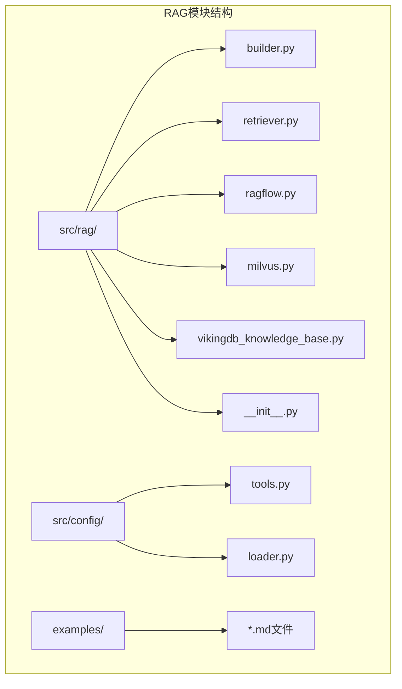
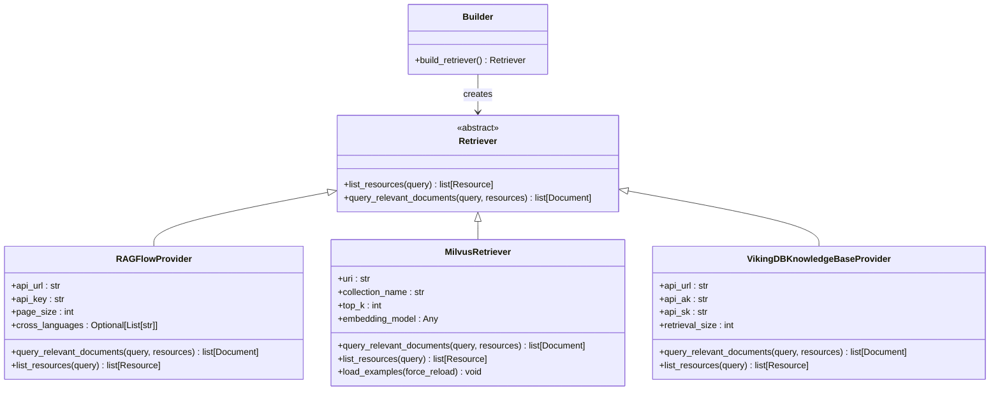
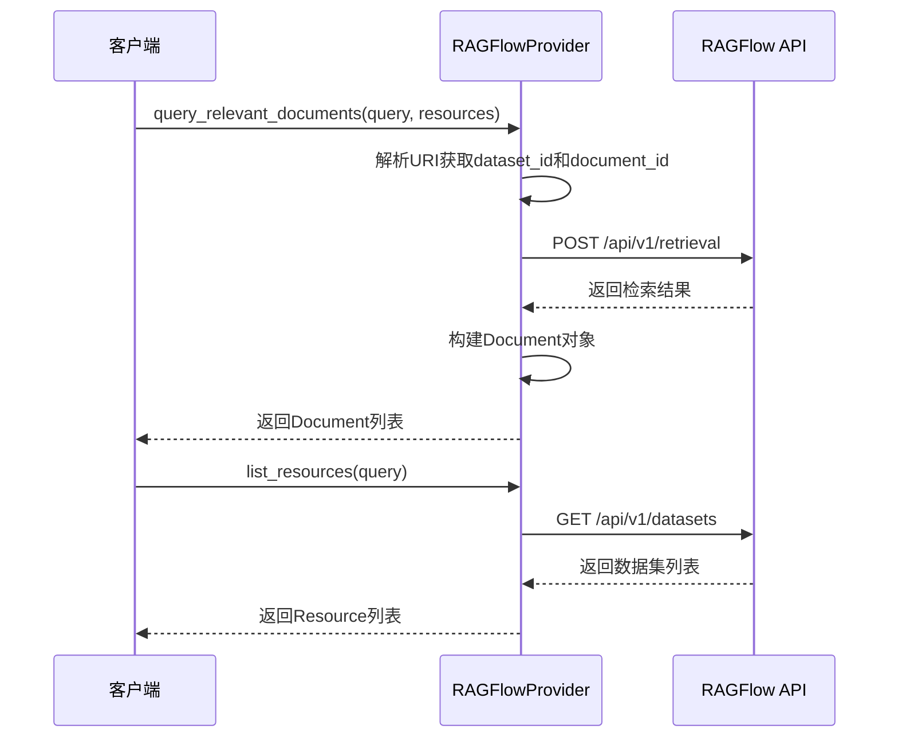
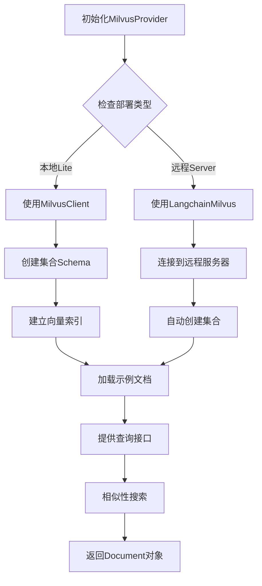
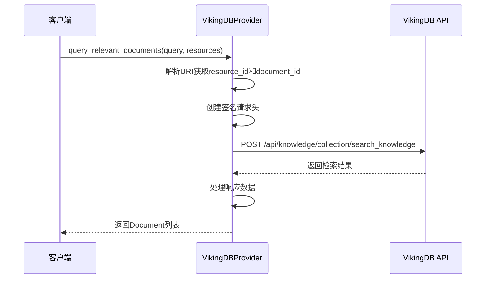
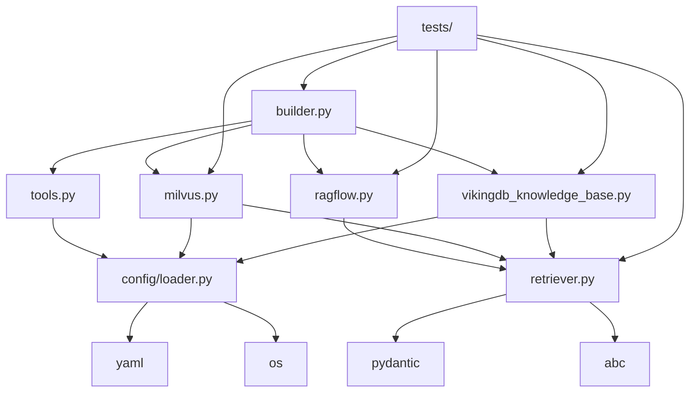

# 知识库构建模块

<cite>
**本文档中引用的文件**
- [src/rag/builder.py](file://src/rag/builder.py)
- [src/rag/__init__.py](file://src/rag/__init__.py)
- [src/rag/retriever.py](file://src/rag/retriever.py)
- [src/rag/ragflow.py](file://src/rag/ragflow.py)
- [src/rag/milvus.py](file://src/rag/milvus.py)
- [src/rag/vikingdb_knowledge_base.py](file://src/rag/vikingdb_knowledge_base.py)
- [src/config/tools.py](file://src/config/tools.py)
- [src/config/loader.py](file://src/config/loader.py)
- [tests/unit/rag/test_milvus.py](file://tests/unit/rag/test_milvus.py)
- [examples/what_is_llm.md](file://examples/what_is_llm.md)
</cite>

## 目录
1. [简介](#简介)
2. [项目结构](#项目结构)
3. [核心组件](#核心组件)
4. [架构概览](#架构概览)
5. [详细组件分析](#详细组件分析)
6. [依赖关系分析](#依赖关系分析)
7. [性能考虑](#性能考虑)
8. [故障排除指南](#故障排除指南)
9. [结论](#结论)

## 简介

deer-flow的RAG（检索增强生成）知识库构建模块是一个高度模块化和可扩展的知识管理框架。该模块提供了统一的接口来集成不同的向量数据库和检索服务，支持多种RAG提供商，包括RAGFlow、Milvus和VikingDB知识库。

该模块的核心设计理念是通过抽象层将具体的RAG实现与上层应用解耦，使得系统能够灵活地切换不同的知识库后端，同时保持一致的API接口。

## 项目结构

RAG模块采用分层架构设计，主要包含以下关键目录和文件：



**图表来源**
- [src/rag/builder.py](file://src/rag/builder.py#L1-L21)
- [src/rag/retriever.py](file://src/rag/retriever.py#L1-L82)
- [src/config/tools.py](file://src/config/tools.py#L1-L32)

**章节来源**
- [src/rag/builder.py](file://src/rag/builder.py#L1-L21)
- [src/rag/__init__.py](file://src/rag/__init__.py#L1-L16)

## 核心组件

### RAG提供者枚举

系统支持三种主要的RAG提供者：

```python
class RAGProvider(enum.Enum):
    RAGFLOW = "ragflow"
    VIKINGDB_KNOWLEDGE_BASE = "vikingdb_knowledge_base"
    MILVUS = "milvus"
```

### 检索器基类

所有RAG提供者都继承自抽象基类`Retriever`，该类定义了统一的接口：

```python
class Retriever(abc.ABC):
    @abc.abstractmethod
    def list_resources(self, query: str | None = None) -> list[Resource]:
        pass

    @abc.abstractmethod
    def query_relevant_documents(
        self, query: str, resources: list[Resource] = []
    ) -> list[Document]:
        pass
```

**章节来源**
- [src/config/tools.py](file://src/config/tools.py#L18-L23)
- [src/rag/retriever.py](file://src/rag/retriever.py#L58-L82)

## 架构概览

RAG知识库构建模块采用工厂模式设计，通过`build_retriever()`函数根据配置动态创建相应的RAG提供者实例：



**图表来源**
- [src/rag/builder.py](file://src/rag/builder.py#L10-L20)
- [src/rag/retriever.py](file://src/rag/retriever.py#L58-L82)
- [src/rag/ragflow.py](file://src/rag/ragflow.py#L15-L40)
- [src/rag/milvus.py](file://src/rag/milvus.py#L70-L120)
- [src/rag/vikingdb_knowledge_base.py](file://src/rag/vikingdb_knowledge_base.py#L15-L50)

## 详细组件分析

### RAG构建器工厂

`build_retriever()`函数是整个RAG系统的入口点，它根据环境变量`RAG_PROVIDER`的值创建相应的RAG提供者实例：

```python
def build_retriever() -> Retriever | None:
    if SELECTED_RAG_PROVIDER == RAGProvider.RAGFLOW.value:
        return RAGFlowProvider()
    elif SELECTED_RAG_PROVIDER == RAGProvider.VIKINGDB_KNOWLEDGE_BASE.value:
        return VikingDBKnowledgeBaseProvider()
    elif SELECTED_RAG_PROVIDER == RAGProvider.MILVUS.value:
        return MilvusProvider()
    elif SELECTED_RAG_PROVIDER:
        raise ValueError(f"Unsupported RAG provider: {SELECTED_RAG_PROVIDER}")
    return None
```

这个设计允许系统在运行时动态选择最适合的RAG提供者，无需修改代码即可切换不同的知识库后端。

**章节来源**
- [src/rag/builder.py](file://src/rag/builder.py#L10-L20)

### RAGFlow提供商

RAGFlow提供商实现了基于HTTP API的知识库检索功能，支持查询相关文档和列出资源：



**图表来源**
- [src/rag/ragflow.py](file://src/rag/ragflow.py#L45-L136)

#### 主要特性

1. **多数据集支持**：可以同时查询多个数据集中的文档
2. **跨语言检索**：支持设置`cross_languages`参数进行跨语言查询
3. **URI解析**：自动解析`rag://dataset/{id}`格式的URI
4. **错误处理**：完善的异常处理和状态码检查

**章节来源**
- [src/rag/ragflow.py](file://src/rag/ragflow.py#L15-L136)

### Milvus提供商

Milvus提供商是最复杂也是功能最丰富的RAG提供者，支持本地和远程部署：



**图表来源**
- [src/rag/milvus.py](file://src/rag/milvus.py#L70-L150)
- [src/rag/milvus.py](file://src/rag/milvus.py#L500-L600)

#### 核心功能

1. **双模式支持**：
   - **Milvus Lite**：本地文件数据库，适合开发和小规模部署
   - **远程Milvus**：分布式向量数据库，适合生产环境

2. **智能文档分块**：
   ```python
   def _split_content(self, content: str) -> List[str]:
       if len(content) <= self.chunk_size:
           return [content]
       
       chunks = []
       paragraphs = content.split("\n\n")
       current_chunk = ""
       
       for paragraph in paragraphs:
           if len(current_chunk) + len(paragraph) <= self.chunk_size:
               current_chunk += paragraph + "\n\n"
           else:
               if current_chunk:
                   chunks.append(current_chunk.strip())
               current_chunk = paragraph + "\n\n"
       
       if current_chunk:
           chunks.append(current_chunk.strip())
       
       return chunks
   ```

3. **嵌入模型支持**：
   - OpenAI嵌入模型
   - DashScope嵌入模型
   - 自动维度检测和配置

**章节来源**
- [src/rag/milvus.py](file://src/rag/milvus.py#L70-L200)
- [src/rag/milvus.py](file://src/rag/milvus.py#L500-L700)

### VikingDB知识库提供商

VikingDB提供商专为阿里云服务设计，提供企业级知识库检索能力：



**图表来源**
- [src/rag/vikingdb_knowledge_base.py](file://src/rag/vikingdb_knowledge_base.py#L120-L180)

#### 安全特性

1. **HMAC签名认证**：使用HMAC-SHA256算法生成请求签名
2. **时间戳验证**：防止重放攻击
3. **区域配置**：支持多地域部署
4. **服务标识**：明确的服务标识和凭证管理

**章节来源**
- [src/rag/vikingdb_knowledge_base.py](file://src/rag/vikingdb_knowledge_base.py#L15-L100)
- [src/rag/vikingdb_knowledge_base.py](file://src/rag/vikingdb_knowledge_base.py#L120-L200)

## 依赖关系分析

RAG模块的依赖关系体现了清晰的分层架构：



**图表来源**
- [src/rag/builder.py](file://src/rag/builder.py#L1-L8)
- [src/rag/retriever.py](file://src/rag/retriever.py#L1-L5)
- [src/config/loader.py](file://src/config/loader.py#L1-L10)

**章节来源**
- [src/rag/builder.py](file://src/rag/builder.py#L1-L8)
- [src/rag/__init__.py](file://src/rag/__init__.py#L1-L16)

## 性能考虑

### 向量搜索优化

不同RAG提供者采用了不同的性能优化策略：

1. **Milvus Lite**：
   - 使用IVF_FLAT索引类型
   - 支持nprobe参数调优
   - 内存映射文件访问

2. **远程Milvus**：
   - 自动索引管理
   - 连接池复用
   - 批量插入优化

3. **RAGFlow**：
   - 分页查询控制
   - 跨语言检索缓存
   - 异步请求处理

### 缓存策略

- **配置缓存**：避免重复解析YAML配置文件
- **连接缓存**：复用数据库连接
- **嵌入缓存**：减少重复的向量计算

## 故障排除指南

### 常见问题及解决方案

1. **RAG提供者未找到**
   ```
   ValueError: Unsupported RAG provider: {provider_name}
   ```
   **解决**：检查`RAG_PROVIDER`环境变量设置

2. **Milvus连接失败**
   ```
   ConnectionError: Failed to connect to Milvus
   ```
   **解决**：验证`MILVUS_URI`配置和网络连通性

3. **嵌入模型初始化失败**
   ```
   RuntimeError: Failed to generate embedding
   ```
   **解决**：检查API密钥和模型名称配置

**章节来源**
- [src/rag/builder.py](file://src/rag/builder.py#L15-L20)
- [src/rag/milvus.py](file://src/rag/milvus.py#L600-L700)

### 配置最佳实践

1. **环境变量配置**：
   ```bash
   # RAG提供者选择
   export RAG_PROVIDER=milvus
   
   # Milvus配置
   export MILVUS_URI=http://localhost:19530
   export MILVUS_COLLECTION=documents
   export MILVUS_EMBEDDING_MODEL=text-embedding-ada-002
   
   # 自动加载示例
   export MILVUS_AUTO_LOAD_EXAMPLES=true
   ```

2. **性能调优**：
   - 调整`MILVUS_TOP_K`参数控制返回结果数量
   - 优化`MILVUS_CHUNK_SIZE`影响文档分块粒度
   - 根据硬件配置调整索引参数

## 结论

deer-flow的RAG知识库构建模块展现了优秀的软件架构设计原则：

1. **模块化设计**：通过抽象基类和工厂模式实现松耦合
2. **可扩展性**：易于添加新的RAG提供者实现
3. **配置驱动**：通过环境变量实现灵活的配置管理
4. **错误处理**：完善的异常处理和用户友好的错误信息
5. **测试覆盖**：全面的单元测试确保代码质量

该模块为构建高性能、可维护的知识管理系统提供了坚实的基础，支持从个人项目到企业级应用的各种场景需求。