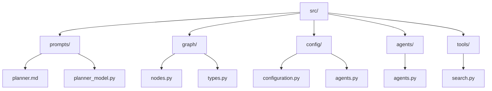
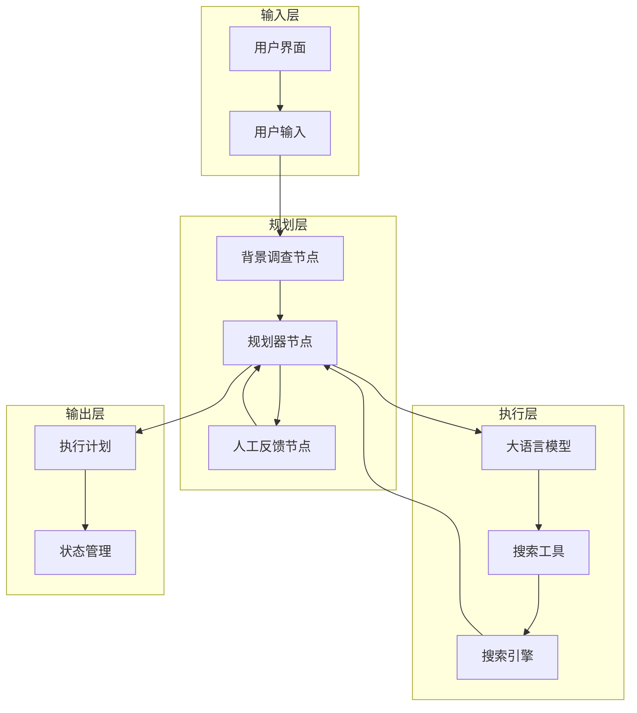
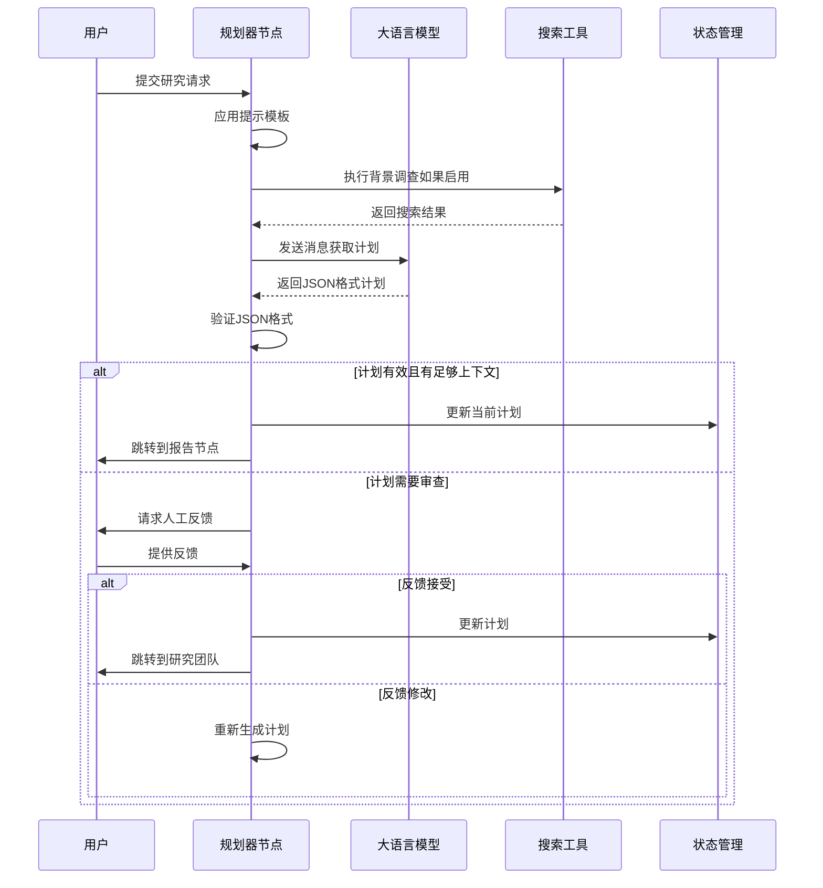
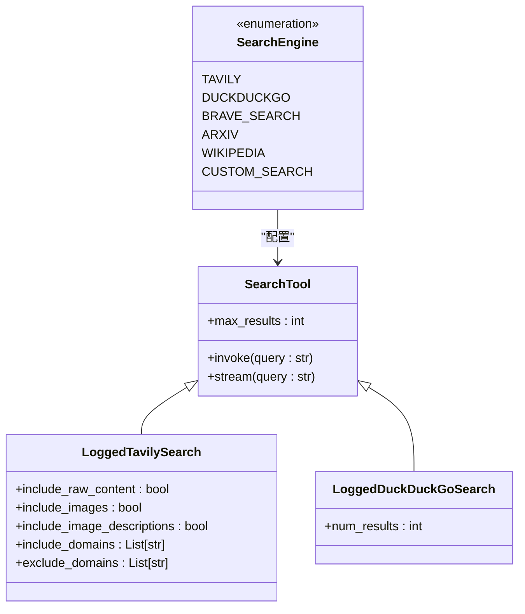
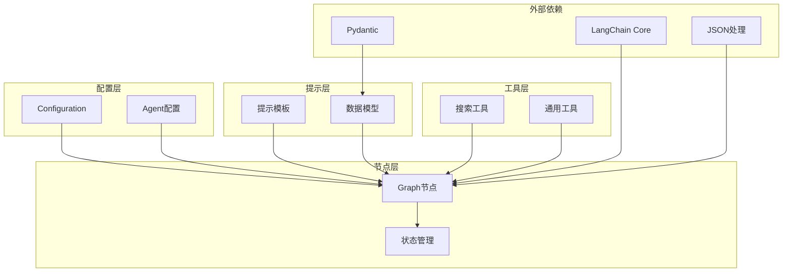

# 任务规划器

<cite>
**本文档中引用的文件**
- [src/prompts/planner.md](file://src/prompts/planner.md)
- [src/prompts/planner_model.py](file://src/prompts/planner_model.py)
- [src/graph/nodes.py](file://src/graph/nodes.py)
- [src/graph/types.py](file://src/graph/types.py)
- [src/config/configuration.py](file://src/config/configuration.py)
- [src/config/agents.py](file://src/config/agents.py)
- [src/agents/agents.py](file://src/agents/agents.py)
- [src/workflow.py](file://src/workflow.py)
- [src/tools/search.py](file://src/tools/search.py)
- [tests/integration/test_nodes.py](file://tests/integration/test_nodes.py)
- [examples/what_is_llm.md](file://examples/what_is_llm.md)
</cite>

## 目录
1. [简介](#简介)
2. [项目结构](#项目结构)
3. [核心组件](#核心组件)
4. [架构概览](#架构概览)
5. [详细组件分析](#详细组件分析)
6. [依赖关系分析](#依赖关系分析)
7. [性能考虑](#性能考虑)
8. [故障排除指南](#故障排除指南)
9. [结论](#结论)

## 简介

任务规划器是deer-flow系统中的核心组件，负责将用户的复杂问题分解为有序的研究步骤。该规划器代理通过与大语言模型（LLM）的交互，生成详细的执行计划，涵盖背景调查、信息收集、数据分析和报告撰写等阶段。

规划器采用先进的提示工程技术，结合思维链（Chain-of-Thought）和少样本学习（Few-shot Learning）技术，确保生成的计划既全面又高效。系统支持多种规划策略，包括基础模式和深度思考模式，并具备完善的错误处理和重试机制。

## 项目结构

任务规划器相关的文件主要分布在以下目录结构中：



**图表来源**
- [src/prompts/planner.md](file://src/prompts/planner.md#L1-L188)
- [src/graph/nodes.py](file://src/graph/nodes.py#L1-L512)
- [src/config/configuration.py](file://src/config/configuration.py#L1-L71)

**章节来源**
- [src/prompts/planner.md](file://src/prompts/planner.md#L1-L188)
- [src/graph/nodes.py](file://src/graph/nodes.py#L1-L512)
- [src/config/configuration.py](file://src/config/configuration.py#L1-L71)

## 核心组件

### 规划器提示模板

规划器的核心是其精心设计的提示模板，该模板定义了完整的规划框架和标准：

```python
# 关键特性：
# 1. 综合性覆盖标准
# 2. 充足深度要求
# 3. 适当数量标准
# 4. 分析框架
# 5. 步骤约束
# 6. 执行规则
```

### 计划数据模型

规划器使用Pydantic模型来确保计划的一致性和验证：

```python
class Step(BaseModel):
    need_search: bool
    title: str
    description: str
    step_type: StepType

class Plan(BaseModel):
    locale: str
    has_enough_context: bool
    thought: str
    title: str
    steps: List[Step]
```

### 背景调查节点

背景调查节点负责在规划前进行初步的信息收集：

```python
def background_investigation_node(state: State, config: RunnableConfig):
    # 执行Web搜索以增强上下文
    # 支持多种搜索引擎：Tavily、DuckDuckGo、Brave等
    # 返回结构化的搜索结果
```

**章节来源**
- [src/prompts/planner.md](file://src/prompts/planner.md#L1-L188)
- [src/prompts/planner_model.py](file://src/prompts/planner_model.py#L1-L59)
- [src/graph/nodes.py](file://src/graph/nodes.py#L40-L60)

## 架构概览

任务规划器采用多层架构设计，确保模块化和可扩展性：



**图表来源**
- [src/graph/nodes.py](file://src/graph/nodes.py#L60-L120)
- [src/graph/types.py](file://src/graph/types.py#L1-L25)

## 详细组件分析

### 规划器节点实现

规划器节点是整个规划流程的核心，负责生成完整的执行计划：



**图表来源**
- [src/graph/nodes.py](file://src/graph/nodes.py#L60-L120)
- [src/graph/nodes.py](file://src/graph/nodes.py#L120-L180)

#### 规划器节点的关键功能

1. **消息处理和模板应用**：
```python
messages = apply_prompt_template("planner", state, configurable)
```

2. **背景调查集成**：
```python
if state.get("enable_background_investigation") and state.get("background_investigation_results"):
    messages += [{
        "role": "user",
        "content": "background investigation results...\n" + state["background_investigation_results"]
    }]
```

3. **LLM选择逻辑**：
```python
if configurable.enable_deep_thinking:
    llm = get_llm_by_type("reasoning")
elif AGENT_LLM_MAP["planner"] == "basic":
    llm = get_llm_by_type("basic").with_structured_output(Plan, method="json_mode")
else:
    llm = get_llm_by_type(AGENT_LLM_MAP["planner"])
```

4. **迭代控制**：
```python
if plan_iterations >= configurable.max_plan_iterations:
    return Command(goto="reporter")
```

### 人工反馈节点

人工反馈节点提供了人类干预机制，确保计划的质量和准确性：

```mermaid
flowchart TD
Start([开始人工反馈]) --> CheckPlan{"检查计划<br/>是否自动接受"}
CheckPlan --> |是| AcceptPlan["接受计划"]
CheckPlan --> |否| GetFeedback["获取用户反馈"]
GetFeedback --> ParseFeedback{"解析反馈类型"}
ParseFeedback --> |[ACCEPTED]| AcceptPlan
ParseFeedback --> |[EDIT_PLAN]| EditPlan["编辑计划"]
ParseFeedback --> |其他| RejectFeedback["拒绝反馈"]
AcceptPlan --> ValidatePlan["验证计划"]
EditPlan --> RegeneratePlan["重新生成计划"]
RejectFeedback --> End([结束])
ValidatePlan --> Success{"验证成功?"}
Success --> |是| UpdateState["更新状态"]
Success --> |否| RetryValidation["重试验证"]
RetryValidation --> ValidatePlan
UpdateState --> End
```

**图表来源**
- [src/graph/nodes.py](file://src/graph/nodes.py#L180-L250)

### 错误处理和重试机制

规划器实现了完善的错误处理机制：

```python
try:
    curr_plan = json.loads(repair_json_output(full_response))
except json.JSONDecodeError:
    logger.warning("Planner response is not a valid JSON")
    if plan_iterations > 0:
        return Command(goto="reporter")
    else:
        return Command(goto="__end__")
```

关键特性：
- JSON格式修复
- 迭代次数限制
- 自动回退策略
- 错误日志记录

**章节来源**
- [src/graph/nodes.py](file://src/graph/nodes.py#L60-L250)
- [src/graph/nodes.py](file://src/graph/nodes.py#L180-L250)

### 搜索引擎集成

规划器支持多种搜索引擎，通过统一的接口提供灵活的搜索能力：



**图表来源**
- [src/tools/search.py](file://src/tools/search.py#L1-L114)

**章节来源**
- [src/graph/nodes.py](file://src/graph/nodes.py#L40-L60)
- [src/tools/search.py](file://src/tools/search.py#L1-L114)

## 依赖关系分析

任务规划器的依赖关系展现了清晰的分层架构：



**图表来源**
- [src/graph/nodes.py](file://src/graph/nodes.py#L1-L30)
- [src/config/configuration.py](file://src/config/configuration.py#L1-L71)

**章节来源**
- [src/graph/nodes.py](file://src/graph/nodes.py#L1-L30)
- [src/config/configuration.py](file://src/config/configuration.py#L1-L71)

## 性能考虑

### 并发处理

规划器支持流式处理和并发执行：

```python
# 流式响应处理
response = llm.stream(messages)
for chunk in response:
    full_response += chunk.content
```

### 内存管理

- 有限的计划迭代次数（默认1次）
- JSON输出修复机制
- 错误恢复策略

### 缓存策略

- 搜索结果缓存
- 提示模板缓存
- LLM响应缓存

## 故障排除指南

### 常见问题及解决方案

1. **JSON解析错误**
   - 症状：规划器无法解析LLM返回的JSON
   - 解决方案：启用深度思考模式或增加最大迭代次数

2. **计划生成失败**
   - 症状：多次尝试后仍无法生成有效计划
   - 解决方案：检查LLM配置和提示模板

3. **搜索结果不足**
   - 症状：背景调查结果不充分
   - 解决方案：调整搜索参数或更换搜索引擎

### 调试技巧

```python
# 启用调试日志
logger.setLevel(logging.DEBUG)

# 检查状态变量
print(f"Plan iterations: {state.get('plan_iterations')}")
print(f"Current plan: {state.get('current_plan')}")
```

**章节来源**
- [src/graph/nodes.py](file://src/graph/nodes.py#L100-L120)
- [tests/integration/test_nodes.py](file://tests/integration/test_nodes.py#L335-L399)

## 结论

任务规划器是deer-flow系统中的关键组件，通过精心设计的提示工程和先进的LLM集成，实现了高效的复杂问题分解和计划生成。其模块化架构、完善的错误处理机制和灵活的配置选项，使其能够适应各种研究场景的需求。

主要优势：
- **全面性**：涵盖历史、现状、未来等多个维度
- **灵活性**：支持多种LLM和搜索引擎
- **可靠性**：完善的错误处理和重试机制
- **可扩展性**：模块化设计便于功能扩展

未来的改进方向：
- 增强自然语言理解能力
- 优化计划生成算法
- 扩展更多类型的搜索工具
- 改进人机交互体验