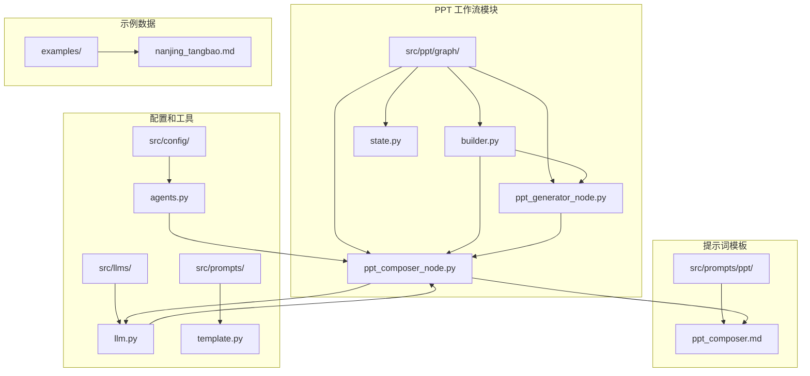
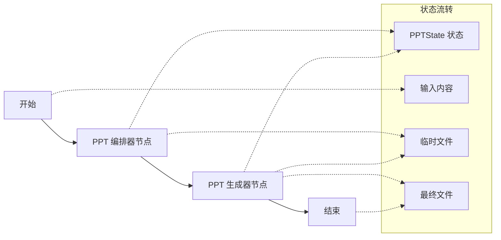
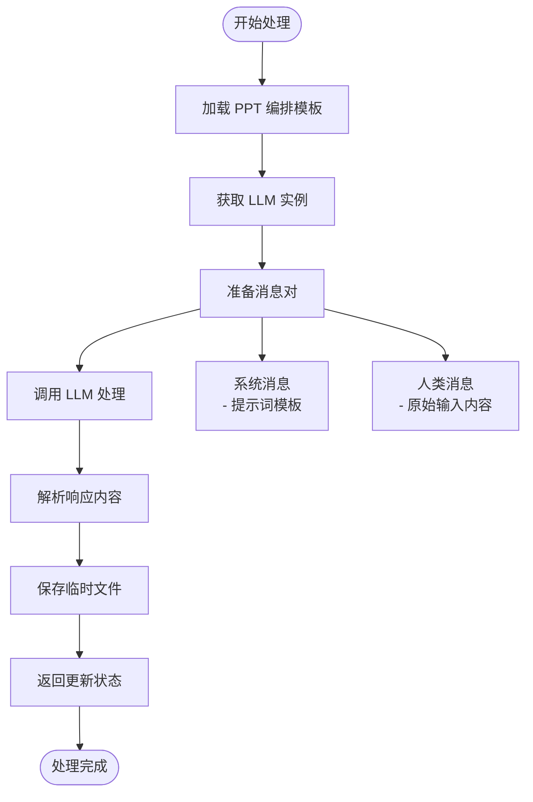
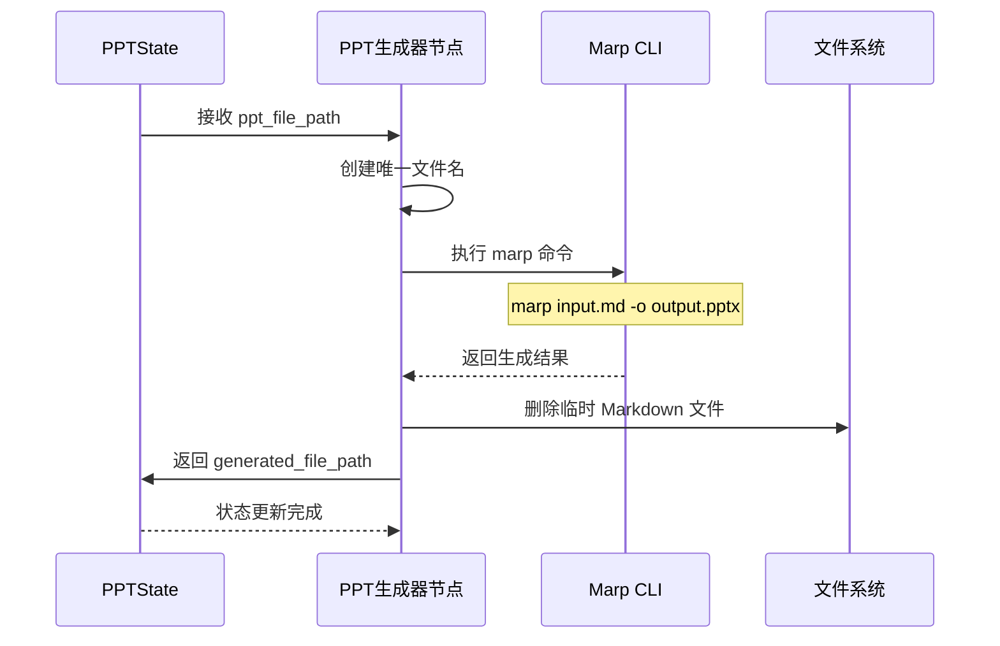

# PPT 内容编排机制技术文档

<cite>
**本文档中引用的文件**
- [ppt_composer_node.py](file://src/ppt/graph/ppt_composer_node.py)
- [ppt_composer.md](file://src/prompts/ppt/ppt_composer.md)
- [builder.py](file://src/ppt/graph/builder.py)
- [state.py](file://src/ppt/graph/state.py)
- [ppt_generator_node.py](file://src/ppt/graph/ppt_generator_node.py)
- [agents.py](file://src/config/agents.py)
- [llm.py](file://src/llms/llm.py)
- [template.py](file://src/prompts/template.py)
- [nanjing_tangbao.md](file://examples/nanjing_tangbao.md)
</cite>

## 目录
1. [简介](#简介)
2. [项目结构概览](#项目结构概览)
3. [核心组件分析](#核心组件分析)
4. [架构设计](#架构设计)
5. [详细组件分析](#详细组件分析)
6. [工作流程详解](#工作流程详解)
7. [提示词模板设计](#提示词模板设计)
8. [性能考虑](#性能考虑)
9. [故障排除指南](#故障排除指南)
10. [总结](#总结)

## 简介

deer-flow 的 PPT 内容编排机制是一个基于 LangGraph 构建的智能工作流系统，专门用于将研究报告和分析内容转换为结构化的 PPT 大纲。该系统通过两个核心节点：PPT 编排器节点和 PPT 生成器节点，实现了从原始文本到专业 Markdown 格式 PPT 的自动化转换。

该系统的核心价值在于：
- **智能化内容解析**：自动识别文章结构、关键要点和逻辑层次
- **标准化格式输出**：遵循 Markdown PPT 规范，确保兼容性和可编辑性
- **灵活的工作流设计**：支持链式调用和状态管理
- **高质量的输出质量**：通过 LLM 协助生成专业的演示文稿内容

## 项目结构概览

PPT 内容编排系统的文件组织结构清晰，采用模块化设计：



**图表来源**
- [builder.py](file://src/ppt/graph/builder.py#L1-L32)
- [ppt_composer_node.py](file://src/ppt/graph/ppt_composer_node.py#L1-L34)
- [ppt_generator_node.py](file://src/ppt/graph/ppt_generator_node.py#L1-L26)

## 核心组件分析

### PPTState 状态管理

PPTState 类继承自 MessagesState，提供了完整的状态管理功能：

```python
class PPTState(MessagesState):
    """State for the ppt generation."""
    
    # 输入
    input: str = ""
    
    # 输出
    generated_file_path: str = ""
    
    # 资产
    ppt_content: str = ""
    ppt_file_path: str = ""
```

该状态类的设计特点：
- **继承性**：基于 LangGraph 的 MessagesState，支持消息历史记录
- **字段明确**：清晰区分输入、输出和中间资产
- **类型安全**：使用 Python 类型注解确保数据一致性

**章节来源**
- [state.py](file://src/ppt/graph/state.py#L1-L20)

### PPT 编排器节点

ppt_composer_node 是整个工作流的核心处理器，负责将输入内容转换为结构化的 PPT 大纲：

```python
def ppt_composer_node(state: PPTState):
    logger.info("Generating ppt content...")
    model = get_llm_by_type(AGENT_LLM_MAP["ppt_composer"])
    ppt_content = model.invoke([
        SystemMessage(content=get_prompt_template("ppt/ppt_composer")),
        HumanMessage(content=state["input"]),
    ])
    
    # 保存临时文件
    temp_ppt_file_path = os.path.join(os.getcwd(), f"ppt_content_{uuid.uuid4()}.md")
    with open(temp_ppt_file_path, "w") as f:
        f.write(ppt_content.content)
    
    return {
        "ppt_content": ppt_content, 
        "ppt_file_path": temp_ppt_file_path
    }
```

主要功能包括：
- **LLM 集成**：通过 AGENT_LLM_MAP 配置选择合适的语言模型
- **提示词应用**：使用专门的 PPT 编排提示词模板
- **内容处理**：将原始输入转换为结构化 Markdown 格式
- **临时文件管理**：生成唯一的临时文件路径

**章节来源**
- [ppt_composer_node.py](file://src/ppt/graph/ppt_composer_node.py#L1-L34)

## 架构设计

PPT 内容编排系统采用基于 LangGraph 的有向无环图（DAG）架构：



**图表来源**
- [builder.py](file://src/ppt/graph/builder.py#L10-L17)

### 工作流构建器

builder.py 中的 build_graph 函数定义了完整的工作流：

```python
def build_graph():
    """Build and return the ppt workflow graph."""
    builder = StateGraph(PPTState)
    builder.add_node("ppt_composer", ppt_composer_node)
    builder.add_node("ppt_generator", ppt_generator_node)
    builder.add_edge(START, "ppt_composer")
    builder.add_edge("ppt_composer", "ppt_generator")
    builder.add_edge("ppt_generator", END)
    return builder.compile()
```

工作流特点：
- **线性流程**：简单的串行处理模式
- **状态传递**：每个节点都访问和修改 PPTState
- **错误处理**：LangGraph 自动处理节点间的异常传播

**章节来源**
- [builder.py](file://src/ppt/graph/builder.py#L1-L32)

## 详细组件分析

### 提示词模板系统

ppt_composer.md 是专门为 PPT 编排设计的提示词模板，包含了完整的指导原则和格式规范：

#### 标题和结构规范

模板明确规定了 Markdown PPT 的层级结构：
- `#` 用于标题幻灯片（通常一个）
- `##` 用于幻灯片标题
- `###` 用于副标题（需要时）
- 使用水平分割线 `---` 分隔幻灯片

#### 内容格式化规则

```markdown
### 内容格式化
- 使用无序列表 (*) 或 (-) 表示要点
- 使用有序列表 (1., 2.) 表示步骤
- 使用代码块三重反引号
- 图片 URL 必须来自源内容，不能虚构
```

#### 处理工作流

模板定义了五个关键处理阶段：

1. **理解用户需求**：分析主题、受众、关键信息和格式要求
2. **提取核心内容**：识别最重要的要点
3. **组织内容结构**：典型结构包括标题页、介绍/议程、主体、总结/结论
4. **创建 Markdown 演示文稿**：确保每张幻灯片聚焦于一个主要观点
5. **审查和优化**：检查完整性和可读性

**章节来源**
- [ppt_composer.md](file://src/prompts/ppt/ppt_composer.md#L1-L107)

### PPT 生成器节点

ppt_generator_node 负责将 Markdown 格式的 PPT 内容转换为实际的 PowerPoint 文件：

```python
def ppt_generator_node(state: PPTState):
    logger.info("Generating ppt file...")
    generated_file_path = os.path.join(
        os.getcwd(), f"generated_ppt_{uuid.uuid4()}.pptx"
    )
    subprocess.run(["marp", state["ppt_file_path"], "-o", generated_file_path])
    os.remove(state["ppt_file_path"])
    logger.info(f"generated_file_path: {generated_file_path}")
    return {"generated_file_path": generated_file_path}
```

该节点的特点：
- **外部工具集成**：使用 Marp CLI 将 Markdown 转换为 PPTX
- **临时文件清理**：自动删除中间的 Markdown 文件
- **唯一文件命名**：使用 UUID 确保文件名唯一性
- **日志记录**：详细的执行过程跟踪

**章节来源**
- [ppt_generator_node.py](file://src/ppt/graph/ppt_generator_node.py#L1-L26)

### LLM 集成架构

系统通过 AGENT_LLM_MAP 配置不同的 LLM 类型：

```python
AGENT_LLM_MAP: dict[str, LLMType] = {
    "coordinator": "basic",
    "planner": "basic",
    "researcher": "basic",
    "coder": "basic",
    "reporter": "basic",
    "podcast_script_writer": "basic",
    "ppt_composer": "basic",  # PPT 编排专用
    "prose_writer": "basic",
    "prompt_enhancer": "basic",
}
```

LLM 实例缓存机制：
- **单例模式**：避免重复创建相同的 LLM 实例
- **环境变量优先**：支持运行时配置覆盖
- **SSL 验证控制**：可选的 SSL 证书验证设置
- **平台适配**：支持多种 LLM 平台（OpenAI、Azure、DashScope 等）

**章节来源**
- [agents.py](file://src/config/agents.py#L1-L21)
- [llm.py](file://src/llms/llm.py#L1-L181)

## 工作流程详解

### 输入处理流程

系统接收多种形式的输入内容，包括：

1. **研究报告**：如 nanjing_tangbao.md 示例
2. **分析文档**：结构化的分析报告
3. **会议纪要**：会议讨论要点的整理
4. **项目文档**：项目进展和成果的总结

### 内容解析算法

ppt_composer_node 使用以下算法处理输入：



**图表来源**
- [ppt_composer_node.py](file://src/ppt/graph/ppt_composer_node.py#L15-L32)

### 输出生成流程

PPT 生成器节点执行以下步骤：



**图表来源**
- [ppt_generator_node.py](file://src/ppt/graph/ppt_generator_node.py#L12-L24)

**章节来源**
- [ppt_composer_node.py](file://src/ppt/graph/ppt_composer_node.py#L15-L32)
- [ppt_generator_node.py](file://src/ppt/graph/ppt_generator_node.py#L12-L24)

## 提示词模板设计

### 设计原理

ppt_composer.md 模板的设计遵循以下核心原则：

#### 专业化定位

模板明确定义了助手的角色："专业 PPT 演示文稿创建助手"，专注于将用户需求转化为清晰、聚焦的 Markdown 格式演示文稿文本。

#### 渐进式内容组织

模板采用五步工作流，确保内容的逻辑性和完整性：

1. **理解用户需求**：全面分析输入信息
2. **提取核心内容**：识别最重要的要点
3. **组织内容结构**：建立合理的逻辑框架
4. **创建 Markdown 演示文稿**：遵循格式规范
5. **审查和优化**：确保质量和可读性

#### 格式规范严格性

模板规定了严格的格式要求：
- **标题层级**：明确的 Markdown 标题层次
- **列表格式**：统一的要点表示方式
- **图片处理**：仅使用源内容中的实际图片 URL
- **内容密度**：强调简洁有力的语言表达

### 关键设计元素

#### 图片处理策略

模板特别强调了图片处理的重要性：
```markdown
- 使用代码块三重反引号
- **重要**：当包含图片时，仅使用源内容中的实际图片 URL
- **禁止**：创建虚构的图片 URL 或占位符
```

这种设计确保了：
- **真实性**：所有图片都有实际来源
- **可追溯性**：可以验证图片的合法性和版权
- **一致性**：与源内容保持完全一致

#### 内容结构指导

模板提供了典型的 PPT 结构建议：
- 标题幻灯片
- 引言/议程
- 主体内容（多个章节）
- 总结/结论
- 可选问答环节

#### 语言风格指南

模板强调了专业演示文稿的语言特点：
- **简洁性**：使用简短有力的表达
- **聚焦性**：每张幻灯片围绕一个主要观点
- **行动导向**：强调要点而非冗长描述
- **视觉友好**：适合口头演讲的内容

**章节来源**
- [ppt_composer.md](file://src/prompts/ppt/ppt_composer.md#L1-L107)

## 性能考虑

### LLM 调用优化

系统在 LLM 调用方面采用了多项优化策略：

#### 实例缓存机制

```python
# 缓存字典避免重复创建
_llm_cache: dict[LLMType, BaseChatModel] = {}

def get_llm_by_type(llm_type: LLMType) -> BaseChatModel:
    if llm_type in _llm_cache:
        return _llm_cache[llm_type]
    
    conf = load_yaml_config(_get_config_file_path())
    llm = _create_llm_use_conf(llm_type, conf)
    _llm_cache[llm_type] = llm
    return llm
```

优势：
- **减少初始化开销**：避免重复创建 LLM 实例
- **内存效率**：共享相同类型的 LLM 实例
- **配置一致性**：确保所有实例使用相同的配置

#### 错误处理和重试机制

```python
# 添加最大重试次数处理速率限制错误
if "max_retries" not in merged_conf:
    merged_conf["max_retries"] = 3
```

#### 并发处理能力

虽然当前实现是同步的，但系统架构支持未来的并发扩展：
- **独立节点**：每个节点可以独立执行
- **状态隔离**：不同节点使用独立的状态副本
- **资源池化**：LLM 实例可以在多个请求间复用

### 文件处理优化

#### 临时文件管理

```python
# 使用 UUID 确保文件名唯一性
temp_ppt_file_path = os.path.join(os.getcwd(), f"ppt_content_{uuid.uuid4()}.md")

# 自动清理机制
os.remove(state["ppt_file_path"])  # 删除临时文件
```

优化点：
- **唯一性保证**：防止文件名冲突
- **自动清理**：避免磁盘空间浪费
- **原子操作**：确保文件操作的完整性

#### Marp CLI 集成

系统利用 Marp CLI 的高效转换能力：
- **命令行接口**：直接调用原生工具获得最佳性能
- **批处理支持**：支持一次性转换多个文件
- **格式兼容性**：支持多种 Markdown 变体

## 故障排除指南

### 常见问题及解决方案

#### LLM 连接问题

**问题症状**：ppt_composer_node 调用失败
```
ValueError: Error loading template ppt/ppt_composer
```

**排查步骤**：
1. 检查 AGENT_LLM_MAP 配置是否正确
2. 验证 LLM 配置文件是否存在
3. 确认环境变量设置
4. 测试 LLM 连接性

**解决方案**：
```python
# 在调试模式下检查 LLM 配置
from src.llms.llm import get_llm_by_type
from src.config.agents import AGENT_LLM_MAP

try:
    llm = get_llm_by_type(AGENT_LLM_MAP["ppt_composer"])
    print("LLM 配置成功")
except Exception as e:
    print(f"LLM 配置失败: {e}")
```

#### Marp CLI 缺失

**问题症状**：ppt_generator_node 执行失败
```
FileNotFoundError: [Errno 2] No such file or directory: 'marp'
```

**解决方案**：
1. 安装 Marp CLI：`npm install -g @marp-team/marp-cli`
2. 验证安装：`marp --version`
3. 检查 PATH 环境变量

#### 内存不足问题

**问题症状**：处理大型文档时崩溃
```
MemoryError: Unable to allocate memory
```

**优化策略**：
1. **分块处理**：将大文档拆分为较小的部分
2. **流式处理**：逐步处理内容而不是一次性加载
3. **垃圾回收**：定期触发 Python 垃圾回收

#### 提示词模板加载失败

**问题症状**：get_prompt_template 抛出异常
```python
raise ValueError(f"Error loading template {prompt_name}: {e}")
```

**排查方法**：
1. 检查模板文件是否存在
2. 验证文件权限
3. 确认 Jinja2 环境配置
4. 检查模板语法错误

**章节来源**
- [ppt_composer_node.py](file://src/ppt/graph/ppt_composer_node.py#L15-L32)
- [ppt_generator_node.py](file://src/ppt/graph/ppt_generator_node.py#L12-L24)
- [llm.py](file://src/llms/llm.py#L120-L140)

### 调试技巧

#### 启用详细日志

```python
import logging
logging.basicConfig(level=logging.DEBUG)
logger = logging.getLogger(__name__)
```

#### 状态检查点

在关键节点添加状态检查：
```python
def debug_state(state: PPTState):
    print(f"输入长度: {len(state['input'])}")
    print(f"PPT 内容长度: {len(state.get('ppt_content', ''))}")
    print(f"文件路径: {state.get('ppt_file_path')}")
```

#### 性能监控

```python
import time
import psutil

def monitor_performance():
    cpu_percent = psutil.cpu_percent()
    memory_usage = psutil.virtual_memory().percent
    print(f"CPU 使用率: {cpu_percent}%")
    print(f"内存使用率: {memory_usage}%")
```

## 总结

deer-flow 的 PPT 内容编排机制展现了现代 AI 应用的最佳实践，通过精心设计的架构和组件实现了高效的文档转换流程。

### 核心优势

1. **模块化设计**：清晰的职责分离和组件边界
2. **标准化流程**：基于最佳实践的处理工作流
3. **可扩展性**：支持多种 LLM 平台和配置选项
4. **质量保证**：严格的格式规范和内容审核机制
5. **易维护性**：良好的代码组织和文档支持

### 技术创新点

- **智能内容解析**：通过 LLM 协助实现复杂的文本结构化
- **格式标准化**：统一的 Markdown PPT 规范确保兼容性
- **工作流自动化**：完整的端到端处理流程
- **质量控制**：多层次的质量检查和优化机制

### 应用场景

该系统适用于各种需要将文本内容转换为演示文稿的场景：
- **学术报告**：将研究论文转换为教学演示
- **商业提案**：快速生成商务演示文稿
- **培训材料**：制作标准化的培训课件
- **项目汇报**：生成项目进展的可视化报告

### 未来发展方向

1. **增强内容理解**：改进对复杂文档结构的理解能力
2. **多语言支持**：扩展对非英语内容的支持
3. **交互式编辑**：提供在线编辑和预览功能
4. **模板库**：丰富的 PPT 模板和样式选择
5. **协作功能**：支持多人协同编辑和版本管理

通过持续的优化和扩展，deer-flow 的 PPT 内容编排机制将继续为用户提供更加强大和便捷的演示文稿创建体验。