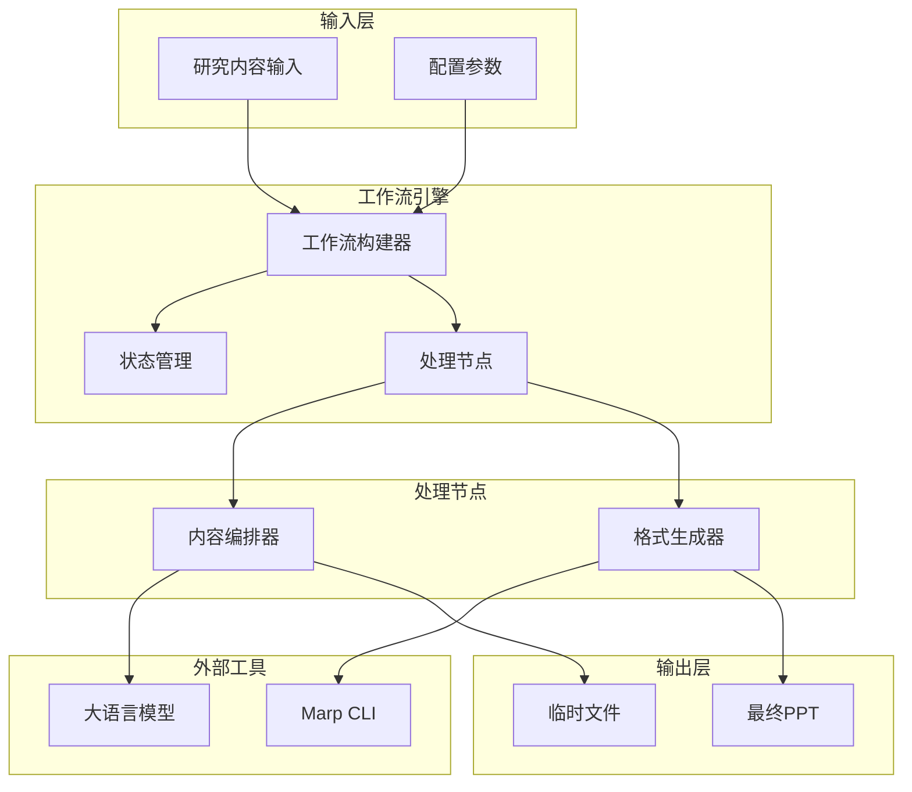
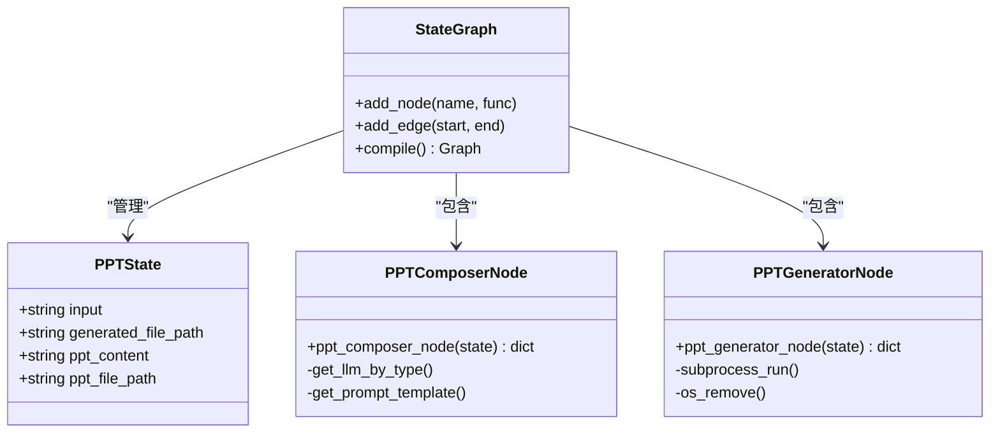
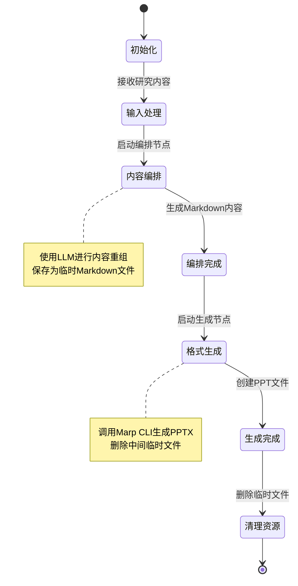
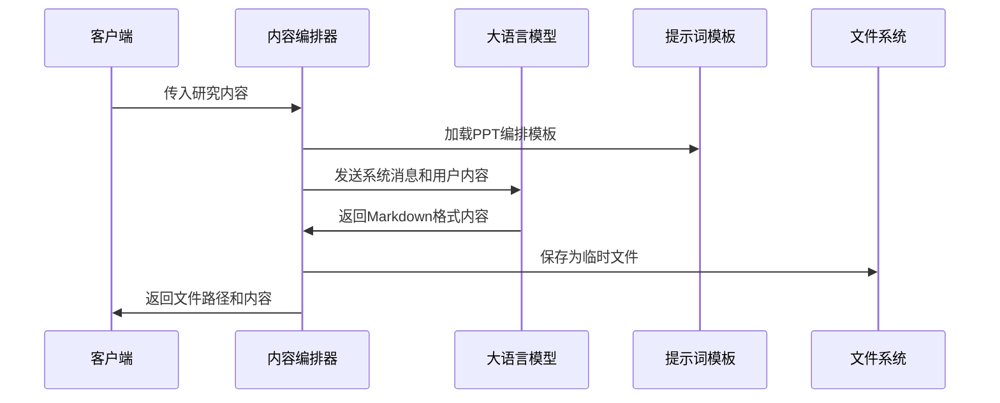
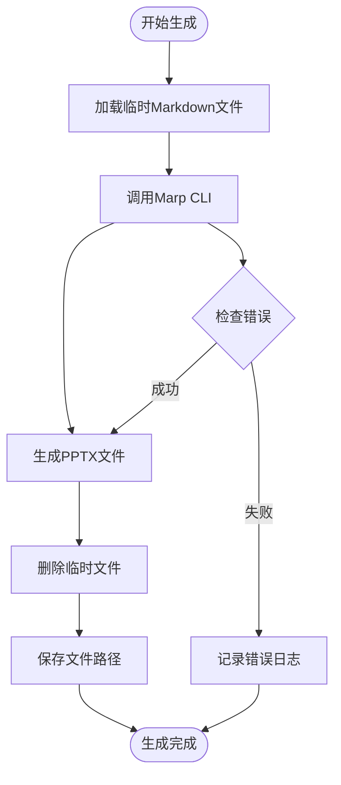
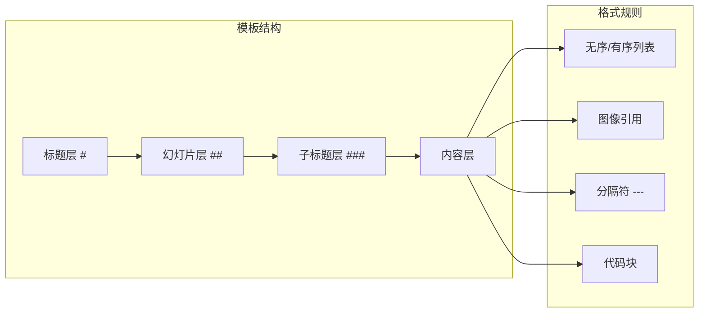
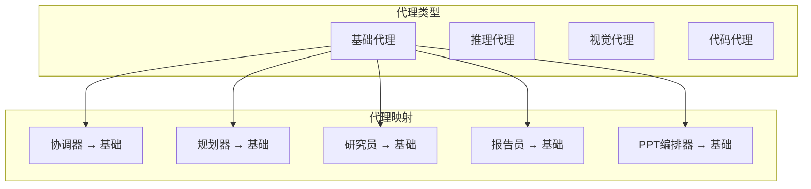
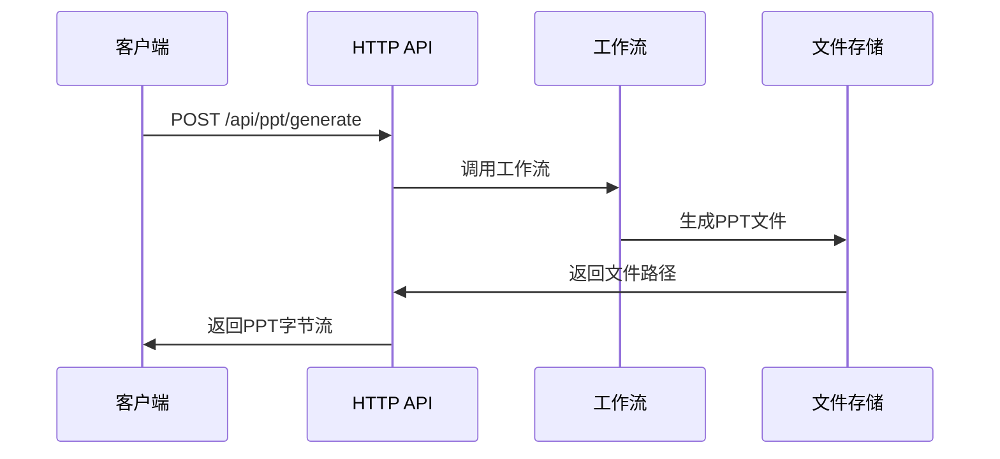
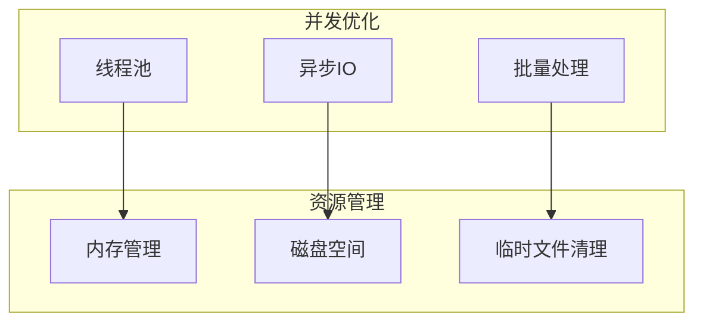

# PPT生成系统技术文档

<cite>
**本文档引用的文件**
- [builder.py](file://src/ppt/graph/builder.py)
- [state.py](file://src/ppt/graph/state.py)
- [ppt_composer_node.py](file://src/ppt/graph/ppt_composer_node.py)
- [ppt_generator_node.py](file://src/ppt/graph/ppt_generator_node.py)
- [ppt_composer.md](file://src/prompts/ppt/ppt_composer.md)
- [agents.py](file://src/config/agents.py)
- [configuration.py](file://src/config/configuration.py)
- [app.py](file://src/server/app.py)
- [langgraph.json](file://langgraph.json)
</cite>

## 目录
1. [简介](#简介)
2. [系统架构概览](#系统架构概览)
3. [核心组件分析](#核心组件分析)
4. [工作流程详解](#工作流程详解)
5. [提示词模板系统](#提示词模板系统)
6. [PPT生成机制](#ppt生成机制)
7. [配置管理](#配置管理)
8. [API接口设计](#api接口设计)
9. [性能优化与最佳实践](#性能优化与最佳实践)
10. [故障排除指南](#故障排除指南)
11. [总结](#总结)

## 简介

deer-flow 的 PPT 生成功能是一个基于 LangGraph 的智能工作流系统，能够将研究内容自动转换为专业的 PowerPoint 演示文稿。该系统通过两个主要阶段：内容编排和格式生成，实现了从文本到 PPT 的自动化转换。

系统的核心优势包括：
- 基于大语言模型的内容理解与重组
- 支持多种输出格式（PPTX、PDF）
- 灵活的模板定制能力
- 完整的工作流状态管理
- 与外部工具的无缝集成

## 系统架构概览



**图表来源**
- [builder.py](file://src/ppt/graph/builder.py#L1-L32)
- [state.py](file://src/ppt/graph/state.py#L1-L20)

## 核心组件分析

### 工作流构建器 (Builder)

工作流构建器是整个 PPT 生成系统的核心协调器，负责定义和编排各个处理阶段。



**图表来源**
- [builder.py](file://src/ppt/graph/builder.py#L8-L16)
- [state.py](file://src/ppt/graph/state.py#L7-L19)

**章节来源**
- [builder.py](file://src/ppt/graph/builder.py#L1-L32)
- [state.py](file://src/ppt/graph/state.py#L1-L20)

### 状态管理系统

状态管理系统负责维护整个 PPT 生成过程中的数据流转和状态变化。



**图表来源**
- [state.py](file://src/ppt/graph/state.py#L7-L19)
- [ppt_composer_node.py](file://src/ppt/graph/ppt_composer_node.py#L17-L33)

**章节来源**
- [state.py](file://src/ppt/graph/state.py#L1-L20)

## 工作流程详解

### 第一阶段：内容编排 (PPT Composer)

内容编排阶段是 PPT 生成的核心环节，负责将原始研究内容转换为结构化的 Markdown 格式。



**图表来源**
- [ppt_composer_node.py](file://src/ppt/graph/ppt_composer_node.py#L17-L33)
- [ppt_composer.md](file://src/prompts/ppt/ppt_composer.md#L1-L107)

### 第二阶段：格式生成 (PPT Generator)

格式生成阶段利用 Marp CLI 工具将 Markdown 内容转换为专业的 PPT 文件。



**图表来源**
- [ppt_generator_node.py](file://src/ppt/graph/ppt_generator_node.py#L14-L25)

**章节来源**
- [ppt_composer_node.py](file://src/ppt/graph/ppt_composer_node.py#L1-L34)
- [ppt_generator_node.py](file://src/ppt/graph/ppt_generator_node.py#L1-L26)

## 提示词模板系统

### PPT编排模板 (PPT Composer Template)

PPT 编排模板是系统的核心提示词框架，定义了如何将研究内容转换为结构化的演示文稿。

模板的主要特点：
- **Markdown格式规范**：严格遵循 Markdown PPT 的语法规则
- **内容结构化**：支持标题、副标题、列表等多种元素
- **图像处理**：仅使用源内容中的实际图像URL
- **风格指导**：提供专业的格式化建议



**图表来源**
- [ppt_composer.md](file://src/prompts/ppt/ppt_composer.md#L8-L18)

**章节来源**
- [ppt_composer.md](file://src/prompts/ppt/ppt_composer.md#L1-L107)

## PPT生成机制

### Marp CLI 集成

系统采用 Marp CLI 作为底层生成引擎，这是一个强大的 Markdown 到 PPTX 的转换工具。

关键特性：
- **命令行接口**：通过 subprocess 调用 Marp CLI
- **格式支持**：原生支持 Markdown PPT 语法
- **输出控制**：可配置输出文件名和路径
- **错误处理**：完善的异常捕获和日志记录

### 输出格式配置

系统支持多种输出格式，主要通过以下配置实现：

```python
# 生成的文件路径配置
generated_file_path = os.path.join(
    os.getcwd(), f"generated_ppt_{uuid.uuid4()}.pptx"
)

# 临时文件清理
os.remove(state["ppt_file_path"])
```

**章节来源**
- [ppt_generator_node.py](file://src/ppt/graph/ppt_generator_node.py#L1-L26)

## 配置管理

### 代理配置系统

系统通过 AGENT_LLM_MAP 配置不同代理使用的 LLM 类型。



**图表来源**
- [agents.py](file://src/config/agents.py#L9-L20)

### 全局配置系统

全局配置系统提供了灵活的参数管理机制：

```python
@dataclass(kw_only=True)
class Configuration:
    resources: list[Resource] = field(default_factory=list)
    max_plan_iterations: int = 1
    max_step_num: int = 3
    max_search_results: int = 3
    search_engine: str = "custom_search"
    report_style: str = ReportStyle.ACADEMIC.value
    enable_deep_thinking: bool = False
```

**章节来源**
- [agents.py](file://src/config/agents.py#L1-L21)
- [configuration.py](file://src/config/configuration.py#L1-L71)

## API接口设计

### HTTP API 端点

系统提供了专门的 HTTP API 端点用于 PPT 生成：



**图表来源**
- [app.py](file://src/server/app.py#L515-L535)

### 请求响应格式

API 接口的设计考虑了以下因素：
- **输入验证**：确保传入的研究内容有效
- **错误处理**：统一的异常处理和错误响应
- **媒体类型**：正确设置 PPTX 文件的 MIME 类型
- **资源清理**：及时释放生成的临时文件

**章节来源**
- [app.py](file://src/server/app.py#L515-L535)

## 性能优化与最佳实践

### 并发处理策略

虽然当前实现是单线程的，但系统架构支持并发扩展：



### 内存管理

系统采用了有效的内存管理策略：
- **临时文件生命周期管理**
- **UUID命名避免冲突**
- **及时清理中间产物**

### 错误恢复机制

```python
try:
    results = self._call_search_api(query)
    logger.info(f"Custom search returned {len(results)} results")
    return results
except Exception as e:
    logger.error(f"Custom search error: {e}")
    return [{
        "title": "搜索错误",
        "url": "",
        "content": f"搜索服务出现错误: {str(e)}",
        "source": "error",
        "score": 0.0
    }]
```

## 故障排除指南

### 常见问题诊断

1. **Marp CLI 未安装**
   - 确保系统已安装 Marp CLI
   - 检查 PATH 环境变量配置

2. **临时文件权限问题**
   - 验证当前目录写入权限
   - 检查磁盘空间是否充足

3. **LLM 连接超时**
   - 检查网络连接状态
   - 验证 API 密钥配置

4. **提示词模板加载失败**
   - 确认模板文件存在
   - 检查文件编码格式

### 日志监控

系统提供了完整的日志记录机制：
- **节点执行日志**：记录每个处理节点的状态
- **错误追踪**：详细的异常堆栈信息
- **性能指标**：执行时间和资源消耗统计

**章节来源**
- [ppt_composer_node.py](file://src/ppt/graph/ppt_composer_node.py#L17-L33)
- [ppt_generator_node.py](file://src/ppt/graph/ppt_generator_node.py#L14-L25)

## 总结

deer-flow 的 PPT 生成功能代表了现代 AI 技术在内容创作领域的创新应用。通过精心设计的工作流架构、灵活的提示词模板系统和可靠的外部工具集成，该系统能够高效地将复杂的文本内容转换为专业的演示文稿。

### 主要优势

1. **智能化内容重组**：基于大语言模型的理解和重组能力
2. **标准化输出格式**：严格的 Markdown PPT 规范遵循
3. **可扩展架构**：模块化设计支持功能扩展
4. **完整错误处理**：健壮的异常处理和恢复机制
5. **易于集成**：清晰的 API 接口和配置管理

### 应用场景

- **学术报告**：将研究论文转换为教学演示
- **商业提案**：快速生成专业商务材料
- **教育培训**：制作标准化培训课件
- **会议展示**：自动化会议资料准备

### 未来发展方向

- **多模板支持**：提供更多预设的PPT模板
- **样式定制**：支持更精细的视觉风格控制
- **协作功能**：支持多人协同编辑
- **云端部署**：提供云服务版本
- **移动端适配**：支持移动设备访问

该系统为内容创作者提供了强大而便捷的 PPT 生成解决方案，显著提升了工作效率和内容质量，是 AI 技术在办公自动化领域的重要实践成果。