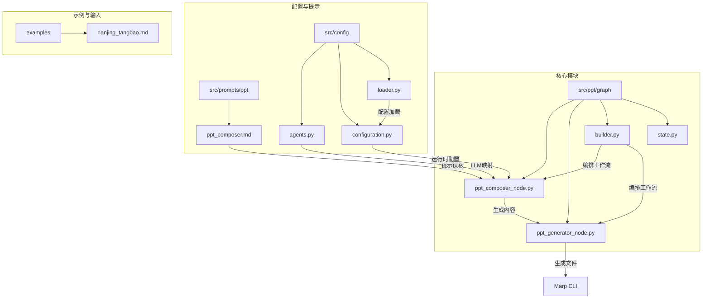
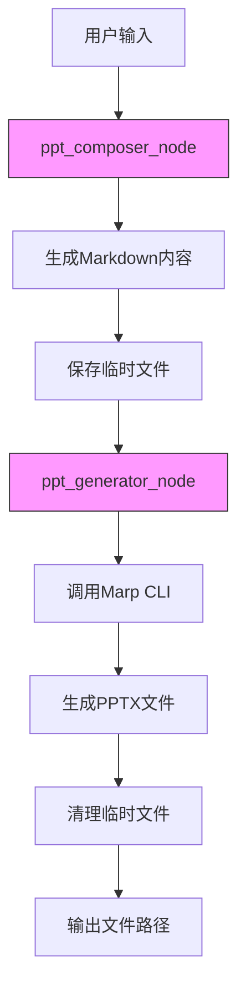
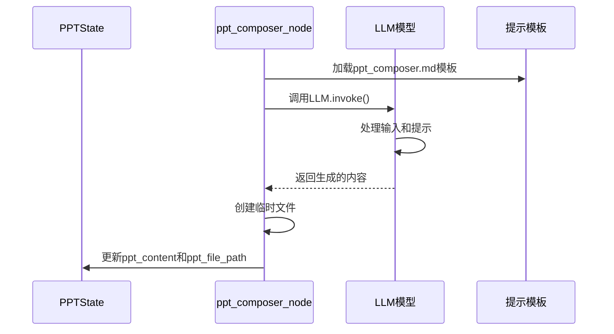
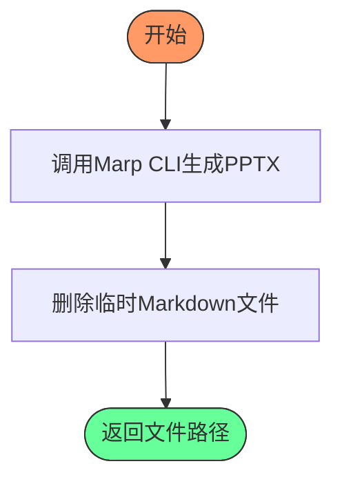
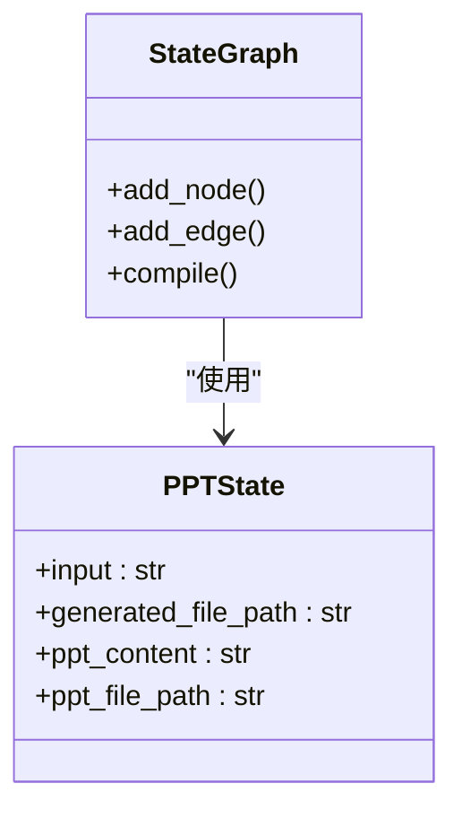

# 幻灯片生成

<cite>
**本文档引用的文件**  
- [ppt_generator_node.py](file://src/ppt/graph/ppt_generator_node.py)
- [builder.py](file://src/ppt/graph/builder.py)
- [ppt_composer_node.py](file://src/ppt/graph/ppt_composer_node.py)
- [state.py](file://src/ppt/graph/state.py)
- [ppt_composer.md](file://src/prompts/ppt/ppt_composer.md)
- [template.py](file://src/prompts/template.py)
- [llm.py](file://src/llms/llm.py)
- [agents.py](file://src/config/agents.py)
- [configuration.py](file://src/config/configuration.py)
- [loader.py](file://src/config/loader.py)
- [nanjing_tangbao.md](file://examples/nanjing_tangbao.md)
</cite>

## 目录
1. [简介](#简介)
2. [项目结构](#项目结构)
3. [核心组件](#核心组件)
4. [架构概述](#架构概述)
5. [详细组件分析](#详细组件分析)
6. [依赖分析](#依赖分析)
7. [性能考虑](#性能考虑)
8. [故障排除指南](#故障排除指南)
9. [结论](#结论)

## 简介
deer-flow 幻灯片生成引擎是一个基于 LangGraph 构建的自动化 PPT 生成系统，能够将结构化的大纲内容转换为专业的 PowerPoint 演示文稿。该系统采用模块化设计，通过定义明确的工作流节点来处理从内容生成到文件输出的整个过程。引擎的核心功能包括：使用 LLM 模型将输入内容转换为符合 Marp 规范的 Markdown 格式，然后利用 Marp CLI 工具将 Markdown 文件渲染为 PPTX 文件。系统通过状态机（PPTState）管理生成过程中的数据流，确保各组件之间的协调工作。该引擎支持灵活的配置，可以通过环境变量或 YAML 配置文件调整 LLM 模型、搜索参数和其他运行时选项。

## 项目结构
deer-flow 项目的结构体现了清晰的模块化设计，将不同功能的组件分离到独立的目录中。幻灯片生成相关的代码主要位于 `src/ppt/graph` 目录下，与其他功能模块（如播客生成、提示增强等）并列。这种组织方式使得各个功能模块可以独立开发和维护，同时通过统一的架构模式保持一致性。



**图示来源**  
- [builder.py](file://src/ppt/graph/builder.py#L1-L32)
- [ppt_composer_node.py](file://src/ppt/graph/ppt_composer_node.py#L1-L34)
- [ppt_generator_node.py](file://src/ppt/graph/ppt_generator_node.py#L1-L25)
- [state.py](file://src/ppt/graph/state.py#L1-L20)
- [ppt_composer.md](file://src/prompts/ppt/ppt_composer.md#L1-L107)
- [agents.py](file://src/config/agents.py#L1-L21)
- [configuration.py](file://src/config/configuration.py#L1-L71)
- [loader.py](file://src/config/loader.py#L1-L79)
- [nanjing_tangbao.md](file://examples/nanjing_tangbao.md#L1-L73)

**本节来源**  
- [src/ppt/graph](file://src/ppt/graph)
- [src/prompts/ppt](file://src/prompts/ppt)
- [src/config](file://src/config)
- [examples](file://examples)

## 核心组件
幻灯片生成引擎的核心组件包括 `ppt_composer_node`、`ppt_generator_node` 和 `builder` 模块。`ppt_composer_node` 负责将输入内容转换为结构化的 Markdown 格式，使用 LLM 模型根据预定义的提示模板生成符合 Marp 规范的幻灯片内容。`ppt_generator_node` 则负责调用 Marp CLI 工具，将生成的 Markdown 文件转换为最终的 PPTX 文件。`builder` 模块定义了工作流的执行顺序，通过 LangGraph 的 StateGraph 将各个节点连接起来，形成一个完整的生成流程。状态管理通过 `PPTState` 类实现，该类继承自 LangGraph 的 MessagesState，用于在工作流的各个节点之间传递数据。

**本节来源**  
- [ppt_composer_node.py](file://src/ppt/graph/ppt_composer_node.py#L1-L34)
- [ppt_generator_node.py](file://src/ppt/graph/ppt_generator_node.py#L1-L25)
- [builder.py](file://src/ppt/graph/builder.py#L1-L32)
- [state.py](file://src/ppt/graph/state.py#L1-L20)

## 架构概述
幻灯片生成引擎的架构基于 LangGraph 的状态机模式，采用清晰的流水线设计。整个生成过程从用户输入开始，经过内容编排、文件生成两个主要阶段，最终输出 PPTX 文件。系统通过 PPTState 状态对象在各个节点之间传递数据，确保信息的一致性和完整性。



**图示来源**  
- [builder.py](file://src/ppt/graph/builder.py#L1-L32)
- [ppt_composer_node.py](file://src/ppt/graph/ppt_composer_node.py#L1-L34)
- [ppt_generator_node.py](file://src/ppt/graph/ppt_generator_node.py#L1-L25)

## 详细组件分析

### 内容编排节点分析
`ppt_composer_node` 是幻灯片生成流程的第一个关键节点，负责将原始输入内容转换为结构化的 Markdown 格式。该节点使用 LLM 模型，结合预定义的提示模板，生成符合 Marp 规范的幻灯片内容。节点通过 `get_llm_by_type` 函数获取配置的 LLM 实例，并使用 `get_prompt_template` 加载提示模板。生成的内容被保存为临时 Markdown 文件，其路径存储在状态对象中供后续节点使用。



**图示来源**  
- [ppt_composer_node.py](file://src/ppt/graph/ppt_composer_node.py#L1-L34)
- [ppt_composer.md](file://src/prompts/ppt/ppt_composer.md#L1-L107)
- [llm.py](file://src/llms/llm.py#L1-L181)
- [template.py](file://src/prompts/template.py#L1-L68)

**本节来源**  
- [ppt_composer_node.py](file://src/ppt/graph/ppt_composer_node.py#L1-L34)
- [ppt_composer.md](file://src/prompts/ppt/ppt_composer.md#L1-L107)

### 文件生成节点分析
`ppt_generator_node` 是幻灯片生成流程的第二个关键节点，负责将 Markdown 文件转换为 PPTX 文件。该节点通过调用系统命令执行 Marp CLI 工具，将临时生成的 Markdown 文件渲染为 PowerPoint 演示文稿。节点使用 `subprocess.run` 执行命令，并在生成完成后清理临时文件，确保系统资源的合理使用。



**图示来源**  
- [ppt_generator_node.py](file://src/ppt/graph/ppt_generator_node.py#L1-L25)

**本节来源**  
- [ppt_generator_node.py](file://src/ppt/graph/ppt_generator_node.py#L1-L25)

### 工作流构建器分析
`builder.py` 模块定义了幻灯片生成工作流的整体结构。它使用 LangGraph 的 StateGraph 创建一个有向无环图（DAG），将 `ppt_composer_node` 和 `ppt_generator_node` 两个节点按照执行顺序连接起来。构建器确保工作流从 START 节点开始，依次执行内容编排和文件生成，最后到达 END 节点。



**图示来源**  
- [builder.py](file://src/ppt/graph/builder.py#L1-L32)
- [state.py](file://src/ppt/graph/state.py#L1-L20)

**本节来源**  
- [builder.py](file://src/ppt/graph/builder.py#L1-L32)

## 依赖分析
幻灯片生成引擎的依赖关系清晰且层次分明。核心依赖包括 LangGraph 用于工作流编排，LangChain 用于 LLM 集成，以及 Marp CLI 用于文件格式转换。系统通过模块化设计将不同功能的依赖分离，降低了组件间的耦合度。

```mermaid
graph TD
    A[ppt_generator_node] --> B[subprocess