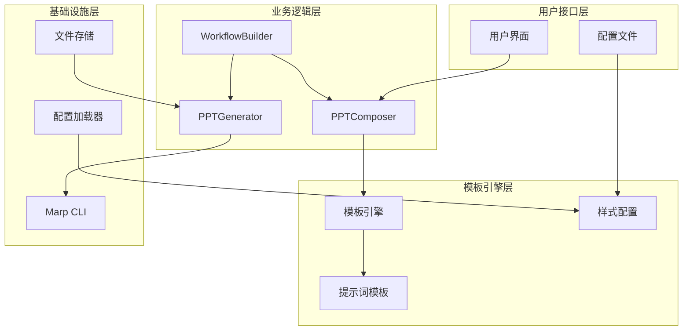
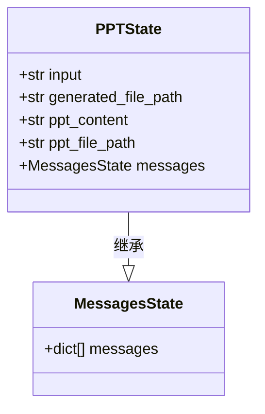
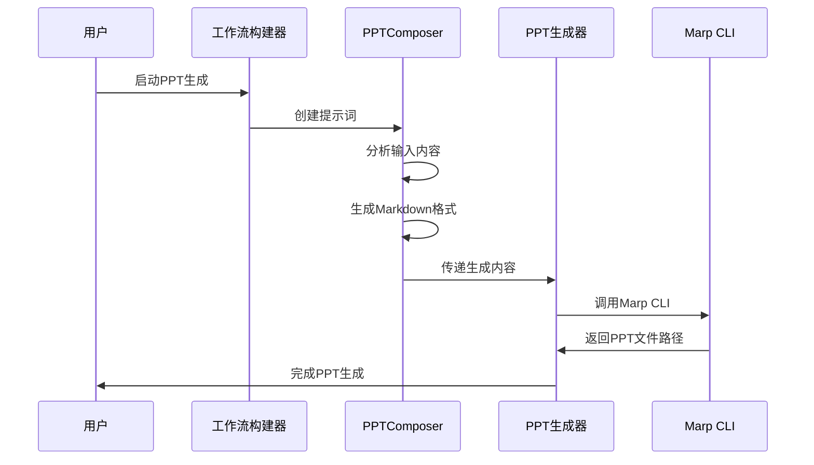
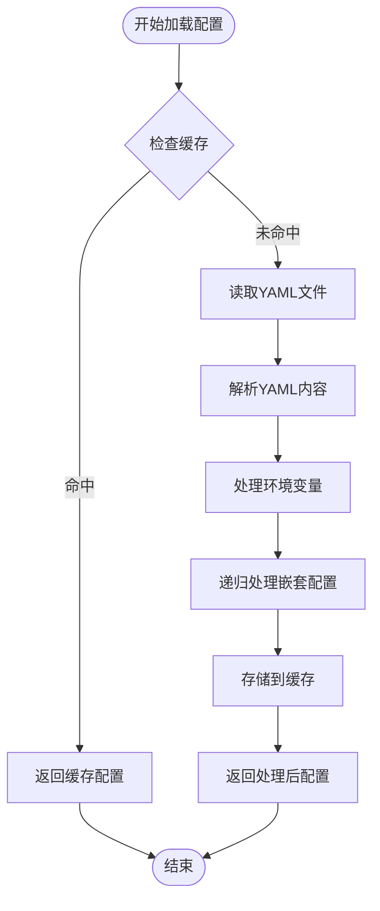
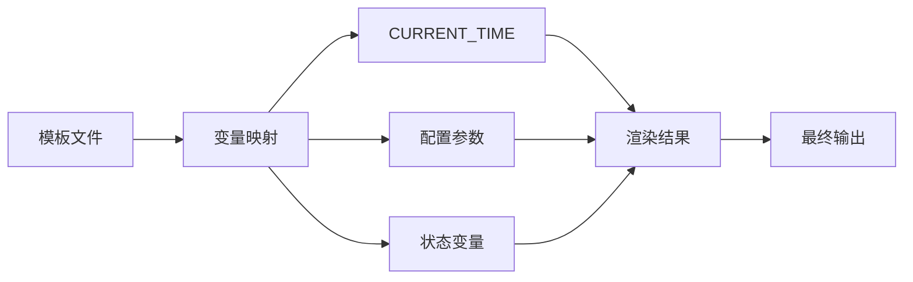
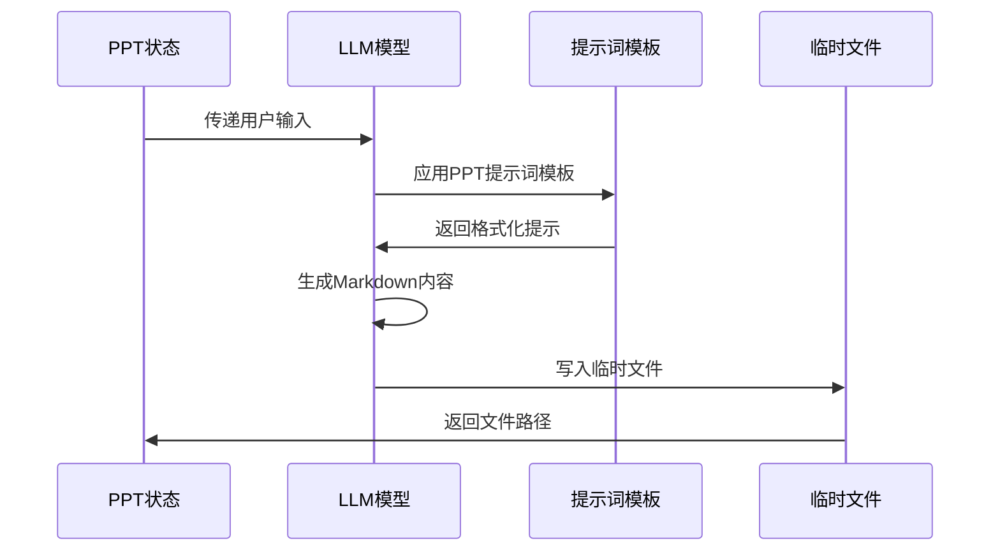
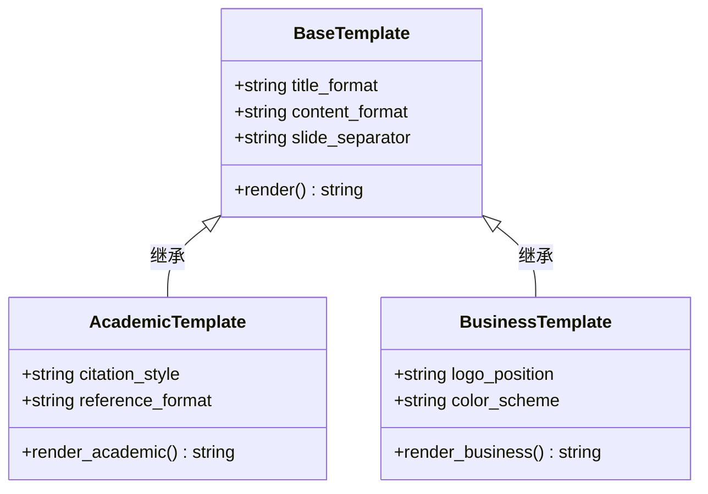

# 模板与样式定制

<cite>
**本文档引用的文件**
- [conf.yaml](file://conf.yaml)
- [ppt_composer.md](file://src/prompts/ppt/ppt_composer.md)
- [ppt_composer_node.py](file://src/ppt/graph/ppt_composer_node.py)
- [ppt_generator_node.py](file://src/ppt/graph/ppt_generator_node.py)
- [builder.py](file://src/ppt/graph/builder.py)
- [state.py](file://src/ppt/graph/state.py)
- [template.py](file://src/prompts/template.py)
- [configuration.py](file://src/config/configuration.py)
- [loader.py](file://src/config/loader.py)
- [report_style.py](file://src/config/report_style.py)
- [custom_search.py](file://src/config/custom_search.py)
- [test_template.py](file://tests/integration/test_template.py)
</cite>

## 目录
1. [简介](#简介)
2. [项目架构概览](#项目架构概览)
3. [核心组件分析](#核心组件分析)
4. [配置系统详解](#配置系统详解)
5. [模板引擎实现](#模板引擎实现)
6. [PPT生成流程](#ppt生成流程)
7. [样式定制机制](#样式定制机制)
8. [安全性和最佳实践](#安全性和最佳实践)
9. [故障排除指南](#故障排除指南)
10. [总结](#总结)

## 简介

deer-flow 是一个基于 LangGraph 的智能工作流平台，提供了强大的 PPT 模板与样式定制功能。该系统通过配置文件（如 conf.yaml）和提示词模板（ppt_composer.md）实现了灵活的视觉风格自定义，支持主题颜色、字体系列、布局偏好和品牌元素的配置。

系统的核心设计理念是通过分离关注点的方式，将内容生成、样式定制和模板渲染完全解耦。这种架构不仅提高了系统的可维护性，还为用户提供了丰富的定制选项，同时确保了安全性。

## 项目架构概览

deer-flow 的 PPT 功能采用分层架构设计，主要包含以下几个层次：



**图表来源**
- [builder.py](file://src/ppt/graph/builder.py#L1-L31)
- [ppt_composer_node.py](file://src/ppt/graph/ppt_composer_node.py#L1-L32)
- [ppt_generator_node.py](file://src/ppt/graph/ppt_generator_node.py#L1-L24)

## 核心组件分析

### PPT状态管理

PPT 状态管理是整个系统的核心，负责跟踪 PPT 生成过程中的所有状态信息：



**图表来源**
- [state.py](file://src/ppt/graph/state.py#L1-L18)

### 工作流构建器

工作流构建器负责定义 PPT 生成的完整流程：



**图表来源**
- [builder.py](file://src/ppt/graph/builder.py#L10-L20)
- [ppt_composer_node.py](file://src/ppt/graph/ppt_composer_node.py#L15-L30)
- [ppt_generator_node.py](file://src/ppt/graph/ppt_generator_node.py#L15-L24)

**章节来源**
- [state.py](file://src/ppt/graph/state.py#L1-L18)
- [builder.py](file://src/ppt/graph/builder.py#L1-L31)

## 配置系统详解

### 基础配置结构

deer-flow 使用 YAML 格式的配置文件来管理各种设置。配置系统支持环境变量替换和递归处理：

```yaml
# 基础模型配置
BASIC_MODEL:
  base_url: http://192.168.0.106:8088/v1
  model: qwen3-0.6
  api_key: xxxx
  verify_ssl: false

# 搜索引擎配置
SEARCH_ENGINE:
  engine: tavily
  include_domains:
    - example.com
    - trusted-news.com
  exclude_domains:
    - example.com

# 自定义搜索引擎配置
CUSTOM_SEARCH:
  repositories:
    aggregation_search:
      name: "聚合搜索"
      description: "聚合多个数据源的搜索服务"
      repository: "aggregation-search"
      channel_id: "0"
    vector_search:
      name: "向量库"
      description: "基于向量相似度的搜索服务"
      repository: "euvd-searchByChannelId"
      channel_id: "0"
```

### 配置加载机制

配置加载器提供了强大的功能来处理复杂的配置场景：



**图表来源**
- [loader.py](file://src/config/loader.py#L50-L78)

**章节来源**
- [conf.yaml](file://conf.yaml#L1-L69)
- [loader.py](file://src/config/loader.py#L1-L78)

## 模板引擎实现

### Jinja2模板系统

deer-flow 使用 Jinja2 作为模板引擎，提供了强大的模板渲染能力：

```python
# 初始化Jinja2环境
env = Environment(
    loader=FileSystemLoader(os.path.dirname(__file__)),
    autoescape=select_autoescape(),
    trim_blocks=True,
    lstrip_blocks=True,
)
```

### 模板变量替换

模板系统支持动态变量替换，包括时间戳、配置参数等：



**图表来源**
- [template.py](file://src/prompts/template.py#L15-L25)

### 提示词模板结构

PPT 提示词模板定义了完整的 Markdown 格式规范：

```markdown
# Professional Presentation (PPT) Markdown Assistant

## Markdown PPT Formatting Guidelines

### Title and Structure
- Use `#` for the title slide (typically one slide)
- Use `##` for slide titles
- Use `###` for subtitles (if needed)
- Use horizontal rule `---` to separate slides

### Content Formatting
- Use unordered lists (`*` or `-`) for key points
- Use ordered lists (`1.`, `2.`) for sequential steps
- Separate paragraphs with blank lines
- Use code blocks with triple backticks
```

**章节来源**
- [template.py](file://src/prompts/template.py#L1-L67)
- [ppt_composer.md](file://src/prompts/ppt/ppt_composer.md#L1-L106)

## PPT生成流程

### 内容生成阶段

PPT 内容生成是通过 LLM 模型完成的，使用专门的提示词模板：



**图表来源**
- [ppt_composer_node.py](file://src/ppt/graph/ppt_composer_node.py#L15-L30)

### 文件生成阶段

生成阶段使用 Marp CLI 工具将 Markdown 转换为 PPTX 文件：

```python
def ppt_generator_node(state: PPTState):
    logger.info("Generating ppt file...")
    generated_file_path = os.path.join(
        os.getcwd(), f"generated_ppt_{uuid.uuid4()}.pptx"
    )
    subprocess.run(["marp", state["ppt_file_path"], "-o", generated_file_path])
    os.remove(state["ppt_file_path"])
    return {"generated_file_path": generated_file_path}
```

**章节来源**
- [ppt_composer_node.py](file://src/ppt/graph/ppt_composer_node.py#L1-L32)
- [ppt_generator_node.py](file://src/ppt/graph/ppt_generator_node.py#L1-L24)

## 样式定制机制

### 报告样式枚举

系统提供了多种预定义的报告样式：

```python
class ReportStyle(enum.Enum):
    ACADEMIC = "academic"
    POPULAR_SCIENCE = "popular_science"
    NEWS = "news"
    SOCIAL_MEDIA = "social_media"
```

### 配置驱动的样式定制

通过配置文件可以轻松定制 PPT 的外观和行为：

```yaml
# 自定义样式配置示例
STYLES:
  theme_color: "#1a73e8"
  font_family: "Arial, sans-serif"
  slide_transition: "fade"
  brand_logo: "/assets/company-logo.png"
  footer_text: "© 2025 Company Name"
```

### 模板继承机制

系统支持模板继承，允许用户创建基础模板并在其基础上进行定制：



**章节来源**
- [report_style.py](file://src/config/report_style.py#L1-L8)

## 安全性和最佳实践

### 输入验证和清理

系统在处理用户输入时实施了多层安全措施：

1. **模板注入防护**：使用 Jinja2 的自动转义功能
2. **文件路径验证**：严格限制文件操作范围
3. **内容过滤**：对生成的内容进行安全检查

### 环境变量安全

配置系统支持安全的环境变量处理：

```python
def replace_env_vars(value: str) -> str:
    """Replace environment variables in string values."""
    if not isinstance(value, str):
        return value
    if value.startswith("$"):
        env_var = value[1:]
        return os.getenv(env_var, env_var)
    return value
```

### 最佳实践建议

1. **配置文件权限**：确保配置文件具有适当的访问权限
2. **模板隔离**：将模板文件存储在受控目录中
3. **定期审计**：定期审查配置和模板内容
4. **备份策略**：建立配置变更的备份机制

**章节来源**
- [loader.py](file://src/config/loader.py#L25-L45)

## 故障排除指南

### 常见问题诊断

#### 模板加载失败

**症状**：无法加载提示词模板
**原因**：文件路径错误或权限问题
**解决方案**：
1. 检查模板文件是否存在
2. 验证文件路径是否正确
3. 确认文件权限设置

#### Marp CLI 依赖问题

**症状**：PPT 生成失败
**原因**：Marp CLI 未正确安装
**解决方案**：
1. 安装 Marp CLI：`npm install -g @marp-team/marp-cli`
2. 验证安装：`marp --version`
3. 检查 PATH 环境变量

#### 配置解析错误

**症状**：配置文件加载失败
**原因**：YAML 格式错误或环境变量缺失
**解决方案**：
1. 验证 YAML 语法
2. 检查必需的环境变量
3. 使用配置验证工具

### 性能优化建议

1. **缓存机制**：利用配置缓存减少重复加载
2. **异步处理**：对于大型 PPT 生成任务使用异步模式
3. **资源管理**：及时清理临时文件和内存资源

**章节来源**
- [test_template.py](file://tests/integration/test_template.py#L1-L144)

## 总结

deer-flow 的 PPT 模板与样式定制功能提供了一个强大而灵活的解决方案，通过以下关键特性实现了高质量的 PPT 生成：

### 主要优势

1. **模块化设计**：清晰的分层架构便于维护和扩展
2. **配置驱动**：通过 YAML 配置文件实现灵活的定制
3. **模板引擎**：基于 Jinja2 的强大模板系统
4. **安全性**：多层次的安全防护机制
5. **可扩展性**：支持自定义模板和样式

### 技术亮点

- **工作流编排**：基于 LangGraph 的高效工作流管理
- **多格式支持**：从 Markdown 到 PPTX 的无缝转换
- **环境适配**：支持多种部署环境和配置方式
- **测试覆盖**：完善的单元测试和集成测试

### 发展方向

未来的发展可以考虑以下改进：

1. **更多模板类型**：扩展支持教育、营销等专业领域的模板
2. **实时预览**：添加 Web 界面的实时预览功能
3. **协作编辑**：支持多人协作编辑 PPT 内容
4. **云端集成**：与主流云存储服务深度集成

通过持续的优化和功能扩展，deer-flow 的 PPT 模板与样式定制功能将继续为用户提供更加便捷和高效的演示文稿制作体验。