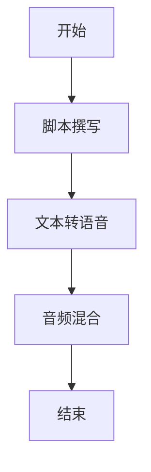
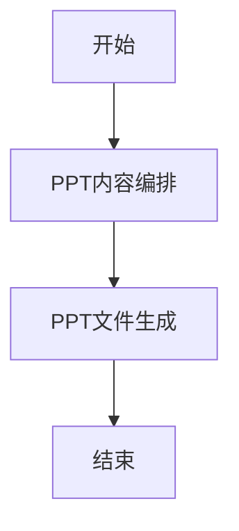
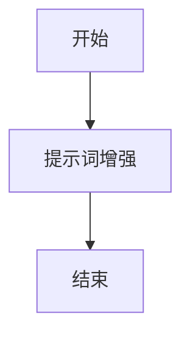

# 内容生成

<cite>
**本文档引用的文件**
- [builder.py](file://src/podcast/graph/builder.py)
- [script_writer_node.py](file://src/podcast/graph/script_writer_node.py)
- [tts_node.py](file://src/podcast/graph/tts_node.py)
- [audio_mixer_node.py](file://src/podcast/graph/audio_mixer_node.py)
- [state.py](file://src/podcast/graph/state.py)
- [podcast_script_writer.md](file://src/prompts/podcast/podcast_script_writer.md)
- [ppt_builder.py](file://src/ppt/graph/builder.py)
- [ppt_composer_node.py](file://src/ppt/graph/ppt_composer_node.py)
- [ppt_generator_node.py](file://src/ppt/graph/ppt_generator_node.py)
- [ppt_state.py](file://src/ppt/graph/state.py)
- [ppt_composer.md](file://src/prompts/ppt/ppt_composer.md)
- [prompt_enhancer_builder.py](file://src/prompt_enhancer/graph/builder.py)
- [enhancer_node.py](file://src/prompt_enhancer/graph/enhancer_node.py)
- [prompt_enhancer.md](file://src/prompts/prompt_enhancer/prompt_enhancer.md)
</cite>

## 目录
1. [引言](#引言)
2. [播客生成系统](#播客生成系统)
3. [PPT生成系统](#ppt生成系统)
4. [提示词工程与内容质量控制](#提示词工程与内容质量控制)
5. [使用示例与配置方法](#使用示例与配置方法)
6. [结论](#结论)

## 引言
deer-flow 是一个多功能内容生成系统，能够将原始文本内容转换为高质量的多媒体输出。本系统主要包含两个核心子系统：播客生成和PPT生成。播客生成系统通过构建多阶段工作流，将文本内容转化为具有双人对话风格的音频节目。PPT生成系统则将内容组织为结构化的幻灯片演示文稿。两个系统都依赖于精心设计的提示词模板和工作流架构，确保输出内容的专业性和一致性。本文档将详细介绍这两个子系统的实现机制、工作流程和配置方法。

## 播客生成系统

### 工作流构建
播客生成系统基于状态图（StateGraph）构建了一个线性的处理工作流。该工作流由四个主要节点组成：脚本撰写、文本转语音（TTS）、音频混合和结束节点。工作流从"脚本撰写"节点开始，依次经过TTS处理和音频混合，最终生成完整的播客音频文件。这种线性结构确保了处理流程的清晰性和可预测性，每个节点的输出都作为下一个节点的输入，形成一个连贯的处理管道。

**图源**
- [builder.py](file://src/podcast/graph/builder.py#L15-L25)

**节源**
- [builder.py](file://src/podcast/graph/builder.py#L1-L40)

### 脚本撰写节点实现
脚本撰写节点是播客生成的核心，负责将输入的原始内容转换为适合双人朗读的对话脚本。该节点使用大型语言模型（LLM）并结合结构化输出功能，确保生成的脚本符合预定义的JSON格式。系统通过`podcast_script_writer`提示词模板指导模型生成内容，要求脚本具有自然的对话风格，包含男女两位主持人交替发言，避免使用难以朗读的数学公式或技术符号。生成的脚本以`Script`对象形式存储，包含发言者标识和对应的文本段落。

**节源**
- [script_writer_node.py](file://src/podcast/graph/script_writer_node.py#L1-L31)
- [podcast_script_writer.md](file://src/prompts/podcast/podcast_script_writer.md#L1-L39)

### 音频合成流程
音频合成流程由TTS节点和音频混合节点共同完成。TTS节点遍历脚本中的每一行对话，根据发言者性别选择相应的语音类型（男性使用"BV002_streaming"，女性使用"BV001_streaming"），并通过火山引擎的TTS服务将文本转换为音频数据。转换后的音频数据以Base64编码形式接收并解码为二进制音频块，存储在状态中。音频混合节点随后将所有音频块按顺序连接，形成最终的完整音频流。整个流程依赖于环境变量中配置的TTS服务凭据，确保安全的API访问。

**节源**
- [tts_node.py](file://src/podcast/graph/tts_node.py#L1-L48)
- [audio_mixer_node.py](file://src/podcast/graph/audio_mixer_node.py#L1-L17)
- [state.py](file://src/podcast/graph/state.py#L1-L23)

## PPT生成系统

### 幻灯片结构设计
PPT生成系统采用Markdown格式作为中间表示，通过`marp`工具链最终转换为PPTX文件。系统设计遵循清晰的幻灯片结构规范：使用一级标题（#）表示演示文稿标题，二级标题（##）表示单个幻灯片标题，三级标题（###）表示副标题，通过水平分隔线（---）明确分隔不同幻灯片。这种基于Markdown的结构设计既保证了内容的可读性，又便于自动化处理和版本控制。

**图源**
- [builder.py](file://src/ppt/graph/builder.py#L15-L25)

**节源**
- [builder.py](file://src/ppt/graph/builder.py#L1-L32)

### 内容组织策略
PPT内容组织策略由`ppt_composer_node`节点实现，该节点使用大型语言模型将输入内容转换为结构化的Markdown格式演示文稿。系统通过`ppt_composer`提示词模板指导内容生成，要求输出直接以标题开始，不包含任何引言性文字。典型的演示文稿结构包括标题幻灯片、议程、主体内容（多个部分）和总结。每个幻灯片聚焦一个主要观点，使用简洁有力的语言和项目符号列表来突出关键点，确保内容易于理解和记忆。

**节源**
- [ppt_composer_node.py](file://src/ppt/graph/ppt_composer_node.py#L1-L34)
- [ppt_composer.md](file://src/prompts/ppt/ppt_composer.md#L1-L107)

### 模板应用机制
PPT生成的模板应用机制通过`get_prompt_template`函数实现，该函数加载预定义的`ppt_composer.md`模板文件并将其作为系统消息传递给语言模型。模板中包含了详细的格式指南、处理流程和示例，确保生成的内容符合专业标准。特别强调的是，模板严格规定只能使用源内容中实际存在的图像URL，禁止创建虚构的图像占位符，这保证了演示文稿中所有媒体元素的真实性和可验证性。生成的Markdown内容被临时保存为文件，作为`marp`工具的输入。

**节源**
- [ppt_composer_node.py](file://src/ppt/graph/ppt_composer_node.py#L1-L34)
- [ppt_composer.md](file://src/prompts/ppt/ppt_composer.md#L1-L107)

### 文件生成流程
PPT文件生成流程由`ppt_generator_node`节点完成，该节点调用`marp`命令行工具将Markdown格式的演示文稿转换为PPTX文件。系统首先生成一个唯一的临时文件路径用于保存输出文件，然后执行`marp`命令，指定输入的Markdown文件和输出的PPTX文件路径。转换完成后，原始的Markdown临时文件被自动删除，只保留最终的PPTX文件。生成的文件路径被返回到工作流状态中，供后续处理或返回给用户。

**节源**
- [ppt_generator_node.py](file://src/ppt/graph/ppt_generator_node.py#L1-L26)
- [state.py](file://src/ppt/graph/state.py#L1-L20)

## 提示词工程与内容质量控制

### 提示词增强系统
提示词工程在deer-flow中扮演着关键角色，通过`prompt_enhancer`子系统实现内容质量控制。该系统能够分析和增强用户输入的提示词，使其更加具体、结构化和有效。提示词增强工作流由一个简单的单节点图构成，接收用户提示和可选的上下文信息，通过大型语言模型进行分析和重构。系统根据指定的报告风格（如学术、科普、新闻或社交媒体）应用不同的增强策略，显著提升后续内容生成的质量和相关性。

**图源**
- [builder.py](file://src/prompt_enhancer/graph/builder.py#L15-L25)

**节源**
- [builder.py](file://src/prompt_enhancer/graph/builder.py#L1-L26)
- [enhancer_node.py](file://src/prompt_enhancer/graph/enhancer_node.py#L1-L83)

### 风格化增强策略
提示词增强系统实现了多种风格化的增强策略，能够根据不同的应用场景调整输出。对于学术风格，系统会增加方法论严谨性、学术结构和理论背景；对于科普风格，系统会添加可访问性元素、叙事结构和人类兴趣点；对于新闻风格，系统会强化新闻报道的严谨性、倒金字塔结构和时效性；对于社交媒体风格，系统会增加参与度元素、平台特定结构和病毒式传播要素。这些策略通过条件模板实现，确保增强后的提示词能够引导生成符合特定场景需求的高质量内容。

**节源**
- [prompt_enhancer.md](file://src/prompts/prompt_enhancer/prompt_enhancer.md#L1-L135)

### 输出格式规范
提示词增强系统的输出格式经过精心设计，确保结果可以直接使用。系统要求模型将最终的增强提示词包裹在`<enhanced_prompt>` XML标签中，标签内不包含任何解释性文字或前缀。这种格式规范使得解析和提取增强后的提示词变得简单可靠。系统还实现了容错机制，如果模型未按预期使用XML标签，系统会尝试移除常见的前缀文本作为备用方案，确保即使在非理想情况下也能获得可用的输出。

**节源**
- [enhancer_node.py](file://src/prompt_enhancer/graph/enhancer_node.py#L1-L83)

## 使用示例与配置方法

### 播客生成示例
要生成播客内容，用户可以提供一篇Markdown格式的文章作为输入。系统将自动执行完整的播客生成工作流：首先将文章内容转换为双人对话脚本，然后为每个对话行生成相应的音频，最后将所有音频片段混合成一个完整的MP3文件。用户可以通过配置环境变量（如VOLCENGINE_TTS_APPID和VOLCENGINE_TTS_ACCESS_TOKEN）来设置TTS服务凭据，并通过修改提示词模板来调整脚本风格和语气。

**节源**
- [builder.py](file://src/podcast/graph/builder.py#L35-L40)

### PPT生成示例
PPT生成过程同样简单直观。用户提交内容后，系统首先将其编排为结构化的Markdown演示文稿，然后使用`marp`工具将其转换为专业的PPTX文件。用户可以通过定制`ppt_composer.md`模板来控制演示文稿的结构、风格和内容重点。例如，可以修改模板以强调特定的行业术语、调整幻灯片布局或改变整体视觉风格。

**节源**
- [builder.py](file://src/ppt/graph/builder.py#L27-L32)

### 自定义配置
系统支持多种自定义配置选项。用户可以通过修改`src/config/agents.py`中的AGENT_LLM_MAP来指定不同任务使用的语言模型。提示词模板位于`src/prompts/`目录下，用户可以直接编辑这些Markdown文件来调整内容生成的指导方针。对于高级用户，还可以通过扩展工作流图来添加新的处理节点，例如在播客生成流程中加入背景音乐添加节点，或在PPT生成流程中加入图表生成节点。

**节源**
- [agents.py](file://src/config/agents.py)
- [template.py](file://src/prompts/template.py)

### 输出格式选项
系统提供灵活的输出格式选项。播客生成默认输出MP3格式的音频文件，但用户可以通过修改音频混合节点的实现来支持其他音频格式。PPT生成使用`marp`工具链，天然支持多种输出格式，包括PPTX、PDF和HTML。用户可以通过修改`ppt_generator_node.py`中的命令行参数来指定所需的输出格式，满足不同场景下的使用需求。

**节源**
- [audio_mixer_node.py](file://src/podcast/graph/audio_mixer_node.py#L1-L17)
- [ppt_generator_node.py](file://src/ppt/graph/ppt_generator_node.py#L1-L26)

## 结论
deer-flow的内容生成系统通过精心设计的工作流架构和提示词工程，实现了高质量的多媒体内容自动化生成。播客生成和PPT生成两个子系统各具特色，分别针对音频和视觉媒介的特点进行了优化。系统的核心优势在于其模块化设计和可配置性，用户可以通过修改提示词模板和配置文件来轻松定制输出风格和质量。提示词增强系统的引入进一步提升了内容生成的智能化水平，能够根据不同的应用场景自动优化输入提示。整体而言，该系统为从原始文本到专业多媒体内容的转换提供了一套完整、灵活且高效的解决方案。