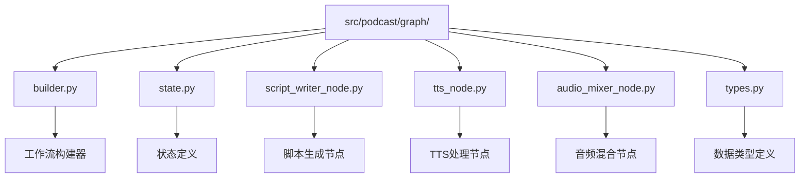
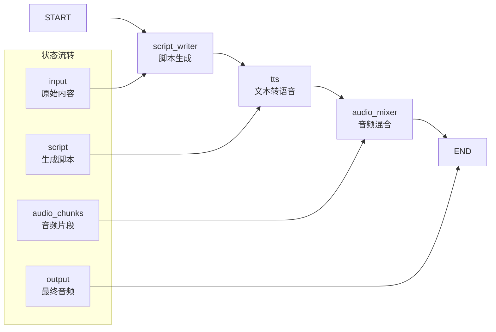
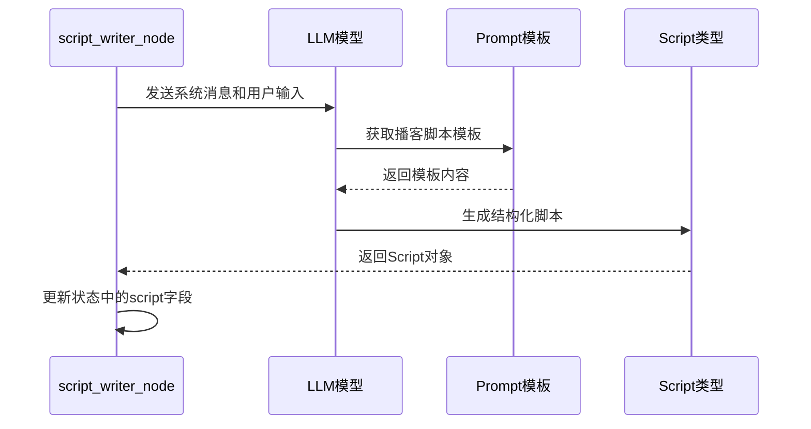
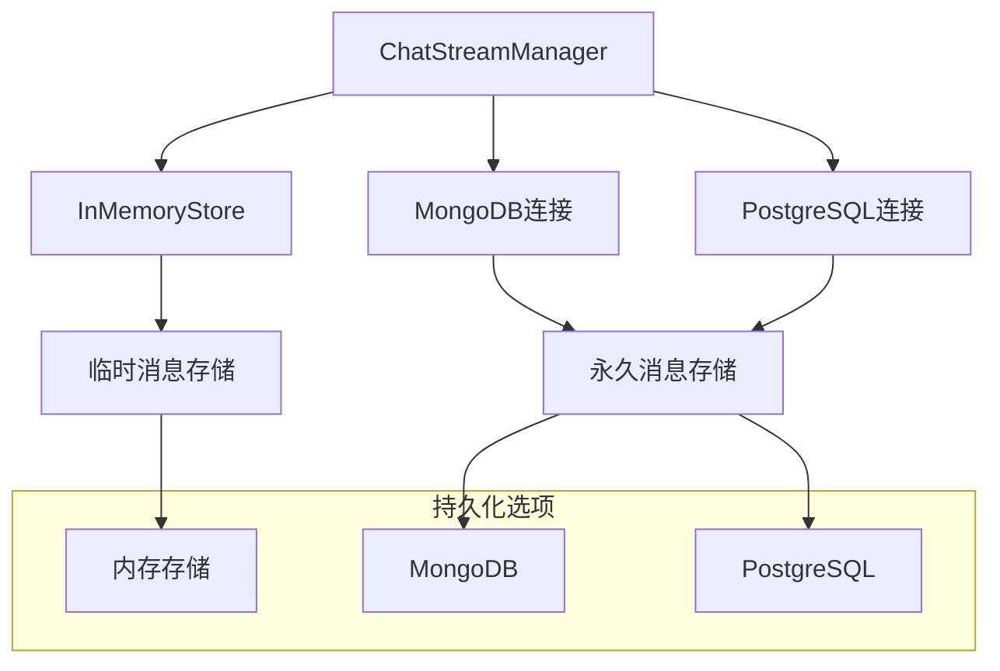

# 播客工作流编排架构文档

<cite>
**本文档引用的文件**
- [builder.py](file://src/podcast/graph/builder.py)
- [state.py](file://src/podcast/graph/state.py)
- [script_writer_node.py](file://src/podcast/graph/script_writer_node.py)
- [tts_node.py](file://src/podcast/graph/tts_node.py)
- [audio_mixer_node.py](file://src/podcast/graph/audio_mixer_node.py)
- [types.py](file://src/podcast/types.py)
- [checkpoint.py](file://src/graph/checkpoint.py)
- [app.py](file://src/server/app.py)
- [main.py](file://main.py)
- [test_tts.py](file://tests/integration/test_tts.py)
</cite>

## 目录
1. [简介](#简介)
2. [项目结构概览](#项目结构概览)
3. [核心组件分析](#核心组件分析)
4. [工作流架构设计](#工作流架构设计)
5. [状态管理机制](#状态管理机制)
6. [节点实现详解](#节点实现详解)
7. [检查点与持久化](#检查点与持久化)
8. [错误处理与重试策略](#错误处理与重试策略)
9. [性能优化考虑](#性能优化考虑)
10. [故障排除指南](#故障排除指南)
11. [总结](#总结)

## 简介

deer-flow 是一个基于 LangGraph 的智能工作流编排系统，专门用于构建复杂的多步骤任务处理管道。本文档重点介绍播客生成工作流的架构设计，该工作流通过四个主要阶段：脚本生成、文本转语音(TTS)处理、音频混合和最终输出，实现了完整的播客内容自动化生产。

播客工作流采用状态机模式，通过 LangGraph 的 StateGraph 实现节点间的有序连接和状态传递。整个系统支持异步执行、错误恢复和状态持久化，确保在复杂任务处理中的可靠性和可维护性。

## 项目结构概览

播客工作流位于 `src/podcast/graph/` 目录下，包含以下核心文件：



**图表来源**
- [builder.py](file://src/podcast/graph/builder.py#L1-L40)
- [state.py](file://src/podcast/graph/state.py#L1-L23)
- [types.py](file://src/podcast/types.py#L1-L17)

**章节来源**
- [builder.py](file://src/podcast/graph/builder.py#L1-L40)
- [state.py](file://src/podcast/graph/state.py#L1-L23)
- [types.py](file://src/podcast/types.py#L1-L17)

## 核心组件分析

### 工作流构建器 (builder.py)

播客工作流的核心是 `build_graph()` 函数，它使用 LangGraph 的 StateGraph API 创建状态流转图：

```python
def build_graph():
    """Build and return the podcast workflow graph."""
    # build state graph
    builder = StateGraph(PodcastState)
    builder.add_node("script_writer", script_writer_node)
    builder.add_node("tts", tts_node)
    builder.add_node("audio_mixer", audio_mixer_node)
    builder.add_edge(START, "script_writer")
    builder.add_edge("script_writer", "tts")
    builder.add_edge("tts", "audio_mixer")
    builder.add_edge("audio_mixer", END)
    return builder.compile()
```

该函数定义了三个主要节点：
- **script_writer**: 负责根据输入内容生成播客脚本
- **tts**: 将脚本转换为音频片段
- **audio_mixer**: 合并所有音频片段生成最终播客

### 状态定义 (state.py)

`PodcastState` 类继承自 `MessagesState`，定义了工作流的状态结构：

```python
class PodcastState(MessagesState):
    """State for the podcast generation."""

    # Input
    input: str = ""

    # Output
    output: Optional[bytes] = None

    # Assets
    script: Optional[Script] = None
    audio_chunks: list[bytes] = []
```

状态字段说明：
- `input`: 原始输入内容（如研究报告）
- `output`: 最终生成的音频文件字节数据
- `script`: 生成的播客脚本对象
- `audio_chunks`: 中间生成的音频片段列表

**章节来源**
- [builder.py](file://src/podcast/graph/builder.py#L11-L22)
- [state.py](file://src/podcast/graph/state.py#L9-L22)

## 工作流架构设计

播客工作流采用线性流水线架构，每个阶段都有明确的职责和输入输出：



**图表来源**
- [builder.py](file://src/podcast/graph/builder.py#L11-L22)
- [state.py](file://src/podcast/graph/state.py#L9-L22)

### 条件边与分支逻辑

虽然当前播客工作流是线性的，但 LangGraph 支持条件边功能。例如，在更复杂的工作流中可以实现：

```python
def continue_to_running_research_team(state: State):
    current_plan = state.get("current_plan")
    if not current_plan or not current_plan.steps:
        return "planner"

    if all(step.execution_res for step in current_plan.steps):
        return "planner"

    # Find first incomplete step
    incomplete_step = None
    for step in current_plan.steps:
        if not step.execution_res:
            incomplete_step = step
            break

    if not incomplete_step:
        return "planner"

    if incomplete_step.step_type == StepType.RESEARCH:
        return "researcher"
    if incomplete_step.step_type == StepType.PROCESSING:
        return "coder"
    return "planner"
```

这种条件逻辑允许工作流根据状态动态调整执行路径。

**章节来源**
- [builder.py](file://src/podcast/graph/builder.py#L11-L22)
- [builder.py](file://src/graph/builder.py#L25-L45)

## 状态管理机制

### 数据类型定义

播客工作流使用 Pydantic 模型确保类型安全：

```python
class ScriptLine(BaseModel):
    speaker: Literal["male", "female"] = Field(default="male")
    paragraph: str = Field(default="")

class Script(BaseModel):
    locale: Literal["en", "zh"] = Field(default="en")
    lines: list[ScriptLine] = Field(default=[])
```

这些模型提供了：
- **类型验证**: 确保数据格式正确
- **默认值**: 提供合理的默认配置
- **文档化**: 自动生成类型文档
- **序列化**: 支持 JSON 序列化

### 状态传递机制

每个节点通过返回字典更新状态：

```python
def script_writer_node(state: PodcastState):
    # ... 脚本生成逻辑 ...
    return {"script": script, "audio_chunks": []}
```

这种设计确保：
- **增量更新**: 只更新需要修改的字段
- **状态隔离**: 避免节点间的数据污染
- **可追踪性**: 每个状态变更都有明确的来源

**章节来源**
- [types.py](file://src/podcast/types.py#L8-L16)
- [script_writer_node.py](file://src/podcast/graph/script_writer_node.py#L18-L30)

## 节点实现详解

### 脚本生成节点 (script_writer_node.py)

脚本生成节点是工作流的第一个环节，负责将输入内容转换为结构化的播客脚本：



**图表来源**
- [script_writer_node.py](file://src/podcast/graph/script_writer_node.py#L18-L30)

关键特性：
- **结构化输出**: 使用 JSON 模式确保输出格式
- **提示工程**: 利用专门的播客脚本模板
- **LLM 集成**: 通过 AGENT_LLM_MAP 配置不同的 LLM

### TTS 处理节点 (tts_node.py)

TTS 节点负责将脚本中的每一行文本转换为音频：

```python
def tts_node(state: PodcastState):
    logger.info("Generating audio chunks for podcast...")
    tts_client = _create_tts_client()
    for line in state["script"].lines:
        tts_client.voice_type = (
            "BV002_streaming" if line.speaker == "male" else "BV001_streaming"
        )
        result = tts_client.text_to_speech(line.paragraph, speed_ratio=1.05)
        if result["success"]:
            audio_data = result["audio_data"]
            audio_chunk = base64.b64decode(audio_data)
            state["audio_chunks"].append(audio_chunk)
        else:
            logger.error(result["error"])
    return {
        "audio_chunks": state["audio_chunks"],
    }
```

主要功能：
- **语音类型适配**: 根据说话者性别选择不同语音
- **批量处理**: 逐行处理脚本内容
- **错误处理**: 记录失败的 TTS 请求
- **音频解码**: 将 Base64 编码的音频数据转换为二进制格式

### 音频混合节点 (audio_mixer_node.py)

音频混合节点将所有音频片段合并为单个音频文件：

```python
def audio_mixer_node(state: PodcastState):
    logger.info("Mixing audio chunks for podcast...")
    audio_chunks = state["audio_chunks"]
    combined_audio = b"".join(audio_chunks)
    logger.info("The podcast audio is now ready.")
    return {"output": combined_audio}
```

特点：
- **简单高效**: 使用 Python 字节串连接
- **内存友好**: 不需要额外的音频处理库
- **日志记录**: 提供清晰的执行状态信息

**章节来源**
- [script_writer_node.py](file://src/podcast/graph/script_writer_node.py#L18-L30)
- [tts_node.py](file://src/podcast/graph/tts_node.py#L13-L30)
- [audio_mixer_node.py](file://src/podcast/graph/audio_mixer_node.py#L10-L16)

## 检查点与持久化

### 检查点系统架构

deer-flow 提供了完整的检查点和持久化系统，支持多种数据库后端：



**图表来源**
- [checkpoint.py](file://src/graph/checkpoint.py#L20-L50)

### 数据库初始化与连接

检查点管理器支持两种数据库后端：

```python
def _init_mongodb(self) -> None:
    """Initialize MongoDB connection."""
    try:
        self.mongo_client = MongoClient(self.db_uri)
        self.mongo_db = self.mongo_client.checkpointing_db
        # Test connection
        self.mongo_client.admin.command("ping")
        self.logger.info("Successfully connected to MongoDB")
    except Exception as e:
        self.logger.error(f"Failed to connect to MongoDB: {e}")

def _init_postgresql(self) -> None:
    """Initialize PostgreSQL connection and create table if needed."""
    try:
        self.postgres_conn = psycopg.connect(self.db_uri, row_factory=dict_row)
        self.logger.info("Successfully connected to PostgreSQL")
        self._create_chat_streams_table()
    except Exception as e:
        self.logger.error(f"Failed to connect to PostgreSQL: {e}")
```

### 流式消息处理

系统支持实时消息流处理，能够处理长时间运行的对话：

```python
def process_stream_message(
    self, thread_id: str, message: str, finish_reason: str
) -> bool:
    """
    Process and store a chat stream message chunk.

    This method handles individual message chunks during streaming and consolidates
    them into a complete message when the stream finishes.
    """
    # Create namespace for this thread's messages
    store_namespace: Tuple[str, str] = ("messages", thread_id)

    # Get or initialize message cursor for tracking chunks
    cursor = self.store.get(store_namespace, "cursor")
    current_index = 0

    if cursor is None:
        # Initialize cursor for new conversation
        self.store.put(store_namespace, "cursor", {"index": 0})
    else:
        # Increment index for next chunk
        current_index = int(cursor.value.get("index", 0)) + 1
        self.store.put(store_namespace, "cursor", {"index": current_index})

    # Store the current message chunk
    self.store.put(store_namespace, f"chunk_{current_index}", message)

    # Check if conversation is complete and should be persisted
    if finish_reason in ("stop", "interrupt"):
        return self._persist_complete_conversation(
            thread_id, store_namespace, current_index
        )

    return True
```

**章节来源**
- [checkpoint.py](file://src/graph/checkpoint.py#L50-L100)
- [checkpoint.py](file://src/graph/checkpoint.py#L150-L200)

## 错误处理与重试策略

### TTS 错误处理

TTS 节点实现了完善的错误处理机制：

```python
def tts_node(state: PodcastState):
    logger.info("Generating audio chunks for podcast...")
    tts_client = _create_tts_client()
    for line in state["script"].lines:
        tts_client.voice_type = (
            "BV002_streaming" if line.speaker == "male" else "BV001_streaming"
        )
        result = tts_client.text_to_speech(line.paragraph, speed_ratio=1.05)
        if result["success"]:
            audio_data = result["audio_data"]
            audio_chunk = base64.b64decode(audio_data)
            state["audio_chunks"].append(audio_chunk)
        else:
            logger.error(result["error"])
    return {
        "audio_chunks": state["audio_chunks"],
    }
```

错误处理策略：
- **逐行处理**: 单行失败不影响其他行的处理
- **日志记录**: 详细记录错误信息便于调试
- **优雅降级**: 继续处理后续内容

### API 级错误处理

服务器端实现了统一的异常处理：

```python
@app.post("/api/podcast/generate")
async def generate_podcast(request: GeneratePodcastRequest):
    try:
        report_content = request.content
        workflow = build_podcast_graph()
        final_state = workflow.invoke({"input": report_content})
        audio_bytes = final_state["output"]
        return Response(content=audio_bytes, media_type="audio/mp3")
    except Exception as e:
        logger.exception(f"Error occurred during podcast generation: {str(e)}")
        raise HTTPException(status_code=500, detail=INTERNAL_SERVER_ERROR_DETAIL)
```

客户端错误处理：
```javascript
try {
    audioUrl = await generatePodcast(reportMessage.content);
} catch (e) {
    console.error(e);
    useStore.setState((state)=>({
        messages: new Map(useStore.getState().messages).set(podCastMessageId, {
            ...state.messages.get(podCastMessageId),
            content: JSON.stringify({
                ...podcastObject,
                error: e instanceof Error ? e.message : "Unknown error"
            }),
            isStreaming: false
        })
    }));
    toast("An error occurred while generating podcast. Please try again.");
    return;
}
```

**章节来源**
- [tts_node.py](file://src/podcast/graph/tts_node.py#L13-L30)
- [app.py](file://src/server/app.py#L505-L520)

## 性能优化考虑

### 异步处理能力

播客工作流支持异步执行模式：

```python
@app.post("/api/prose/generate")
async def generate_prose(request: GenerateProseRequest):
    try:
        sanitized_prompt = request.prompt.replace("\r\n", "").replace("\n", "")
        logger.info(f"Generating prose for prompt: {sanitized_prompt}")
        workflow = build_prose_graph()
        events = workflow.astream(
            {
                "content": request.prompt,
                "option": request.option,
                "command": request.command,
            },
            stream_mode="messages",
            subgraphs=True,
        )
        return StreamingResponse(
            (f"data: {event[0].content}\n\n" async for _, event in events),
            media_type="text/event-stream",
        )
    except Exception as e:
        logger.exception(f"Error occurred during prose generation: {str(e)}")
        raise HTTPException(status_code=500, detail=INTERNAL_SERVER_ERROR_DETAIL)
```

### 内存管理

音频处理采用流式处理避免大内存占用：

```python
def audio_mixer_node(state: PodcastState):
    logger.info("Mixing audio chunks for podcast...")
    audio_chunks = state["audio_chunks"]
    combined_audio = b"".join(audio_chunks)
    logger.info("The podcast audio is now ready.")
    return {"output": combined_audio}
```

优势：
- **低内存占用**: 逐块处理音频数据
- **快速响应**: 不需要等待所有音频生成完成
- **可扩展性**: 支持处理大型音频文件

### 并发处理

系统支持多个独立的工作流并发执行，每个工作流都有独立的状态空间。

## 故障排除指南

### 常见问题诊断

1. **TTS 配置错误**
   ```bash
   # 检查环境变量
   echo $VOLCENGINE_TTS_APPID
   echo $VOLCENGINE_TTS_ACCESS_TOKEN
   
   # 验证网络连接
   curl -I https://openspeech.bytedance.com
   ```

2. **数据库连接问题**
   ```python
   # 检查检查点配置
   checkpoint_saver = get_bool_env("LANGGRAPH_CHECKPOINT_SAVER", False)
   db_uri = get_str_env("LANGGRAPH_CHECKPOINT_DB_URL", "mongodb://localhost:27017")
   ```

3. **内存不足**
   - 监控音频文件大小
   - 考虑分块处理大型内容
   - 实施适当的缓存清理策略

### 日志分析

启用详细日志记录：
```python
import logging
logging.basicConfig(level=logging.INFO)
logger = logging.getLogger(__name__)
```

关键日志点：
- 脚本生成开始/结束
- TTS 请求成功/失败
- 音频混合进度
- 状态更新信息

**章节来源**
- [app.py](file://src/server/app.py#L505-L520)
- [checkpoint.py](file://src/graph/checkpoint.py#L30-L50)

## 总结

deer-flow 的播客工作流编排系统展现了现代工作流引擎的最佳实践：

### 核心优势

1. **模块化设计**: 清晰的节点分离和职责划分
2. **状态管理**: 完善的状态跟踪和持久化机制
3. **错误处理**: 全面的异常捕获和恢复策略
4. **可扩展性**: 支持多种数据库后端和部署场景
5. **性能优化**: 流式处理和内存友好的设计

### 技术特色

- **LangGraph 集成**: 充分利用 LangGraph 的状态图功能
- **类型安全**: 使用 Pydantic 确保数据完整性
- **异步支持**: 完整的异步处理能力
- **监控友好**: 详细的日志记录和状态跟踪

### 应用场景

该工作流架构适用于：
- 自动化内容生成
- 多媒体内容处理
- 批量数据处理
- 实时流式应用

通过合理配置和扩展，该系统可以适应各种复杂的业务需求，为用户提供高质量的播客内容生成功能。