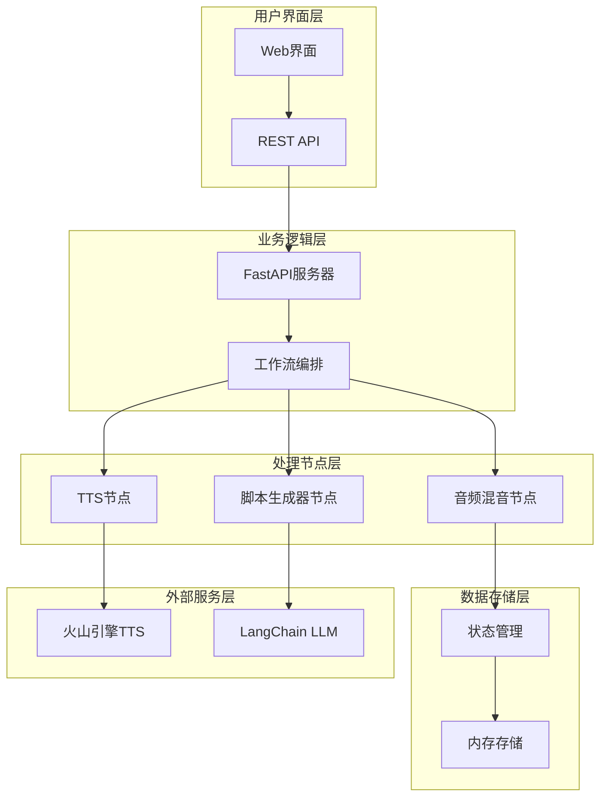
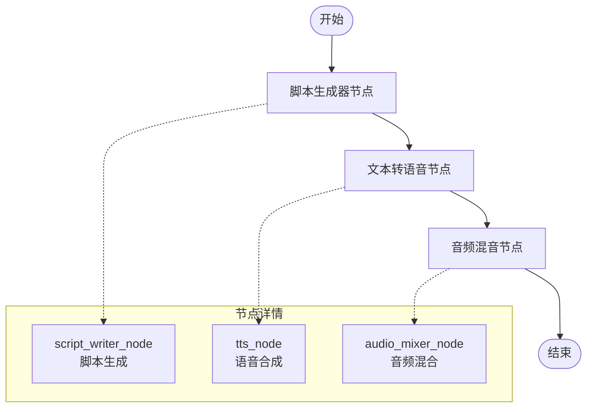
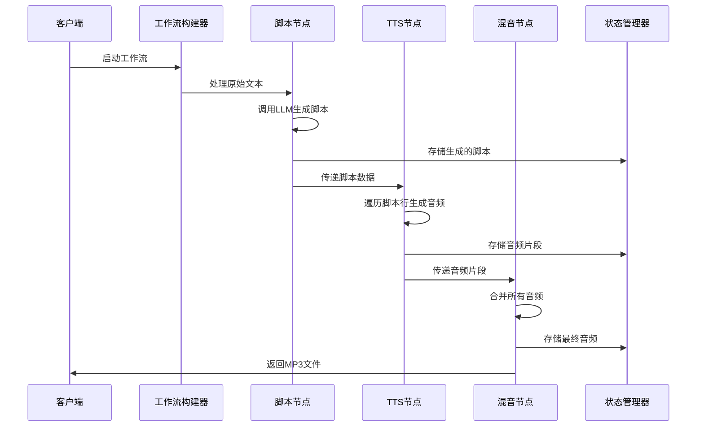
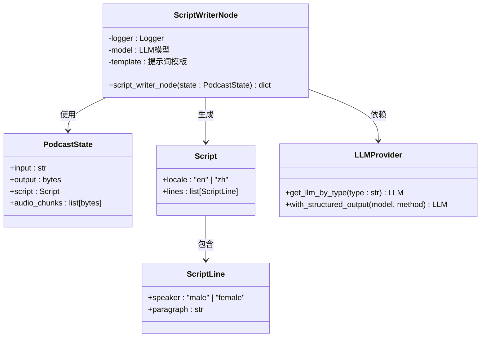
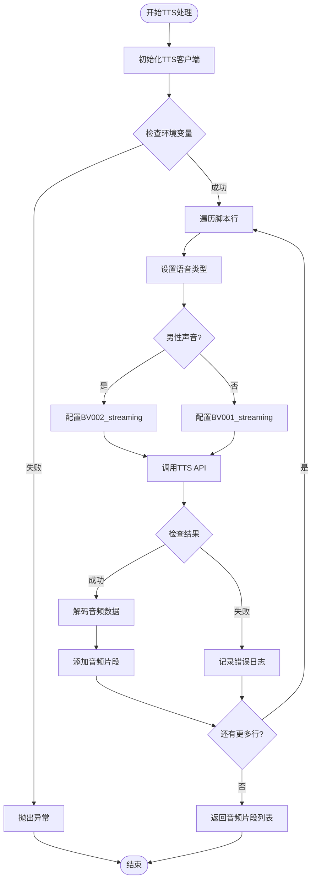
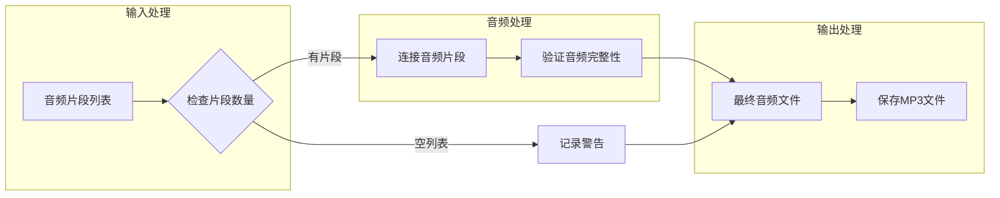
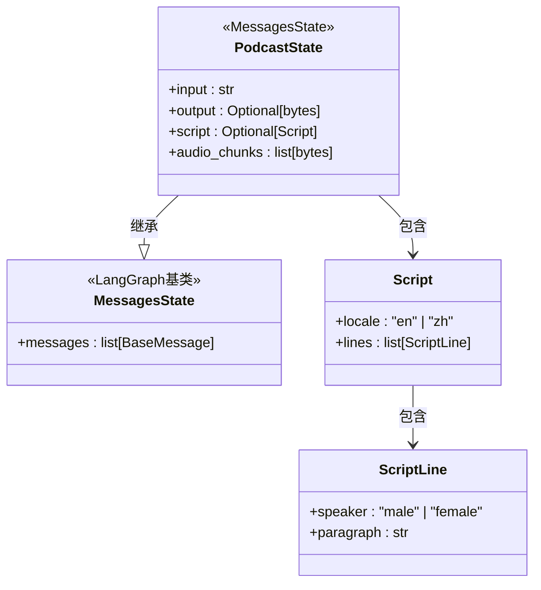
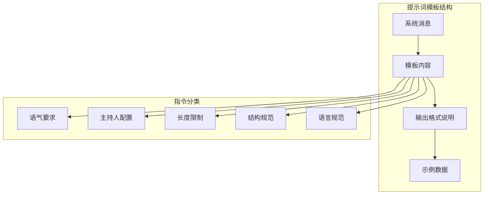
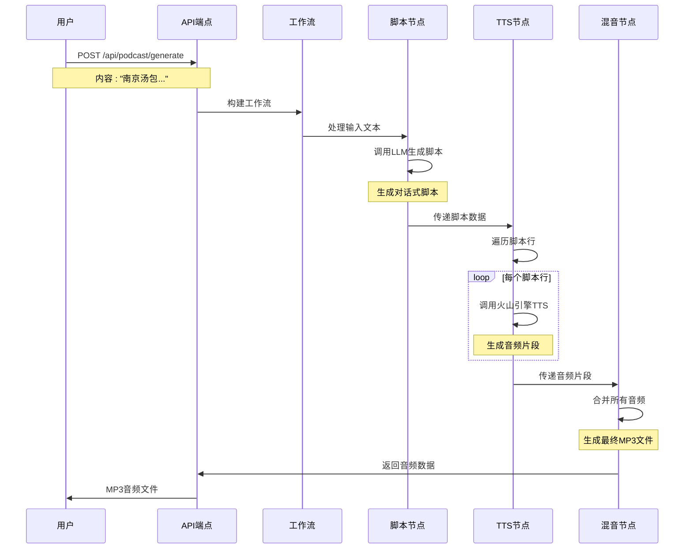
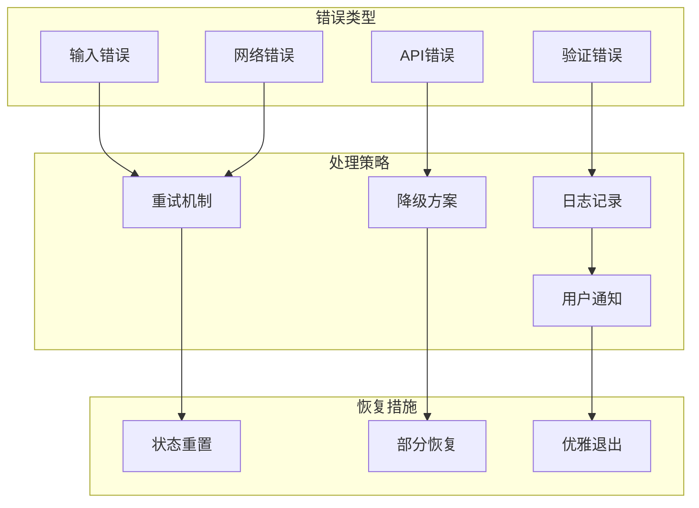

# deer-flow播客生成功能技术文档

<cite>
**本文档引用的文件**
- [src/podcast/graph/builder.py](file://src/podcast/graph/builder.py)
- [src/podcast/graph/script_writer_node.py](file://src/podcast/graph/script_writer_node.py)
- [src/podcast/graph/tts_node.py](file://src/podcast/graph/tts_node.py)
- [src/podcast/graph/audio_mixer_node.py](file://src/podcast/graph/audio_mixer_node.py)
- [src/podcast/graph/state.py](file://src/podcast/graph/state.py)
- [src/podcast/types.py](file://src/podcast/types.py)
- [src/prompts/podcast/podcast_script_writer.md](file://src/prompts/podcast/podcast_script_writer.md)
- [src/tools/tts.py](file://src/tools/tts.py)
- [src/config/agents.py](file://src/config/agents.py)
- [src/server/app.py](file://src/server/app.py)
- [web/src/core/api/podcast.ts](file://web/src/core/api/podcast.ts)
- [examples/nanjing_tangbao.md](file://examples/nanjing_tangbao.md)
</cite>

## 目录
1. [简介](#简介)
2. [系统架构概览](#系统架构概览)
3. [核心组件分析](#核心组件分析)
4. [工作流构建与执行](#工作流构建与执行)
5. [脚本生成器节点详解](#脚本生成器节点详解)
6. [文本转语音节点详解](#文本转语音节点详解)
7. [音频混音节点详解](#音频混音节点详解)
8. [状态管理系统](#状态管理系统)
9. [提示词模板设计](#提示词模板设计)
10. [完整流程示例](#完整流程示例)
11. [错误处理与性能优化](#错误处理与性能优化)
12. [自定义配置指南](#自定义配置指南)
13. [总结](#总结)

## 简介

deer-flow播客生成功能是一个基于LangGraph框架的智能音频内容生成系统，能够将文本内容自动转换为高质量的播客音频。该系统采用模块化设计，通过四个核心节点协同工作：脚本生成器、文本转语音、音频混音和状态管理，实现了从原始文本到最终MP3音频的完整自动化流程。

系统支持多种语言（英语和中文），具备自然对话风格的脚本生成能力，可生成包含两位主持人（男性和女性）的互动式播客内容。通过集成火山引擎TTS服务，系统能够生成高质量的语音合成音频，并支持自定义语速、音量和音调等参数。

## 系统架构概览

deer-flow播客生成系统采用分层架构设计，主要包含以下层次：



**图表来源**
- [src/server/app.py](file://src/server/app.py#L1-L50)
- [src/podcast/graph/builder.py](file://src/podcast/graph/builder.py#L1-L40)

## 核心组件分析

### 工作流构建器

工作流构建器是整个播客生成系统的核心协调器，负责定义和编排各个处理节点之间的执行顺序和数据流转。



**图表来源**
- [src/podcast/graph/builder.py](file://src/podcast/graph/builder.py#L15-L25)

### 节点类型定义

系统定义了三种核心处理节点，每种节点都有特定的功能和职责：

1. **脚本生成器节点**：负责将原始文本转换为结构化的播客脚本
2. **TTS节点**：将脚本中的文本转换为语音音频
3. **音频混音节点**：将多个音频片段合并为完整的播客音频

**章节来源**
- [src/podcast/graph/builder.py](file://src/podcast/graph/builder.py#L1-L40)

## 工作流构建与执行

### 工作流定义

播客生成工作流采用线性流水线模式，通过LangGraph框架进行编排：

```python
def build_graph():
    """构建并返回播客工作流图"""
    builder = StateGraph(PodcastState)
    builder.add_node("script_writer", script_writer_node)
    builder.add_node("tts", tts_node)
    builder.add_node("audio_mixer", audio_mixer_node)
    builder.add_edge(START, "script_writer")
    builder.add_edge("script_writer", "tts")
    builder.add_edge("tts", "audio_mixer")
    builder.add_edge("audio_mixer", END)
    return builder.compile()
```

### 执行流程

工作流的执行遵循严格的顺序控制：



**图表来源**
- [src/podcast/graph/builder.py](file://src/podcast/graph/builder.py#L15-L25)
- [src/podcast/graph/script_writer_node.py](file://src/podcast/graph/script_writer_node.py#L15-L25)
- [src/podcast/graph/tts_node.py](file://src/podcast/graph/tts_node.py#L15-L30)

**章节来源**
- [src/podcast/graph/builder.py](file://src/podcast/graph/builder.py#L1-L40)

## 脚本生成器节点详解

### 脚本生成器架构

脚本生成器节点是播客生成流程的第一个关键环节，负责将原始文本内容转换为符合播客标准的对话脚本。



**图表来源**
- [src/podcast/graph/script_writer_node.py](file://src/podcast/graph/script_writer_node.py#L1-L30)
- [src/podcast/graph/state.py](file://src/podcast/graph/state.py#L1-L23)
- [src/podcast/types.py](file://src/podcast/types.py#L1-L17)

### LLM集成与提示词工程

脚本生成器节点集成了LangChain的LLM框架，通过结构化输出确保生成的脚本符合预期格式：

```python
def script_writer_node(state: PodcastState):
    logger.info("Generating script for podcast...")
    model = get_llm_by_type(
        AGENT_LLM_MAP["podcast_script_writer"]
    ).with_structured_output(Script, method="json_mode")
    script = model.invoke(
        [
            SystemMessage(content=get_prompt_template("podcast/podcast_script_writer")),
            HumanMessage(content=state["input"]),
        ],
    )
    return {"script": script, "audio_chunks": []}
```

### 提示词模板设计原则

提示词模板采用了精心设计的指令结构，确保生成的脚本具有以下特征：

- **自然对话风格**：避免正式书面语，使用口语化表达
- **双主持人结构**：严格交替两位主持人的发言
- **时长控制**：目标生成10分钟以内的播客内容
- **语言规范**：使用简单易懂的语言，避免复杂术语

**章节来源**
- [src/podcast/graph/script_writer_node.py](file://src/podcast/graph/script_writer_node.py#L1-L31)
- [src/prompts/podcast/podcast_script_writer.md](file://src/prompts/podcast/podcast_script_writer.md#L1-L39)

## 文本转语音节点详解

### TTS节点架构

TTS节点负责将脚本中的文本转换为语音音频，支持多种语音参数配置和错误处理机制。



**图表来源**
- [src/podcast/graph/tts_node.py](file://src/podcast/graph/tts_node.py#L15-L35)

### Volcengine TTS客户端集成

系统集成了火山引擎的TTS服务，提供了丰富的音频参数配置选项：

```python
class VolcengineTTS:
    def __init__(self, appid: str, access_token: str, cluster: str = "volcano_tts", 
                 voice_type: str = "BV700_V2_streaming", host: str = "openspeech.bytedance.com"):
        self.appid = appid
        self.access_token = access_token
        self.cluster = cluster
        self.voice_type = voice_type
        self.host = host
        self.api_url = f"https://{host}/api/v1/tts"
        self.header = {"Authorization": f"Bearer;{access_token}"}
```

### 音频参数配置

TTS节点支持多种音频参数的精细控制：

- **编码格式**：支持MP3和WAV格式
- **语速调节**：默认1.05倍速，可自定义调整
- **音量控制**：支持音量比例调节
- **音调调节**：支持音调比例调节
- **前端处理**：可选择是否启用前端处理

### 错误处理机制

系统实现了完善的错误处理机制，确保在各种异常情况下都能提供有用的反馈：

```python
def text_to_speech(self, text: str, encoding: str = "mp3", speed_ratio: float = 1.0, 
                   volume_ratio: float = 1.0, pitch_ratio: float = 1.0, 
                   text_type: str = "plain", with_frontend: int = 1, 
                   frontend_type: str = "unitTson", uid: Optional[str] = None):
    # 参数验证和请求构建
    # API调用和响应处理
    # 错误处理和日志记录
```

**章节来源**
- [src/podcast/graph/tts_node.py](file://src/podcast/graph/tts_node.py#L1-L48)
- [src/tools/tts.py](file://src/tools/tts.py#L1-L134)

## 音频混音节点详解

### 音频混音架构

音频混音节点是播客生成流程的最后一个处理环节，负责将多个音频片段合并为完整的播客音频文件。



**图表来源**
- [src/podcast/graph/audio_mixer_node.py](file://src/podcast/graph/audio_mixer_node.py#L10-L15)

### 音频合并算法

音频混音节点采用简单的字符串拼接方式合并音频片段：

```python
def audio_mixer_node(state: PodcastState):
    logger.info("Mixing audio chunks for podcast...")
    audio_chunks = state["audio_chunks"]
    combined_audio = b"".join(audio_chunks)
    logger.info("The podcast audio is now ready.")
    return {"output": combined_audio}
```

这种实现方式具有以下特点：
- **高效性**：O(n)时间复杂度，其中n为音频片段数量
- **内存友好**：直接使用字节串操作，避免额外的数据结构开销
- **可靠性**：无需复杂的音频格式解析，减少出错可能性

### 音频格式兼容性

系统确保生成的音频文件符合标准MP3格式要求，支持主流播放器的兼容性：

- **编码格式**：MP3无损压缩
- **采样率**：支持多种采样率配置
- **比特率**：自适应比特率设置
- **文件大小**：根据音频长度动态调整

**章节来源**
- [src/podcast/graph/audio_mixer_node.py](file://src/podcast/graph/audio_mixer_node.py#L1-L17)

## 状态管理系统

### 状态架构设计

播客生成系统采用LangGraph的状态管理模式，通过PodcastState类统一管理所有中间数据和最终输出。



**图表来源**
- [src/podcast/graph/state.py](file://src/podcast/graph/state.py#L1-L23)
- [src/podcast/types.py](file://src/podcast/types.py#L1-L17)

### 状态流转机制

系统通过严格的状态流转确保数据的一致性和完整性：

1. **初始状态**：仅包含输入文本
2. **脚本生成阶段**：添加生成的脚本对象
3. **TTS处理阶段**：逐步填充音频片段列表
4. **最终状态**：生成完整的MP3音频文件

### 数据持久化策略

系统采用内存状态管理，支持以下持久化选项：

- **内存存储**：默认使用InMemoryStore
- **MongoDB检查点**：支持MongoDB持久化
- **PostgreSQL检查点**：支持PostgreSQL持久化

**章节来源**
- [src/podcast/graph/state.py](file://src/podcast/graph/state.py#L1-L23)

## 提示词模板设计

### 提示词架构

播客脚本生成的提示词模板采用了结构化的指令设计，确保生成的脚本符合专业播客的标准要求。



**图表来源**
- [src/prompts/podcast/podcast_script_writer.md](file://src/prompts/podcast/podcast_script_writer.md#L1-L39)

### 语气和风格规范

提示词模板明确规定了播客的语气和风格特征：

- **自然对话**：避免正式书面语，使用口语化表达
- **互动性**：强调主持人之间的频繁互动
- **简洁性**：保持句子简短，避免冗长表达
- **娱乐性**：注重吸引听众的兴趣

### 主持人角色分配

系统严格规定了两位主持人的角色分配：

- **男性主持人**：使用BV002_streaming语音类型
- **女性主持人**：使用BV001_streaming语音类型
- **交替发言**：确保两位主持人发言频率均衡
- **角色一致性**：在整个播客中保持角色稳定

### 输出格式约束

提示词模板定义了严格的输出格式要求：

```json
{
  "locale": "en",
  "lines": [
    {
      "speaker": "male",
      "paragraph": "This is a sample paragraph spoken by the male host."
    },
    {
      "speaker": "female", 
      "paragraph": "This is a sample paragraph spoken by the female host."
    }
  ]
}
```

**章节来源**
- [src/prompts/podcast/podcast_script_writer.md](file://src/prompts/podcast/podcast_script_writer.md#L1-L39)

## 完整流程示例

### 输入示例

系统支持多种类型的输入内容，以下是一个典型的播客生成输入示例：

```markdown
# Nanjing Tangbao: A Culinary Specialty

Nanjing Tangbao are soup-filled dumplings with a rich history and cultural significance in Nanjing, dating back to the Ming and Qing Dynasties. Key characteristics include a thin, almost translucent skin, a generous amount of rich broth, and a savory filling, often featuring minced pork and flavorful seasonings.

Modern adaptations of Tangbao include variations in size, skin thickness, and filling, with some preferring the Nanjing style over the Shanghai Xiaolongbao. Numerous restaurants and street food stalls specialize in Tangbao, with Yinshi Jishi Tangbao and Fuzimiao being frequently recommended establishments.
```

### 流程执行步骤

以下是完整的播客生成流程示例：



**图表来源**
- [src/server/app.py](file://src/server/app.py#L580-L590)

### 输出示例

系统生成的播客音频具有以下特征：

- **文件格式**：MP3无损压缩
- **文件大小**：根据内容长度动态调整
- **播放时长**：通常10-15分钟
- **音质效果**：高质量语音合成
- **文件命名**：自动命名规则

**章节来源**
- [examples/nanjing_tangbao.md](file://examples/nanjing_tangbao.md#L1-L73)
- [src/server/app.py](file://src/server/app.py#L580-L590)

## 错误处理与性能优化

### 错误处理策略

系统实现了多层次的错误处理机制：



### 性能优化措施

系统采用多种性能优化策略提升处理效率：

1. **异步处理**：支持异步工作流执行
2. **批量处理**：批量处理多个音频片段
3. **缓存机制**：缓存常用配置和模板
4. **资源池化**：复用TTS客户端连接
5. **内存管理**：及时释放临时数据

### 监控和调试

系统提供了完善的监控和调试功能：

- **日志记录**：详细的执行日志
- **性能指标**：响应时间和吞吐量统计
- **错误追踪**：完整的错误堆栈信息
- **状态监控**：实时工作流状态跟踪

## 自定义配置指南

### 环境变量配置

系统支持通过环境变量进行灵活配置：

```bash
# TTS服务配置
VOLCENGINE_TTS_APPID=your_app_id
VOLCENGINE_TTS_ACCESS_TOKEN=your_access_token
VOLCENGINE_TTS_CLUSTER=volcano_tts
VOLCENGINE_TTS_VOICE_TYPE=BV700_V2_streaming

# 工作流配置
LANGGRAPH_CHECKPOINT_SAVER=false
LANGGRAPH_CHECKPOINT_DB_URL=

# 代理配置
ENABLE_MCP_SERVER_CONFIGURATION=false
ALLOWED_ORIGINS=http://localhost:3000
```

### 自定义语音配置

用户可以通过以下方式自定义语音效果：

1. **语音类型选择**：选择不同的语音模型
2. **语速调节**：调整语音播放速度
3. **音量控制**：设置音量比例
4. **音调调节**：修改语音音调
5. **编码格式**：选择音频编码格式

### 提示词定制

系统允许用户定制提示词模板：

```python
# 自定义提示词模板路径
CUSTOM_PROMPT_PATH=src/prompts/custom_podcast.md

# 提示词模板结构
SYSTEM_MESSAGE = """
You are a professional podcast editor for a show called "Custom Show".
Transform raw content into a conversational podcast script suitable for your hosts.
"""
```

### 集成扩展

系统支持与其他服务的集成扩展：

- **RAG系统**：集成检索增强生成
- **多语言支持**：扩展支持更多语言
- **自定义工具**：集成第三方工具
- **存储后端**：支持多种存储后端

**章节来源**
- [src/server/app.py](file://src/server/app.py#L50-L100)
- [src/config/agents.py](file://src/config/agents.py#L1-L21)

## 总结

deer-flow播客生成功能是一个功能完善、架构清晰的智能音频内容生成系统。通过模块化设计和标准化接口，系统实现了从文本到音频的完整自动化流程。

### 核心优势

1. **架构设计**：采用LangGraph框架，具有良好的可扩展性和维护性
2. **质量保证**：集成高质量的TTS服务，确保音频质量
3. **灵活性**：支持多种配置选项和自定义扩展
4. **稳定性**：完善的错误处理和监控机制
5. **易用性**：简洁的API接口和丰富的配置选项

### 技术特色

- **状态管理**：基于LangGraph的状态管理模式
- **提示词工程**：精心设计的提示词模板
- **多语言支持**：支持英语和中文等多种语言
- **参数化配置**：丰富的音频参数调节选项
- **错误处理**：多层次的错误处理和恢复机制

### 应用场景

该系统适用于多种应用场景：

- **内容创作**：快速生成播客内容
- **教育培训**：制作教学音频材料
- **企业宣传**：生成产品介绍音频
- **个人创作**：辅助个人播客制作
- **多语言翻译**：支持多语言内容转换

通过持续的优化和扩展，deer-flow播客生成功能将继续为用户提供更加优质和便捷的音频内容生成服务。