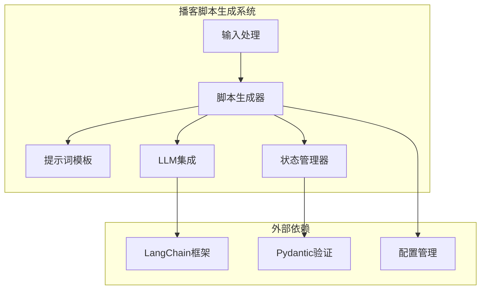
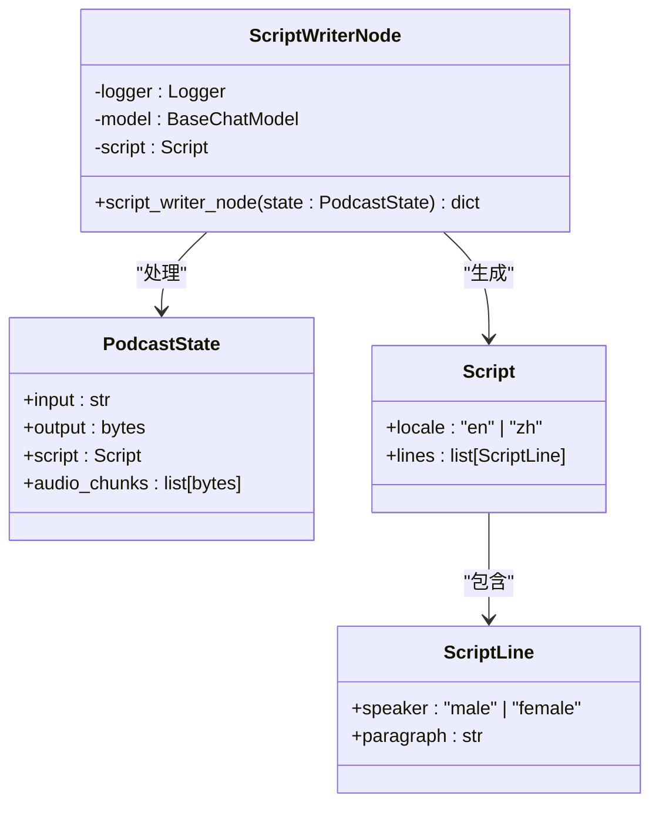
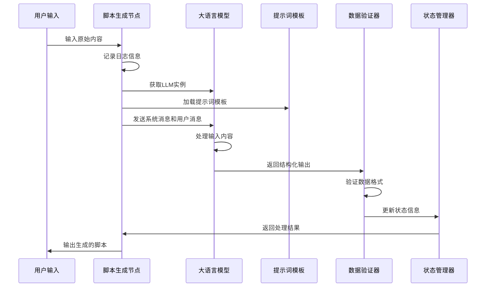
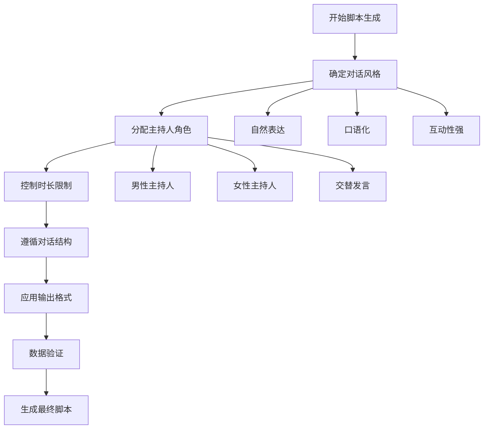
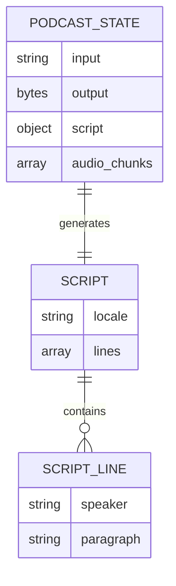
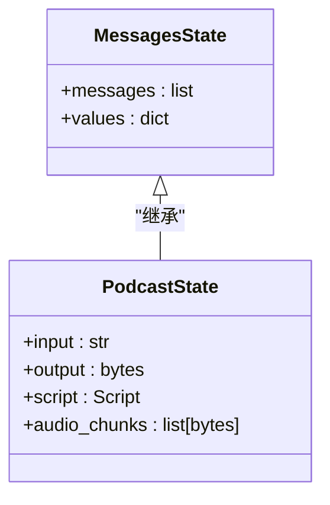
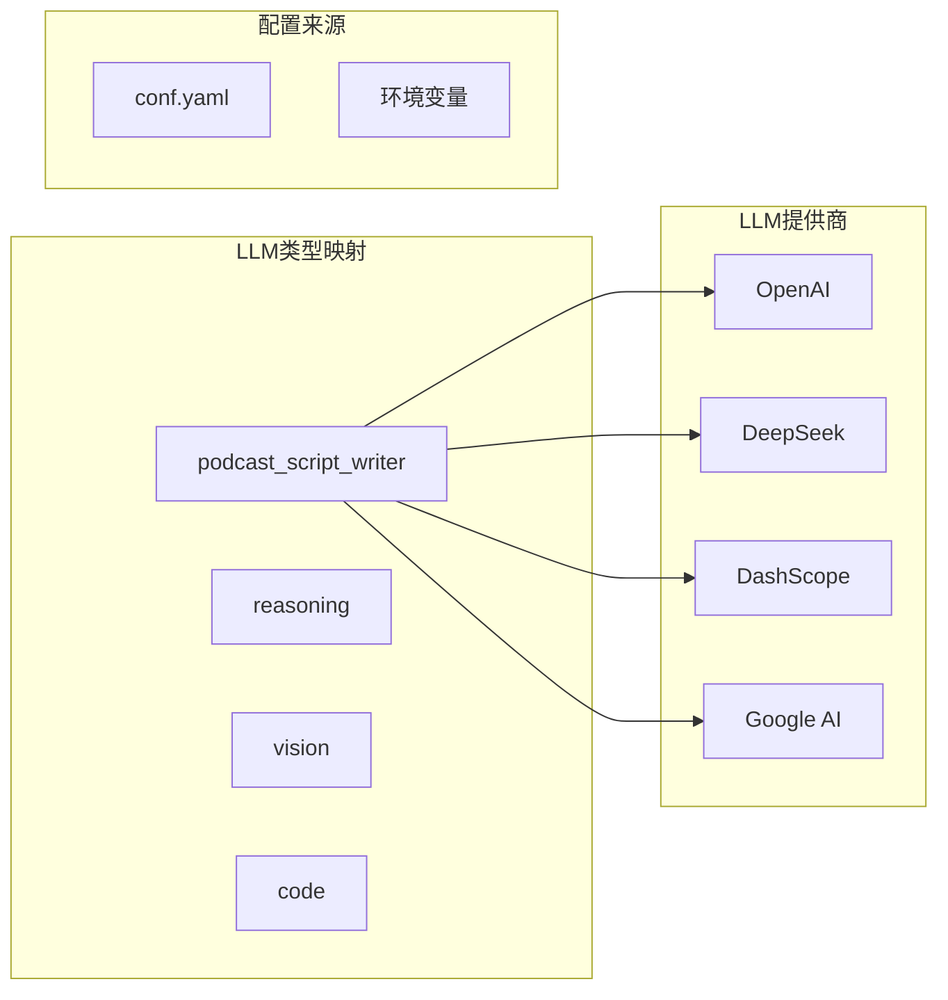

# 播客脚本生成节点技术文档

<cite>
**本文档引用的文件**
- [script_writer_node.py](file://src/podcast/graph/script_writer_node.py)
- [podcast_script_writer.md](file://src/prompts/podcast/podcast_script_writer.md)
- [types.py](file://src/podcast/types.py)
- [state.py](file://src/podcast/graph/state.py)
- [agents.py](file://src/config/agents.py)
- [llm.py](file://src/llms/llm.py)
</cite>

## 目录
1. [简介](#简介)
2. [项目架构概览](#项目架构概览)
3. [核心组件分析](#核心组件分析)
4. [脚本生成流程](#脚本生成流程)
5. [提示词模板详解](#提示词模板详解)
6. [数据类型定义](#数据类型定义)
7. [状态管理机制](#状态管理机制)
8. [LLM集成架构](#llm集成架构)
9. [扩展与定制指南](#扩展与定制指南)
10. [故障排除指南](#故障排除指南)
11. [总结](#总结)

## 简介

播客脚本生成节点是Deer Flow系统中的核心组件之一，负责将原始内容转换为适合播客对话形式的专业脚本。该系统采用LangGraph框架构建，通过结构化输出和多轮对话机制，确保生成的播客脚本符合专业标准。

系统的主要功能包括：
- 接收原始输入内容（如研究报告、研究计划等）
- 调用大语言模型进行智能转换
- 生成符合播客对话格式的脚本
- 支持多种播客风格和语言环境
- 提供结构化的输出格式

## 项目架构概览

播客脚本生成系统采用模块化设计，主要包含以下核心模块：



**图表来源**
- [script_writer_node.py](file://src/podcast/graph/script_writer_node.py#L1-L31)
- [state.py](file://src/podcast/graph/state.py#L1-L23)

## 核心组件分析

### 脚本生成器节点

脚本生成器节点是整个系统的核心入口点，负责协调各个组件的工作流程：



**图表来源**
- [script_writer_node.py](file://src/podcast/graph/script_writer_node.py#L15-L30)
- [state.py](file://src/podcast/graph/state.py#L10-L22)
- [types.py](file://src/podcast/types.py#L8-L16)

**章节来源**
- [script_writer_node.py](file://src/podcast/graph/script_writer_node.py#L1-L31)
- [state.py](file://src/podcast/graph/state.py#L1-L23)

## 脚本生成流程

脚本生成过程遵循严格的流程控制，确保输出质量和一致性：



**图表来源**
- [script_writer_node.py](file://src/podcast/graph/script_writer_node.py#L15-L30)

### 关键实现细节

1. **日志记录**：使用Python标准库logging模块记录处理过程
2. **LLM配置**：通过AGENT_LLM_MAP映射获取指定类型的LLM实例
3. **结构化输出**：使用JSON模式确保输出格式的一致性
4. **错误处理**：完整的异常捕获和日志记录机制

**章节来源**
- [script_writer_node.py](file://src/podcast/graph/script_writer_node.py#L15-L30)

## 提示词模板详解

播客脚本生成器使用专门设计的提示词模板，确保生成的脚本符合专业播客的标准：

### 模板结构分析

提示词模板包含以下关键部分：

1. **角色设定**：明确系统作为"Hello Deer"播客的专业编辑角色
2. **风格指导**：强调自然对话、频繁交替发言的特点
3. **格式规范**：要求JSON格式输出，包含明确的数据结构定义
4. **内容约束**：避免复杂公式、技术术语，注重易读性

### 核心指导原则



**图表来源**
- [podcast_script_writer.md](file://src/prompts/podcast/podcast_script_writer.md#L1-L39)

### 变量占位符说明

模板中使用了以下关键变量：
- `{topic}`：主题内容（由输入状态提供）
- `{research_results}`：研究结果（由输入状态提供）
- `{locale}`：语言环境（自动检测）

**章节来源**
- [podcast_script_writer.md](file://src/prompts/podcast/podcast_script_writer.md#L1-L39)

## 数据类型定义

系统使用Pydantic定义严格的数据结构，确保类型安全和数据完整性：

### 核心数据模型



**图表来源**
- [types.py](file://src/podcast/types.py#L8-L16)
- [state.py](file://src/podcast/graph/state.py#L10-L22)

### 类型验证机制

1. **Script类**：定义播客脚本的基本结构
2. **ScriptLine类**：定义单行对话的内容和说话者
3. **PodcastState类**：管理整个播客生成的状态

**章节来源**
- [types.py](file://src/podcast/types.py#L1-L17)
- [state.py](file://src/podcast/graph/state.py#L1-L23)

## 状态管理机制

播客状态管理器继承自LangGraph的MessagesState，提供了完整的状态跟踪能力：

### 状态字段说明



**图表来源**
- [state.py](file://src/podcast/graph/state.py#L10-L22)

### 状态流转过程

1. **输入阶段**：接收原始内容字符串
2. **处理阶段**：通过LLM生成脚本对象
3. **输出阶段**：返回音频块列表（空列表）
4. **中间状态**：存储生成的脚本对象

**章节来源**
- [state.py](file://src/podcast/graph/state.py#L1-L23)

## LLM集成架构

系统采用灵活的LLM集成架构，支持多种大语言模型提供商：

### LLM配置映射



**图表来源**
- [agents.py](file://src/config/agents.py#L10-L18)
- [llm.py](file://src/llms/llm.py#L15-L180)

### LLM实例化流程

1. **类型识别**：根据AGENT_LLM_MAP确定LLM类型
2. **配置加载**：从YAML文件和环境变量加载配置
3. **实例创建**：根据配置参数创建LLM实例
4. **缓存管理**：维护LLM实例缓存以提高性能

**章节来源**
- [agents.py](file://src/config/agents.py#L1-L21)
- [llm.py](file://src/llms/llm.py#L1-L181)

## 扩展与定制指南

### 修改提示词模板

要适应不同的播客风格，可以修改提示词模板：

#### 访谈风格
```markdown
# 访谈风格指导
- 主持人引导深度对话
- 包含开放式问题
- 强调观点对比和讨论
- 增加专家引用和案例分析
```

#### 解说风格
```markdown
# 解说风格指导
- 使用第三人称叙述
- 强调事实陈述和解释
- 减少对话频率，增加旁白
- 注重信息传递的准确性
```

#### 新闻风格
```markdown
# 新闻风格指导
- 遵循5W1H原则
- 强调时效性和重要性
- 使用客观报道语气
- 控制语速和节奏
```

### 自定义数据类型

如果需要扩展脚本格式，可以修改数据类型定义：

```python
class ExtendedScript(Script):
    locale: Literal["en", "zh", "es", "fr"] = Field(default="en")
    metadata: dict = Field(default={})
    segments: list[ScriptSegment] = Field(default=[])
```

### 添加新的LLM提供商

在llm.py中添加新的LLM提供商支持：

```python
def _create_llm_use_conf(llm_type: LLMType, conf: Dict[str, Any]) -> BaseChatModel:
    # 现有逻辑...
    
    # 添加新提供商支持
    elif llm_type == "custom_provider":
        return CustomProvider(**merged_conf)
    
    return ChatOpenAI(**merged_conf)
```

## 故障排除指南

### 常见问题及解决方案

#### 1. LLM连接失败
**症状**：无法获取LLM实例或连接超时
**解决方案**：
- 检查配置文件中的API密钥设置
- 验证网络连接和防火墙设置
- 确认LLM提供商的服务可用性

#### 2. 结构化输出失败
**症状**：LLM返回非JSON格式的响应
**解决方案**：
- 检查提示词模板中的格式要求
- 验证AGENT_LLM_MAP中的LLM类型配置
- 确认LLM支持JSON模式输出

#### 3. 数据验证错误
**症状**：生成的脚本不符合Schema定义
**解决方案**：
- 检查Script和ScriptLine的数据类型定义
- 验证输入数据的格式和内容
- 确认提示词模板中的约束条件

### 调试技巧

1. **启用详细日志**：设置日志级别为DEBUG
2. **检查中间状态**：监控PodcastState的变化
3. **验证LLM响应**：打印LLM的原始输出
4. **测试提示词**：单独测试提示词模板的效果

**章节来源**
- [script_writer_node.py](file://src/podcast/graph/script_writer_node.py#L15-L30)

## 总结

播客脚本生成节点是一个高度模块化和可扩展的系统，具有以下特点：

### 技术优势

1. **模块化设计**：清晰的组件分离和职责划分
2. **类型安全**：使用Pydantic确保数据完整性
3. **灵活配置**：支持多种LLM提供商和配置方式
4. **标准化输出**：严格的JSON格式输出规范
5. **易于扩展**：良好的接口设计便于功能扩展

### 应用价值

- **提高效率**：自动化生成高质量的播客脚本
- **保证质量**：标准化的输出格式和内容规范
- **降低成本**：减少人工编写和校对的工作量
- **提升体验**：专业的播客对话效果

### 未来发展方向

1. **多语言支持**：扩展更多语言环境的支持
2. **风格定制**：提供更多播客风格选项
3. **交互优化**：增强用户反馈和迭代能力
4. **性能提升**：优化LLM调用和缓存机制

通过深入理解这些技术细节，开发者可以更好地维护、扩展和优化播客脚本生成功能，为用户提供更优质的播客内容创作体验。