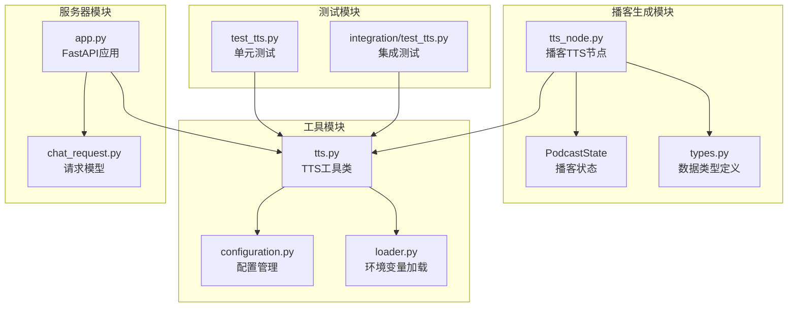
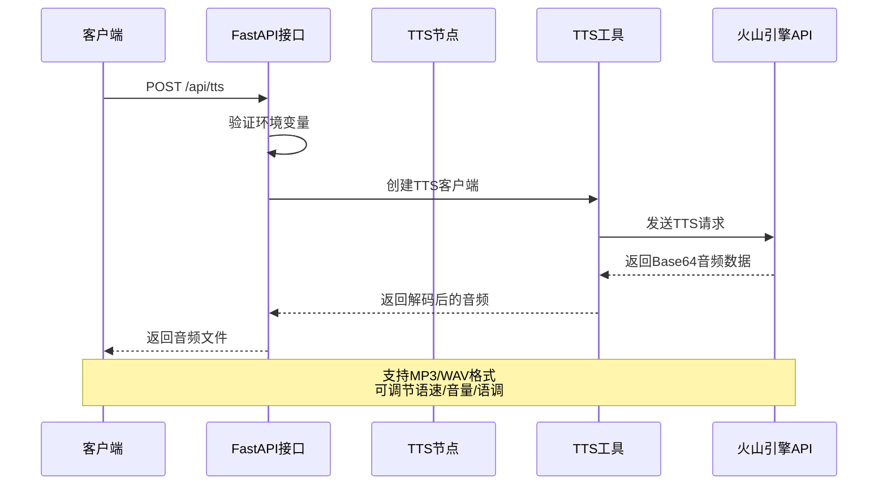
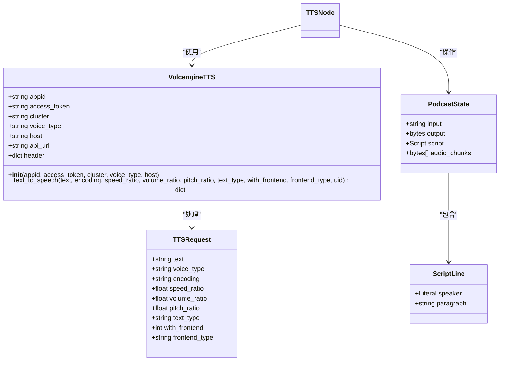
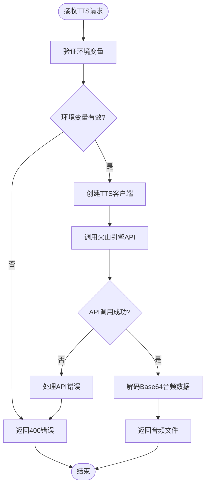
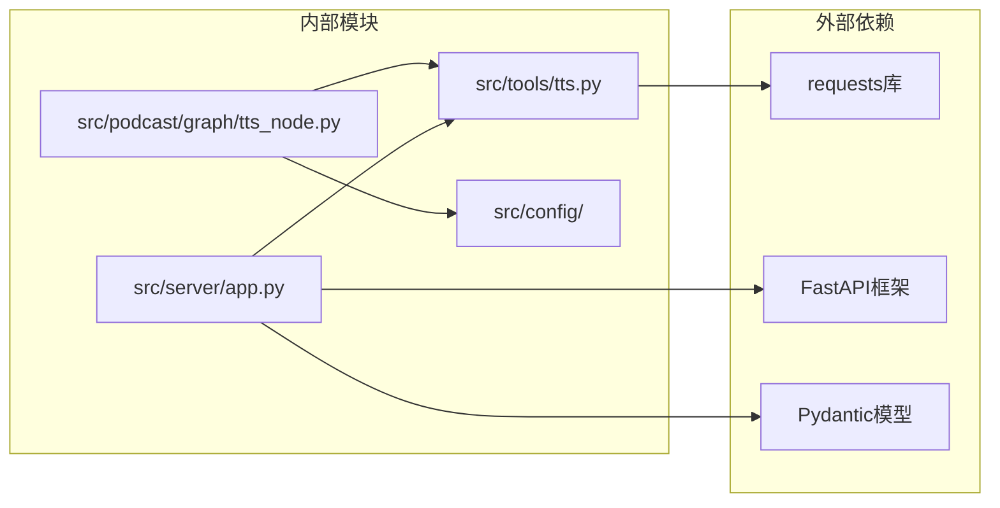

# 文本转语音 (TTS) 功能 API 文档

<cite>
**本文档引用的文件**
- [tts_node.py](file://src/podcast/graph/tts_node.py)
- [tts.py](file://src/tools/tts.py)
- [state.py](file://src/podcast/graph/state.py)
- [types.py](file://src/podcast/types.py)
- [app.py](file://src/server/app.py)
- [chat_request.py](file://src/server/chat_request.py)
- [configuration.py](file://src/config/configuration.py)
- [loader.py](file://src/config/loader.py)
- [test_tts.py](file://tests/integration/test_tts.py)
</cite>

## 目录
1. [简介](#简介)
2. [项目结构](#项目结构)
3. [核心组件](#核心组件)
4. [架构概览](#架构概览)
5. [详细组件分析](#详细组件分析)
6. [依赖关系分析](#依赖关系分析)
7. [性能考虑](#性能考虑)
8. [故障排除指南](#故障排除指南)
9. [结论](#结论)

## 简介

本文档详细介绍了 deer-flow 项目中的文本转语音 (TTS) 功能。该系统基于火山引擎 (Volcengine) 的 TTS API，提供了完整的文本到语音转换功能，支持多种语音模型、语速调节、音量控制和语调调整等功能。

TTS 功能主要应用于播客生成流程中，将脚本文本转换为高质量的音频片段。系统支持 MP3 和 WAV 格式的音频输出，并提供了灵活的配置选项来满足不同的应用场景需求。

## 项目结构

TTS 功能在 deer-flow 项目中的组织结构如下：



**图表来源**
- [tts_node.py](file://src/podcast/graph/tts_node.py#L1-L48)
- [tts.py](file://src/tools/tts.py#L1-L134)
- [app.py](file://src/server/app.py#L440-L500)

## 核心组件

### VolcengineTTS 类

`VolcengineTTS` 是 TTS 功能的核心类，负责与火山引擎的 TTS API 进行交互。该类提供了完整的初始化和文本转语音功能。

**关键特性：**
- 支持多种语音模型配置
- 提供灵活的音频参数调节
- 包含完善的错误处理机制
- 支持自动生成用户标识符

### TTS 节点

`tts_node` 函数是播客生成工作流中的 TTS 处理节点，负责遍历脚本中的每一行文本并生成相应的音频片段。

**主要功能：**
- 自动根据说话者类型选择语音模型
- 批量处理脚本文本
- 音频数据的 Base64 解码和存储
- 错误日志记录和处理

**章节来源**
- [tts.py](file://src/tools/tts.py#L15-L134)
- [tts_node.py](file://src/podcast/graph/tts_node.py#L11-L47)

## 架构概览

TTS 功能采用分层架构设计，确保了系统的可维护性和扩展性：



**图表来源**
- [app.py](file://src/server/app.py#L450-L490)
- [tts.py](file://src/tools/tts.py#L48-L132)

## 详细组件分析

### TTS 工具类分析



**图表来源**
- [tts.py](file://src/tools/tts.py#L15-L46)
- [chat_request.py](file://src/server/chat_request.py#L75-L88)
- [state.py](file://src/podcast/graph/state.py#L10-L22)
- [types.py](file://src/podcast/types.py#L8-L16)

### TTS 参数配置

TTS 工具支持丰富的参数配置选项：

#### 基础参数
- **text**: 要转换为语音的文本内容
- **encoding**: 音频编码格式 (默认: mp3)
- **voice_type**: 语音模型类型 (默认: BV700_V2_streaming)

#### 音频调节参数
- **speed_ratio**: 语速比例 (默认: 1.0)
- **volume_ratio**: 音量比例 (默认: 1.0)
- **pitch_ratio**: 语调比例 (默认: 1.0)

#### 高级参数
- **text_type**: 文本类型 (plain 或 ssml，默认: plain)
- **with_frontend**: 是否使用前端处理 (默认: 1)
- **frontend_type**: 前端类型 (默认: unitTson)
- **uid**: 用户标识符 (自动生成)

### 环境变量配置

系统通过环境变量进行配置管理：

```python
# 必需的环境变量
VOLCENGINE_TTS_APPID          # 应用程序ID
VOLCENGINE_TTS_ACCESS_TOKEN   # 访问令牌

# 可选的环境变量
VOLCENGINE_TTS_CLUSTER        # TTS集群名称 (默认: volcano_tts)
VOLCENGINE_TTS_VOICE_TYPE     # 默认语音类型 (默认: BV700_V2_streaming)
```

### 播客语音角色配置

在播客生成过程中，系统会根据说话者类型自动选择不同的语音模型：

```python
# 根据说话者类型选择语音模型
if line.speaker == "male":
    tts_client.voice_type = "BV002_streaming"  # 主持人语音
else:
    tts_client.voice_type = "BV001_streaming"  # 嘉宾语音
```

**章节来源**
- [tts.py](file://src/tools/tts.py#L48-L80)
- [tts_node.py](file://src/podcast/graph/tts_node.py#L17-L22)

### API 接口分析

#### FastAPI TTS 端点



**图表来源**
- [app.py](file://src/server/app.py#L450-L490)

#### 请求参数详解

TTS API 支持以下请求参数：

| 参数名 | 类型 | 默认值 | 描述 |
|--------|------|--------|------|
| text | string | 必填 | 要转换的文本内容 |
| encoding | string | mp3 | 输出音频格式 |
| speed_ratio | float | 1.0 | 语速调节比例 |
| volume_ratio | float | 1.0 | 音量调节比例 |
| pitch_ratio | float | 1.0 | 语调调节比例 |
| text_type | string | plain | 文本类型 (plain/ssml) |
| with_frontend | int | 1 | 是否启用前端处理 |
| frontend_type | string | unitTson | 前端处理类型 |

**章节来源**
- [app.py](file://src/server/app.py#L450-L490)
- [chat_request.py](file://src/server/chat_request.py#L75-L88)

## 依赖关系分析

TTS 功能的依赖关系图展示了各组件之间的相互依赖：



**图表来源**
- [tts.py](file://src/tools/tts.py#L1-L10)
- [tts_node.py](file://src/podcast/graph/tts_node.py#L1-L10)
- [app.py](file://src/server/app.py#L1-L30)

**章节来源**
- [tts.py](file://src/tools/tts.py#L1-L134)
- [tts_node.py](file://src/podcast/graph/tts_node.py#L1-L48)
- [app.py](file://src/server/app.py#L450-L490)

## 性能考虑

### 异步处理优化

TTS 功能采用了异步处理机制来提高性能：

1. **批量处理**: 在播客生成中，多个文本段落可以并行处理
2. **连接复用**: 使用 requests 库的连接池来复用 HTTP 连接
3. **超时控制**: 设置合理的 API 调用超时时间

### 内存管理

- **音频数据处理**: 使用 Base64 编码避免二进制数据传输问题
- **状态管理**: 通过 PodcastState 对象高效管理音频片段列表
- **资源清理**: 及时释放不再需要的音频数据

### 缓存策略

虽然当前实现没有显式缓存，但可以通过以下方式优化：
- 缓存常用的语音模型配置
- 实现音频片段的本地缓存
- 使用 CDN 加速音频文件分发

## 故障排除指南

### 常见错误及解决方案

#### 1. 环境变量未设置

**错误信息**: "VOLCENGINE_TTS_APPID is not set" 或 "VOLCENGINE_TTS_ACCESS_TOKEN is not set"

**解决方案**:
```bash
# 设置必需的环境变量
export VOLCENGINE_TTS_APPID="your_app_id"
export VOLCENGINE_TTS_ACCESS_TOKEN="your_access_token"

# 设置可选的环境变量
export VOLCENGINE_TTS_CLUSTER="volcano_tts"
export VOLCENGINE_TTS_VOICE_TYPE="BV700_V2_streaming"
```

#### 2. API 调用失败

**错误信息**: TTS API 返回错误响应

**解决方案**:
- 检查网络连接
- 验证 API 凭据的有效性
- 查看详细的错误日志
- 确认请求参数的正确性

#### 3. 音频数据为空

**错误信息**: "No audio data returned"

**解决方案**:
- 检查输入文本长度是否超过限制
- 验证语音模型配置是否正确
- 确认火山引擎服务状态

### 调试技巧

1. **启用调试日志**:
```python
import logging
logging.basicConfig(level=logging.DEBUG)
```

2. **检查请求详情**:
```python
# 在 TTS 请求中添加调试信息
logger.debug(f"Sending TTS request for text: {sanitized_text[:50]}...")
```

3. **验证环境变量**:
```python
# 在启动时验证所有必需的环境变量
required_vars = ["VOLCENGINE_TTS_APPID", "VOLCENGINE_TTS_ACCESS_TOKEN"]
for var in required_vars:
    if not os.getenv(var):
        raise Exception(f"{var} is not set")
```

**章节来源**
- [tts_node.py](file://src/podcast/graph/tts_node.py#L25-L35)
- [app.py](file://src/server/app.py#L450-L460)
- [test_tts.py](file://tests/integration/test_tts.py#L115-L135)

## 结论

deer-flow 项目的 TTS 功能提供了一个完整、可靠的文本转语音解决方案。通过火山引擎的 TTS API，系统能够生成高质量的音频内容，并支持灵活的参数配置和错误处理。

### 主要优势

1. **易于集成**: 清晰的 API 设计和完整的文档
2. **灵活配置**: 支持多种语音模型和音频参数调节
3. **健壮性**: 完善的错误处理和异常管理
4. **可扩展性**: 模块化设计便于功能扩展

### 未来改进方向

1. **缓存机制**: 实现音频片段的智能缓存
2. **多语言支持**: 扩展对更多语音模型的支持
3. **实时处理**: 支持流式音频输出
4. **质量评估**: 添加音频质量检测和优化功能

通过本文档的详细介绍，开发者可以充分理解和使用 deer-flow 项目中的 TTS 功能，为应用程序提供优质的语音合成能力。