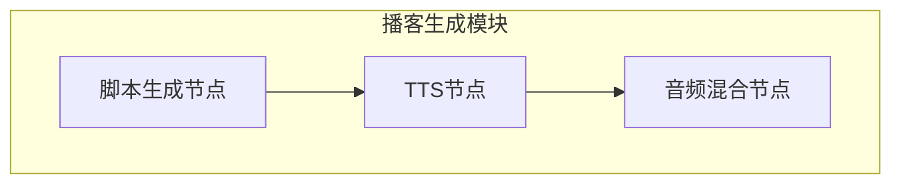
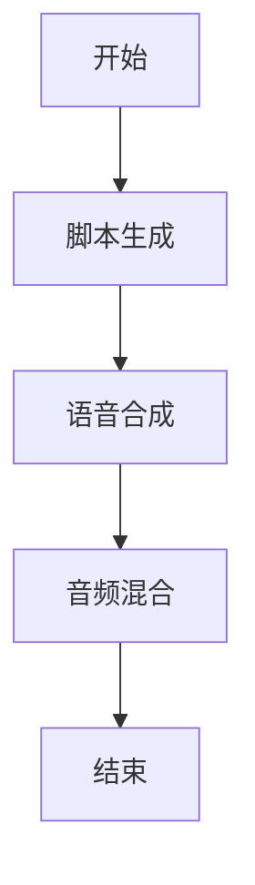
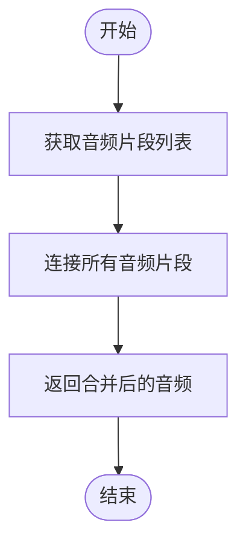
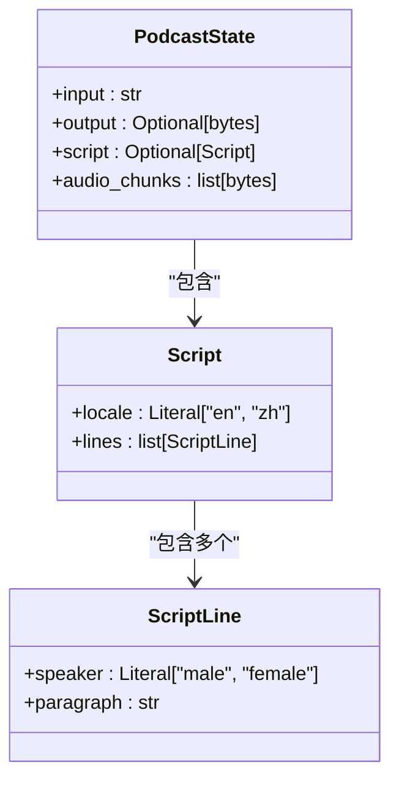
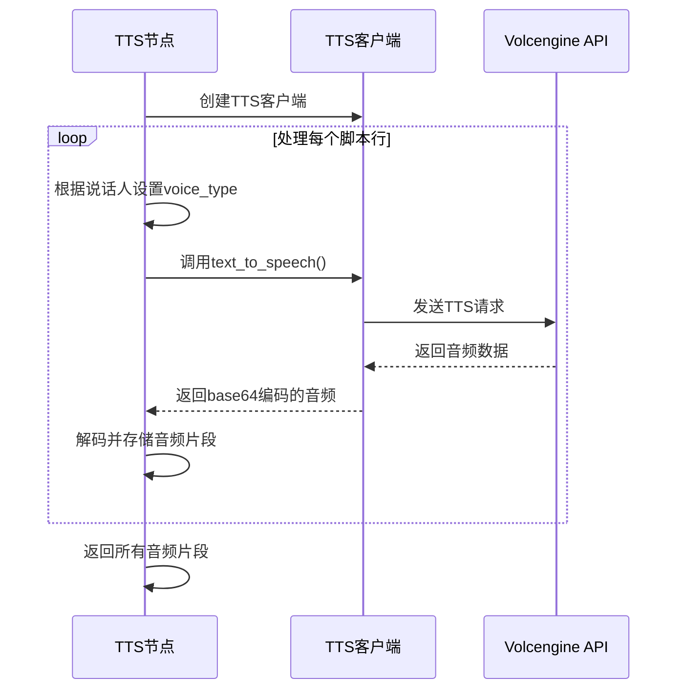
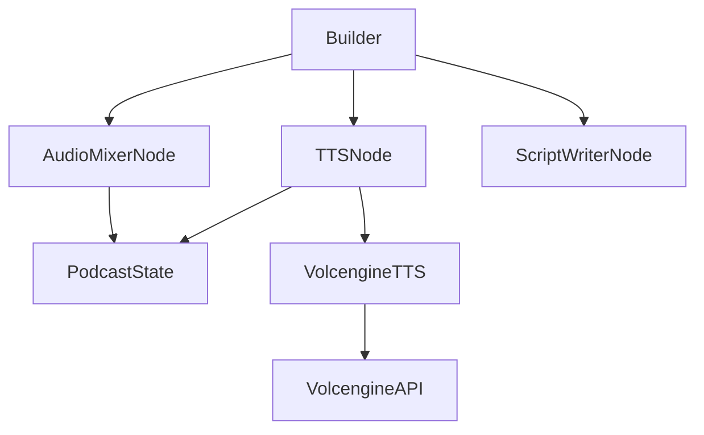

# 音频混合

<cite>
**本文档中引用的文件**  
- [audio_mixer_node.py](file://src/podcast/graph/audio_mixer_node.py)
- [state.py](file://src/podcast/graph/state.py)
- [tts_node.py](file://src/podcast/graph/tts_node.py)
- [builder.py](file://src/podcast/graph/builder.py)
- [types.py](file://src/podcast/types.py)
- [tts.py](file://src/tools/tts.py)
</cite>

## 目录
1. [简介](#简介)
2. [项目结构](#项目结构)
3. [核心组件](#核心组件)
4. [架构概述](#架构概述)
5. [详细组件分析](#详细组件分析)
6. [依赖分析](#依赖分析)
7. [性能考虑](#性能考虑)
8. [故障排除指南](#故障排除指南)
9. [结论](#结论)

## 简介
本文档详细阐述了音频混合功能的技术实现，重点分析`audio_mixer_node.py`中`audio_mixer`节点的逻辑。文档涵盖音频片段的接收、处理、混合以及最终音频文件的生成过程。系统通过结构化工作流将文本内容转换为完整的播客音频，涉及脚本生成、语音合成和音频混合等关键步骤。

## 项目结构
音频混合功能位于`src/podcast/graph/`目录下，是播客生成工作流的一部分。该功能与其他节点协同工作，形成完整的音频内容生成管道。

**图示来源**  
- [builder.py](file://src/podcast/graph/builder.py#L10-L14)

**本节来源**  
- [builder.py](file://src/podcast/graph/builder.py#L1-L40)

## 核心组件
核心组件包括音频混合节点、状态管理、TTS服务集成和工作流编排。这些组件共同实现了从文本到音频的端到端转换过程，其中音频混合节点负责将多个音频片段合并为最终的播客输出。

**本节来源**  
- [audio_mixer_node.py](file://src/podcast/graph/audio_mixer_node.py#L1-L15)
- [state.py](file://src/podcast/graph/state.py#L1-L22)

## 架构概述
系统采用基于状态图的工作流架构，将播客生成过程分解为多个有序的处理阶段。整个流程从输入文本开始，经过脚本生成、语音合成，最终通过音频混合节点生成完整的音频文件。

**图示来源**  
- [builder.py](file://src/podcast/graph/builder.py#L10-L14)

## 详细组件分析

### 音频混合节点分析
音频混合节点是播客生成工作流的最终阶段，负责将所有生成的音频片段合并为单一的音频文件。该节点从状态中获取音频片段列表，并通过简单的字节连接操作完成混合。

**图示来源**  
- [audio_mixer_node.py](file://src/podcast/graph/audio_mixer_node.py#L10-L15)

**本节来源**  
- [audio_mixer_node.py](file://src/podcast/graph/audio_mixer_node.py#L1-L15)

### 状态管理分析
`PodcastState`类定义了工作流中各节点共享的状态结构，确保数据在不同处理阶段之间正确传递。状态包含输入文本、生成的脚本、音频片段和最终输出等关键字段。

**图示来源**  
- [state.py](file://src/podcast/graph/state.py#L10-L22)
- [types.py](file://src/podcast/types.py#L10-L22)

**本节来源**  
- [state.py](file://src/podcast/graph/state.py#L1-L22)
- [types.py](file://src/podcast/types.py#L1-L16)

### TTS节点分析
TTS节点负责将脚本中的文本行转换为音频片段。该节点根据说话人角色选择不同的语音类型，并调用外部TTS服务生成音频数据。

**图示来源**  
- [tts_node.py](file://src/podcast/graph/tts_node.py#L1-L46)
- [tts.py](file://src/tools/tts.py#L48-L132)

**本节来源**  
- [tts_node.py](file://src/podcast/graph/tts_node.py#L1-L46)
- [tts.py](file://src/tools/tts.py#L1-L132)

## 依赖分析
音频混合功能依赖于多个内部和外部组件。内部依赖包括状态管理、TTS节点和工作流编排器，外部依赖主要为Volcengine的TTS服务。

**图示来源**  
- [builder.py](file://src/podcast/graph/builder.py#L5-L8)
- [audio_mixer_node.py](file://src/podcast/graph/audio_mixer_node.py#L5)
- [tts_node.py](file://src/podcast/graph/tts_node.py#L5)

**本节来源**  
- [builder.py](file://src/podcast/graph/builder.py#L1-L40)

## 性能考虑
当前音频混合实现采用简单的字节连接方式，具有较低的计算开销。然而，该方法未考虑音频格式兼容性、采样率匹配或音量平衡等高级音频处理需求。对于生产环境，建议引入专业的音频处理库（如pydub）来处理不同格式和参数的音频源，确保输出音频的质量和一致性。

## 故障排除指南
常见问题包括TTS服务认证失败、音频片段缺失和混合结果异常。检查环境变量`VOLCENGINE_TTS_APPID`和`VOLCENGINE_TTS_ACCESS_TOKEN`是否正确设置，确保TTS服务可用。若音频混合后无法播放，检查所有音频片段是否具有相同的编码格式和采样率。

**本节来源**  
- [tts.py](file://src/tools/tts.py#L48-L132)
- [tts_node.py](file://src/podcast/graph/tts_node.py#L1-L46)

## 结论
当前音频混合功能实现了基本的音频片段连接，完成了播客生成工作流的最后一步。然而，系统在音频处理方面仍有改进空间，如添加音量平衡、淡入淡出效果和格式转换等功能。未来可集成pydub等音频处理库，增强系统的音频处理能力，支持更复杂的音频混合需求。