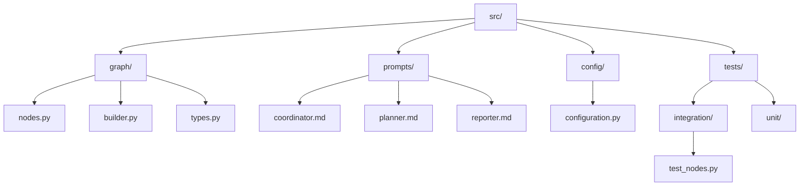
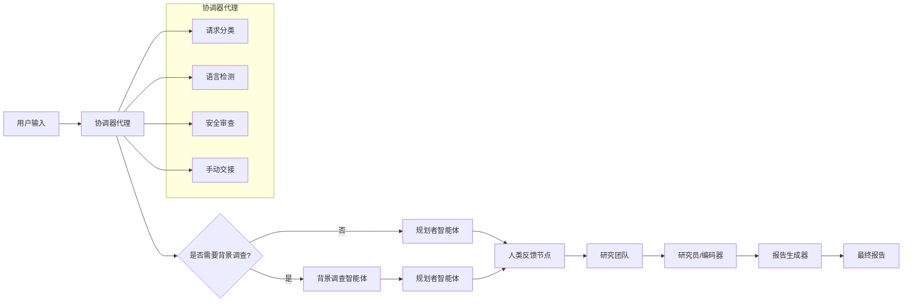
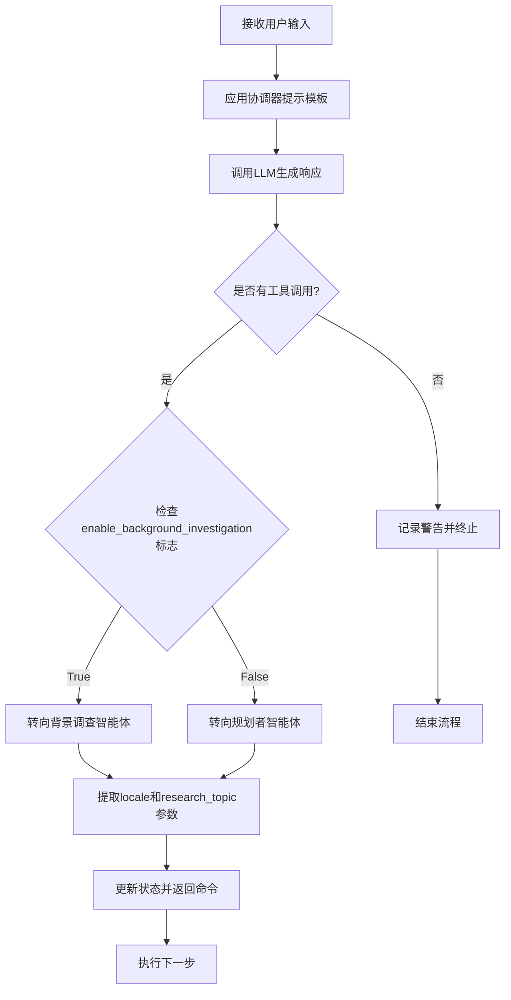
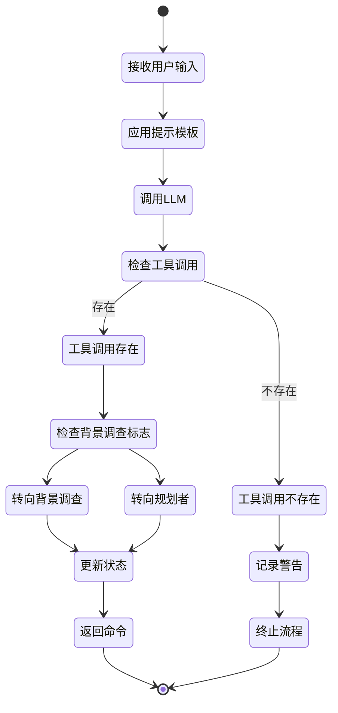
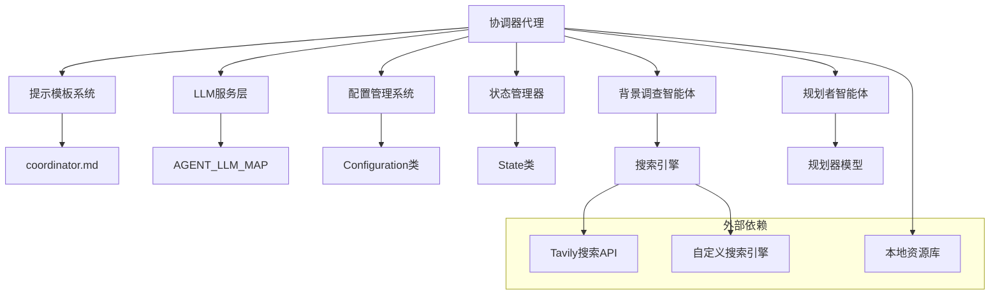

# 协调器代理

<cite>
**本文档引用的文件**
- [nodes.py](file://src/graph/nodes.py)
- [coordinator.md](file://src/prompts/coordinator.md)
- [configuration.py](file://src/config/configuration.py)
- [workflow.py](file://src/workflow.py)
- [types.py](file://src/graph/types.py)
- [planner_model.py](file://src/prompts/planner_model.py)
- [builder.py](file://src/graph/builder.py)
- [test_nodes.py](file://tests/integration/test_nodes.py)
</cite>

## 目录
1. [简介](#简介)
2. [项目结构](#项目结构)
3. [核心组件](#核心组件)
4. [架构概览](#架构概览)
5. [详细组件分析](#详细组件分析)
6. [依赖关系分析](#依赖关系分析)
7. [性能考虑](#性能考虑)
8. [故障排除指南](#故障排除指南)
9. [结论](#结论)

## 简介

协调器代理是DeerFlow多智能体系统的核心中枢，负责接收用户输入、启动工作流、管理智能体间通信和协调整体执行流程。作为系统的第一接触点，协调器代理扮演着关键的桥梁角色，确保用户请求能够被正确分类并转发给适当的下游智能体。

协调器代理的主要职责包括：
- 用户问候和闲聊处理
- 请求分类和安全审查
- 研究任务的手动交接
- 多语言支持和响应适配
- 智能体间通信协调

## 项目结构

协调器代理的代码组织遵循模块化设计原则，主要文件分布在以下目录结构中：



**图表来源**
- [nodes.py](file://src/graph/nodes.py#L1-L512)
- [builder.py](file://src/graph/builder.py#L1-L88)

**章节来源**
- [nodes.py](file://src/graph/nodes.py#L1-L512)
- [builder.py](file://src/graph/builder.py#L1-L88)

## 核心组件

### 协调器节点函数

协调器节点函数是整个系统的核心入口点，负责处理用户输入并决定下一步行动：

```python
def coordinator_node(
    state: State, config: RunnableConfig
) -> Command[Literal["planner", "background_investigator", "__end__"]]:
    """Coordinator node that communicate with customers."""
    logger.info("Coordinator talking.")
    configurable = Configuration.from_runnable_config(config)
    messages = apply_prompt_template("coordinator", state)
    response = (
        get_llm_by_type(AGENT_LLM_MAP["coordinator"])
        .bind_tools([handoff_to_planner])
        .invoke(messages)
    )
```

### 手把手到规划者工具

协调器代理通过`handoff_to_planner`工具与规划者智能体进行通信：

```python
@tool
def handoff_to_planner(
    research_topic: Annotated[str, "The topic of the research task to be handed off."],
    locale: Annotated[str, "The user's detected language locale (e.g., en-US, zh-CN)."],
):
    """Handoff to planner agent to do plan."""
    # This tool is not returning anything: we're just using it
    # as a way for LLM to signal that it needs to hand off to planner agent
    return
```

**章节来源**
- [nodes.py](file://src/graph/nodes.py#L195-L260)
- [nodes.py](file://src/graph/nodes.py#L36-L45)

## 架构概览

协调器代理在整个多智能体系统中处于核心地位，负责协调各个智能体之间的交互：



**图表来源**
- [builder.py](file://src/graph/builder.py#L35-L55)
- [nodes.py](file://src/graph/nodes.py#L195-L260)

## 详细组件分析

### 协调器节点实现逻辑

协调器节点的实现逻辑体现了其作为系统中枢的关键作用：



**图表来源**
- [nodes.py](file://src/graph/nodes.py#L195-L260)

### 提示模板变量详解

协调器提示模板中包含多个重要变量：

#### {CURRENT_TIME}
- **用途**: 提供当前时间信息，帮助LLM生成更相关和及时的响应
- **格式**: ISO 8601标准时间格式
- **示例**: "2024-01-15T10:30:00Z"

#### {messages}
- **用途**: 包含历史对话信息，用于上下文理解和连续性保持
- **内容**: 用户和系统之前的完整对话记录
- **格式**: 结构化的消息列表，包含角色、内容和时间戳

### 协调器处理人工反馈机制

协调器代理不仅处理自动化的工具调用，还支持人工反馈机制：

```python
try:
    for tool_call in response.tool_calls:
        if tool_call.get("name", "") != "handoff_to_planner":
            continue
        if tool_call.get("args", {}).get("locale") and tool_call.get(
            "args", {}
        ).get("research_topic"):
            locale = tool_call.get("args", {}).get("locale")
            research_topic = tool_call.get("args", {}).get("research_topic")
            break
except Exception as e:
    logger.error(f"Error processing tool calls: {e}")
```

### 状态管理和决策流程

协调器代理维护一个复杂的状态管理系统：



**图表来源**
- [nodes.py](file://src/graph/nodes.py#L195-L260)

**章节来源**
- [nodes.py](file://src/graph/nodes.py#L195-L260)
- [coordinator.md](file://src/prompts/coordinator.md#L1-L56)

### 错误处理和异常管理

协调器代理实现了完善的错误处理机制：

```python
try:
    # 尝试处理工具调用
    for tool_call in response.tool_calls:
        # 处理逻辑...
except Exception as e:
    logger.error(f"Error processing tool calls: {e}")
    # 继续执行，不抛出异常
```

这种设计确保了即使在处理工具调用时出现异常，系统仍能继续运行并返回合理的默认值。

**章节来源**
- [nodes.py](file://src/graph/nodes.py#L227-L240)
- [test_nodes.py](file://tests/integration/test_nodes.py#L666-L696)

## 依赖关系分析

协调器代理与系统中的其他组件有着复杂的依赖关系：



**图表来源**
- [nodes.py](file://src/graph/nodes.py#L195-L260)
- [configuration.py](file://src/config/configuration.py#L1-L71)

**章节来源**
- [nodes.py](file://src/graph/nodes.py#L1-L512)
- [configuration.py](file://src/config/configuration.py#L1-L71)

## 性能考虑

### 并发处理能力

协调器代理设计为异步处理模式，能够同时处理多个用户请求：

```python
async def run_agent_workflow_async(
    user_input: str,
    debug: bool = False,
    max_plan_iterations: int = 1,
    max_step_num: int = 3,
    enable_background_investigation: bool = True,
):
```

### 内存优化策略

系统采用流式处理和增量更新策略来优化内存使用：

- 使用`stream_mode="values"`进行增量输出
- 实现状态压缩和清理机制
- 限制最大计划迭代次数防止无限循环

### 缓存机制

协调器代理支持多种缓存策略：
- LLM响应缓存
- 搜索结果缓存
- 配置信息缓存

## 故障排除指南

### 常见问题诊断

#### 1. 协调器无工具调用响应
**症状**: 协调器返回空工具调用列表
**原因**: LLM未能识别研究请求
**解决方案**: 
- 检查提示模板配置
- 验证LLM模型设置
- 确认工具绑定正确

#### 2. 背景调查功能失效
**症状**: 即使启用背景调查标志也跳过该步骤
**原因**: 状态传递错误或配置问题
**解决方案**:
```python
# 确保状态中包含正确的标志
state["enable_background_investigation"] = True
```

#### 3. 语言检测失败
**症状**: 响应语言与预期不符
**原因**: locale参数未正确传递
**解决方案**:
- 检查工具调用参数
- 验证状态更新逻辑
- 确认提示模板中的语言处理

### 调试技巧

1. **启用调试日志**:
```python
def enable_debug_logging():
    logging.getLogger("src").setLevel(logging.DEBUG)
```

2. **监控状态变化**:
```python
logger.debug(f"Current state messages: {state['messages']}")
```

3. **验证工具调用**:
```python
logger.debug(f"Coordinator response: {response}")
```

**章节来源**
- [workflow.py](file://src/workflow.py#L25-L103)
- [nodes.py](file://src/graph/nodes.py#L227-L240)

## 结论

协调器代理作为DeerFlow多智能体系统的核心组件，成功地实现了以下目标：

### 主要成就

1. **高效的请求分类**: 准确区分简单问候、研究请求和不当请求
2. **灵活的路由机制**: 根据系统状态动态选择最佳路径
3. **强大的错误处理**: 确保系统稳定性即使在异常情况下
4. **多语言支持**: 提供无缝的国际化用户体验

### 技术优势

- **模块化设计**: 清晰的职责分离和可扩展架构
- **异步处理**: 支持高并发用户请求
- **状态管理**: 完善的状态跟踪和恢复机制
- **配置灵活性**: 支持运行时参数调整

### 未来发展方向

1. **增强学习能力**: 引入强化学习优化决策过程
2. **性能优化**: 进一步提升响应速度和吞吐量
3. **监控改进**: 加强系统健康监控和告警机制
4. **用户体验**: 提供更直观的交互界面和反馈机制

协调器代理的设计充分体现了现代AI系统架构的最佳实践，为构建复杂、可靠的多智能体协作系统提供了优秀的参考范例。