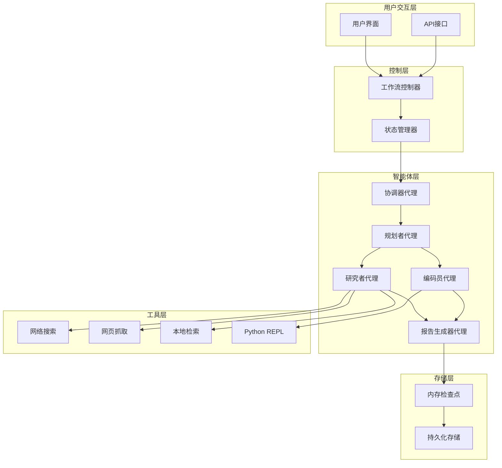
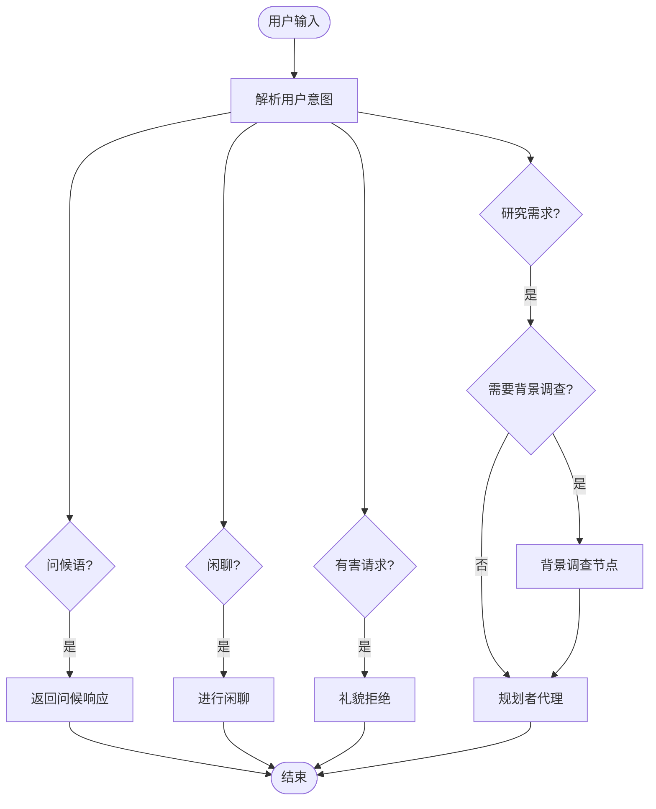
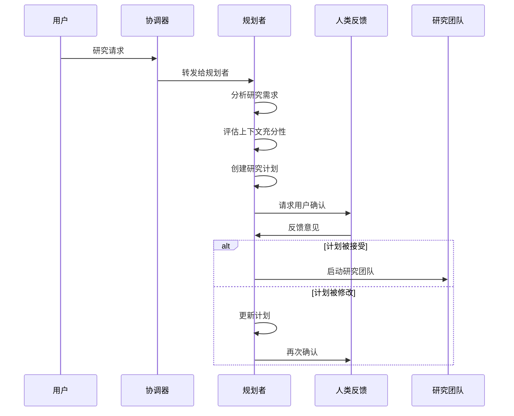
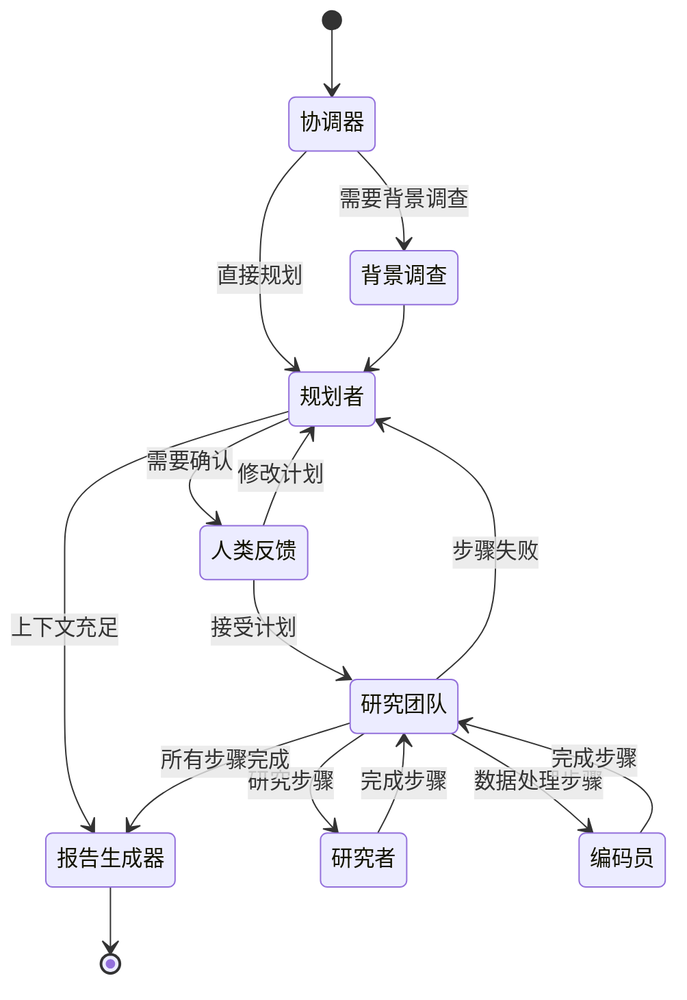
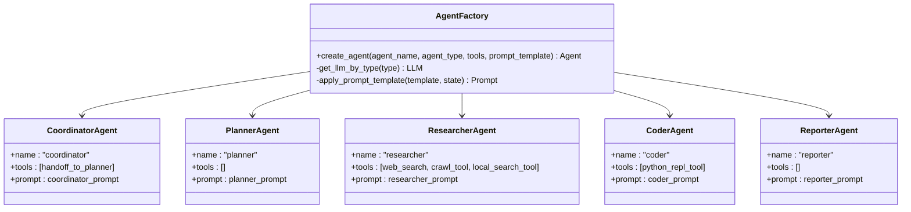
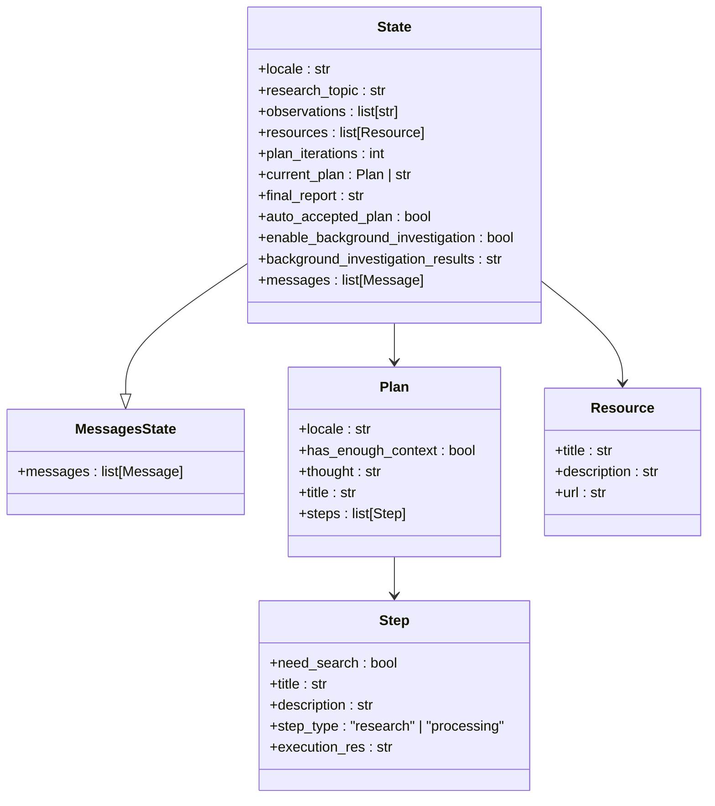
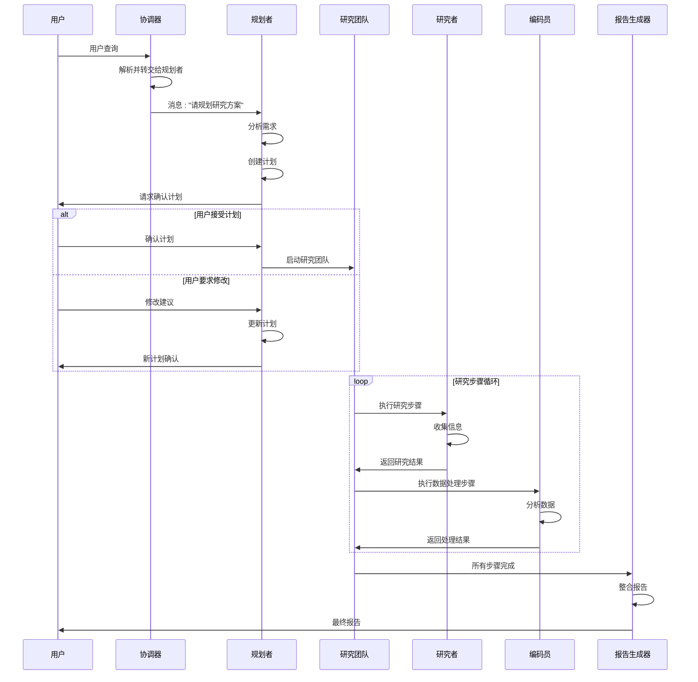
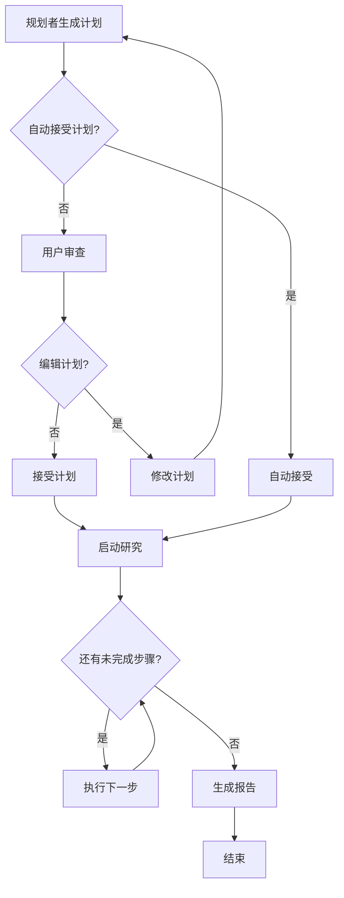
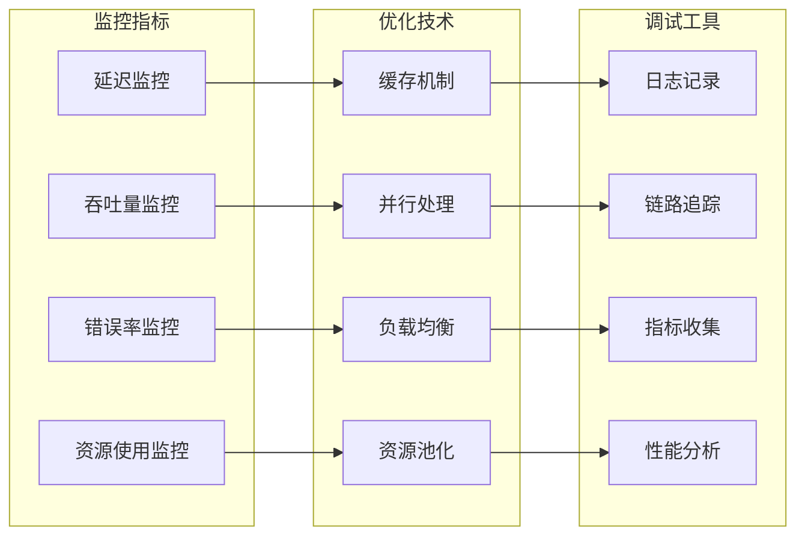
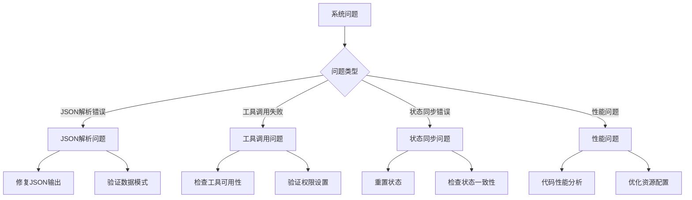

# DeerFlow多智能体系统设计

<cite>
**本文档中引用的文件**
- [workflow.py](file://src/workflow.py)
- [builder.py](file://src/graph/builder.py)
- [types.py](file://src/graph/types.py)
- [nodes.py](file://src/graph/nodes.py)
- [agents.py](file://src/agents/agents.py)
- [coordinator.md](file://src/prompts/coordinator.md)
- [planner.md](file://src/prompts/planner.md)
- [researcher.md](file://src/prompts/researcher.md)
- [coder.md](file://src/prompts/coder.md)
- [reporter.md](file://src/prompts/reporter.md)
</cite>

## 目录
1. [简介](#简介)
2. [系统架构概览](#系统架构概览)
3. [核心智能体职责划分](#核心智能体职责划分)
4. [基于LangGraph的状态机设计](#基于langgraph的状态机设计)
5. [智能体创建工厂模式](#智能体创建工厂模式)
6. [智能体状态管理](#智能体状态管理)
7. [智能体间消息传递机制](#智能体间消息传递机制)
8. [人工干预与反馈循环](#人工干预与反馈循环)
9. [性能优化与调试技巧](#性能优化与调试技巧)
10. [故障排除指南](#故障排除指南)
11. [总结](#总结)

## 简介

DeerFlow是一个先进的多智能体协作系统，旨在通过协调不同专业领域的智能体来完成复杂的深度研究任务。该系统采用基于LangGraph的状态机架构，实现了协调器代理、规划者代理、研究者代理、编码员代理和报告生成器代理之间的高效协作。

系统的核心设计理念是将复杂的研究任务分解为多个专业化步骤，每个智能体专注于其擅长的领域，通过明确的职责分工和标准化的通信协议实现高效的团队协作。

## 系统架构概览

DeerFlow采用分层架构设计，包含以下主要组件：



**图表来源**
- [workflow.py](file://src/workflow.py#L1-L104)
- [builder.py](file://src/graph/builder.py#L1-L88)

## 核心智能体职责划分

### 协调器代理 (Coordinator Agent)

协调器代理负责与用户的初始交互，识别请求类型并决定后续流程：



**图表来源**
- [coordinator.md](file://src/prompts/coordinator.md#L1-L56)
- [nodes.py](file://src/graph/nodes.py#L180-L230)

### 规划者代理 (Planner Agent)

规划者代理负责将用户需求分解为具体的研究步骤：



**图表来源**
- [planner.md](file://src/prompts/planner.md#L1-L188)
- [nodes.py](file://src/graph/nodes.py#L80-L150)

### 研究者代理 (Researcher Agent)

研究者代理专门负责信息收集和资料整理：

**核心功能：**
- 执行网络搜索和网页抓取
- 从本地知识库检索信息
- 综合多种信息源
- 生成结构化的研究报告

### 编码员代理 (Coder Agent)

编码员代理专注于数据分析和编程任务：

**核心功能：**
- 执行Python数据分析
- 进行数学计算和统计分析
- 处理数据可视化
- 实现算法和模型

### 报告生成器代理 (Reporter Agent)

报告生成器代理负责最终报告的撰写和格式化：

**核心功能：**
- 整合所有研究结果
- 按照指定格式生成报告
- 添加引用和参考文献
- 生成美观的排版输出

**章节来源**
- [coordinator.md](file://src/prompts/coordinator.md#L1-L56)
- [planner.md](file://src/prompts/planner.md#L1-L188)
- [researcher.md](file://src/prompts/researcher.md#L1-L87)
- [coder.md](file://src/prompts/coder.md#L1-L35)
- [reporter.md](file://src/prompts/reporter.md#L1-L280)

## 基于LangGraph的状态机设计

### 状态图架构



**图表来源**
- [builder.py](file://src/graph/builder.py#L25-L50)
- [nodes.py](file://src/graph/nodes.py#L25-L45)

### 条件边处理逻辑

系统使用条件边来动态决定智能体间的流转：

```python
def continue_to_running_research_team(state: State):
    current_plan = state.get("current_plan")
    if not current_plan or not current_plan.steps:
        return "planner"

    if all(step.execution_res for step in current_plan.steps):
        return "planner"

    # 查找第一个未完成的步骤
    incomplete_step = None
    for step in current_plan.steps:
        if not step.execution_res:
            incomplete_step = step
            break

    if not incomplete_step:
        return "planner"

    if incomplete_step.step_type == StepType.RESEARCH:
        return "researcher"
    if incomplete_step.step_type == StepType.PROCESSING:
        return "coder"
    return "planner"
```

**章节来源**
- [builder.py](file://src/graph/builder.py#L25-L50)
- [nodes.py](file://src/graph/nodes.py#L25-L45)

## 智能体创建工厂模式

### create_agent函数实现



**图表来源**
- [agents.py](file://src/agents/agents.py#L1-L20)
- [nodes.py](file://src/graph/nodes.py#L450-L512)

### 工厂函数设计

```python
def create_agent(agent_name: str, agent_type: str, tools: list, prompt_template: str):
    """工厂函数，用于创建具有统一配置的智能体。"""
    return create_react_agent(
        name=agent_name,
        model=get_llm_by_type(AGENT_LLM_MAP[agent_type]),
        tools=tools,
        prompt=lambda state: apply_prompt_template(prompt_template, state),
    )
```

这种工厂模式的优势：
- **一致性**：确保所有智能体使用相同的LLM配置
- **可扩展性**：易于添加新的智能体类型
- **维护性**：集中管理智能体配置
- **灵活性**：支持不同的工具组合和提示模板

**章节来源**
- [agents.py](file://src/agents/agents.py#L1-L20)
- [nodes.py](file://src/graph/nodes.py#L450-L512)

## 智能体状态管理

### State数据结构设计



**图表来源**
- [types.py](file://src/graph/types.py#L1-L25)

### 状态流转机制

状态管理遵循以下原则：

1. **继承MessagesState**：扩展基础消息状态
2. **运行时变量**：包含计划迭代次数、当前计划等
3. **状态持久化**：支持检查点机制保存中间状态
4. **类型安全**：使用Pydantic模型确保数据完整性

**章节来源**
- [types.py](file://src/graph/types.py#L1-L25)

## 智能体间消息传递机制

### 消息流架构



**图表来源**
- [nodes.py](file://src/graph/nodes.py#L180-L280)
- [nodes.py](file://src/graph/nodes.py#L350-L450)

### 消息传递协议

1. **标准化消息格式**：所有智能体使用统一的消息结构
2. **工具调用机制**：支持智能体间的功能调用
3. **状态同步**：确保所有智能体访问最新的共享状态
4. **错误传播**：异常情况下的状态回滚和错误通知

**章节来源**
- [nodes.py](file://src/graph/nodes.py#L180-L280)
- [nodes.py](file://src/graph/nodes.py#L350-L450)

## 人工干预与反馈循环

### 反馈机制设计



**图表来源**
- [nodes.py](file://src/graph/nodes.py#L150-L200)

### 人工干预点

系统在以下关键节点提供人工干预机会：

1. **计划确认阶段**：用户可以审查和修改规划者生成的计划
2. **研究步骤执行**：研究人员可以提供额外指导或修正
3. **报告生成阶段**：用户可以对最终报告提出修改意见

### 反馈循环处理

```python
def human_feedback_node(state) -> Command[Literal["planner", "research_team", "reporter", "__end__"]]:
    current_plan = state.get("current_plan", "")
    auto_accepted_plan = state.get("auto_accepted_plan", False)
    
    if not auto_accepted_plan:
        feedback = interrupt("Please Review the Plan.")
        
        if feedback and str(feedback).upper().startswith("[EDIT_PLAN]"):
            return Command(update={"messages": [HumanMessage(content=feedback, name="feedback")]}, goto="planner")
        elif feedback and str(feedback).upper().startswith("[ACCEPTED]"):
            logger.info("Plan is accepted by user.")
        else:
            raise TypeError(f"Interrupt value of {feedback} is not supported.")
    
    return Command(goto="research_team")
```

**章节来源**
- [nodes.py](file://src/graph/nodes.py#L150-L200)

## 性能优化与调试技巧

### 性能监控策略



### 调试技巧

1. **启用调试日志**：
```python
def enable_debug_logging():
    """启用调试级别日志以获取更详细的执行信息。"""
    logging.getLogger("src").setLevel(logging.DEBUG)
```

2. **状态检查点**：
```python
# 在关键节点保存状态检查点
last_message_cnt = 0
async for s in graph.astream(input=initial_state, config=config, stream_mode="values"):
    if isinstance(s, dict) and "messages" in s:
        if len(s["messages"]) <= last_message_cnt:
            continue
        last_message_cnt = len(s["messages"])
        # 处理状态更新
```

3. **递归限制管理**：
```python
try:
    env_value_str = os.getenv("AGENT_RECURSION_LIMIT", str(default_recursion_limit))
    parsed_limit = int(env_value_str)
    
    if parsed_limit > 0:
        recursion_limit = parsed_limit
    else:
        recursion_limit = default_recursion_limit
except ValueError:
    recursion_limit = default_recursion_limit
```

### 性能优化建议

1. **并发执行**：对于独立的研究步骤，考虑并行执行以提高效率
2. **智能缓存**：对重复的搜索结果和计算结果进行缓存
3. **资源池化**：复用LLM连接和工具实例
4. **渐进式加载**：按需加载大型模型和工具

**章节来源**
- [workflow.py](file://src/workflow.py#L15-L30)
- [nodes.py](file://src/graph/nodes.py#L400-L450)

## 故障排除指南

### 常见问题诊断



### 诊断工具和方法

1. **日志分析**：
```python
logger.error(f"Error processing stream output: {e}")
print(f"Error processing output: {str(e)}")
```

2. **状态验证**：
```python
# 检查状态完整性
if not current_plan or not current_plan.steps:
    return "planner"
```

3. **工具健康检查**：
```python
# 验证工具可用性
if not retriever_tool:
    logger.warning("Retriever tool not available")
```

### 错误恢复策略

1. **优雅降级**：当高级功能不可用时，使用基础功能
2. **状态回滚**：在错误情况下恢复到已知的良好状态
3. **重试机制**：对临时性错误实施指数退避重试
4. **人工介入**：在自动恢复失败时提供人工干预选项

**章节来源**
- [workflow.py](file://src/workflow.py#L80-L104)
- [nodes.py](file://src/graph/nodes.py#L150-L200)

## 总结

DeerFlow多智能体系统通过精心设计的架构实现了高效的智能体协作。系统的主要优势包括：

1. **清晰的职责分离**：每个智能体专注于特定领域，提高了专业性和效率
2. **灵活的状态管理**：基于LangGraph的状态机提供了强大的流程控制能力
3. **标准化的通信协议**：统一的消息格式和工具调用机制确保了系统的可靠性
4. **人性化的交互设计**：提供多级人工干预机会，平衡了自动化和可控性
5. **完善的监控和调试机制**：支持性能优化和问题诊断

该系统为复杂研究任务的自动化处理提供了完整的解决方案，适用于学术研究、商业分析、市场调研等多个领域。通过持续的优化和扩展，DeerFlow有望成为智能体协作领域的标杆系统。