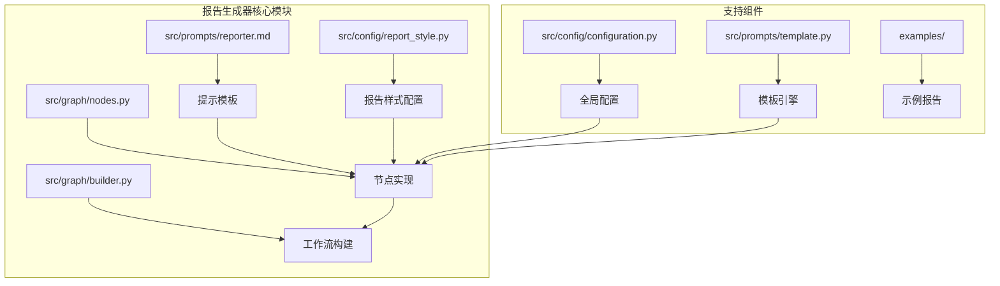
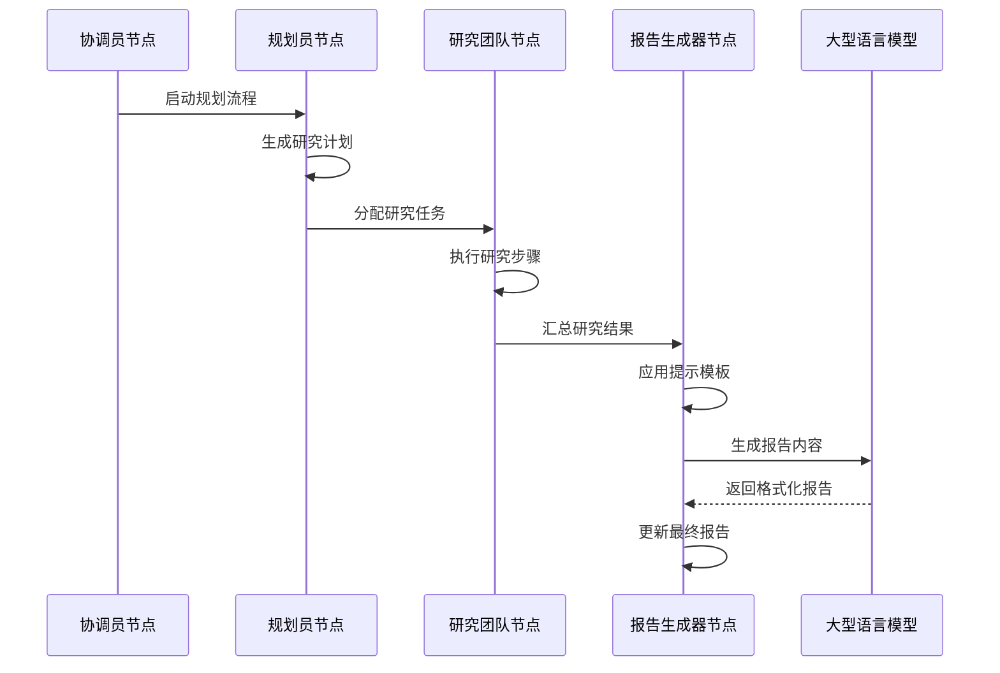
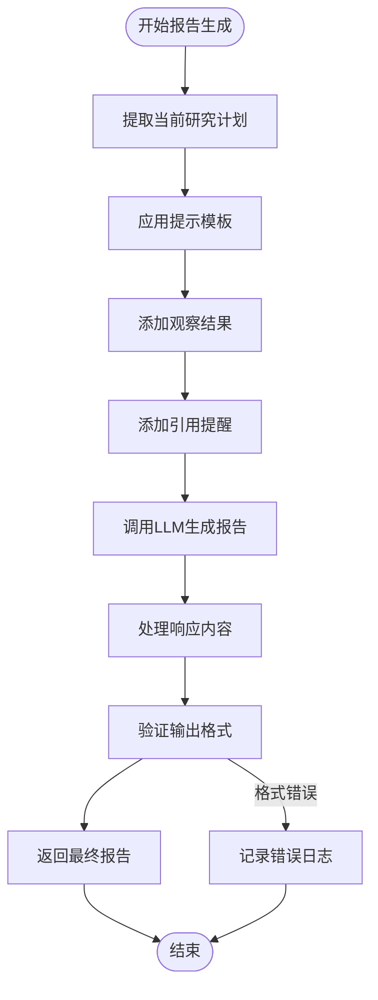
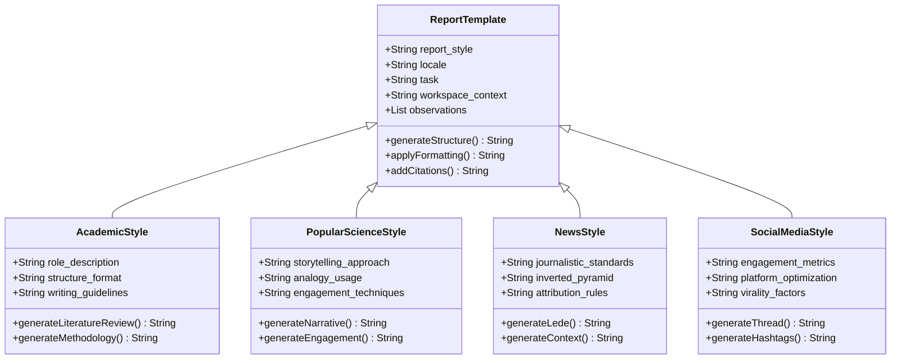
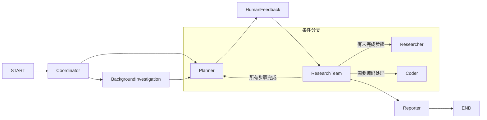
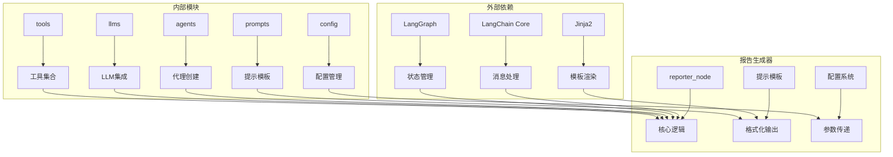

# 报告生成器代理

<cite>
**本文档中引用的文件**
- [reporter.md](file://src/prompts/reporter.md)
- [nodes.py](file://src/graph/nodes.py)
- [builder.py](file://src/graph/builder.py)
- [report_style.py](file://src/config/report_style.py)
- [configuration.py](file://src/config/configuration.py)
- [template.py](file://src/prompts/template.py)
- [openai_sora_report.md](file://examples/openai_sora_report.md)
- [test_nodes.py](file://tests/integration/test_nodes.py)
- [test_template.py](file://tests/integration/test_template.py)
</cite>

## 目录
1. [简介](#简介)
2. [项目结构](#项目结构)
3. [核心组件](#核心组件)
4. [架构概览](#架构概览)
5. [详细组件分析](#详细组件分析)
6. [依赖关系分析](#依赖关系分析)
7. [性能考虑](#性能考虑)
8. [故障排除指南](#故障排除指南)
9. [结论](#结论)

## 简介

报告生成器代理是deer-flow框架中的核心组件，负责将分散的研究发现整合为连贯的叙述性报告。该系统通过智能整合研究结果、语言润色和格式化输出，为用户提供高质量的专业报告。报告生成器代理支持多种报告风格，包括学术论文、科普文章、新闻报道和社会媒体内容，并能够根据不同的输出需求生成简洁摘要或详细分析。

## 项目结构

报告生成器代理的代码结构遵循模块化设计原则，主要组件分布在以下目录中：



**图表来源**
- [reporter.md](file://src/prompts/reporter.md#L1-L280)
- [nodes.py](file://src/graph/nodes.py#L1-L512)
- [builder.py](file://src/graph/builder.py#L1-L88)

**章节来源**
- [reporter.md](file://src/prompts/reporter.md#L1-L280)
- [nodes.py](file://src/graph/nodes.py#L1-L512)
- [builder.py](file://src/graph/builder.py#L1-L88)

## 核心组件

### 报告生成器节点（reporter_node）

报告生成器节点是整个工作流的核心，负责接收研究计划和观察结果，生成最终报告。该节点实现了以下关键功能：

1. **输入处理**：从状态中提取当前研究计划和观察结果
2. **提示模板应用**：根据报告样式和语言环境应用相应的提示模板
3. **LLM调用**：使用配置的大型语言模型生成报告内容
4. **输出格式化**：确保生成的报告符合预定义的结构和格式要求

### 提示模板系统

提示模板系统提供了灵活的报告生成框架，支持多种报告风格和语言环境：

- **学术风格**：正式、技术性强，注重文献综述和理论框架
- **科普风格**：生动有趣，使用比喻和类比解释复杂概念
- **新闻风格**：权威、客观，采用倒金字塔结构
- **社交媒体风格**：互动性强，适合移动端消费

### 报告样式配置

系统支持四种主要的报告样式，每种样式都有特定的语言特征和格式规范：

```python
class ReportStyle(enum.Enum):
    ACADEMIC = "academic"
    POPULAR_SCIENCE = "popular_science"
    NEWS = "news"
    SOCIAL_MEDIA = "social_media"
```

**章节来源**
- [nodes.py](file://src/graph/nodes.py#L250-L290)
- [report_style.py](file://src/config/report_style.py#L1-L9)

## 架构概览

报告生成器代理采用基于LangGraph的状态机架构，通过节点间的协作完成复杂的报告生成任务：



**图表来源**
- [builder.py](file://src/graph/builder.py#L30-L50)
- [nodes.py](file://src/graph/nodes.py#L250-L290)

## 详细组件分析

### 报告生成器节点实现

报告生成器节点的核心实现展示了其强大的内容整合能力：



**图表来源**
- [nodes.py](file://src/graph/nodes.py#L250-L290)

该节点的关键特性包括：

1. **动态提示模板应用**：根据报告样式和语言环境动态调整提示内容
2. **观察结果整合**：将多个研究步骤的结果整合到单个报告中
3. **格式约束**：强制执行Markdown表格、引用格式等结构化要求
4. **错误处理**：优雅处理LLM响应异常和格式验证失败

### 提示模板设计原则

报告生成器的提示模板采用了精心设计的结构化框架：



**图表来源**
- [reporter.md](file://src/prompts/reporter.md#L1-L280)
- [report_style.py](file://src/config/report_style.py#L1-L9)

### 工作流构建器

工作流构建器负责定义节点间的执行顺序和条件跳转：



**图表来源**
- [builder.py](file://src/graph/builder.py#L30-L50)

**章节来源**
- [nodes.py](file://src/graph/nodes.py#L250-L290)
- [builder.py](file://src/graph/builder.py#L30-L50)

### 质量控制机制

报告生成器内置了多层质量控制机制：

1. **事实核查**：通过观察结果验证报告内容的准确性
2. **逻辑一致性**：确保报告各部分之间的逻辑连贯性
3. **格式验证**：自动检查Markdown格式和引用规范
4. **内容完整性**：验证是否涵盖了所有必要的报告组成部分

### 自定义报告风格配置

系统支持灵活的报告风格定制：

```python
# 配置示例
{
    "report_style": "academic",  # 学术、科普、新闻、社交媒体
    "locale": "zh-CN",           # 语言环境
    "enable_deep_thinking": False, # 是否启用深度思考模式
    "max_search_results": 5,     # 最大搜索结果数量
    "resources": []              # 可用资源列表
}
```

**章节来源**
- [configuration.py](file://src/config/configuration.py#L1-L71)
- [reporter.md](file://src/prompts/reporter.md#L1-L280)

## 依赖关系分析

报告生成器代理的依赖关系展现了清晰的分层架构：



**图表来源**
- [nodes.py](file://src/graph/nodes.py#L1-L30)
- [template.py](file://src/prompts/template.py#L1-L68)

**章节来源**
- [nodes.py](file://src/graph/nodes.py#L1-L30)
- [template.py](file://src/prompts/template.py#L1-L68)

## 性能考虑

报告生成器代理在设计时充分考虑了性能优化：

1. **异步处理**：支持异步执行以提高并发性能
2. **缓存机制**：对重复的提示模板进行缓存
3. **资源限制**：通过递归限制防止无限循环
4. **内存管理**：合理管理状态对象的生命周期

## 故障排除指南

### 常见问题及解决方案

1. **LLM响应格式错误**
   - 检查提示模板中的格式要求
   - 验证JSON输出修复功能
   - 确认LLM配置正确

2. **报告结构不完整**
   - 检查观察结果是否正确传递
   - 验证提示模板变量替换
   - 确认报告样式配置

3. **语言环境设置错误**
   - 检查locale参数设置
   - 验证本地化模板可用性
   - 确认语言支持范围

**章节来源**
- [nodes.py](file://src/graph/nodes.py#L250-L290)
- [test_nodes.py](file://tests/integration/test_nodes.py#L751-L862)

## 结论

报告生成器代理是一个功能强大且设计精良的系统，它成功地解决了复杂研究数据整合和专业化报告生成的挑战。通过其模块化的架构、灵活的配置选项和强大的质量控制机制，该系统能够满足各种专业场景的需求。

系统的主要优势包括：
- **高度可配置性**：支持多种报告风格和语言环境
- **智能内容整合**：自动合并多个研究步骤的结果
- **严格的质量控制**：确保输出内容的准确性和一致性
- **优秀的扩展性**：易于添加新的报告样式和功能

未来的发展方向可能包括：
- 支持更多报告样式和领域特定格式
- 增强自然语言处理能力以改进内容质量
- 优化性能以支持更大规模的数据处理
- 扩展协作功能以支持多人编辑和审核流程