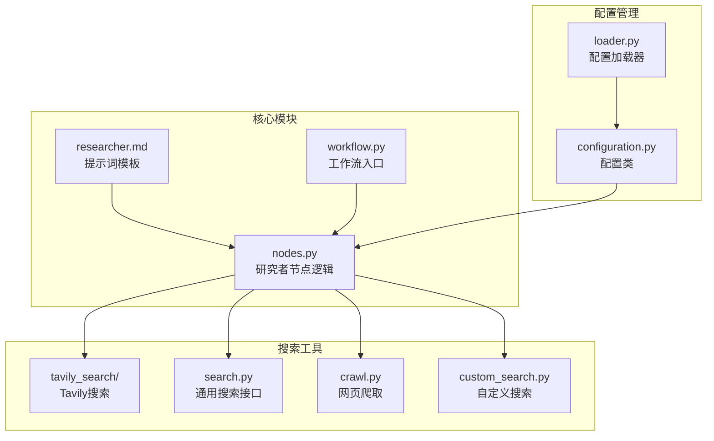
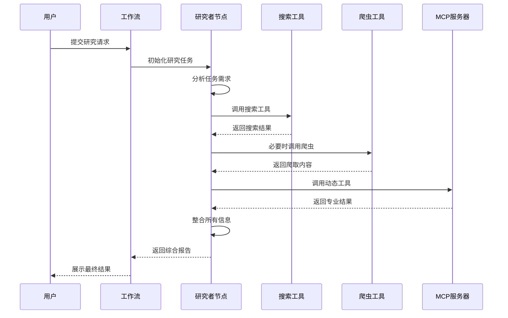
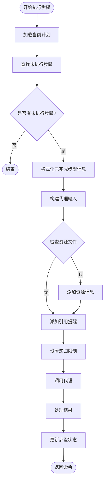
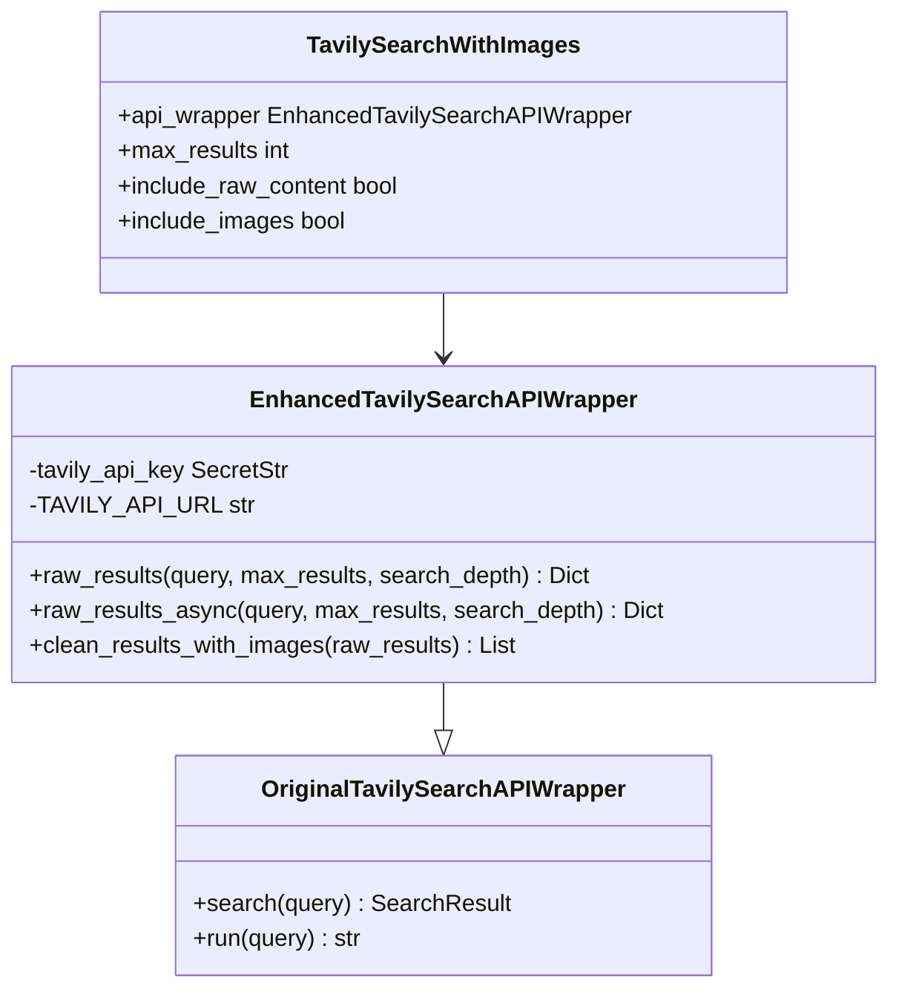
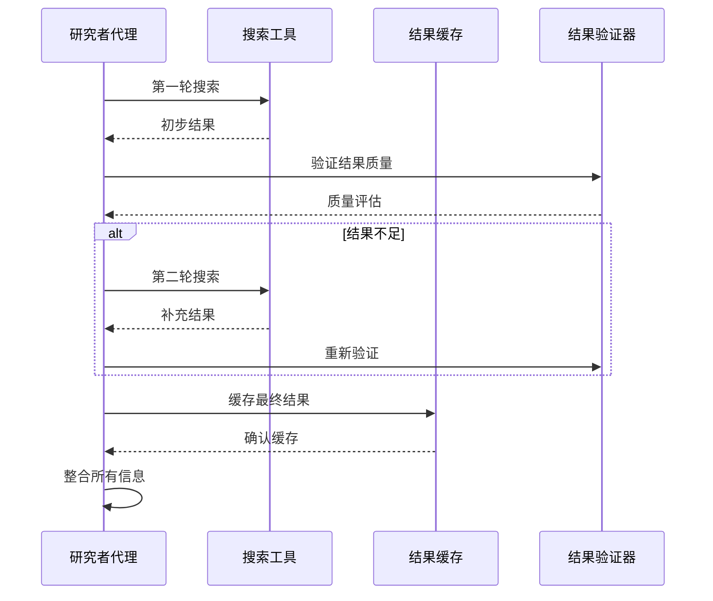
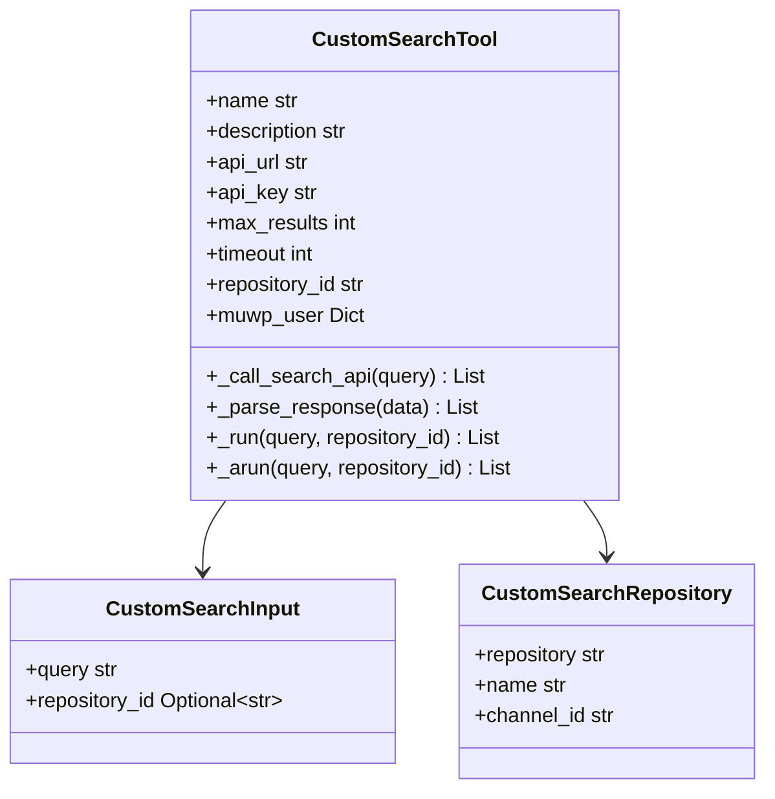
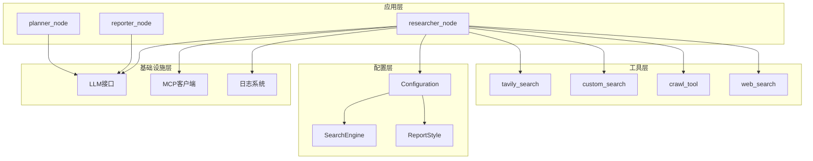

# 研究者代理

<cite>
**本文档引用的文件**
- [nodes.py](file://src/graph/nodes.py)
- [researcher.md](file://src/prompts/researcher.md)
- [tavily_search_api_wrapper.py](file://src/tools/tavily_search/tavily_search_api_wrapper.py)
- [search.py](file://src/tools/search.py)
- [crawl.py](file://src/tools/crawl.py)
- [custom_search.py](file://src/tools/custom_search.py)
- [configuration.py](file://src/config/configuration.py)
- [loader.py](file://src/config/loader.py)
- [workflow.py](file://src/workflow.py)
- [test_tavily_search_api_wrapper.py](file://tests/unit/tools/test_tavily_search_api_wrapper.py)
- [what_is_llm.md](file://examples/what_is_llm.md)
</cite>

## 目录
1. [简介](#简介)
2. [项目结构](#项目结构)
3. [核心组件](#核心组件)
4. [架构概览](#架构概览)
5. [详细组件分析](#详细组件分析)
6. [依赖关系分析](#依赖关系分析)
7. [性能考虑](#性能考虑)
8. [故障排除指南](#故障排除指南)
9. [结论](#结论)

## 简介

研究者代理是DeerFlow系统中的核心智能体，负责执行具体的搜索任务和信息收集工作。该代理通过调用多种搜索工具（包括Tavily、自定义搜索引擎等）来获取相关信息，并能够处理多轮搜索请求，评估和筛选搜索结果的质量。研究者代理具备强大的信息整合能力，能够在遇到信息不足时采用重试策略，并将收集到的信息格式化后传递给其他智能体。

## 项目结构

研究者代理的实现分布在多个模块中，形成了一个完整的搜索和信息收集生态系统：



**图表来源**
- [nodes.py](file://src/graph/nodes.py#L1-L512)
- [researcher.md](file://src/prompts/researcher.md#L1-L87)
- [workflow.py](file://src/workflow.py#L1-L104)

**章节来源**
- [nodes.py](file://src/graph/nodes.py#L1-L512)
- [workflow.py](file://src/workflow.py#L1-L104)

## 核心组件

### 研究者节点函数

研究者节点是整个搜索流程的核心控制器，负责协调各种搜索工具的使用：

```python
async def researcher_node(
    state: State, config: RunnableConfig
) -> Command[Literal["research_team"]]:
    """研究者节点，执行研究任务"""
    logger.info("研究者节点正在研究。")
    configurable = Configuration.from_runnable_config(config)
```

该函数的主要职责包括：
- **状态管理**：维护当前研究任务的状态信息
- **工具选择**：根据配置动态选择合适的搜索工具
- **执行控制**：协调搜索步骤的执行过程
- **结果处理**：将搜索结果格式化并传递给后续节点

### 搜索工具集成

研究者代理支持多种搜索工具的集成：

1. **Tavily搜索工具**：提供高级搜索功能，支持图像和原始内容
2. **自定义搜索引擎**：针对特定业务场景优化的搜索解决方案
3. **网页爬取工具**：用于深度抓取和内容提取
4. **其他通用搜索工具**：如DuckDuckGo、Brave Search等

**章节来源**
- [nodes.py](file://src/graph/nodes.py#L450-L512)
- [search.py](file://src/tools/search.py#L1-L114)

## 架构概览

研究者代理采用分层架构设计，确保了系统的可扩展性和维护性：



**图表来源**
- [nodes.py](file://src/graph/nodes.py#L287-L486)
- [workflow.py](file://src/workflow.py#L25-L70)

## 详细组件分析

### 研究者节点实现机制

研究者节点通过`_execute_agent_step`函数实现核心逻辑：



**图表来源**
- [nodes.py](file://src/graph/nodes.py#L300-L400)

### Tavily搜索工具实现

Tavily搜索工具提供了增强的功能集：



**图表来源**
- [tavily_search_api_wrapper.py](file://src/tools/tavily_search/tavily_search_api_wrapper.py#L1-L114)

### 多轮搜索请求处理

研究者代理能够处理复杂的多轮搜索场景：



**图表来源**
- [nodes.py](file://src/graph/nodes.py#L350-L400)

### 本地搜索工具集成

研究者代理支持本地知识库的搜索功能：



**图表来源**
- [custom_search.py](file://src/tools/custom_search.py#L1-L295)

**章节来源**
- [nodes.py](file://src/graph/nodes.py#L300-L486)
- [tavily_search_api_wrapper.py](file://src/tools/tavily_search/tavily_search_api_wrapper.py#L1-L114)
- [custom_search.py](file://src/tools/custom_search.py#L1-L295)

### 信息收集和数据验证

研究者代理实现了完善的信息收集和验证机制：

1. **查询构造**：根据任务需求动态生成搜索查询
2. **结果解析**：统一处理不同来源的搜索结果
3. **质量评估**：对搜索结果进行可信度和相关性评估
4. **去重处理**：避免重复信息的重复收集

### 重试策略和错误处理

系统实现了多层次的错误处理和重试机制：

```python
# 递归限制设置
default_recursion_limit = 25
try:
    env_value_str = os.getenv("AGENT_RECURSION_LIMIT", str(default_recursion_limit))
    parsed_limit = int(env_value_str)
    
    if parsed_limit > 0:
        recursion_limit = parsed_limit
    else:
        logger.warning(f"无效的递归限制值: {env_value_str}")
        recursion_limit = default_recursion_limit
except ValueError:
    logger.warning(f"解析递归限制值失败: {raw_env_value}")
    recursion_limit = default_recursion_limit
```

**章节来源**
- [nodes.py](file://src/graph/nodes.py#L350-L400)

## 依赖关系分析

研究者代理的依赖关系体现了清晰的分层架构：



**图表来源**
- [nodes.py](file://src/graph/nodes.py#L1-L512)
- [configuration.py](file://src/config/configuration.py#L1-L71)

**章节来源**
- [nodes.py](file://src/graph/nodes.py#L1-L512)
- [configuration.py](file://src/config/configuration.py#L1-L71)

## 性能考虑

### 搜索查询优化技巧

1. **参数调优**：合理设置搜索深度、结果数量等参数
2. **时间范围过滤**：利用时间参数提高搜索相关性
3. **域名过滤**：通过包含/排除域名提升结果质量
4. **多工具组合**：结合不同工具的优势获取更全面的信息

### 结果缓存策略

系统实现了智能的结果缓存机制：

- **短期缓存**：对于频繁访问的搜索结果进行短期缓存
- **长期存储**：将重要研究成果持久化存储
- **缓存失效**：基于时间戳和版本号的智能失效策略

### 并发处理优化

- **异步搜索**：支持并发执行多个搜索请求
- **资源池管理**：合理分配和回收系统资源
- **负载均衡**：在多个搜索服务间分配请求

## 故障排除指南

### 常见问题及解决方案

1. **搜索超时**
   - 增加超时时间设置
   - 检查网络连接状态
   - 使用备用搜索工具

2. **结果质量问题**
   - 调整搜索参数
   - 更换搜索工具
   - 启用结果验证机制

3. **工具配置错误**
   - 检查API密钥有效性
   - 验证配置文件格式
   - 确认环境变量设置

### 调试和监控

系统提供了完善的调试和监控功能：

```python
def enable_debug_logging():
    """启用调试级别日志记录以获取更详细的执行信息。"""
    logging.getLogger("src").setLevel(logging.DEBUG)
```

**章节来源**
- [nodes.py](file://src/graph/nodes.py#L350-L400)
- [workflow.py](file://src/workflow.py#L20-L25)

## 结论

研究者代理作为DeerFlow系统的核心组件，展现了高度的智能化和灵活性。通过精心设计的架构和丰富的工具集成，它能够高效地完成复杂的搜索任务，为用户提供高质量的信息服务。系统的模块化设计确保了良好的可维护性和可扩展性，而完善的错误处理和重试机制则保证了服务的可靠性。

未来的发展方向包括：
- 支持更多类型的搜索工具
- 优化搜索算法和结果排序
- 增强自然语言理解能力
- 扩展多语言支持