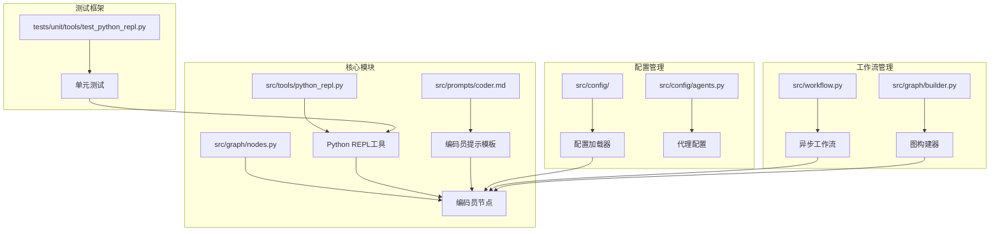
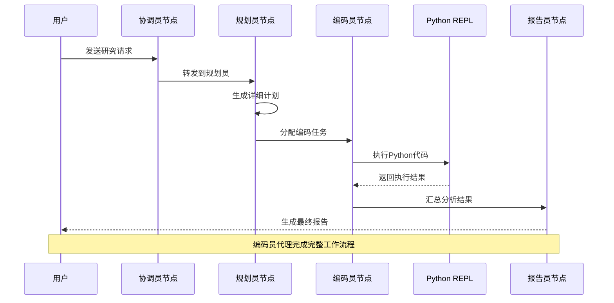
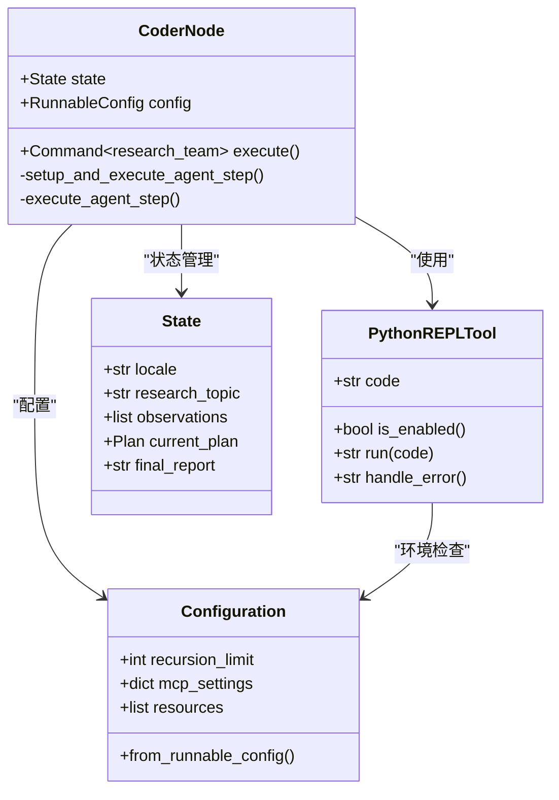
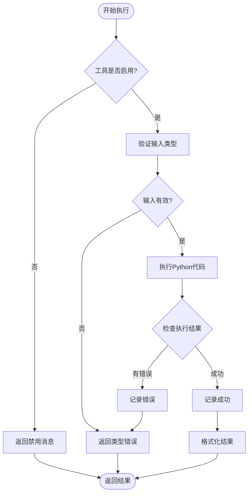
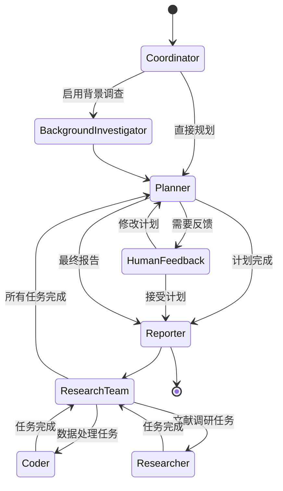
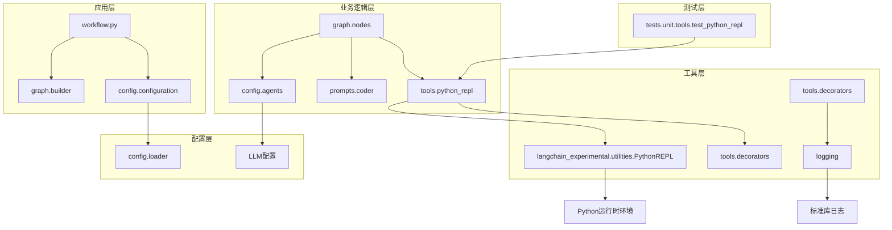

# 编码员代理

<cite>
**本文档中引用的文件**
- [src/tools/python_repl.py](file://src/tools/python_repl.py)
- [src/prompts/coder.md](file://src/prompts/coder.md)
- [src/graph/nodes.py](file://src/graph/nodes.py)
- [src/workflow.py](file://src/workflow.py)
- [src/config/configuration.py](file://src/config/configuration.py)
- [src/tools/decorators.py](file://src/tools/decorators.py)
- [tests/unit/tools/test_python_repl.py](file://tests/unit/tools/test_python_repl.py)
- [src/graph/builder.py](file://src/graph/builder.py)
- [src/graph/types.py](file://src/graph/types.py)
- [src/prompts/planner_model.py](file://src/prompts/planner_model.py)
- [src/config/agents.py](file://src/config/agents.py)
</cite>

## 目录
1. [简介](#简介)
2. [项目结构](#项目结构)
3. [核心组件](#核心组件)
4. [架构概览](#架构概览)
5. [详细组件分析](#详细组件分析)
6. [依赖关系分析](#依赖关系分析)
7. [性能考虑](#性能考虑)
8. [故障排除指南](#故障排除指南)
9. [结论](#结论)

## 简介

编码员代理（Coder Agent）是Deer Flow系统中的一个专业软件工程师角色，专门负责Python脚本分析、数据处理和计算问题解决。该代理能够安全地执行用户提供的或自动生成的Python代码，通过与Python REPL工具的深度集成，为用户提供强大的编程能力和数据分析功能。

编码员代理的核心职责包括：
- 分析需求并规划解决方案
- 使用Python实现高效的数据分析和算法
- 执行数学运算和统计分析
- 处理复杂的数据结构和算法实现
- 提供清晰的方法论和结果文档
- 确保代码执行的安全性和可靠性

## 项目结构

编码员代理系统采用模块化设计，主要组件分布在以下目录结构中：



**图表来源**
- [src/tools/python_repl.py](file://src/tools/python_repl.py#L1-L64)
- [src/prompts/coder.md](file://src/prompts/coder.md#L1-L35)
- [src/graph/nodes.py](file://src/graph/nodes.py#L1-L512)

**章节来源**
- [src/tools/python_repl.py](file://src/tools/python_repl.py#L1-L64)
- [src/prompts/coder.md](file://src/prompts/coder.md#L1-L35)
- [src/graph/nodes.py](file://src/graph/nodes.py#L1-L512)

## 核心组件

### Python REPL工具

Python REPL工具是编码员代理的核心执行引擎，提供了安全的代码执行环境：

```python
# 初始化REPL和日志记录器
repl: Optional[PythonREPL] = PythonREPL() if _is_python_repl_enabled() else None
logger = logging.getLogger(__name__)
```

该工具具有以下关键特性：
- **环境变量控制**：通过`ENABLE_PYTHON_REPL`环境变量启用或禁用
- **类型验证**：确保输入代码必须为字符串类型
- **错误处理**：捕获并处理所有异常情况
- **输出格式化**：提供标准化的结果输出格式

### 编码员提示模板

编码员提示模板定义了代理的行为规范和最佳实践：

```markdown
# 步骤

1. **分析需求**：仔细审查任务描述以理解目标、约束和预期结果
2. **规划解决方案**：确定任务是否需要Python，概述实现步骤
3. **实施解决方案**：
   - 使用Python进行数据分析、算法实现或问题求解
   - 使用`print(...)`打印输出以显示结果或调试值
4. **测试解决方案**：验证实现以确保满足要求并处理边缘情况
5. **记录方法论**：提供清晰的方法论解释，包括选择背后的推理和任何假设
6. **呈现结果**：清晰显示最终输出和任何中间结果

# 注意事项

- 始终确保解决方案高效且遵循最佳实践
- 优雅地处理边缘情况，如空文件或缺失输入
- 在代码中使用注释提高可读性和可维护性
- 如果要查看某个值的输出，必须使用`print(...)`
- 只能使用Python进行数学运算
- 始终使用`yfinance`获取金融市场数据
- 预安装的Python包：
  - `pandas`用于数据操作
  - `numpy`用于数值运算
  - `yfinance`用于金融市场数据
```

**章节来源**
- [src/tools/python_repl.py](file://src/tools/python_repl.py#L1-L64)
- [src/prompts/coder.md](file://src/prompts/coder.md#L1-L35)

## 架构概览

编码员代理采用基于LangGraph的状态机架构，通过节点间的消息传递实现协作式工作流程：



**图表来源**
- [src/graph/nodes.py](file://src/graph/nodes.py#L400-L512)
- [src/graph/builder.py](file://src/graph/builder.py#L1-L88)

## 详细组件分析

### 编码员节点实现

编码员节点是整个工作流程中的关键执行环节：



**图表来源**
- [src/graph/nodes.py](file://src/graph/nodes.py#L400-L512)
- [src/tools/python_repl.py](file://src/tools/python_repl.py#L25-L64)
- [src/config/configuration.py](file://src/config/configuration.py#L1-L71)

### Python REPL工具详细分析

Python REPL工具提供了安全的代码执行环境，具有以下核心功能：

#### 工具初始化和配置

```python
def _is_python_repl_enabled() -> bool:
    """从配置中检查Python REPL工具是否启用"""
    env_enabled = os.getenv("ENABLE_PYTHON_REPL", "false").lower()
    if env_enabled in ("true", "1", "yes", "on"):
        return True
    return False

# 初始化REPL和日志记录器
repl: Optional[PythonREPL] = PythonREPL() if _is_python_repl_enabled() else None
logger = logging.getLogger(__name__)
```

#### 安全的代码执行流程



**图表来源**
- [src/tools/python_repl.py](file://src/tools/python_repl.py#L13-L64)

#### 错误处理和异常管理

工具实现了多层次的错误处理机制：

1. **输入验证**：确保代码参数为字符串类型
2. **执行监控**：捕获BaseException异常
3. **结果检查**：识别并处理错误消息模式
4. **日志记录**：详细记录执行过程和错误信息

```python
try:
    result = repl.run(code)
    # 检查结果是否包含典型错误模式
    if isinstance(result, str) and ("Error" in result or "Exception" in result):
        logger.error(result)
        return f"Error executing code:\n```python\n{code}\n```\nError: {result}"
    logger.info("Code execution successful")
except BaseException as e:
    error_msg = repr(e)
    logger.error(error_msg)
    return f"Error executing code:\n```python\n{code}\n```\nError: {error_msg}"
```

**章节来源**
- [src/tools/python_repl.py](file://src/tools/python_repl.py#L1-L64)
- [tests/unit/tools/test_python_repl.py](file://tests/unit/tools/test_python_repl.py#L1-L223)

### 工作流集成和状态管理

编码员代理通过LangGraph框架与整个工作流系统集成：



**图表来源**
- [src/graph/builder.py](file://src/graph/builder.py#L25-L88)
- [src/graph/types.py](file://src/graph/types.py#L1-L25)

### MCP服务器集成

编码员代理支持通过MCP（Model Context Protocol）服务器扩展功能：

```python
# 提取MCP服务器配置
if configurable.mcp_settings:
    for server_name, server_config in configurable.mcp_settings["servers"].items():
        if (server_config["enabled_tools"] and 
            agent_type in server_config["add_to_agents"]):
            mcp_servers[server_name] = {
                k: v for k, v in server_config.items() 
                if k in ("transport", "command", "args", "url", "env", "headers")
            }
```

这种设计允许编码员代理：
- 动态加载外部工具和服务
- 支持多服务器配置
- 实现工具级别的权限控制
- 提供可扩展的功能架构

**章节来源**
- [src/graph/nodes.py](file://src/graph/nodes.py#L400-L512)
- [src/config/configuration.py](file://src/config/configuration.py#L1-L71)

## 依赖关系分析

编码员代理系统的依赖关系展现了清晰的分层架构：



**图表来源**
- [src/workflow.py](file://src/workflow.py#L1-L104)
- [src/graph/builder.py](file://src/graph/builder.py#L1-L88)
- [src/tools/python_repl.py](file://src/tools/python_repl.py#L1-L64)

### 关键依赖项

1. **LangChain生态系统**：
   - `langchain_core.tools`：工具接口定义
   - `langchain_experimental.utilities`：Python REPL实用程序
   - `langchain_mcp_adapters.client`：MCP客户端适配器

2. **Python标准库**：
   - `logging`：日志记录功能
   - `os`：环境变量访问
   - `typing`：类型注解支持

3. **第三方库**：
   - `pydantic`：数据验证和序列化
   - `langgraph`：状态机和工作流管理

**章节来源**
- [src/tools/python_repl.py](file://src/tools/python_repl.py#L1-L10)
- [src/graph/nodes.py](file://src/graph/nodes.py#L1-L25)

## 性能考虑

### 内存管理和资源限制

编码员代理系统实现了多层性能优化机制：

1. **递归限制配置**：
```python
def get_recursion_limit(default: int = 25) -> int:
    """从环境变量获取递归限制或使用默认值"""
    env_value_str = get_str_env("AGENT_RECURSION_LIMIT", str(default))
    parsed_limit = get_int_env("AGENT_RECURSION_LIMIT", default)
    
    if parsed_limit > 0:
        logger.info(f"Recursion limit set to: {parsed_limit}")
        return parsed_limit
    else:
        logger.warning(f"Invalid recursion limit value: {env_value_str}")
        return default
```

2. **代码执行超时控制**：
   - 通过Python REPL的内置超时机制
   - 配置化的执行时间限制
   - 异常情况下的自动恢复

3. **内存使用优化**：
   - 流式处理大型数据集
   - 及时释放不需要的对象引用
   - 使用生成器处理大数据流

### 并发处理能力

编码员代理支持异步执行模式：

```python
async def run_agent_workflow_async(
    user_input: str,
    debug: bool = False,
    max_plan_iterations: int = 1,
    max_step_num: int = 3,
    enable_background_investigation: bool = True,
):
    """以异步方式运行代理工作流"""
    # 异步流式处理
    async for s in graph.astream(
        input=initial_state, config=config, stream_mode="values"
    ):
        # 处理流式输出
        process_stream_output(s)
```

## 故障排除指南

### 常见问题和解决方案

#### 1. Python REPL工具未启用

**症状**：编码员节点返回"Tool disabled"消息

**原因**：环境变量`ENABLE_PYTHON_REPL`未设置或设置为false

**解决方案**：
```bash
export ENABLE_PYTHON_REPL=true
# 或者在配置文件中设置
```

#### 2. 代码执行失败

**症状**：返回"Error executing code"消息

**诊断步骤**：
1. 检查代码语法是否正确
2. 验证所需的Python包是否可用
3. 查看日志中的详细错误信息

**常见错误类型**：
- `NameError`：未定义的变量或函数
- `ImportError`：缺少必要的模块
- `SyntaxError`：代码语法错误
- `TimeoutError`：执行超时

#### 3. 性能问题

**症状**：代码执行缓慢或内存不足

**解决方案**：
1. 优化代码算法复杂度
2. 使用适当的数据结构
3. 实施分块处理大数据集
4. 调整递归限制设置

#### 4. 日志分析技巧

编码员代理提供了详细的日志记录功能：

```python
# 启用调试日志
def enable_debug_logging():
    """启用调试级别日志以获取更详细的执行信息"""
    logging.getLogger("src").setLevel(logging.DEBUG)

# 日志记录装饰器
@log_io
def python_repl_tool(code: str):
    """使用此工具执行python代码进行数据分析或计算"""
    # ... 实现细节
```

**章节来源**
- [src/tools/python_repl.py](file://src/tools/python_repl.py#L13-L64)
- [src/config/configuration.py](file://src/config/configuration.py#L15-L30)
- [src/tools/decorators.py](file://src/tools/decorators.py#L1-L82)

### 调试工具和实用方法

#### 1. 环境变量配置检查

```python
def _is_python_repl_enabled() -> bool:
    """检查Python REPL工具是否启用"""
    env_enabled = os.getenv("ENABLE_PYTHON_REPL", "false").lower()
    print(f"ENABLE_PYTHON_REPL: {env_enabled}")  # 调试输出
    return env_enabled in ("true", "1", "yes", "on")
```

#### 2. 代码执行跟踪

```python
@log_io
def python_repl_tool(code: str):
    """执行Python代码并记录详细执行信息"""
    logger.info(f"Executing Python code: {code[:100]}...")  # 截断长代码
    # ... 执行逻辑
    logger.info("Code execution successful")
```

#### 3. 状态监控

编码员代理通过状态对象跟踪执行进度：

```python
class State(MessagesState):
    """代理系统的状态，扩展MessagesState并添加next字段"""
    locale: str = "en-US"  # 用户语言环境
    research_topic: str = ""  # 研究主题
    observations: list[str] = []  # 观察结果列表
    resources: list[Resource] = []  # 可用资源
    plan_iterations: int = 0  # 规划迭代次数
    current_plan: Plan | str = None  # 当前计划
    final_report: str = ""  # 最终报告
    auto_accepted_plan: bool = False  # 是否自动接受计划
    enable_background_investigation: bool = True  # 是否启用背景调查
    background_investigation_results: str = None  # 背景调查结果
```

## 结论

编码员代理是Deer Flow系统中的一个强大而灵活的组件，它通过精心设计的架构和安全机制，为用户提供了专业的Python代码执行和数据分析能力。该系统的主要优势包括：

### 技术优势

1. **安全性优先**：通过环境变量控制和严格的输入验证确保代码执行安全
2. **可扩展性**：支持MCP服务器集成和动态工具加载
3. **可靠性**：完善的错误处理和异常恢复机制
4. **可观测性**：详细的日志记录和调试支持

### 应用价值

1. **数据分析**：支持复杂的数据处理和统计分析任务
2. **算法实现**：提供高效的算法开发和测试环境
3. **教育用途**：作为学习Python编程和数据科学的实践平台
4. **研究辅助**：为学术研究和数据分析提供技术支持

### 未来发展方向

1. **性能优化**：进一步提升代码执行效率和资源利用率
2. **功能扩展**：支持更多编程语言和工具集成
3. **安全增强**：加强代码沙箱隔离和恶意代码检测
4. **用户体验**：改进交互界面和结果可视化功能

编码员代理代表了现代AI代理系统的发展趋势，通过专业化分工和模块化设计，为用户提供了一个既强大又安全的编程环境。随着技术的不断进步，该系统将继续演进，为更广泛的应用场景提供支持。