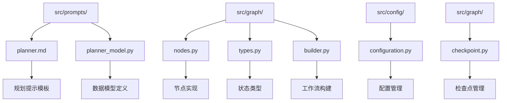
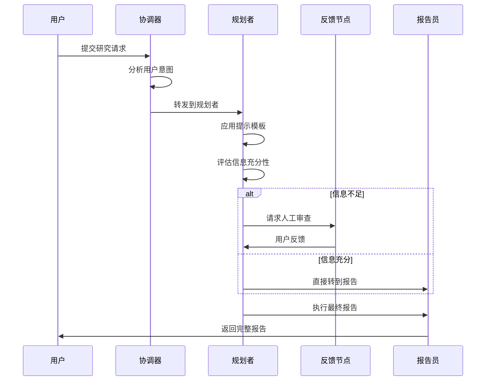
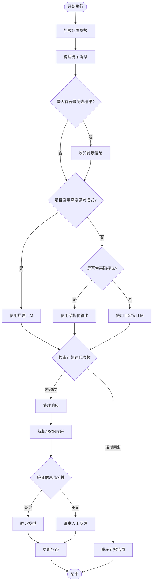
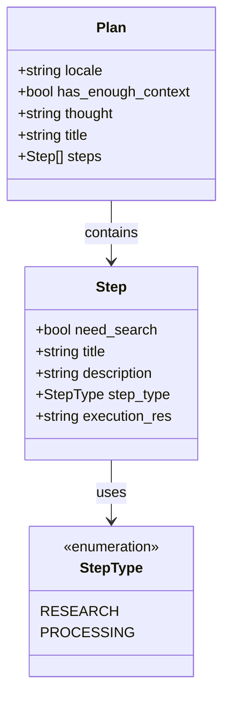
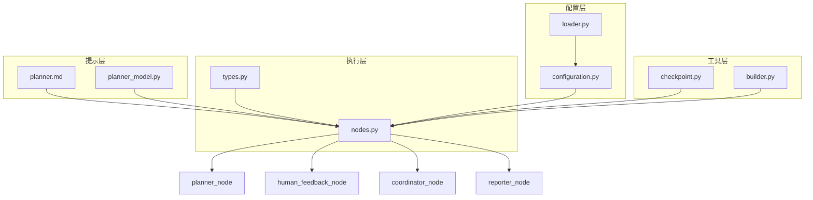

# 规划者代理

<cite>
**本文档中引用的文件**
- [planner.md](file://src/prompts/planner.md)
- [planner_model.py](file://src/prompts/planner_model.py)
- [nodes.py](file://src/graph/nodes.py)
- [types.py](file://src/graph/types.py)
- [configuration.py](file://src/config/configuration.py)
- [builder.py](file://src/graph/builder.py)
- [checkpoint.py](file://src/graph/checkpoint.py)
</cite>

## 目录
1. [简介](#简介)
2. [项目结构](#项目结构)
3. [核心组件](#核心组件)
4. [架构概览](#架构概览)
5. [详细组件分析](#详细组件分析)
6. [依赖关系分析](#依赖关系分析)
7. [性能考虑](#性能考虑)
8. [故障排除指南](#故障排除指南)
9. [结论](#结论)

## 简介

规划者代理是深度研究系统中的核心组件，负责根据用户查询和上下文生成结构化的研究计划。它通过复杂的推理过程将高层次的研究需求分解为具体、可执行的研究步骤，并确保最终报告的全面性和深度。

规划者代理的主要职责包括：
- 分析用户研究需求并评估现有信息的充分性
- 基于分析框架生成多层次的研究计划
- 将复杂问题分解为具体的子任务和研究步骤
- 协调与其他智能体的协作以完成研究目标
- 处理用户反馈并对计划进行迭代优化

## 项目结构

规划者代理相关的文件组织结构如下：



**图表来源**
- [planner.md](file://src/prompts/planner.md#L1-L188)
- [planner_model.py](file://src/prompts/planner_model.py#L1-L59)
- [nodes.py](file://src/graph/nodes.py#L1-L512)

**章节来源**
- [planner.md](file://src/prompts/planner.md#L1-L188)
- [planner_model.py](file://src/prompts/planner_model.py#L1-L59)
- [nodes.py](file://src/graph/nodes.py#L84-L156)

## 核心组件

### 规划提示模板 (planner.md)

规划提示模板是规划者代理的核心指导文件，定义了完整的规划原则和执行标准：

```python
# 关键特性
- 综合覆盖：涵盖主题的所有方面
- 充分深度：提供详细的数据点和事实
- 充足数量：收集丰富的相关信息
- 严格标准：应用严格的充足性判断标准
```

模板中定义了八个关键分析框架维度：
1. **历史背景**：收集时间线和演变数据
2. **当前状态**：获取最新数据点和现状
3. **未来指标**：收集预测和趋势数据
4. **利益相关者数据**：收集各方信息
5. **定量数据**：收集统计数据和指标
6. **定性数据**：收集非数值信息
7. **比较数据**：收集对比和基准数据
8. **风险数据**：收集潜在风险信息

### 数据模型 (planner_model.py)

规划者代理使用强类型的Pydantic模型来确保数据的一致性和验证：

```python
class StepType(str, Enum):
    RESEARCH = "research"
    PROCESSING = "processing"

class Step(BaseModel):
    need_search: bool
    title: str
    description: str
    step_type: StepType
    execution_res: Optional[str] = None

class Plan(BaseModel):
    locale: str
    has_enough_context: bool
    thought: str
    title: str
    steps: List[Step]
```

**章节来源**
- [planner.md](file://src/prompts/planner.md#L1-L188)
- [planner_model.py](file://src/prompts/planner_model.py#L1-L59)

## 架构概览

规划者代理在整体系统架构中扮演着关键的协调角色：



**图表来源**
- [nodes.py](file://src/graph/nodes.py#L84-L156)
- [builder.py](file://src/graph/builder.py#L30-L50)

## 详细组件分析

### planner_node 函数执行流程

`planner_node`函数是规划者代理的核心执行引擎，负责生成完整的研究计划：



**图表来源**
- [nodes.py](file://src/graph/nodes.py#L84-L156)

#### 关键执行逻辑

1. **配置加载与消息构建**：
```python
configurable = Configuration.from_runnable_config(config)
plan_iterations = state["plan_iterations"] if state.get("plan_iterations", 0) else 0
messages = apply_prompt_template("planner", state, configurable)
```

2. **背景信息集成**：
```python
if state.get("enable_background_investigation") and state.get("background_investigation_results"):
    messages += [{
        "role": "user",
        "content": "background investigation results of user query:\n" + 
                  state["background_investigation_results"] + "\n"
    }]
```

3. **LLM选择策略**：
```python
if configurable.enable_deep_thinking:
    llm = get_llm_by_type("reasoning")
elif AGENT_LLM_MAP["planner"] == "basic":
    llm = get_llm_by_type("basic").with_structured_output(Plan, method="json_mode")
else:
    llm = get_llm_by_type(AGENT_LLM_MAP["planner"])
```

4. **响应处理与验证**：
```python
try:
    curr_plan = json.loads(repair_json_output(full_response))
except json.JSONDecodeError:
    logger.warning("Planner response is not a valid JSON")
    if plan_iterations > 0:
        return Command(goto="reporter")
    else:
        return Command(goto="__end__")
```

### 规划提示模板设计原理

规划提示模板采用多层次的设计结构，包含以下关键元素：

#### 占位符系统

1. **{CURRENT_TIME}**：动态插入当前时间戳
2. **{max_step_num}**：限制最大步骤数
3. **{locale}**：指定语言环境
4. **{messages}**：包含对话历史
5. **{question}**：用户原始查询

#### 信息充分性评估标准

模板定义了严格的评估标准：

```python
# 充足条件（非常严格）
has_enough_context = true 的条件：
- 完全回答所有问题方面
- 包含具体细节
- 来源可靠且时效性强
- 没有显著空白或矛盾
- 数量足以支持综合报告

# 不足条件（默认假设）
has_enough_context = false 的条件：
- 部分或完全未回答的问题
- 信息过时、不完整或来源可疑
- 缺少关键数据点
- 缺乏替代观点或重要背景
- 任何合理的不确定性
```

#### 步骤类型区分



**图表来源**
- [planner_model.py](file://src/prompts/planner_model.py#L8-L35)

**章节来源**
- [nodes.py](file://src/graph/nodes.py#L84-L156)
- [planner.md](file://src/prompts/planner.md#L1-L188)
- [planner_model.py](file://src/prompts/planner_model.py#L1-L59)

### 人类反馈节点 (human_feedback_node)

人类反馈节点提供了用户与规划过程的交互接口：

```python
def human_feedback_node(state) -> Command[Literal["planner", "research_team", "reporter", "__end__"]]:
    current_plan = state.get("current_plan", "")
    auto_accepted_plan = state.get("auto_accepted_plan", False)
    
    if not auto_accepted_plan:
        feedback = interrupt("Please Review the Plan.")
        
        if feedback and str(feedback).upper().startswith("[EDIT_PLAN]"):
            return Command(update={"messages": [HumanMessage(content=feedback, name="feedback")]}, goto="planner")
        elif feedback and str(feedback).upper().startswith("[ACCEPTED]"):
            logger.info("Plan is accepted by user.")
        else:
            raise TypeError(f"Interrupt value of {feedback} is not supported.")
```

### 工作流构建器 (builder.py)

工作流构建器定义了整个研究流程的执行路径：

```python
def _build_base_graph():
    builder = StateGraph(State)
    builder.add_edge(START, "coordinator")
    builder.add_node("coordinator", coordinator_node)
    builder.add_node("background_investigator", background_investigation_node)
    builder.add_node("planner", planner_node)
    builder.add_node("reporter", reporter_node)
    builder.add_node("research_team", research_team_node)
    builder.add_node("researcher", researcher_node)
    builder.add_node("coder", coder_node)
    builder.add_node("human_feedback", human_feedback_node)
    
    builder.add_edge("background_investigator", "planner")
    builder.add_conditional_edges("research_team", continue_to_running_research_team, 
                                 ["planner", "researcher", "coder"])
    builder.add_edge("reporter", END)
    return builder
```

**章节来源**
- [nodes.py](file://src/graph/nodes.py#L158-L200)
- [builder.py](file://src/graph/builder.py#L30-L50)

## 依赖关系分析

规划者代理的依赖关系展现了清晰的模块化设计：



**图表来源**
- [nodes.py](file://src/graph/nodes.py#L1-L20)
- [types.py](file://src/graph/types.py#L1-L25)
- [configuration.py](file://src/config/configuration.py#L1-L71)

### 核心依赖关系

1. **提示模板依赖**：
   - planner.md → nodes.py (通过 apply_prompt_template)
   - planner_model.py → nodes.py (Plan 类型定义)

2. **配置依赖**：
   - configuration.py → nodes.py (Configuration 类)
   - loader.py → configuration.py (环境变量加载)

3. **状态管理依赖**：
   - types.py → nodes.py (State 类)
   - checkpoint.py → nodes.py (持久化存储)

**章节来源**
- [nodes.py](file://src/graph/nodes.py#L1-L20)
- [types.py](file://src/graph/types.py#L1-L25)
- [configuration.py](file://src/config/configuration.py#L1-L71)

## 性能考虑

### 计划生成超时机制

规划者代理实现了多层性能控制机制：

1. **迭代次数限制**：
```python
configurable = Configuration.from_runnable_config(config)
if plan_iterations >= configurable.max_plan_iterations:
    return Command(goto="reporter")
```

2. **递归限制**：
```python
try:
    env_value_str = os.getenv("AGENT_RECURSION_LIMIT", str(default_recursion_limit))
    parsed_limit = int(env_value_str)
    
    if parsed_limit > 0:
        recursion_limit = parsed_limit
    else:
        recursion_limit = default_recursion_limit
except ValueError:
    recursion_limit = default_recursion_limit
```

3. **内存管理**：
   - 使用流式处理减少内存占用
   - 实现检查点机制避免重复计算
   - 支持多种数据库后端（MongoDB、PostgreSQL）

### 复杂度控制

1. **最大步骤数限制**：
   - 默认值：3个步骤
   - 可配置：通过 `max_step_num` 参数
   - 确保计划聚焦且可执行

2. **搜索结果限制**：
   - 默认值：3个搜索结果
   - 可配置：通过 `max_search_results` 参数
   - 平衡质量和效率

3. **LLM选择策略**：
   - 基础模式：使用结构化输出提高效率
   - 自定义模式：支持高级推理能力
   - 深度思考模式：针对复杂问题

## 故障排除指南

### 常见问题及解决方案

1. **JSON解析错误**：
```python
try:
    curr_plan = json.loads(repair_json_output(full_response))
except json.JSONDecodeError:
    logger.warning("Planner response is not a valid JSON")
    if plan_iterations > 0:
        return Command(goto="reporter")
    else:
        return Command(goto="__end__")
```

**解决方案**：
- 检查LLM输出格式
- 启用修复机制
- 限制迭代次数

2. **计划迭代超限**：
```python
if plan_iterations >= configurable.max_plan_iterations:
    return Command(goto="reporter")
```

**解决方案**：
- 增加最大迭代次数
- 优化提示模板
- 检查输入质量

3. **LLM连接问题**：
```python
if configurable.enable_deep_thinking:
    llm = get_llm_by_type("reasoning")
elif AGENT_LLM_MAP["planner"] == "basic":
    llm = get_llm_by_type("basic").with_structured_output(Plan, method="json_mode")
else:
    llm = get_llm_by_type(AGENT_LLM_MAP["planner"])
```

**解决方案**：
- 检查LLM配置
- 验证API密钥
- 测试网络连接

### 调试规划逻辑的实用技巧

1. **日志记录**：
```python
logger.info(f"Planner generating full plan")
logger.debug(f"Current state messages: {state['messages']}")
logger.info(f"Planner response: {full_response}")
```

2. **状态监控**：
```python
logger.info(f"Plan iterations: {plan_iterations}")
logger.info(f"Max plan iterations: {configurable.max_plan_iterations}")
```

3. **响应验证**：
```python
logger.info(f"Planner response has enough context: {curr_plan.get('has_enough_context')}")
new_plan = Plan.model_validate(curr_plan)
```

**章节来源**
- [nodes.py](file://src/graph/nodes.py#L121-L156)
- [configuration.py](file://src/config/configuration.py#L15-L71)

## 结论

规划者代理作为深度研究系统的核心组件，通过精心设计的提示模板、强类型的数据模型和灵活的工作流架构，实现了高效、可靠的规划功能。其主要优势包括：

1. **结构化规划**：通过明确的步骤分解和类型区分，确保研究计划的系统性和可执行性
2. **智能评估**：基于严格的充足性标准，准确判断信息收集的完整性
3. **用户交互**：提供灵活的人工反馈机制，支持计划的迭代优化
4. **性能控制**：通过多层限制和优化策略，确保系统的稳定性和效率
5. **扩展性**：模块化设计支持多种LLM和配置选项，适应不同的应用场景

规划者代理的设计体现了现代AI系统工程的最佳实践，为构建高质量的深度研究系统奠定了坚实的基础。通过持续的优化和改进，该系统能够有效应对复杂的知识获取挑战，为用户提供全面、深入的研究成果。