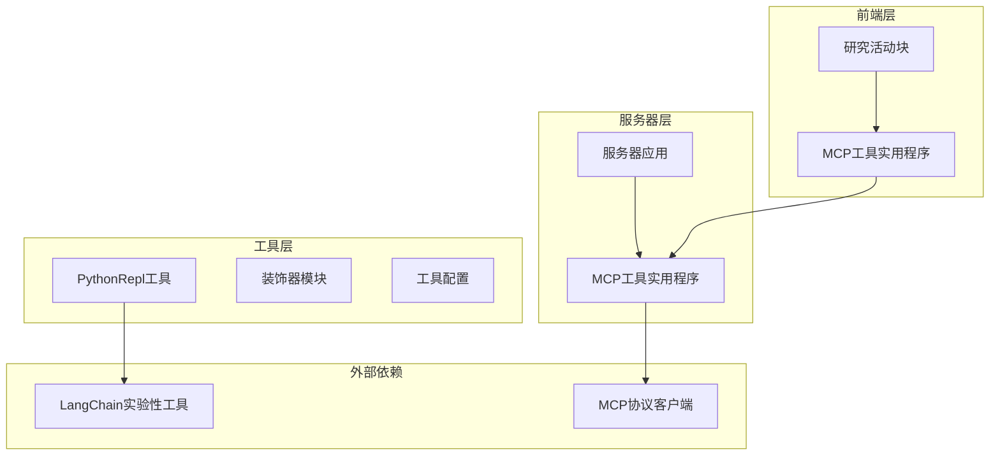
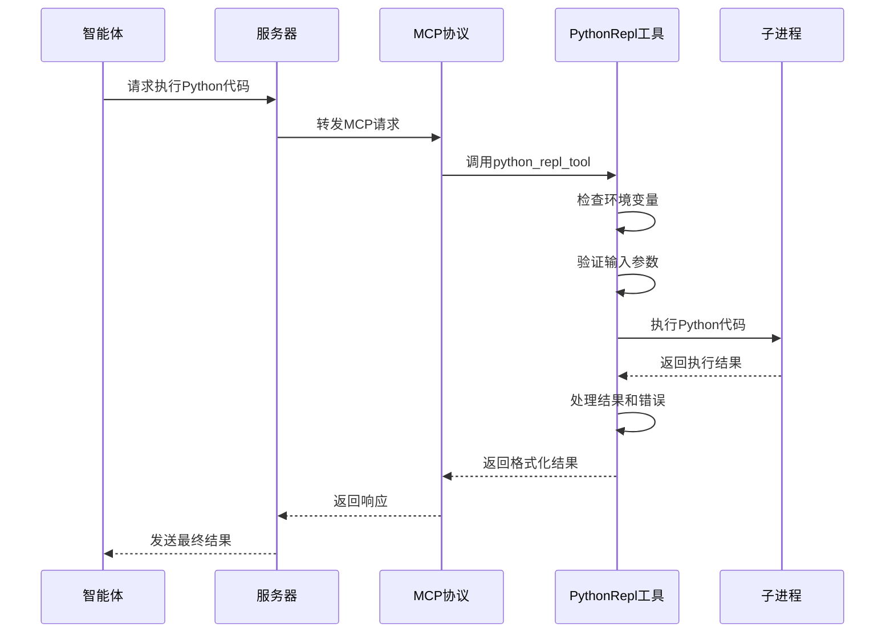
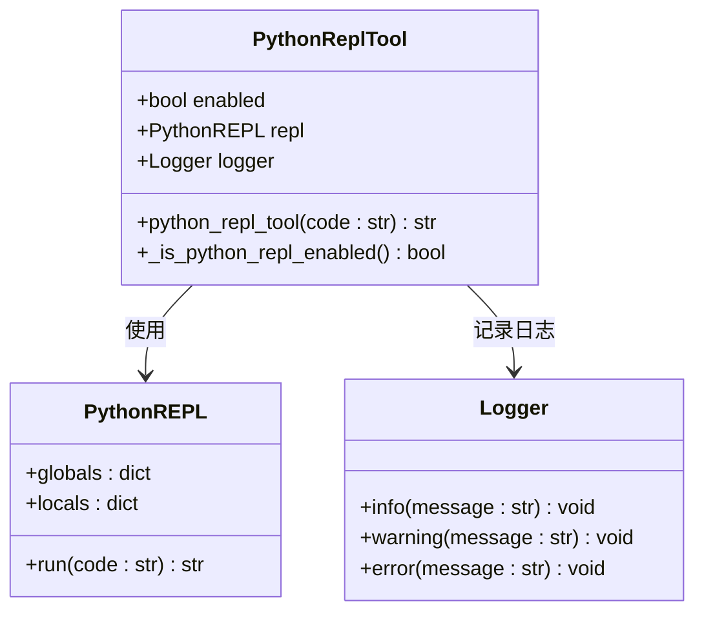
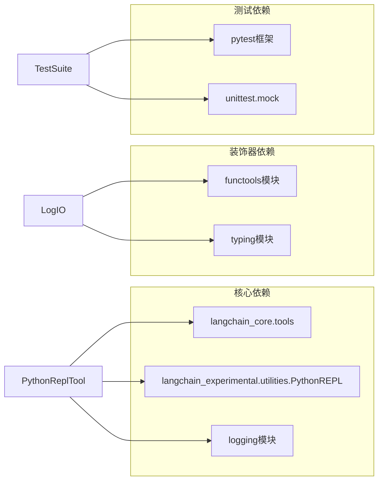

# Python REPL工具集成

<cite>
**本文档中引用的文件**
- [python_repl.py](file://src/tools/python_repl.py)
- [decorators.py](file://src/tools/decorators.py)
- [test_python_repl.py](file://tests/unit/tools/test_python_repl.py)
- [mcp_utils.py](file://src/server/mcp_utils.py)
- [app.py](file://src/server/app.py)
- [tools.py](file://src/config/tools.py)
- [research-activities-block.tsx](file://web/src/app/chat/components/research-activities-block.tsx)
- [utils.ts](file://web/src/core/mcp/utils.ts)
- [types.ts](file://web/src/core/mcp/types.ts)
</cite>

## 目录
1. [简介](#简介)
2. [项目结构](#项目结构)
3. [核心组件](#核心组件)
4. [架构概览](#架构概览)
5. [详细组件分析](#详细组件分析)
6. [依赖关系分析](#依赖关系分析)
7. [性能考虑](#性能考虑)
8. [故障排除指南](#故障排除指南)
9. [结论](#结论)

## 简介

deer-flow项目中的Python REPL工具是一个安全的代码执行环境，允许智能体在受控环境中执行Python代码。该工具通过MCP（Model Context Protocol）协议与智能体系统集成，提供了强大的数据处理、数学计算和算法验证能力，同时确保了严格的安全控制和错误处理机制。

Python REPL工具的核心设计理念是在保证安全性的同时，为用户提供灵活的编程能力。它采用环境变量配置启用/禁用机制，通过子进程隔离执行环境，并实现了完善的日志记录和异常处理系统。

## 项目结构

Python REPL工具在整个deer-flow项目中的组织结构如下：



**图表来源**
- [python_repl.py](file://src/tools/python_repl.py#L1-L64)
- [mcp_utils.py](file://src/server/mcp_utils.py#L1-L123)

**章节来源**
- [python_repl.py](file://src/tools/python_repl.py#L1-L64)
- [decorators.py](file://src/tools/decorators.py#L1-L82)

## 核心组件

### PythonRepl类

PythonRepl工具是整个系统的核心组件，它封装了Python代码执行的所有逻辑：

```python
# 初始化REPL和日志记录器
repl: Optional[PythonREPL] = PythonREPL() if _is_python_repl_enabled() else None
logger = logging.getLogger(__name__)
```

该组件具有以下关键特性：
- **条件初始化**：只有在环境变量启用时才创建REPL实例
- **类型安全**：使用注解确保参数类型正确
- **错误处理**：完善的异常捕获和错误消息格式化

### 安全执行机制

工具实现了多层安全控制：

1. **环境变量检查**：通过`ENABLE_PYTHON_REPL`环境变量控制工具启用状态
2. **输入验证**：确保传入的代码必须是字符串类型
3. **结果验证**：检测执行结果中的错误模式
4. **异常捕获**：捕获所有可能的异常并返回友好的错误消息

**章节来源**
- [python_repl.py](file://src/tools/python_repl.py#L15-L64)

## 架构概览

Python REPL工具的整体架构采用分层设计，确保了良好的可维护性和扩展性：



**图表来源**
- [python_repl.py](file://src/tools/python_repl.py#L25-L64)
- [mcp_utils.py](file://src/server/mcp_utils.py#L25-L123)

## 详细组件分析

### 工具函数分析

#### `_is_python_repl_enabled()` 函数

这个函数负责检查Python REPL工具是否启用：

```python
def _is_python_repl_enabled() -> bool:
    """Check if Python REPL tool is enabled from configuration."""
    # Check environment variable first
    env_enabled = os.getenv("ENABLE_PYTHON_REPL", "false").lower()
    if env_enabled in ("true", "1", "yes", "on"):
        return True
    return False
```

该函数支持多种启用值：
- `"true"`, `"1"`, `"yes"`, `"on"` - 视为启用
- 默认值 `"false"` - 视为禁用

```mermaid
flowchart TD
Start([开始检查]) --> GetEnv["获取环境变量<br/>ENABLE_PYTHON_REPL"]
GetEnv --> ConvertLower["转换为小写"]
ConvertLower --> CheckValues{"检查值"}
CheckValues --> |"true","1","yes","on"| Enable["启用工具"]
CheckValues --> |"false","0","no","off"| Disable["禁用工具"]
CheckValues --> |其他值| Default["使用默认值<br/>false"]
Enable --> ReturnTrue["返回True"]
Disable --> ReturnFalse["返回False"]
Default --> ReturnFalse
ReturnTrue --> End([结束])
ReturnFalse --> End
```

**图表来源**
- [python_repl.py](file://src/tools/python_repl.py#L11-L18)

#### `python_repl_tool()` 主函数

主函数实现了完整的工具执行流程：

```python
@tool
@log_io
def python_repl_tool(
    code: Annotated[
        str, "The python code to execute to do further analysis or calculation."
    ],
):
    """Use this to execute python code and do data analysis or calculation."""
```

该函数包含以下关键步骤：

1. **工具启用检查**：首先验证工具是否已启用
2. **输入验证**：确保输入是字符串类型
3. **代码执行**：通过REPL执行Python代码
4. **结果处理**：检查并格式化执行结果
5. **错误处理**：捕获并报告所有异常



**图表来源**
- [python_repl.py](file://src/tools/python_repl.py#L25-L64)

**章节来源**
- [python_repl.py](file://src/tools/python_repl.py#L11-L64)

### 装饰器系统分析

#### `log_io` 装饰器

装饰器系统提供了统一的日志记录功能：

```python
def log_io(func: Callable) -> Callable:
    """A decorator that logs the input parameters and output of a tool function."""
    
    @functools.wraps(func)
    def wrapper(*args: Any, **kwargs: Any) -> Any:
        # Log input parameters
        func_name = func.__name__
        params = ", ".join(
            [*(str(arg) for arg in args), *(f"{k}={v}" for k, v in kwargs.items())]
        )
        logger.info(f"Tool {func_name} called with parameters: {params}")
        
        # Execute the function
        result = func(*args, **kwargs)
        
        # Log the output
        logger.info(f"Tool {func_name} returned: {result}")
        
        return result
    
    return wrapper
```

该装饰器为每个工具函数添加了：
- **输入参数记录**：记录函数调用时的所有参数
- **执行过程跟踪**：记录函数执行时间
- **输出结果记录**：记录函数返回值

**章节来源**
- [decorators.py](file://src/tools/decorators.py#L11-L35)

### 测试框架分析

测试文件展示了工具的各种使用场景和边界情况：

#### 成功执行测试

```python
@patch.dict(os.environ, {"ENABLE_PYTHON_REPL": "true"})
@patch("src.tools.python_repl.repl")
@patch("src.tools.python_repl.logger")
def test_successful_code_execution(self, mock_logger, mock_repl):
    # Arrange
    code = "print('Hello, World!')"
    expected_output = "Hello, World!\n"
    mock_repl.run.return_value = expected_output
    
    # Act
    result = python_repl_tool(code)
    
    # Assert
    mock_repl.run.assert_called_once_with(code)
    mock_logger.info.assert_called_with("Code execution successful")
    assert "Successfully executed:" in result
```

#### 错误处理测试

```python
@patch.dict(os.environ, {"ENABLE_PYTHON_REPL": "true"})
@patch("src.tools.python_repl.repl")
@patch("src.tools.python_repl.logger")
def test_code_execution_with_error_in_result(self, mock_logger, mock_repl):
    # Arrange
    code = "invalid_function()"
    error_result = "NameError: name 'invalid_function' is not defined"
    mock_repl.run.return_value = error_result
    
    # Act
    result = python_repl_tool(code)
    
    # Assert
    mock_repl.run.assert_called_once_with(code)
    mock_logger.error.assert_called_with(error_result)
    assert "Error executing code:" in result
```

**章节来源**
- [test_python_repl.py](file://tests/unit/tools/test_python_repl.py#L15-L223)

## 依赖关系分析

Python REPL工具的依赖关系图展示了各组件之间的交互：



**图表来源**
- [python_repl.py](file://src/tools/python_repl.py#L1-L10)
- [decorators.py](file://src/tools/decorators.py#L1-L10)

**章节来源**
- [python_repl.py](file://src/tools/python_repl.py#L1-L10)
- [decorators.py](file://src/tools/decorators.py#L1-L10)

## 性能考虑

### 执行效率

Python REPL工具在设计时考虑了多个性能方面：

1. **延迟优化**：通过条件初始化避免不必要的资源消耗
2. **内存管理**：合理使用子进程隔离，避免内存泄漏
3. **并发处理**：支持异步操作以提高并发性能

### 安全性能平衡

工具在安全性和性能之间找到了平衡点：

- **沙箱隔离**：使用子进程创建隔离环境
- **超时控制**：设置合理的执行超时时间
- **资源限制**：限制单次执行的资源使用

### 扩展性设计

系统支持水平扩展和垂直扩展：

- **分布式部署**：支持多实例部署
- **负载均衡**：可通过MCP协议进行负载分发
- **缓存机制**：对于重复计算可实现结果缓存

## 故障排除指南

### 常见问题及解决方案

#### 工具未启用

**问题症状**：工具返回"Tool disabled"消息

**解决方案**：
1. 设置环境变量：`export ENABLE_PYTHON_REPL=true`
2. 重启应用程序
3. 验证环境变量设置：`echo $ENABLE_PYTHON_REPL`

#### 输入类型错误

**问题症状**：返回"Invalid input"错误

**解决方案**：
```python
# 确保传递字符串类型的代码
code = "print('Hello')"
result = python_repl_tool(code)  # 正确
# 不要传递非字符串类型
# result = python_repl_tool(123)  # 错误
```

#### 执行超时

**问题症状**：长时间无响应或超时错误

**解决方案**：
1. 检查代码复杂度
2. 添加适当的循环终止条件
3. 使用更高效的算法

#### 权限问题

**问题症状**：无法访问某些模块或文件

**解决方案**：
1. 确认Python环境完整性
2. 检查模块安装状态
3. 验证文件系统权限

**章节来源**
- [python_repl.py](file://src/tools/python_repl.py#L25-L64)
- [test_python_repl.py](file://tests/unit/tools/test_python_repl.py#L150-L223)

## 结论

deer-flow项目的Python REPL工具是一个设计精良、安全可靠的代码执行环境。它通过以下特点为智能体系统提供了强大的编程能力：

### 主要优势

1. **安全性优先**：通过多层安全控制确保代码执行安全
2. **易于集成**：遵循MCP协议标准，便于与其他系统集成
3. **完整监控**：提供详细的日志记录和错误追踪
4. **灵活配置**：支持环境变量配置，适应不同部署需求
5. **全面测试**：拥有完整的单元测试覆盖各种使用场景

### 应用场景

Python REPL工具适用于以下场景：
- **数据分析**：处理和分析结构化数据
- **数学计算**：执行复杂的数学运算和统计分析
- **算法验证**：测试和验证算法逻辑
- **脚本自动化**：执行重复性的任务和流程
- **原型开发**：快速构建和测试新功能

### 最佳实践建议

1. **代码编写**：始终显式打印输出结果
2. **错误处理**：在代码中包含适当的错误处理逻辑
3. **性能优化**：避免长时间运行的循环和递归
4. **安全意识**：不要尝试访问受限系统资源
5. **测试验证**：在生产环境前充分测试代码

Python REPL工具作为deer-flow生态系统的重要组成部分，为智能体提供了强大而安全的编程能力，是实现复杂业务逻辑和数据处理的关键基础设施。