# 工具集成系统

<cite>
**本文档中引用的文件**
- [search.py](file://src/tools/search.py)
- [tavily_search_results_with_images.py](file://src/tools/tavily_search/tavily_search_results_with_images.py)
- [python_repl.py](file://src/tools/python_repl.py)
- [tts.py](file://src/tools/tts.py)
- [mcp_utils.py](file://src/server/mcp_utils.py)
- [__init__.py](file://src/tools/__init__.py)
- [decorators.py](file://src/tools/decorators.py)
- [tools.py](file://src/config/tools.py)
- [conf.yaml](file://conf.yaml)
- [crawl.py](file://src/tools/crawl.py)
- [retriever.py](file://src/tools/retriever.py)
</cite>

## 目录
1. [简介](#简介)
2. [项目架构概览](#项目架构概览)
3. [核心工具组件](#核心工具组件)
4. [搜索工具详解](#搜索工具详解)
5. [Python代码执行工具](#python代码执行工具)
6. [文本转语音工具](#文本转语音工具)
7. [MCP协议集成](#mcp协议集成)
8. [工具装饰器系统](#工具装饰器系统)
9. [配置管理](#配置管理)
10. [安全与性能考虑](#安全与性能考虑)
11. [故障排除指南](#故障排除指南)
12. [总结](#总结)

## 简介

deer-flow工具集成系统是一个综合性的智能代理工具平台，提供了搜索、爬取、Python代码执行和文本转语音等核心功能。该系统采用模块化设计，通过MCP（Model Context Protocol）协议实现工具的统一管理和调用，支持多种搜索引擎、安全的代码执行环境和高质量的语音合成服务。

系统的核心设计理念是：
- **模块化架构**：每个工具独立开发，便于维护和扩展
- **安全性优先**：Python REPL工具需要显式启用，确保运行时安全
- **协议标准化**：通过MCP协议实现工具的标准化集成
- **配置灵活**：支持多种配置方式，适应不同部署场景

## 项目架构概览

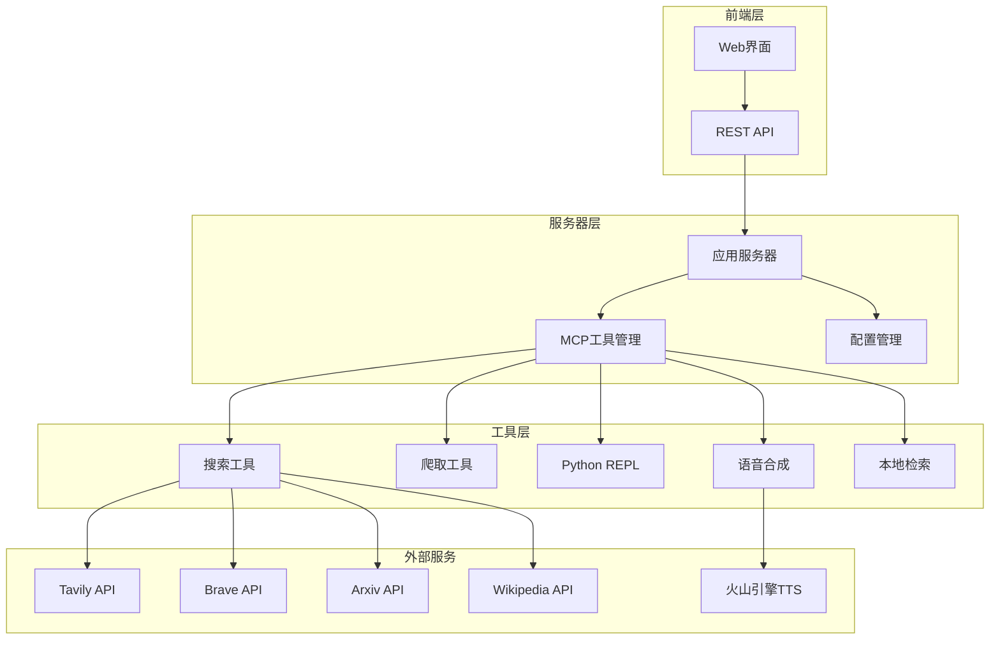

**图表来源**
- [mcp_utils.py](file://src/server/mcp_utils.py#L1-L123)
- [search.py](file://src/tools/search.py#L1-L114)

## 核心工具组件

deer-flow系统包含五个核心工具模块，每个模块都经过精心设计以满足特定的功能需求：

### 工具模块架构

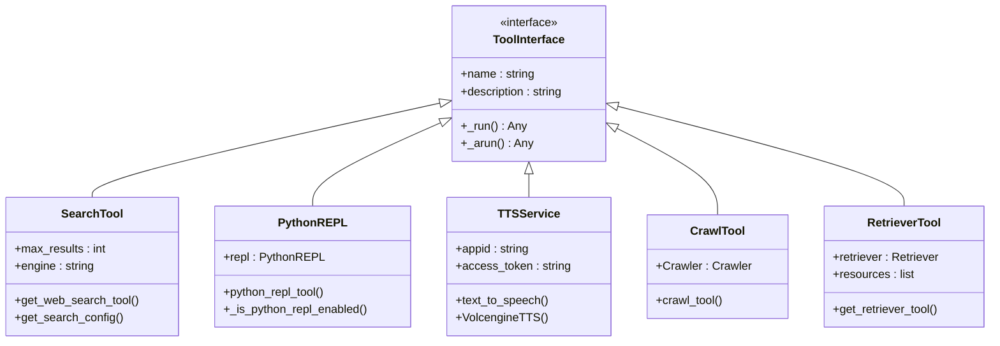

**图表来源**
- [search.py](file://src/tools/search.py#L25-L114)
- [python_repl.py](file://src/tools/python_repl.py#L1-L64)
- [tts.py](file://src/tools/tts.py#L1-L134)
- [crawl.py](file://src/tools/crawl.py#L1-L30)
- [retriever.py](file://src/tools/retriever.py#L1-L62)

**章节来源**
- [__init__.py](file://src/tools/__init__.py#L1-L17)

## 搜索工具详解

搜索工具是deer-flow系统的核心组件之一，提供了多种搜索引擎的统一接口。系统支持Tavily、DuckDuckGo、Brave、Arxiv和Wikipedia等多种搜索服务。

### 搜索引擎配置

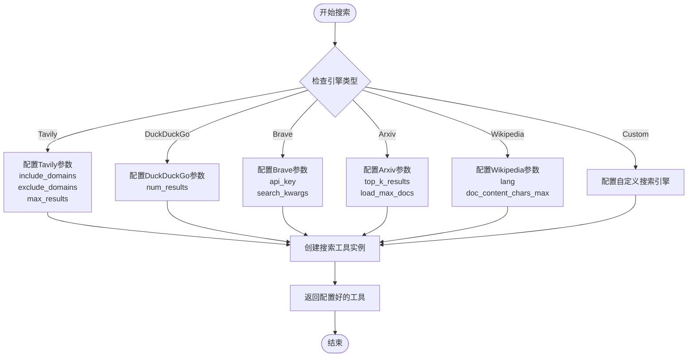

**图表来源**
- [search.py](file://src/tools/search.py#L40-L114)

### Tavily搜索工具特性

Tavily搜索工具是最为强大的搜索组件，支持以下高级功能：

- **图像搜索**：自动获取搜索结果中的图片和描述
- **原始内容提取**：获取网页的原始HTML内容
- **答案摘要**：自动生成搜索结果的答案摘要
- **域名过滤**：支持包含和排除特定域名
- **异步处理**：支持同步和异步两种执行模式

```python
# Tavily搜索工具初始化示例
tool = LoggedTavilySearch(
    name="web_search",
    max_results=10,
    include_raw_content=True,
    include_images=True,
    include_image_descriptions=True,
    include_domains=["example.com", "trusted-site.org"],
    exclude_domains=["spam-site.com"]
)
```

### 多引擎支持架构

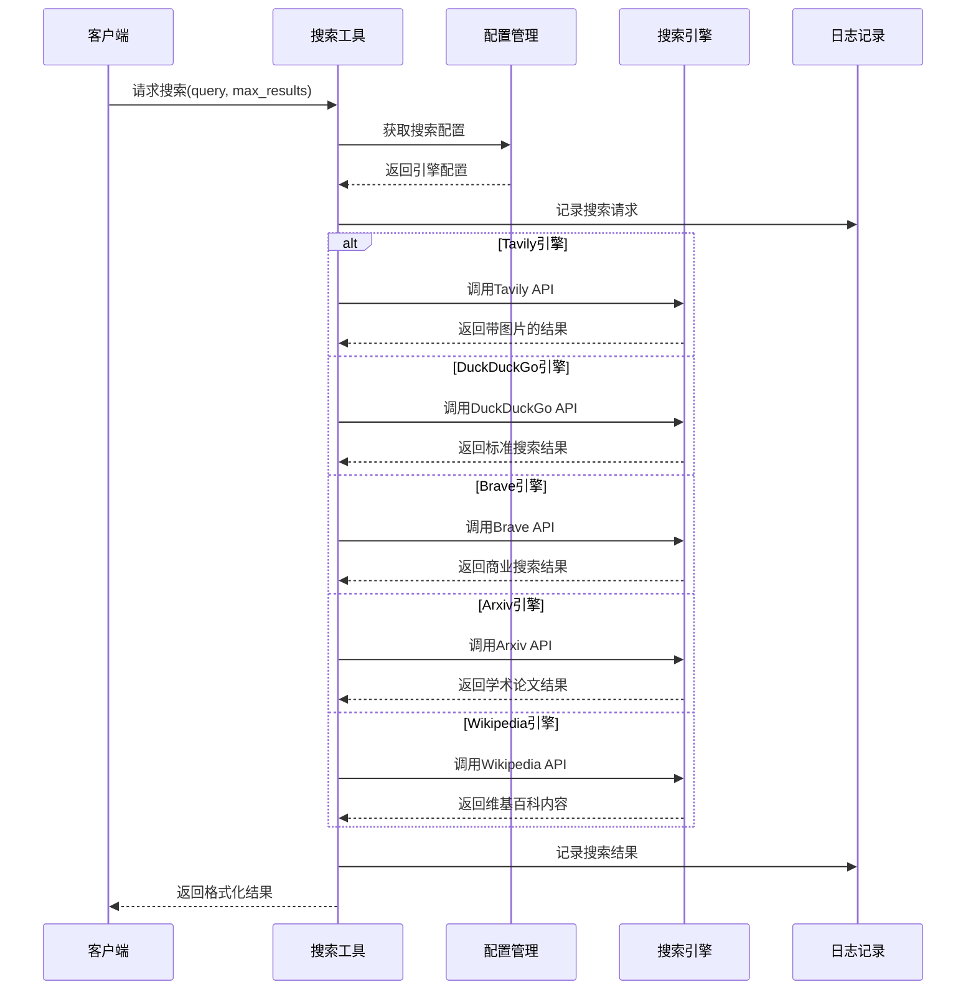

**图表来源**
- [search.py](file://src/tools/search.py#L40-L114)
- [tavily_search_results_with_images.py](file://src/tools/tavily_search/tavily_search_results_with_images.py#L80-L164)

**章节来源**
- [search.py](file://src/tools/search.py#L1-L114)
- [tavily_search_results_with_images.py](file://src/tools/tavily_search/tavily_search_results_with_images.py#L1-L165)

## Python代码执行工具

Python REPL工具提供了安全可控的代码执行环境，是数据分析和计算任务的重要工具。该工具采用了多层安全机制和严格的配置控制。

### 安全执行机制

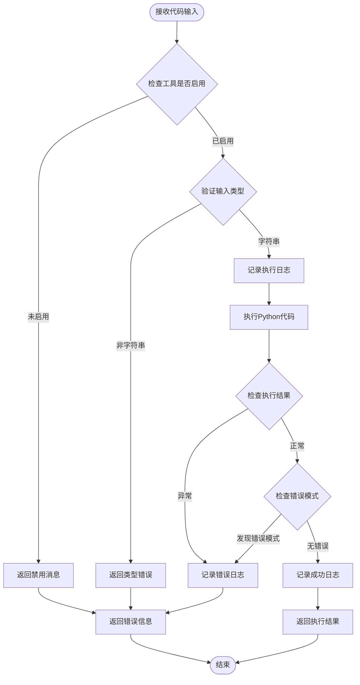

**图表来源**
- [python_repl.py](file://src/tools/python_repl.py#L25-L64)

### 配置与启用机制

Python REPL工具采用环境变量驱动的启用机制：

```python
# 启用配置示例
ENABLE_PYTHON_REPL=true          # 启用工具
ENABLE_PYTHON_REPL=1             # 数字形式启用
ENABLE_PYTHON_REPL=yes           # 字符串形式启用

# 禁用配置示例
ENABLE_PYTHON_REPL=false         # 禁用工具
ENABLE_PYTHON_REPL=0             # 数字形式禁用
ENABLE_PYTHON_REPL=no            # 字符串形式禁用
```

### 错误处理策略

系统实现了多层次的错误处理机制：

1. **输入验证**：严格检查代码输入类型
2. **执行监控**：捕获所有异常和错误
3. **结果分析**：自动检测错误模式
4. **日志记录**：详细记录执行过程和错误信息

```python
# 错误处理示例
try:
    result = repl.run(code)
    if isinstance(result, str) and ("Error" in result or "Exception" in result):
        logger.error(result)
        return f"Error executing code:\n```python\n{code}\n```\nError: {result}"
except BaseException as e:
    error_msg = repr(e)
    logger.error(error_msg)
    return f"Error executing code:\n```python\n{code}\n```\nError: {error_msg}"
```

**章节来源**
- [python_repl.py](file://src/tools/python_repl.py#L1-L64)

## 文本转语音工具

文本转语音（TTS）工具集成了火山引擎的语音合成服务，提供了高质量的语音合成功能。该工具支持多种音频格式和语音参数调节。

### Volcengine TTS架构

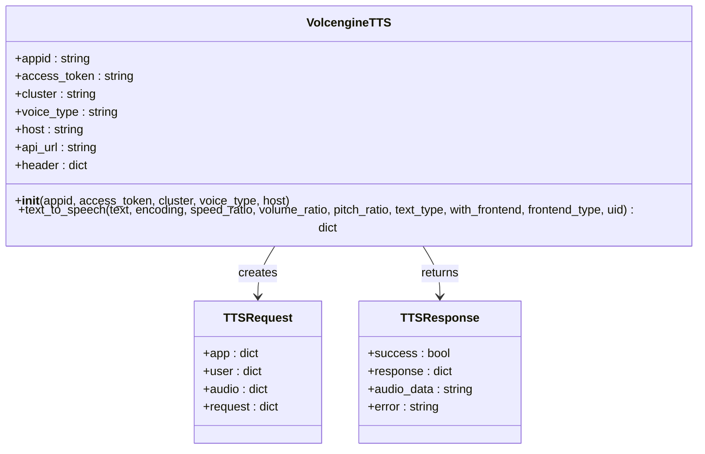

**图表来源**
- [tts.py](file://src/tools/tts.py#L15-L134)

### 语音合成流程

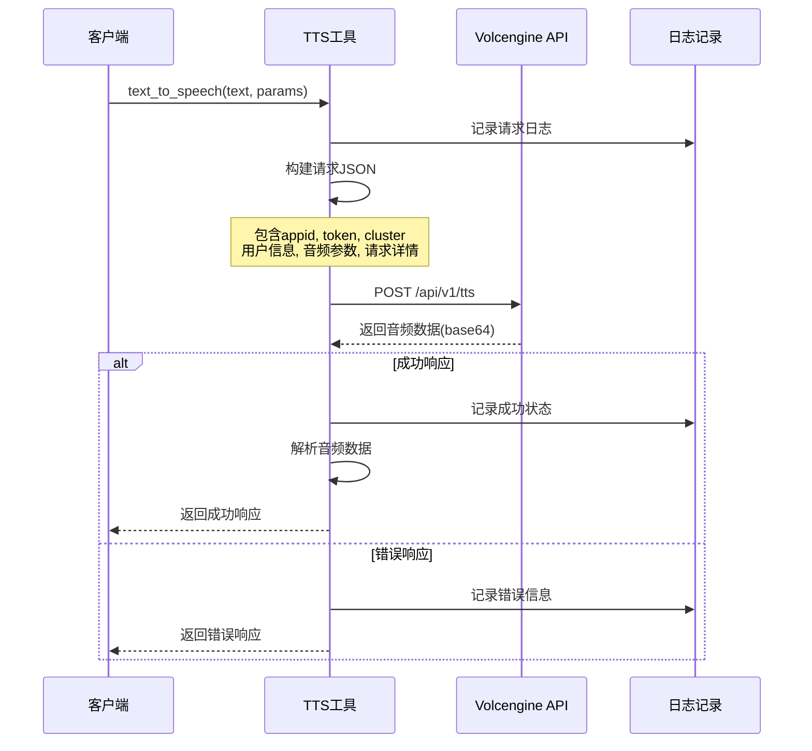

**图表来源**
- [tts.py](file://src/tools/tts.py#L50-L134)

### 参数配置选项

TTS工具支持丰富的参数配置：

- **音频编码**：支持MP3、PCM等多种格式
- **语音参数**：速度比、音量比、音高比可调节
- **文本类型**：支持纯文本和SSML格式
- **前端处理**：可选择是否进行前端处理
- **语音类型**：多种语音风格可供选择

```python
# TTS参数配置示例
tts = VolcengineTTS(
    appid="your-app-id",
    access_token="your-access-token",
    voice_type="BV700_V2_streaming",  # 语音类型
    cluster="volcano_tts",           # 集群名称
    host="openspeech.bytedance.com"  # API主机
)

# 调用语音合成
response = tts.text_to_speech(
    text="这是一个测试文本",
    encoding="mp3",
    speed_ratio=1.0,
    volume_ratio=1.0,
    pitch_ratio=1.0,
    text_type="plain"
)
```

**章节来源**
- [tts.py](file://src/tools/tts.py#L1-L134)

## MCP协议集成

MCP（Model Context Protocol）协议是deer-flow系统实现工具标准化集成的核心技术。通过MCP协议，系统能够动态加载和管理各种外部工具服务。

### MCP工具加载架构

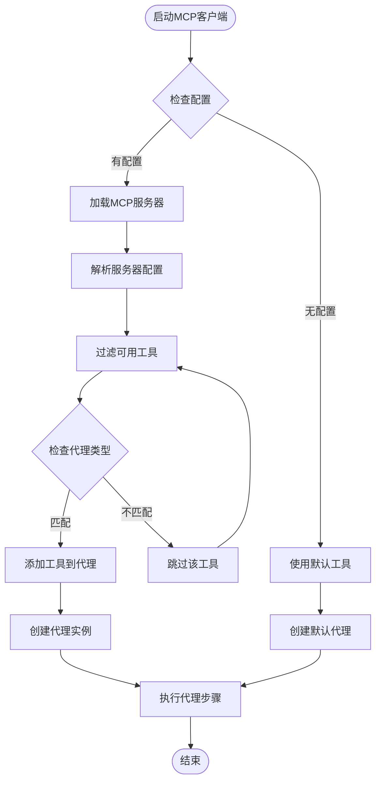

**图表来源**
- [mcp_utils.py](file://src/server/mcp_utils.py#L25-L123)

### 多传输协议支持

MCP协议支持三种不同的传输方式：

1. **STDIO传输**：通过命令行进程通信
2. **SSE传输**：通过服务器发送事件通信
3. **Streamable HTTP传输**：通过HTTP流通信

```python
# MCP工具加载示例
async def load_mcp_tools(
    server_type: str,
    command: Optional[str] = None,
    args: Optional[List[str]] = None,
    url: Optional[str] = None,
    env: Optional[Dict[str, str]] = None,
    headers: Optional[Dict[str, str]] = None,
    timeout_seconds: int = 60,
) -> List:
    """
    加载MCP服务器上的工具
    
    Args:
        server_type: 服务器类型 (stdio, sse, streamable_http)
        command: 命令行执行路径 (stdio类型必需)
        url: SSE/HTTP服务器URL (sse/streamable_http类型必需)
        env: 环境变量 (stdio类型可选)
        headers: HTTP头部 (sse/streamable_http类型可选)
        timeout_seconds: 超时时间
    """
```

### 工具发现与管理

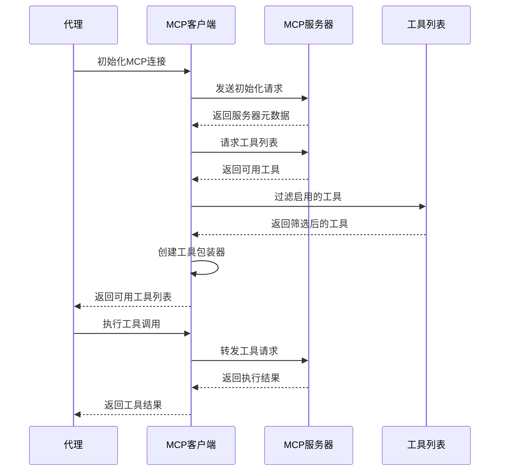

**图表来源**
- [mcp_utils.py](file://src/server/mcp_utils.py#L15-L45)

**章节来源**
- [mcp_utils.py](file://src/server/mcp_utils.py#L1-L123)

## 工具装饰器系统

工具装饰器系统为所有工具提供了统一的日志记录和监控功能。通过装饰器模式，系统能够在不修改原有工具逻辑的情况下添加额外的功能。

### 装饰器架构设计

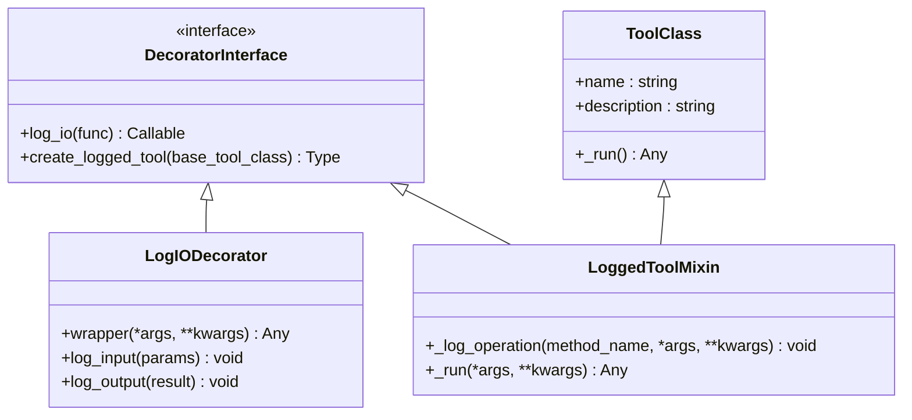

**图表来源**
- [decorators.py](file://src/tools/decorators.py#L15-L82)

### 输入输出日志记录

装饰器系统实现了全面的日志记录功能：

```python
# 输入参数日志示例
logger.info(f"Tool {func_name} called with parameters: {params}")

# 输出结果日志示例  
logger.info(f"Tool {func_name} returned: {result}")

# 工具操作日志示例
logger.debug(f"Tool {tool_name}.{method_name} called with parameters: {params}")
```

### 动态工具增强

系统通过工厂函数动态创建带有日志功能的工具类：

```python
def create_logged_tool(base_tool_class: Type[T]) -> Type[T]:
    """
    创建带有日志功能的工具类
    
    Args:
        base_tool_class: 原始工具类
    
    Returns:
        增强了日志功能的新类
    """
    class LoggedTool(LoggedToolMixin, base_tool_class):
        pass
    
    LoggedTool.__name__ = f"Logged{base_tool_class.__name__}"
    return LoggedTool
```

**章节来源**
- [decorators.py](file://src/tools/decorators.py#L1-L82)

## 配置管理

deer-flow系统采用分层配置管理策略，支持环境变量、配置文件和运行时参数的灵活组合。

### 配置层次结构

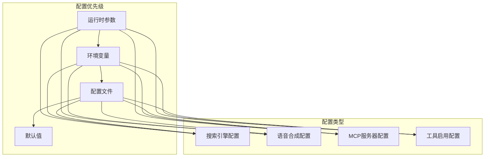

**图表来源**
- [conf.yaml](file://conf.yaml#L1-L69)
- [tools.py](file://src/config/tools.py#L1-L32)

### 搜索引擎配置

搜索引擎配置支持多种参数设置：

```yaml
# 搜索引擎配置示例
SEARCH_ENGINE:
  engine: tavily
  # 只包含这些域名的结果（仅适用于Tavily）
  include_domains:
    - example.com
    - trusted-news.com
    - reliable-source.org
    - gov.cn
    - edu.cn
  # 排除这些域名的结果（仅适用于Tavily）
  exclude_domains:
    - example.com
```

### 工具启用配置

系统支持按需启用不同类型的工具：

```python
# 支持的搜索引擎枚举
class SearchEngine(enum.Enum):
    TAVILY = "tavily"
    DUCKDUCKGO = "duckduckgo"
    BRAVE_SEARCH = "brave_search"
    ARXIV = "arxiv"
    WIKIPEDIA = "wikipedia"
    CUSTOM_SEARCH = "custom_search"

# 默认使用的搜索引擎
SELECTED_SEARCH_ENGINE = os.getenv("SEARCH_API", SearchEngine.TAVILY.value)
```

**章节来源**
- [conf.yaml](file://conf.yaml#L1-L69)
- [tools.py](file://src/config/tools.py#L1-L32)

## 安全与性能考虑

### Python REPL安全机制

Python REPL工具实施了多重安全措施：

1. **显式启用**：必须通过环境变量明确启用
2. **输入验证**：严格检查代码输入类型
3. **异常捕获**：捕获所有可能的异常
4. **结果分析**：自动检测错误模式
5. **日志审计**：记录所有执行活动

### 网络请求安全

各工具模块都实现了适当的网络安全措施：

- **SSL验证**：默认启用SSL证书验证
- **超时控制**：设置合理的请求超时时间
- **重试机制**：支持自动重试失败的请求
- **错误处理**：优雅处理网络错误和API限制

### 性能优化策略

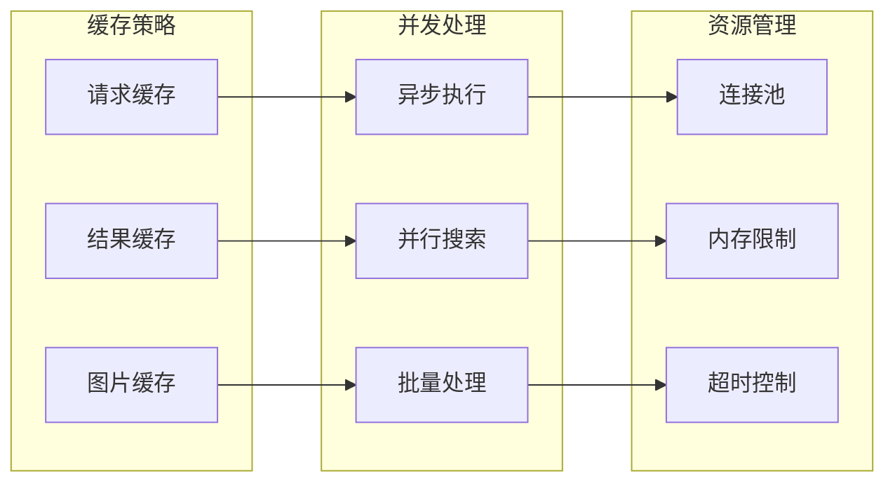

## 故障排除指南

### 常见问题诊断

#### 搜索工具问题

1. **API密钥无效**
   - 检查环境变量设置
   - 验证API密钥的有效性
   - 确认配额和权限

2. **搜索结果为空**
   - 检查域名过滤配置
   - 调整搜索关键词
   - 验证搜索引擎状态

#### Python REPL问题

1. **工具被禁用**
   ```bash
   # 启用Python REPL
   export ENABLE_PYTHON_REPL=true
   ```

2. **代码执行失败**
   - 检查代码语法
   - 验证所需库的存在
   - 查看错误日志

#### TTS工具问题

1. **认证失败**
   - 验证appid和access_token
   - 检查网络连接
   - 确认服务可用性

2. **音频生成失败**
   - 检查文本长度限制
   - 验证音频参数设置
   - 查看API响应状态

### 调试技巧

1. **启用详细日志**
   ```python
   import logging
   logging.basicConfig(level=logging.DEBUG)
   ```

2. **检查工具状态**
   ```python
   # 检查工具是否正确加载
   from src.tools import *
   print([crawl_tool, python_repl_tool, get_web_search_tool, get_retriever_tool, VolcengineTTS])
   ```

3. **验证配置**
   ```python
   from src.config import *
   print(SELECTED_SEARCH_ENGINE)
   print(os.getenv("ENABLE_PYTHON_REPL"))
   ```

**章节来源**
- [python_repl.py](file://src/tools/python_repl.py#L25-L64)
- [tts.py](file://src/tools/tts.py#L50-L134)

## 总结

deer-flow工具集成系统是一个功能完整、设计精良的智能代理工具平台。通过模块化的架构设计、标准化的MCP协议集成和严格的安全控制，系统能够为用户提供强大而可靠的工具服务。

### 主要优势

1. **模块化设计**：每个工具独立开发，便于维护和扩展
2. **协议标准化**：通过MCP协议实现工具的标准化集成
3. **安全优先**：Python REPL工具需要显式启用，确保运行时安全
4. **配置灵活**：支持多种配置方式，适应不同部署场景
5. **监控完善**：通过装饰器系统提供全面的日志记录和监控

### 技术特色

- **多引擎支持**：集成多种搜索引擎，满足不同场景需求
- **异步处理**：支持同步和异步两种执行模式
- **错误处理**：完善的错误处理和恢复机制
- **性能优化**：通过缓存和并发处理提升性能
- **扩展性强**：易于添加新的工具和服务

该系统为构建复杂的智能代理应用提供了坚实的基础，是现代AI应用开发的理想选择。