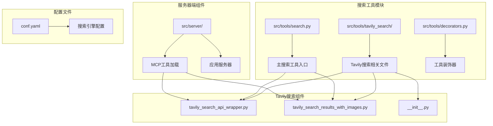
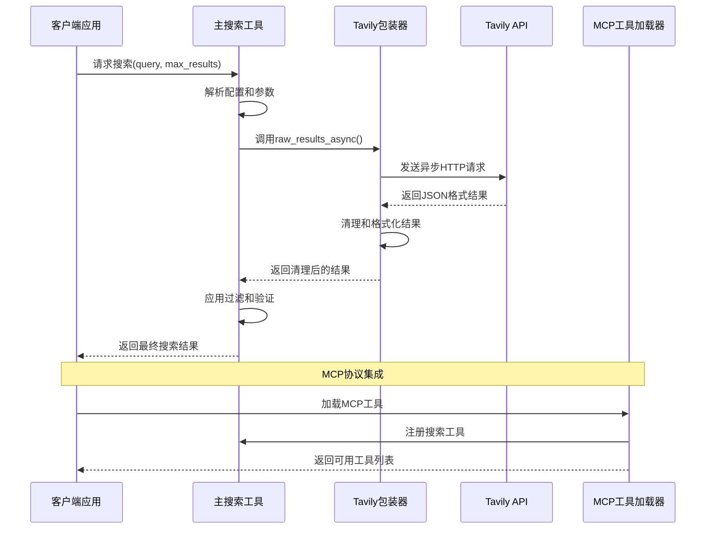
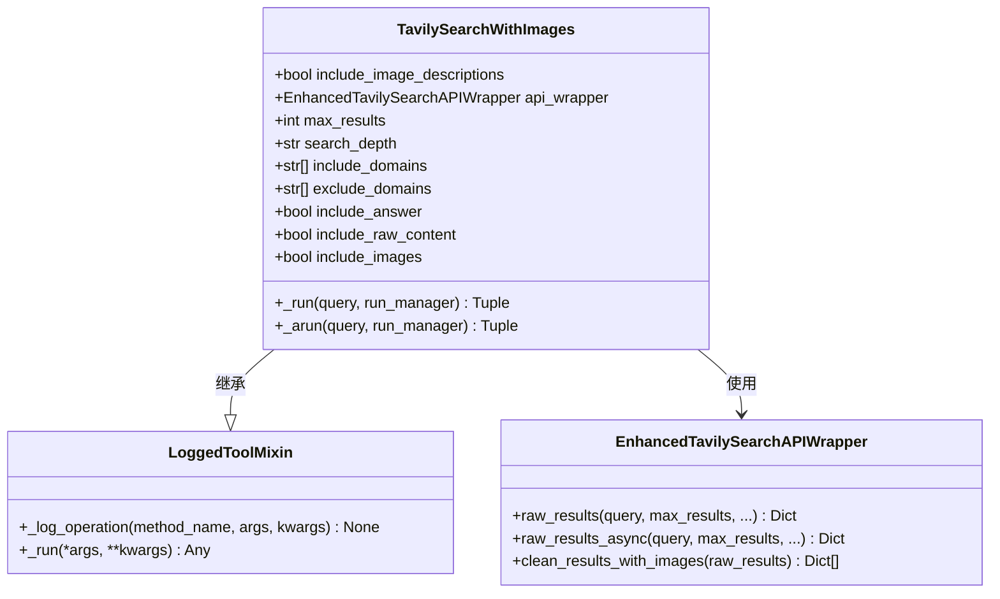
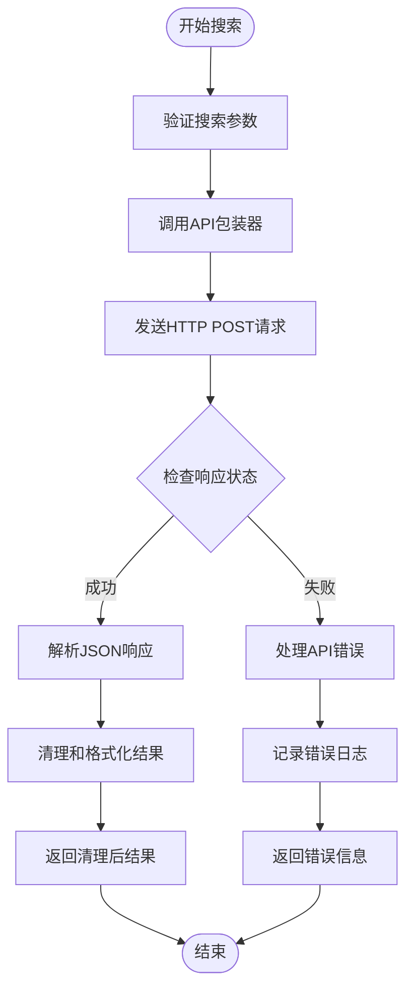
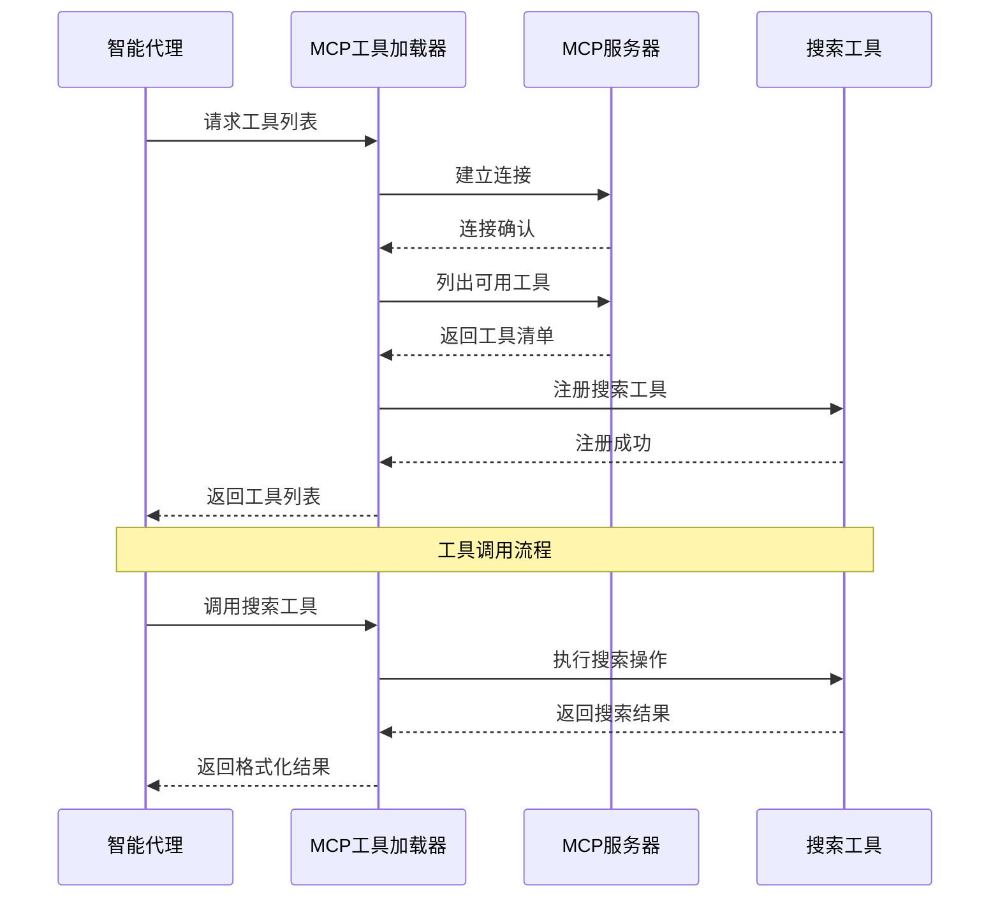
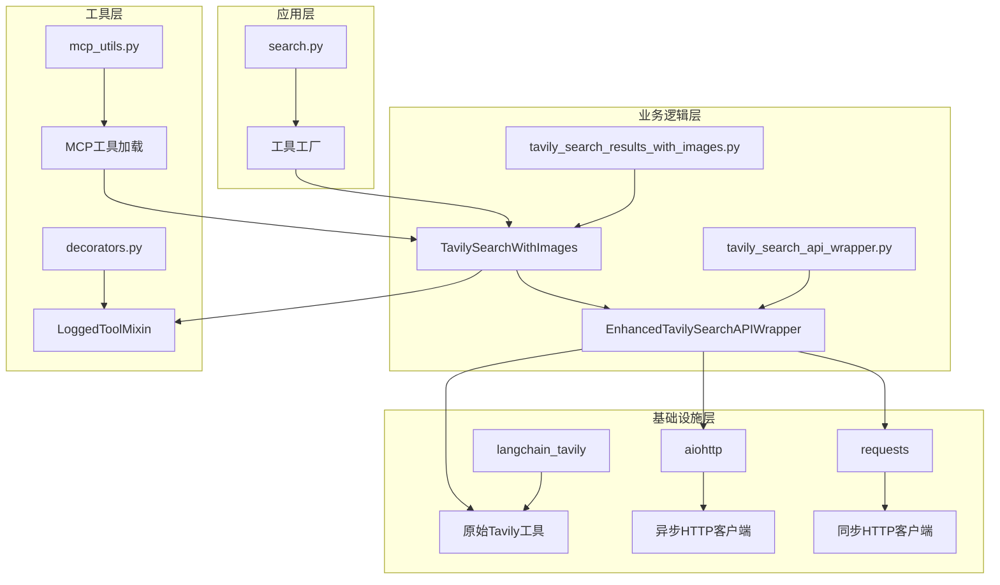

# 搜索工具集成

<cite>
**本文档中引用的文件**
- [search.py](file://src/tools/search.py)
- [tavily_search_api_wrapper.py](file://src/tools/tavily_search/tavily_search_api_wrapper.py)
- [tavily_search_results_with_images.py](file://src/tools/tavily_search/tavily_search_results_with_images.py)
- [mcp_utils.py](file://src/server/mcp_utils.py)
- [decorators.py](file://src/tools/decorators.py)
- [conf.yaml](file://conf.yaml)
- [mcp_request.py](file://src/server/mcp_request.py)
- [app.py](file://src/server/app.py)
- [test_tavily_search_results_with_images.py](file://tests/unit/tools/test_tavily_search_results_with_images.py)
- [test_tavily_search_api_wrapper.py](file://tests/unit/tools/test_tavily_search_api_wrapper.py)
</cite>

## 目录
1. [简介](#简介)
2. [项目结构](#项目结构)
3. [核心组件](#核心组件)
4. [架构概览](#架构概览)
5. [详细组件分析](#详细组件分析)
6. [依赖关系分析](#依赖关系分析)
7. [性能考虑](#性能考虑)
8. [故障排除指南](#故障排除指南)
9. [结论](#结论)

## 简介

deer-flow搜索工具集成是一个综合性的搜索解决方案，专门设计用于支持多种搜索引擎，其中Tavily搜索API是核心组件。该系统提供了强大的异步搜索能力，支持图像搜索、原始内容提取和智能过滤等功能。通过MCP（Model Context Protocol）协议，该工具可以被智能代理无缝调用，为用户提供丰富的信息检索能力。

该系统采用模块化设计，支持多种搜索引擎配置，包括Tavily、DuckDuckGo、Brave Search、Arxiv和Wikipedia等。每个搜索引擎都有其特定的配置选项和优化特性，确保在不同场景下都能提供最佳的搜索体验。

## 项目结构

搜索工具集成的核心文件组织如下：



**图表来源**
- [search.py](file://src/tools/search.py#L1-L114)
- [tavily_search_api_wrapper.py](file://src/tools/tavily_search/tavily_search_api_wrapper.py#L1-L114)
- [tavily_search_results_with_images.py](file://src/tools/tavily_search/tavily_search_results_with_images.py#L1-L165)

**章节来源**
- [search.py](file://src/tools/search.py#L1-L114)
- [conf.yaml](file://conf.yaml#L1-L69)

## 核心组件

### 主搜索工具 (search.py)

主搜索工具模块负责统一管理所有可用的搜索引擎，提供统一的接口来选择和配置不同的搜索服务。

```python
def get_web_search_tool(max_search_results: int, engine: str = None, repository_id: str = None):
    search_config = get_search_config()
    selected_engine = engine or SELECTED_SEARCH_ENGINE
    
    if selected_engine == SearchEngine.TAVILY.value:
        return LoggedTavilySearch(
            name="web_search",
            max_results=max_search_results,
            include_raw_content=True,
            include_images=True,
            include_image_descriptions=True,
            include_domains=include_domains,
            exclude_domains=exclude_domains,
        )
```

该函数根据配置自动选择合适的搜索引擎，并返回相应的工具实例。它支持动态配置，允许在运行时覆盖默认设置。

### Tavily搜索API包装器 (EnhancedTavilySearchAPIWrapper)

这是Tavily搜索功能的核心实现，提供了同步和异步两种搜索模式：

```python
class EnhancedTavilySearchAPIWrapper(OriginalTavilySearchAPIWrapper):
    def raw_results(self, query: str, max_results: Optional[int] = 5, ...) -> Dict:
        """同步获取Tavily搜索结果"""
        
    async def raw_results_async(self, query: str, max_results: Optional[int] = 5, ...) -> Dict:
        """异步获取Tavily搜索结果"""
```

该包装器继承自LangChain的原始Tavily搜索API包装器，并添加了增强功能，包括更好的错误处理和更灵活的参数配置。

**章节来源**
- [search.py](file://src/tools/search.py#L36-L114)
- [tavily_search_api_wrapper.py](file://src/tools/tavily_search/tavily_search_api_wrapper.py#L15-L114)

## 架构概览

搜索工具集成采用分层架构设计，确保各组件之间的松耦合和高内聚：



**图表来源**
- [search.py](file://src/tools/search.py#L45-L114)
- [tavily_search_api_wrapper.py](file://src/tools/tavily_search/tavily_search_api_wrapper.py#L48-L85)
- [mcp_utils.py](file://src/server/mcp_utils.py#L20-L122)

## 详细组件分析

### TavilySearchWithImages 类分析

TavilySearchWithImages 是整个搜索功能的核心类，继承自 LangChain 的 TavilySearchResults 工具：



**图表来源**
- [tavily_search_results_with_images.py](file://src/tools/tavily_search/tavily_search_results_with_images.py#L25-L165)
- [tavily_search_api_wrapper.py](file://src/tools/tavily_search/tavily_search_api_wrapper.py#L15-L114)
- [decorators.py](file://src/tools/decorators.py#L30-L81)

#### 同步搜索流程



**图表来源**
- [tavily_search_results_with_images.py](file://src/tools/tavily_search/tavily_search_results_with_images.py#L85-L105)

#### 异步搜索流程

异步搜索流程通过 aiohttp 实现非阻塞的HTTP请求：

```python
async def raw_results_async(self, query: str, max_results: Optional[int] = 5, ...) -> Dict:
    async def fetch() -> str:
        params = {
            "api_key": self.tavily_api_key.get_secret_value(),
            "query": query,
            "max_results": max_results,
            # ... 其他参数
        }
        async with aiohttp.ClientSession(trust_env=True) as session:
            async with session.post(f"{TAVILY_API_URL}/search", json=params) as res:
                if res.status == 200:
                    data = await res.text()
                    return data
                else:
                    raise Exception(f"Error {res.status}: {res.reason}")
```

这种设计确保了即使在高并发环境下，搜索操作也不会阻塞其他任务的执行。

**章节来源**
- [tavily_search_results_with_images.py](file://src/tools/tavily_search/tavily_search_results_with_images.py#L25-L165)
- [tavily_search_api_wrapper.py](file://src/tools/tavily_search/tavily_search_api_wrapper.py#L48-L85)

### MCP工具加载机制

MCP（Model Context Protocol）工具加载机制允许智能代理动态发现和使用搜索工具：



**图表来源**
- [mcp_utils.py](file://src/server/mcp_utils.py#L20-L122)
- [mcp_request.py](file://src/server/mcp_request.py#L1-L65)

**章节来源**
- [mcp_utils.py](file://src/server/mcp_utils.py#L20-L122)
- [mcp_request.py](file://src/server/mcp_request.py#L1-L65)

### 配置管理系统

搜索工具支持灵活的配置管理，通过 YAML 文件和环境变量进行配置：

```yaml
SEARCH_ENGINE:
  engine: tavily
  include_domains:
    - example.com
    - trusted-news.com
    - reliable-source.org
    - gov.cn
    - edu.cn
  exclude_domains:
    - example.com
```

配置系统支持以下特性：
- **引擎选择**：支持多种搜索引擎的动态切换
- **域名过滤**：精确控制包含和排除的域名
- **结果数量限制**：可配置最大搜索结果数量
- **功能开关**：启用或禁用特定功能（如图像搜索）

**章节来源**
- [conf.yaml](file://conf.yaml#L25-L40)
- [search.py](file://src/tools/search.py#L36-L58)

## 依赖关系分析

搜索工具集成的依赖关系展现了清晰的分层架构：



**图表来源**
- [search.py](file://src/tools/search.py#L1-L114)
- [tavily_search_results_with_images.py](file://src/tools/tavily_search/tavily_search_results_with_images.py#L1-L165)
- [tavily_search_api_wrapper.py](file://src/tools/tavily_search/tavily_search_api_wrapper.py#L1-L114)

**章节来源**
- [search.py](file://src/tools/search.py#L1-L114)
- [tavily_search_results_with_images.py](file://src/tools/tavily_search/tavily_search_results_with_images.py#L1-L165)

## 性能考虑

### 异步处理优势

搜索工具集成了完整的异步处理机制，这带来了显著的性能提升：

1. **非阻塞I/O**：异步HTTP请求不会阻塞主线程
2. **并发处理**：支持同时处理多个搜索请求
3. **资源利用率**：更好地利用系统资源
4. **响应时间**：减少用户等待时间

### 缓存和优化策略

虽然当前实现没有显式的缓存机制，但可以通过以下方式进行优化：

1. **结果缓存**：对频繁查询的结果进行缓存
2. **预取机制**：预测用户可能需要的搜索结果
3. **负载均衡**：在多个API密钥之间分配请求
4. **超时控制**：合理设置请求超时时间

### 错误处理和重试机制

系统实现了完善的错误处理策略：

```python
try:
    raw_results = await self.api_wrapper.raw_results_async(...)
except Exception as e:
    logger.error("Tavily search returned error: {}".format(e))
    return repr(e), {}
```

这种设计确保了即使某个搜索请求失败，也不会影响整个系统的稳定性。

## 故障排除指南

### 常见问题和解决方案

#### 1. API密钥配置问题

**问题**：Tavily API调用失败
**原因**：缺少或错误的API密钥
**解决方案**：
```bash
export TAVILY_API_KEY="your-api-key"
```

#### 2. 网络连接问题

**问题**：异步请求超时
**原因**：网络不稳定或防火墙阻止
**解决方案**：
- 检查网络连接
- 配置适当的超时时间
- 使用代理服务器

#### 3. 配置文件错误

**问题**：搜索配置不生效
**原因**：YAML语法错误或配置项缺失
**解决方案**：
- 验证YAML语法
- 确保必需的配置项存在
- 检查环境变量设置

### 调试技巧

1. **启用详细日志**：设置日志级别为DEBUG
2. **监控API调用**：跟踪API响应时间和错误率
3. **测试独立功能**：单独测试各个组件
4. **使用模拟数据**：在开发环境中使用模拟API响应

**章节来源**
- [tavily_search_results_with_images.py](file://src/tools/tavily_search/tavily_search_results_with_images.py#L85-L105)
- [test_tavily_search_results_with_images.py](file://tests/unit/tools/test_tavily_search_results_with_images.py#L1-L202)

## 结论

deer-flow搜索工具集成提供了一个强大而灵活的信息检索解决方案。通过模块化设计、异步处理和MCP协议支持，该系统能够满足现代AI应用对高效搜索功能的需求。

### 主要优势

1. **多引擎支持**：支持多种搜索引擎，可根据需求灵活切换
2. **异步处理**：完整的异步架构确保高性能和高并发
3. **图像搜索**：独特的图像搜索功能提供更丰富的信息
4. **MCP集成**：原生支持MCP协议，便于智能代理集成
5. **配置灵活**：支持复杂的配置选项和动态调整

### 未来发展方向

1. **缓存优化**：引入智能缓存机制提高响应速度
2. **负载均衡**：支持多个API密钥的负载均衡
3. **监控增强**：增加更详细的性能监控和告警
4. **扩展性改进**：支持更多类型的搜索服务
5. **安全加固**：加强API密钥管理和访问控制

该搜索工具集成不仅满足了当前的功能需求，还为未来的扩展和优化奠定了坚实的基础。通过持续的改进和优化，它将继续为deer-flow生态系统提供可靠的信息检索服务。