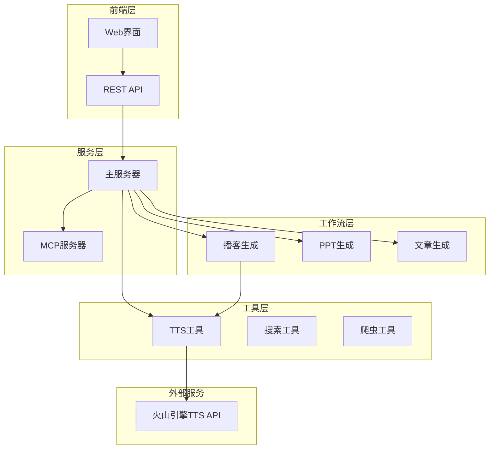
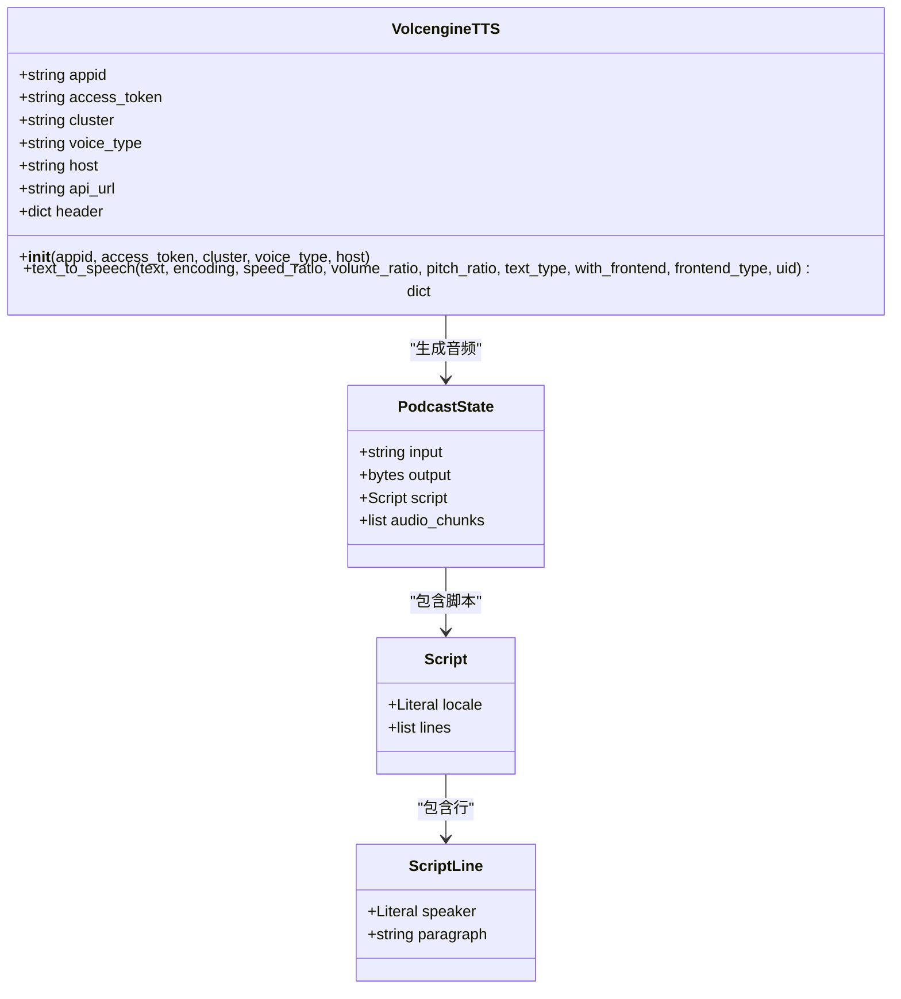
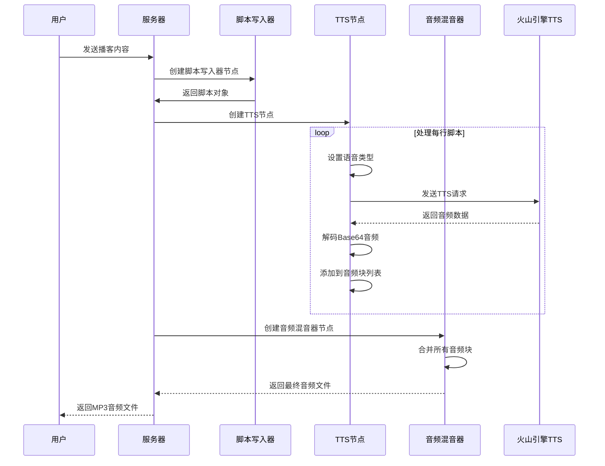
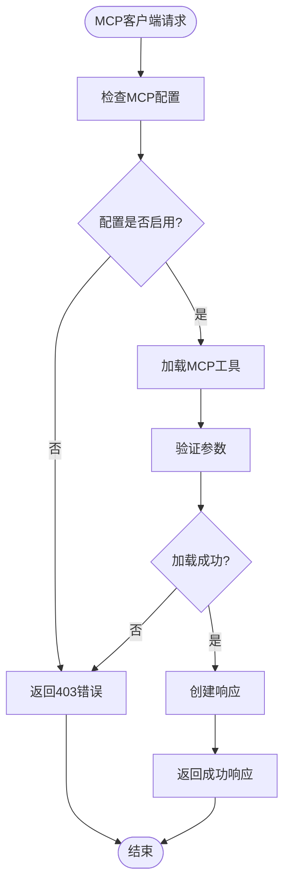
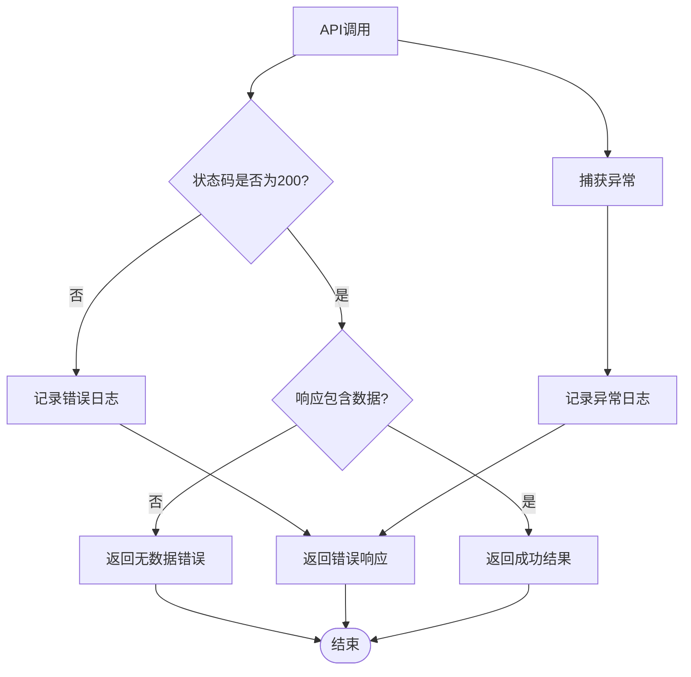
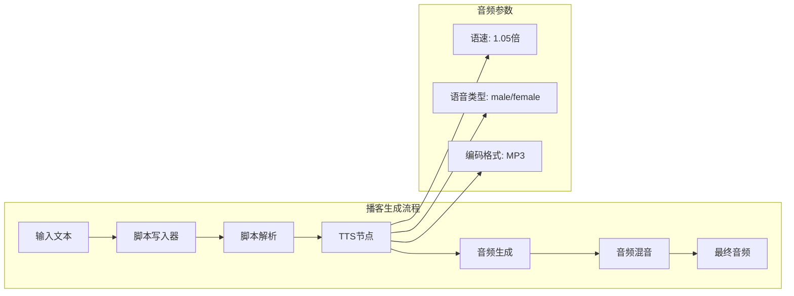

# 文本转语音工具集成

<cite>
**本文档引用的文件**
- [tts.py](file://src/tools/tts.py)
- [tts_node.py](file://src/podcast/graph/tts_node.py)
- [state.py](file://src/podcast/graph/state.py)
- [types.py](file://src/podcast/types.py)
- [builder.py](file://src/podcast/graph/builder.py)
- [app.py](file://src/server/app.py)
- [test_tts.py](file://tests/integration/test_tts.py)
- [test_app.py](file://tests/unit/server/test_app.py)
</cite>

## 目录
1. [简介](#简介)
2. [项目架构概览](#项目架构概览)
3. [核心组件分析](#核心组件分析)
4. [TTS工具详细分析](#tts工具详细分析)
5. [播客生成工作流](#播客生成工作流)
6. [MCP协议集成](#mcp协议集成)
7. [音频参数配置](#音频参数配置)
8. [性能优化与错误处理](#性能优化与错误处理)
9. [实际应用场景](#实际应用场景)
10. [故障排除指南](#故障排除指南)
11. [总结](#总结)

## 简介

deer-flow是一个集成了多种AI工具的综合平台，其中文本转语音(TTS)工具是其核心功能之一。该工具基于火山引擎的TTS API，提供了高质量的文本到语音转换服务。本文档将详细介绍TTS工具的实现原理、配置方法、使用场景以及最佳实践。

TTS工具的主要特点：
- 基于火山引擎的高性能语音合成API
- 支持多种音频格式输出（MP3、WAV等）
- 提供丰富的音频参数调节选项
- 集成到播客生成工作流中
- 支持MCP协议的标准化接口

## 项目架构概览

deer-flow采用模块化设计，TTS工具作为独立的工具模块被多个功能模块复用：



**图表来源**
- [app.py](file://src/server/app.py#L465-L502)
- [builder.py](file://src/podcast/graph/builder.py#L0-L38)

## 核心组件分析

### TTS工具类结构

TTS工具的核心实现位于`VolcengineTTS`类中，该类封装了火山引擎TTS API的所有功能：



**图表来源**
- [tts.py](file://src/tools/tts.py#L15-L134)
- [state.py](file://src/podcast/graph/state.py#L0-L23)
- [types.py](file://src/podcast/types.py#L0-L17)

**章节来源**
- [tts.py](file://src/tools/tts.py#L15-L134)
- [state.py](file://src/podcast/graph/state.py#L0-L23)
- [types.py](file://src/podcast/types.py#L0-L17)

## TTS工具详细分析

### 初始化配置

`VolcengineTTS`类提供了灵活的初始化配置，支持多种参数设置：

```python
def __init__(
    self,
    appid: str,
    access_token: str,
    cluster: str = "volcano_tts",
    voice_type: str = "BV700_V2_streaming",
    host: str = "openspeech.bytedance.com",
):
```

关键配置参数：
- **appid**: 平台应用标识符
- **access_token**: 认证令牌
- **cluster**: TTS集群名称，默认"volcano_tts"
- **voice_type**: 语音类型，默认"BV700_V2_streaming"
- **host**: API主机地址，默认"openspeech.bytedance.com"

### 核心API方法

`text_to_speech`方法是TTS工具的核心接口，支持丰富的参数配置：

```python
def text_to_speech(
    self,
    text: str,
    encoding: str = "mp3",
    speed_ratio: float = 1.0,
    volume_ratio: float = 1.0,
    pitch_ratio: float = 1.0,
    text_type: str = "plain",
    with_frontend: int = 1,
    frontend_type: str = "unitTson",
    uid: Optional[str] = None,
) -> Dict[str, Any]:
```

**章节来源**
- [tts.py](file://src/tools/tts.py#L48-L134)

## 播客生成工作流

### 工作流架构

播客生成是一个多阶段的工作流，TTS工具在其中扮演着关键角色：



**图表来源**
- [builder.py](file://src/podcast/graph/builder.py#L0-L38)
- [tts_node.py](file://src/podcast/graph/tts_node.py#L0-L48)

### TTS节点实现

TTS节点负责将脚本中的每一行文本转换为音频：

```python
def tts_node(state: PodcastState):
    logger.info("Generating audio chunks for podcast...")
    tts_client = _create_tts_client()
    for line in state["script"].lines:
        tts_client.voice_type = (
            "BV002_streaming" if line.speaker == "male" else "BV001_streaming"
        )
        result = tts_client.text_to_speech(line.paragraph, speed_ratio=1.05)
        if result["success"]:
            audio_data = result["audio_data"]
            audio_chunk = base64.b64decode(audio_data)
            state["audio_chunks"].append(audio_chunk)
        else:
            logger.error(result["error"])
    return {
        "audio_chunks": state["audio_chunks"],
    }
```

**章节来源**
- [tts_node.py](file://src/podcast/graph/tts_node.py#L0-L48)

## MCP协议集成

### MCP服务器配置

deer-flow支持通过MCP(Machine Common Protocol)协议进行标准化的工具调用：



**图表来源**
- [app.py](file://src/server/app.py#L580-L620)

### TTS API端点

服务器提供了专门的TTS API端点，支持完整的音频生成流程：

```python
@app.post("/api/tts")
async def tts_endpoint(request: TTSRequest):
    try:
        # 获取环境变量配置
        app_id = os.getenv("VOLCENGINE_TTS_APPID", "")
        access_token = os.getenv("VOLCENGINE_TTS_ACCESS_TOKEN", "")
        
        # 创建TTS客户端
        tts_client = VolcengineTTS(
            appid=app_id,
            access_token=access_token,
            cluster=cluster,
            voice_type=voice_type,
        )
        
        # 调用TTS API
        result = tts_client.text_to_speech(
            text=request.text[:1024],
            encoding=request.encoding,
            speed_ratio=request.speed_ratio,
            volume_ratio=request.volume_ratio,
            pitch_ratio=request.pitch_ratio,
            text_type=request.text_type,
            with_frontend=request.with_frontend,
            frontend_type=request.frontend_type,
        )
        
        if not result["success"]:
            raise HTTPException(status_code=500, detail=str(result["error"]))
            
        # 解码音频数据并返回
        audio_data = base64.b64decode(result["audio_data"])
        return Response(
            content=audio_data,
            media_type=f"audio/{request.encoding}",
            headers={"Content-Disposition": f"attachment; filename=tts_output.{request.encoding}"}
        )
        
    except Exception as e:
        logger.exception(f"Error in TTS endpoint: {str(e)}")
        raise HTTPException(status_code=500, detail=INTERNAL_SERVER_ERROR_DETAIL)
```

**章节来源**
- [app.py](file://src/server/app.py#L465-L502)

## 音频参数配置

### 支持的音频参数

TTS工具提供了丰富的音频参数配置选项：

| 参数 | 类型 | 默认值 | 描述 |
|------|------|--------|------|
| `encoding` | string | "mp3" | 音频编码格式 |
| `speed_ratio` | float | 1.0 | 语速比例 |
| `volume_ratio` | float | 1.0 | 音量比例 |
| `pitch_ratio` | float | 1.0 | 音调比例 |
| `text_type` | string | "plain" | 文本类型（plain或ssml） |
| `with_frontend` | int | 1 | 是否使用前端处理 |
| `frontend_type` | string | "unitTson" | 前端类型 |

### 语音类型配置

根据播客生成的实际需求，系统支持不同的语音类型：

```python
# 根据说话者选择语音类型
tts_client.voice_type = (
    "BV002_streaming" if line.speaker == "male" else "BV001_streaming"
)

# 设置语速
result = tts_client.text_to_speech(line.paragraph, speed_ratio=1.05)
```

**章节来源**
- [tts_node.py](file://src/podcast/graph/tts_node.py#L18-L22)

## 性能优化与错误处理

### 错误处理策略

TTS工具实现了完善的错误处理机制：



**图表来源**
- [tts.py](file://src/tools/tts.py#L80-L134)

### 性能优化建议

1. **批量处理**: 对于大量文本，考虑分批处理以减少API调用次数
2. **缓存机制**: 实现音频数据缓存，避免重复生成相同内容
3. **异步处理**: 使用异步调用提高并发性能
4. **连接池**: 复用HTTP连接以减少建立连接的开销

### 错误恢复策略

```python
# 完善的错误处理示例
try:
    sanitized_text = text.replace("\r\n", "").replace("\n", "")
    logger.debug(f"Sending TTS request for text: {sanitized_text[:50]}...")
    response = requests.post(
        self.api_url, json.dumps(request_json), headers=self.header
    )
    response_json = response.json()

    if response.status_code != 200:
        logger.error(f"TTS API error: {response_json}")
        return {"success": False, "error": response_json, "audio_data": None}

    if "data" not in response_json:
        logger.error(f"TTS API returned no data: {response_json}")
        return {
            "success": False,
            "error": "No audio data returned",
            "audio_data": None,
        }

    return {
        "success": True,
        "response": response_json,
        "audio_data": response_json["data"],
    }

except Exception as e:
    logger.exception(f"Error in TTS API call: {str(e)}")
    return {"success": False, "error": "TTS API call error", "audio_data": None}
```

**章节来源**
- [tts.py](file://src/tools/tts.py#L80-L134)

## 实际应用场景

### 播客生成实例

播客生成是TTS工具的主要应用场景之一：



**图表来源**
- [builder.py](file://src/podcast/graph/builder.py#L0-L38)
- [tts_node.py](file://src/podcast/graph/tts_node.py#L18-L22)

### 其他应用场景

1. **有声读物生成**: 将长篇文本转换为音频文件
2. **语音助手**: 实时语音合成响应
3. **教育内容**: 制作教学音频材料
4. **无障碍访问**: 为视觉障碍用户提供音频内容

**章节来源**
- [tts_node.py](file://src/podcast/graph/tts_node.py#L0-L48)

## 故障排除指南

### 常见问题及解决方案

#### 1. API认证失败

**症状**: 返回401未授权错误
**原因**: appid或access_token配置错误
**解决方案**: 
- 检查环境变量设置
- 验证凭证有效性
- 确认权限配置

#### 2. 音频数据为空

**症状**: API返回成功但没有音频数据
**原因**: TTS服务内部错误或文本处理问题
**解决方案**:
- 检查输入文本长度
- 验证文本格式
- 查看服务状态

#### 3. 连接超时

**症状**: 请求超时或连接失败
**原因**: 网络问题或服务不可用
**解决方案**:
- 检查网络连接
- 验证API端点可用性
- 增加重试机制

### 调试技巧

1. **启用详细日志**: 设置日志级别为DEBUG
2. **监控API响应**: 记录完整的请求和响应
3. **测试小样本**: 使用简短文本进行测试
4. **检查环境变量**: 确保所有必需的环境变量已正确设置

**章节来源**
- [test_tts.py](file://tests/integration/test_tts.py#L0-L199)

## 总结

deer-flow的文本转语音工具是一个功能完善、设计精良的音频生成系统。它基于火山引擎的TTS API，提供了高质量的语音合成服务，并成功集成到了播客生成工作流中。

### 主要优势

1. **高性能**: 基于火山引擎的优化算法，提供高质量语音合成
2. **灵活性**: 支持丰富的音频参数配置，满足不同场景需求
3. **可扩展性**: 模块化设计，易于扩展和维护
4. **可靠性**: 完善的错误处理和异常恢复机制
5. **集成度**: 与播客生成工作流深度集成，形成完整的解决方案

### 最佳实践建议

1. **合理配置参数**: 根据具体需求调整语速、音量等参数
2. **实施缓存策略**: 对常用文本进行音频缓存
3. **监控服务质量**: 定期检查API响应时间和成功率
4. **优化用户体验**: 提供进度反馈和错误提示
5. **安全考虑**: 确保凭证的安全存储和传输

通过本文档的详细介绍，开发者可以充分理解和有效利用deer-flow的文本转语音工具，为用户提供优质的语音合成服务。