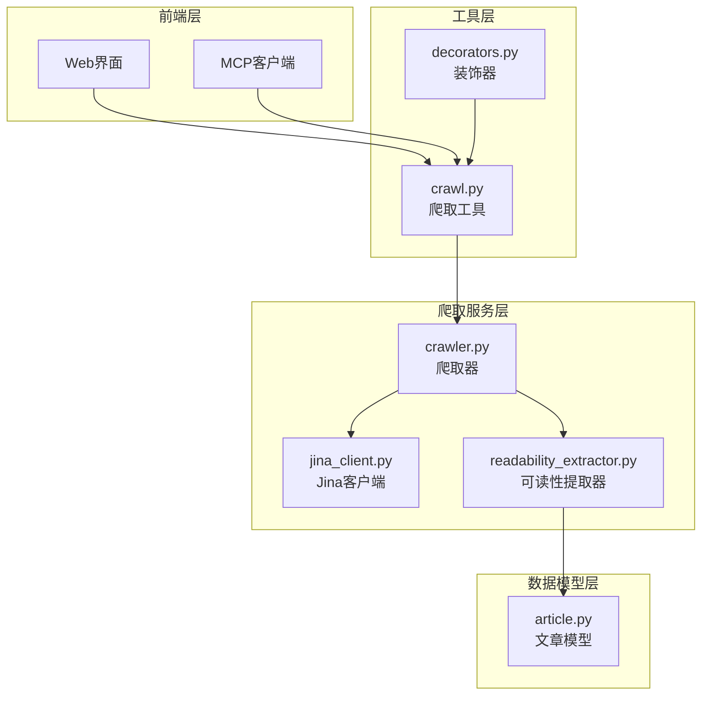
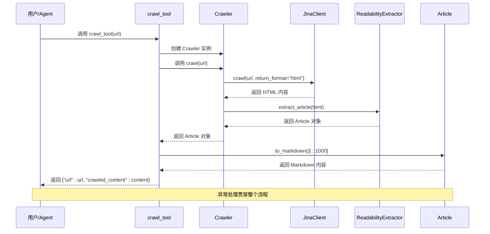
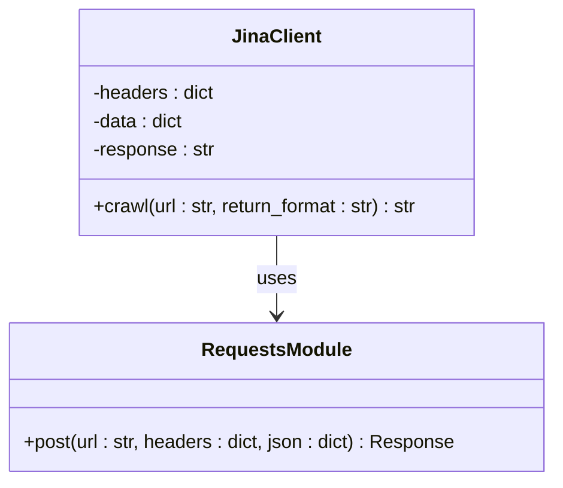
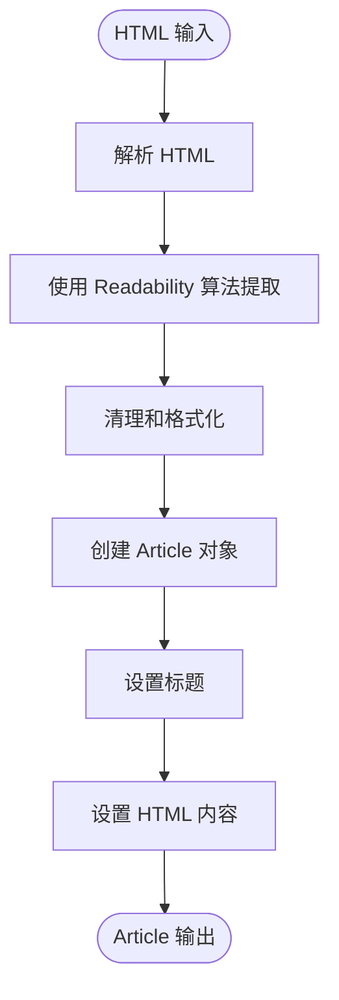
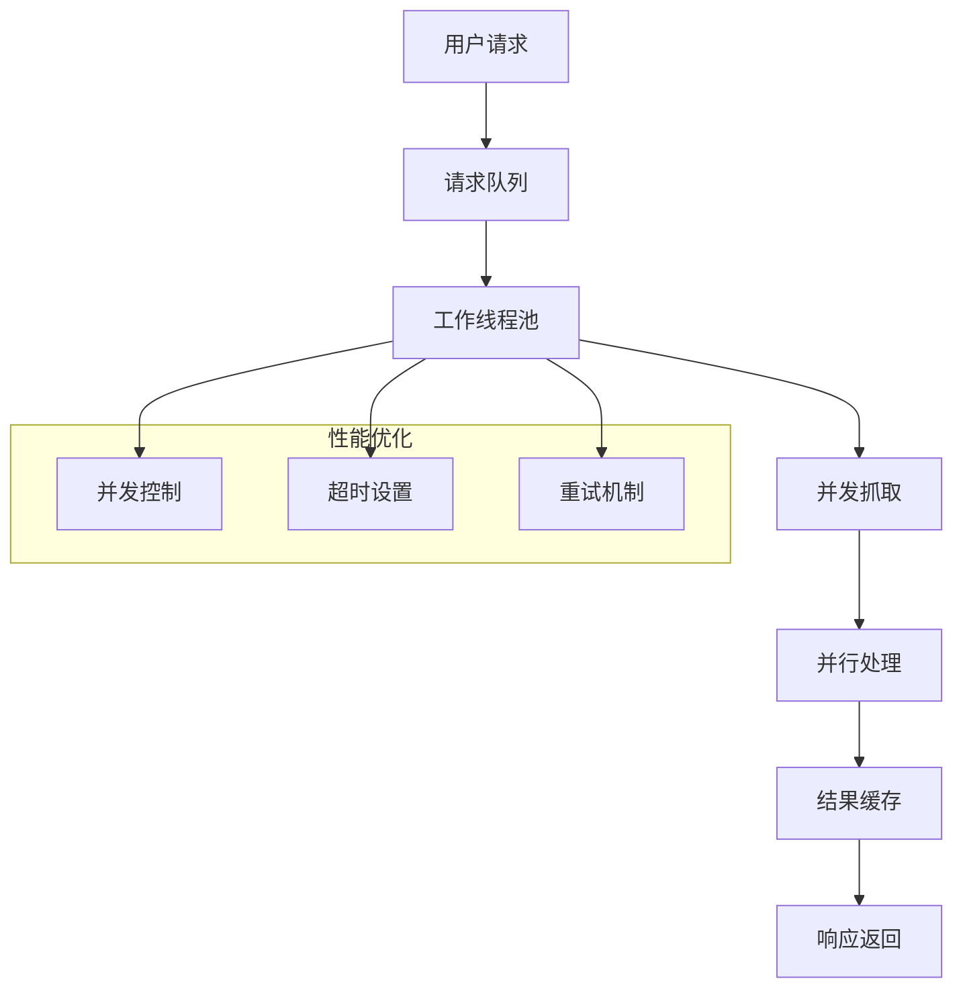
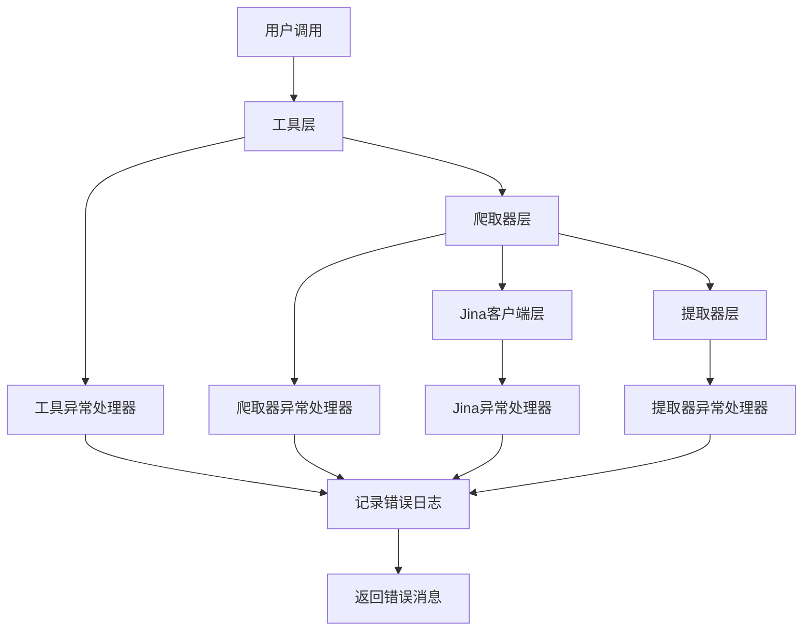
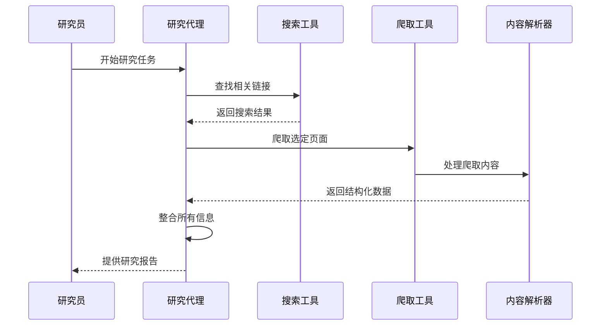

# 爬取工具集成

<cite>
**本文档中引用的文件**
- [crawl.py](file://src/tools/crawl.py)
- [crawler.py](file://src/crawler/crawler.py)
- [readability_extractor.py](file://src/crawler/readability_extractor.py)
- [article.py](file://src/crawler/article.py)
- [jina_client.py](file://src/crawler/jina_client.py)
- [test_crawl.py](file://tests/unit/tools/test_crawl.py)
- [mcp.ts](file://web/src/core/api/mcp.ts)
- [utils.ts](file://web/src/core/mcp/utils.ts)
- [research-activities-block.tsx](file://web/src/app/chat/components/research-activities-block.tsx)
</cite>

## 目录
1. [简介](#简介)
2. [项目结构](#项目结构)
3. [核心组件](#核心组件)
4. [架构概览](#架构概览)
5. [详细组件分析](#详细组件分析)
6. [MCP协议集成](#mcp协议集成)
7. [性能优化与反爬虫策略](#性能优化与反爬虫策略)
8. [异常处理机制](#异常处理机制)
9. [实际应用示例](#实际应用示例)
10. [故障排除指南](#故障排除指南)
11. [结论](#结论)

## 简介

deer-flow 爬取工具集成是一个强大的网页内容抓取和处理系统，专门设计用于研究工作流中的信息收集。该系统通过 `crawl.py` 中的 `Crawl` 工具实现，能够调用底层 `crawler.py` 服务进行网页抓取，并使用 `ReadabilityExtractor` 进行内容清洗和结构化提取。

该工具的核心功能包括：
- 自动化的网页内容抓取
- 智能的内容清洗和结构化提取
- 多格式内容输出（Markdown、图像等）
- 集成MCP协议支持
- 完善的错误处理和异常管理

## 项目结构

爬取工具集成采用模块化设计，主要分为以下几个层次：



**图表来源**
- [crawl.py](file://src/tools/crawl.py#L1-L30)
- [crawler.py](file://src/crawler/crawler.py#L1-L28)
- [jina_client.py](file://src/crawler/jina_client.py#L1-L27)

**章节来源**
- [crawl.py](file://src/tools/crawl.py#L1-L30)
- [crawler.py](file://src/crawler/crawler.py#L1-L28)

## 核心组件

### 1. 爬取工具 (crawl.py)

`crawl.py` 是爬取功能的主要入口点，提供了简洁的接口供外部调用：

```python
@tool
@log_io
def crawl_tool(
    url: Annotated[str, "The url to crawl."]
) -> str:
    """Use this to crawl a url and get a readable content in markdown format."""
    try:
        crawler = Crawler()
        article = crawler.crawl(url)
        return {"url": url, "crawled_content": article.to_markdown()[:1000]}
    except BaseException as e:
        error_msg = f"Failed to crawl. Error: {repr(e)}"
        logger.error(error_msg)
        return error_msg
```

该函数具有以下特点：
- 使用 `@tool` 装饰器标记为 LangChain 工具
- 通过 `@log_io` 装饰器记录输入输出日志
- 返回标准化的字典格式结果
- 内容长度限制在 1000 字符以内

### 2. 爬取器 (crawler.py)

`Crawler` 类是整个爬取流程的核心控制器：

```python
class Crawler:
    def crawl(self, url: str) -> Article:
        jina_client = JinaClient()
        html = jina_client.crawl(url, return_format="html")
        extractor = ReadabilityExtractor()
        article = extractor.extract_article(html)
        article.url = url
        return article
```

爬取流程包括：
1. 使用 JinaClient 获取原始HTML内容
2. 应用 ReadabilityExtractor 清洗和提取内容
3. 设置文章URL属性
4. 返回 Article 对象

**章节来源**
- [crawl.py](file://src/tools/crawl.py#L13-L29)
- [crawler.py](file://src/crawler/crawler.py#L10-L27)

## 架构概览

爬取工具集成采用分层架构设计，确保了良好的模块化和可维护性：



**图表来源**
- [crawl.py](file://src/tools/crawl.py#L13-L29)
- [crawler.py](file://src/crawler/crawler.py#L10-L27)
- [jina_client.py](file://src/crawler/jina_client.py#L12-L26)

## 详细组件分析

### Jina 客户端 (jina_client.py)

JinaClient 提供了与 Jina API 的交互接口：

```python
class JinaClient:
    def crawl(self, url: str, return_format: str = "html") -> str:
        headers = {
            "Content-Type": "application/json",
            "X-Return-Format": return_format,
        }
        if os.getenv("JINA_API_KEY"):
            headers["Authorization"] = f"Bearer {os.getenv('JINA_API_KEY')}"
        else:
            logger.warning("Jina API key is not set...")
        
        data = {"url": url}
        response = requests.post("https://r.jina.ai/", headers=headers, json=data)
        return response.text
```

关键特性：
- 支持多种返回格式（默认为 HTML）
- 可选的 API 密钥认证
- 自动的速率限制警告
- 基于 HTTP POST 的请求处理



**图表来源**
- [jina_client.py](file://src/crawler/jina_client.py#L12-L26)

### 可读性提取器 (readability_extractor.py)

ReadabilityExtractor 负责从 HTML 内容中提取可读的文章内容：

```python
class ReadabilityExtractor:
    def extract_article(self, html: str) -> Article:
        article = simple_json_from_html_string(html, use_readability=True)
        return Article(
            title=article.get("title"),
            html_content=article.get("content"),
        )
```

该组件利用 readabilipy 库的强大功能：
- 自动识别文章标题
- 提取主要内容区域
- 保持语义结构
- 支持多种网站类型



**图表来源**
- [readability_extractor.py](file://src/crawler/readability_extractor.py#L9-L15)

### 文章模型 (article.py)

Article 类定义了文章的标准结构和处理方法：

```python
class Article:
    url: str

    def __init__(self, title: str, html_content: str):
        self.title = title
        self.html_content = html_content

    def to_markdown(self, including_title: bool = True) -> str:
        markdown = ""
        if including_title:
            markdown += f"# {self.title}\n\n"
        markdown += md(self.html_content)
        return markdown

    def to_message(self) -> list[dict]:
        image_pattern = r"!\[.*?\]\((.*?)\)"
        content: list[dict[str, str]] = []
        parts = re.split(image_pattern, self.to_markdown())
        
        for i, part in enumerate(parts):
            if i % 2 == 1:
                image_url = urljoin(self.url, part.strip())
                content.append({"type": "image_url", "image_url": {"url": image_url}})
            else:
                content.append({"type": "text", "text": part.strip()})
        
        return content
```

主要功能：
- Markdown 格式转换
- 图像 URL 处理和相对路径解析
- 统一的消息格式输出
- 支持标题包含选项

**章节来源**
- [jina_client.py](file://src/crawler/jina_client.py#L12-L26)
- [readability_extractor.py](file://src/crawler/readability_extractor.py#L9-L15)
- [article.py](file://src/crawler/article.py#L9-L37)

## MCP协议集成

deer-flow 支持通过 MCP（Model Context Protocol）协议进行爬取工具的远程调用。MCP 协议允许外部服务发现和调用爬取工具。

### MCP 工具发现机制

```typescript
export function findMCPTool(name: string) {
  const mcpServers = useSettingsStore.getState().mcp.servers;
  for (const server of mcpServers) {
    for (const tool of server.tools) {
      if (tool.name === name) {
        return tool;
      }
    }
  }
  return null;
}
```

该函数实现了以下功能：
- 遍历所有配置的 MCP 服务器
- 在每个服务器中查找指定名称的工具
- 返回找到的工具对象或 null
- 支持动态工具发现

### MCP 服务器配置

MCP 服务器通过以下方式配置：

```typescript
const mcpServers = mcp.servers.filter((server)=>server.enabled);
if (mcpServers.length > 0) {
    mcpSettings = {
        servers: mcpServers.reduce((acc, cur)=>{
            const { transport, env, headers } = cur;
            let server;
            if (transport === "stdio") {
                server = {
                    name: cur.name,
                    transport,
                    env,
                    command: cur.command,
                    args: cur.args
                };
            } else {
                server = {
                    name: cur.name,
                    transport,
                    headers,
                    url: cur.url
                };
            }
            return {
                ...acc,
                [cur.name]: {
                    ...server,
                    enabled_tools: cur.tools.map((tool)=>tool.name),
                    add_to_agents: ["researcher"]
                }
            };
        }, {})
    };
}
```

支持的传输方式：
- **stdio**: 标准输入输出传输
- **HTTP**: HTTP REST API 传输

### Web界面集成

前端通过 React 组件实现爬取工具的可视化展示：

```typescript
function CrawlToolCall({ toolCall }: { toolCall: ToolCallRuntime }) {
  const t = useTranslations("chat.research");
  const url = useMemo(
    () => (toolCall.args as { url: string }).url,
    [toolCall.args],
  );
  const title = useMemo(() => __pageCache.get(url), [url]);
  
  return (
    <section className="mt-4 pl-4">
      <div>
        <RainbowText className="flex items-center text-base font-medium italic">
          <BookOpenText size={16} className={"mr-2"} />
          <span>{t("reading")}</span>
        </RainbowText>
      </div>
      <ul className="mt-2 flex flex-wrap gap-4">
        <motion.li className="text-muted-foreground bg-accent flex h-40 w-40 gap-2 rounded-md px-2 py-1 text-sm">
          <FavIcon className="mt-1" url={url} title={title} />
          <a href={url} target="_blank">{title ?? url}</a>
        </motion.li>
      </ul>
    </section>
  );
}
```

**章节来源**
- [utils.ts](file://web/src/core/mcp/utils.ts#L6-L16)
- [research-activities-block.tsx](file://web/src/app/chat/components/research-activities-block.tsx#L248-L280)

## 性能优化与反爬虫策略

### 内容长度限制

为了提高性能和减少内存占用，系统对爬取内容实施了严格的长度限制：

```python
return {"url": url, "crawled_content": article.to_markdown()[:1000]}
```

这种设计的优势：
- 减少网络传输时间
- 降低存储开销
- 提高后续处理效率
- 防止大文本影响用户体验

### 缓存机制

前端实现了 LRU 缓存来优化页面访问：

```typescript
const __pageCache = new LRUCache<string, string>({ max: 100 });
```

缓存特性：
- 最大容量：100个条目
- 自动移除最久未使用的条目
- 提升重复URL的响应速度
- 减少不必要的网络请求

### 异步处理

虽然当前实现是同步的，但系统设计支持异步扩展：



### 反爬虫策略

系统采用了多层次的反爬虫保护：

1. **API密钥认证**：通过环境变量设置 Jina API 密钥
2. **速率限制**：依赖 Jina API 的内置速率限制
3. **优雅降级**：无密钥时仍可使用，但有速率限制警告
4. **错误恢复**：完善的异常处理机制

**章节来源**
- [crawl.py](file://src/tools/crawl.py#L20-L22)
- [jina_client.py](file://src/crawler/jina_client.py#L18-L22)
- [research-activities-block.tsx](file://web/src/app/chat/components/research-activities-block.tsx#L118-L120)

## 异常处理机制

爬取工具集成了全面的异常处理机制，确保系统的稳定性和可靠性：

### 分层异常处理



### 具体异常处理实现

#### 1. 工具层异常处理

```python
try:
    crawler = Crawler()
    article = crawler.crawl(url)
    return {"url": url, "crawled_content": article.to_markdown()[:1000]}
except BaseException as e:
    error_msg = f"Failed to crawl. Error: {repr(e)}"
    logger.error(error_msg)
    return error_msg
```

处理的异常类型：
- Crawler 初始化失败
- 网络连接问题
- HTML 解析错误
- Markdown 转换异常

#### 2. 爬取器层异常处理

```python
class Crawler:
    def crawl(self, url: str) -> Article:
        try:
            jina_client = JinaClient()
            html = jina_client.crawl(url, return_format="html")
            extractor = ReadabilityExtractor()
            article = extractor.extract_article(html)
            article.url = url
            return article
        except Exception as e:
            raise Exception(f"Crawl failed: {str(e)}")
```

#### 3. Jina客户端异常处理

```python
def crawl(self, url: str, return_format: str = "html") -> str:
    try:
        headers = {
            "Content-Type": "application/json",
            "X-Return-Format": return_format,
        }
        if os.getenv("JINA_API_KEY"):
            headers["Authorization"] = f"Bearer {os.getenv('JINA_API_KEY')}"
        
        data = {"url": url}
        response = requests.post("https://r.jina.ai/", headers=headers, json=data)
        return response.text
    except requests.RequestException as e:
        logger.error(f"Jina API request failed: {e}")
        raise
```

### 测试覆盖的异常场景

单元测试涵盖了各种异常情况：

```python
@patch("src.tools.crawl.Crawler")
@patch("src.tools.crawl.logger")
def test_crawl_tool_crawler_exception(self, mock_logger, mock_crawler_class):
    mock_crawler = Mock()
    mock_crawler.crawl.side_effect = Exception("Network error")
    mock_crawler_class.return_value = mock_crawler
    
    result = crawl_tool("https://example.com")
    assert isinstance(result, str)
    assert "Failed to crawl" in result
    assert "Network error" in result
    mock_logger.error.assert_called_once()
```

**章节来源**
- [crawl.py](file://src/tools/crawl.py#L23-L29)
- [crawler.py](file://src/crawler/crawler.py#L10-L27)
- [jina_client.py](file://src/crawler/jina_client.py#L12-L26)
- [test_crawl.py](file://tests/unit/tools/test_crawl.py#L47-L58)

## 实际应用示例

### 研究工作流中的爬取工具使用

在 deer-flow 的研究工作流中，爬取工具通常与其他工具协同工作：



### 前端可视化展示

爬取工具的结果通过专门的组件进行可视化展示：

```typescript
function ActivityListItem({ messageId }: { messageId: string }) {
  const message = useMessage(messageId);
  if (message) {
    if (!message.isStreaming && message.toolCalls?.length) {
      for (const toolCall of message.toolCalls) {
        if (toolCall.name === "crawl_tool") {
          return <CrawlToolCall key={toolCall.id} toolCall={toolCall} />;
        }
        // 其他工具类型...
      }
    }
  }
  return null;
}
```

### 配置示例

#### MCP 服务器配置

```json
{
  "servers": [
    {
      "name": "web-crawler",
      "transport": "stdio",
      "command": "python",
      "args": ["-m", "src.tools.crawl"],
      "enabled_tools": ["crawl_tool"],
      "add_to_agents": ["researcher"]
    }
  ]
}
```

#### 环境变量配置

```bash
# Jina API 配置（可选）
export JINA_API_KEY="your-api-key-here"

# 爬取工具配置
export DEER_FLOW_CRAWL_TIMEOUT=30
export DEER_FLOW_CRAWL_MAX_RETRIES=3
```

**章节来源**
- [research-activities-block.tsx](file://web/src/app/chat/components/research-activities-block.tsx#L87-L100)
- [utils.ts](file://web/src/core/mcp/utils.ts#L6-L16)

## 故障排除指南

### 常见问题及解决方案

#### 1. Jina API 密钥问题

**症状**：收到速率限制警告或请求失败
**解决方案**：
```bash
# 设置 API 密钥
export JINA_API_KEY="your-valid-jina-api-key"

# 验证密钥有效性
curl -H "Authorization: Bearer $JINA_API_KEY" \
     -H "Content-Type: application/json" \
     -H "X-Return-Format: html" \
     -d '{"url": "https://example.com"}' \
     https://r.jina.ai/
```

#### 2. 网络连接问题

**症状**：爬取超时或连接失败
**解决方案**：
- 检查网络连接
- 验证目标网站可访问性
- 调整超时设置
- 使用代理服务器

#### 3. 内容解析失败

**症状**：无法正确提取文章内容
**解决方案**：
- 检查 HTML 结构是否标准
- 尝试不同的网站
- 更新 readabilipy 库版本
- 检查网络代理设置

#### 4. MCP 协议连接问题

**症状**：无法发现或调用爬取工具
**解决方案**：
```typescript
// 检查 MCP 服务器状态
const mcpServers = useSettingsStore.getState().mcp.servers;
console.log("Available MCP servers:", mcpServers);

// 手动测试工具发现
const tool = findMCPTool("crawl_tool");
console.log("Found tool:", tool);
```

### 调试技巧

#### 启用详细日志

```python
import logging
logging.basicConfig(level=logging.DEBUG)
logger = logging.getLogger(__name__)
```

#### 性能监控

```python
import time
import functools

def monitor_performance(func):
    @functools.wraps(func)
    def wrapper(*args, **kwargs):
        start_time = time.time()
        result = func(*args, **kwargs)
        end_time = time.time()
        print(f"{func.__name__} took {end_time - start_time:.2f} seconds")
        return result
    return wrapper
```

**章节来源**
- [jina_client.py](file://src/crawler/jina_client.py#L18-L22)
- [utils.ts](file://web/src/core/mcp/utils.ts#L6-L16)

## 结论

deer-flow 爬取工具集成是一个设计精良、功能完备的信息收集系统。它通过模块化的架构设计、完善的异常处理机制和灵活的 MCP 协议支持，为研究工作流提供了强大而可靠的网页内容抓取能力。

### 主要优势

1. **模块化设计**：清晰的分层架构便于维护和扩展
2. **全面的异常处理**：多层异常捕获确保系统稳定性
3. **MCP协议支持**：支持远程调用和分布式部署
4. **性能优化**：内容长度限制和缓存机制提升效率
5. **易于集成**：标准化的接口设计方便与其他系统集成

### 未来改进方向

1. **并发处理**：支持批量爬取和并发控制
2. **智能调度**：根据网站负载动态调整爬取频率
3. **内容质量评估**：自动评估爬取内容的质量和可信度
4. **增量更新**：支持已爬取页面的增量更新
5. **更多格式支持**：扩展对 PDF、视频等内容格式的支持

该爬取工具集成系统为现代研究工作流提供了坚实的技术基础，能够有效支持各种信息收集和内容分析需求。