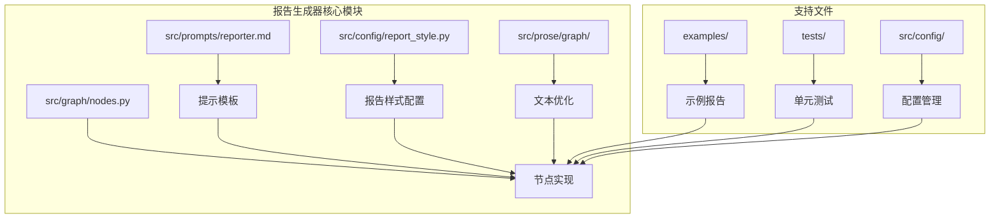
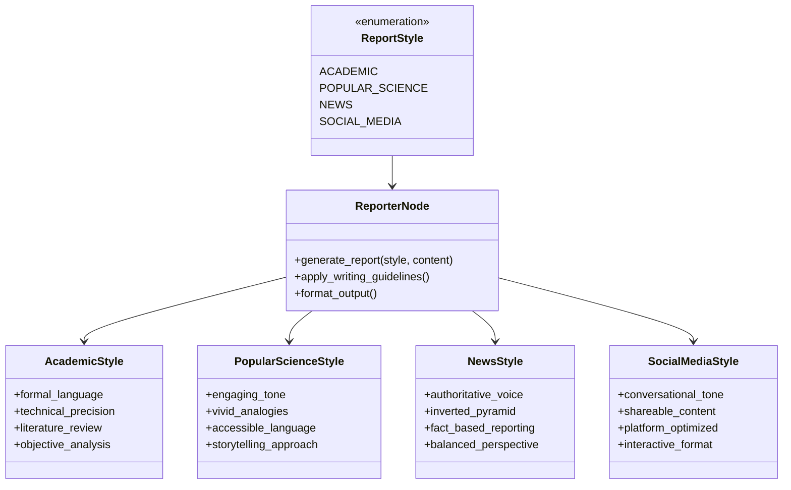
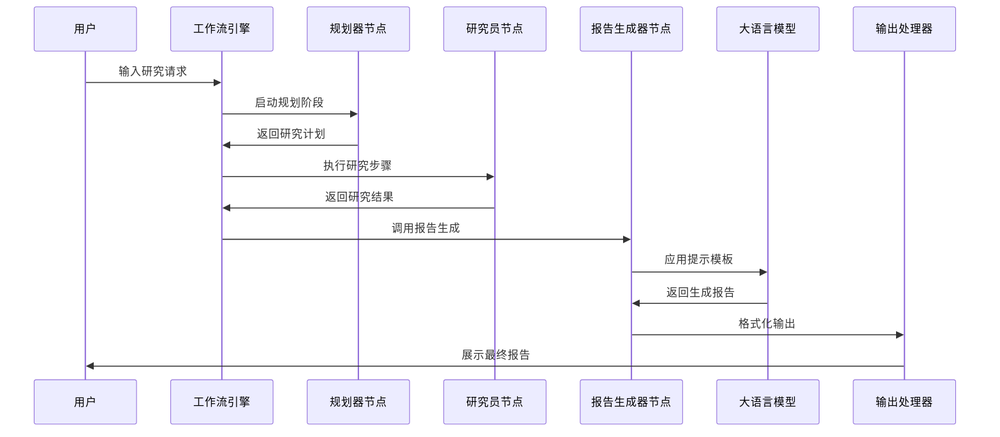
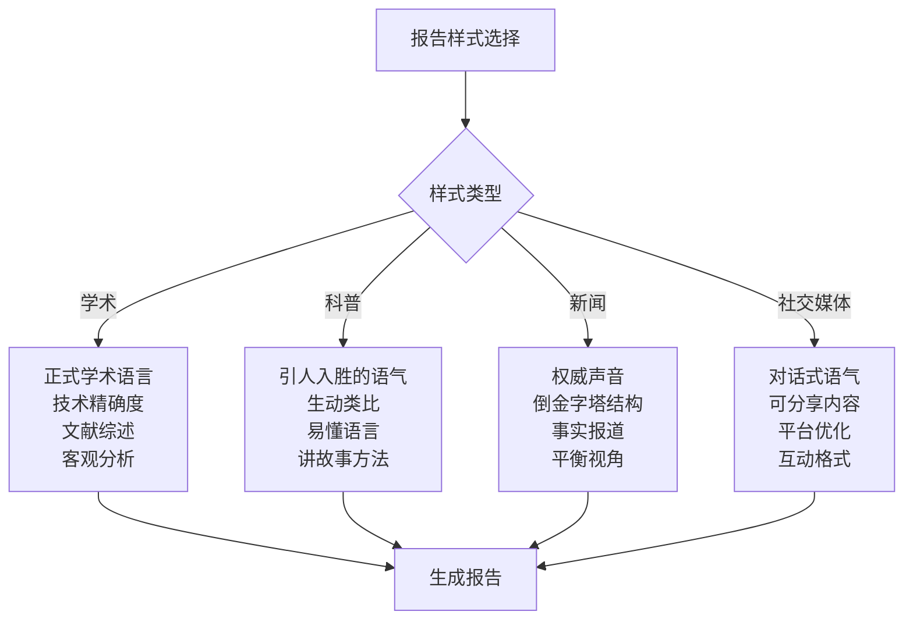
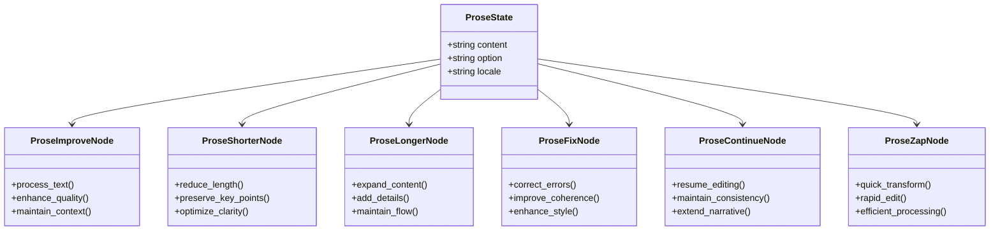
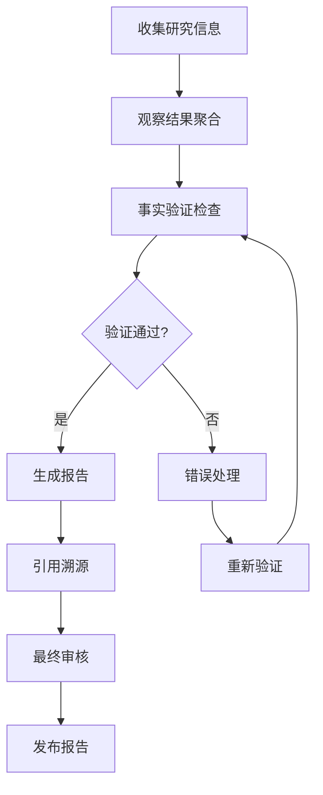
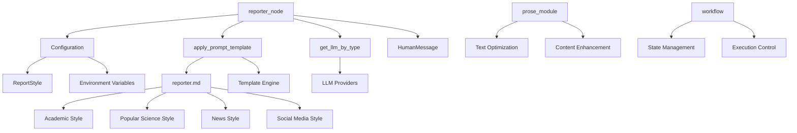

# 报告生成器

<cite>
**本文档中引用的文件**
- [reporter.md](file://src/prompts/reporter.md)
- [report_style.py](file://src/config/report_style.py)
- [nodes.py](file://src/graph/nodes.py)
- [builder.py](file://src/prose/graph/builder.py)
- [prose_improver.md](file://src/prompts/prose/prose_improver.md)
- [workflow.py](file://src/workflow.py)
- [configuration.py](file://src/config/configuration.py)
- [openai_sora_report.md](file://examples/openai_sora_report.md)
- [test_nodes.py](file://tests/integration/test_nodes.py)
</cite>

## 目录
1. [简介](#简介)
2. [项目结构](#项目结构)
3. [核心组件](#核心组件)
4. [架构概览](#架构概览)
5. [详细组件分析](#详细组件分析)
6. [依赖关系分析](#依赖关系分析)
7. [性能考虑](#性能考虑)
8. [故障排除指南](#故障排除指南)
9. [结论](#结论)

## 简介

报告生成器是deer-flow系统中的核心组件，负责整合来自多个研究步骤的信息，生成结构化、高质量的研究报告。该系统通过reporter_node实现，能够根据不同的报告样式和写作风格生成定制化的研究报告。

报告生成器的主要特点包括：
- 支持多种报告样式（学术、科普、新闻、社交媒体）
- 提供结构化的报告模板
- 集成文本优化功能
- 支持多语言本地化
- 确保报告内容的准确性和一致性

## 项目结构

报告生成器的代码组织遵循模块化设计原则，主要包含以下关键目录和文件：



**图表来源**
- [reporter.md](file://src/prompts/reporter.md#L1-L280)
- [report_style.py](file://src/config/report_style.py#L1-L9)
- [nodes.py](file://src/graph/nodes.py#L263-L300)

**章节来源**
- [workflow.py](file://src/workflow.py#L1-L104)
- [nodes.py](file://src/graph/nodes.py#L1-L512)

## 核心组件

### reporter_node函数

reporter_node是报告生成器的核心函数，负责协调整个报告生成过程：

```python
def reporter_node(state: State, config: RunnableConfig):
    """Reporter node that write a final report."""
    logger.info("Reporter write final report")
    configurable = Configuration.from_runnable_config(config)
    current_plan = state.get("current_plan")
    input_ = {
        "messages": [
            HumanMessage(
                f"# Research Requirements\n\n## Task\n\n{current_plan.title}\n\n## Description\n\n{current_plan.thought}"
            )
        ],
        "locale": state.get("locale", "en-US"),
    }
    invoke_messages = apply_prompt_template("reporter", input_, configurable)
    observations = state.get("observations", [])
```

该函数的主要工作流程包括：
1. **状态初始化**：从输入状态中提取当前计划和观察结果
2. **消息构建**：创建包含研究要求的消息对象
3. **模板应用**：应用reporter.md提示模板
4. **观察处理**：添加所有观察结果到生成过程中
5. **LLM调用**：使用配置的LLM生成最终报告
6. **结果返回**：返回生成的最终报告

**章节来源**
- [nodes.py](file://src/graph/nodes.py#L263-L300)

### 报告样式系统

系统支持四种主要的报告样式，每种样式都有其特定的目标受众和写作风格：



**图表来源**
- [report_style.py](file://src/config/report_style.py#L1-L9)
- [reporter.md](file://src/prompts/reporter.md#L1-L50)

**章节来源**
- [report_style.py](file://src/config/report_style.py#L1-L9)
- [reporter.md](file://src/prompts/reporter.md#L1-L280)

## 架构概览

报告生成器采用基于LangGraph的状态机架构，实现了高度模块化和可扩展的设计：



**图表来源**
- [workflow.py](file://src/workflow.py#L25-L70)
- [nodes.py](file://src/graph/nodes.py#L263-L300)

## 详细组件分析

### reporter.md提示模板设计

reporter.md是报告生成器的核心提示模板，它包含了完整的报告结构和写作风格指导：

#### 报告结构规范

模板定义了标准化的报告结构，确保生成的报告具有清晰的逻辑层次：

```markdown
# 报告结构

1. **标题**
   - 始终使用一级标题作为标题
   - 报告的简洁标题

2. **关键要点**
   - 最重要发现的项目符号列表（4-6个要点）
   - 每个要点应简洁（1-2句话）
   - 专注于最重要和可操作的信息

3. **概述**
   - 主题的简要介绍（1-2段）
   - 提供背景和重要性

4. **详细分析**
   - 按清晰标题组织信息
   - 包含相关子节
   - 以结构化、易于跟随的方式呈现信息
   - 强调意外或特别值得注意的细节
```

#### 写作风格控制

模板根据不同报告样式提供了详细的写作风格指导：



**图表来源**
- [reporter.md](file://src/prompts/reporter.md#L1-L280)

#### 引用格式控制

模板严格规定了引用格式，确保报告的学术性和可信度：

```markdown
# 引用格式规范

- 只使用输入中明确提供的信息
- 当数据缺失时声明"未提供信息"
- 绝对不要创造虚构的例子或场景
- 如果数据似乎不完整，承认限制
- 不要假设缺失的信息

# 引用格式

在"关键引用"部分列出所有参考文献，使用链接引用格式：
- [源标题](URL)

每个引用之间留空行以提高可读性。
```

**章节来源**
- [reporter.md](file://src/prompts/reporter.md#L1-L280)

### prose模块文本优化功能

prose模块提供了强大的文本改进工具，支持多种文本优化操作：



**图表来源**
- [builder.py](file://src/prose/graph/builder.py#L1-L69)

**章节来源**
- [builder.py](file://src/prose/graph/builder.py#L1-L69)
- [prose_improver.md](file://src/prompts/prose/prose_improver.md#L1-L3)

### 大型上下文窗口处理

reporter_node具备处理大型上下文窗口的能力，这对于生成全面的报告至关重要：

```python
# 添加关于新报告格式、引用样式和表格使用的提醒
invoke_messages.append(
    HumanMessage(
        content="IMPORTANT: 根据提示中的格式结构您的报告。请记住包括：\n\n1. 关键要点 - 最重要发现的项目符号列表\n2. 概述 - 主题的简要介绍\n3. 详细分析 - 组织成逻辑部分\n4. 调查笔记（可选）- 对于更全面的报告\n5. 关键引用 - 在末尾列出所有引用\n\n对于引用，不要在文中包含内联引用。相反，在'关键引用'部分使用链接引用格式放置所有引用。每个引用之间留空行以提高可读性。\n\n优先使用Markdown表格进行数据展示和比较。当呈现对比数据、统计信息、功能或选项时使用表格。用清晰的标题和对齐的列结构表格。",
        name="system",
    )
)
```

这种设计确保了：
- **上下文完整性**：保留所有重要的研究信息
- **格式一致性**：确保报告符合预期的结构
- **引用准确性**：维护正确的引用格式
- **数据可视化**：支持复杂的表格和数据展示

**章节来源**
- [nodes.py](file://src/graph/nodes.py#L280-L300)

### 事实核查和引用溯源机制

系统通过多层次的验证机制确保报告内容的准确性和可靠性：



**章节来源**
- [nodes.py](file://src/graph/nodes.py#L263-L300)

## 依赖关系分析

报告生成器的依赖关系体现了系统的模块化设计：



**图表来源**
- [nodes.py](file://src/graph/nodes.py#L1-L50)
- [configuration.py](file://src/config/configuration.py#L1-L71)

**章节来源**
- [nodes.py](file://src/graph/nodes.py#L1-L512)
- [configuration.py](file://src/config/configuration.py#L1-L71)

## 性能考虑

报告生成器在设计时充分考虑了性能优化：

### 上下文窗口优化

- **智能截断**：自动识别并保留最重要的信息
- **压缩算法**：使用高效的文本压缩技术
- **增量处理**：支持逐步生成和更新报告

### 并发处理能力

- **异步执行**：支持并发的LLM调用
- **资源池管理**：优化LLM资源的使用
- **缓存机制**：缓存常用的模板和配置

### 内存管理

- **流式处理**：避免一次性加载大量数据
- **垃圾回收**：及时释放不需要的对象
- **内存监控**：实时监控内存使用情况

## 故障排除指南

### 常见问题及解决方案

#### 报告生成失败

**问题症状**：reporter_node抛出异常或返回空结果

**可能原因**：
1. LLM服务不可用
2. 提示模板格式错误
3. 输入状态不完整

**解决方案**：
```python
# 检查LLM连接
try:
    response = get_llm_by_type(AGENT_LLM_MAP["reporter"]).invoke(messages)
except Exception as e:
    logger.error(f"LLM invocation failed: {e}")
    # 实施降级策略
```

#### 报告格式不正确

**问题症状**：生成的报告缺少预期的结构元素

**可能原因**：
1. 提示模板被修改
2. 模板应用函数错误
3. LLM理解偏差

**解决方案**：
- 验证reporter.md模板的完整性
- 检查apply_prompt_template函数的实现
- 调整LLM的温度参数以改善输出质量

#### 性能问题

**问题症状**：报告生成速度过慢

**可能原因**：
1. 上下文窗口过大
2. LLM响应时间长
3. 并发请求过多

**解决方案**：
- 优化上下文窗口大小
- 实施请求队列管理
- 使用更快的LLM模型

**章节来源**
- [test_nodes.py](file://tests/integration/test_nodes.py#L750-L862)

## 结论

报告生成器是deer-flow系统中的关键组件，它通过精心设计的架构和丰富的功能特性，实现了高质量研究报告的自动化生成。系统的主要优势包括：

### 核心优势

1. **多样化报告样式**：支持学术、科普、新闻和社交媒体等多种风格
2. **结构化输出**：确保报告具有清晰的逻辑结构和格式规范
3. **智能优化**：集成prose模块提供文本质量提升功能
4. **多语言支持**：支持不同地区的本地化需求
5. **可扩展架构**：模块化设计便于功能扩展和维护

### 技术创新

- **提示工程**：通过精心设计的提示模板控制生成质量
- **状态管理**：基于LangGraph的状态机架构确保流程可控
- **异步处理**：支持高并发的报告生成任务
- **错误处理**：完善的异常处理和恢复机制

### 应用前景

报告生成器不仅适用于科学研究领域，还可以广泛应用于：
- 企业市场调研报告
- 学术论文摘要生成
- 新闻事件深度分析
- 社交媒体内容创作
- 教育材料制作

通过持续的优化和功能扩展，报告生成器将成为人工智能辅助内容创作的重要工具，为用户提供高效、准确、专业的报告生成服务。