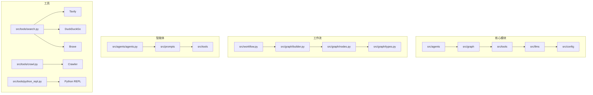
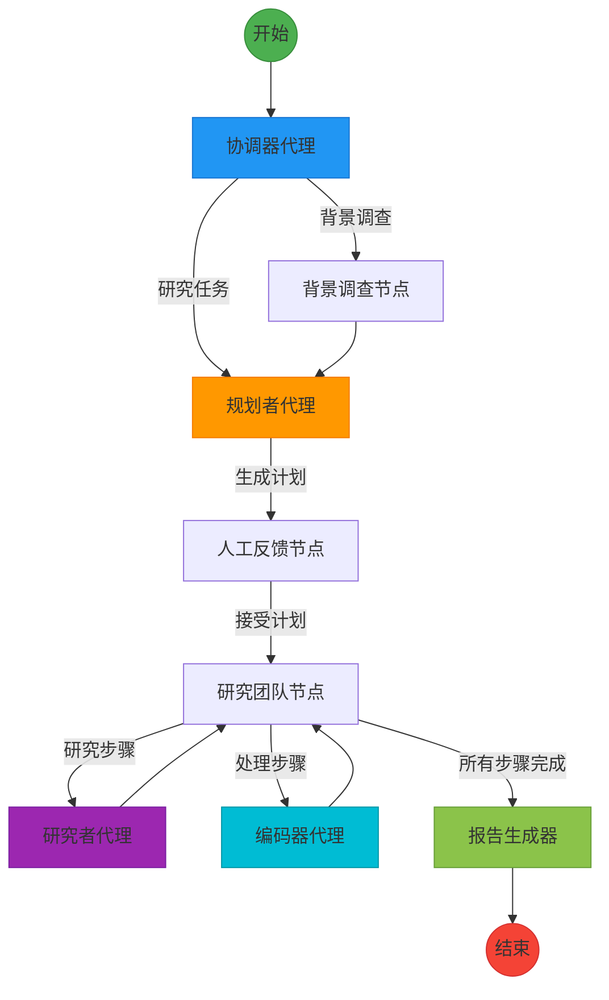
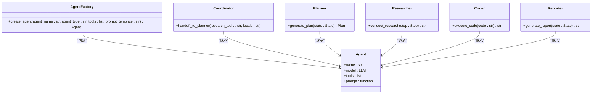
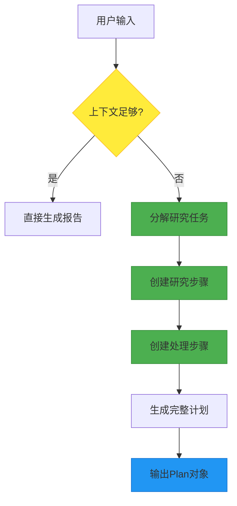
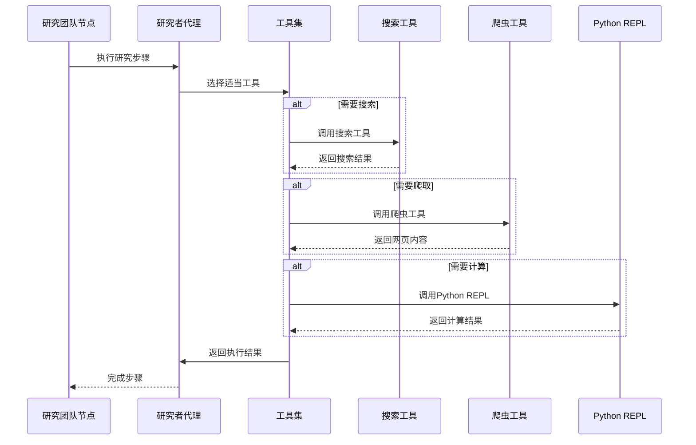
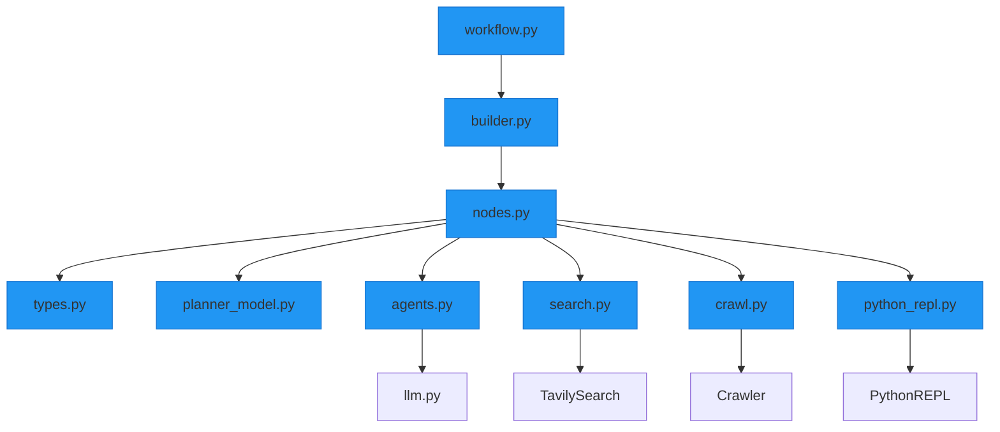

# 核心功能模块

<cite>
**本文档中引用的文件**  
- [workflow.py](file://src/workflow.py)
- [builder.py](file://src/graph/builder.py)
- [nodes.py](file://src/graph/nodes.py)
- [types.py](file://src/graph/types.py)
- [planner_model.py](file://src/prompts/planner_model.py)
- [agents.py](file://src/agents/agents.py)
- [search.py](file://src/tools/search.py)
- [crawl.py](file://src/tools/crawl.py)
- [python_repl.py](file://src/tools/python_repl.py)
- [configuration.py](file://src/config/configuration.py)
- [coordinator.md](file://src/prompts/coordinator.md)
- [planner.md](file://src/prompts/planner.md)
- [reporter.md](file://src/prompts/reporter.md)
</cite>

## 目录
1. [简介](#简介)
2. [项目结构](#项目结构)
3. [核心组件](#核心组件)
4. [架构概述](#架构概述)
5. [详细组件分析](#详细组件分析)
6. [依赖分析](#依赖分析)
7. [性能考虑](#性能考虑)
8. [故障排除指南](#故障排除指南)
9. [结论](#结论)

## 简介
DeerFlow 是一个基于多智能体系统的深度研究框架，旨在通过协调多个专业智能体来完成复杂的研究任务。该系统采用先进的工作流引擎，将用户问题分解为可执行的研究计划，并通过专门的执行引擎收集信息，最终生成结构化的高质量报告。本文档详细介绍了 DeerFlow 的核心功能模块，包括多智能体系统设计、任务规划器、研究执行引擎和报告生成器的实现细节。

## 项目结构
DeerFlow 项目采用模块化设计，各功能组件清晰分离。核心功能主要分布在 `src` 目录下，包括智能体、配置、爬虫、图工作流、大语言模型、工具等模块。系统通过图结构（graph）组织工作流，实现智能体之间的协调与数据流转。

**图来源**  
- [builder.py](file://src/graph/builder.py#L1-L88)
- [nodes.py](file://src/graph/nodes.py#L1-L512)
- [types.py](file://src/graph/types.py#L1-L25)

**节来源**  
- [workflow.py](file://src/workflow.py#L1-L104)
- [builder.py](file://src/graph/builder.py#L1-L88)

## 核心组件
DeerFlow 的核心功能由多个协同工作的组件构成，包括协调器代理、规划者代理、研究执行引擎和报告生成器。这些组件通过图工作流引擎连接，形成一个完整的端到端研究系统。

**节来源**  
- [workflow.py](file://src/workflow.py#L1-L104)
- [builder.py](file://src/graph/builder.py#L1-L88)

## 架构概述
DeerFlow 采用基于状态图的架构，通过定义明确的状态转换来管理研究工作流。系统从用户输入开始，经过协调、规划、执行和报告生成等阶段，最终输出结构化报告。

**图来源**  
- [builder.py](file://src/graph/builder.py#L1-L88)
- [nodes.py](file://src/graph/nodes.py#L1-L512)

**节来源**  
- [workflow.py](file://src/workflow.py#L1-L104)
- [builder.py](file://src/graph/builder.py#L1-L88)

## 详细组件分析
本节深入分析 DeerFlow 的各个核心组件，包括其接口定义、调用关系和配置选项。

### 多智能体系统设计
DeerFlow 的多智能体系统由多个专业代理组成，每个代理负责特定的任务。系统通过 `create_agent` 工厂函数创建代理，确保一致的配置和行为。

**图来源**  
- [agents.py](file://src/agents/agents.py#L1-L20)
- [nodes.py](file://src/graph/nodes.py#L1-L512)

**节来源**  
- [agents.py](file://src/agents/agents.py#L1-L20)
- [nodes.py](file://src/graph/nodes.py#L1-L512)

### 任务规划器
规划者代理负责将用户问题分解为可执行的研究计划。它使用结构化输出模式生成符合 `Plan` 模型的 JSON 格式计划。

**图来源**  
- [planner_model.py](file://src/prompts/planner_model.py#L1-L59)
- [planner.md](file://src/prompts/planner.md#L1-L188)

**节来源**  
- [nodes.py](file://src/graph/nodes.py#L1-L512)
- [planner_model.py](file://src/prompts/planner_model.py#L1-L59)

### 研究执行引擎
研究执行引擎负责调用各种工具来收集信息和执行代码。它通过 `researcher_node` 和 `coder_node` 实现，支持搜索、爬虫和 Python REPL 等功能。

**图来源**  
- [nodes.py](file://src/graph/nodes.py#L1-L512)
- [search.py](file://src/tools/search.py#L1-L114)
- [crawl.py](file://src/tools/crawl.py#L1-L30)
- [python_repl.py](file://src/tools/python_repl.py#L1-L64)

**节来源**  
- [nodes.py](file://src/graph/nodes.py#L1-L512)
- [search.py](file://src/tools/search.py#L1-L114)

### 报告生成器
报告生成器负责整合研究结果并生成结构化报告。它遵循严格的格式要求，包括关键点、概述、详细分析和引用等部分。

**图来源**  
- [reporter.md](file://src/prompts/reporter.md#L1-L50)
- [nodes.py](file://src/graph/nodes.py#L1-L512)

**节来源**  
- [nodes.py](file://src/graph/nodes.py#L1-L512)
- [reporter.md](file://src/prompts/reporter.md#L1-L50)

## 依赖分析
DeerFlow 的组件之间存在明确的依赖关系，通过图工作流引擎进行协调。系统依赖于多个外部服务和库来实现其功能。

**图来源**  
- [workflow.py](file://src/workflow.py#L1-L104)
- [builder.py](file://src/graph/builder.py#L1-L88)
- [nodes.py](file://src/graph/nodes.py#L1-L512)

**节来源**  
- [workflow.py](file://src/workflow.py#L1-L104)
- [builder.py](file://src/graph/builder.py#L1-L88)

## 性能考虑
DeerFlow 的性能受多个因素影响，包括 LLM 调用次数、工具执行时间和递归限制。系统通过配置选项优化性能。

**配置选项**
- **递归限制**: 通过 `AGENT_RECURSION_LIMIT` 环境变量控制，默认值为 25
- **搜索结果数量**: 通过 `max_search_results` 配置，影响搜索工具的性能
- **计划迭代次数**: 通过 `max_plan_iterations` 配置，控制规划过程的复杂度
- **步骤数量**: 通过 `max_step_num` 配置，限制单个计划的步骤数

**性能优化建议**
1. 合理设置递归限制，避免无限循环
2. 根据需求调整搜索结果数量，平衡信息量和性能
3. 优化计划步骤，减少不必要的研究任务
4. 启用缓存机制，避免