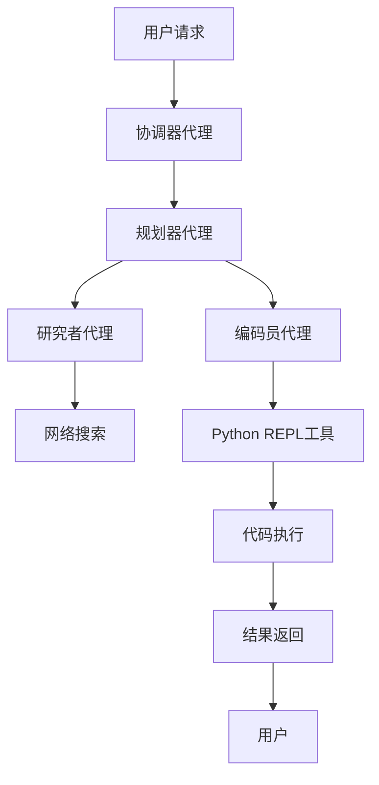

# 代码执行

<cite>
**本文档引用的文件**   
- [python_repl.py](file://src/tools/python_repl.py)
- [decorators.py](file://src/tools/decorators.py)
- [nodes.py](file://src/graph/nodes.py)
- [coder.md](file://src/prompts/coder.md)
- [test_python_repl.py](file://tests/unit/tools/test_python_repl.py)
</cite>

## 目录
1. [简介](#简介)
2. [项目结构](#项目结构)
3. [核心组件](#核心组件)
4. [架构概述](#架构概述)
5. [详细组件分析](#详细组件分析)
6. [依赖分析](#依赖分析)
7. [性能考虑](#性能考虑)
8. [故障排除指南](#故障排除指南)
9. [结论](#结论)
10. [附录](#附录) (如有必要)

## 简介
本文档详细阐述了代码执行功能，重点分析了`python_repl.py`中Python代码执行环境的安全沙箱实现。文档深入探讨了如何限制危险操作、设置执行超时和内存限制，以及代码执行结果的捕获机制。同时，解释了研究者代理和编码员代理如何协同工作，从生成代码到执行验证的完整流程。提供了实际代码示例展示数学计算、数据处理等典型应用场景，并阐述了系统如何防范恶意代码注入和资源耗尽攻击。最后，为开发者提供了安全扩展代码执行功能的指南。

## 项目结构
项目结构清晰地组织了代码执行相关的组件。核心的Python REPL工具位于`src/tools/python_repl.py`，而相关的装饰器和日志功能则在`src/tools/decorators.py`中定义。代理节点的逻辑在`src/graph/nodes.py`中实现，编码员代理的提示模板位于`src/prompts/coder.md`。测试文件位于`tests/unit/tools/test_python_repl.py`，用于验证工具的正确性。

**Section sources**
- [python_repl.py](file://src/tools/python_repl.py)
- [decorators.py](file://src/tools/decorators.py)
- [nodes.py](file://src/graph/nodes.py)
- [coder.md](file://src/prompts/coder.md)
- [test_python_repl.py](file://tests/unit/tools/test_python_repl.py)

## 核心组件
核心组件包括Python REPL工具、装饰器、代理节点和提示模板。Python REPL工具负责执行代码，装饰器用于日志记录，代理节点定义了研究者和编码员的工作流程，提示模板指导编码员代理的行为。

**Section sources**
- [python_repl.py](file://src/tools/python_repl.py)
- [decorators.py](file://src/tools/decorators.py)
- [nodes.py](file://src/graph/nodes.py)
- [coder.md](file://src/prompts/coder.md)

## 架构概述
系统架构通过代理协作实现代码执行。研究者代理负责信息收集，编码员代理负责代码生成和执行。编码员代理使用Python REPL工具执行代码，并通过日志记录工具记录输入输出。整个流程由节点函数协调，确保任务的顺利执行。



**Diagram sources **
- [nodes.py](file://src/graph/nodes.py)
- [python_repl.py](file://src/tools/python_repl.py)

## 详细组件分析

### Python REPL工具分析
Python REPL工具是代码执行的核心。它通过`langchain_experimental.utilities.PythonREPL`类实现，支持执行Python代码并捕获输出。工具通过环境变量`ENABLE_PYTHON_REPL`控制是否启用，确保安全性。

#### 类图
```mermaid
classDiagram
    class PythonREPL {
