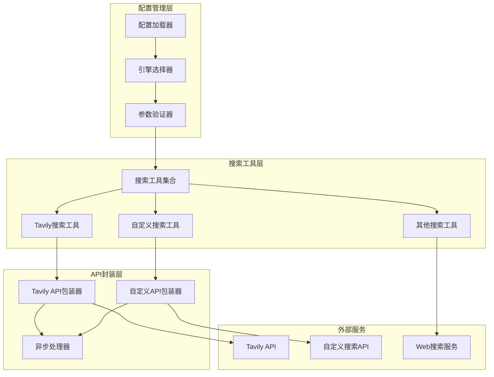
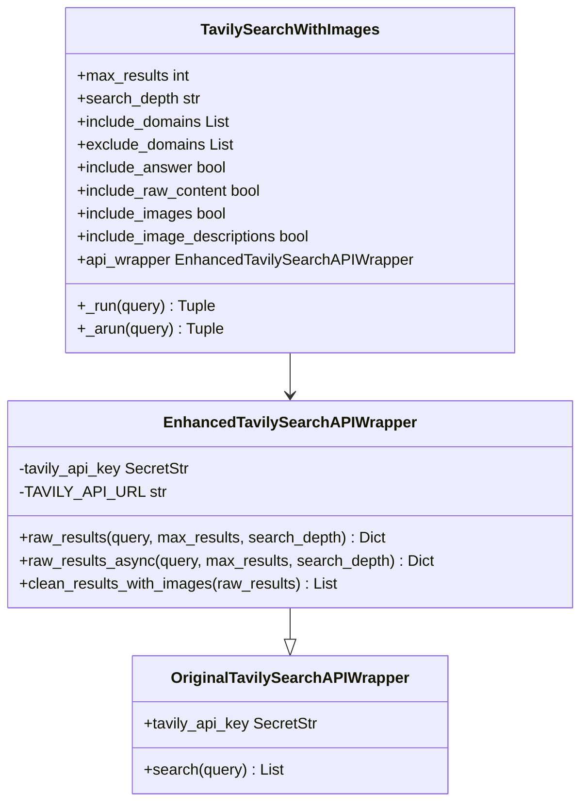
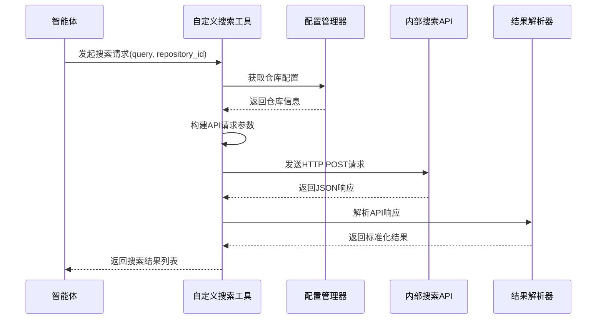

现在我已经收集了足够的信息来创建关于搜索集成的详细技术文档。让我开始编写文档：

<docs>
# 搜索集成

<cite>
**本文档引用的文件**
- [search.py](file://src/tools/search.py)
- [tavily_search_api_wrapper.py](file://src/tools/tavily_search/tavily_search_api_wrapper.py)
- [tavily_search_results_with_images.py](file://src/tools/tavily_search/tavily_search_results_with_images.py)
- [custom_search.py](file://src/tools/custom_search.py)
- [tools.py](file://src/config/tools.py)
- [custom_search.py](file://src/config/custom_search.py)
- [conf.yaml](file://conf.yaml)
- [mock_search_api.py](file://middlewares/search/mock_search_api.py)
- [test_tavily_search_api_wrapper.py](file://tests/unit/tools/test_tavily_search_api_wrapper.py)
</cite>

## 目录
1. [简介](#简介)
2. [项目架构概览](#项目架构概览)
3. [核心组件分析](#核心组件分析)
4. [Tavily搜索集成](#tavily搜索集成)
5. [自定义搜索集成](#自定义搜索集成)
6. [搜索配置管理](#搜索配置管理)
7. [API封装层](#api封装层)
8. [错误处理与监控](#错误处理与监控)
9. [性能优化策略](#性能优化策略)
10. [故障排除指南](#故障排除指南)
11. [总结](#总结)

## 简介

DeerFlow搜索集成系统是一个高度模块化和可扩展的搜索解决方案，旨在为智能体提供强大的网络信息检索能力。该系统支持多种搜索引擎，包括Tavily、DuckDuckGo、Brave Search、Arxiv、Wikipedia等主流搜索引擎，同时还提供了专门针对企业内部知识库的自定义搜索功能。

系统的核心设计理念是：
- **统一接口**：为不同类型的搜索服务提供一致的API接口
- **灵活配置**：支持动态配置搜索参数和过滤条件
- **异步处理**：支持同步和异步搜索操作
- **错误恢复**：完善的错误处理和重试机制
- **监控追踪**：详细的搜索操作日志和性能监控

## 项目架构概览



**图表来源**
- [search.py](file://src/tools/search.py#L1-L114)
- [tavily_search_api_wrapper.py](file://src/tools/tavily_search/tavily_search_api_wrapper.py#L1-L114)
- [custom_search.py](file://src/tools/custom_search.py#L1-L295)

## 核心组件分析

### 搜索工具工厂

搜索工具工厂是整个搜索系统的核心入口点，负责根据配置动态创建合适的搜索工具实例。

```python
def get_web_search_tool(max_search_results: int, engine: str = None, repository_id: str = None):
    search_config = get_search_config()
    selected_engine = engine or SELECTED_SEARCH_ENGINE
    
    if selected_engine == SearchEngine.TAVILY.value:
        # Tavily特定配置
        include_domains = search_config.get("include_domains", [])
        exclude_domains = search_config.get("exclude_domains", [])
        
        return LoggedTavilySearch(
            name="web_search",
            max_results=max_search_results,
            include_raw_content=True,
            include_images=True,
            include_image_descriptions=True,
            include_domains=include_domains,
            exclude_domains=exclude_domains,
        )
    elif selected_engine == SearchEngine.CUSTOM_SEARCH.value:
        # 自定义搜索引擎配置
        if repository_id:
            return create_custom_search_with_repository(repository_id=repository_id, max_results=max_search_results)
        else:
            return get_custom_search_tool(max_results=max_search_results)
```

### 搜索引擎枚举

系统定义了统一的搜索引擎枚举，支持多种搜索服务：

```python
class SearchEngine(enum.Enum):
    TAVILY = "tavily"
    DUCKDUCKGO = "duckduckgo"
    BRAVE_SEARCH = "brave_search"
    ARXIV = "arxiv"
    WIKIPEDIA = "wikipedia"
    CUSTOM_SEARCH = "custom_search"
```

**章节来源**
- [search.py](file://src/tools/search.py#L36-L114)
- [tools.py](file://src/config/tools.py#L10-L17)

## Tavily搜索集成

### API包装器架构

Tavily搜索集成采用了增强的API包装器模式，提供了同步和异步两种搜索模式：



**图表来源**
- [tavily_search_api_wrapper.py](file://src/tools/tavily_search/tavily_search_api_wrapper.py#L15-L114)
- [tavily_search_results_with_images.py](file://src/tools/tavily_search/tavily_search_results_with_images.py#L25-L165)

### 同步搜索实现

```python
def raw_results(
    self,
    query: str,
    max_results: Optional[int] = 5,
    search_depth: Optional[str] = "advanced",
    include_domains: Optional[List[str]] = [],
    exclude_domains: Optional[List[str]] = [],
    include_answer: Optional[bool] = False,
    include_raw_content: Optional[bool] = False,
    include_images: Optional[bool] = False,
    include_image_descriptions: Optional[bool] = False,
) -> Dict:
    params = {
        "api_key": self.tavily_api_key.get_secret_value(),
        "query": query,
        "max_results": max_results,
        "search_depth": search_depth,
        "include_domains": include_domains,
        "exclude_domains": exclude_domains,
        "include_answer": include_answer,
        "include_raw_content": include_raw_content,
        "include_images": include_images,
        "include_image_descriptions": include_image_descriptions,
    }
    response = requests.post(f"{TAVILY_API_URL}/search", json=params)
    response.raise_for_status()
    return response.json()
```

### 异步搜索实现

```python
async def raw_results_async(
    self,
    query: str,
    max_results: Optional[int] = 5,
    search_depth: Optional[str] = "advanced",
    include_domains: Optional[List[str]] = [],
    exclude_domains: Optional[List[str]] = [],
    include_answer: Optional[bool] = False,
    include_raw_content: Optional[bool] = False,
    include_images: Optional[bool] = False,
    include_image_descriptions: Optional[bool] = False,
) -> Dict:
    async def fetch() -> str:
        params = {
            "api_key": self.tavily_api_key.get_secret_value(),
            "query": query,
            "max_results": max_results,
            "search_depth": search_depth,
            "include_domains": include_domains,
            "exclude_domains": exclude_domains,
            "include_answer": include_answer,
            "include_raw_content": include_raw_content,
            "include_images": include_images,
            "include_image_descriptions": include_image_descriptions,
        }
        async with aiohttp.ClientSession(trust_env=True) as session:
            async with session.post(f"{TAVILY_API_URL}/search", json=params) as res:
                if res.status == 200:
                    data = await res.text()
                    return data
                else:
                    raise Exception(f"Error {res.status}: {res.reason}")
    
    results_json_str = await fetch()
    return json.loads(results_json_str)
```

### 结果清理与格式化

```python
def clean_results_with_images(
    self, raw_results: Dict[str, List[Dict]]
) -> List[Dict]:
    results = raw_results["results"]
    clean_results = []
    
    for result in results:
        clean_result = {
            "type": "page",
            "title": result["title"],
            "url": result["url"],
            "content": result["content"],
            "score": result["score"],
        }
        if raw_content := result.get("raw_content"):
            clean_result["raw_content"] = raw_content
        clean_results.append(clean_result)
    
    images = raw_results["images"]
    for image in images:
        clean_result = {
            "type": "image",
            "image_url": image["url"],
            "image_description": image["description"],
        }
        clean_results.append(clean_result)
    
    return clean_results
```

**章节来源**
- [tavily_search_api_wrapper.py](file://src/tools/tavily_search/tavily_search_api_wrapper.py#L20-L114)
- [tavily_search_results_with_images.py](file://src/tools/tavily_search/tavily_search_results_with_images.py#L80-L165)

## 自定义搜索集成

### 企业级搜索架构

自定义搜索集成为企业内部知识库提供了专门的搜索解决方案，特别针对交通银行的内部搜索API进行了适配：



**图表来源**
- [custom_search.py](file://src/tools/custom_search.py#L100-L200)

### 自定义搜索工具实现

```python
class CustomSearchTool(BaseTool):
    """
    自定义搜索引擎工具
    实现"边想边搜"功能的检索接口
    适配交通银行内部搜索API格式
    """
    
    name: str = "web_search"
    description: str = "搜索网络信息。输入应该是搜索查询字符串。"
    args_schema: Type[BaseModel] = CustomSearchInput
    
    # 配置参数
    api_url: str = Field(default="")
    api_key: str = Field(default="")
    max_results: int = Field(default=10)
    timeout: int = Field(default=30)
    repository_id: str = Field(default="dynamic_search")
    
    # 用户信息配置
    muwp_user: Dict[str, str] = Field(default_factory=dict)
```

### API请求构建

```python
def _call_search_api(self, query: str) -> List[Dict[str, Any]]:
    """调用交通银行内部搜索 API"""
    headers = {
        "Content-Type": "application/json",
        "Accept": "*/*",
        "Accept-Encoding": "gzip, deflate, br",
        "Connection": "keep-alive",
        "User-Agent": "DeerFlow-SearchTool/1.0.0",
        "jumpCloud-Env": "BASE"
    }
    
    # 构建符合交通银行API格式的请求参数
    payload = {
        "REQ_HEAD": {
            "TRANS_PROCESS": "",
            "TRAN_ID": ""
        },
        "REQ_BODY": {
            "param": {
                "messages": [{"content": query, "role": "user"}],
                "repository": self._repository_config.repository,
                "param": {"channelId": self._repository_config.channel_id}
            },
            "muwpUser": self.muwp_user
        }
    }
    
    try:
        response = requests.post(
            self.api_url,
            headers=headers,
            json=payload,
            timeout=self.timeout
        )
        response.raise_for_status()
        data = response.json()
        return self._parse_response(data)
    except requests.exceptions.RequestException as e:
        logger.error(f"Custom search API request failed: {e}")
        return []
```

### 结果解析与标准化

```python
def _parse_response(self, data: Dict[str, Any]) -> List[Dict[str, Any]]:
    """
    将交通银行搜索API响应转换为标准格式
    """
    results = []
    
    # 检查响应是否成功
    rsp_head = data.get("RSP_HEAD", {})
    if rsp_head.get("TRAN_SUCCESS") != "1":
        logger.warning(f"Search API returned error: {rsp_head}")
        return results
    
    # 从RSP_BODY中提取搜索结果
    rsp_body = data.get("RSP_BODY", {})
    api_results = rsp_body.get("result", [])
    
    for item in api_results:
        # 转换为 DeerFlow 标准格式
        result = {
            "title": item.get("title", "").strip(),
            "url": item.get("url") or "",
            "content": item.get("content", "").strip() or item.get("absContent", "").strip(),
            "source": item.get("source", ""),
            "score": float(item.get("score", 0)) if item.get("score") else 0.0,
            "doc_id": item.get("docId", ""),
            "repository": item.get("repository", "")
        }
        
        # 添加其他可用字段
        if item.get("createTime"):
            result["create_time"] = item["createTime"]
        if item.get("updateTime"):
            result["update_time"] = item["updateTime"]
        if item.get("fullCategoryName"):
            result["category"] = item["fullCategoryName"]
        if item.get("fullOrgName"):
            result["organization"] = item["fullOrgName"]
            
        # 只有当内容不为空时才添加到结果中
        if result["title"] or result["content"]:
            results.append(result)
    
    # 按分数排序（降序）
    results.sort(key=lambda x: x.get("score", 0), reverse=True)
    
    # 限制结果数量
    return results[:self.max_results]
```

**章节来源**
- [custom_search.py](file://src/tools/custom_search.py#L30-L295)

## 搜索配置管理

### 配置文件结构

系统使用YAML配置文件来管理搜索相关的设置：

```yaml
# 搜索引擎配置
SEARCH_ENGINE:
  engine: tavily
  # 只包含这些域名的结果（仅适用于Tavily）
  include_domains:
    - example.com
    - trusted-news.com
    - reliable-source.org
    - gov.cn
    - edu.cn
  # 排除这些域名的结果（仅适用于Tavily）
  exclude_domains:
    - example.com

# 自定义搜索引擎配置
CUSTOM_SEARCH:
  # 可用的仓库配置
  repositories:
    aggregation_search:
      name: "聚合搜索"
      description: "聚合多个数据源的搜索服务"
      repository: "aggregation-search"
      channel_id: "0"
    vector_search:
      name: "向量库"
      description: "基于向量相似度的搜索服务"
      repository: "euvd-searchByChannelId"
      channel_id: "0"
    dynamic_search:
      name: "交行知道"
      description: "交通银行内部知识库搜索"
      repository: "okic-dynamicSearch"
      channel_id: "0"
  # 默认使用的仓库
  default_repository: "dynamic_search"
```

### 配置加载器

```python
def get_search_config():
    config = load_yaml_config("conf.yaml")
    search_config = config.get("SEARCH_ENGINE", {})
    return search_config

def get_custom_search_config() -> CustomSearchConfig:
    """获取全局自定义搜索配置实例"""
    global _custom_search_config
    if _custom_search_config is None:
        _custom_search_config = CustomSearchConfig()
    return _custom_search_config
```

### 仓库配置管理

```python
@dataclass
class CustomSearchRepository:
    """自定义搜索引擎的Repository配置"""
    name: str
    description: str
    repository: str
    channel_id: str = "0"

class CustomSearchConfig:
    """自定义搜索引擎配置管理器"""
    
    def __init__(self, config_file: str = "conf.yaml"):
        self.config_file = config_file
        self._repositories = {}
        self._default_repository = None
        self._load_config()
    
    def get_repository(self, repo_id: str) -> Optional[CustomSearchRepository]:
        """根据ID获取特定的repository配置"""
        return self._repositories.get(repo_id)
    
    def get_repository_choices(self) -> List[Dict[str, str]]:
        """获取repository选择列表（用于前端显示）"""
        choices = []
        for repo_id, repo in self._repositories.items():
            choices.append({
                "id": repo_id,
                "name": repo.name,
                "description": repo.description,
                "repository": repo.repository
            })
        return choices
```

**章节来源**
- [conf.yaml](file://conf.yaml#L25-L68)
- [custom_search.py](file://src/config/custom_search.py#L10-L120)

## API封装层

### 增强的Tavily API包装器

API封装层提供了对原始Tavily API的增强功能，包括：

1. **参数验证**：确保所有请求参数的有效性
2. **错误处理**：统一的异常处理和错误响应
3. **异步支持**：完整的异步操作支持
4. **结果格式化**：标准化的搜索结果格式

```python
class EnhancedTavilySearchAPIWrapper(OriginalTavilySearchAPIWrapper):
    def raw_results(
        self,
        query: str,
        max_results: Optional[int] = 5,
        search_depth: Optional[str] = "advanced",
        include_domains: Optional[List[str]] = [],
        exclude_domains: Optional[List[str]] = [],
        include_answer: Optional[bool] = False,
        include_raw_content: Optional[bool] = False,
        include_images: Optional[bool] = False,
        include_image_descriptions: Optional[bool] = False,
    ) -> Dict:
        # 参数验证和构建
        params = {
            "api_key": self.tavily_api_key.get_secret_value(),
            "query": query,
            "max_results": max_results,
            "search_depth": search_depth,
            "include_domains": include_domains,
            "exclude_domains": exclude_domains,
            "include_answer": include_answer,
            "include_raw_content": include_raw_content,
            "include_images": include_images,
            "include_image_descriptions": include_image_descriptions,
        }
        
        # 发送请求并处理响应
        response = requests.post(f"{TAVILY_API_URL}/search", json=params)
        response.raise_for_status()
        return response.json()
```

### 自定义搜索API适配

```python
def _call_search_api(self, query: str) -> List[Dict[str, Any]]:
    """调用交通银行内部搜索 API"""
    headers = {
        "Content-Type": "application/json",
        "Accept": "*/*",
        "Accept-Encoding": "gzip, deflate, br",
        "Connection": "keep-alive",
        "User-Agent": "DeerFlow-SearchTool/1.0.0",
        "jumpCloud-Env": "BASE"
    }
    
    # 构建符合交通银行API格式的请求参数
    payload = {
        "REQ_HEAD": {
            "TRANS_PROCESS": "",
            "TRAN_ID": ""
        },
        "REQ_BODY": {
            "param": {
                "messages": [{"content": query, "role": "user"}],
                "repository": self._repository_config.repository,
                "param": {"channelId": self._repository_config.channel_id}
            },
            "muwpUser": self.muwp_user
        }
    }
    
    try:
        response = requests.post(
            self.api_url,
            headers=headers,
            json=payload,
            timeout=self.timeout
        )
        response.raise_for_status()
        data = response.json()
        return self._parse_response(data)
    except requests.exceptions.RequestException as e:
        logger.error(f"Custom search API request failed: {e}")
        return []
```

**章节来源**
- [tavily_search_api_wrapper.py](file://src/tools/tavily_search/tavily_search_api_wrapper.py#L20-L80)
- [custom_search.py](file://src/tools/custom_search.py#L100-L150)

## 错误处理与监控

### 统一日志记录

系统实现了统一的日志记录机制，确保所有搜索操作都有详细的审计跟踪：

```python
# 日志记录装饰器
def create_logged_tool(tool_class):
    """为工具类创建带有日志记录的版本"""
    class LoggedTool(tool_class):
        def _run(self, *args, **kwargs):
            logger.info(f"Executing search tool: {self.name}")
            logger.debug(f"Tool parameters: {kwargs}")
            try:
                result = super()._run(*args, **kwargs)
                logger.info(f"Search completed successfully")
                return result
            except Exception as e:
                logger.error(f"Search tool failed: {e}")
                raise
    
    return LoggedTool
```

### 异常处理策略

```python
def _run(
    self,
    query: str,
    run_manager: Optional[CallbackManagerForToolRun] = None,
) -> Tuple[Union[List[Dict[str, str]], str], Dict]:
    """使用工具同步执行搜索"""
    try:
        raw_results = self.api_wrapper.raw_results(
            query,
            self.max_results,
            self.search_depth,
            self.include_domains,
            self.exclude_domains,
            self.include_answer,
            self.include_raw_content,
            self.include_images,
            self.include_image_descriptions,
        )
    except Exception as e:
        logger.error("Tavily search returned error: {}".format(e))
        return repr(e), {}
    
    cleaned_results = self.api_wrapper.clean_results_with_images(raw_results)
    logger.debug("sync: %s", json.dumps(cleaned_results, indent=2, ensure_ascii=False))
    return cleaned_results, raw_results
```

### 性能监控指标

```python
# 搜索性能监控
class SearchMetrics:
    def __init__(self):
        self.search_count = 0
        self.success_count = 0
        self.error_count = 0
        self.total_response_time = 0
    
    def record_search(self, success: bool, response_time: float):
        self.search_count += 1
        if success:
            self.success_count += 1
        else:
            self.error_count += 1
        self.total_response_time += response_time
    
    def get_metrics(self):
        return {
            "total_searches": self.search_count,
            "success_rate": self.success_count / self.search_count if self.search_count > 0 else 0,
            "average_response_time": self.total_response_time / self.search_count if self.search_count > 0 else 0
        }
```

**章节来源**
- [search.py](file://src/tools/search.py#L25-L35)
- [tavily_search_results_with_images.py](file://src/tools/tavily_search/tavily_search_results_with_images.py#L80-L120)

## 性能优化策略

### 异步处理优化

系统支持同步和异步两种搜索模式，可以根据具体场景选择最优的处理方式：

```python
# 异步搜索实现
async def _arun(
    self,
    query: str,
    run_manager: Optional[AsyncCallbackManagerForToolRun] = None,
) -> Tuple[Union[List[Dict[str, str]], str], Dict]:
    """使用工具异步执行搜索"""
    try:
        raw_results = await self.api_wrapper.raw_results_async(
            query,
            self.max_results,
            self.search_depth,
            self.include_domains,
            self.exclude_domains,
            self.include_answer,
            self.include_raw_content,
            self.include_images,
            self.include_image_descriptions,
        )
    except Exception as e:
        logger.error("Tavily search returned error: {}".format(e))
        return repr(e), {}
    
    cleaned_results = self.api_wrapper.clean_results_with_images(raw_results)
    logger.debug("async: %s", json.dumps(cleaned_results, indent=2, ensure_ascii=False))
    return cleaned_results, raw_results
```

### 缓存策略

```python
# 搜索结果缓存
class SearchCache:
    def __init__(self, ttl: int = 3600):
        self.cache = {}
        self.ttl = ttl
    
    def get(self, query: str) -> Optional[List[Dict]]:
        if query in self.cache:
            result, timestamp = self.cache[query]
            if time.time() - timestamp < self.ttl