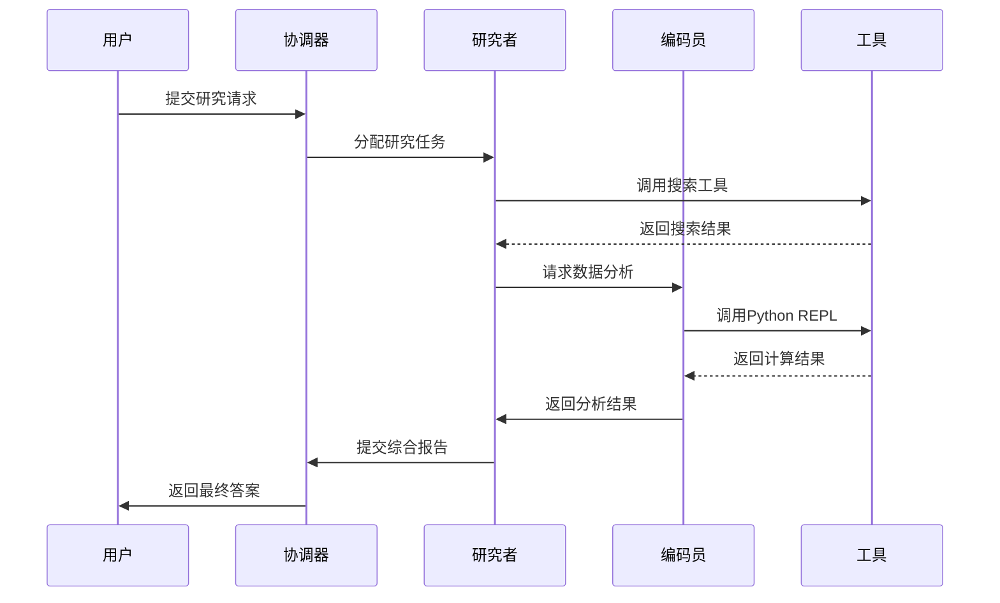
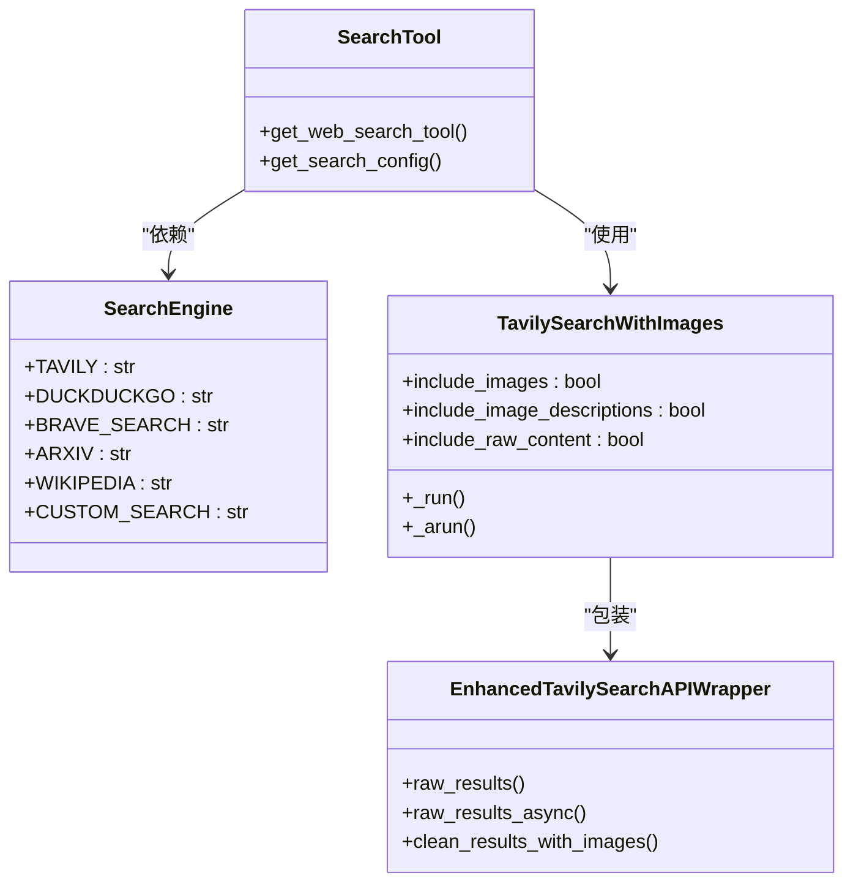
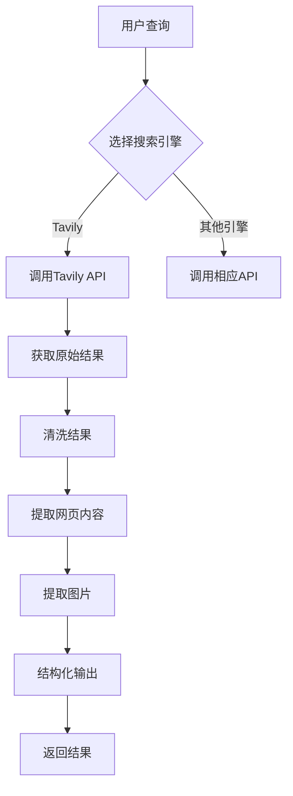
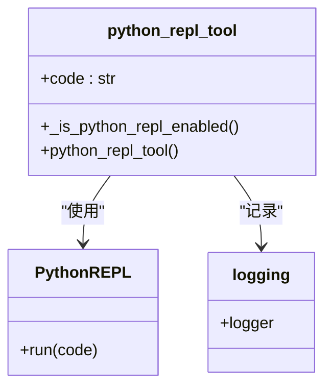
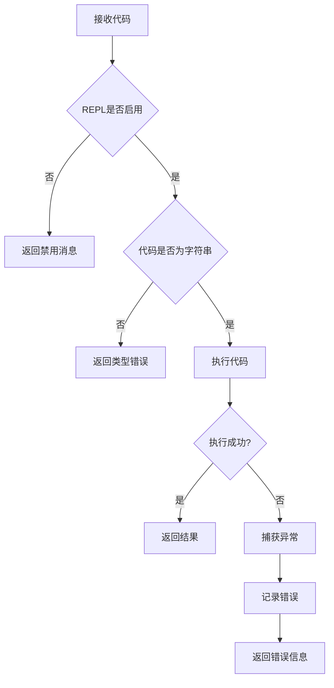
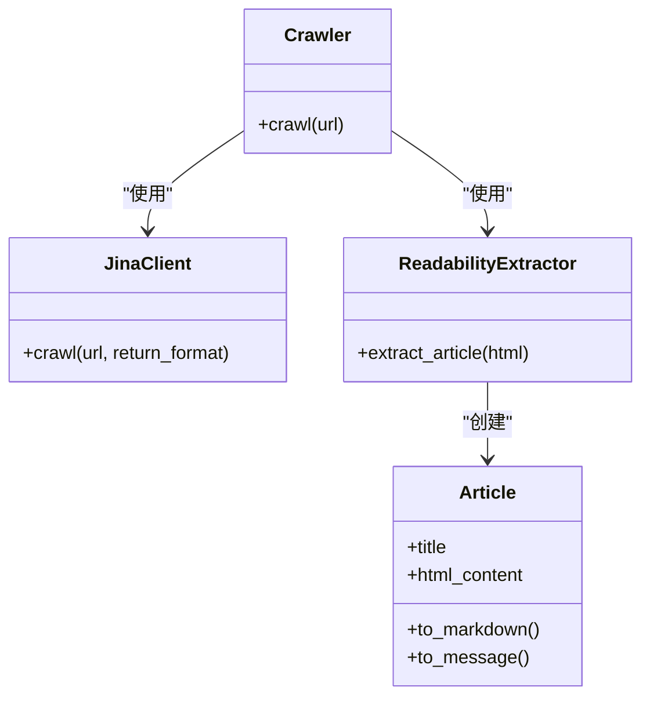
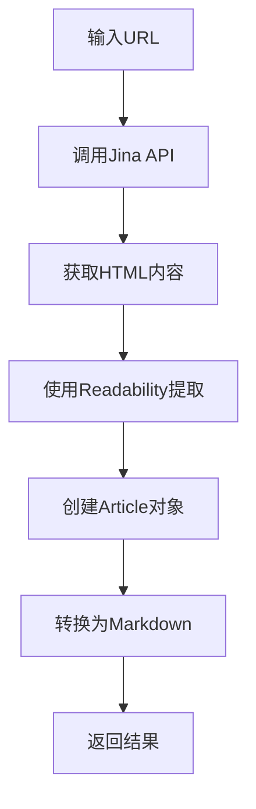
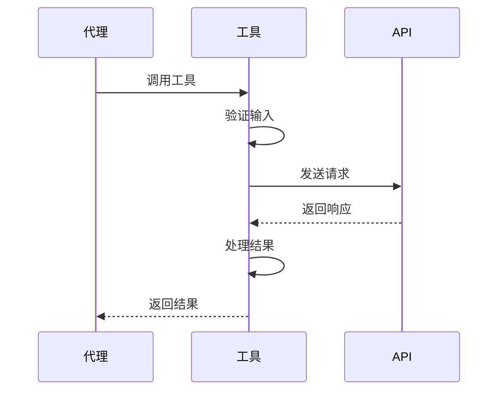
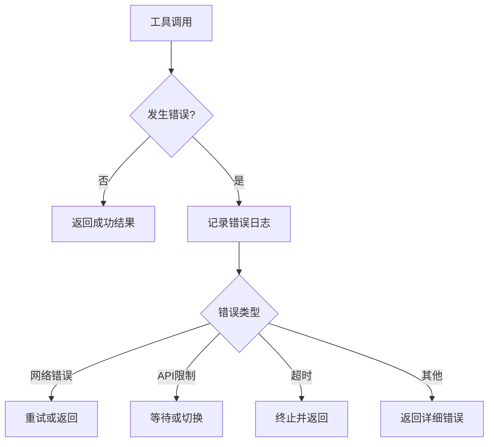

# 研究执行引擎

<cite>
**本文档引用的文件**  
- [search.py](file://src/tools/search.py)
- [python_repl.py](file://src/tools/python_repl.py)
- [crawl.py](file://src/tools/crawl.py)
- [crawler.py](file://src/crawler/crawler.py)
- [tavily_search_api_wrapper.py](file://src/tools/tavily_search/tavily_search_api_wrapper.py)
- [tavily_search_results_with_images.py](file://src/tools/tavily_search/tavily_search_results_with_images.py)
- [jina_client.py](file://src/crawler/jina_client.py)
- [readability_extractor.py](file://src/crawler/readability_extractor.py)
- [article.py](file://src/crawler/article.py)
- [configuration.py](file://src/config/configuration.py)
- [tools.py](file://src/config/tools.py)
- [researcher.md](file://src/prompts/researcher.md)
</cite>

## 目录
1. [引言](#引言)
2. [核心组件](#核心组件)
3. [研究者与编码员代理协同机制](#研究者与编码员代理协同机制)
4. [搜索工具集成与Tavily API实现](#搜索工具集成与tavily-api实现)
5. [Python代码安全沙箱执行](#python代码安全沙箱执行)
6. [网页爬虫与动态内容提取](#网页爬虫与动态内容提取)
7. [工具调用流程与错误处理](#工具调用流程与错误处理)
8. [扩展指南：添加新研究工具](#扩展指南添加新研究工具)
9. [结论](#结论)

## 引言
研究执行引擎是一个先进的多代理系统，旨在通过智能协作完成复杂的研究任务。该系统集成了网络搜索、网页爬取和Python代码执行等多种功能，能够自动执行从信息检索到数据分析的完整研究流程。本技术文档详细说明了研究者代理和编码员代理如何协同工作，以及核心工具模块的实现机制。

## 核心组件
研究执行引擎由多个核心组件构成，包括研究者代理、编码员代理、搜索工具、爬虫模块和Python REPL执行环境。这些组件通过精心设计的接口进行交互，形成了一个高效的研究自动化系统。系统架构遵循模块化设计原则，各组件职责明确，便于维护和扩展。

**Section sources**
- [researcher.md](file://src/prompts/researcher.md#L1-L87)
- [coordinator.md](file://src/prompts/coordinator.md#L1-L56)

## 研究者与编码员代理协同机制
研究者代理和编码员代理通过预定义的协议进行协同工作。研究者代理负责信息检索和事实验证，而编码员代理则专注于数据分析和计算任务。两者通过共享状态和工具调用结果进行协作，形成一个闭环的研究执行流程。



**Diagram sources**
- [researcher.md](file://src/prompts/researcher.md#L1-L87)
- [agents.py](file://src/agents/agents.py#L1-L20)

## 搜索工具集成与Tavily API实现
搜索工具是研究执行引擎的核心功能之一，通过集成多种搜索引擎提供高质量的信息检索服务。

### 搜索工具架构
系统支持多种搜索引擎，包括Tavily、DuckDuckGo、Brave Search、Arxiv和Wikipedia。通过配置文件可以灵活选择默认搜索引擎，满足不同场景的需求。



**Diagram sources**
- [search.py](file://src/tools/search.py#L1-L114)
- [tools.py](file://src/config/tools.py#L1-L32)
- [tavily_search_results_with_images.py](file://src/tools/tavily_search/tavily_search_results_with_images.py#L1-L165)

### Tavily Search API集成
Tavily Search API提供了高质量的搜索结果，包括网页内容、图片和答案摘要。系统通过`EnhancedTavilySearchAPIWrapper`类对原始API进行封装，增加了异步支持和结果清洗功能。



**Diagram sources**
- [tavily_search_api_wrapper.py](file://src/tools/tavily_search/tavily_search_api_wrapper.py#L1-L114)
- [tavily_search_results_with_images.py](file://src/tools/tavily_search/tavily_search_results_with_images.py#L1-L165)

## Python代码安全沙箱执行
Python REPL模块提供了安全的代码执行环境，确保研究过程中的计算任务不会影响系统安全。

### 安全沙箱实现
系统通过环境变量控制Python REPL的启用状态，确保在生产环境中可以灵活地开启或关闭代码执行功能。执行环境限制了文件操作和网络访问，防止潜在的安全风险。



**Diagram sources**
- [python_repl.py](file://src/tools/python_repl.py#L1-L64)

### 执行流程与错误处理
代码执行流程包括输入验证、执行和结果处理三个阶段。系统对各种异常情况进行全面处理，确保即使代码执行失败也不会中断整个研究流程。



**Diagram sources**
- [python_repl.py](file://src/tools/python_repl.py#L1-L64)

## 网页爬虫与动态内容提取
爬虫模块负责从指定URL提取可读内容，支持动态网页的内容解析。

### 爬虫架构
系统采用分层架构设计，包括Jina客户端、可读性提取器和文章表示三个主要组件。这种设计分离了网络请求、内容提取和数据表示的职责。



**Diagram sources**
- [crawler.py](file://src/crawler/crawler.py#L1-L28)
- [jina_client.py](file://src/crawler/jina_client.py#L1-L27)
- [readability_extractor.py](file://src/crawler/readability_extractor.py#L1-L16)
- [article.py](file://src/crawler/article.py#L1-L38)

### 动态内容处理流程
爬虫处理流程包括URL请求、HTML获取、内容提取和格式转换四个步骤。系统使用Jina AI的Reader API获取网页内容，并通过Readability算法提取主要文章内容。



**Diagram sources**
- [crawler.py](file://src/crawler/crawler.py#L1-L28)

## 工具调用流程与错误处理
系统实现了完整的工具调用流程，包括调用、执行、结果返回和错误处理。

### 工具调用序列
工具调用遵循标准的请求-响应模式，通过装饰器实现输入输出的日志记录和错误处理。



**Diagram sources**
- [decorators.py](file://src/tools/decorators.py)
- [search.py](file://src/tools/search.py#L1-L114)

### 错误处理机制
系统实现了多层次的错误处理机制，包括网络错误、API限制和执行超时等常见问题的处理策略。



**Diagram sources**
- [python_repl.py](file://src/tools/python_repl.py#L1-L64)
- [crawl.py](file://src/tools/crawl.py#L1-L30)

## 扩展指南：添加新研究工具
开发者可以按照以下指南添加新的研究工具，扩展系统功能。

### 接口规范
新工具必须遵循统一的接口规范，包括工具装饰器、输入验证和错误处理。

```python
@tool
@log_io
def new_tool(
    parameter: Annotated[str, "参数描述"],
) -> str:
    """工具功能描述"""
    # 工具实现
    pass
```

**Section sources**
- [python_repl.py](file://src/tools/python_repl.py#L1-L64)
- [crawl.py](file://src/tools/crawl.py#L1-L30)

### 最佳实践
1. **错误处理**：始终使用try-catch块捕获异常
2. **日志记录**：使用标准日志记录器记录关键操作
3. **输入验证**：验证输入参数的类型和格式
4. **资源管理**：及时释放网络连接等资源
5. **文档说明**：提供清晰的工具文档和使用示例

## 结论
研究执行引擎通过精心设计的架构和组件协同，实现了高效、安全的研究自动化。系统支持多种信息检索方式和数据分析功能，为复杂研究任务提供了强大的技术支持。通过模块化设计和清晰的接口规范，系统具有良好的可扩展性，便于未来功能的添加和改进。