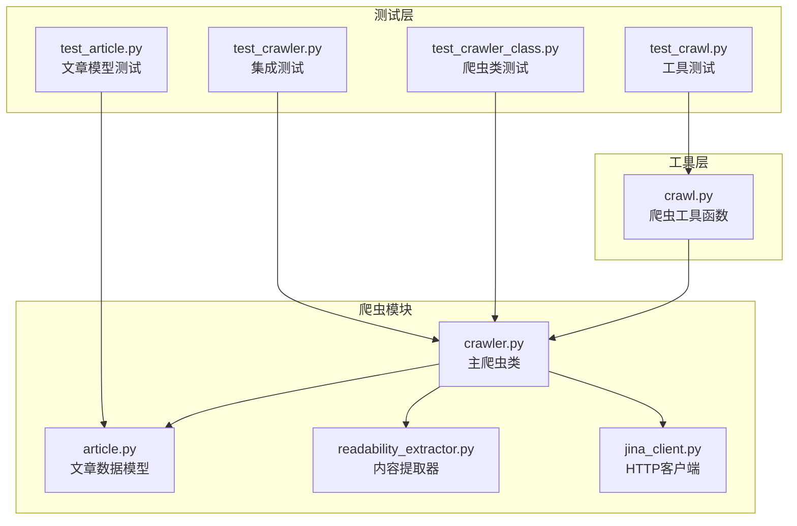
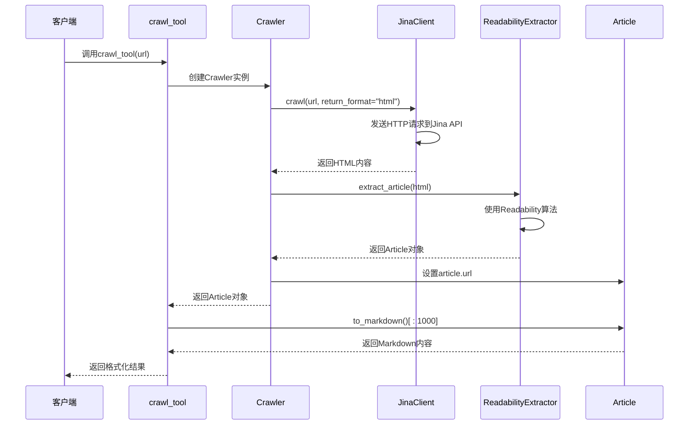
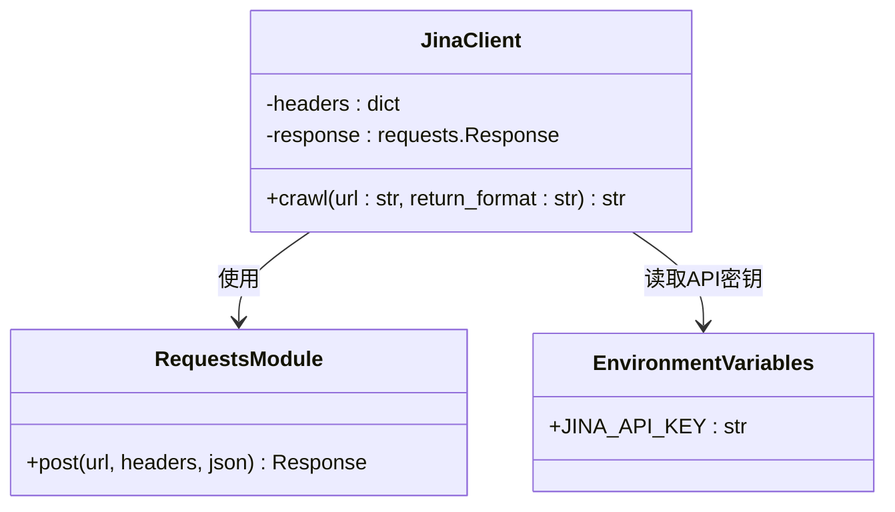
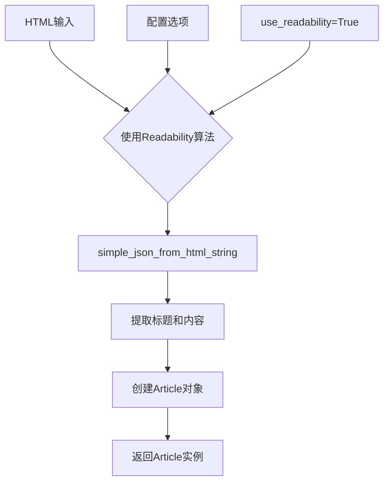
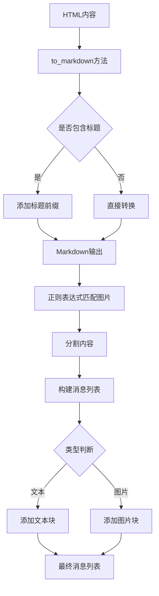
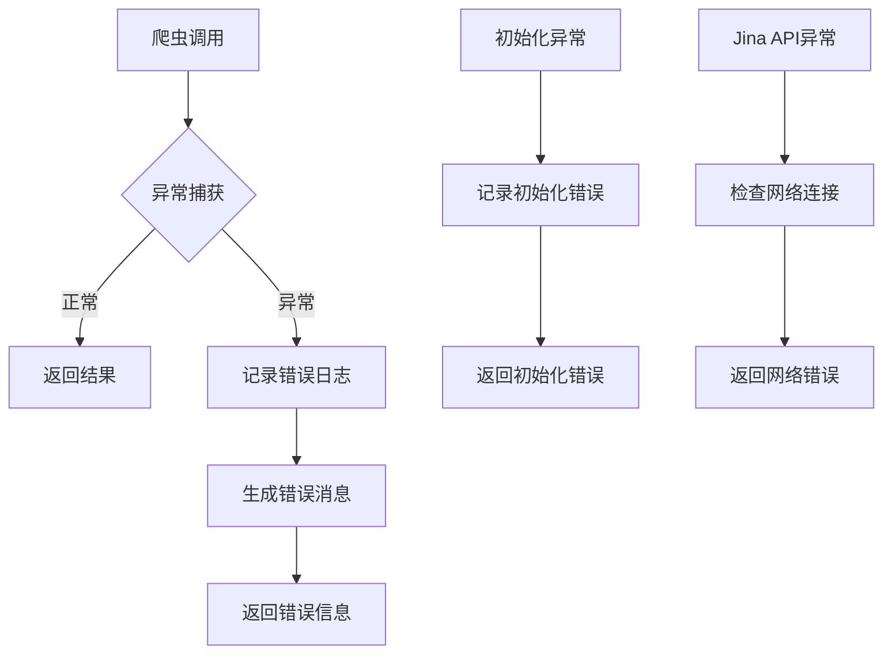
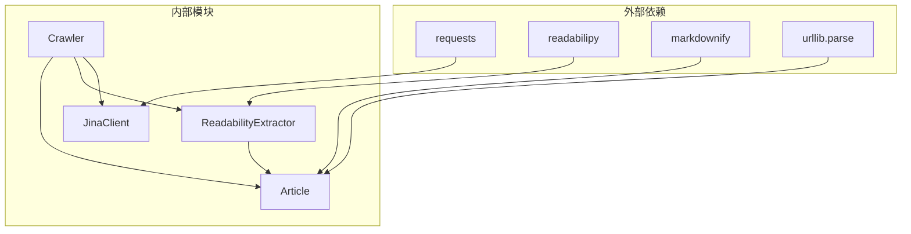

# 网页爬取功能

<cite>
**本文档引用的文件**
- [crawler.py](file://src/crawler/crawler.py)
- [article.py](file://src/crawler/article.py)
- [readability_extractor.py](file://src/crawler/readability_extractor.py)
- [jina_client.py](file://src/crawler/jina_client.py)
- [crawl.py](file://src/tools/crawl.py)
- [test_crawler_class.py](file://tests/unit/crawler/test_crawler_class.py)
- [test_article.py](file://tests/unit/crawler/test_article.py)
- [test_crawler.py](file://tests/integration/test_crawler.py)
- [test_crawl.py](file://tests/unit/tools/test_crawl.py)
</cite>

## 目录
1. [简介](#简介)
2. [项目结构](#项目结构)
3. [核心组件](#核心组件)
4. [架构概览](#架构概览)
5. [详细组件分析](#详细组件分析)
6. [依赖关系分析](#依赖关系分析)
7. [性能考虑](#性能考虑)
8. [故障排除指南](#故障排除指南)
9. [结论](#结论)

## 简介

网页爬取功能是deer-flow系统的核心组件之一，专门用于从互联网上抓取网页内容并将其转换为可读性强的格式。该系统采用模块化设计，通过Jina API进行网页抓取，使用Readability算法提取主要内容，并将结果转换为Markdown格式，便于后续处理和分析。

系统的主要特点包括：
- 基于Jina API的网页抓取服务
- 使用Readability算法提取主要内容
- 支持JavaScript渲染的动态网页
- 完善的错误处理和容错机制
- 可扩展的内容提取规则
- 多媒体内容分离处理

## 项目结构

网页爬取功能的代码组织结构清晰，主要包含以下核心文件：



**图表来源**
- [crawler.py](file://src/crawler/crawler.py#L1-L28)
- [article.py](file://src/crawler/article.py#L1-L38)
- [readability_extractor.py](file://src/crawler/readability_extractor.py#L1-L16)
- [jina_client.py](file://src/crawler/jina_client.py#L1-L27)

**章节来源**
- [crawler.py](file://src/crawler/crawler.py#L1-L28)
- [article.py](file://src/crawler/article.py#L1-L38)
- [readability_extractor.py](file://src/crawler/readability_extractor.py#L1-L16)
- [jina_client.py](file://src/crawler/jina_client.py#L1-L27)

## 核心组件

### Crawler类（主爬虫引擎）

Crawler类是整个爬虫系统的核心控制器，负责协调各个组件的工作流程：

```python
class Crawler:
    def crawl(self, url: str) -> Article:
        # 使用Jina API获取HTML内容
        jina_client = JinaClient()
        html = jina_client.crawl(url, return_format="html")
        
        # 使用Readability算法提取主要内容
        extractor = ReadabilityExtractor()
        article = extractor.extract_article(html)
        
        # 设置文章URL并返回
        article.url = url
        return article
```

### Article类（文章数据模型）

Article类定义了文章的基本数据结构和处理方法：

```python
class Article:
    url: str
    
    def __init__(self, title: str, html_content: str):
        self.title = title
        self.html_content = html_content
    
    def to_markdown(self, including_title: bool = True) -> str:
        # 将HTML内容转换为Markdown格式
        
    def to_message(self) -> list[dict]:
        # 将内容分割为文本和图片块，用于LLM消息传递
```

**章节来源**
- [crawler.py](file://src/crawler/crawler.py#L8-L27)
- [article.py](file://src/crawler/article.py#L9-L37)

## 架构概览

网页爬取系统的整体架构采用分层设计，确保了良好的模块化和可维护性：



**图表来源**
- [crawler.py](file://src/crawler/crawler.py#L10-L25)
- [crawl.py](file://src/tools/crawl.py#L15-L27)
- [jina_client.py](file://src/crawler/jina_client.py#L12-L25)

## 详细组件分析

### JinaClient：HTTP请求管理与反爬虫策略

JinaClient负责与Jina API进行通信，实现了基本的HTTP请求管理和反爬虫策略：



**图表来源**
- [jina_client.py](file://src/crawler/jina_client.py#L12-L25)

#### 请求头配置与认证

JinaClient实现了灵活的请求头配置机制：

```python
headers = {
    "Content-Type": "application/json",
    "X-Return-Format": return_format,
}
if os.getenv("JINA_API_KEY"):
    headers["Authorization"] = f"Bearer {os.getenv('JINA_API_KEY')}"
else:
    logger.warning("Jina API key is not set...")
```

这种设计允许用户通过环境变量设置API密钥以获得更高的访问限制，同时在未设置密钥时提供友好的警告信息。

**章节来源**
- [jina_client.py](file://src/crawler/jina_client.py#L12-L25)

### ReadabilityExtractor：内容提取算法

ReadabilityExtractor基于readabilipy库实现，使用Readability算法从HTML中提取主要内容：



**图表来源**
- [readability_extractor.py](file://src/crawler/readability_extractor.py#L10-L15)

#### 内容提取流程

```python
def extract_article(self, html: str) -> Article:
    article = simple_json_from_html_string(html, use_readability=True)
    return Article(
        title=article.get("title"),
        html_content=article.get("content"),
    )
```

该组件能够有效去除广告、导航栏等噪音元素，专注于提取网页的主要内容。

**章节来源**
- [readability_extractor.py](file://src/crawler/readability_extractor.py#L10-L15)

### Article类：多媒体内容分离处理

Article类实现了智能的内容分离和格式转换功能：



**图表来源**
- [article.py](file://src/crawler/article.py#L17-L37)

#### 图片处理机制

Article类特别设计了图片和文本的分离处理：

```python
def to_message(self) -> list[dict]:
    image_pattern = r"!\[.*?\]\((.*?)\)"
    content: list[dict[str, str]] = []
    parts = re.split(image_pattern, self.to_markdown())
    
    for i, part in enumerate(parts):
        if i % 2 == 1:
            # 图片处理
            image_url = urljoin(self.url, part.strip())
            content.append({"type": "image_url", "image_url": {"url": image_url}})
        else:
            # 文本处理
            content.append({"type": "text", "text": part.strip()})
    
    return content
```

这种设计使得生成的内容更适合LLM处理，能够同时支持文本和图像信息。

**章节来源**
- [article.py](file://src/crawler/article.py#L17-L37)

### 错误处理与容错机制

系统实现了多层次的错误处理机制：



**图表来源**
- [crawl.py](file://src/tools/crawl.py#L25-L27)

#### 具体错误处理实现

```python
@tool
@log_io
def crawl_tool(url: str) -> str:
    try:
        crawler = Crawler()
        article = crawler.crawl(url)
        return {"url": url, "crawled_content": article.to_markdown()[:1000]}
    except BaseException as e:
        error_msg = f"Failed to crawl. Error: {repr(e)}"
        logger.error(error_msg)
        return error_msg
```

系统能够处理各种异常情况，包括网络错误、API限制、内容解析失败等，并提供详细的错误信息。

**章节来源**
- [crawl.py](file://src/tools/crawl.py#L15-L27)

## 依赖关系分析

网页爬取系统的依赖关系清晰明确，遵循了良好的软件工程原则：



**图表来源**
- [crawler.py](file://src/crawler/crawler.py#L4-L6)
- [article.py](file://src/crawler/article.py#L4-L7)
- [readability_extractor.py](file://src/crawler/readability_extractor.py#L4-L6)

### 模块间交互

各模块之间的交互关系简洁明了：

1. **Crawler**作为主控制器，协调其他组件的工作
2. **JinaClient**负责HTTP通信，不依赖其他内部模块
3. **ReadabilityExtractor**专注于内容提取，独立运行
4. **Article**作为数据载体，提供统一的数据接口

**章节来源**
- [crawler.py](file://src/crawler/crawler.py#L4-L6)
- [article.py](file://src/crawler/article.py#L4-L7)
- [readability_extractor.py](file://src/crawler/readability_extractor.py#L4-L6)

## 性能考虑

### 异步处理能力

虽然当前实现是同步的，但系统设计考虑了异步处理的可能性：

- JinaClient可以轻松替换为异步HTTP客户端
- Readability算法可以在后台线程执行
- 大型网页内容可以分块处理

### 缓存策略

系统可以通过以下方式优化性能：

1. **结果缓存**：对于相同URL的重复请求，可以缓存结果
2. **内容预处理**：对频繁访问的网站建立本地缓存
3. **并发控制**：限制同时进行的爬取任务数量

### 内存优化

- 对于大型网页，只提取主要内容而非完整HTML
- Markdown转换后及时释放原始HTML内存
- 限制返回内容长度（如代码中的[:1000]截断）

## 故障排除指南

### 常见问题及解决方案

#### 1. Jina API密钥问题

**症状**：收到速率限制警告或访问被拒绝
**解决方案**：
```bash
export JINA_API_KEY="your_api_key_here"
```

#### 2. 网络连接问题

**症状**：无法连接到Jina API
**解决方案**：
- 检查网络连接
- 验证防火墙设置
- 尝试使用代理服务器

#### 3. 内容解析失败

**症状**：返回空内容或解析错误
**解决方案**：
- 检查目标网站是否需要特殊处理
- 验证HTML格式是否正确
- 查看Jina API响应状态码

#### 4. 内存不足

**症状**：处理大型网页时出现内存溢出
**解决方案**：
- 实现内容截断机制
- 使用流式处理
- 增加系统内存

**章节来源**
- [jina_client.py](file://src/crawler/jina_client.py#L18-L22)
- [crawl.py](file://src/tools/crawl.py#L25-L27)

### 调试技巧

1. **启用详细日志**：设置日志级别为DEBUG
2. **检查中间结果**：在每个步骤打印关键变量
3. **使用测试数据**：创建简单的测试用例验证功能
4. **监控资源使用**：观察CPU和内存使用情况

## 结论

网页爬取功能是一个设计精良、架构清晰的系统，具有以下优势：

### 主要特性

1. **模块化设计**：清晰的职责分离和接口定义
2. **容错能力强**：完善的异常处理和错误恢复机制
3. **易于扩展**：插件化的架构支持自定义内容提取规则
4. **高性能**：合理的资源管理和优化策略

### 扩展建议

1. **添加更多内容提取规则**：支持特定网站的定制化提取
2. **实现异步处理**：提高并发处理能力和响应速度
3. **增强缓存机制**：减少重复请求和网络开销
4. **支持多种输出格式**：除了Markdown，还可以支持JSON、XML等格式

### 最佳实践

1. **合理设置超时时间**：平衡响应速度和成功率
2. **遵守robots.txt协议**：尊重网站的爬取限制
3. **实施速率限制**：避免对目标网站造成过大压力
4. **定期更新依赖**：保持第三方库的安全性和稳定性

这个爬虫系统为deer-flow提供了强大的内容获取能力，能够满足大多数网页内容提取的需求，同时具备良好的可维护性和扩展性。