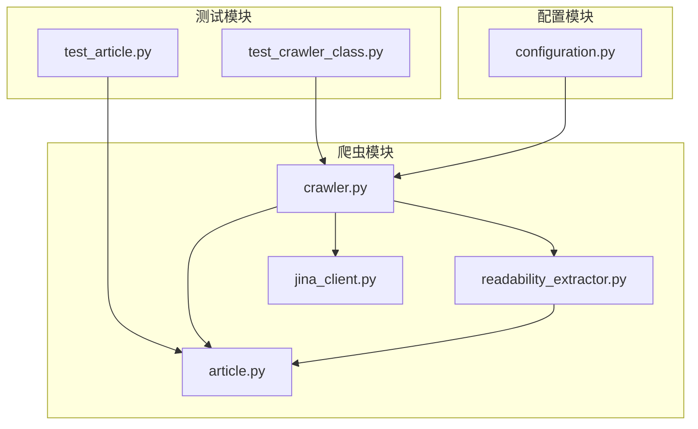
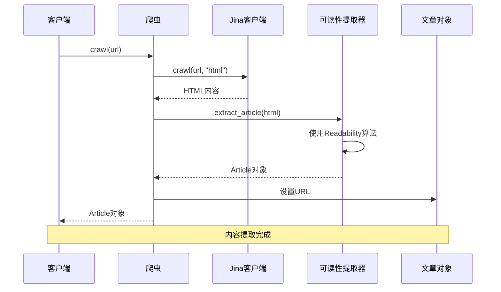
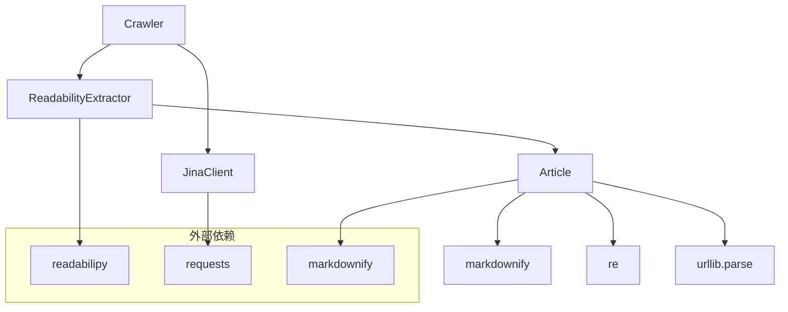

# 内容提取与清洗模块

<cite>
**本文档引用的文件**
- [readability_extractor.py](file://src/crawler/readability_extractor.py)
- [article.py](file://src/crawler/article.py)
- [crawler.py](file://src/crawler/crawler.py)
- [jina_client.py](file://src/crawler/jina_client.py)
- [test_article.py](file://tests/unit/crawler/test_article.py)
- [test_crawler_class.py](file://tests/unit/crawler/test_crawler_class.py)
- [markdown.tsx](file://web/src/components/deer-flow/markdown.tsx)
- [configuration.py](file://src/config/configuration.py)
</cite>

## 目录
1. [简介](#简介)
2. [项目结构](#项目结构)
3. [核心组件](#核心组件)
4. [架构概览](#架构概览)
5. [详细组件分析](#详细组件分析)
6. [依赖关系分析](#依赖关系分析)
7. [性能考虑](#性能考虑)
8. [故障排除指南](#故障排除指南)
9. [结论](#结论)

## 简介

deer-flow 的内容提取与清洗模块是一个专门设计用于从网页中提取和清理主要内容的系统。该模块的核心功能包括使用 Readability 算法从 HTML 中提取主要内容，去除广告、导航栏等噪音元素，并将提取的内容进行结构化处理和格式转换。

该模块的主要目标是：
- 从复杂的 HTML 页面中提取出文章的主要内容
- 去除页面中的广告、导航栏、侧边栏等无关内容
- 将 HTML 内容转换为结构化的 Markdown 格式
- 提供统一的消息格式，支持文本和图像的分离处理
- 支持不同网站结构的适配和自定义提取规则

## 项目结构

内容提取与清洗模块位于 `src/crawler/` 目录下，包含以下关键文件：



**图表来源**
- [readability_extractor.py](file://src/crawler/readability_extractor.py#L1-L16)
- [article.py](file://src/crawler/article.py#L1-L38)
- [crawler.py](file://src/crawler/crawler.py#L1-L26)

**章节来源**
- [readability_extractor.py](file://src/crawler/readability_extractor.py#L1-L16)
- [article.py](file://src/crawler/article.py#L1-L38)
- [crawler.py](file://src/crawler/crawler.py#L1-L26)
- [jina_client.py](file://src/crawler/jina_client.py#L1-L27)

## 核心组件

### ReadabilityExtractor 类

`ReadabilityExtractor` 是内容提取的核心类，负责调用 Readability 算法从 HTML 中提取主要内容。

```python
class ReadabilityExtractor:
    def extract_article(self, html: str) -> Article:
        article = simple_json_from_html_string(html, use_readability=True)
        return Article(
            title=article.get("title"),
            html_content=article.get("content"),
        )
```

该类的主要特点：
- 使用 `readabilipy` 库的 `simple_json_from_html_string` 函数
- 启用 Readability 算法进行内容提取
- 返回结构化的 `Article` 对象

### Article 类

`Article` 类是内容提取结果的数据模型，负责存储和处理提取的文章信息。

```python
class Article:
    url: str

    def __init__(self, title: str, html_content: str):
        self.title = title
        self.html_content = html_content

    def to_markdown(self, including_title: bool = True) -> str:
        markdown = ""
        if including_title:
            markdown += f"# {self.title}\n\n"
        markdown += md(self.html_content)
        return markdown
```

**章节来源**
- [readability_extractor.py](file://src/crawler/readability_extractor.py#L8-L15)
- [article.py](file://src/crawler/article.py#L9-L37)

## 架构概览

内容提取与清洗模块采用分层架构设计，各组件职责明确：



**图表来源**
- [crawler.py](file://src/crawler/crawler.py#L11-L25)
- [jina_client.py](file://src/crawler/jina_client.py#L11-L26)
- [readability_extractor.py](file://src/crawler/readability_extractor.py#L8-L15)

## 详细组件分析

### Jina 客户端

Jina 客户端负责从远程服务获取网页的 HTML 内容。它提供了简单的 API 接口，支持通过环境变量配置 API 密钥。

```python
class JinaClient:
    def crawl(self, url: str, return_format: str = "html") -> str:
        headers = {
            "Content-Type": "application/json",
            "X-Return-Format": return_format,
        }
        if os.getenv("JINA_API_KEY"):
            headers["Authorization"] = f"Bearer {os.getenv('JINA_API_KEY')}"
        data = {"url": url}
        response = requests.post("https://r.jina.ai/", headers=headers, json=data)
        return response.text
```

**特点：**
- 支持多种返回格式（HTML、Markdown 等）
- 自动处理 API 认证
- 提供速率限制警告
- 使用 Jina Reader API 进行网页抓取

### 文章对象处理

`Article` 类提供了多种内容处理方法：

#### Markdown 转换

```python
def to_markdown(self, including_title: bool = True) -> str:
    markdown = ""
    if including_title:
        markdown += f"# {self.title}\n\n"
    markdown += md(self.html_content)
    return markdown
```

#### 消息格式转换

```python
def to_message(self) -> list[dict]:
    image_pattern = r"!\[.*?\]\((.*?)\)"
    
    content: list[dict[str, str]] = []
    parts = re.split(image_pattern, self.to_markdown())
    
    for i, part in enumerate(parts):
        if i % 2 == 1:
            image_url = urljoin(self.url, part.strip())
            content.append({"type": "image_url", "image_url": {"url": image_url}})
        else:
            content.append({"type": "text", "text": part.strip()})
    
    return content
```

这个方法实现了：
- 图像和文本的分离处理
- 图像 URL 的相对路径转换为绝对路径
- 统一的消息格式输出

**章节来源**
- [jina_client.py](file://src/crawler/jina_client.py#L11-L26)
- [article.py](file://src/crawler/article.py#L15-L37)

### 爬虫集成

爬虫类将所有组件整合在一起，提供完整的网页内容提取流程：

```python
class Crawler:
    def crawl(self, url: str) -> Article:
        # 为了帮助LLM更好地理解内容，我们从HTML中提取干净的文章，
        # 将其转换为markdown，并将它们拆分为文本和图像块，
        # 以便形成单一且统一的LLM消息。
        #
        # Jina不是可读性的最佳爬虫，但它更容易使用且免费。
        #
        # 我们将使用自己的解决方案而不是Jina自己的markdown转换器，
        # 以获得更好的可读性结果。
        jina_client = JinaClient()
        html = jina_client.crawl(url, return_format="html")
        extractor = ReadabilityExtractor()
        article = extractor.extract_article(html)
        article.url = url
        return article
```

**章节来源**
- [crawler.py](file://src/crawler/crawler.py#L11-L25)

## 依赖关系分析

内容提取与清洗模块的依赖关系如下：



**图表来源**
- [crawler.py](file://src/crawler/crawler.py#L5-L8)
- [readability_extractor.py](file://src/crawler/readability_extractor.py#L5-L7)
- [article.py](file://src/crawler/article.py#L5-L8)

**章节来源**
- [crawler.py](file://src/crawler/crawler.py#L1-L26)
- [readability_extractor.py](file://src/crawler/readability_extractor.py#L1-L16)
- [article.py](file://src/crawler/article.py#L1-L38)

## 性能考虑

### 内存使用优化

- **流式处理**：HTML 内容直接传递给 Readability 算法，避免中间存储
- **延迟加载**：Markdown 转换仅在需要时执行
- **字符串操作优化**：使用正则表达式高效处理图像提取

### 网络请求优化

- **连接复用**：Jina 客户端使用持久连接
- **错误处理**：完善的异常处理机制
- **超时控制**：合理的网络请求超时设置

### 算法效率

- **Readability 算法**：经过优化的 DOM 解析和内容提取
- **正则表达式匹配**：高效的图像模式识别
- **字符串分割**：O(n) 时间复杂度的文本分割

## 故障排除指南

### 常见问题及解决方案

#### 1. Jina API 错误

**问题**：无法访问 Jina API 或收到认证错误
**解决方案**：
- 设置环境变量 `JINA_API_KEY`
- 检查网络连接
- 验证 API 密钥的有效性

#### 2. 内容提取失败

**问题**：Readability 算法无法正确提取内容
**解决方案**：
- 检查 HTML 结构是否符合标准
- 验证页面是否有足够的内容
- 考虑添加自定义提取规则

#### 3. 图像链接问题

**问题**：图像 URL 显示不正确或缺失
**解决方案**：
- 检查图像标签的 src 属性
- 验证 URL 路径的完整性
- 确认图像资源的可用性

**章节来源**
- [jina_client.py](file://src/crawler/jina_client.py#L17-L26)
- [article.py](file://src/crawler/article.py#L25-L37)

## 结论

deer-flow 的内容提取与清洗模块是一个设计精良、功能完备的系统，能够有效地从网页中提取和清理主要内容。该模块的主要优势包括：

1. **模块化设计**：清晰的职责分离和接口定义
2. **算法优化**：使用成熟的 Readability 算法确保高质量的内容提取
3. **格式转换**：支持多种输出格式，满足不同应用场景的需求
4. **错误处理**：完善的异常处理和错误恢复机制
5. **扩展性**：易于添加新的提取规则和处理逻辑

该模块为 deer-flow 系统提供了强大的内容处理能力，是整个系统的重要组成部分。通过持续的优化和改进，该模块将继续为用户提供高质量的内容提取服务。