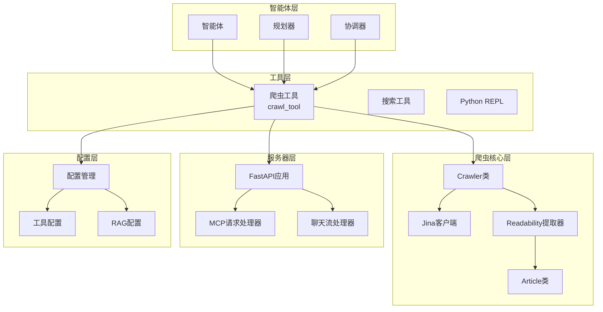
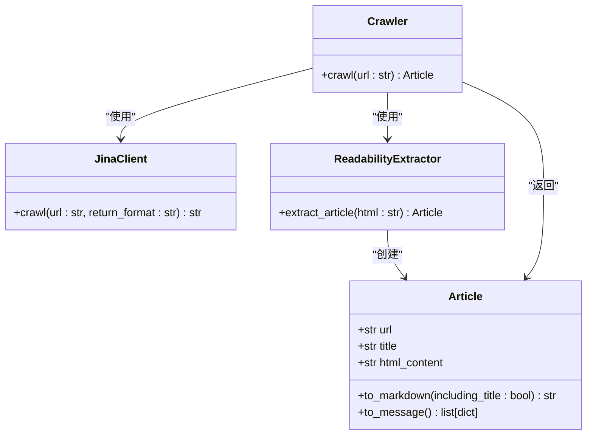
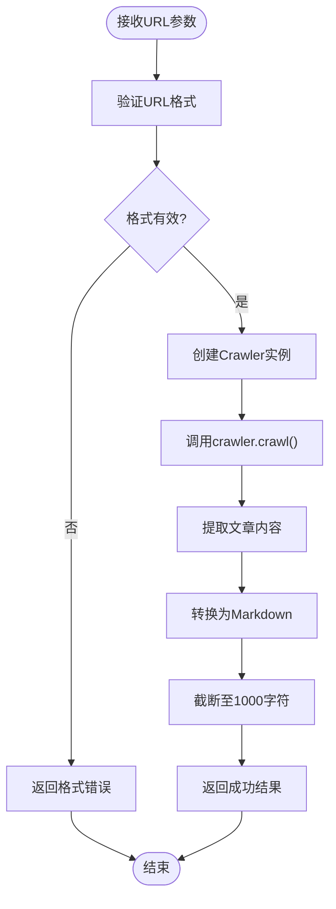
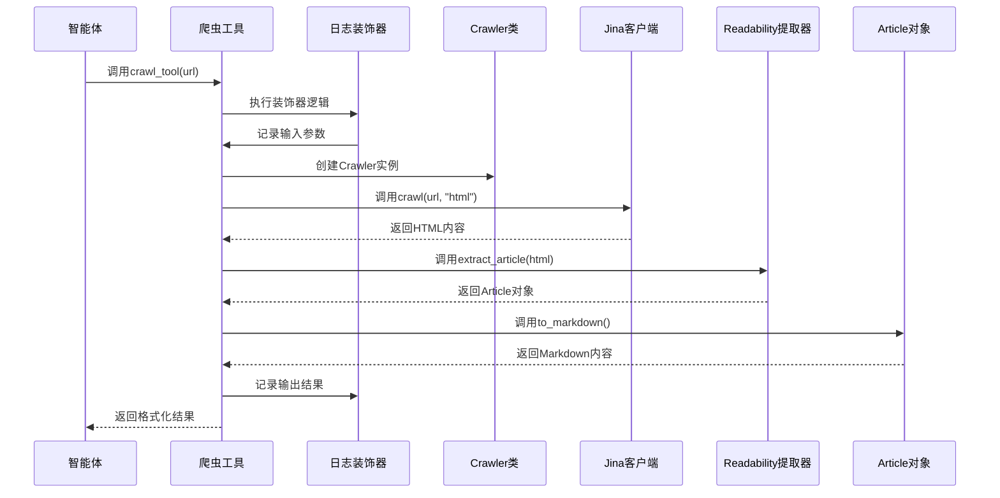
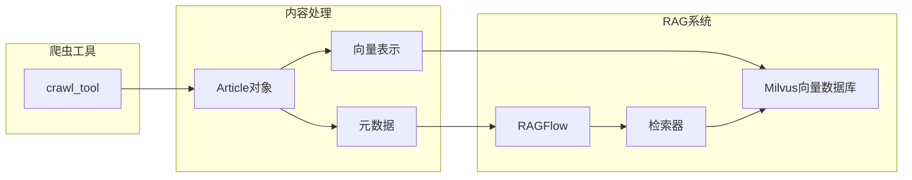
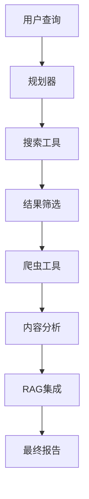

# 爬虫工具集成

<cite>
**本文档引用的文件**
- [crawl.py](file://src/tools/crawl.py)
- [crawler.py](file://src/crawler/crawler.py)
- [article.py](file://src/crawler/article.py)
- [decorators.py](file://src/tools/decorators.py)
- [tools.py](file://src/config/tools.py)
- [configuration.py](file://src/config/configuration.py)
- [mcp_request.py](file://src/server/mcp_request.py)
- [app.py](file://src/server/app.py)
- [test_crawl.py](file://tests/unit/tools/test_crawl.py)
- [ragflow.py](file://src/rag/ragflow.py)
</cite>

## 目录
1. [简介](#简介)
2. [项目架构概览](#项目架构概览)
3. [爬虫工具核心组件](#爬虫工具核心组件)
4. [输入参数验证与处理](#输入参数验证与处理)
5. [任务分发机制](#任务分发机制)
6. [结果格式化与输出](#结果格式化与输出)
7. [与其他模块的集成](#与其他模块的集成)
8. [错误处理与异常管理](#错误处理与异常管理)
9. [性能优化策略](#性能优化策略)
10. [最佳实践与使用模式](#最佳实践与使用模式)
11. [故障排除指南](#故障排除指南)
12. [总结](#总结)

## 简介

deer-flow 是一个基于智能体的工作流系统，其中爬虫工具（crawl_tool）是核心组件之一，负责从互联网上抓取网页内容并将其转换为可被智能体使用的结构化数据。该工具通过封装底层爬虫功能，为上层智能体提供了简洁易用的接口，支持从用户查询到内容获取的完整流程。

爬虫工具的设计遵循了模块化和可扩展的原则，集成了多种技术栈，包括 Jina 客户端用于网页抓取、Readability 提取器用于内容解析、以及 Markdown 转换器用于内容格式化。这种设计使得爬虫工具能够高效地处理各种类型的网页内容，并为后续的 RAG 系统或内容生成模块提供高质量的数据源。

## 项目架构概览

deer-flow 系统采用分层架构设计，爬虫工具位于工具层，与智能体层、配置层和服务器层紧密协作。



**图表来源**
- [crawl.py](file://src/tools/crawl.py#L1-L30)
- [crawler.py](file://src/crawler/crawler.py#L1-L28)
- [app.py](file://src/server/app.py#L1-L50)

## 爬虫工具核心组件

### 爬虫工具入口点

爬虫工具的核心入口是一个经过装饰器包装的函数，它提供了简洁的接口供智能体调用：

```python
@tool
@log_io
def crawl_tool(
    url: Annotated[str, "The url to crawl."]
) -> str:
    """Use this to crawl a url and get a readable content in markdown format."""
```

该函数具有以下特点：
- 使用 `@tool` 装饰器标记为智能体工具
- 使用 `@log_io` 装饰器记录输入输出日志
- 接受单个 URL 参数
- 返回包含爬取结果的字典或错误消息

### 核心爬虫类

Crawler 类是整个爬虫功能的核心，负责协调各个组件完成网页抓取任务：



**图表来源**
- [crawler.py](file://src/crawler/crawler.py#L8-L28)
- [article.py](file://src/crawler/article.py#L9-L38)

**章节来源**
- [crawl.py](file://src/tools/crawl.py#L1-L30)
- [crawler.py](file://src/crawler/crawler.py#L1-L28)

## 输入参数验证与处理

### URL 参数验证

爬虫工具对输入参数进行简单的验证，确保传入的是有效的 URL 字符串：

```python
def crawl_tool(
    url: Annotated[str, "The url to crawl."]
) -> str:
```

虽然当前实现没有复杂的验证逻辑，但通过类型注解明确了参数要求。在实际使用中，建议在调用前进行更严格的 URL 验证，包括：
- 检查 URL 格式是否正确
- 验证域名是否有效
- 确认协议是否为 http 或 https
- 检查是否存在常见的无效字符

### 参数处理流程



**图表来源**
- [crawl.py](file://src/tools/crawl.py#L15-L28)

**章节来源**
- [crawl.py](file://src/tools/crawl.py#L15-L28)

## 任务分发机制

### 工具调用链路

当智能体需要使用爬虫工具时，会触发以下调用链路：



**图表来源**
- [crawl.py](file://src/tools/crawl.py#L15-L28)
- [crawler.py](file://src/crawler/crawler.py#L15-L25)

### 异步处理机制

系统支持异步处理机制，允许在多个线程或进程中并发执行爬虫任务：

```python
# 在服务器端的应用中，爬虫工具可以作为异步任务处理
@app.post("/api/chat/stream")
async def chat_stream(request: ChatRequest):
    # 处理聊天流请求
    # 爬虫工具可以在后台异步执行
```

**章节来源**
- [crawl.py](file://src/tools/crawl.py#L15-L28)
- [app.py](file://src/server/app.py#L100-L150)

## 结果格式化与输出

### 输出数据结构

爬虫工具返回两种类型的结果：

1. **成功情况**：返回包含 URL 和爬取内容的字典
2. **失败情况**：返回错误消息字符串

```python
# 成功返回格式
{
    "url": "https://example.com",
    "crawled_content": "# 页面标题\n页面内容摘要..."
}

# 错误返回格式
"Failed to crawl. Error: Network error"
```

### 内容截断机制

为了控制输出大小，系统实现了内容截断机制：

```python
return {"url": url, "crawled_content": article.to_markdown()[:1000]}
```

这确保了：
- 单次调用不会产生过大的数据量
- 符合大多数 LLM 的上下文长度限制
- 提高了传输效率和处理速度

### Markdown 格式化

Article 类提供了强大的 Markdown 转换功能：

```python
def to_markdown(self, including_title: bool = True) -> str:
    markdown = ""
    if including_title:
        markdown += f"# {self.title}\n\n"
    markdown += md(self.html_content)
    return markdown
```

**章节来源**
- [crawl.py](file://src/tools/crawl.py#L20-L25)
- [article.py](file://src/crawler/article.py#L15-L20)

## 与其他模块的集成

### RAG 系统集成

爬虫工具与 RAG（检索增强生成）系统紧密集成，为知识库提供新鲜的网页内容：



**图表来源**
- [ragflow.py](file://src/rag/ragflow.py#L88-L135)

### MCP 服务器集成

爬虫工具可以通过 MCP（Model Context Protocol）服务器暴露给外部系统：

```python
@app.post("/api/mcp/server/metadata", response_model=MCPServerMetadataResponse)
async def mcp_server_metadata(request: MCPServerMetadataRequest):
    # 加载来自MCP服务器的工具
    tools = await load_mcp_tools(...)
    response = MCPServerMetadataResponse(tools=tools)
    return response
```

### 配置系统集成

爬虫工具与全局配置系统集成，支持动态配置：

```python
class Configuration:
    search_engine: str = "custom_search"
    max_search_results: int = 3
    custom_search_repository: Optional[str] = None
```

**章节来源**
- [ragflow.py](file://src/rag/ragflow.py#L88-L135)
- [mcp_request.py](file://src/server/mcp_request.py#L1-L65)
- [configuration.py](file://src/config/configuration.py#L30-L50)

## 错误处理与异常管理

### 异常捕获机制

爬虫工具实现了全面的异常捕获机制：

```python
try:
    crawler = Crawler()
    article = crawler.crawl(url)
    return {"url": url, "crawled_content": article.to_markdown()[:1000]}
except BaseException as e:
    error_msg = f"Failed to crawl. Error: {repr(e)}"
    logger.error(error_msg)
    return error_msg
```

### 错误分类处理

系统识别并处理多种类型的错误：

1. **网络连接错误**：无法访问目标网站
2. **解析错误**：HTML 解析失败
3. **内容提取错误**：Readability 提取器无法处理内容
4. **转换错误**：Markdown 转换失败
5. **超时错误**：请求超时

### 日志记录系统

使用专门的日志装饰器记录所有操作：

```python
@log_io
def crawl_tool(...):
    # 函数逻辑
    pass
```

日志记录包括：
- 输入参数的详细信息
- 函数执行时间
- 返回结果的状态
- 异常堆栈跟踪

**章节来源**
- [crawl.py](file://src/tools/crawl.py#L20-L28)
- [decorators.py](file://src/tools/decorators.py#L15-L40)

## 性能优化策略

### 内容截断优化

系统实现了智能的内容截断策略：

```python
# 截断至1000字符，避免过大数据传输
return {"url": url, "crawled_content": article.to_markdown()[:1000]}
```

### 并发处理优化

支持多线程并发处理多个爬虫任务：

```python
# 在服务器端支持并发处理
async def _stream_graph_events(graph_instance, workflow_input, workflow_config, thread_id):
    # 异步流式处理
    async for agent, _, event_data in graph_instance.astream(...):
        # 处理事件
```

### 缓存机制

虽然当前实现没有显式的缓存机制，但可以通过以下方式优化：
- 实现基于 URL 的内容缓存
- 缓存 Jina 客户端的响应
- 缓存解析后的内容

**章节来源**
- [crawl.py](file://src/tools/crawl.py#L25-L25)
- [app.py](file://src/server/app.py#L400-L450)

## 最佳实践与使用模式

### 基本使用模式

```python
# 直接调用爬虫工具
result = crawl_tool("https://example.com")

# 检查结果类型
if isinstance(result, dict):
    print(f"成功爬取: {result['url']}")
    print(f"内容长度: {len(result['crawled_content'])}")
else:
    print(f"爬取失败: {result}")
```

### 智能体工作流中的使用

在智能体工作流中，爬虫工具通常与其他工具配合使用：



### 批量处理模式

对于批量爬取需求，可以实现批量处理函数：

```python
def batch_crawl(urls: list[str]) -> list[dict]:
    """批量爬取多个URL"""
    results = []
    for url in urls:
        result = crawl_tool(url)
        if isinstance(result, dict):
            results.append(result)
    return results
```

### 错误恢复策略

实现自动重试机制：

```python
def robust_crawl(url: str, max_retries: int = 3) -> dict:
    """带重试机制的爬虫调用"""
    for attempt in range(max_retries):
        result = crawl_tool(url)
        if isinstance(result, dict):
            return result
        time.sleep(2 ** attempt)  # 指数退避
    return {"error": f"Failed after {max_retries} attempts"}
```

## 故障排除指南

### 常见问题诊断

1. **网络连接问题**
   - 检查目标网站是否可达
   - 验证防火墙设置
   - 确认代理配置

2. **解析失败问题**
   - 检查 HTML 内容格式
   - 验证 Readability 提取器兼容性
   - 查看日志中的详细错误信息

3. **超时问题**
   - 增加超时时间设置
   - 检查网络延迟
   - 优化并发数量

### 调试技巧

```python
# 启用详细日志
import logging
logging.basicConfig(level=logging.DEBUG)

# 测试单个URL
test_url = "https://example.com"
result = crawl_tool(test_url)
print(f"测试结果: {result}")

# 检查内部组件
from src.crawler import Crawler
crawler = Crawler()
article = crawler.crawl(test_url)
print(f"原始内容: {article.to_markdown()}")
```

### 性能监控

监控关键指标：
- 爬取成功率
- 平均响应时间
- 内存使用情况
- 错误率统计

**章节来源**
- [test_crawl.py](file://tests/unit/tools/test_crawl.py#L25-L50)

## 总结

deer-flow 的爬虫工具集成展现了现代 AI 系统中工具设计的最佳实践。通过清晰的架构分层、完善的错误处理、灵活的配置选项和高效的性能优化，该系统为智能体提供了强大而可靠的网页内容获取能力。

主要优势包括：
- **模块化设计**：各组件职责明确，易于维护和扩展
- **错误处理完善**：全面的异常捕获和日志记录
- **性能优化**：智能的内容截断和并发处理
- **集成能力强**：与 RAG 系统、MCP 服务器等无缝集成
- **易于使用**：简洁的 API 设计，适合各种应用场景

未来改进方向：
- 实现智能缓存机制
- 增强内容质量评估
- 支持更多内容格式
- 优化大规模并发处理
- 增强安全性和反爬虫能力

这个爬虫工具集成方案为构建下一代 AI 应用提供了坚实的基础，能够满足从简单信息查询到复杂内容分析的各种需求。