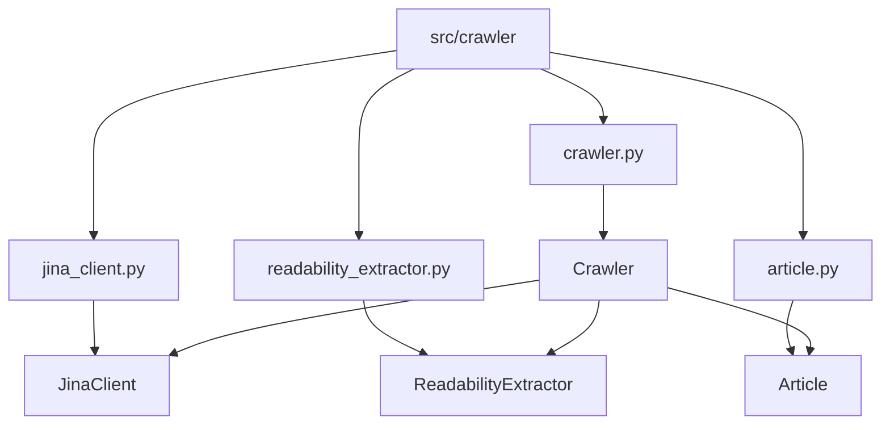
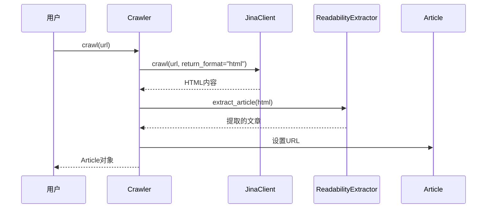
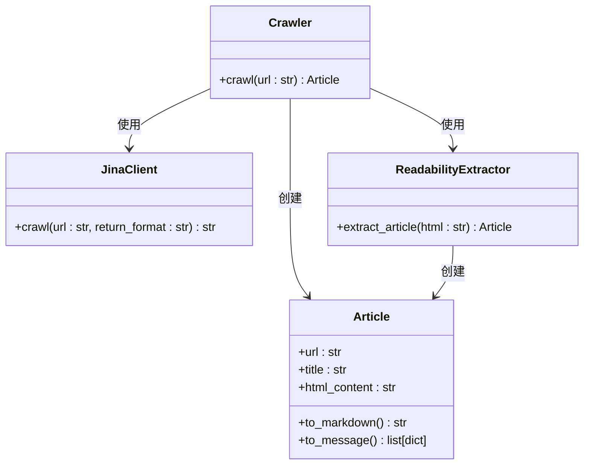
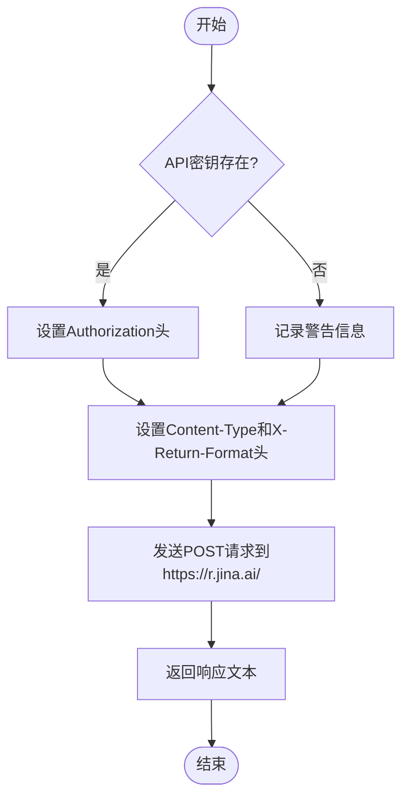
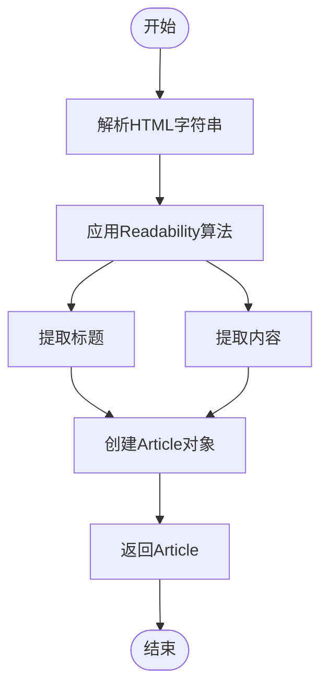
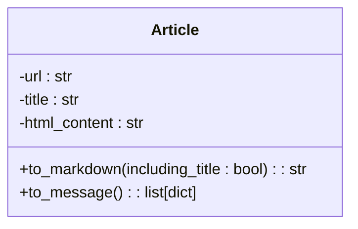

# 爬虫核心引擎

<cite>
**本文档中引用的文件**   
- [crawler.py](file://src/crawler/crawler.py)
- [jina_client.py](file://src/crawler/jina_client.py)
- [readability_extractor.py](file://src/crawler/readability_extractor.py)
- [article.py](file://src/crawler/article.py)
- [crawl.py](file://src/tools/crawl.py)
- [decorators.py](file://src/tools/decorators.py)
</cite>

## 目录
1. [简介](#简介)
2. [项目结构](#项目结构)
3. [核心组件](#核心组件)
4. [架构概述](#架构概述)
5. [详细组件分析](#详细组件分析)
6. [依赖分析](#依赖分析)
7. [性能考虑](#性能考虑)
8. [故障排除指南](#故障排除指南)
9. [结论](#结论)

## 简介
deer-flow爬虫核心引擎是一个专为高效网页内容提取而设计的系统。该引擎通过集成Jina AI服务和Readability算法，能够从复杂网页中提取干净、结构化的文章内容，并将其转换为Markdown格式以供后续处理。本系统特别注重内容可读性优化，通过多阶段处理流程确保提取结果的质量。

## 项目结构
爬虫核心引擎位于`src/crawler`目录下，包含多个协同工作的模块。主要文件包括`crawler.py`（主爬虫类）、`jina_client.py`（与Jina API交互）、`readability_extractor.py`（内容提取）和`article.py`（文章数据结构）。这些模块共同构成了一个完整的网页内容提取流水线。

**图示来源**
- [crawler.py](file://src/crawler/crawler.py)
- [jina_client.py](file://src/crawler/jina_client.py)
- [readability_extractor.py](file://src/crawler/readability_extractor.py)
- [article.py](file://src/crawler/article.py)

**本节来源**
- [crawler.py](file://src/crawler/crawler.py)
- [jina_client.py](file://src/crawler/jina_client.py)

## 核心组件
爬虫核心引擎由四个主要组件构成：Crawler（爬虫控制器）、JinaClient（API客户端）、ReadabilityExtractor（内容提取器）和Article（文章模型）。这些组件协同工作，实现从URL到结构化内容的完整转换过程。

**本节来源**
- [crawler.py](file://src/crawler/crawler.py#L1-L30)
- [article.py](file://src/crawler/article.py#L1-L10)

## 架构概述
系统采用分层架构设计，将网络请求、内容提取和数据表示分离。Crawler类作为协调者，调用JinaClient获取原始HTML，然后通过ReadabilityExtractor提取主要内容，最后封装为Article对象。这种设计实现了关注点分离，提高了代码的可维护性和可扩展性。

**图示来源**
- [crawler.py](file://src/crawler/crawler.py#L1-L30)
- [jina_client.py](file://src/crawler/jina_client.py#L1-L20)
- [readability_extractor.py](file://src/crawler/readability_extractor.py#L1-L15)

## 详细组件分析

### Crawler分析
Crawler类是爬虫系统的核心控制器，负责协调整个内容提取流程。它通过组合模式集成JinaClient和ReadabilityExtractor，实现了从URL到结构化文章的转换。

#### 类图

**图示来源**
- [crawler.py](file://src/crawler/crawler.py#L1-L30)
- [jina_client.py](file://src/crawler/jina_client.py#L1-L27)
- [readability_extractor.py](file://src/crawler/readability_extractor.py#L1-L16)
- [article.py](file://src/crawler/article.py#L1-L38)

### JinaClient分析
JinaClient负责与Jina AI的Reader API进行交互，将网页URL转换为结构化的HTML内容。它处理API认证、请求头设置和HTTP通信。

#### 流程图

**图示来源**
- [jina_client.py](file://src/crawler/jina_client.py#L1-L27)

**本节来源**
- [jina_client.py](file://src/crawler/jina_client.py#L1-L27)

### ReadabilityExtractor分析
ReadabilityExtractor使用readabilipy库从HTML中提取主要内容，重点关注文章标题和正文内容，过滤掉导航栏、广告等无关元素。

**图示来源**
- [readability_extractor.py](file://src/crawler/readability_extractor.py#L1-L16)

**本节来源**
- [readability_extractor.py](file://src/crawler/readability_extractor.py#L1-L16)

### Article分析
Article类表示提取后的文章内容，提供多种输出格式，包括Markdown和消息格式，便于在不同场景下使用。

**图示来源**
- [article.py](file://src/crawler/article.py#L1-L38)

**本节来源**
- [article.py](file://src/crawler/article.py#L1-L38)

## 依赖分析
爬虫核心引擎依赖于多个外部库和内部模块。主要依赖包括：
- `requests`：用于HTTP请求
- `readabilipy`：用于内容提取
- `markdownify`：用于HTML到Markdown转换
- 内部模块：`src.crawler`中的其他组件

**本节来源**
- [crawler.py](file://src/crawler/crawler.py)
- [jina_client.py](file://src/crawler/jina_client.py)
- [readability_extractor.py](file://src/crawler/readability_extractor.py)

## 性能考虑
爬虫核心引擎在设计时考虑了性能优化。通过使用Jina AI的Reader API，避免了复杂的HTML解析过程，提高了提取效率。同时，通过将内容转换为Markdown格式，减少了数据传输量，提高了后续处理速度。

**本节来源**
- [crawler.py](file://src/crawler/crawler.py)
- [jina_client.py](file://src/crawler/jina_client.py)

## 故障排除指南
当爬虫核心引擎无法正常工作时，请检查以下几点：
1. 确认Jina API密钥是否正确设置
2. 检查网络连接是否正常
3. 确认目标URL是否可访问
4. 查看日志输出以获取更多错误信息

**本节来源**
- [jina_client.py](file://src/crawler/jina_client.py)
- [crawler.py](file://src/crawler/crawler.py)

## 结论
deer-flow爬虫核心引擎通过集成多种技术，实现了高效、可靠的网页内容提取。其模块化设计使得系统易于维护和扩展，为后续的数据处理提供了坚实的基础。

**本节来源**
- [crawler.py](file://src/crawler/crawler.py)
- [jina_client.py](file://src/crawler/jina_client.py)
- [readability_extractor.py](file://src/crawler/readability_extractor.py)
- [article.py](file://src/crawler/article.py)