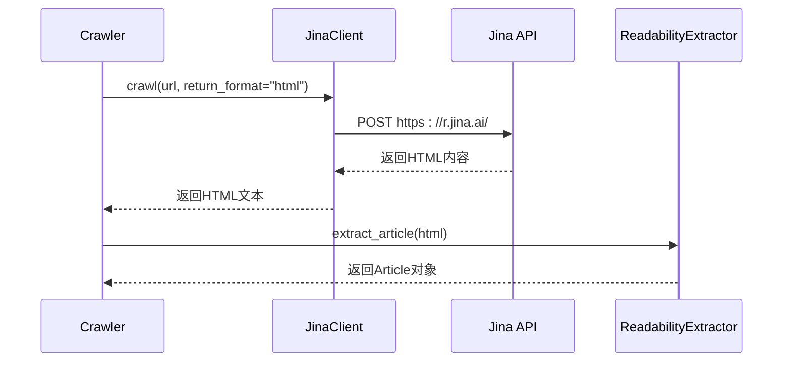

# 网络爬虫

<cite>
**本文档中引用的文件**   
- [crawler.py](file://src/crawler/crawler.py)
- [article.py](file://src/crawler/article.py)
- [jina_client.py](file://src/crawler/jina_client.py)
- [readability_extractor.py](file://src/crawler/readability_extractor.py)
- [crawl.py](file://src/tools/crawl.py)
</cite>

## 目录
1. [引言](#引言)
2. [爬取策略](#爬取策略)
3. [内容提取机制](#内容提取机制)
4. [文章数据结构化处理](#文章数据结构化处理)
5. [配置参数说明](#配置参数说明)
6. [爬取效率优化技巧](#爬取效率优化技巧)
7. [错误处理机制](#错误处理机制)
8. [研究任务中的调用示例](#研究任务中的调用示例)
9. [结论](#结论)

## 引言

deer-flow 网络爬虫模块是一个专门设计用于从网页中提取纯净内容的系统，旨在为大型语言模型提供高质量的输入数据。该模块通过组合使用远程API和本地解析技术，实现了高效、可靠的内容抓取和结构化处理。核心功能包括网页内容爬取、HTML内容清洗、Markdown格式转换以及结构化数据输出。本模块在研究任务中扮演着关键角色，能够帮助研究人员快速获取实时信息并进行深入分析。

**Section sources**
- [crawler.py](file://src/crawler/crawler.py#L1-L27)
- [article.py](file://src/crawler/article.py#L1-L37)

## 爬取策略

### 请求调度机制

deer-flow 网络爬虫模块采用基于 Jina Reader API 的请求调度机制。该模块通过 `JinaClient` 类向 Jina 服务发送 HTTP POST 请求来获取网页内容。请求调度的核心在于利用 Jina 提供的远程服务来处理网页抓取和初步解析任务，从而避免了直接处理复杂的网络请求和反爬虫机制。



**Diagram sources**
- [crawler.py](file://src/crawler/crawler.py#L15-L27)
- [jina_client.py](file://src/crawler/jina_client.py#L10-L27)

### 反爬虫处理

该爬虫模块的反爬虫处理策略主要依赖于 Jina 服务的基础设施。当未配置 Jina API 密钥时，系统会记录警告信息，提示用户可以提供自己的密钥以获得更高的请求速率限制。这种设计既保证了基本功能的可用性，又为需要高频请求的用户提供了性能优化的途径。

```mermaid
flowchart TD
    Start([开始爬取]) --> CheckAPIKey["检查JINA_API_KEY环境变量"]
    CheckAPIKey -->|存在| SetAuthHeader["设置Authorization请求头"]
    CheckAPIKey -->|不存在| LogWarning["