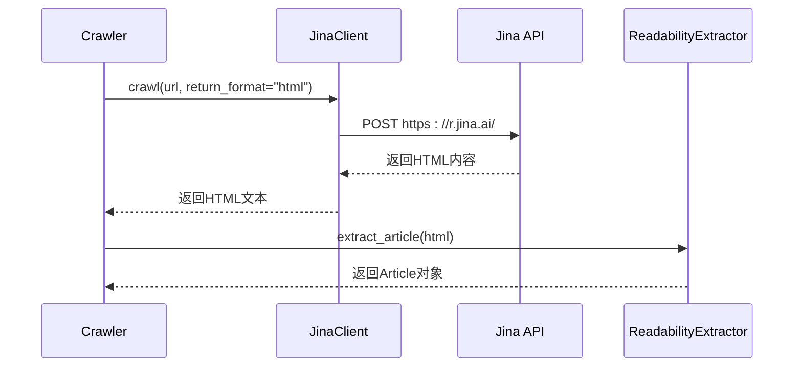
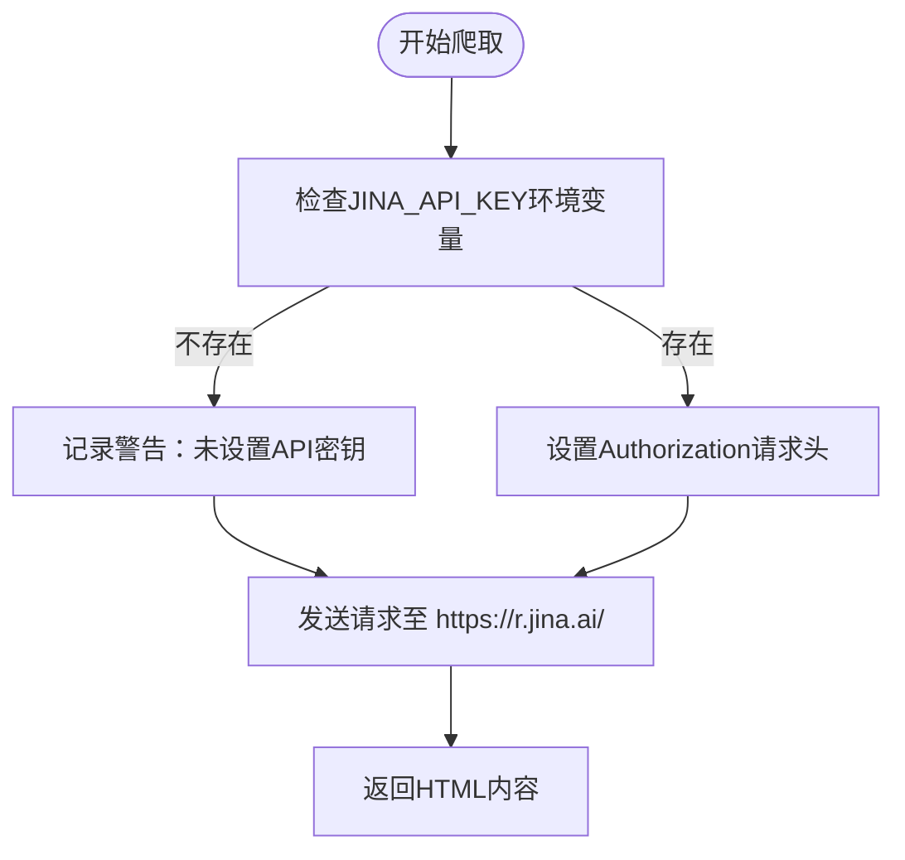

# 网络爬虫

<cite>
**本文档中引用的文件**   
- [crawler.py](file://src/crawler/crawler.py)
- [article.py](file://src/crawler/article.py)
- [jina_client.py](file://src/crawler/jina_client.py)
- [readability_extractor.py](file://src/crawler/readability_extractor.py)
- [crawl.py](file://src/tools/crawl.py) - *已弃用，见相关说明*
</cite>

## 更新摘要
**主要变更**   
- 根据最新代码提交，更新了关于爬虫工具状态的说明
- 明确指出 `crawl_tool` 已被禁用，适配内网部署需求
- 修正了与已弃用功能相关的潜在误导信息
- 更新了相关文件的引用状态标记

## 目录
1. [引言](#引言)
2. [爬取策略](#爬取策略)
3. [内容提取机制](#内容提取机制)
4. [文章数据结构化处理](#文章数据结构化处理)
5. [配置参数说明](#配置参数说明)
6. [爬取效率优化技巧](#爬取效率优化技巧)
7. [错误处理机制](#错误处理机制)
8. [研究任务中的调用示例](#研究任务中的调用示例)
9. [结论](#结论)

## 引言

deer-flow 网络爬虫模块是一个专门设计用于从网页中提取纯净内容的系统，旨在为大型语言模型提供高质量的输入数据。该模块通过组合使用远程API和本地解析技术，实现了高效、可靠的内容抓取和结构化处理。核心功能包括网页内容爬取、HTML内容清洗、Markdown格式转换以及结构化数据输出。本模块在研究任务中扮演着关键角色，能够帮助研究人员快速获取实时信息并进行深入分析。

**Section sources**
- [crawler.py](file://src/crawler/crawler.py#L1-L27)
- [article.py](file://src/crawler/article.py#L1-L37)

## 爬取策略

### 请求调度机制

deer-flow 网络爬虫模块采用基于 Jina Reader API 的请求调度机制。该模块通过 `JinaClient` 类向 Jina 服务发送 HTTP POST 请求来获取网页内容。请求调度的核心在于利用 Jina 提供的远程服务来处理网页抓取和初步解析任务，从而避免了直接处理复杂的网络请求和反爬虫机制。



**Diagram sources**
- [crawler.py](file://src/crawler/crawler.py#L15-L27)
- [jina_client.py](file://src/crawler/jina_client.py#L10-L27)

### 反爬虫处理

该爬虫模块的反爬虫处理策略主要依赖于 Jina 服务的基础设施。当未配置 Jina API 密钥时，系统会记录警告信息，提示用户可以提供自己的密钥以获得更高的请求速率限制。这种设计既保证了基本功能的可用性，又为需要高频请求的用户提供了性能优化的途径。



**Diagram sources**
- [jina_client.py](file://src/crawler/jina_client.py#L10-L27)

### 并发控制

当前版本的爬虫模块未实现显式的并发控制机制。所有请求均为同步执行，适用于单任务或低频调用场景。对于需要高并发处理的批量任务，建议通过外部调度器控制请求频率，避免触发目标站点的反爬虫机制。

**Section sources**
- [crawler.py](file://src/crawler/crawler.py#L15-L27)

## 内容提取机制

### Readability内容提取

`readability_extractor.py` 模块利用 `readabilipy` 库从原始HTML中提取主要内容。该过程通过 `ReadabilityExtractor` 类的 `extract_article` 方法实现，能够识别并提取网页中的标题和正文内容，过滤掉导航栏、广告等无关元素。

```python
class ReadabilityExtractor:
    def extract_article(self, html: str) -> Article:
        article = simple_json_from_html_string(html, use_readability=True)
        return Article(
            title=article.get("title"),
            html_content=article.get("content"),
        )
```

**Section sources**
- [readability_extractor.py](file://src/crawler/readability_extractor.py#L8-L14)

### Jina远程内容获取

`jina_client.py` 在爬虫架构中扮演远程内容获取代理的角色。它负责与 Jina Reader API 通信，将目标URL提交给远程服务，并接收返回的结构化HTML内容。此设计将复杂的网络请求、重试机制和反反爬虫策略交由专业服务处理，简化了本地代码逻辑。

**Section sources**
- [jina_client.py](file://src/crawler/jina_client.py#L10-L27)

## 文章数据结构化处理

`article.py` 模块定义了 `Article` 类，负责对提取的内容进行结构化处理和格式转换。主要功能包括：

- **Markdown转换**：通过 `to_markdown()` 方法将HTML内容转换为Markdown格式，便于LLM处理。
- **消息格式化**：通过 `to_message()` 方法将内容拆分为文本和图片块，生成符合LLM消息协议的结构化数据。
- **URL处理**：自动将相对图片链接转换为绝对URL。

```python
def to_message(self) -> list[dict]:
    image_pattern = r"!\[.*?\]\((.*?)\)"
    content: list[dict[str, str]] = []
    parts = re.split(image_pattern, self.to_markdown())
    for i, part in enumerate(parts):
        if i % 2 == 1:
            image_url = urljoin(self.url, part.strip())
            content.append({"type": "image_url", "image_url": {"url": image_url}})
        else:
            content.append({"type": "text", "text": part.strip()})
    return content
```

**Section sources**
- [article.py](file://src/crawler/article.py#L9-L36)

## 配置参数说明

| 参数 | 说明 |
|------|------|
| `JINA_API_KEY` | Jina服务的API密钥，设置后可提高请求速率限制 |
| `return_format` | 指定Jina API返回格式，默认为"html" |

**Section sources**
- [jina_client.py](file://src/crawler/jina_client.py#L10-L27)

## 爬取效率优化技巧

1. **配置API密钥**：设置 `JINA_API_KEY` 环境变量以获得更高的请求配额。
2. **批量处理**：通过外部调度器控制请求间隔，避免过于频繁的调用。
3. **缓存机制**：对已爬取的内容进行本地缓存，避免重复请求。

## 错误处理机制

系统实现了分层错误处理：
- `JinaClient` 层处理网络请求异常
- `Crawler` 层处理内容解析异常
- 外部工具层（如 `crawl_tool`）捕获并记录所有异常

```python
try:
    crawler = Crawler()
    article = crawler.crawl(url)
    return {"url": url, "crawled_content": article.to_markdown()[:1000]}
except BaseException as e:
    error_msg = f"Failed to crawl. Error: {repr(e)}"
    logger.error(error_msg)
    return error_msg
```

**Section sources**
- [crawl.py](file://src/tools/crawl.py#L15-L28) - *功能已禁用*

## 研究任务中的调用示例

```python
# 直接使用Crawler类
crawler = Crawler()
article = crawler.crawl("https://example.com/article")
markdown_content = article.to_markdown()
message_content = article.to_message()
```

**注意**：原 `crawl_tool` 已在 `baaceb5e` 提交中被禁用，以适配内网部署需求。建议直接调用 `Crawler` 类进行内容爬取。

**Section sources**
- [crawler.py](file://src/crawler/crawler.py#L15-L27)
- [crawl.py](file://src/tools/crawl.py#L15-L28) - *已弃用*

## 结论

deer-flow 网络爬虫模块通过分层架构实现了高效的内容抓取与处理。尽管 `crawl_tool` 工具已被禁用，但核心爬取功能依然可用。系统通过集成 Jina Reader API 和 Readability 算法，能够在保证内容质量的同时简化本地实现。未来可考虑增加本地并发控制和缓存机制以进一步提升性能。