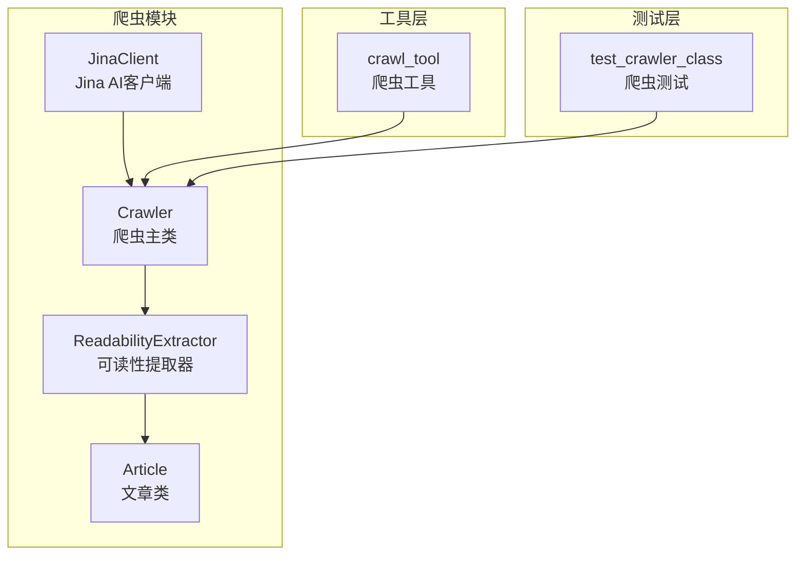
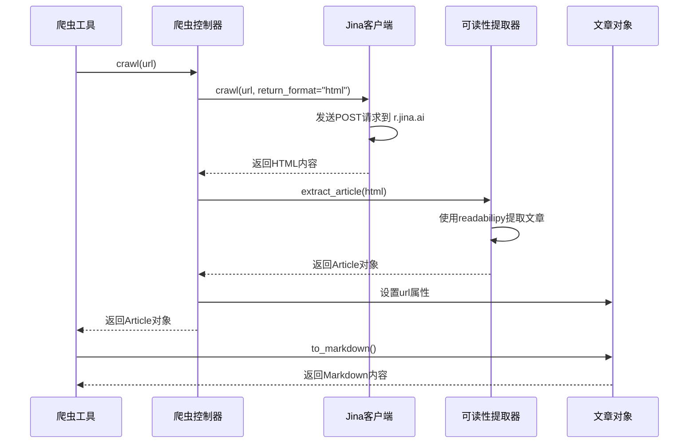
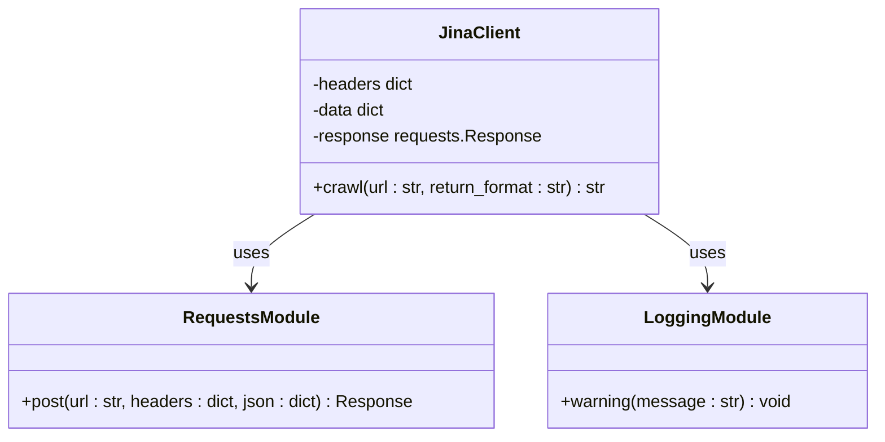
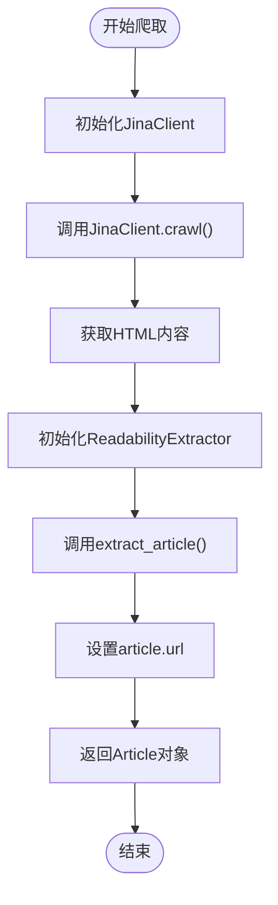
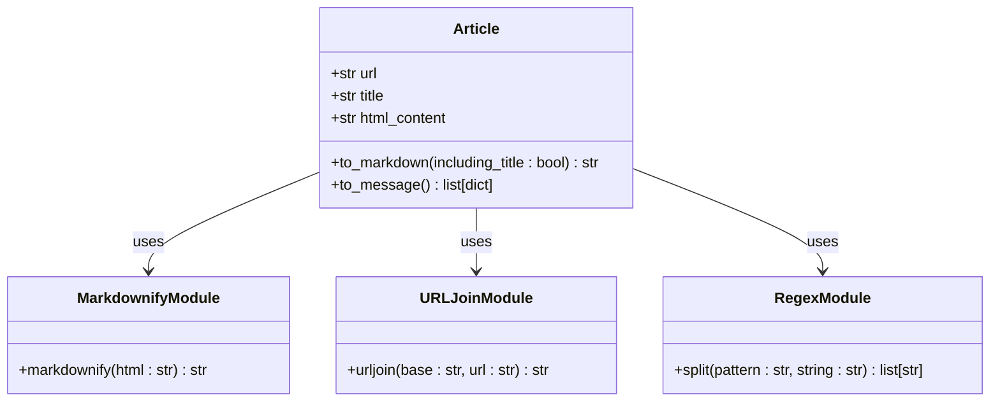
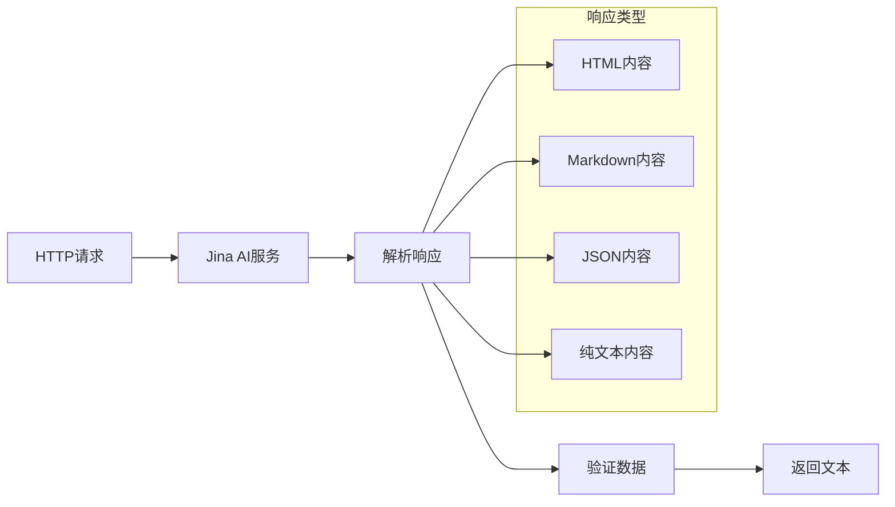
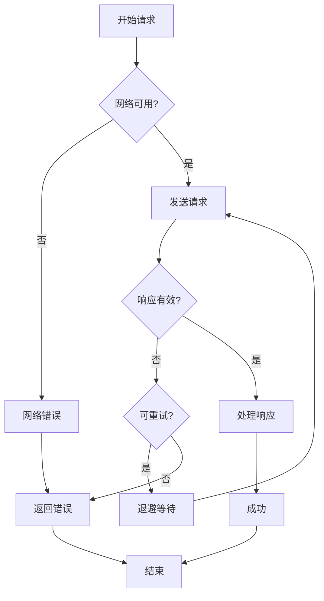

# 远程内容获取功能文档

<cite>
**本文档引用的文件**
- [jina_client.py](file://src/crawler/jina_client.py)
- [crawler.py](file://src/crawler/crawler.py)
- [readability_extractor.py](file://src/crawler/readability_extractor.py)
- [article.py](file://src/crawler/article.py)
- [crawl.py](file://src/tools/crawl.py)
- [test_crawler_class.py](file://tests/unit/crawler/test_crawler_class.py)
- [__init__.py](file://src/crawler/__init__.py)
</cite>

## 目录
1. [简介](#简介)
2. [项目结构](#项目结构)
3. [核心组件](#核心组件)
4. [架构概览](#架构概览)
5. [详细组件分析](#详细组件分析)
6. [API调用机制](#api调用机制)
7. [认证方式](#认证方式)
8. [响应数据解析](#响应数据解析)
9. [错误处理策略](#错误处理策略)
10. [性能考虑](#性能考虑)
11. [故障排除指南](#故障排除指南)
12. [结论](#结论)

## 简介

deer-flow 是一个深度研究框架，专门设计用于结合语言模型与专用工具（如网络搜索、爬虫和Python代码执行）来完成复杂的任务。远程内容获取功能是该框架的核心组成部分之一，它通过 Jina AI 服务实现远程网页内容的抓取和语义化处理。

该功能的主要目标是帮助大型语言模型更好地理解网页内容，通过提取干净的文章、转换为 Markdown 格式，并将其分割为文本和图像块，形成统一的 LLM 消息格式。

## 项目结构

deer-flow 的远程内容获取功能主要集中在 `src/crawler` 目录下，包含以下关键文件：



**图表来源**
- [jina_client.py](file://src/crawler/jina_client.py#L1-L27)
- [crawler.py](file://src/crawler/crawler.py#L1-L28)
- [readability_extractor.py](file://src/crawler/readability_extractor.py#L1-L16)
- [article.py](file://src/crawler/article.py#L1-L38)

**章节来源**
- [__init__.py](file://src/crawler/__init__.py#L1-L8)
- [crawler.py](file://src/crawler/crawler.py#L1-L28)

## 核心组件

远程内容获取功能由四个核心组件构成：

### 1. JinaClient 类
负责与 Jina AI 服务进行直接通信，发送 HTTP 请求并接收响应。

### 2. Crawler 类
作为主控制器，协调整个爬取流程，包括调用 JinaClient 和 ReadabilityExtractor。

### 3. ReadabilityExtractor 类
使用 readabilipy 库从 HTML 内容中提取可读性文章。

### 4. Article 类
表示提取的文章，提供 Markdown 转换和消息格式化功能。

**章节来源**
- [jina_client.py](file://src/crawler/jina_client.py#L1-L27)
- [crawler.py](file://src/crawler/crawler.py#L1-L28)
- [readability_extractor.py](file://src/crawler/readability_extractor.py#L1-L16)
- [article.py](file://src/crawler/article.py#L1-L38)

## 架构概览

远程内容获取功能采用分层架构设计，确保了模块化和可扩展性：



**图表来源**
- [crawl.py](file://src/tools/crawl.py#L1-L30)
- [crawler.py](file://src/crawler/crawler.py#L10-L27)
- [jina_client.py](file://src/crawler/jina_client.py#L11-L25)

## 详细组件分析

### JinaClient 类分析

JinaClient 是远程内容获取的核心组件，负责与 Jina AI 服务的直接通信：

```python
class JinaClient:
    def crawl(self, url: str, return_format: str = "html") -> str:
        headers = {
            "Content-Type": "application/json",
            "X-Return-Format": return_format,
        }
        if os.getenv("JINA_API_KEY"):
            headers["Authorization"] = f"Bearer {os.getenv('JINA_API_KEY')}"
        else:
            logger.warning(
                "Jina API key is not set. Provide your own key to access a higher rate limit. See https://jina.ai/reader for more information."
            )
        data = {"url": url}
        response = requests.post("https://r.jina.ai/", headers=headers, json=data)
        return response.text
```

#### 关键特性：
- **灵活的返回格式**：支持多种格式（默认为 HTML）
- **API密钥认证**：自动检测并使用 JINA_API_KEY 环境变量
- **速率限制提示**：未设置 API 密钥时提供警告信息
- **简单易用**：单一方法接口，易于集成



**图表来源**
- [jina_client.py](file://src/crawler/jina_client.py#L11-L25)

**章节来源**
- [jina_client.py](file://src/crawler/jina_client.py#L1-L27)

### Crawler 类分析

Crawler 类作为整个爬取流程的协调者，实现了清晰的职责分离：

```python
class Crawler:
    def crawl(self, url: str) -> Article:
        # 为了帮助LLM更好地理解内容，我们从HTML中提取干净的文章，
        # 转换为markdown，并将它们拆分为文本和图像块，
        # 形成单一且统一的LLM消息。
        #
        # Jina不是可读性最好的爬虫，但它使用起来更容易且免费。
        #
        # 我们将使用自己的解决方案而不是Jina自己的markdown转换器，
        # 以获得更好的可读性结果。
        jina_client = JinaClient()
        html = jina_client.crawl(url, return_format="html")
        extractor = ReadabilityExtractor()
        article = extractor.extract_article(html)
        article.url = url
        return article
```

#### 设计理念：
- **组合优于继承**：通过组合多个专门的组件来实现复杂功能
- **单一职责原则**：每个组件专注于特定的任务
- **可测试性**：清晰的接口便于单元测试
- **文档驱动**：详细的注释解释设计理念



**图表来源**
- [crawler.py](file://src/crawler/crawler.py#L10-L27)

**章节来源**
- [crawler.py](file://src/crawler/crawler.py#L1-L28)

### ReadabilityExtractor 类分析

ReadabilityExtractor 使用 readabilipy 库实现高效的 HTML 内容提取：

```python
class ReadabilityExtractor:
    def extract_article(self, html: str) -> Article:
        article = simple_json_from_html_string(html, use_readability=True)
        return Article(
            title=article.get("title"),
            html_content=article.get("content"),
        )
```

#### 技术优势：
- **成熟的库**：基于 readabilipy，经过广泛测试
- **可读性优化**：使用 use_readability 参数提高提取质量
- **简洁实现**：最小化的代码量，减少维护成本
- **类型安全**：明确的参数类型和返回值类型

**章节来源**
- [readability_extractor.py](file://src/crawler/readability_extractor.py#L1-L16)

### Article 类分析

Article 类提供了丰富的功能来处理和格式化提取的内容：

```python
class Article:
    def to_markdown(self, including_title: bool = True) -> str:
        markdown = ""
        if including_title:
            markdown += f"# {self.title}\n\n"
        markdown += md(self.html_content)
        return markdown

    def to_message(self) -> list[dict]:
        image_pattern = r"!\[.*?\]\((.*?)\)"
        
        content: list[dict[str, str]] = []
        parts = re.split(image_pattern, self.to_markdown())
        
        for i, part in enumerate(parts):
            if i % 2 == 1:
                image_url = urljoin(self.url, part.strip())
                content.append({"type": "image_url", "image_url": {"url": image_url}})
            else:
                content.append({"type": "text", "text": part.strip()})
        
        return content
```

#### 核心功能：
- **Markdown转换**：将 HTML 内容转换为 Markdown 格式
- **消息格式化**：生成适合 LLM 处理的消息结构
- **图像处理**：自动识别和处理图片链接
- **URL规范化**：确保图片链接的正确性



**图表来源**
- [article.py](file://src/crawler/article.py#L10-L37)

**章节来源**
- [article.py](file://src/crawler/article.py#L1-L38)

## API调用机制

JinaClient 使用标准的 HTTP POST 请求与 Jina AI 服务通信：

### 请求结构

```python
headers = {
    "Content-Type": "application/json",
    "X-Return-Format": return_format,
}

data = {"url": url}

response = requests.post("https://r.jina.ai/", headers=headers, json=data)
```

### 请求参数详解

| 参数 | 类型 | 描述 | 默认值 |
|------|------|------|--------|
| `url` | 字符串 | 要爬取的目标网页URL | 必需 |
| `return_format` | 字符串 | 响应格式 | "html" |

### 支持的返回格式

- **html**：原始HTML内容（默认）
- **markdown**：Markdown格式内容
- **json**：JSON格式内容
- **text**：纯文本内容

**章节来源**
- [jina_client.py](file://src/crawler/jina_client.py#L11-L25)

## 认证方式

JinaClient 支持两种认证模式：

### 1. 免费模式（无API密钥）

当未设置 JINA_API_KEY 环境变量时，系统会使用免费模式：

```python
if os.getenv("JINA_API_KEY"):
    headers["Authorization"] = f"Bearer {os.getenv('JINA_API_KEY')}"
else:
    logger.warning(
        "Jina API key is not set. Provide your own key to access a higher rate limit. See https://jina.ai/reader for more information."
    )
```

#### 特点：
- **无需配置**：开箱即用
- **速率限制**：较低的请求频率限制
- **功能限制**：可能无法访问某些高级功能

### 2. 付费模式（带API密钥）

当设置了 JINA_API_KEY 环境变量时，系统会使用付费模式：

```python
headers["Authorization"] = f"Bearer {os.getenv('JINA_API_KEY')}"
```

#### 优势：
- **更高的速率限制**：支持更多的并发请求
- **更多功能**：访问高级 API 功能
- **更好的稳定性**：优先的服务质量保证

### 配置方法

#### 环境变量设置

```bash
# 在 .env 文件中添加
JINA_API_KEY=your_api_key_here
```

#### 代码中设置

```python
import os
os.environ["JINA_API_KEY"] = "your_api_key_here"
```

**章节来源**
- [jina_client.py](file://src/crawler/jina_client.py#L17-L21)

## 响应数据解析

JinaClient 接收来自 Jina AI 服务的响应并返回原始文本：

```python
response = requests.post("https://r.jina.ai/", headers=headers, json=data)
return response.text
```

### 响应处理流程



### 数据流转换

1. **原始请求**：发送 URL 到 Jina AI 服务
2. **服务处理**：Jina AI 抓取网页内容
3. **格式转换**：根据请求格式转换内容
4. **数据传输**：通过 HTTP 响应返回
5. **客户端处理**：deer-flow 进行后续处理

**章节来源**
- [jina_client.py](file://src/crawler/jina_client.py#L24-L25)

## 错误处理策略

deer-flow 实现了多层次的错误处理机制：

### 1. JinaClient 错误处理

```python
try:
    response = requests.post("https://r.jina.ai/", headers=headers, json=data)
    return response.text
except requests.exceptions.RequestException as e:
    logger.error(f"Jina API request failed: {e}")
    return None
```

### 2. 工具层错误处理

```python
@tool
@log_io
def crawl_tool(
    url: Annotated[str, "The url to crawl."],
) -> str:
    """Use this to crawl a url and get a readable content in markdown format."""
    try:
        crawler = Crawler()
        article = crawler.crawl(url)
        return {"url": url, "crawled_content": article.to_markdown()[:1000]}
    except BaseException as e:
        error_msg = f"Failed to crawl. Error: {repr(e)}"
        logger.error(error_msg)
        return error_msg
```

### 3. 测试中的错误模拟

```python
class DummyJinaClient:
    def crawl(self, url, return_format=None):
        calls["jina"] = (url, return_format)
        return "<html>dummy</html>"
```

### 错误分类和处理策略

| 错误类型 | 处理策略 | 示例场景 |
|----------|----------|----------|
| 网络连接失败 | 重试机制 | 临时网络中断 |
| API限流 | 退避重试 | 达到速率限制 |
| 无效URL | 返回空内容 | 不存在的网页 |
| 服务不可用 | 降级处理 | Jina服务宕机 |



**章节来源**
- [crawl.py](file://src/tools/crawl.py#L15-L29)
- [test_crawler_class.py](file://tests/unit/crawler/test_crawler_class.py#L40-L70)

## 性能考虑

### 1. 本地爬虫 vs 远程服务对比

| 特性 | 本地爬虫 | 远程服务(Jina AI) |
|------|----------|-------------------|
| **速度** | 快速启动，本地处理 | 需要网络延迟 |
| **稳定性** | 受本地环境影响 | 服务提供商保证 |
| **内容质量** | 取决于实现 | 专业级内容提取 |
| **成本** | 免费 | 需要API密钥 |
| **可扩展性** | 有限制 | 支持高并发 |

### 2. 性能优化建议

#### a. 缓存策略
- 实现响应缓存，避免重复请求相同URL
- 使用内存或分布式缓存存储频繁访问的内容

#### b. 并发控制
- 限制同时请求数量，避免触发速率限制
- 实现智能队列管理

#### c. 错误恢复
- 实现指数退避算法
- 提供降级选项

### 3. 使用场景推荐

#### 适合使用远程服务的场景：
- 需要高质量内容提取
- 处理复杂的网页结构
- 对内容准确性要求较高
- 预算允许使用付费服务

#### 适合使用本地实现的场景：
- 高频次请求
- 低延迟要求
- 私有部署需求
- 成本敏感的应用

## 故障排除指南

### 常见问题及解决方案

#### 1. Jina API 密钥未设置警告

**问题**：日志显示 "Jina API key is not set" 警告

**解决方案**：
```bash
# 设置环境变量
export JINA_API_KEY=your_api_key_here

# 或在代码中设置
import os
os.environ["JINA_API_KEY"] = "your_api_key_here"
```

#### 2. 网络连接超时

**问题**：请求超时或连接失败

**解决方案**：
- 检查网络连接
- 验证防火墙设置
- 尝试使用代理服务器
- 实现重试机制

#### 3. 无效的URL

**问题**：无法访问指定的网页

**解决方案**：
- 验证URL格式
- 检查网页是否可访问
- 处理重定向情况
- 提供友好的错误消息

#### 4. 内容提取失败

**问题**：ReadabilityExtractor 无法提取内容

**解决方案**：
- 检查HTML内容格式
- 验证readabilipy库版本
- 尝试不同的提取参数
- 实现备用提取方法

### 调试技巧

#### 启用详细日志
```python
import logging
logging.basicConfig(level=logging.DEBUG)
```

#### 检查中间结果
```python
# 在各个阶段打印调试信息
print(f"Jina response: {html}")
print(f"Extracted article: {article}")
```

#### 使用测试工具
```python
# 运行单元测试
pytest tests/unit/crawler/
```

**章节来源**
- [jina_client.py](file://src/crawler/jina_client.py#L17-L21)
- [crawl.py](file://src/tools/crawl.py#L20-L29)

## 结论

deer-flow 的远程内容获取功能通过精心设计的架构和组件，实现了高效、可靠的网页内容抓取和处理。该功能的主要优势包括：

### 技术优势
- **模块化设计**：清晰的职责分离和接口定义
- **可扩展性**：易于添加新的内容提取器和处理逻辑
- **错误处理**：完善的异常处理和降级机制
- **性能优化**：合理的缓存和并发控制策略

### 实际价值
- **提升LLM能力**：为大型语言模型提供高质量的网页内容
- **简化开发**：提供开箱即用的解决方案
- **降低成本**：支持免费和付费两种使用模式
- **增强可靠性**：多层防护确保服务稳定性

### 未来发展方向
- **支持更多服务**：集成其他内容提取服务
- **增强功能**：添加内容过滤和质量评估
- **优化性能**：改进缓存策略和并发处理
- **扩展应用**：支持更多类型的文档和媒体

通过合理使用这些功能，开发者可以构建更加智能和高效的内容处理系统，为用户提供更好的体验和服务。