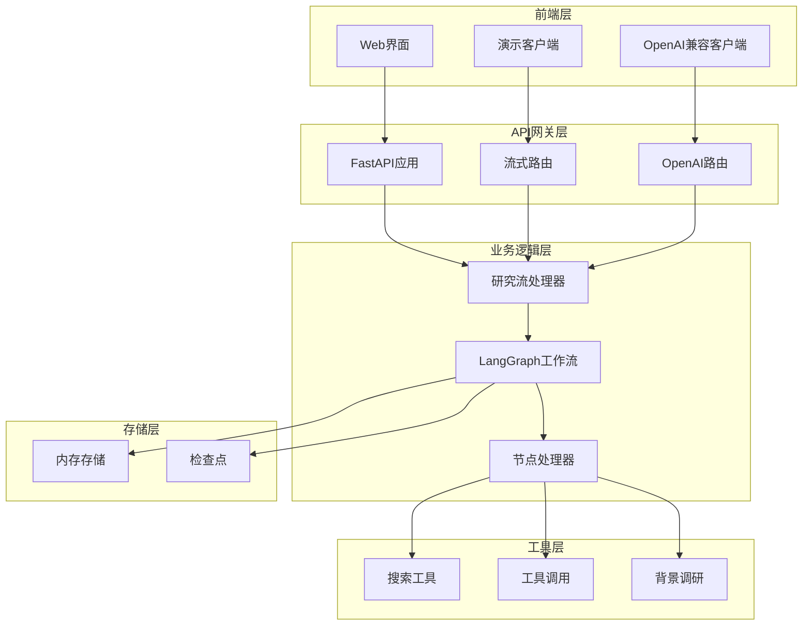
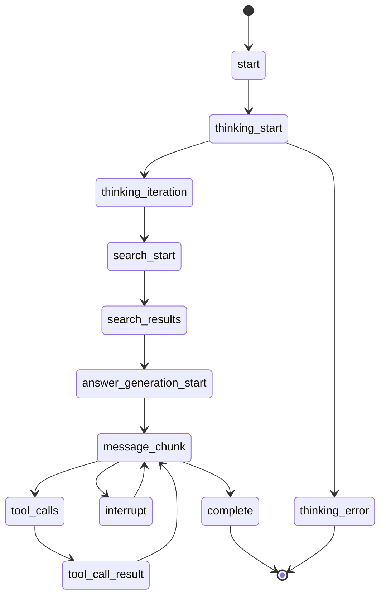
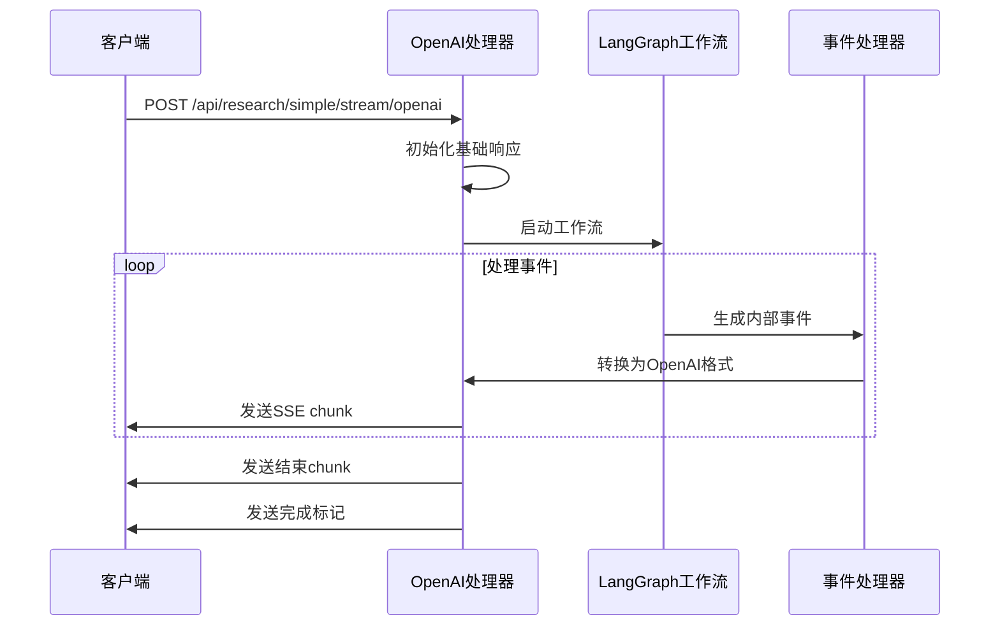

# 流式API接口

<cite>
**本文档引用的文件**
- [src/server/app.py](file://src/server/app.py)
- [src/server/chat_request.py](file://src/server/chat_request.py)
- [demo_stream_client.py](file://demo_stream_client.py)
- [test_openai_stream.py](file://test_openai_stream.py)
- [test_f1_research.py](file://test_f1_research.py)
- [web/src/core/api/types.ts](file://web/src/core/api/types.ts)
- [web/src/core/messages/merge-message.ts](file://web/src/core/messages/merge-message.ts)
- [src/graph/builder.py](file://src/graph/builder.py)
- [src/graph/nodes.py](file://src/graph/nodes.py)
- [src/tools/search.py](file://src/tools/search.py)
</cite>

## 目录
1. [简介](#简介)
2. [项目架构概览](#项目架构概览)
3. [核心接口分析](#核心接口分析)
4. [SSE事件流详解](#sse事件流详解)
5. [OpenAI格式兼容性](#openai格式兼容性)
6. [客户端处理逻辑](#客户端处理逻辑)
7. [错误处理机制](#错误处理机制)
8. [性能优化建议](#性能优化建议)
9. [故障排除指南](#故障排除指南)
10. [总结](#总结)

## 简介

DeerFlow项目提供了两个主要的流式API接口，专门用于处理简化研究任务。这些接口基于SSE（Server-Sent Events）技术，支持实时事件流传输，为用户提供流畅的交互体验。本文档详细介绍了这两个接口的区别、使用场景以及客户端处理逻辑。

## 项目架构概览



**图表来源**
- [src/server/app.py](file://src/server/app.py#L681-L763)
- [src/graph/builder.py](file://src/graph/builder.py#L85-L137)

## 核心接口分析

### /api/research/simple/stream 接口

这是基础的流式研究接口，直接使用完整的LangGraph工作流，支持参数定制。

```python
@app.post("/api/research/simple/stream")
async def simple_research_stream(request: SimpleResearchRequest):
    """
    简化流式研究接口：直接使用完整的 LangGraph 工作流，支持参数定制
    
    - 移除双模式选择，统一使用 LangGraph 工作流
    - 支持与 /api/chat/stream 一致的完整功能
    - 保持所有参数可定制
    - 提供 SSE 实时事件流
    """
```

**主要特性：**
- **统一工作流**：直接使用LangGraph工作流，无需双模式切换
- **完整功能**：支持所有参数定制，包括搜索引擎、深度思考等
- **SSE格式**：返回标准的SSE事件流
- **实时监控**：提供详细的执行过程监控

### /api/research/simple/stream/openai 接口

OpenAI格式的简化流式研究接口，返回OpenAI兼容的SSE流式响应。

```python
@app.post("/api/research/simple/stream/openai")
async def simple_research_stream_openai(request: SimpleResearchRequest):
    """
    OpenAI格式的简化流式研究接口
    
    - 返回OpenAI兼容的SSE流式响应
    - 包含id、object、created、model、choices等OpenAI标准字段
    - 保持与/api/research/simple/stream相同的功能
    - 为需要OpenAI格式的客户端提供兼容性
    """
```

**主要特性：**
- **OpenAI兼容**：完全符合OpenAI chat.completion.chunk格式
- **标准字段**：包含id、object、created、model、choices等标准字段
- **向后兼容**：为现有OpenAI客户端提供无缝迁移支持
- **格式转换**：内部使用LangGraph工作流，但对外提供OpenAI格式

**章节来源**
- [src/server/app.py](file://src/server/app.py#L681-L763)

## SSE事件流详解

### 支持的事件类型

系统支持多种SSE事件类型，每种事件类型都有特定的用途和格式：



**图表来源**
- [src/server/app.py](file://src/server/app.py#L182-L226)

### 事件类型详细说明

#### 1. message_chunk 事件

**用途**：传输文本内容块，支持增量更新

**数据格式**：
```typescript
{
  "type": "message_chunk",
  "data": {
    "id": "string",
    "thread_id": "string",
    "agent": "coordinator" | "planner" | "researcher" | "coder" | "reporter",
    "role": "user" | "assistant" | "tool",
    "content": "string",
    "reasoning_content": "string",
    "finish_reason": "stop" | "tool_calls" | "interrupt"
  }
}
```

**使用场景**：
- 实时显示生成的内容
- 支持多轮对话的增量传输
- 包含推理过程的详细内容

#### 2. tool_calls 事件

**用途**：传输工具调用信息

**数据格式**：
```typescript
{
  "type": "tool_calls",
  "data": {
    "id": "string",
    "thread_id": "string",
    "agent": "coordinator" | "planner" | "researcher" | "coder" | "reporter",
    "role": "user" | "assistant" | "tool",
    "tool_calls": [
      {
        "id": "string",
        "name": "string",
        "args": object
      }
    ]
  }
}
```

**使用场景**：
- 搜索工具调用
- 数据处理工具调用
- 外部API调用

#### 3. tool_call_result 事件

**用途**：传输工具调用结果

**数据格式**：
```typescript
{
  "type": "tool_call_result",
  "data": {
    "id": "string",
    "thread_id": "string",
    "agent": "coordinator" | "planner" | "researcher" | "coder" | "reporter",
    "role": "user" | "assistant" | "tool",
    "tool_call_id": "string",
    "content": "string"
  }
}
```

**使用场景**：
- 搜索结果返回
- 数据处理结果展示
- API调用结果处理

#### 4. interrupt 事件

**用途**：传输中断信息，等待用户确认

**数据格式**：
```typescript
{
  "type": "interrupt",
  "data": {
    "id": "string",
    "thread_id": "string",
    "agent": "coordinator" | "planner" | "researcher" | "coder" | "reporter",
    "role": "user" | "assistant" | "tool",
    "options": [
      {
        "label": "string",
        "value": "string"
      }
    ]
  }
}
```

**使用场景**：
- 计划审核中断
- 用户确认操作
- 错误处理中断

#### 5. complete 事件

**用途**：表示整个流程完成

**数据格式**：
```typescript
{
  "type": "complete",
  "data": {
    "id": "string",
    "thread_id": "string",
    "conversation_id": "string",
    "thinking_steps": number,
    "execution_time": number,
    "sources": ["string"],
    "is_complete": true
  }
}
```

**使用场景**：
- 流程结束通知
- 结果汇总
- 资源统计

**章节来源**
- [web/src/core/api/types.ts](file://web/src/core/api/types.ts#L0-L83)
- [src/server/app.py](file://src/server/app.py#L182-L226)

## OpenAI格式兼容性

### OpenAI标准字段映射

OpenAI格式的流式接口通过`_direct_langgraph_openai_generator`函数将内部事件转换为OpenAI标准格式：

```python
async def _direct_langgraph_openai_generator(
    request: SimpleResearchRequest,
    thread_id: str
):
    """
    OpenAI标准的LangGraph工作流生成器
    返回符合OpenAI chat.completion.chunk格式的流式响应
    """
    import time
    
    # 初始化OpenAI格式基本信息（所有chunk共享相同的基础信息）
    base_timestamp = int(time.time())
    base_response = {
        "id": thread_id,
        "object": "chat.completion.chunk",
        "created": base_timestamp,
        "model": "deer-flow-research",
        "system_fingerprint": "fp_deer_flow_v1",
        "choices": []
    }
```

### 字段映射关系

| OpenAI字段 | 内部字段 | 描述 |
|------------|----------|------|
| `id` | `thread_id` | 会话唯一标识符 |
| `object` | 固定值 | `chat.completion.chunk` |
| `created` | 当前时间戳 | Unix时间戳 |
| `model` | 固定值 | `deer-flow-research` |
| `choices` | 动态生成 | 包含delta内容 |

### OpenAI格式转换流程



**图表来源**
- [src/server/app.py](file://src/server/app.py#L850-L1046)

### OpenAI格式验证

测试脚本验证了OpenAI格式的完整性：

```python
# OpenAI标准字段检查
openai_fields_found = {
    "id": False,
    "object": False,
    "created": False,
    "model": False,
    "choices": False
}

# 检查字段是否存在
for field in openai_fields_found:
    if field in chunk_data:
        openai_fields_found[field] = True
```

**章节来源**
- [src/server/app.py](file://src/server/app.py#L850-L1046)
- [test_openai_stream.py](file://test_openai_stream.py#L59-L95)

## 客户端处理逻辑

### 基础SSE客户端处理

演示客户端展示了如何处理基础的SSE事件流：

```python
async def test_simple_stream():
    """测试流式简化研究接口"""
    
    # 简单的测试请求
    request_data = {
        "messages": [
            {
                "role": "user",
                "content": "什么是大语言模型？它有哪些应用？"
            }
        ],
        "max_search_results": 2,
        "search_engine": "custom_search",
        "enable_deep_thinking": False,
        "max_thinking_iterations": 1,
        "max_recursion_limit": 10
    }
    
    # 建立连接
    async with session.post(
        "http://localhost:8000/api/research/simple/stream",
        json=request_data,
        headers={"Content-Type": "application/json"}
    ) as response:
        
        # 处理事件
        async for line in response.content:
            line_str = line.decode('utf-8').strip()
            
            if line_str.startswith('event:'):
                current_event_type = line_str[6:].strip()
                continue
                
            elif line_str.startswith('data:'):
                try:
                    data_json = line_str[5:].strip()
                    data = json.loads(data_json)
                    event_count += 1
                    
                    # 显示事件
                    show_event(current_event_type, data, event_count)
                    
                except json.JSONDecodeError as e:
                    print(f"⚠️  JSON解析错误: {e}")
```

### OpenAI格式客户端处理

OpenAI格式客户端需要特殊处理：

```python
async for line in response.content:
    line_str = line.decode('utf-8').strip()
    
    if line_str.startswith("data: "):
        try:
            data_str = line_str[6:]  # 去掉 "data: " 前缀
            if data_str == "[DONE]":
                print(f"{GREEN}✅ 接收到结束标记{RESET}")
                break
                
            chunk_data = json.loads(data_str)
            chunk_count += 1
            
            # 检查 OpenAI 标准字段
            for field in openai_fields_found:
                if field in chunk_data:
                    openai_fields_found[field] = True
            
            # 显示chunk信息
            choices = chunk_data.get('choices', [])
            if choices:
                delta = choices[0].get('delta', {})
                content = delta.get('content', '')
                if content:
                    print(f"{GREEN}📦 Chunk {chunk_count}:{RESET} {MAGENTA}{content[:30]}...{RESET}")
                    
        except json.JSONDecodeError as e:
            print(f"{GREEN}⚠️ JSON解析错误:{RESET} {MAGENTA}{e}{RESET}")
```

### 事件类型处理

客户端需要根据不同的事件类型进行相应的处理：

```python
def show_event(event_type: str, data: Dict[str, Any], event_number: int):
    """显示流式事件"""
    timestamp = time.strftime("%H:%M:%S")
    
    if event_type == "start":
        print(f"🟢 [{timestamp}] #{event_number:02d} 开始事件")
        print(f"    📋 对话ID: {data.get('conversation_id', 'N/A')}")
        print(f"    ❓ 问题: {data.get('question', 'N/A')[:50]}...")
        
    elif event_type == "thinking_start":
        print(f"🧠 [{timestamp}] #{event_number:02d} 开始思考")
        print(f"    🤖 模型: {data.get('model_type', 'N/A')}")
        
    elif event_type == "message_chunk":
        content = data.get('content', '')
        print(f"📝 [{timestamp}] #{event_number:02d} 回答内容")
        lines = content.split('\\n')[:3]
        for i, line in enumerate(lines):
            if line.strip():
                print(f"    💬 {line.strip()[:80]}{'...' if len(line) > 80 else ''}")
```

**章节来源**
- [demo_stream_client.py](file://demo_stream_client.py#L0-L194)
- [test_openai_stream.py](file://test_openai_stream.py#L59-L95)

## 错误处理机制

### 内部错误处理

系统实现了多层次的错误处理机制：

```python
async def _direct_langgraph_generator(
    request: SimpleResearchRequest,
    thread_id: str
):
    try:
        # 转换消息格式
        messages = []
        for msg in request.messages:
            if isinstance(msg, dict):
                messages.append({
                    "role": msg.get("role", "user"),
                    "content": msg.get("content", "")
                })
            else:
                messages.append(msg)
        
        # 直接调用 _astream_workflow_generator
        async for event in _astream_workflow_generator(
            messages=messages,
            thread_id=thread_id,
            resources=request.resources or [],
            max_plan_iterations=request.max_plan_iterations or 1,
            max_step_num=request.max_step_num or 3,
            max_search_results=request.max_search_results or 3,
            # ... 更多参数
        ):
            yield event
            
    except Exception as e:
        enhanced_logger.logger.error(f"❌ SIMPLE_RESEARCH_ERROR | {thread_id} | 工作流失败: {str(e)}")
        yield _make_stream_event("error", {
            "error": f"简化研究流程失败: {str(e)}",
            "thread_id": thread_id
        })
```

### OpenAI格式错误处理

OpenAI格式处理器也包含了完善的错误处理：

```python
try:
    # 发送初始chunk（包含role信息）
    start_chunk = {
        **base_response,
        "choices": [{
            "index": 0,
            "delta": {
                "role": "assistant",
                "content": ""
            },
            "finish_reason": None
        }]
    }
    yield _make_openai_stream_event(start_chunk)
    
    # 处理流式事件并转换为OpenAI格式
    async for raw_event in _direct_langgraph_generator(request, thread_id):
        # 解析SSE事件
        if raw_event.startswith("event: "):
            lines = raw_event.strip().split("\n")
            event_type = lines[0].replace("event: ", "")
            
            if len(lines) > 1 and lines[1].startswith("data: "):
                try:
                    event_data = json.loads(lines[1].replace("data: ", ""))
                    # 处理各种事件类型...
                    
                except json.JSONDecodeError:
                    enhanced_logger.logger.warning(f"无法解析事件数据: {lines[1] if len(lines) > 1 else 'No data'}")
        
except Exception as e:
    enhanced_logger.logger.error(f"❌ OPENAI_STREAM_ERROR | {thread_id} | OpenAI格式转换失败: {str(e)}")
    error_chunk = {
        **base_response,
        "choices": [{
            "index": 0,
            "delta": {
                "content": f"\n\n**系统错误:** 处理失败: {str(e)}"
            },
            "finish_reason": "stop"
        }]
    }
    yield _make_openai_stream_event(error_chunk)
```

### 错误事件类型

系统支持以下错误事件类型：

1. **error事件**：通用错误通知
2. **thinking_error事件**：思考过程中的错误
3. **tool_call_error事件**：工具调用错误

**章节来源**
- [src/server/app.py](file://src/server/app.py#L775-L812)
- [src/server/app.py](file://src/server/app.py#L850-L1046)

## 性能优化建议

### 1. 连接池管理

```python
# 推荐的客户端配置
timeout = aiohttp.ClientTimeout(total=60)  # 设置合理的超时时间
connector = aiohttp.TCPConnector(limit=100)  # 限制并发连接数

async with aiohttp.ClientSession(
    timeout=timeout,
    connector=connector
) as session:
    # 处理请求
```

### 2. 缓冲区优化

```python
# 使用缓冲区减少网络开销
buffer_size = 8192  # 8KB缓冲区
async for line in response.content.iter_any(size=buffer_size):
    process_line(line)
```

### 3. 并发处理

```python
# 并发处理多个流式请求
async def process_multiple_requests(requests):
    tasks = []
    for request in requests:
        task = asyncio.create_task(process_single_request(request))
        tasks.append(task)
    
    results = await asyncio.gather(*tasks, return_exceptions=True)
    return results
```

### 4. 内存管理

```python
# 及时释放不需要的资源
async def process_stream_with_cleanup():
    try:
        async for event in stream:
            process_event(event)
    finally:
        cleanup_resources()
```

## 故障排除指南

### 常见问题及解决方案

#### 1. 连接超时

**症状**：客户端无法连接到服务器
**解决方案**：
```python
# 增加超时时间
timeout = aiohttp.ClientTimeout(total=120)  # 2分钟超时

# 检查服务器状态
async with aiohttp.ClientSession() as session:
    async with session.get("http://localhost:8000/api/config") as response:
        if response.status == 200:
            print("服务器正常运行")
```

#### 2. JSON解析错误

**症状**：无法解析SSE事件数据
**解决方案**：
```python
try:
    data = json.loads(data_json)
except json.JSONDecodeError as e:
    logger.error(f"JSON解析失败: {e}")
    logger.error(f"原始数据: {data_json}")
    # 尝试修复JSON格式
    fixed_data = repair_json_output(data_json)
    data = json.loads(fixed_data)
```

#### 3. OpenAI格式不兼容

**症状**：OpenAI客户端无法正确处理响应
**解决方案**：
```python
# 验证OpenAI格式字段
def validate_openai_format(chunk):
    required_fields = ["id", "object", "created", "model", "choices"]
    missing_fields = [field for field in required_fields if field not in chunk]
    
    if missing_fields:
        logger.error(f"缺少OpenAI格式字段: {missing_fields}")
        return False
    return True
```

#### 4. 内存泄漏

**症状**：长时间运行后内存占用过高
**解决方案**：
```python
# 使用上下文管理器确保资源释放
async def safe_stream_processing():
    async with aiohttp.ClientSession() as session:
        async with session.post(url, json=data) as response:
            async for line in response.content:
                process_line(line)
                # 及时清理临时变量
                del line
```

### 调试技巧

#### 1. 启用详细日志

```python
import logging
logging.basicConfig(level=logging.DEBUG)

# 在代码中添加调试信息
logger.debug(f"处理事件: {event_type} - {data}")
```

#### 2. 使用网络抓包

```bash
# 使用curl测试接口
curl -N -H "Accept: text/event-stream" \
     -H "Content-Type: application/json" \
     -d '{"messages":[{"role":"user","content":"测试"}]}' \
     http://localhost:8000/api/research/simple/stream
```

#### 3. 监控系统资源

```python
import psutil
import time

def monitor_resources():
    while True:
        cpu_percent = psutil.cpu_percent()
        memory_percent = psutil.virtual_memory().percent
        print(f"CPU: {cpu_percent}%, Memory: {memory_percent}%")
        time.sleep(1)
```

**章节来源**
- [demo_stream_client.py](file://demo_stream_client.py#L40-L80)
- [test_openai_stream.py](file://test_openai_stream.py#L59-L95)

## 总结

DeerFlow项目的流式API接口提供了两种不同的访问方式，满足不同客户端的需求：

1. **基础SSE接口**：适合需要完整控制和自定义处理的客户端
2. **OpenAI格式接口**：适合需要与现有OpenAI生态系统集成的客户端

这两种接口都基于强大的LangGraph工作流，提供了：
- 实时的事件流传输
- 丰富的事件类型支持
- 完善的错误处理机制
- 良好的性能表现

通过本文档的详细说明，开发者可以：
- 理解接口的设计原理和使用方法
- 掌握正确的客户端实现方式
- 有效处理各种异常情况
- 优化性能和资源使用

无论是开发新的客户端应用还是集成现有系统，都可以参考本文档提供的最佳实践和故障排除指南。