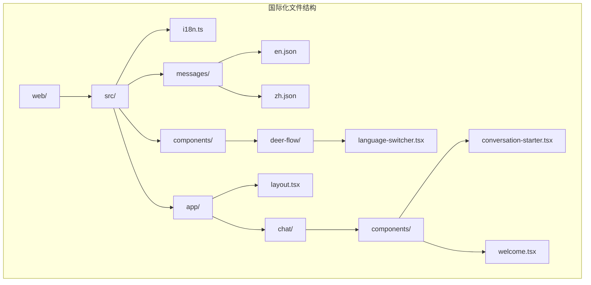
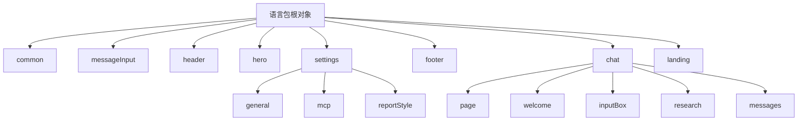
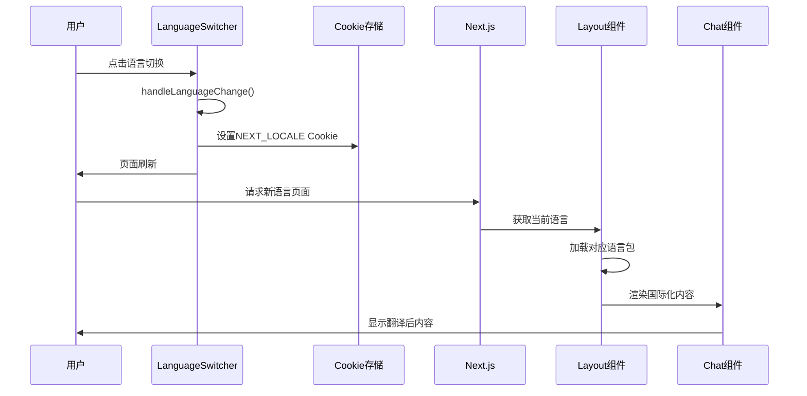
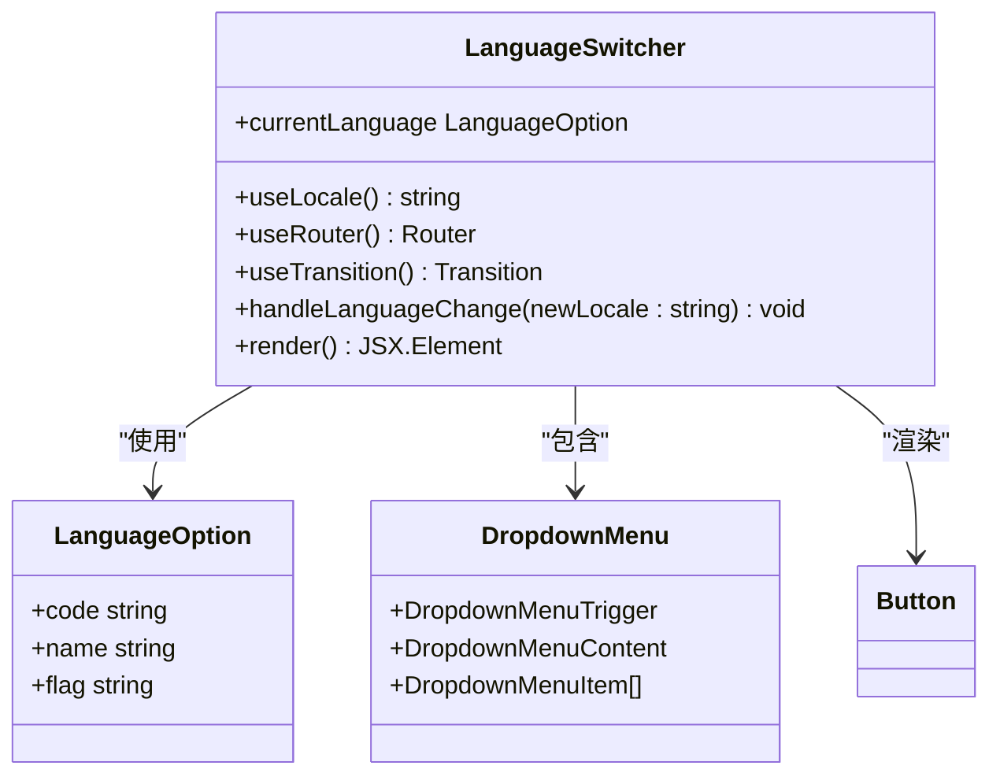
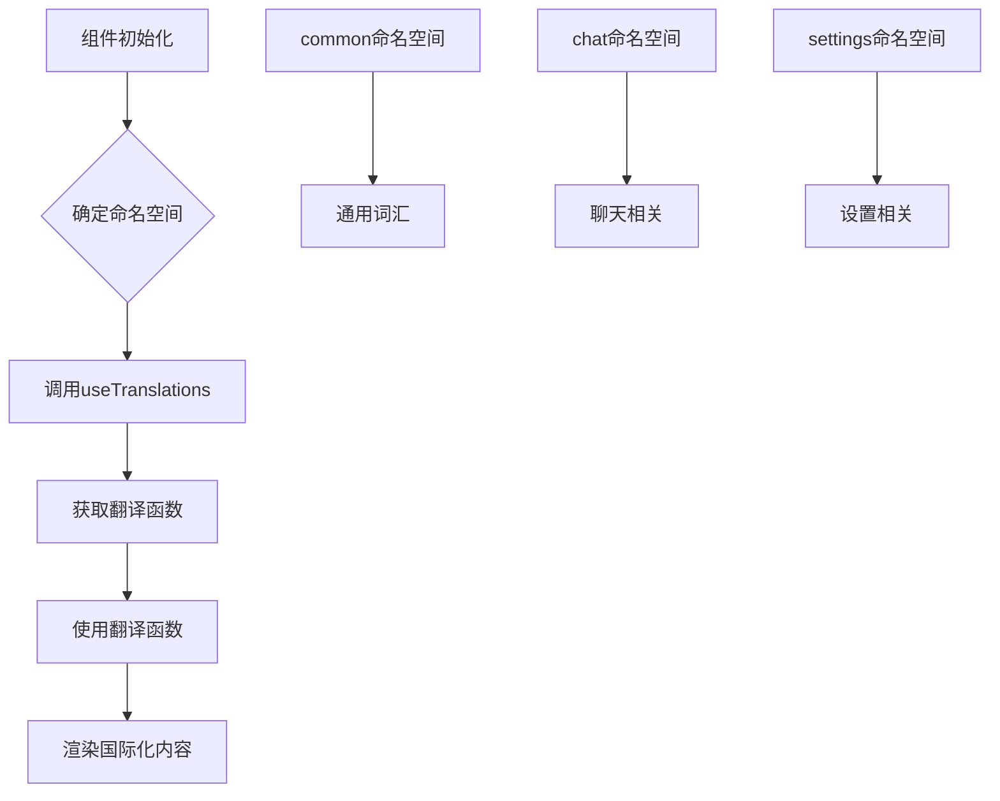
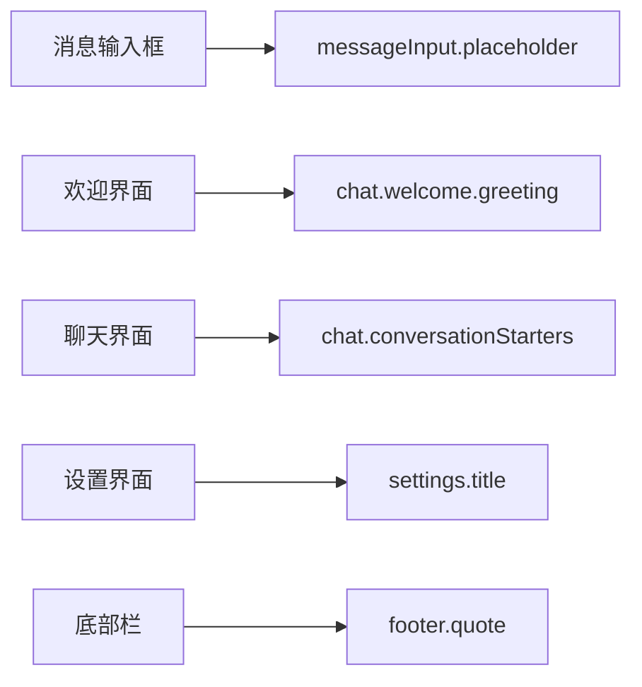
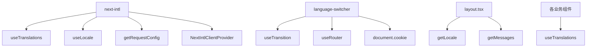

# 国际化支持

<cite>
**本文档中引用的文件**
- [i18n.ts](file://web/src/i18n.ts)
- [en.json](file://web/messages/en.json)
- [zh.json](file://web/messages/zh.json)
- [language-switcher.tsx](file://web/src/components/deer-flow/language-switcher.tsx)
- [layout.tsx](file://web/src/app/layout.tsx)
- [conversation-starter.tsx](file://web/src/app/chat/components/conversation-starter.tsx)
- [welcome.tsx](file://web/src/app/chat/components/welcome.tsx)
- [page.tsx](file://web/src/app/page.tsx)
</cite>

## 目录
1. [简介](#简介)
2. [项目结构](#项目结构)
3. [核心组件](#核心组件)
4. [架构概览](#架构概览)
5. [详细组件分析](#详细组件分析)
6. [依赖关系分析](#依赖关系分析)
7. [性能考虑](#性能考虑)
8. [故障排除指南](#故障排除指南)
9. [结论](#结论)

## 简介

DeerFlow采用了基于Next.js Internationalization (next-intl)的国际化（i18n）实现方案，支持英语（en）和中文（zh）两种语言。该系统通过统一的语言包管理、动态语言切换和本地存储持久化，为用户提供流畅的多语言体验。

国际化系统的核心特点包括：
- 基于next-intl框架的现代化i18n实现
- 支持语言包的动态加载和切换
- 本地Cookie存储的语言偏好设置
- 完整的消息系统集成
- 组件级别的翻译钩子使用

## 项目结构

DeerFlow的国际化文件组织结构清晰，主要包含以下关键目录和文件：



**图表来源**
- [i18n.ts](file://web/src/i18n.ts#L1-L24)
- [language-switcher.tsx](file://web/src/components/deer-flow/language-switcher.tsx#L1-L71)

**章节来源**
- [i18n.ts](file://web/src/i18n.ts#L1-L24)
- [layout.tsx](file://web/src/app/layout.tsx#L1-L73)

## 核心组件

### 国际化配置初始化

国际化系统的初始化通过`i18n.ts`文件完成，该文件负责配置语言环境和消息加载：

```typescript
// 可从共享配置导入
const locales: Array<string> = ["zh", "en"];

export default getRequestConfig(async () => {
  // 从Cookie获取语言环境
  const cookieStore = await cookies();
  const cookieLocale = cookieStore.get("NEXT_LOCALE")?.value;

  // 验证传入的`locale`参数是否有效
  const locale =
    cookieLocale && locales.includes(cookieLocale) ? cookieLocale : "en";

  return {
    messages: (await import(`../messages/${locale}.json`)).default,
    locale,
  };
});
```

### 语言包结构设计

语言包采用层次化的JSON结构，便于管理和维护：



**图表来源**
- [en.json](file://web/messages/en.json#L1-L50)
- [zh.json](file://web/messages/zh.json#L1-L50)

**章节来源**
- [i18n.ts](file://web/src/i18n.ts#L1-L24)
- [en.json](file://web/messages/en.json#L1-L237)
- [zh.json](file://web/messages/zh.json#L1-L237)

## 架构概览

DeerFlow的国际化架构采用分层设计，确保语言切换的流畅性和用户体验的一致性：



**图表来源**
- [language-switcher.tsx](file://web/src/components/deer-flow/language-switcher.tsx#L28-L35)
- [layout.tsx](file://web/src/app/layout.tsx#L28-L30)

## 详细组件分析

### LanguageSwitcher组件分析

LanguageSwitcher是用户界面语言切换的核心组件，实现了完整的语言选择功能：



**图表来源**
- [language-switcher.tsx](file://web/src/components/deer-flow/language-switcher.tsx#L17-L25)
- [language-switcher.tsx](file://web/src/components/deer-flow/language-switcher.tsx#L28-L35)

#### 组件实现细节

LanguageSwitcher组件的关键特性：

1. **状态管理**：使用`useTransition()`确保语言切换的平滑过渡
2. **本地存储**：通过Cookie持久化用户语言偏好
3. **UI反馈**：显示当前选中语言和语言列表
4. **错误处理**：提供默认语言回退机制

```typescript
const handleLanguageChange = (newLocale: string) => {
  startTransition(() => {
    console.log(`updateing locale to ${newLocale}`)
    // 在Cookie中设置语言
    document.cookie = `NEXT_LOCALE=${newLocale}; path=/; max-age=31536000; SameSite=lax`;
    // 刷新页面以应用新语言
    window.location.reload();
  });
};
```

### 国际化钩子使用分析

DeerFlow在多个组件中广泛使用`useTranslations`钩子来实现内容的国际化：



**图表来源**
- [conversation-starter.tsx](file://web/src/app/chat/components/conversation-starter.tsx#L17)
- [welcome.tsx](file://web/src/app/chat/components/welcome.tsx#L9)

#### 实际使用示例

1. **聊天组件中的使用**：
```typescript
const t = useTranslations("chat");
const questions = t.raw("conversationStarters") as string[];
```

2. **通用词汇的使用**：
```typescript
const tCommon = useTranslations("common");
return (
  <Button>{tCommon("cancel")}</Button>
);
```

3. **嵌套命名空间的使用**：
```typescript
const tSettings = useTranslations("settings.general");
return (
  <div>{tSettings("autoAcceptPlan")}</div>
);
```

**章节来源**
- [language-switcher.tsx](file://web/src/components/deer-flow/language-switcher.tsx#L1-L71)
- [conversation-starter.tsx](file://web/src/app/chat/components/conversation-starter.tsx#L1-L55)
- [welcome.tsx](file://web/src/app/chat/components/welcome.tsx#L1-L26)

### 多语言内容集成模式

DeerFlow在不同模块中集成了多语言支持：

#### 消息系统集成



**图表来源**
- [conversation-starter.tsx](file://web/src/app/chat/components/conversation-starter.tsx#L17)
- [welcome.tsx](file://web/src/app/chat/components/welcome.tsx#L9)
- [page.tsx](file://web/src/app/page.tsx#L35-L40)

#### 设置界面集成

设置界面包含了完整的多语言支持，包括：

- **通用设置**：标题、描述、按钮文本
- **MCP服务器设置**：服务器管理、启用/禁用功能
- **报告样式设置**：多种写作风格选项
- **关于页面**：版本信息和版权声明

#### 欢迎页面集成

欢迎页面展示了国际化内容的完整集成：

```typescript
export function Welcome({ className }: { className?: string }) {
  const t = useTranslations("chat.welcome");
  return (
    <motion.div>
      <h3>{t("greeting")}</h3>
      <div>{t("description")}</div>
    </motion.div>
  );
}
```

**章节来源**
- [conversation-starter.tsx](file://web/src/app/chat/components/conversation-starter.tsx#L17-L20)
- [welcome.tsx](file://web/src/app/chat/components/welcome.tsx#L9-L25)
- [page.tsx](file://web/src/app/page.tsx#L35-L40)

## 依赖关系分析

DeerFlow国际化系统的依赖关系清晰明确：



**图表来源**
- [i18n.ts](file://web/src/i18n.ts#L5-L24)
- [language-switcher.tsx](file://web/src/components/deer-flow/language-switcher.tsx#L5-L15)
- [layout.tsx](file://web/src/app/layout.tsx#L28-L30)

**章节来源**
- [i18n.ts](file://web/src/i18n.ts#L1-L24)
- [language-switcher.tsx](file://web/src/components/deer-flow/language-switcher.tsx#L1-L71)
- [layout.tsx](file://web/src/app/layout.tsx#L1-L73)

## 性能考虑

### 语言包加载优化

1. **按需加载**：语言包通过动态导入实现按需加载
2. **缓存机制**：浏览器缓存减少重复加载
3. **预加载策略**：关键语言包提前加载

### 组件渲染优化

1. **useTransition**：确保语言切换的平滑过渡
2. **记忆化**：使用`useMemo`优化日期等静态内容
3. **条件渲染**：根据语言环境选择性渲染内容

### 存储优化

1. **Cookie大小控制**：仅存储必要的语言代码
2. **过期时间设置**：合理设置Cookie有效期
3. **安全策略**：使用SameSite属性防止CSRF攻击

## 故障排除指南

### 常见问题及解决方案

#### 1. 语言切换不生效

**问题症状**：点击语言切换后页面未更新

**解决方案**：
- 检查Cookie设置是否正确
- 确认页面是否完全刷新
- 验证语言包文件是否存在

#### 2. 翻译内容缺失

**问题症状**：某些文本显示为原始键值

**解决方案**：
- 检查语言包JSON格式是否正确
- 验证翻译键名是否匹配
- 确认命名空间路径是否正确

#### 3. 语言包加载失败

**问题症状**：控制台出现404错误

**解决方案**：
- 确认语言包文件路径
- 检查文件权限设置
- 验证构建配置

**章节来源**
- [language-switcher.tsx](file://web/src/components/deer-flow/language-switcher.tsx#L28-L35)
- [i18n.ts](file://web/src/i18n.ts#L15-L20)

## 结论

DeerFlow的国际化支持系统展现了现代Web应用国际化实现的最佳实践。通过next-intl框架的深度集成，系统实现了：

1. **完整的多语言支持**：涵盖所有用户界面元素
2. **流畅的用户体验**：平滑的语言切换和本地存储
3. **可扩展的架构**：易于添加新语言和翻译内容
4. **完善的错误处理**：提供默认语言回退机制

该系统为开发者提供了清晰的国际化开发模式，为用户带来了自然的多语言体验。通过合理的架构设计和最佳实践的应用，DeerFlow成功实现了高质量的国际化功能。

对于希望实现类似功能的项目，建议参考以下最佳实践：
- 使用标准化的命名空间结构
- 实现本地存储持久化
- 提供完整的错误处理机制
- 保持语言包的可维护性