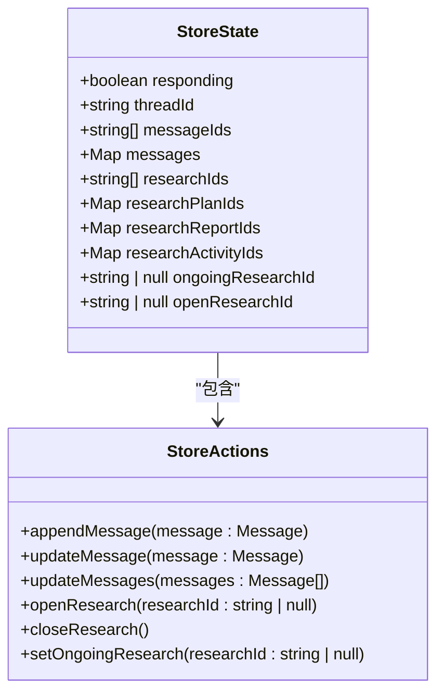
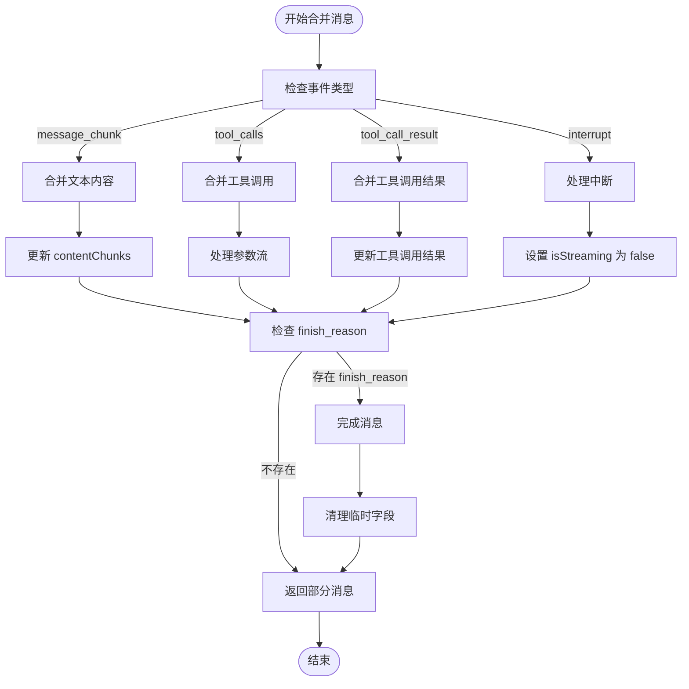
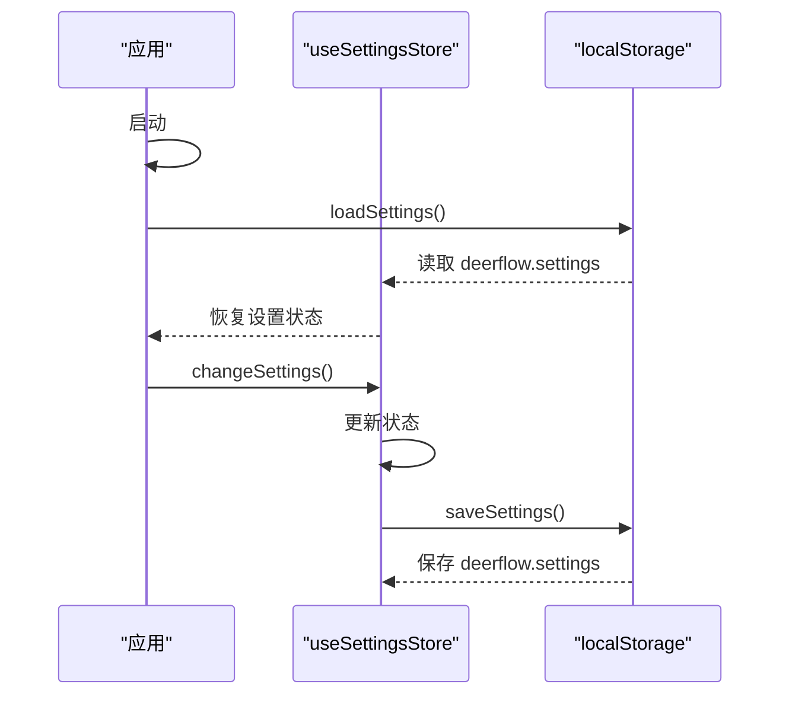
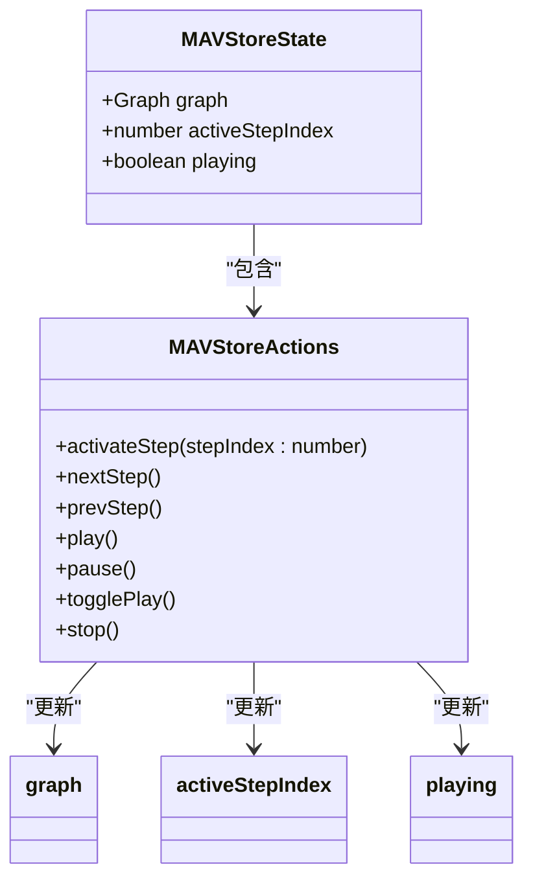
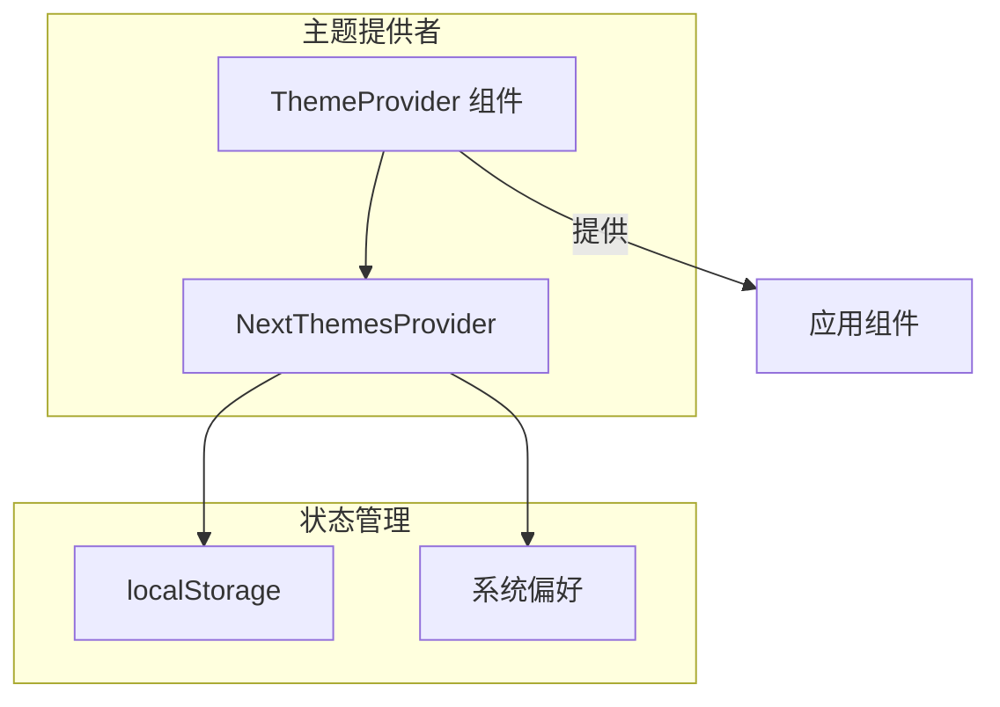
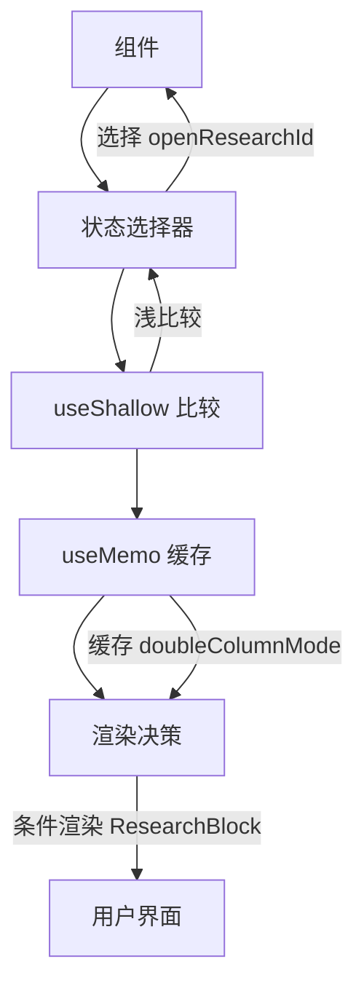

# 状态管理

<cite>
**本文档中引用的文件**  
- [store.ts](file://web/src/core/store/store.ts)
- [settings-store.ts](file://web/src/core/store/settings-store.ts)
- [merge-message.ts](file://web/src/core/messages/merge-message.ts)
- [types.ts](file://web/src/core/messages/types.ts)
- [graph.ts](file://web/src/app/landing/store/graph.ts)
- [mav-store.ts](file://web/src/app/landing/store/mav-store.ts)
- [playbook.ts](file://web/src/app/landing/store/playbook.ts)
- [theme-provider.tsx](file://web/src/components/theme-provider.tsx)
</cite>

## 目录
1. [引言](#引言)
2. [全局状态存储设计](#全局状态存储设计)
3. [消息状态管理](#消息状态管理)
4. [设置状态管理](#设置状态管理)
5. [多智能体可视化状态同步](#多智能体可视化状态同步)
6. [主题切换与持久化](#主题切换与持久化)
7. [状态选择器优化使用](#状态选择器优化使用)
8. [最佳实践与性能优化](#最佳实践与性能优化)

## 引言
DeerFlow 前端采用 Zustand 作为核心状态管理库，构建了一套高效、可维护的状态管理体系。该体系通过模块化设计，将全局状态划分为消息状态、设置状态和多智能体可视化状态等不同领域，实现了关注点分离。系统利用 Zustand 的轻量级特性，避免了传统状态管理库的复杂性，同时通过合理的状态选择器使用，有效防止了不必要的组件重渲染。

## 全局状态存储设计
DeerFlow 的全局状态存储基于 Zustand 实现，采用单一状态树模式，通过 `create` 函数定义状态和操作方法。核心状态存储位于 `store.ts` 文件中，管理着消息、研究活动、线程等关键应用状态。

**Diagram sources**  
- [store.ts](file://web/src/core/store/store.ts#L15-L50)

**Section sources**  
- [store.ts](file://web/src/core/store/store.ts#L1-L404)

## 消息状态管理
消息系统是 DeerFlow 的核心，负责管理用户与多智能体系统之间的交互。消息状态通过 `Map` 数据结构高效存储，支持快速查找和更新。

### 消息合并与状态更新
当接收到流式响应时，系统通过 `mergeMessage` 函数将增量数据合并到现有消息中。该函数根据事件类型（文本块、工具调用、中断等）执行不同的合并逻辑。

**Diagram sources**  
- [merge-message.ts](file://web/src/core/messages/merge-message.ts#L1-L106)
- [types.ts](file://web/src/core/messages/types.ts#L1-L46)

**Section sources**  
- [merge-message.ts](file://web/src/core/messages/merge-message.ts#L1-L106)
- [types.ts](file://web/src/core/messages/types.ts#L1-L46)

## 设置状态管理
设置状态管理模块负责持久化用户偏好设置，如搜索配置、报告风格等。系统利用 `localStorage` 实现设置的持久化存储。

### 设置持久化机制
设置状态通过 `localStorage` 进行持久化，应用启动时自动加载保存的设置，用户更改设置时立即保存。

**Diagram sources**  
- [settings-store.ts](file://web/src/core/store/settings-store.ts#L1-L169)

**Section sources**  
- [settings-store.ts](file://web/src/core/store/settings-store.ts#L1-L169)

## 多智能体可视化状态同步
在 landing 页面中，系统通过 `mav-store` 实现多智能体可视化（MAV）的状态管理，展示智能体协作流程。

### 可视化状态同步机制
`mav-store` 使用 Zustand 管理可视化状态，包括当前激活步骤、播放状态和图形数据。通过 `activateStep` 函数实现步骤间的平滑过渡。

**Diagram sources**  
- [mav-store.ts](file://web/src/app/landing/store/mav-store.ts#L1-L112)
- [graph.ts](file://web/src/app/landing/store/graph.ts#L1-L184)
- [playbook.ts](file://web/src/app/landing/store/playbook.ts#L1-L100)

**Section sources**  
- [mav-store.ts](file://web/src/app/landing/store/mav-store.ts#L1-L112)

## 主题切换与持久化
主题切换功能通过封装 `next-themes` 的 `ThemeProvider` 实现，为应用提供暗色/亮色主题支持。

### 主题管理实现
`theme-provider.tsx` 组件封装了主题提供者，利用 `next-themes` 库管理主题状态和持久化。

**Diagram sources**  
- [theme-provider.tsx](file://web/src/components/theme-provider.tsx#L1-L12)

**Section sources**  
- [theme-provider.tsx](file://web/src/components/theme-provider.tsx#L1-L12)

## 状态选择器优化使用
DeerFlow 通过合理使用 Zustand 的状态选择器和 `useShallow` 钩子，有效避免了不必要的组件重渲染。

### 选择器优化示例
在 `main.tsx` 中，通过选择器仅订阅 `openResearchId` 状态，结合 `useMemo` 实现双栏模式的优化。

**Section sources**  
- [store.ts](file://web/src/core/store/store.ts#L359-L361)
- [main.tsx](file://web/src/app/chat/main.tsx#L1-L46)

## 最佳实践与性能优化
DeerFlow 的状态管理遵循了多项最佳实践，确保了应用的高性能和可维护性。

### 性能问题解决方案
1. **避免过度渲染**：使用 `useShallow` 和精确的状态选择器
2. **批量更新**：通过 `setState` 一次性更新多个相关状态
3. **内存优化**：使用 `Map` 而非对象存储大量消息
4. **异步处理**：在 `try-catch-finally` 块中处理流式响应

**Section sources**  
- [store.ts](file://web/src/core/store/store.ts#L1-L404)
- [settings-store.ts](file://web/src/core/store/settings-store.ts#L1-L169)
- [merge-message.ts](file://web/src/core/messages/merge-message.ts#L1-L106)