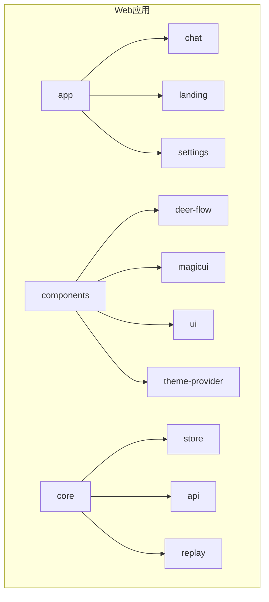
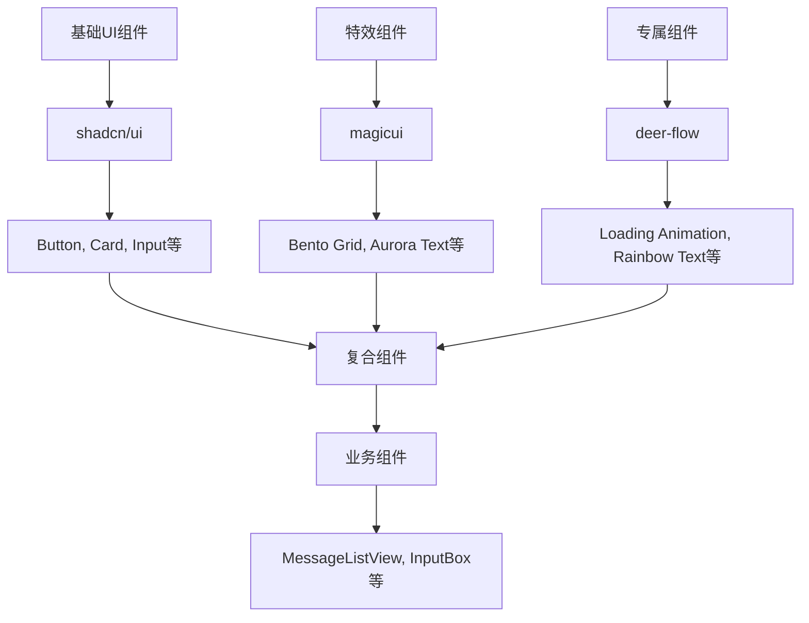
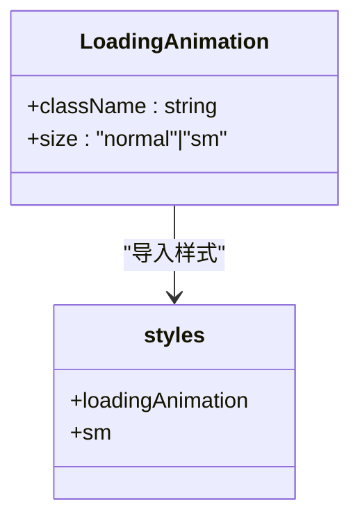
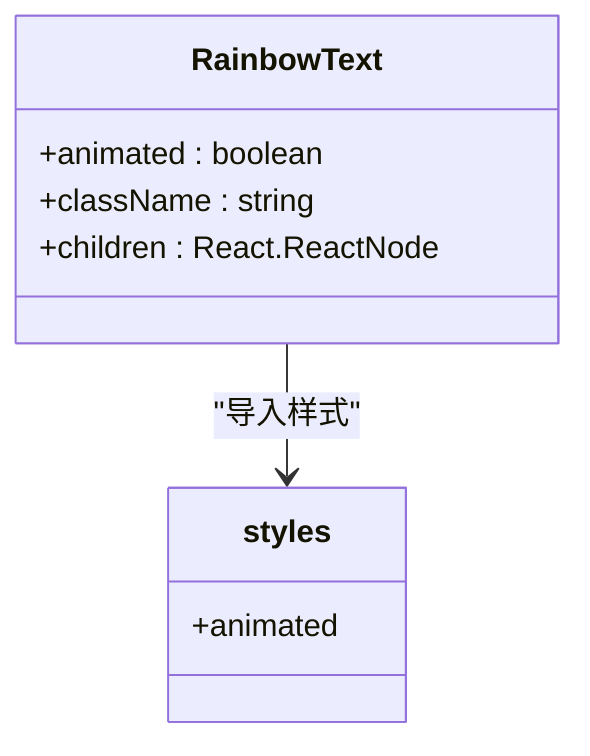
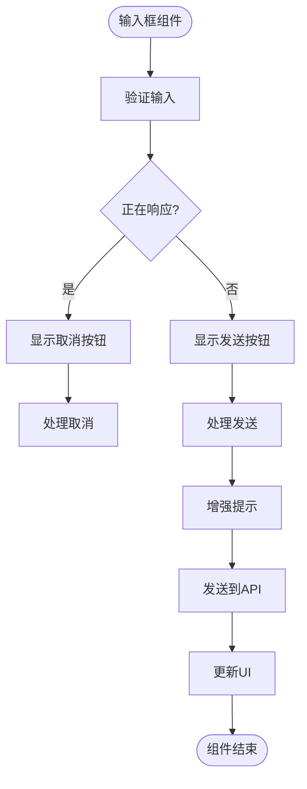
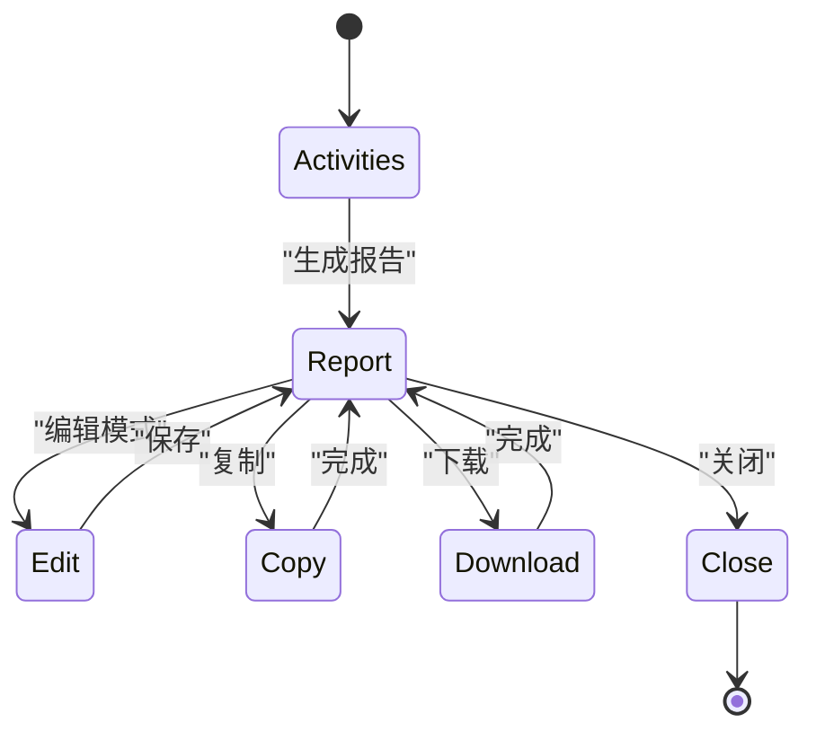
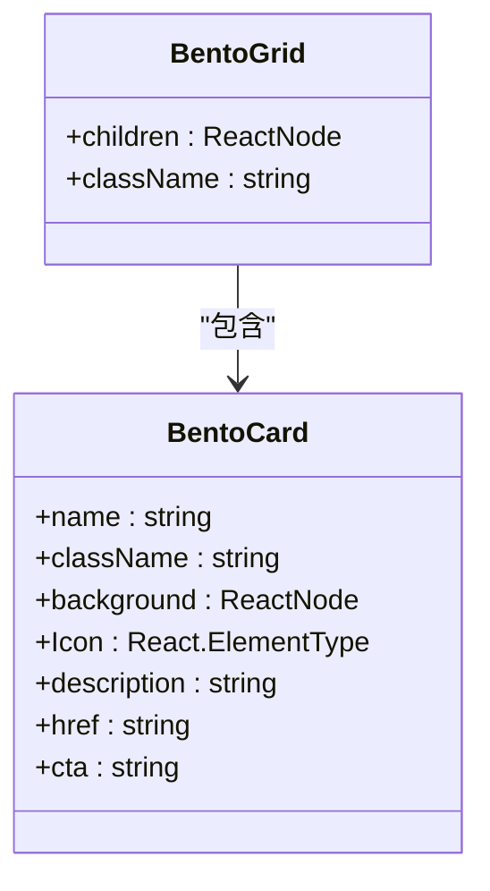
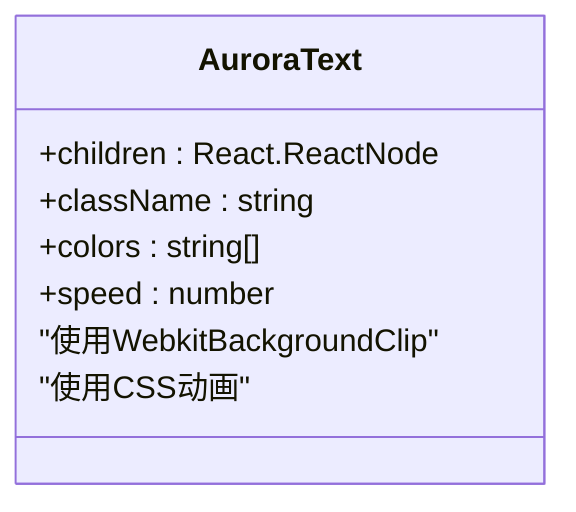
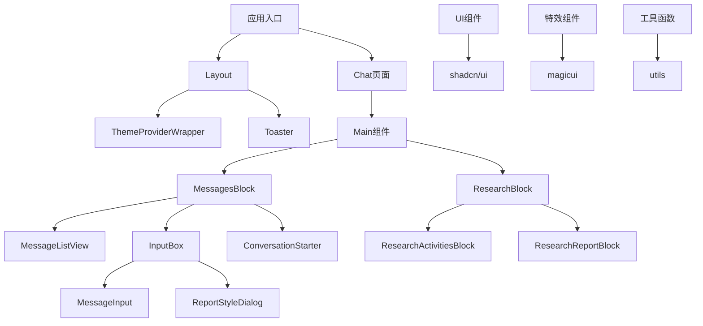

# 组件层次结构

<cite>
**本文档中引用的文件**  
- [loading-animation.tsx](file://web/src/components/deer-flow/loading-animation.tsx)
- [rainbow-text.tsx](file://web/src/components/deer-flow/rainbow-text.tsx)
- [bento-grid.tsx](file://web/src/components/magicui/bento-grid.tsx)
- [aurora-text.tsx](file://web/src/components/magicui/aurora-text.tsx)
- [button.tsx](file://web/src/components/ui/button.tsx)
- [theme-provider-wrapper.tsx](file://web/src/components/deer-flow/theme-provider-wrapper.tsx)
- [layout.tsx](file://web/src/app/layout.tsx)
- [page.tsx](file://web/src/app/chat/page.tsx)
- [main.tsx](file://web/src/app/chat/main.tsx)
- [messages-block.tsx](file://web/src/app/chat/components/messages-block.tsx)
- [input-box.tsx](file://web/src/app/chat/components/input-box.tsx)
- [research-block.tsx](file://web/src/app/chat/components/research-block.tsx)
- [utils.ts](file://web/src/lib/utils.ts)
</cite>

## 目录
1. [介绍](#介绍)
2. [项目结构](#项目结构)
3. [核心组件](#核心组件)
4. [架构概述](#架构概述)
5. [详细组件分析](#详细组件分析)
6. [依赖分析](#依赖分析)
7. [性能考虑](#性能考虑)
8. [故障排除指南](#故障排除指南)
9. [结论](#结论)

## 介绍
DeerFlow 是一个结合语言模型与专用工具的AI研究工具，其前端采用现代化的React组件架构。本文档将深入解析其组件层次结构与设计模式，重点分析UI组件库的封装机制、专属组件的实现原理以及复合组件的嵌套关系。

## 项目结构

DeerFlow前端采用Next.js应用路由架构，组件组织清晰，分为多个功能模块。主要结构包括deer-flow专属组件、magicui特效组件、shadcn/ui基础UI组件等。



**图源**  
- [layout.tsx](file://web/src/app/layout.tsx#L1-L73)
- [components目录](file://web/src/components)

## 核心组件

DeerFlow前端包含多个核心组件，包括deer-flow专属组件、magicui特效组件和基于shadcn/ui的UI组件库。这些组件通过组合模式构建出复杂的用户界面。

**节源**  
- [loading-animation.tsx](file://web/src/components/deer-flow/loading-animation.tsx#L1-L29)
- [rainbow-text.tsx](file://web/src/components/deer-flow/rainbow-text.tsx#L1-L23)
- [bento-grid.tsx](file://web/src/components/magicui/bento-grid.tsx#L1-L85)

## 架构概述

DeerFlow采用分层组件架构，从基础UI组件到复合业务组件，形成清晰的层次结构。应用通过ThemeProviderWrapper统一管理主题，使用Zustand进行状态管理。



**图源**  
- [ui/button.tsx](file://web/src/components/ui/button.tsx#L1-L63)
- [magicui/bento-grid.tsx](file://web/src/components/magicui/bento-grid.tsx#L1-L85)
- [deer-flow/loading-animation.tsx](file://web/src/components/deer-flow/loading-animation.tsx#L1-L29)

## 详细组件分析

### UI组件库封装与扩展

DeerFlow基于shadcn/ui构建UI组件库，通过class-variance-authority实现样式变体管理，使用tailwind-merge进行样式合并。

```mermaid
classDiagram
class Button {
+variant : "default"|"destructive"|"outline"|"secondary"|"ghost"|"link"
+size : "default"|"sm"|"lg"|"icon"
+asChild : boolean
+className : string
}
class cn {
+...inputs : ClassValue[]
+return : string
}
Button --> cn : "使用"
cn --> "tailwind-merge" : "调用"
cn --> "clsx" : "调用"
```

**图源**  
- [button.tsx](file://web/src/components/ui/button.tsx#L1-L63)
- [utils.ts](file://web/src/lib/utils.ts#L1-L10)

### deer-flow专属组件实现

#### 加载动画组件
LoadingAnimation组件使用CSS模块实现三圆点脉冲动画，支持normal和sm两种尺寸。



**图源**  
- [loading-animation.tsx](file://web/src/components/deer-flow/loading-animation.tsx#L1-L29)
- [loading-animation.module.css](file://web/src/components/deer-flow/loading-animation.module.css)

#### 彩虹文本组件
RainbowText组件通过CSS类切换实现文本颜色动画效果，当animated属性为true时应用彩虹动画。



**图源**  
- [rainbow-text.tsx](file://web/src/components/deer-flow/rainbow-text.tsx#L1-L23)
- [rainbow-text.module.css](file://web/src/components/deer-flow/rainbow-text.module.css)

### 聊天界面复合组件

#### Message List View组件
消息列表视图组件负责渲染对话历史，与InputBox组件协同工作，形成完整的聊天界面。

**节源**  
- [messages-block.tsx](file://web/src/app/chat/components/messages-block.tsx#L1-L213)
- [message-list-view.tsx](file://web/src/app/chat/components/message-list-view.tsx)

#### Input Box组件
输入框组件包含消息输入、增强提示、报告风格选择等功能，是用户交互的核心组件。



**图源**  
- [input-box.tsx](file://web/src/app/chat/components/input-box.tsx#L1-L411)

#### Research Block组件
研究块组件提供研究报告和研究活动的双标签视图，支持播客生成、编辑、复制和下载功能。



**图源**  
- [research-block.tsx](file://web/src/app/chat/components/research-block.tsx#L1-L234)

### Magic UI组件应用

#### Bento Grid组件
Bento Grid是响应式网格布局组件，用于landing页面的内容展示，支持背景、图标、描述和CTA按钮。



**图源**  
- [bento-grid.tsx](file://web/src/components/magicui/bento-grid.tsx#L1-L85)

#### Aurora Text组件
Aurora Text是动态渐变文本组件，使用CSS线性渐变和动画实现流动的彩虹文字效果。



**图源**  
- [aurora-text.tsx](file://web/src/components/magicui/aurora-text.tsx#L1-L44)

## 依赖分析

DeerFlow前端依赖关系清晰，采用模块化设计，各组件间耦合度低。



**图源**  
- [layout.tsx](file://web/src/app/layout.tsx#L1-L73)
- [page.tsx](file://web/src/app/chat/page.tsx#L1-L56)
- [main.tsx](file://web/src/app/chat/main.tsx#L1-L46)

## 性能考虑

DeerFlow在性能方面采用了多项优化策略，包括动态导入、Suspense懒加载、memoization记忆化等技术，确保应用流畅运行。

## 故障排除指南

当遇到组件渲染问题时，可检查以下方面：确保主题提供者正确包裹组件树，验证CSS模块加载正常，检查动态导入的组件是否正确配置。

**节源**  
- [theme-provider-wrapper.tsx](file://web/src/components/deer-flow/theme-provider-wrapper.tsx#L1-L30)
- [page.tsx](file://web/src/app/chat/page.tsx#L1-L56)

## 结论

DeerFlow前端组件架构设计良好，采用分层结构和组合模式，实现了高复用性和可维护性。通过shadcn/ui基础组件、magicui特效组件和deer-flow专属组件的有机结合，构建出功能丰富且视觉效果出色的用户界面。