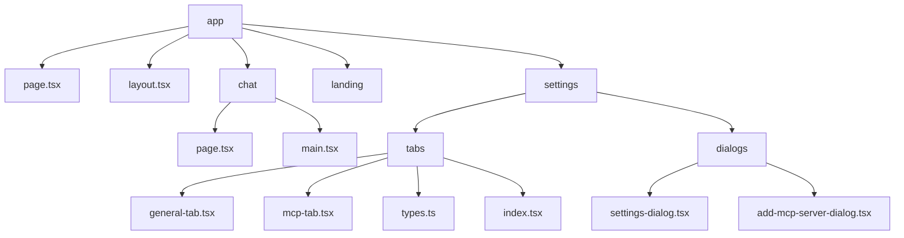
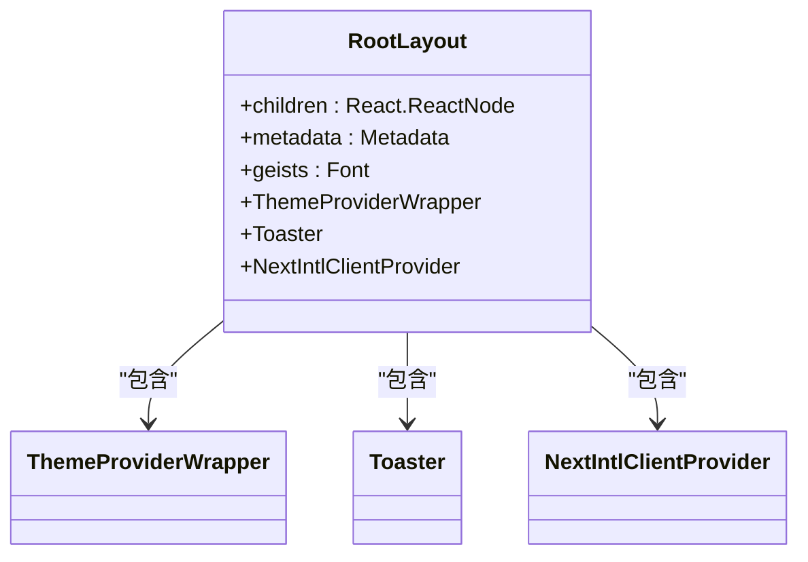
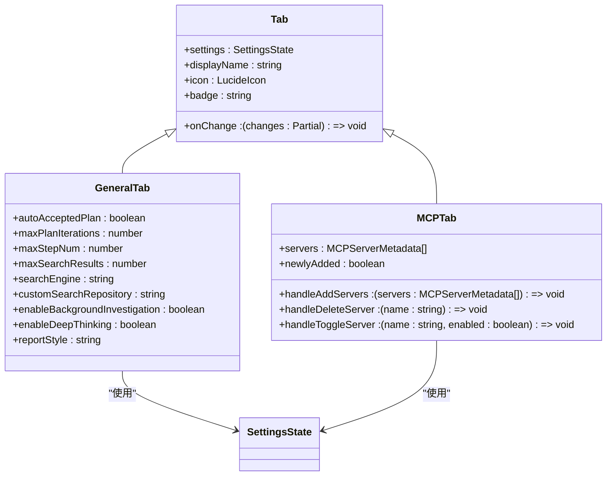
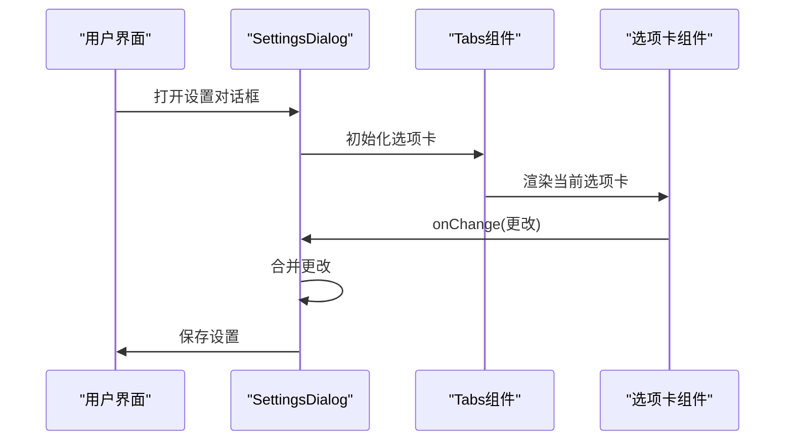
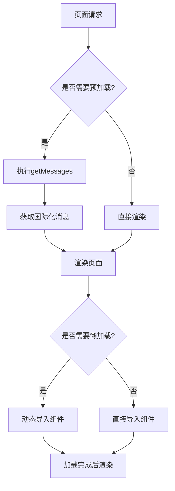
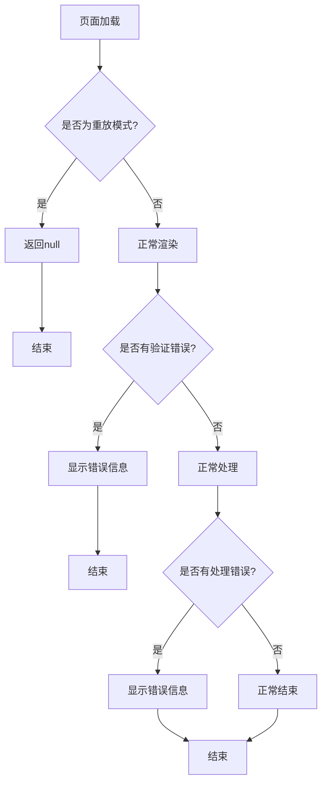

# 路由与导航

<cite>
**本文档中引用的文件**  
- [layout.tsx](file://web/src/app/layout.tsx)
- [page.tsx](file://web/src/app/page.tsx)
- [chat/page.tsx](file://web/src/app/chat/page.tsx)
- [settings/tabs/general-tab.tsx](file://web/src/app/settings/tabs/general-tab.tsx)
- [settings/tabs/mcp-tab.tsx](file://web/src/app/settings/tabs/mcp-tab.tsx)
- [settings/tabs/types.ts](file://web/src/app/settings/tabs/types.ts)
- [settings/tabs/index.tsx](file://web/src/app/settings/tabs/index.tsx)
- [settings/dialogs/settings-dialog.tsx](file://web/src/app/settings/dialogs/settings-dialog.tsx)
- [settings/dialogs/add-mcp-server-dialog.tsx](file://web/src/app/settings/dialogs/add-mcp-server-dialog.tsx)
- [core/store/settings-store.ts](file://web/src/core/store/settings-store.ts)
- [env.js](file://web/src/env.js)
</cite>

## 目录
1. [项目结构](#项目结构)
2. [路由架构与动态路径处理](#路由架构与动态路径处理)
3. [根布局与共享UI组件](#根布局与共享UI组件)
4. [设置页面选项卡导航实现](#设置页面选项卡导航实现)
5. [路由拦截与参数传递](#路由拦截与参数传递)
6. [数据预加载与懒加载策略](#数据预加载与懒加载策略)
7. [路由错误处理与调试](#路由错误处理与调试)

## 项目结构

DeerFlow项目采用Next.js App Router架构，其路由系统基于文件系统的约定。项目的核心路由文件位于`web/src/app`目录下，通过文件和目录结构定义应用的路由。



**Diagram sources**
- [web/src/app/page.tsx](file://web/src/app/page.tsx)
- [web/src/app/chat/page.tsx](file://web/src/app/chat/page.tsx)
- [web/src/app/settings/tabs/general-tab.tsx](file://web/src/app/settings/tabs/general-tab.tsx)
- [web/src/app/settings/tabs/mcp-tab.tsx](file://web/src/app/settings/tabs/mcp-tab.tsx)

**Section sources**
- [web/src/app/page.tsx](file://web/src/app/page.tsx)
- [web/src/app/chat/page.tsx](file://web/src/app/chat/page.tsx)
- [web/src/app/settings/tabs/general-tab.tsx](file://web/src/app/settings/tabs/general-tab.tsx)
- [web/src/app/settings/tabs/mcp-tab.tsx](file://web/src/app/settings/tabs/mcp-tab.tsx)

## 路由架构与动态路径处理

DeerFlow基于Next.js App Router的路由架构通过文件系统自动映射URL路径。根目录下的`page.tsx`文件对应根路由`/`，`chat/page.tsx`对应`/chat`路由，`settings`目录下的文件对应`/settings`路由。

```mermaid
graph LR
Root[/] --> HomePage[page.tsx]
Chat[/chat] --> ChatPage[chat/page.tsx]
Settings[/settings] --> SettingsPage[settings/tabs/index.tsx]
```

**Diagram sources**
- [web/src/app/page.tsx](file://web/src/app/page.tsx)
- [web/src/app/chat/page.tsx](file://web/src/app/chat/page.tsx)
- [web/src/app/settings/tabs/index.tsx](file://web/src/app/settings/tabs/index.tsx)

**Section sources**
- [web/src/app/page.tsx](file://web/src/app/page.tsx)
- [web/src/app/chat/page.tsx](file://web/src/app/chat/page.tsx)

## 根布局与共享UI组件

根布局文件`layout.tsx`定义了应用的全局结构和共享UI组件。它使用Next.js的布局系统为所有页面提供一致的外观和行为。



**Diagram sources**
- [web/src/app/layout.tsx](file://web/src/app/layout.tsx)

**Section sources**
- [web/src/app/layout.tsx](file://web/src/app/layout.tsx)

## 设置页面选项卡导航实现

设置页面的选项卡导航通过`settings/tabs`目录下的组件实现。`general-tab`和`mcp-tab`组件分别处理常规设置和MCP服务器设置，通过状态同步机制保持数据一致性。



**Diagram sources**
- [web/src/app/settings/tabs/types.ts](file://web/src/app/settings/tabs/types.ts)
- [web/src/app/settings/tabs/general-tab.tsx](file://web/src/app/settings/tabs/general-tab.tsx)
- [web/src/app/settings/tabs/mcp-tab.tsx](file://web/src/app/settings/tabs/mcp-tab.tsx)

**Section sources**
- [web/src/app/settings/tabs/types.ts](file://web/src/app/settings/tabs/types.ts)
- [web/src/app/settings/tabs/general-tab.tsx](file://web/src/app/settings/tabs/general-tab.tsx)
- [web/src/app/settings/tabs/mcp-tab.tsx](file://web/src/app/settings/tabs/mcp-tab.tsx)

## 路由拦截与参数传递

路由拦截和参数传递通过Next.js的客户端路由功能实现。`SettingsDialog`组件使用`Dialog`和`Tabs`组件管理导航状态，通过回调函数实现参数传递和状态同步。



**Diagram sources**
- [web/src/app/settings/dialogs/settings-dialog.tsx](file://web/src/app/settings/dialogs/settings-dialog.tsx)
- [web/src/app/settings/tabs/general-tab.tsx](file://web/src/app/settings/tabs/general-tab.tsx)
- [web/src/app/settings/tabs/mcp-tab.tsx](file://web/src/app/settings/tabs/mcp-tab.tsx)

**Section sources**
- [web/src/app/settings/dialogs/settings-dialog.tsx](file://web/src/app/settings/dialogs/settings-dialog.tsx)
- [web/src/app/settings/tabs/general-tab.tsx](file://web/src/app/settings/tabs/general-tab.tsx)
- [web/src/app/settings/tabs/mcp-tab.tsx](file://web/src/app/settings/tabs/mcp-tab.tsx)

## 数据预加载与懒加载策略

路由级数据预加载与懒加载策略通过Next.js的数据获取函数和动态导入实现。`layout.tsx`中的`getMessages`函数预加载国际化消息，`chat/page.tsx`中的`dynamic`函数实现组件的懒加载。



**Diagram sources**
- [web/src/app/layout.tsx](file://web/src/app/layout.tsx)
- [web/src/app/chat/page.tsx](file://web/src/app/chat/page.tsx)

**Section sources**
- [web/src/app/layout.tsx](file://web/src/app/layout.tsx)
- [web/src/app/chat/page.tsx](file://web/src/app/chat/page.tsx)

## 路由错误处理与调试

路由错误处理通过Next.js的错误边界和状态管理实现。`SettingsDialog`组件在重放模式下返回null，避免在重放会话中显示设置对话框。



**Diagram sources**
- [web/src/app/settings/dialogs/settings-dialog.tsx](file://web/src/app/settings/dialogs/settings-dialog.tsx)
- [web/src/app/settings/dialogs/add-mcp-server-dialog.tsx](file://web/src/app/settings/dialogs/add-mcp-server-dialog.tsx)

**Section sources**
- [web/src/app/settings/dialogs/settings-dialog.tsx](file://web/src/app/settings/dialogs/settings-dialog.tsx)
- [web/src/app/settings/dialogs/add-mcp-server-dialog.tsx](file://web/src/app/settings/dialogs/add-mcp-server-dialog.tsx)