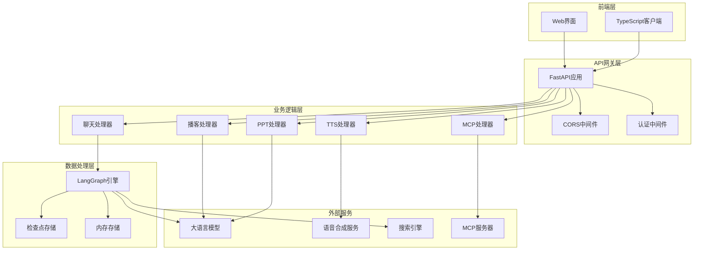
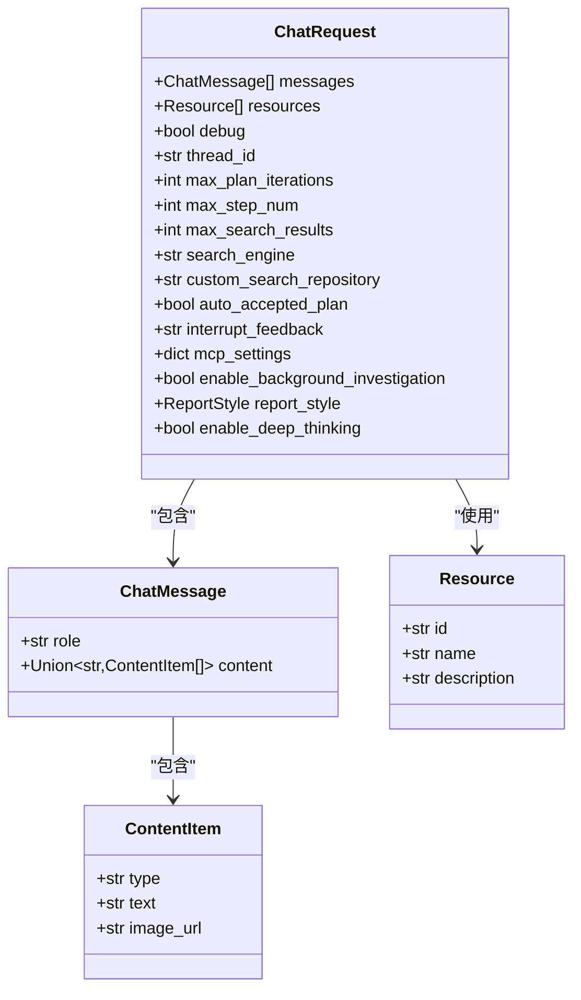
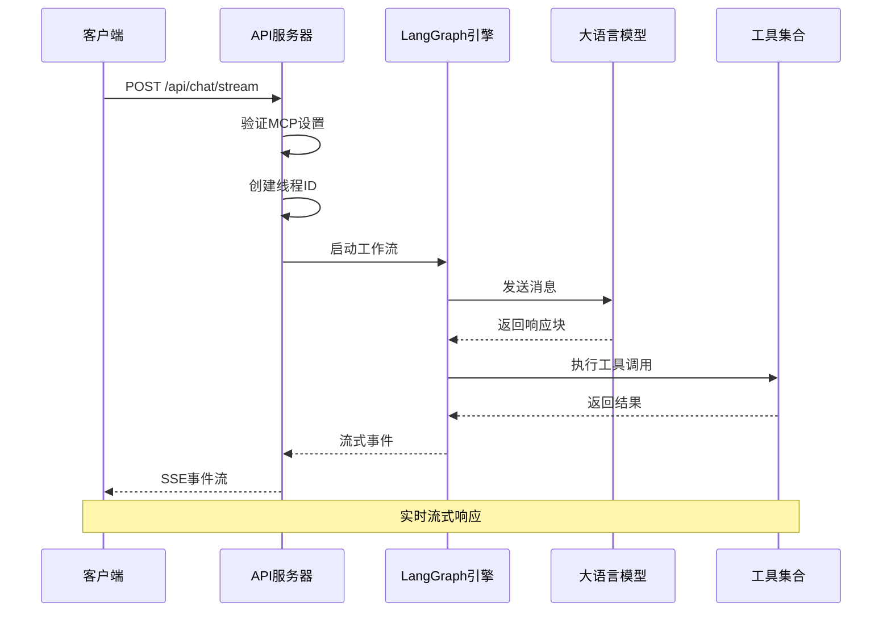
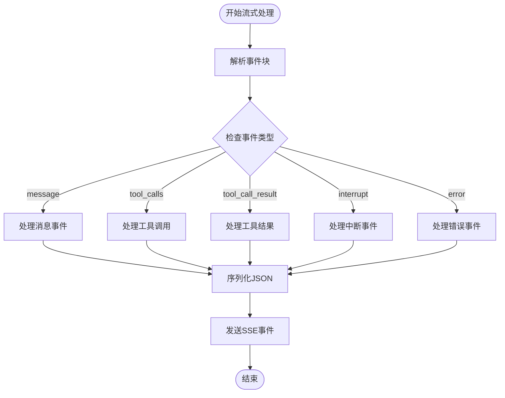
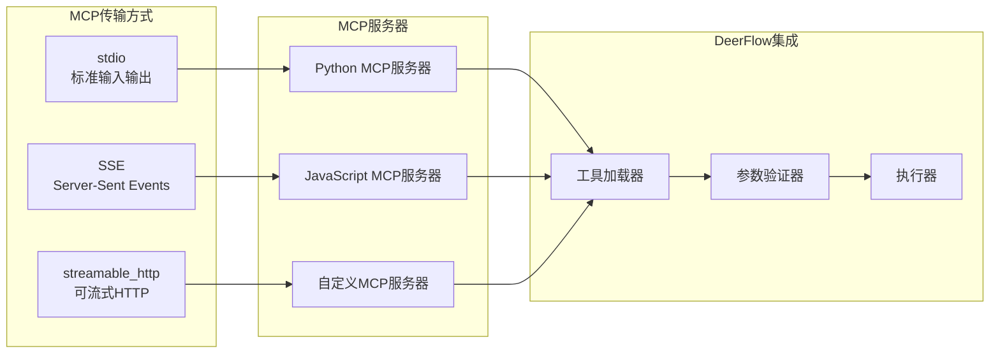

# DeerFlow API服务详细文档

<cite>
**本文档引用的文件**
- [src/server/app.py](file://src/server/app.py)
- [src/server/chat_request.py](file://src/server/chat_request.py)
- [src/server/mcp_request.py](file://src/server/mcp_request.py)
- [web/src/core/sse/fetch-stream.ts](file://web/src/core/sse/fetch-stream.ts)
- [web/src/core/sse/StreamEvent.ts](file://web/src/core/sse/StreamEvent.ts)
- [src/config/configuration.py](file://src/config/configuration.py)
- [src/config/loader.py](file://src/config/loader.py)
- [main.py](file://main.py)
- [server.py](file://server.py)
</cite>

## 目录
1. [简介](#简介)
2. [项目架构概览](#项目架构概览)
3. [FastAPI应用核心实现](#fastapi应用核心实现)
4. [数据模型与验证](#数据模型与验证)
5. [RESTful端点详解](#restful端点详解)
6. [流式响应机制](#流式响应机制)
7. [MCP协议支持](#mcp协议支持)
8. [API认证与安全](#api认证与安全)
9. [性能优化与监控](#性能优化与监控)
10. [故障排除指南](#故障排除指南)
11. [总结](#总结)

## 简介

DeerFlow API服务是一个基于FastAPI构建的现代化AI代理服务平台，提供了完整的聊天对话、文本转语音、播客生成、PPT制作、文本增强等功能。该服务采用流式响应机制，支持Server-Sent Events (SSE)，为用户提供实时的AI交互体验。

### 核心特性

- **流式聊天对话**：支持实时消息流和工具调用
- **多模态内容处理**：支持文本、图像等多种内容类型
- **MCP协议集成**：支持多种传输方式的MCP服务器
- **多格式输出**：支持音频、PPT、播客等多种媒体格式
- **智能配置管理**：动态配置和环境变量支持
- **可扩展架构**：模块化设计，易于扩展新功能

## 项目架构概览



**图表来源**
- [src/server/app.py](file://src/server/app.py#L1-L688)
- [src/server/chat_request.py](file://src/server/chat_request.py#L1-L116)

## FastAPI应用核心实现

### 应用初始化与配置

FastAPI应用通过精心设计的配置系统实现了高度的可定制性和安全性：

```python
app = FastAPI(
    title="DeerFlow API",
    description="API for Deer",
    version="0.1.0",
)
```

### 中间件配置

应用集成了多层次的安全和功能中间件：

```python
# CORS中间件配置
allowed_origins_str = get_str_env("ALLOWED_ORIGINS", "http://localhost:3000")
allowed_origins = [origin.strip() for origin in allowed_origins_str.split(",")]

app.add_middleware(
    CORSMiddleware,
    allow_origins=allowed_origins,
    allow_credentials=True,
    allow_methods=["GET", "POST", "OPTIONS"],
    allow_headers=["*"],
)
```

### 环境变量管理系统

系统通过统一的环境变量加载器管理配置：

```python
def get_bool_env(name: str, default: bool = False) -> bool:
    val = os.getenv(name)
    if val is None:
        return default
    return str(val).strip().lower() in {"1", "true", "yes", "y", "on"}

def get_str_env(name: str, default: str = "") -> str:
    val = os.getenv(name)
    return default if val is None else str(val).strip()
```

**章节来源**
- [src/server/app.py](file://src/server/app.py#L40-L60)
- [src/config/loader.py](file://src/config/loader.py#L10-L30)

## 数据模型与验证

### 聊天请求模型

ChatRequest是核心的数据模型，支持复杂的聊天交互：



**图表来源**
- [src/server/chat_request.py](file://src/server/chat_request.py#L20-L60)

### MCP请求模型

MCP协议支持通过专门的请求模型实现：

```python
class MCPServerMetadataRequest(BaseModel):
    transport: str = Field(...)
    command: Optional[str] = None
    args: Optional[List[str]] = None
    url: Optional[str] = None
    env: Optional[Dict[str, str]] = None
    headers: Optional[Dict[str, str]] = None
    timeout_seconds: Optional[int] = None
```

### 验证与序列化

系统使用Pydantic进行数据验证和自动序列化，确保输入数据的完整性和安全性。

**章节来源**
- [src/server/chat_request.py](file://src/server/chat_request.py#L1-L116)
- [src/server/mcp_request.py](file://src/server/mcp_request.py#L1-L65)

## RESTful端点详解

### 流式聊天端点

**端点**: `/api/chat/stream`  
**方法**: `POST`  
**媒体类型**: `text/event-stream`



**图表来源**
- [src/server/app.py](file://src/server/app.py#L70-L120)

### 文本转语音端点

**端点**: `/api/tts`  
**方法**: `POST`  
**媒体类型**: `audio/mp3`

支持Volcengine TTS API的完整功能：
- 多种语音类型选择
- 音频参数调节（速度、音量、音调）
- SSML文本支持
- 前端处理选项

### 播客生成端点

**端点**: `/api/podcast/generate`  
**方法**: `POST`  
**媒体类型**: `audio/mp3`

### PPT生成端点

**端点**: `/api/ppt/generate`  
**方法**: `POST`  
**媒体类型**: `application/vnd.openxmlformats-officedocument.presentationml.presentation`

### 文本增强端点

**端点**: `/api/prompt/enhance`  
**方法**: `POST`  
**媒体类型**: `application/json`

支持多种报告风格的提示词增强：
- 学术风格
- 科普风格  
- 新闻风格
- 社交媒体风格

### MCP元数据端点

**端点**: `/api/mcp/server/metadata`  
**方法**: `POST`  
**媒体类型**: `application/json`

支持多种MCP传输协议：
- stdio（标准输入输出）
- SSE（Server-Sent Events）
- streamable_http（可流式HTTP）

**章节来源**
- [src/server/app.py](file://src/server/app.py#L70-L200)
- [src/server/app.py](file://src/server/app.py#L400-L500)

## 流式响应机制

### SSE实现原理

DeerFlow使用Server-Sent Events技术实现实时流式响应：

```typescript
export async function* fetchStream(
  url: string,
  init: RequestInit,
): AsyncIterable<StreamEvent> {
  const response = await fetch(url, {
    method: "POST",
    headers: {
      "Content-Type": "application/json",
      "Cache-Control": "no-cache",
    },
    ...init,
  });
  
  const reader = response.body
    ?.pipeThrough(new TextDecoderStream())
    .getReader();
    
  while (true) {
    const { done, value } = await reader.read();
    if (done) break;
    // 解析SSE事件
    const event = parseEvent(chunk);
    if (event) {
      yield event;
    }
  }
}
```

### 事件类型系统



**图表来源**
- [web/src/core/sse/fetch-stream.ts](file://web/src/core/sse/fetch-stream.ts#L10-L50)

### 客户端处理流程

```typescript
interface StreamEvent {
  event: string;
  data: string;
}

// 事件解析函数
function parseEvent(chunk: string) {
  let resultEvent = "message";
  let resultData: string | null = null;
  
  for (const line of chunk.split("\n")) {
    const pos = line.indexOf(": ");
    if (pos === -1) continue;
    
    const key = line.slice(0, pos);
    const value = line.slice(pos + 2);
    
    if (key === "event") {
      resultEvent = value;
    } else if (key === "data") {
      resultData = value;
    }
  }
  
  return {
    event: resultEvent,
    data: resultData,
  } as StreamEvent;
}
```

**章节来源**
- [web/src/core/sse/fetch-stream.ts](file://web/src/core/sse/fetch-stream.ts#L1-L74)
- [web/src/core/sse/StreamEvent.ts](file://web/src/core/sse/StreamEvent.ts#L1-L8)

## MCP协议支持

### MCP协议概述

MCP（Model Context Protocol）是一个标准化的协议，用于AI模型与外部工具和服务之间的通信。DeerFlow支持多种MCP传输方式：



**图表来源**
- [src/server/mcp_request.py](file://src/server/mcp_request.py#L10-L30)

### MCP配置管理

```python
class MCPServerMetadataRequest(BaseModel):
    transport: str = Field(
        ..., description="传输类型 (stdio 或 sse 或 streamable_http)"
    )
    command: Optional[str] = Field(None, description="命令 (stdio类型)")
    args: Optional[List[str]] = Field(None, description="命令参数")
    url: Optional[str] = Field(None, description="SSE服务器URL")
    env: Optional[Dict[str, str]] = Field(None, description="环境变量")
    headers: Optional[Dict[str, str]] = Field(None, description="HTTP头部")
    timeout_seconds: Optional[int] = Field(None, description="超时时间")
```

### MCP工具加载机制

系统通过`load_mcp_tools`函数动态加载MCP工具：

```python
async def load_mcp_tools(
    server_type: str,
    command: Optional[str] = None,
    args: Optional[List[str]] = None,
    url: Optional[str] = None,
    env: Optional[Dict[str, str]] = None,
    headers: Optional[Dict[str, str]] = None,
    timeout_seconds: int = 300,
):
    # 根据传输类型创建相应的客户端
    if server_type == "stdio":
        client = StdIOMCPClient(command, args, env)
    elif server_type == "sse":
        client = SSEMCPClient(url, headers)
    elif server_type == "streamable_http":
        client = HTTPMCPClient(url, headers)
    
    # 加载可用工具
    tools = await client.load_tools()
    return tools
```

**章节来源**
- [src/server/mcp_request.py](file://src/server/mcp_request.py#L1-L65)

## API认证与安全

### CORS配置

DeerFlow实现了灵活的跨域资源共享配置：

```python
# 从环境变量加载允许的源
allowed_origins_str = get_str_env("ALLOWED_ORIGINS", "http://localhost:3000")
allowed_origins = [origin.strip() for origin in allowed_origins_str.split(",")]

app.add_middleware(
    CORSMiddleware,
    allow_origins=allowed_origins,
    allow_credentials=True,
    allow_methods=["GET", "POST", "OPTIONS"],
    allow_headers=["*"],
)
```

### MCP服务器访问控制

MCP功能需要显式启用：

```python
# 检查MCP服务器配置是否启用
mcp_enabled = get_bool_env("ENABLE_MCP_SERVER_CONFIGURATION", False)

if request.mcp_settings and not mcp_enabled:
    raise HTTPException(
        status_code=403,
        detail="MCP服务器配置已禁用。设置ENABLE_MCP_SERVER_CONFIGURATION=true以启用MCP功能。",
    )
```

### 速率限制策略

虽然当前实现未包含显式的速率限制，但系统通过以下机制间接实现：

- **连接池管理**：PostgreSQL和MongoDB检查点的连接池
- **递归限制**：通过`AGENT_RECURSION_LIMIT`控制深度
- **超时控制**：MCP操作的默认300秒超时

**章节来源**
- [src/server/app.py](file://src/server/app.py#L50-L70)
- [src/server/app.py](file://src/server/app.py#L75-L85)

## 性能优化与监控

### 异步处理架构

DeerFlow采用完全异步的设计：

```python
async def _astream_workflow_generator(
    messages: List[dict],
    thread_id: str,
    resources: List[Resource],
    max_plan_iterations: int,
    max_step_num: int,
    max_search_results: int,
    search_engine: str,
    custom_search_repository: str,
    auto_accepted_plan: bool,
    interrupt_feedback: str,
    mcp_settings: dict,
    enable_background_investigation: bool,
    report_style: ReportStyle,
    enable_deep_thinking: bool,
):
    # 异步流式处理
    async for event in _stream_graph_events(
        graph, workflow_input, workflow_config, thread_id
    ):
        yield event
```

### 检查点持久化

系统支持多种检查点存储后端：

```python
checkpoint_saver = get_bool_env("LANGGRAPH_CHECKPOINT_SAVER", False)
checkpoint_url = get_str_env("LANGGRAPH_CHECKPOINT_DB_URL", "")

if checkpoint_saver and checkpoint_url != "":
    if checkpoint_url.startswith("postgresql://"):
        # PostgreSQL检查点
        async with AsyncConnectionPool(checkpoint_url, kwargs=connection_kwargs) as conn:
            checkpointer = AsyncPostgresSaver(conn)
            await checkpointer.setup()
            graph.checkpointer = checkpointer
    elif checkpoint_url.startswith("mongodb://"):
        # MongoDB检查点
        async with AsyncMongoDBSaver.from_conn_string(checkpoint_url) as checkpointer:
            graph.checkpointer = checkpointer
```

### 内存管理

```python
in_memory_store = InMemoryStore()
graph = build_graph_with_memory()

# 使用内存存储进行状态管理
graph.store = in_memory_store
```

**章节来源**
- [src/server/app.py](file://src/server/app.py#L300-L400)
- [src/server/app.py](file://src/server/app.py#L150-L200)

## 故障排除指南

### 常见错误码

| 错误码 | 描述 | 解决方案 |
|--------|------|----------|
| 400 | 请求参数无效 | 检查请求体格式和必填字段 |
| 403 | MCP功能被禁用 | 设置`ENABLE_MCP_SERVER_CONFIGURATION=true` |
| 404 | 资源未找到 | 检查资源ID或路径 |
| 500 | 内部服务器错误 | 查看日志获取详细信息 |

### 调试技巧

1. **启用调试模式**：
```bash
python main.py --debug
```

2. **检查环境变量**：
```python
# 验证关键配置
print(get_str_env("ALLOWED_ORIGINS"))
print(get_bool_env("ENABLE_MCP_SERVER_CONFIGURATION"))
```

3. **监控流式响应**：
```javascript
// 客户端调试
fetch('/api/chat/stream', {
  method: 'POST',
  body: JSON.stringify({ messages: [...] })
}).then(response => {
  const reader = response.body.getReader();
  // 处理流式数据
});
```

### 日志配置

```python
import logging

logger = logging.getLogger(__name__)

# 记录重要事件
logger.info(f"Recursion limit set to: {parsed_limit}")
logger.warning(f"Invalid integer value for {name}: {val}")
logger.exception("Error during graph execution")
```

**章节来源**
- [src/server/app.py](file://src/server/app.py#L600-L650)

## 总结

DeerFlow API服务是一个功能完整、架构清晰的现代AI服务平台。其主要优势包括：

### 技术特点

- **流式架构**：基于SSE的实时响应机制
- **模块化设计**：清晰的组件分离和职责划分
- **异步处理**：完全异步的并发处理能力
- **可扩展性**：支持多种传输协议和工具集成

### 功能完整性

- **多模态支持**：文本、图像、音频等多种内容类型
- **智能工具集成**：MCP协议支持和动态工具加载
- **多样化输出**：播客、PPT、音频等丰富格式
- **灵活配置**：环境变量驱动的配置管理

### 安全性考虑

- **CORS控制**：灵活的跨域资源共享配置
- **访问控制**：MCP功能的显式启用机制
- **错误处理**：完善的异常处理和错误响应

### 性能优化

- **异步处理**：避免阻塞操作，提高并发能力
- **检查点持久化**：支持多种数据库后端
- **内存管理**：合理的内存使用和清理策略

DeerFlow API服务为开发者提供了一个强大而灵活的AI服务基础平台，支持快速构建各种AI驱动的应用程序。通过其模块化的设计和丰富的功能集，开发者可以轻松扩展和定制以满足特定需求。